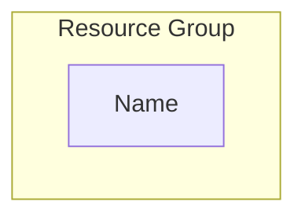
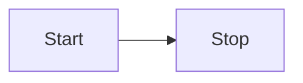

# SkyCraft Lab Guide Creation Standards

> **Source of Truth** for creating standardized lab guides (`lab-guide-X.Y.md`). This document serves as both the standard and the template.

---

## 1. Required Sections (In Order)

Every lab guide must include these sections with their emojis:

| Section                 | Emoji | Purpose                                         |
| ----------------------- | ----- | ----------------------------------------------- |
| Title                   | n/a   | `# Lab X.Y: [Title] ([Duration] hours)`         |
| Learning Objectives     | 🎯    | 3-6 measurable outcomes with action verbs       |
| Architecture Overview   | 🏗️    | **MANDATORY** Mermaid diagram                   |
| Real-World Scenario     | 📋    | Business context with SkyCraft deployment       |
| Estimated Time          | ⏱️    | Section-by-section breakdown                    |
| Prerequisites           | ✅    | Dependencies, roles, required knowledge         |
| **Deep Dive (Concept)** | 📖    | **Theory/Concepts before Configuration**        |
| **Configuration**       | ⚙️    | **Step-by-step instructions (Multi-Modal)**     |
| Lab Checklist           | ✅    | Quick verification (link to detailed checklist) |
| Troubleshooting         | 🔧    | 5-10 common issues with solutions               |
| Knowledge Check         | 🎓    | 5-7 Q&A with `<details>` answers                |
| Additional Resources    | 📚    | Microsoft Learn and docs links                  |
| Module Navigation       | 📌    | Previous/next lab links                         |
| Lab Summary             | 📝    | Accomplishments recap                           |

---

## 2. Mermaid Diagram Requirements

**Color Scheme** (MANDATORY):

```mermaid
style HubResources fill:#e1f5ff,stroke:#0078d4,stroke-width:3px   # Platform/Hub
style DevResources fill:#fff4e1,stroke:#f39c12,stroke-width:2px   # Development
style ProdResources fill:#ffe1e1,stroke:#e74c3c,stroke-width:2px  # Production
```

**Must Include**:

- Resource group boundaries (`subgraph`)
- Resource names following STANDARDS.md
- CIDR ranges for networks
- Relationship arrows with labels

---

## 3. Deep Dive & Decision Standards (New!)

To increase educational value, every lab **must** explain the _why_ before the _how_.

### 3.1 Deep Dive Concepts

- **Placement**: Before any configuration steps.
- **Content**: Explain the core technology (e.g., "What is a Storage Account?").
- **Comparison**: Use tables to compare options (SKUs, Tiers, Redundancy).

**Example**:

| Feature    | Standard LRS | Standard GRS |
| :--------- | :----------- | :----------- |
| Cost       | $            | $$           |
| Durability | 11 nines     | 16 nines     |

### 3.2 SkyCraft Decision Callouts

Explicitly state **why** we chose a specific configuration for SkyCraft.

**Format**:

> **SkyCraft Choice**: We use **Standard_LRS** for Development to save costs, but **Standard_GRS** for Production to ensure disaster recovery.

---

## 4. Multi-Modal Step Formatting (New!)

Labs must teach **Portal (GUI)**, **CLI**, and **PowerShell** methods where applicable. Use distinct subsections or tabs if your markdown renderer supports them.

### Structure

````markdown
### Step X.Y.Z: [Action Name]

#### Option 1: Azure Portal (GUI)

1. Navigate to **[Azure Portal section]**
2. Click **[Button/Link]**
3. Fill in the details:

| Field    | Value                             |
| -------- | --------------------------------- |
| Name     | `exact-value-following-standards` |
| Location | **Sweden Central**                |

#### Option 2: Azure CLI

```bash
# Variables
RG="dev-skycraft-swc-rg"
LOC="swedencentral"

# Command
az group create --name $RG --location $LOC
```
````

#### Option 3: PowerShell

```powershell
# Variables
$RG = "dev-skycraft-swc-rg"
$Loc = "swedencentral"

# Command
New-AzResourceGroup -Name $RG -Location $Loc
```

**Expected Result**: [Describe what success looks like regardless of method]

````

**Rules**:

- **Bold** for Azure Portal UI elements
- `Code formatting` for values to enter/variables
- Tables for multi-field forms
- Always include **Expected Result** after step groups

---

## 5. Knowledge Check Format

```markdown
## 🎓 Knowledge Check

1. **[Question about concept]?**

   <details>
     <summary>**Click to see the answer**</summary>

   **Answer**: [Detailed explanation with reasoning]
   </details>
````

> **CRITICAL**: Knowledge Checks have **PROVIDED ANSWERS** in `<details>` blocks. This distinguishes them from Checklist Reflection Questions (which are open-ended).

---

## 6. Writing Style

| Aspect         | Correct                    | Incorrect                           |
| -------------- | -------------------------- | ----------------------------------- |
| Voice          | Active: "Create a VNet"    | Passive: "A VNet should be created" |
| Address        | "You will configure..."    | "The student configures..."         |
| Instructions   | Imperative: "Click Create" | "You should click Create"           |
| Portal Name    | Azure Portal               | "portal", "azure portal"            |
| Region         | Sweden Central             | east us, myRegion                   |
| Resource Names | `prod-skycraft-swc-rg`     | "myResourceGroup"                   |

---

## 7. Time Guidelines

| Module  | Typical Duration |
| ------- | ---------------- |
| Lab 1.x | 2-3 hours each   |
| Lab 2.x | 1.5-3 hours each |
| Lab 3.x | 3-4 hours each   |

Break into 15-30 minute sections, include reading/understanding time.

---

## 8. Anti-Patterns to AVOID

| ❌ Don't                              | ✅ Do                                            |
| ------------------------------------- | ------------------------------------------------ |
| Long theory blocks (5+ paragraphs)    | Brief context (2-3 paragraphs), then action      |
| Vague results: "VNet will be created" | Specific: "VNet appears with status 'Available'" |
| Bare instructions without context     | Explain WHY: "Must be `/26` (64 IPs minimum)"    |
| Generic names: `myResourceGroup`      | Standard names: `platform-skycraft-swc-rg`       |
| No troubleshooting section            | 5-10 issues with symptoms and solutions          |

## 8. Common Pitfalls & Troubleshooting Patterns

### 8.1 Feature Mismatch Checks

- **Symptom (E001)**: Option missing in Azure Portal dropdown.
- **Cause**: SKU/Region conflict (e.g., Archive tier missing because ZRS is selected).
- **Fix**: Check `BICEP_STANDARDS.md` or Azure docs for matrix.

### 8.2 Environment hygiene (E002)

- **Symptom**: Guide instructs user to use a 'dev' resource while in 'prod'.
- **Fix**: **Strictly forbidden**. Updates standards if needed, but maintain isolation.

### 8.3 Hierarchy rules (L004)

- **Concept**: Parent resource settings override child settings.
- **Example**: Storage Account `AllowBlobPublicAccess=false` overrides Container `Public Access Level`.

---

## 9. Lab Guide Boilerplate

Copy this template when creating a new lab guide:

````markdown
# Lab X.Y: [Title] ([Duration] hours)

## 🎯 Learning Objectives

By completing this lab, you will:

- [Objective 1]
- [Objective 2]
- [Objective 3]

---

## 🏗️ Architecture Overview

### Topology


````

### Logic Flow / Lifecycle



## 📋 Real-World Scenario

**Situation**: [Business Context]

**Your Task**: [What student will do]

**Business Impact**:

- [Benefit 1]
- [Benefit 2]

## ⏱️ Estimated Time: X hours

- **Section 1**: [Description] (X min)
- **Section 2**: [Description] (X min)

## ✅ Prerequisites

Before starting this lab:

- [ ] Completed Lab X.Y
- [ ] [Required role] assigned
- [ ] Understanding of [concept 1], [concept 2]

---

## 📖 Section 1: [Concept Name] (Duration)

### Deep Dive: [Technology]

[2-3 paragraph explanation of the technology]

| Feature     | Option A | Option B |
| :---------- | :------- | :------- |
| Cost        | Low      | High     |
| Performance | Standard | Premium  |

> **SkyCraft Choice**: We chose **Option A** because [justification related to cost/performance/requirements].

---

## ⚙️ Section 2: [Configuration Task] (Duration)

### Step X.Y.1: [Action Name]

#### Option 1: Azure Portal

1. Navigate to **[Azure Portal section]**
2. Click **[Button/Link]**
3. Fill in the details:

| Field    | Value              |
| :------- | :----------------- |
| Name     | `value`            |
| Location | **Sweden Central** |

4. Click **[Action]**

#### Option 2: Azure CLI

```bash
# Variables
RG="skycraft-RG"
LOC="swedencentral"

# Command
az group create --name $RG --location $LOC
```

#### Option 3: PowerShell

```powershell
# Variables
$RG = "skycraft-RG"
$Loc = "swedencentral"

# Command
New-AzResourceGroup -Name $RG -Location $Loc
```

**Expected Result**: [Describe success state for verification]

---

## ✅ Lab Checklist

- [ ] [Major accomplishment 1]
- [ ] [Major accomplishment 2]
- [ ] All resources tagged correctly

**For detailed verification**, see [lab-checklist-X.Y.md](lab-checklist-X.Y.md)

## 🔧 Troubleshooting

### Issue 1: [Problem]

**Symptom**: [Description]

**Solution**:

- [Step to resolve]

## 🎓 Knowledge Check

1. **[Question]?**

   <details>
     <summary>**Click to see the answer**</summary>

   **Answer**: [Explanation]
   </details>

## 📚 Additional Resources

- [Azure Documentation Link]
- [Microsoft Learn Module]

## 📌 Module Navigation

[← Back to Module X Index](../README.md)

[Next Lab: X.Y →](link)

## 📝 Lab Summary

**What You Accomplished:**

✅ [Achievement 1]
✅ [Achievement 2]
✅ [Achievement 3]

**Time Spent**: ~X hours

**Ready for Lab X.Y?** Next, you'll [preview of next lab].

```

---

## 10. Quality Checklist

Before finalizing any lab guide, verify:

- [ ] Title includes lab number and duration
- [ ] 3-6 clear learning objectives
- [ ] **Mermaid diagram included**
- [ ] Real-world scenario provides business context
- [ ] **Deep Dive section included** with comparison table
- [ ] **SkyCraft Choice** callout included
- [ ] **Multi-modal instructions** (Portal/CLI/PS) where applicable
- [ ] Time breakdown adds up to total
- [ ] Prerequisites list all dependencies
- [ ] Every section has 📖 or ⚙️ emoji
- [ ] Steps numbered sequentially
- [ ] Each step group has "Expected Result"
- [ ] All resource names follow STANDARDS.md
- [ ] All tags match BICEP_STANDARDS.md
- [ ] 5-7 Knowledge Check questions with `<details>` answers
- [ ] Troubleshooting covers common issues
- [ ] Module navigation links work
- [ ] **No validation commands** (belong in checklist)
- [ ] **No open-ended reflection questions** (belong in checklist)

---

**Rule of Thumb**: If it **teaches or explains**, it belongs in the lab guide. If it **verifies or assesses**, it belongs in the checklist.
```
