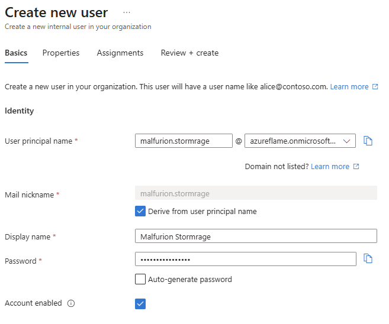
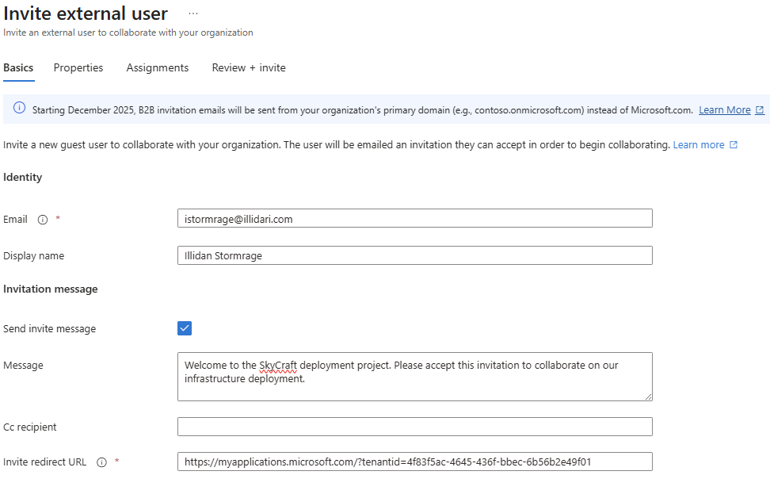
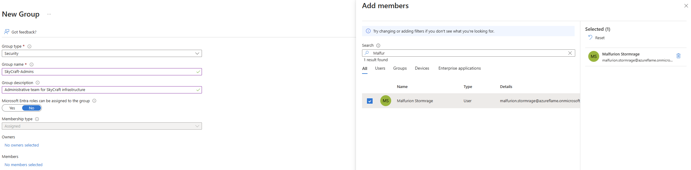
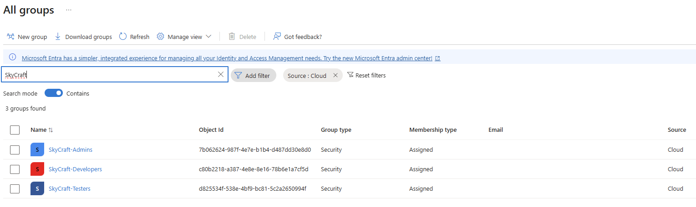
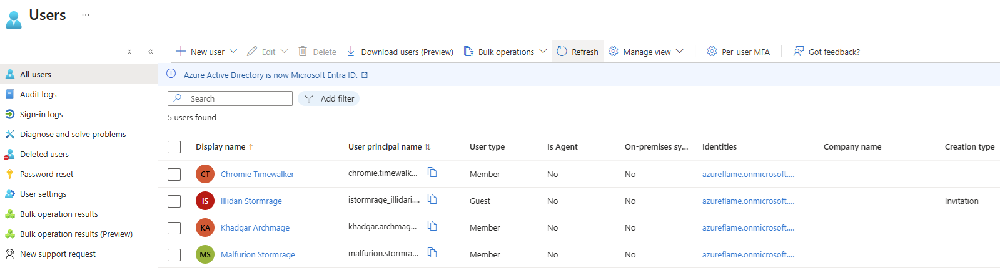
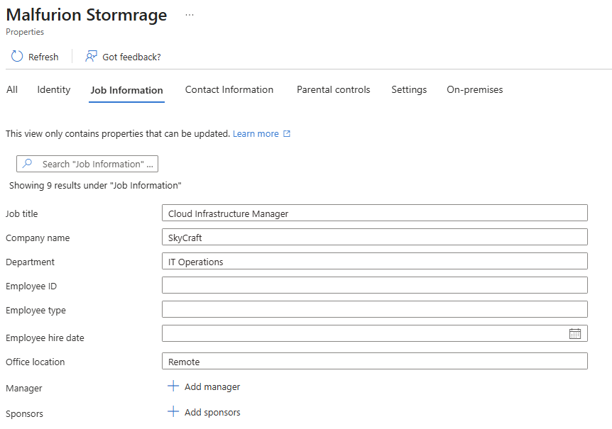
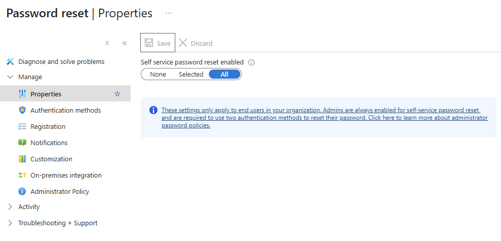
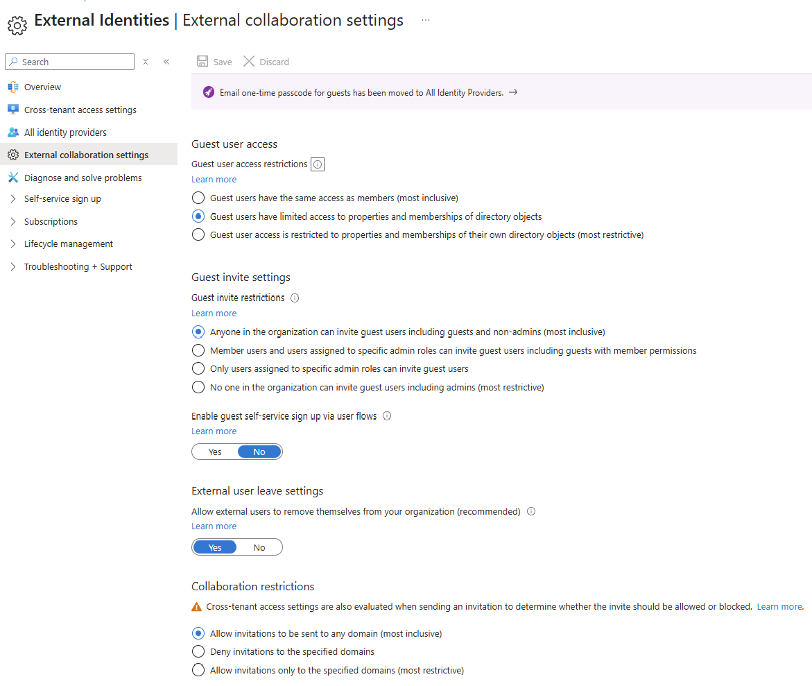

# Lab 1.1: Manage Microsoft Entra Users and Groups (3 hours)

## 🎯 Lab Objectives

By completing this lab, you will:

- Create individual users in Microsoft Entra ID
- Create security groups and assign members
- Manage user properties and licenses
- Understand delegated administration
- Set up the identity structure for the SkyCraft team

---

## 🏗️ Architecture Overview

You'll set up the following identity structure in Microsoft Entra ID:

```mermaid
graph TB
    subgraph "Microsoft Entra ID (SkyCraft Tenant)"
        AdminGroup[SkyCraft-Admins]
        DevGroup[SkyCraft-Developers]
        TestGroup[SkyCraft-Testers]

        Malfurion[Malfurion Stormrage<br/>(Admin)]
        Khadgar[Khadgar Archmage<br/>(Developer)]
        Chromie[Chromie Timewalker<br/>(Tester)]
        Illidan[Illidan Stormrage<br/>(Guest)]
    end

    Malfurion -->|Member| AdminGroup
    Khadgar -->|Member| DevGroup
    Chromie -->|Member| TestGroup
    Illidan -.->|Guest| AdminGroup

    style AdminGroup fill:#e1f5ff,stroke:#0078d4,stroke-width:2px
    style DevGroup fill:#fff4e1,stroke:#f39c12,stroke-width:2px
    style TestGroup fill:#ffe1e1,stroke:#e74c3c,stroke-width:2px
```

---

## 📋 Real-World Scenario

**Situation**: You're setting up the SkyCraft deployment team. The organization needs:

- An administrator who manages all resources (Malfurion Stormrage)
- Developers who deploy and modify infrastructure (Khadgar Archmage)
- Testers who monitor and report issues (Chromie Timewalker)
- External consultant with guest access (Illidan Stormrage)

**Your Task**: Create these users, organize them into groups, and set up the team structure.

---

## ⏱️ Estimated Time: 3 hours

- **Section 1**: Create individual users (45 min)
- **Section 2**: Create security groups (30 min)
- **Section 3**: Assign licenses and properties (30 min)
- **Section 4**: Set up external access (15 min)
- **Hands-on Practice**: Recreate from scratch (30 min)
- **Validation**: Complete checklist (30 min)

---

## ✅ Prerequisites

- [ ] Azure Portal access
- [ ] Global Administrator or User Administrator role
- [ ] Tenant with at least 5 user licenses available
- [ ] Understanding of user vs. group concepts

---

## 📖 Section 1: Create Individual Users (45 minutes)

### Step 1.1.1: Access Microsoft Entra ID

1. Open **Azure Portal** (https://portal.azure.com)
2. Search for **"Microsoft Entra ID"** in the search bar
3. Click on the result to open the Entra ID admin center

**Expected Result**: You see the Entra ID dashboard with options for Users, Groups, and Roles.

### Step 1.1.2: Create First User (Malfurion Stormrage)

1. In the left sidebar, click **Users** → **All users**
2. Click **+ New user** → **Create new user**
3. Fill in the following details:

| Field               | Value                                            |
| ------------------- | ------------------------------------------------ |
| User principal name | malfurion.stormrage@[yourtenant].onmicrosoft.com |
| Display name        | Malfurion Stormrage                              |
| Password (initial)  | LoveAzeroth!2004                                 |

4. Click **Create**

**Expected Result**: New user appears in the user list with "Malfurion Stormrage" display name.



### Step 1.1.3: Create Second User (Khadgar Archmage)

1. Click **+ New user** → **Create new user**
2. Fill in the details:

| Field               | Value                                         |
| ------------------- | --------------------------------------------- |
| User principal name | khadgar.archmage@[yourtenant].onmicrosoft.com |
| Display name        | Khadgar Archmage                              |
| Password            | LoveAzeroth!2004                              |

3. Click **Create**

### Step 1.1.4: Create Third User (Chromie Timewalker)

Repeat the process with:

| Field               | Value                                           |
| ------------------- | ----------------------------------------------- |
| User principal name | chromie.timewalker@[yourtenant].onmicrosoft.com |
| Display name        | Chromie Timewalker                              |
| Password            | LoveAzeroth!2004                                |

### Step 1.1.5: Create Guest User (Illidan Stormrage)

1. Click **+ New user** → **Invite external user**
2. Fill in:

| Field        | Value                   |
| ------------ | ----------------------- |
| Email        | istormrage@illidari.com |
| Display name | Illidan Stormrage       |

3. Add custom invitation message:

   > "Welcome to the SkyCraft deployment project. Please accept this invitation to collaborate on our infrastructure deployment."

4. Click **Invite**

**Expected Result**: Invitation email sent to external partner.



---

## 📖 Section 2: Create Security Groups (30 minutes)

### Step 1.1.6: Create First Group (Admins)

1. In left sidebar, click **Groups** → **All groups**
2. Click **+ New group**
3. Fill in:

| Field             | Value                                           |
| ----------------- | ----------------------------------------------- |
| Group type        | Security                                        |
| Group name        | SkyCraft-Admins                                 |
| Group description | Administrative team for SkyCraft infrastructure |
| Membership type   | Assigned                                        |

4. Click **Create**

### Step 1.1.7: Add Members to Admin Group

1. Open the **SkyCraft-Admins** group
2. Click **Members** → **+ Add members**
3. Search for and select:
   - Malfurion Stormrage
4. Click **Select**

**Expected Result**: Malfurion Stormrage now appears in group members.



### Step 1.1.8: Create Second Group (Developers)

1. Click **+ New group**
2. Create group with details:

| Field             | Value                                    |
| ----------------- | ---------------------------------------- |
| Group type        | Security                                 |
| Group name        | SkyCraft-Developers                      |
| Group description | Development team for SkyCraft deployment |
| Membership type   | Assigned                                 |

3. Add member: **Khadgar Archmage**

### Step 1.1.9: Create Third Group (Testers)

1. Click **+ New group**
2. Create group:

| Field             | Value                       |
| ----------------- | --------------------------- |
| Group type        | Security                    |
| Group name        | SkyCraft-Testers            |
| Group description | Testing and monitoring team |
| Membership type   | Assigned                    |

3. Add member: **Chromie Timewalker**

**Expected Result**: Three security groups created with appropriate members.



---

## 📖 Section 3: Manage User Properties and Licenses (30 minutes)



### Step 1.1.10: Configure User Properties

1. Open **All Users** and click on **Malfurion Stormrage**
2. In the **Manage** section, click **Properties**
3. Update the following:

| Property   | Value                        |
| ---------- | ---------------------------- |
| Job title  | Cloud Infrastructure Manager |
| Department | IT Operations                |
| Office     | Remote                       |
| Manager    | [Leave blank]                |

4. Click **Save**



### Step 1.1.11: Review License Information

1. Click **Licenses** in the admin user's profile
2. Note the current license status
3. If licenses are available, click **+ Assignments**
4. Select a license (e.g., Azure AD Premium P1)
5. Click **Save**

**Expected Result**: License assignment shows in the user's profile.

### Step 1.1.12: Configure SSPR (Self-Service Password Reset)

1. Go back to **Microsoft Entra ID** home page
2. Click **Password reset** in the left sidebar
3. Click **All** to enable for all users
4. Click **Save**

**Expected Result**: All users can now reset their own passwords using SSPR.



---

## 📖 Section 4: External User Management (15 minutes)

### Step 1.1.13: Accept Guest Invitation (Simulated)

1. In production, the external partner would receive an email
2. They would click the invitation link and sign in
3. For this lab, navigate to **All Users** and verify the guest user status

**Expected Result**: Guest user appears in the user list with "Guest" designation.

### Step 1.1.14: Review B2B Collaboration Settings

1. Go back to Microsoft Entra ID home page
2. Click **External Identities** in left sidebar
3. Click **External Collaboration Settings**
4. Review the current settings for guest access



---

## ✅ Lab Checklist

Complete this checklist to verify you've successfully completed the lab:

- [ ] Created 3 internal users (Malfurion, Khadgar, Chromie)
- [ ] Created 1 guest user (Illidan)
- [ ] Created 3 security groups (Admins, Developers, Testers)
- [ ] Added appropriate users to each group
- [ ] Updated user properties (job title, department)
- [ ] Assigned licenses to at least one user
- [ ] Enabled SSPR for all users
- [ ] All 4 users appear in the "All Users" list
- [ ] All 3 groups appear with correct members
- [ ] No errors in the audit log

---

## 🔧 Troubleshooting

**Issue**: "Insufficient privileges" error when creating users

- **Solution**: Verify you have Global Administrator or User Administrator role
- **Check**: Azure Portal → Entra ID → My role assignments

**Issue**: Cannot create groups

- **Solution**: Ensure group creation is enabled in security defaults
- **Fix**: Entra ID → Security defaults → Turn off security defaults (if needed)

**Issue**: License assignment fails

- **Solution**: Verify licenses are available in your tenant
- **Check**: Entra ID → Licenses → All products → View available licenses

---

## 📚 Additional Resources

- [Create or delete users - Microsoft Learn](https://learn.microsoft.com/en-us/entra/fundamentals/how-to-create-delete-users-basic)
- [Create groups and add members - Microsoft Learn](https://learn.microsoft.com/en-us/entra/fundamentals/how-to-manage-groups)
- [License assignment - Microsoft Learn](https://learn.microsoft.com/en-us/entra/identity/users/licensing-service-plan-reference)

---

## 🎓 Knowledge Check

Answer these questions to verify understanding:

1. **Q**: What's the difference between "Create new user" and "Invite external user"?  
   **A**: Create new user adds an internal user to your tenant; Invite external user sends an invitation to an external person who signs in with their own identity.

2. **Q**: Why would you use security groups instead of assigning permissions to individual users?  
   **A**: Groups simplify management—you assign permissions once to a group, then add/remove users from the group as needed.

3. **Q**: What is SSPR and why is it useful?  
   **A**: SSPR allows users to reset their own passwords without IT involvement, reducing support burden and improving user experience.

---

## 🔗 Next Steps

1. Move to **Lab 1.2: Manage Access & RBAC**
2. You'll use the users and groups created here to demonstrate role assignments
3. Keep this security group structure for Module 2 labs

---

## 📝 Lab Summary

**What You Accomplished**:

- ✅ Created identity structure for SkyCraft team (4 users, 3 groups)
- ✅ Organized team into logical security groups
- ✅ Configured user properties and licenses
- ✅ Enabled self-service password reset
- ✅ Established external collaboration framework

**Time Spent**: ~3 hours

---

## 📌 Module Navigation

- [← Back to Module 1 Index](../README.MD)
- [Lab 1.2: Manage Access & RBAC →](../1.2-rbac/lab-guide-1.2.md)
