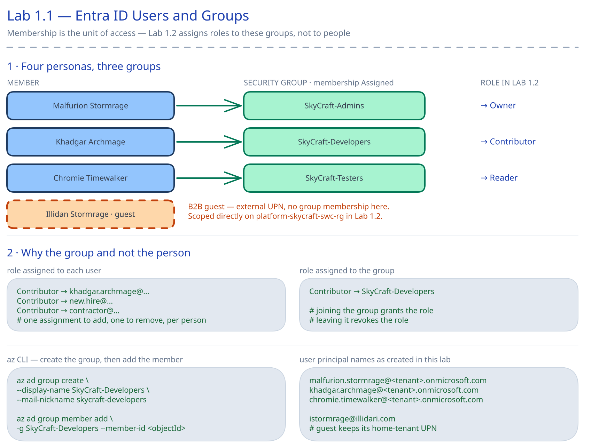
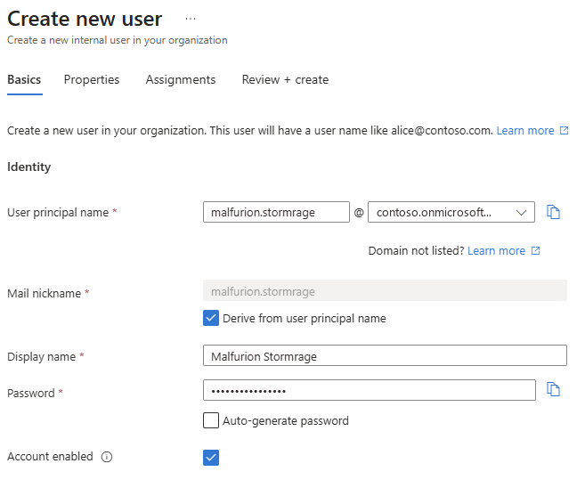
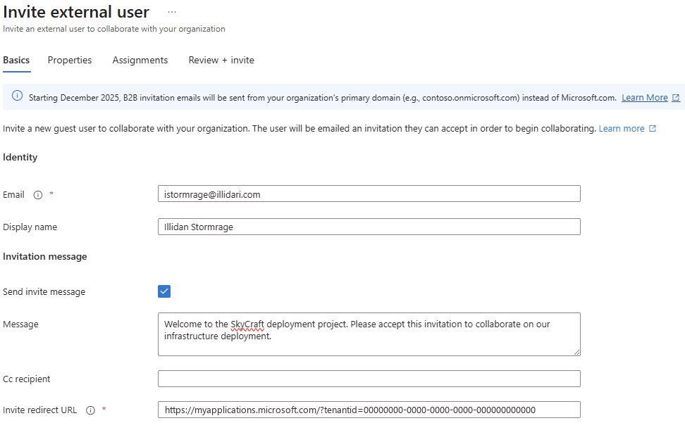
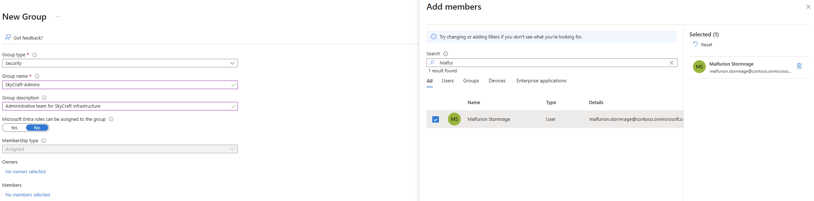
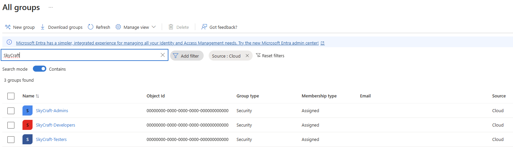
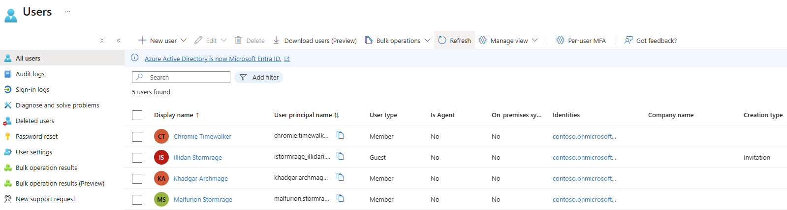
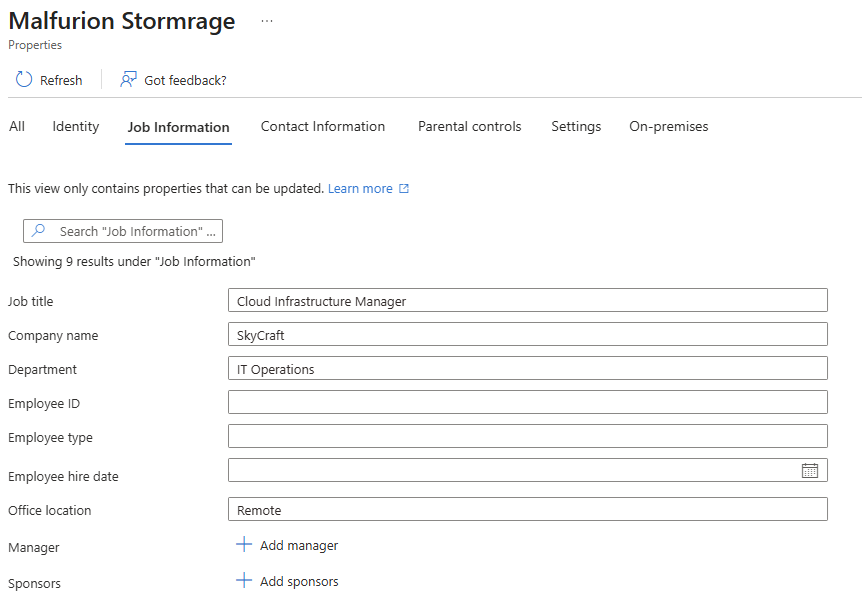
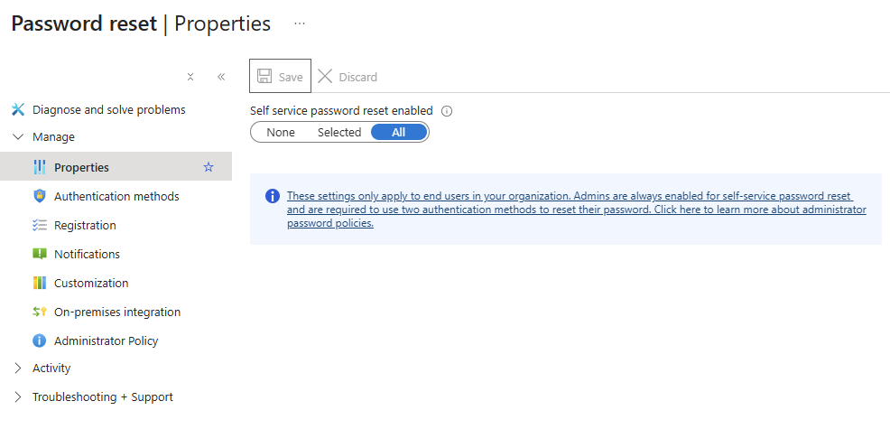
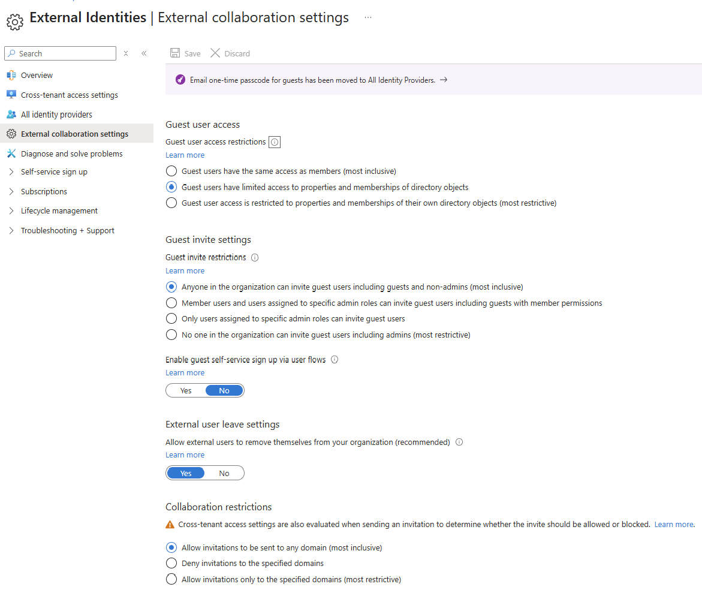

# Lab 1.1: Manage Microsoft Entra Users and Groups (3 hours)

## 🎯 Lab Objectives

By completing this lab, you will:

- Create individual users in Microsoft Entra ID
- Create security groups and assign members
- Manage user properties and review licenses
- Understand delegated administration
- Set up the identity structure for the SkyCraft team

---

## 🏗️ Architecture Overview

You'll set up the following identity structure in Microsoft Entra ID:

<picture>
  <source media="(prefers-color-scheme: dark)" srcset="images/lab-1.1-architecture.dark.svg">
  <source media="(prefers-color-scheme: light)" srcset="images/lab-1.1-architecture.svg">
  
</picture>

---

## 📋 Real-World Scenario

**Situation**: You're setting up the SkyCraft deployment team. The organization needs:

- An administrator who manages all resources (Malfurion Stormrage)
- Developers who deploy and modify infrastructure (Khadgar Archmage)
- Testers who monitor and report issues (Chromie Timewalker)
- External consultant with guest access (Illidan Stormrage)

**Your Task**: Create these users, organize them into groups, and set up the team structure.

---

## ⏱️ Estimated Time: 3 hours

- **Section 1**: Create individual users (45 min)
- **Section 2**: Create security groups (30 min)
- **Section 3**: Update user properties and review licenses (30 min)
- **Section 4**: Set up external access (15 min)
- **Hands-on Practice**: Recreate from scratch (30 min)
- **Validation**: Complete checklist (30 min)

---

## ✅ Prerequisites

- [ ] Azure Portal access
- [ ] Global Administrator or User Administrator role
- [ ] Understanding of user vs. group concepts

---

## 📖 Section 1: Create Individual Users (45 minutes)

### Step 1.1.1: Access Microsoft Entra ID

1. Open **Azure Portal** (https://portal.azure.com)
2. Search for **Microsoft Entra ID** in the search bar
3. Click on the result to open the Entra ID admin center

**Expected Result**: You see the Entra ID dashboard with options for Users, Groups, and Roles.

### Step 1.1.2: Create First User (Malfurion Stormrage)

1. In the left menu, open the Manage group and click **Users** → **All users**
2. Click **+ New user** → **Create new user**
3. Fill in the following details (clear Auto-generate password first, or the password field stays read-only):

| Field                  | Value                                            |
| ---------------------- | ------------------------------------------------ |
| User principal name    | malfurion.stormrage@[yourtenant].onmicrosoft.com |
| Display name           | Malfurion Stormrage                              |
| Auto-generate password | ☐ Unchecked                                      |
| Password               | LoveAzeroth!2004                                 |

4. Click **Review + create**, then **Create**
5. When the Portal returns to All users, click **Refresh** (the list may not show the new user yet)

**Expected Result**: Malfurion Stormrage appears in the All users list.

### Step 1.1.3: Create Second User (Khadgar Archmage)

1. Click **+ New user** → **Create new user**
2. Fill in the details:

| Field                  | Value                                         |
| ---------------------- | --------------------------------------------- |
| User principal name    | khadgar.archmage@[yourtenant].onmicrosoft.com |
| Display name           | Khadgar Archmage                              |
| Auto-generate password | ☐ Unchecked                                   |
| Password               | LoveAzeroth!2004                              |

3. Click **Review + create**, then **Create**

### Step 1.1.4: Create Third User (Chromie Timewalker)

1. Click **+ New user** → **Create new user**
2. Fill in the details:

| Field                  | Value                                           |
| ---------------------- | ----------------------------------------------- |
| User principal name    | chromie.timewalker@[yourtenant].onmicrosoft.com |
| Display name           | Chromie Timewalker                              |
| Auto-generate password | ☐ Unchecked                                     |
| Password               | LoveAzeroth!2004                                |

3. Click **Review + create**, then **Create**

### Step 1.1.5: Create Guest User (Illidan Stormrage)

1. Click **+ New user** → **Invite external user**
2. Fill in:

| Field               | Value                                                                                                                      |
| ------------------- | -------------------------------------------------------------------------------------------------------------------------- |
| Email               | istormrage@illidari.com                                                                                                    |
| Display name        | Illidan Stormrage                                                                                                          |
| Send invite message | ✅ Checked                                                                                                                 |
| Message             | Welcome to the SkyCraft deployment project. Please accept this invitation to collaborate on our infrastructure deployment. |

3. Click **Review + invite**, then **Invite**

**Expected Result**: Invitation email sent to external partner.

---

## 📖 Section 2: Create Security Groups (30 minutes)

You add each group's member in the New Group form, before you create the group.

### Step 1.1.6: Create First Group (Admins)

1. Search for **Microsoft Entra ID** in the top search bar
2. Open it from the results, then in the left menu open the Manage group and click **Groups** → **All groups**
3. Click **+ New group**
4. Fill in (do not click Create yet; the member comes next):

| Field             | Value                                           |
| ----------------- | ----------------------------------------------- |
| Group type        | Security                                        |
| Group name        | SkyCraft-Admins                                 |
| Group description | Administrative team for SkyCraft infrastructure |
| Membership type   | Assigned                                        |

### Step 1.1.7: Add Member to Admin Group and Create It

1. Under Members, click **No members selected**
2. Search for and select **Malfurion Stormrage**
3. Click **Select**
4. Click **Create**
5. When the Portal returns to All groups, click **Refresh** (the list may not show the new group yet)

**Expected Result**: SkyCraft-Admins appears in All groups with Membership type Assigned.

### Step 1.1.8: Create Second Group (Developers)

1. Click **+ New group**
2. Fill in:

| Field             | Value                                    |
| ----------------- | ---------------------------------------- |
| Group type        | Security                                 |
| Group name        | SkyCraft-Developers                      |
| Group description | Development team for SkyCraft deployment |
| Membership type   | Assigned                                 |

3. Under Members, click **No members selected**
4. Search for and select **Khadgar Archmage**
5. Click **Select**
6. Click **Create**

### Step 1.1.9: Create Third Group (Testers)

1. Click **+ New group**
2. Fill in:

| Field             | Value                       |
| ----------------- | --------------------------- |
| Group type        | Security                    |
| Group name        | SkyCraft-Testers            |
| Group description | Testing and monitoring team |
| Membership type   | Assigned                    |

3. Under Members, click **No members selected**
4. Search for and select **Chromie Timewalker**
5. Click **Select**
6. Click **Create**
7. When the Portal returns to All groups, click **Refresh** (the list may not show the new group yet)

**Expected Result**: SkyCraft-Admins, SkyCraft-Developers and SkyCraft-Testers appear in All groups.

---

## 📖 Section 3: Update User Properties and Review Licenses (30 minutes)

### Step 1.1.10: Configure User Properties

1. Search for **Microsoft Entra ID** in the top search bar
2. Open it from the results, then in the left menu open the Manage group and click **Users** → **All users**
3. Click **Malfurion Stormrage**
4. Click **Edit properties**
5. On the **Job Information** tab, update the following:

| Property        | Value                        |
| --------------- | ---------------------------- |
| Job title       | Cloud Infrastructure Manager |
| Company name    | SkyCraft                     |
| Department      | IT Operations                |
| Office location | Remote                       |

6. Click **Save**
7. When the Portal returns to the user's overview, click the **Properties** tab (the first tab does not show the job information)

**Expected Result**: On the Properties tab, Malfurion Stormrage's profile shows Job title Cloud Infrastructure Manager, Company name SkyCraft, Department IT Operations and Office location Remote.

### Step 1.1.11: Review License Information

1. In Malfurion Stormrage's profile, click **Licenses** in the left menu
2. Note the current license status

The blade only lists licenses: assignments are added and removed in the Microsoft 365 admin center, which its link opens. You do not assign a license in this lab.

**Expected Result**: You can see which licenses, if any, are assigned to the user.

### Step 1.1.12: Configure SSPR (Self-Service Password Reset)

1. Search for **Microsoft Entra ID** in the top search bar
2. Open it from the results, then in the left menu open the Manage group and click **Password reset**
3. Under "Self service password reset enabled", click **All** to enable for all users
4. Click **Save** (if All was already selected, Save stays unavailable: there is nothing to save)

**Expected Result**: All users can now reset their own passwords using SSPR.

---

## 📖 Section 4: External User Management (15 minutes)

### Step 1.1.13: Accept Guest Invitation (Simulated)

1. In production, the external partner would receive an email
2. They would click the invitation link and sign in; for this lab, you check the guest yourself
3. Search for **Microsoft Entra ID** in the top search bar
4. Open it from the results, then in the left menu open the Manage group and click **Users** → **All users**
5. Find Illidan Stormrage and check the User type column

**Expected Result**: Guest user appears in the user list with "Guest" in the User type column.

### Step 1.1.14: Review B2B Collaboration Settings

1. Search for **Microsoft Entra ID** in the top search bar
2. Open it from the results, then in the left menu open the Manage group and click **External Identities**
3. Click **External collaboration settings**
4. Review the current settings for guest access

**Expected Result**: You see the guest user access and guest invite settings of your tenant.

---

## ✅ Lab Checklist

Complete this checklist to verify you've successfully completed the lab:

- [ ] Created 3 internal users (Malfurion, Khadgar, Chromie)
- [ ] Created 1 guest user (Illidan)
- [ ] Created 3 security groups (Admins, Developers, Testers)
- [ ] Added appropriate users to each group
- [ ] Updated user properties (job title, department)
- [ ] Reviewed the license status of a user
- [ ] Enabled SSPR for all users
- [ ] All 4 users appear in the "All users" list
- [ ] All 3 groups appear with correct members
- [ ] No errors in the audit log

---

## 🔧 Troubleshooting

**Issue**: "Insufficient privileges" error when creating users

- **Solution**: Verify you have Global Administrator or User Administrator role
- **Check**: Azure Portal → Entra ID → My role assignments

**Issue**: Cannot create groups

- **Solution**: Ensure group creation is enabled in security defaults
- **Fix**: Entra ID → Security defaults → Turn off security defaults (if needed)

**Issue**: The user's **Licenses** blade has no **+ Assignments** button

- **Cause**: License assignments moved to the Microsoft 365 admin center; the blade in Microsoft Entra ID only lists them
- **Solution**: Nothing to do for this lab (step 1.1.11 only reviews the license status); assign licenses in the Microsoft 365 admin center when you need them

**Issue**: The lab scripts stop at "Checking Microsoft Graph connection..." and never come back

- **Cause**: `Connect-MgGraph -Scopes ...` signs a person in, and a cached token that needs a refresh the broker cannot complete silently falls back to a prompt. A run with no console has nobody to answer it.
- **Solution**: Running by hand, answer the prompt — it is a real sign-in. If none appears, sign in once with `Connect-MgGraph -UseDeviceCode` and re-run the script. For an unattended run there is nobody to answer it, so set `SKYCRAFT_GRAPH_TENANT_ID`, `SKYCRAFT_GRAPH_CLIENT_ID` and `SKYCRAFT_GRAPH_CERT_THUMBPRINT` and the scripts sign in app-only instead — see [TROUBLESHOOTING.md](../../TROUBLESHOOTING.md).

---

## 📚 Additional Resources

- [Create or delete users - Microsoft Learn](https://learn.microsoft.com/en-us/entra/fundamentals/how-to-create-delete-users-basic)
- [Create groups and add members - Microsoft Learn](https://learn.microsoft.com/en-us/entra/fundamentals/how-to-manage-groups)
- [License assignment - Microsoft Learn](https://learn.microsoft.com/en-us/entra/identity/users/licensing-service-plan-reference)

---

## 🎓 Knowledge Check

Answer these questions to verify understanding:

1. **Q**: What's the difference between "Create new user" and "Invite external user"?  
   **A**: Create new user adds an internal user to your tenant; Invite external user sends an invitation to an external person who signs in with their own identity.

2. **Q**: Why would you use security groups instead of assigning permissions to individual users?  
   **A**: Groups simplify management—you assign permissions once to a group, then add/remove users from the group as needed.

3. **Q**: What is SSPR and why is it useful?  
   **A**: SSPR allows users to reset their own passwords without IT involvement, reducing support burden and improving user experience.

---

## 🔗 Next Steps

1. Move to **Lab 1.2: Manage Access & RBAC**
2. You'll use the users and groups created here to demonstrate role assignments
3. Keep this security group structure for Module 2 labs

---

## 📝 Lab Summary

**What You Accomplished**:

- ✅ Created identity structure for SkyCraft team (4 users, 3 groups)
- ✅ Organized team into logical security groups
- ✅ Configured user properties and reviewed license status
- ✅ Enabled self-service password reset
- ✅ Established external collaboration framework

**Time Spent**: ~3 hours

---

## 📌 Module Navigation

- [← Back to Module 1 Index](../README.md)
- [Lab 1.2: Manage Access & RBAC →](../1.2-rbac/lab-guide-1.2.md)
