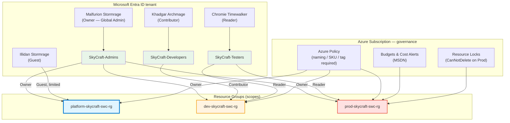

# Module 1: Manage Azure Identities and Governance (9 hours)

## 📚 Module Overview

In this module, you'll establish the **foundational security layer** for the SkyCraft deployment.
You'll create the identity structure, implement role-based access control, and configure governance policies
that protect your infrastructure and enforce organizational standards.

**Real-world Context**: Before deploying any infrastructure, you must control _who_ can access resources,
_what_ they can do, and _enforce_ compliance standards—exactly what we'll do here for the SkyCraft team.

---

## 🎯 Learning Objectives

By completing this module, you will be able to:

- **Create and manage** Microsoft Entra users and groups for team collaboration
- **Implement role-based access control (RBAC)** at subscription, resource group, and resource levels
- **Configure Azure Policy** to enforce organizational standards and naming conventions
- **Apply resource locks** to prevent accidental deletion of critical infrastructure
- **Manage costs** through budgets, alerts, and Azure Advisor recommendations
- **Apply tags** for resource organization and cost tracking
- **Create a governance framework** suitable for production game server infrastructure

---

## 📋 Module Sections

| Section | Duration | Topic                                     | Exam Weight |
| ------- | -------- | ----------------------------------------- | ----------- |
| 1.1     | 3 hours  | Manage Microsoft Entra Users and Groups   | ~8-10%      |
| 1.2     | 2 hours  | Manage Access to Azure Resources (RBAC)   | ~5-7%       |
| 1.3     | 4 hours  | Manage Azure Subscriptions and Governance | ~7-10%      |

**Total Module Time**: 9 hours

---

## 🏗️ Architecture Overview

This module establishes the identity and governance layer that every subsequent module depends on. Entra ID users are placed into security groups, the groups are bound to built-in Azure roles via RBAC, and Azure Policy / locks / budgets are applied to the three SkyCraft resource groups at the subscription level.

---

## ✅ Prerequisites

Before starting, ensure you have:

- [ ] Active Azure subscription (with at least $50 credit available)
- [ ] Azure Portal access (https://portal.azure.com)
- [ ] Azure CLI installed locally (or use Cloud Shell)
- [ ] PowerShell 7+ installed (Windows, macOS, or Linux)
- [ ] Basic understanding of cloud computing concepts
- [ ] Text editor (VS Code recommended)

---

## 🚀 Getting Started

1. **Complete prerequisites check** above
2. **Start with Lab 1.1** - Create Entra users and groups
3. **Progress to Lab 1.2** - Configure RBAC roles
4. **Complete Lab 1.3** - Set up governance policies
5. **Take the module assessment** to validate learning
6. **Proceed to Module 2** - Virtual Networking

---

## 📖 How to Use This Module

Each lab includes:

- **Lab Guide** - Step-by-step instructions with screenshots
- **Lab Checklist** - Verification steps to confirm success
- **Scripts** - PowerShell and Bash automation scripts
- **Bicep Templates** - Infrastructure as Code for deployment
- **Solutions** - Complete answers and expected outcomes
- **Troubleshooting** - Common issues and fixes

**Recommended approach**:

1. Read the lab guide completely before starting
2. Follow steps manually first (to understand the process)
3. Use scripts to automate repetitive tasks
4. Verify each step using the checklist
5. Reference solutions if stuck

---

## 🎓 AZ-104 Exam Alignment

This module covers **20-25%** of the AZ-104 exam. Key exam topics include:

- Managing Microsoft Entra users and groups
- Creating and managing roles
- Managing subscription and governance features
- Implementing and managing Azure Policy
- Managing resources and resource groups
- Managing subscriptions

---

## ⏱️ Time Management

- **Total module time**: 9 hours
- **Recommended pace**: 3 hours per day for 3 days (or 1.5 hours × 6 days)
- **Lab 1.1**: 3 hours (most time-intensive)
- **Lab 1.2**: 2 hours (moderate complexity)
- **Lab 1.3**: 3 hours (combines multiple concepts)
- **Assessment**: 1 hour

---

## 🔗 Useful Resources

- [Microsoft Entra ID Documentation](https://learn.microsoft.com/en-us/entra/identity/)
- [Azure RBAC Guide](https://learn.microsoft.com/en-us/azure/role-based-access-control/overview)
- [Azure Policy Documentation](https://learn.microsoft.com/en-us/azure/governance/policy/overview)
- [Azure Learn - Manage Azure Identities and Governance](https://learn.microsoft.com/en-us/training/paths/manage-identity-and-access/)

---

## 📞 Getting Help

- **Lab issues**: Check `lab-guide/troubleshooting` in each lab folder
- **Azure errors**: Search Azure documentation or Microsoft Learn
- **General issues/questions**: Create an issue

---

## ✨ What's Next After This Module?

Once complete, you'll have:

- ✅ Identity structure for the SkyCraft team
- ✅ Proper access controls in place
- ✅ Cost governance framework established
- ✅ Foundation for Modules 2-5

**Next Module**: Module 2 - Implement and Manage Virtual Networking

---

## 📌 Module Navigation

- [← Back to Course Home](/README.MD)
- [Lab 1.1: Manage Entra Users & Groups →](1.1-entra-users-groups/lab-guide-1.1.md)
- [Lab 1.2: Manage Access & RBAC →](1.2-rbac/lab-guide-1.2.md)
- [Lab 1.3: Governance & Policies →](1.3-governance/lab-guide-1.3.md)
