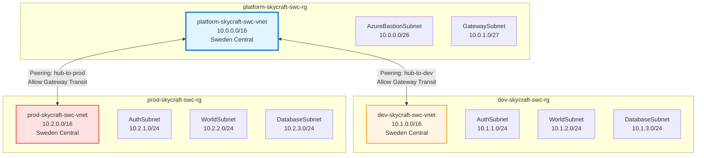

# Lab 2.1: Configure and Manage Virtual Networks (3 hours)

## 🎯 Learning Objectives

By completing this lab, you will:

- Design and deploy hub-spoke virtual network topology
- Create virtual networks with multiple subnets using CIDR notation
- Configure VNet peering between hub and spoke networks
- Implement user-defined routes for traffic control
- Configure public and private IP addresses
- Troubleshoot network connectivity issues

---

## 🏗️ Architecture Overview

You'll deploy this three-VNet hub-spoke architecture:



---

## 📋 Real-World Scenario

**Situation**: The SkyCraft AzerothCore deployment requires isolated network environments for development and production. You need a centralized hub for shared services (Bastion, future VPN gateway) and separate spoke networks for each environment. Development teams should not have direct network access to production resources.

**Your Task**: Design and deploy a hub-spoke network topology that:

- Isolates dev and prod environments
- Centralizes administrative access through Azure Bastion in the hub
- Allows controlled communication between hub and spokes
- Supports future VPN/ExpressRoute connectivity
- Uses proper IP address planning to avoid conflicts

---

## ⏱️ Estimated Time: 3 hours

- **Section 1**: Understand hub-spoke topology and IP planning (20 min)
- **Section 2**: Create hub virtual network with subnets (30 min)
- **Section 3**: Create spoke virtual networks (dev and prod) (40 min)
- **Section 4**: Configure VNet peering between hub and spokes (30 min)
- **Section 5**: Configure public IP addresses (20 min)
- **Section 6**: Test and verify connectivity (30 min)
- **Practice**: Recreate from CLI commands (10 min)

---

## 📖 Section 1: Understanding Hub-Spoke Topology (20 minutes)

### What is Hub-Spoke Network Topology?

**Hub-spoke** is a network design pattern where:

- **Hub VNet** contains shared services (Bastion, VPN Gateway, Firewall)
- **Spoke VNets** contain workload-specific resources (application tiers)
- Spokes connect to the hub via **VNet peering**
- Spokes do NOT directly peer with each other (traffic routes through hub)

### Benefits for SkyCraft

| Benefit                    | Description                                                  |
| -------------------------- | ------------------------------------------------------------ |
| **Isolation**              | Dev and prod environments are network-isolated               |
| **Centralized Management** | Single Bastion for all administrative access                 |
| **Cost Efficiency**        | Shared services reduce duplicate resources                   |
| **Scalability**            | Easy to add new spoke networks for staging, QA, etc.         |
| **Security**               | Hub can host firewall/NVA for centralized traffic inspection |

### IP Address Planning

**Important**: Proper IP planning prevents address conflicts and allows future growth.

| VNet                                 | CIDR Range  | Total IPs | Purpose                              |
| ------------------------------------ | ----------- | --------- | ------------------------------------ |
| **platform-skycraft-swc-vnet** (Hub) | 10.0.0.0/16 | 65,536    | Shared services                      |
| └─ AzureBastionSubnet                | 10.0.0.0/26 | 64        | Azure Bastion (minimum /26 required) |
| └─ GatewaySubnet                     | 10.0.1.0/27 | 32        | Future VPN/ExpressRoute gateway      |
| **dev-skycraft-swc-vnet** (Spoke 1)  | 10.1.0.0/16 | 65,536    | Development environment              |
| └─ AuthSubnet                        | 10.1.1.0/24 | 256       | Authentication server VMs            |
| └─ WorldSubnet                       | 10.1.2.0/24 | 256       | World server VMs                     |
| └─ DatabaseSubnet                    | 10.1.3.0/24 | 256       | Database servers                     |
| **prod-skycraft-swc-vnet** (Spoke 2) | 10.2.0.0/16 | 65,536    | Production environment               |
| └─ AuthSubnet                        | 10.2.1.0/24 | 256       | Authentication server VMs            |
| └─ WorldSubnet                       | 10.2.2.0/24 | 256       | World server VMs                     |
| └─ DatabaseSubnet                    | 10.2.3.0/24 | 256       | Database servers                     |

**Key Concepts**:

- Azure reserves **5 IP addresses** in each subnet (first 4 and last 1)
- Usable IPs = Total IPs - 5
- Example: /24 subnet has 256 IPs, but only 251 are usable

---

## 📖 Section 2: Create Hub Virtual Network (30 minutes)

> [!IMPORTANT]
> **Prerequisite**: The resource groups (`platform-skycraft-swc-rg`, `dev-skycraft-swc-rg`, `prod-skycraft-swc-rg`) must already exist. If you haven't created them, complete [Lab 1.2: Manage Access to Azure Resources (RBAC)](../../module-1-identities-governance/1.2-rbac/lab-guide-1.2.md#-section-2-create-resource-groups-15-minutes) first.

### Step 2.1.1: Create Hub Virtual Network

1. In Azure Portal, search for **"Virtual networks"**
2. Click **+ Create**

**Basics tab**:

| Field          | Value                        |
| -------------- | ---------------------------- |
| Subscription   | [Your subscription]          |
| Resource group | `platform-skycraft-swc-rg`   |
| Name           | `platform-skycraft-swc-vnet` |
| Region         | **Sweden Central**           |

3. Click **Next: IP Addresses**

**IP Addresses tab**:

4. Click **Delete** to remove default address space
5. Click **Add IP address space**
6. Enter: `10.0.0.0/16`
7. Click **Add**

**Expected Result**: Address space `10.0.0.0/16` added (provides 65,536 IP addresses).

### Step 2.1.2: Create AzureBastionSubnet

1. Still on **IP Addresses** tab, click **+ Add a subnet**
2. Fill in subnet details:

| Field            | Value                |
| ---------------- | -------------------- |
| Subnet template  | Default              |
| Name             | `AzureBastionSubnet` |
| Starting address | `10.0.0.0`           |
| Subnet size      | `/26` (64 addresses) |

**Important**: The name **must be exactly** `AzureBastionSubnet` (case-sensitive). Azure Bastion requires this specific name.

3. Click **Add**

**Expected Result**: Subnet `AzureBastionSubnet` appears in the subnet list with range 10.0.0.0/26.

### Step 2.1.3: Create GatewaySubnet

1. Click **+ Add a subnet**
2. Fill in:

| Field            | Value                |
| ---------------- | -------------------- |
| Subnet template  | Default              |
| Name             | `GatewaySubnet`      |
| Starting address | `10.0.1.0`           |
| Subnet size      | `/27` (32 addresses) |

**Important**: The name **must be exactly** `GatewaySubnet` for future VPN Gateway deployment.

3. Click **Add**

**Expected Result**: Subnet `GatewaySubnet` appears with range 10.0.1.0/27.

### Step 2.1.4: Complete Hub VNet Creation

1. Click **Next: Security**
2. Leave default security settings (we'll configure these in Lab 2.2)
3. Click **Next: Tags**
4. Add tags:

| Name        | Value    |
| ----------- | -------- |
| Project     | SkyCraft |
| Environment | Platform |
| CostCenter  | MSDN     |

5. Click **Review + create**
6. Review the configuration
7. Click **Create**

**Expected Result**:

- Deployment completes successfully
- Hub VNet `platform-skycraft-swc-vnet` exists with:
  - Address space: 10.0.0.0/16
  - 2 subnets: AzureBastionSubnet, GatewaySubnet

---

## 📖 Section 3: Create Spoke Virtual Networks (40 minutes)

### Step 2.1.5: Create Development Virtual Network

1. Navigate to **Virtual networks** → **+ Create**

**Basics tab**:

| Field          | Value                   |
| -------------- | ----------------------- |
| Subscription   | [Your subscription]     |
| Resource group | `dev-skycraft-swc-rg`   |
| Name           | `dev-skycraft-swc-vnet` |
| Region         | **Sweden Central**      |

2. Click **Next: IP Addresses**

**IP Addresses tab**:

3. Delete default address space
4. Add IP address space: `10.1.0.0/16`

### Step 2.1.6: Create Dev Subnets

Create three subnets for the development environment:

**Subnet 1: AuthSubnet**

1. Click **+ Add a subnet**
2. Configure:

| Field            | Value                 |
| ---------------- | --------------------- |
| Name             | `AuthSubnet`          |
| Starting address | `10.1.1.0`            |
| Subnet size      | `/24` (256 addresses) |

3. Click **Add**

**Subnet 2: WorldSubnet**

1. Click **+ Add a subnet**
2. Configure:

| Field            | Value         |
| ---------------- | ------------- |
| Name             | `WorldSubnet` |
| Starting address | `10.1.2.0`    |
| Subnet size      | `/24`         |

3. Click **Add**

**Subnet 3: DatabaseSubnet**

1. Click **+ Add a subnet**
2. Configure:

| Field            | Value            |
| ---------------- | ---------------- |
| Name             | `DatabaseSubnet` |
| Starting address | `10.1.3.0`       |
| Subnet size      | `/24`            |

3. Click **Add**

**Expected Result**: Three subnets created in dev VNet:

- AuthSubnet: 10.1.1.0/24
- WorldSubnet: 10.1.2.0/24
- DatabaseSubnet: 10.1.3.0/24

### Step 2.1.7: Complete Dev VNet Creation

1. Click **Next: Security** (leave defaults)
2. Click **Next: Tags**
3. Add tags:

| Name        | Value       |
| ----------- | ----------- |
| Project     | SkyCraft    |
| Environment | Development |
| CostCenter  | MSDN        |

4. Click **Review + create** → **Create**

**Expected Result**: Dev VNet `dev-skycraft-swc-vnet` deployed successfully with 3 subnets.

### Step 2.1.8: Create Production Virtual Network

Repeat the process for production:

1. Navigate to **Virtual networks** → **+ Create**

**Basics tab**:

| Field          | Value                    |
| -------------- | ------------------------ |
| Resource group | `prod-skycraft-swc-rg`   |
| Name           | `prod-skycraft-swc-vnet` |
| Region         | **Sweden Central**       |

**IP Addresses tab**:

2. Address space: `10.2.0.0/16`

**Subnets**:

3. Create three subnets:

| Subnet Name    | Starting Address | Size |
| -------------- | ---------------- | ---- |
| AuthSubnet     | 10.2.1.0         | /24  |
| WorldSubnet    | 10.2.2.0         | /24  |
| DatabaseSubnet | 10.2.3.0         | /24  |

**Tags**:

4. Add tags:

| Name        | Value      |
| ----------- | ---------- |
| Project     | SkyCraft   |
| Environment | Production |
| CostCenter  | MSDN       |

5. Click **Review + create** → **Create**

**Expected Result**: Production VNet `prod-skycraft-swc-vnet` created with 3 subnets.

---

## 📖 Section 4: Configure VNet Peering (30 minutes)

### What is VNet Peering?

**VNet Peering** connects two Azure virtual networks, allowing resources to communicate using private IP addresses. Peering is:

- **Low latency**: Traffic stays on Microsoft backbone
- **Non-transitive**: If A peers with B, and B peers with C, A cannot reach C
- **Bidirectional**: Requires configuration on both sides

### Step 2.1.9: Peer Hub to Dev (Hub Side)

1. Navigate to **Virtual networks**
2. Click **platform-skycraft-swc-vnet**
3. In left menu, click **Peerings**
4. Click **+ Add**

**Configure peering from hub to dev**:

| Field                                         | Value                                                    |
| --------------------------------------------- | -------------------------------------------------------- |
| **This virtual network**                      |                                                          |
| Peering link name                             | `hub-to-dev`                                             |
| Traffic to remote virtual network             | Allow                                                    |
| Traffic forwarded from remote virtual network | Allow                                                    |
| Virtual network gateway or Route Server       | Use this virtual network's gateway or Route Server       |
| **Remote virtual network**                    |                                                          |
| Peering link name                             | `dev-to-hub`                                             |
| Virtual network                               | `dev-skycraft-swc-vnet`                                  |
| Traffic to remote virtual network             | Allow                                                    |
| Traffic forwarded from remote virtual network | Allow                                                    |
| Virtual network gateway or Route Server       | Use the remote virtual network's gateway or Route Server |

5. Click **Add**

**Expected Result**:

- Peering status changes from "Updating" to "Connected"
- Both `hub-to-dev` and `dev-to-hub` show status "Connected"

**Screenshot location**: `images/vnet-peering-hub-dev-connected.png`

### Step 2.1.10: Peer Hub to Prod (Hub Side)

1. Still in **platform-skycraft-swc-vnet** → **Peerings**
2. Click **+ Add**

**Configure peering from hub to prod**:

| Field                                         | Value                                                    |
| --------------------------------------------- | -------------------------------------------------------- |
| **This virtual network**                      |                                                          |
| Peering link name                             | `hub-to-prod`                                            |
| Traffic to remote virtual network             | Allow                                                    |
| Traffic forwarded from remote virtual network | Allow                                                    |
| Virtual network gateway or Route Server       | Use this virtual network's gateway or Route Server       |
| **Remote virtual network**                    |                                                          |
| Peering link name                             | `prod-to-hub`                                            |
| Virtual network                               | `prod-skycraft-swc-vnet`                                 |
| Traffic to remote virtual network             | Allow                                                    |
| Traffic forwarded from remote virtual network | Allow                                                    |
| Virtual network gateway or Route Server       | Use the remote virtual network's gateway or Route Server |

3. Click **Add**

**Expected Result**:

- Peering `hub-to-prod` shows status "Connected"
- Peering `prod-to-hub` shows status "Connected"

### Step 2.1.11: Verify Peering Configuration

1. Navigate to **platform-skycraft-swc-vnet** → **Peerings**
2. Verify both peerings are listed:

| Peering Name | Status    | Remote VNet            |
| ------------ | --------- | ---------------------- |
| hub-to-dev   | Connected | dev-skycraft-swc-vnet  |
| hub-to-prod  | Connected | prod-skycraft-swc-vnet |

3. Navigate to **dev-skycraft-swc-vnet** → **Peerings**
4. Verify peering exists:

| Peering Name | Status    | Remote VNet                |
| ------------ | --------- | -------------------------- |
| dev-to-hub   | Connected | platform-skycraft-swc-vnet |

5. Navigate to **prod-skycraft-swc-vnet** → **Peerings**
6. Verify peering exists:

| Peering Name | Status    | Remote VNet                |
| ------------ | --------- | -------------------------- |
| prod-to-hub  | Connected | platform-skycraft-swc-vnet |

**Expected Result**: All peering connections show "Connected" status. Hub has 2 peerings, each spoke has 1 peering.

---

## 📖 Section 5: Configure Public IP Addresses (20 minutes)

### Step 2.1.12: Create Public IP for Azure Bastion

Azure Bastion requires a Standard SKU public IP address.

1. In Azure Portal, search for **"Public IP addresses"**
2. Click **+ Create**

**Basics tab**:

| Field                 | Value                           |
| --------------------- | ------------------------------- |
| Subscription          | [Your subscription]             |
| Resource group        | `platform-skycraft-swc-rg`      |
| Region                | **Sweden Central**              |
| Name                  | `platform-skycraft-swc-bas-pip` |
| IP Version            | IPv4                            |
| SKU                   | **Standard**                    |
| Tier                  | Regional                        |
| IP address assignment | Static                          |
| Routing preference    | Microsoft network               |

3. Click **Next: Tags**
4. Add tags:

| Name        | Value    |
| ----------- | -------- |
| Project     | SkyCraft |
| Environment | Platform |
| CostCenter  | MSDN     |

5. Click **Review + create** → **Create**

**Expected Result**: Public IP `platform-skycraft-swc-bas-pip` created with a static IP address assigned.

### Step 2.1.13: Reserve Public IPs for Load Balancers

Create public IPs for future load balancers (used in Lab 2.3):

**Dev Load Balancer Public IP**:

1. Navigate to **Public IP addresses** → **+ Create**
2. Configure:

| Field                 | Value                     |
| --------------------- | ------------------------- |
| Resource group        | `dev-skycraft-swc-rg`     |
| Name                  | `dev-skycraft-swc-lb-pip` |
| SKU                   | **Standard**              |
| IP address assignment | Static                    |

3. Add appropriate tags (Project: SkyCraft, Environment: Development)
4. Click **Review + create** → **Create**

**Prod Load Balancer Public IP**:

1. Repeat the process:

| Field                 | Value                      |
| --------------------- | -------------------------- |
| Resource group        | `prod-skycraft-swc-rg`     |
| Name                  | `prod-skycraft-swc-lb-pip` |
| SKU                   | **Standard**               |
| IP address assignment | Static                     |

2. Add appropriate tags (Project: SkyCraft, Environment: Production)
3. Click **Review + create** → **Create**

**Expected Result**: Three public IPs created:

- `platform-skycraft-swc-bas-pip` (for Bastion)
- `dev-skycraft-swc-lb-pip` (for dev load balancer)
- `prod-skycraft-swc-lb-pip` (for prod load balancer)

---

## 📖 Section 6: Test and Verify Connectivity (30 minutes)

### Step 2.1.14: Verify VNet Configuration

1. Navigate to **Virtual networks**
2. Click **platform-skycraft-swc-vnet**
3. Click **Overview**
4. Verify:
   - Address space: 10.0.0.0/16
   - Subnets: 2 (AzureBastionSubnet, GatewaySubnet)
   - Peerings: 2 (hub-to-dev, hub-to-prod)

5. Repeat verification for:
   - `dev-skycraft-swc-vnet` (Address: 10.1.0.0/16, Subnets: 3, Peerings: 1)
   - `prod-skycraft-swc-vnet` (Address: 10.2.0.0/16, Subnets: 3, Peerings: 1)

**Expected Result**: All VNets configured correctly with proper address spaces, subnets, and peering connections.

### Step 2.1.15: Use Azure Network Watcher Topology

1. Search for **"Network Watcher"** in Azure Portal
2. Click **Network Watcher** service
3. Ensure Network Watcher is enabled for **Sweden Central** region
4. In left menu, click **Topology**
5. Select:
   - Resource group: `platform-skycraft-swc-rg`

**Expected View**: Visual diagram showing hub VNet with peering connections to spoke VNets.

6. Change resource group to `dev-skycraft-swc-rg` and view topology
7. Change resource group to `prod-skycraft-swc-rg` and view topology

**Expected Result**: Topology diagram displays your hub-spoke architecture visually.

### Step 2.1.16: Test Connectivity (Conceptual)

Since we haven't deployed VMs yet, document the expected connectivity:

| Source                 | Destination             | Expected Result                          |
| ---------------------- | ----------------------- | ---------------------------------------- |
| Hub VNet (10.0.0.0/16) | Dev VNet (10.1.0.0/16)  | ✅ Allowed (via peering)                 |
| Hub VNet (10.0.0.0/16) | Prod VNet (10.2.0.0/16) | ✅ Allowed (via peering)                 |
| Dev VNet (10.1.0.0/16) | Prod VNet (10.2.0.0/16) | ❌ Blocked (no direct peering)           |
| Internet               | Any VNet private IP     | ❌ Blocked (no public access configured) |

**Note**: In Lab 3, we'll deploy VMs and test actual connectivity using ping and SSH.

---

## ✅ Lab Checklist

Complete this checklist to verify successful lab completion:

### Resource Groups

- [ ] `platform-skycraft-swc-rg` exists in Sweden Central
- [ ] `dev-skycraft-swc-rg` exists in Sweden Central
- [ ] `prod-skycraft-swc-rg` exists in Sweden Central
- [ ] All resource groups have proper tags (Project, Environment, CostCenter)

### Hub VNet (platform-skycraft-swc-vnet)

- [ ] Address space: 10.0.0.0/16
- [ ] Subnet: AzureBastionSubnet (10.0.0.0/26)
- [ ] Subnet: GatewaySubnet (10.0.1.0/27)
- [ ] 2 peering connections configured (hub-to-dev, hub-to-prod)
- [ ] Peering status: Connected

### Dev VNet (dev-skycraft-swc-vnet)

- [ ] Address space: 10.1.0.0/16
- [ ] Subnet: AuthSubnet (10.1.1.0/24)
- [ ] Subnet: WorldSubnet (10.1.2.0/24)
- [ ] Subnet: DatabaseSubnet (10.1.3.0/24)
- [ ] 1 peering connection (dev-to-hub)
- [ ] Peering status: Connected

### Prod VNet (prod-skycraft-swc-vnet)

- [ ] Address space: 10.2.0.0/16
- [ ] Subnet: AuthSubnet (10.2.1.0/24)
- [ ] Subnet: WorldSubnet (10.2.2.0/24)
- [ ] Subnet: DatabaseSubnet (10.2.3.0/24)
- [ ] 1 peering connection (prod-to-hub)
- [ ] Peering status: Connected

### Public IP Addresses

- [ ] `platform-skycraft-swc-bas-pip` created (Standard SKU, Static)
- [ ] `dev-skycraft-swc-lb-pip` created (Standard SKU, Static)
- [ ] `prod-skycraft-swc-lb-pip` created (Standard SKU, Static)
- [ ] All public IPs have proper tags

### Network Topology Verification

- [ ] Network Watcher enabled for Sweden Central
- [ ] Topology view shows hub-spoke architecture
- [ ] No overlapping IP address ranges
- [ ] All VNets in same Azure region (Sweden Central)

**For detailed verification**, see [lab-checklist-2.1.md](lab-checklist-2.1.md)

---

## 🎓 Knowledge Check

Test your understanding with these questions:

1. **Why do we use a hub-spoke topology instead of full mesh peering?**

   <details>
     <summary>**Click to see the answer**</summary>

   **Answer**: Hub-spoke provides:
   - **Centralized management**: Shared services (Bastion, VPN Gateway) in one location
   - **Cost efficiency**: Fewer peering connections (3 peerings vs. 6 for full mesh with 3 VNets)
   - **Security**: Controlled inter-spoke communication through hub (firewall/NVA can be added)
   - **Scalability**: Easy to add new spokes without reconfiguring existing ones

   In full mesh, every VNet peers with every other VNet, creating exponential complexity as you scale.
   </details>

2. **What is the minimum subnet size for AzureBastionSubnet?**

   <details>
     <summary>**Click to see the answer**</summary>

   **Answer**: **/26** (64 IP addresses)

   Azure Bastion requires a dedicated subnet named exactly `AzureBastionSubnet` with minimum size /26. Smaller subnets (/27, /28, etc.) will cause deployment failures. The subnet name is case-sensitive and must match exactly.
   </details>

3. **Can resources in dev-skycraft-swc-vnet directly communicate with resources in prod-skycraft-swc-vnet?**

   <details>
     <summary>**Click to see the answer**</summary>

   **Answer**: **No**, not by default.

   VNet peering is **non-transitive**. Dev peers with Hub, and Prod peers with Hub, but Dev does NOT peer with Prod. Traffic between dev and prod would need to:
   - Route through hub VNet (requires user-defined routes and a firewall/NVA)
   - Or establish direct peering between dev-to-prod (not recommended for isolation)

   This isolation is intentional—production should be protected from development environments.
   </details>

4. **What happens to Azure's reserved 5 IP addresses in each subnet?**

   <details>
     <summary>**Click to see the answer**</summary>

   **Answer**: Azure reserves 5 IPs in every subnet:
   - **x.x.x.0**: Network address
   - **x.x.x.1**: Default gateway
   - **x.x.x.2 & x.x.x.3**: Azure DNS
   - **x.x.x.255**: Broadcast address

   Example: In 10.1.1.0/24 (256 IPs):
   - Reserved: 10.1.1.0, 10.1.1.1, 10.1.1.2, 10.1.1.3, 10.1.1.255
   - Usable: 10.1.1.4 through 10.1.1.254 (251 IPs)
   </details>

5. **Why did we choose 10.0.0.0/16 address ranges instead of 172.16.0.0/12 or 192.168.0.0/16?**

   <details>
     <summary>**Click to see the answer**</summary>

   **Answer**: While all three are private IP ranges (RFC 1918), **10.0.0.0/8** provides:
   - **Largest address space**: 16.7 million addresses (vs. 1 million for 172.16.0.0/12)
   - **Easy to remember**: Simple numbering (10.0.x.x, 10.1.x.x, 10.2.x.x)
   - **Less conflict**: 192.168.0.0/16 often used by home routers/VPNs

   Using /16 per VNet (65,536 IPs) allows massive growth without redesigning IP scheme.
   </details>

---

## 🔧 Troubleshooting

### Issue 1: Cannot create VNet - permission denied

**Symptom**: Error message: "The client does not have authorization to perform action"

**Solution**:

- Verify you have **Contributor** or **Owner** role at subscription or resource group level
- Check permissions: **Subscription** → **Access control (IAM)** → **Check access**
- Wait 10-15 minutes after role assignment for permissions to propagate

### Issue 2: Subnet creation fails - address range conflict

**Symptom**: Error: "Address range overlaps with existing subnet"

**Solution**:

- Verify subnet ranges don't overlap
- Check IP calculator: 10.0.0.0/26 ends at 10.0.0.63
- Next subnet should start at 10.0.0.64 or higher
- Use non-overlapping ranges: 10.0.0.0/26, then 10.0.1.0/27

### Issue 3: VNet peering shows "Initiated" instead of "Connected"

**Symptom**: Peering status stuck in "Initiated" or "Updating"

**Solution**:

- Refresh the Azure Portal (F5)
- Wait 2-3 minutes for peering to complete
- Verify both sides of peering are configured
- Check if both VNets are in same Azure tenant

### Issue 4: Cannot create AzureBastionSubnet - name error

**Symptom**: Error: "Subnet name must be 'AzureBastionSubnet'"

**Solution**:

- Subnet name is **case-sensitive**
- Must be exactly: `AzureBastionSubnet` (capital A, capital B, capital S)
- Cannot use: `azurebastionsubnet`, `Azure-Bastion-Subnet`, or variations

### Issue 5: Public IP creation fails - SKU mismatch

**Symptom**: Error when associating public IP with Bastion

**Solution**:

- Azure Bastion requires **Standard SKU** public IP
- Cannot use Basic SKU
- Verify: **Public IP** → **Configuration** → **SKU** shows "Standard"
- Recreate public IP if wrong SKU was selected

### Issue 6: Network Watcher not available

**Symptom**: Network Watcher features grayed out or unavailable

**Solution**:

```azurecli
# Enable Network Watcher for Sweden Central
az network watcher configure   --resource-group NetworkWatcherRG   --locations swedencentral   --enabled true
```

Wait 2-3 minutes, then refresh Azure Portal.

---

## 📚 Additional Resources

- [Azure Virtual Network Documentation](https://learn.microsoft.com/en-us/azure/virtual-network/)
- [Hub-spoke network topology in Azure](https://learn.microsoft.com/en-us/azure/architecture/reference-architectures/hybrid-networking/hub-spoke)
- [Virtual network peering](https://learn.microsoft.com/en-us/azure/virtual-network/virtual-network-peering-overview)
- [IP addressing for Azure Virtual Network](https://learn.microsoft.com/en-us/azure/virtual-network/ip-services/virtual-network-ip-addresses-overview-arm)
- [CIDR notation explained](https://learn.microsoft.com/en-us/azure/virtual-network/virtual-networks-faq#what-address-ranges-can-i-use-in-my-vnets)

---

## 📌 Module Navigation

- [← Back to Module 2 Index](../README.md)
- [Next Lab: 2.2 Secure Access →](../2.2-secure-access/lab-guide-2.2.md)

---

## 📝 Lab Summary

**What You Accomplished**:

- ✅ Designed and deployed hub-spoke network topology
- ✅ Created 3 virtual networks with proper IP address planning
- ✅ Configured 8 subnets across hub and spoke VNets
- ✅ Established VNet peering (hub-to-dev, hub-to-prod)
- ✅ Reserved 3 public IP addresses for future use
- ✅ Verified network topology with Network Watcher

**Time Spent**: ~3 hours

**Ready for Lab 2.2?** Next, you'll implement security controls with NSGs, Azure Bastion, and private endpoints.
