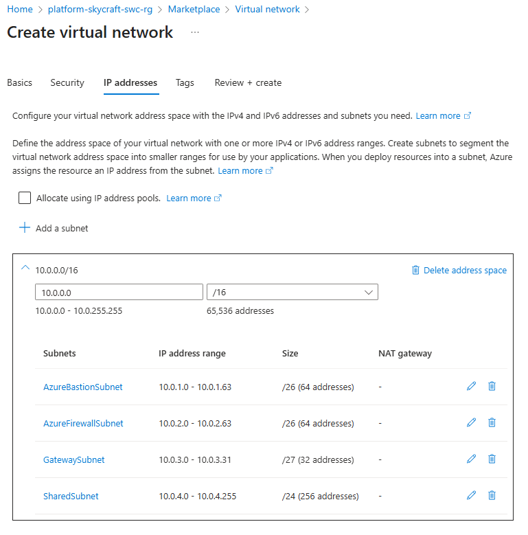
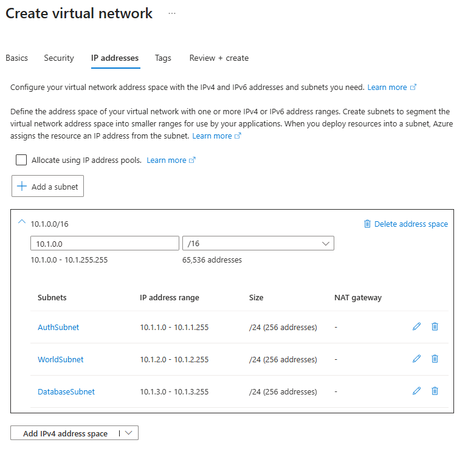
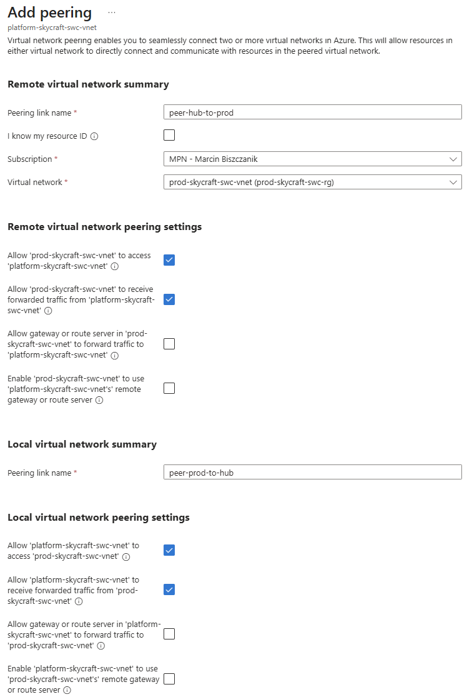

# Lab 2.1: Configure Virtual Networks

**Estimated Time**: 2.5 Hours

## 📝 Lab Overview

In this lab, you will establish the fundamental network topology for SkyCraft. You will design and deploy a **Hub-and-Spoke** network architecture. This common enterprise pattern allows for central management of shared services (like firewalls or bastion hosts) in the "Hub" while isolating workloads (like our game servers) in "Spokes".

## 🎯 Learning Objectives

- Create Virtual Networks (VNets) and Subnets
- Configure Public IP Addresses
- Implement VNet Peering to connect networks
- Verify connectivity between peered networks

## 📋 Lab Tasks

### Task 1: Design the Network Architecture

We will implement the following address space design:

| Resource  | VNet Name                    | Address Space | Subnet Name           | Subnet Range  | Purpose                     |
| :-------- | :--------------------------- | :------------ | :-------------------- | :------------ | :-------------------------- |
| **Hub**   | `platform-skycraft-swc-vnet` | `10.0.0.0/16` | `AzureBastionSubnet`  | `10.0.1.0/26` | Host Azure Bastion          |
|           |                              |               | `AzureFirewallSubnet` | `10.0.2.0/26` | Host Azure Firewall         |
|           |                              |               | `GatewaySubnet`       | `10.0.3.0/27` | Virtual Network Gateway     |
|           |                              |               | `SharedSubnet`        | `10.0.4.0/24` | Shared VMs (Jumpbox, Tools) |
| **Spoke** | `prod-skycraft-swc-vnet`     | `10.1.0.0/16` | `AuthSubnet`          | `10.1.1.0/24` | Authentication Servers      |
|           |                              |               | `WorldSubnet`         | `10.1.2.0/24` | World Servers               |
|           |                              |               | `DatabaseSubnet`      | `10.1.3.0/24` | Databases                   |

### Task 2: Create the Hub VNet

1. Open the **Azure Portal**.
2. Search for **Virtual Networks** and click **Create**.
3. **Basics**:
   - **Resource Group**: `platform-skycraft-swc-rg` (Created in Lab 1.2)
   - **Name**: `platform-skycraft-swc-vnet`
   - **Region**: **Sweden Central** (as per policy)
4. **IP Addresses**:
   - Delete the default IPv4 address space.
   - Add IPv4 address space: `10.0.0.0/16`
   - Add Subnets:
     - **Name**: `AzureBastionSubnet`
     - **Address range**: `10.0.1.0/26`
     - **Name**: `AzureFirewallSubnet`
     - **Address range**: `10.0.2.0/26`
     - **Name**: `GatewaySubnet`
     - **Address range**: `10.0.3.0/27`
     - **Name**: `SharedSubnet`
     - **Address range**: `10.0.4.0/24`
5. **Security**: Leave defaults for now.
6. Click **Review + create**, then **Create**.

### Task 3: Create the Spoke VNet

1. Repeat the process to create the Spoke VNet:
   - **Resource Group**: `prod-skycraft-swc-rg`
   - **Name**: `prod-skycraft-swc-vnet`
   - **Region**: **Sweden Central**
   - **Address Space**: `10.1.0.0/16`
2. Add the following Subnets:
   - `AuthSubnet` (`10.1.1.0/24`)
   - `WorldSubnet` (`10.1.2.0/24`)
   - `DatabaseSubnet` (`10.1.3.0/24`)
3. Click **Review + create**, then \*\*Create`.

### Task 4: Configure VNet Peering

Now we connect the two networks so traffic can flow between them.

1. Go to **platform-skycraft-swc-vnet**.
2. Select **Peerings** under Settings.
3. Click **+ Add**.
4. **Remote virtual network** (Spoke side):
   - **Peering link name**: `peer-prod-to-hub`
   - **Virtual network**: Select `prod-skycraft-swc-vnet`
   - **Allow 'prod-skycraft-swc-vnet' to access 'platform-skycraft-swc-vnet'**: Selected
   - **Allow 'prod-skycraft-swc-vnet' to receive forwarded traffic from 'platform-skycraft-swc-vnet'**: Selected
   - **Allow gateway or route server in 'prod-skycraft-swc-vnet' to forward traffic to 'platform-skycraft-swc-vnet'**: Unselected (Default)
   - **Enable 'prod-skycraft-swc-vnet' to use 'platform-skycraft-swc-vnet's' remote gateway or route server**: Unselected (Default)
5. **This virtual network** (Hub side):
   - **Peering link name**: `peer-hub-to-prod`
   - **Allow 'platform-skycraft-swc-vnet' to access 'prod-skycraft-swc-vnet'**: Selected (Allow)
   - **Allow 'platform-skycraft-swc-vnet' to receive forwarded traffic from 'prod-skycraft-swc-vnet'**: Selected (Allow)
6. Click **Add**.
7. Wait for the Peering Status to change to **Connected**.

## ✅ Verification

Proceed to the [Lab Checklist](lab-checklist-2.1.md) to verify your deployment.
