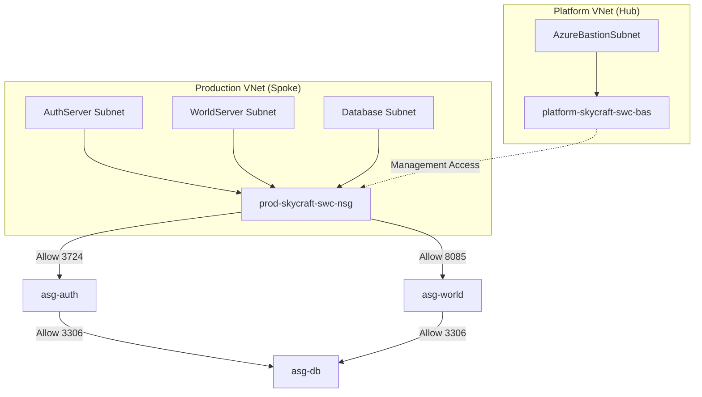
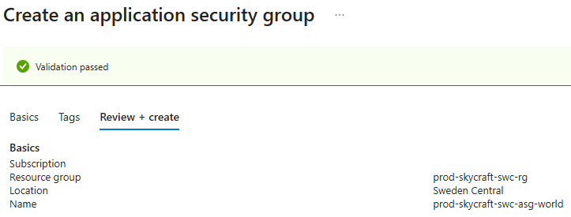
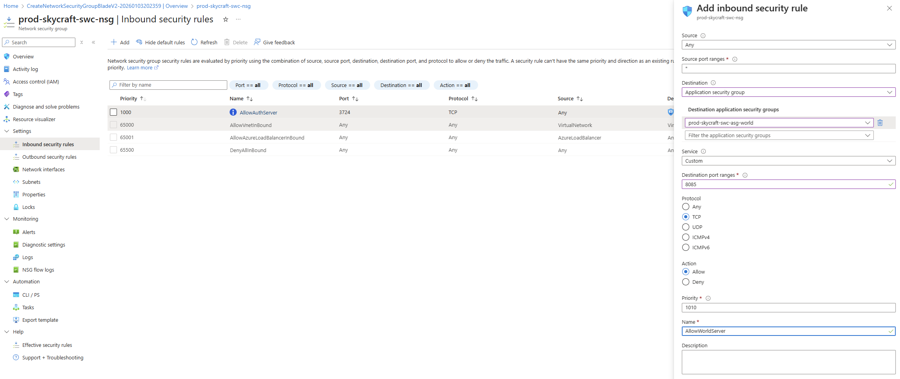
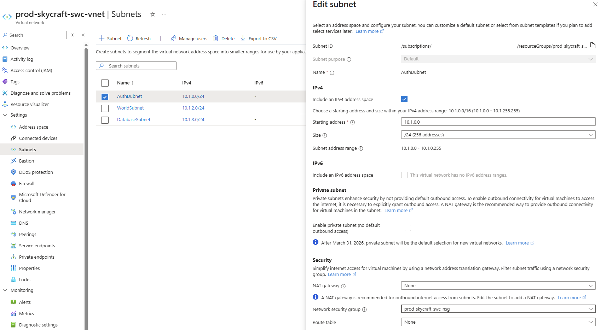

# Lab 2.2: Configure Secure Access (NSGs/ASGs) (2 hours)

---

## 📋 Lab Overview

Security is paramount. In this lab, you will secure your SkyCraft network using **Network Security Groups (NSGs)** and **Application Security Groups (ASGs)**. You will ensure that only necessary traffic is allowed to reach your game servers and database.

## 🏗️ Architecture Overview

## 🎯 Learning Objectives

- Create and associate Network Security Groups (NSGs)
- Implement Application Security Groups (ASGs) for easier management
- Create Allow/Deny security rules
- Deploy Azure Bastion for secure remote access

## 📋 Lab Tasks

### Task 1: Create Application Security Groups (ASGs)

We will use ASGs to group servers by function, so we don't have to manage IP addresses in our rules.

1. In the Azure Portal, create an **Application Security Group**.
   - **RG**: `prod-skycraft-swc-rg`
   - **Name**: `prod-skycraft-swc-asg-auth`
   - **Region**: **Sweden Central**
2. Create another ASG:
   - **Name**: `prod-skycraft-swc-asg-world`

   

3. Create a third ASG:
   - **Name**: `prod-skycraft-swc-asg-db`

**Expected Result**: Three Application Security Groups are visible in the `prod-skycraft-swc-rg` resource group.

### Task 2: Create Network Security Groups (NSGs)

We need NSGs to enforce rules at the subnet level.

1. **Create NSG for Spoke**:
   - **RG**: `prod-skycraft-swc-rg`
   - **Name**: `prod-skycraft-swc-nsg`
2. **Create NSG for Hub** (optional for this lab, but good practice):
   - **RG**: `platform-skycraft-swc-rg`
   - **Name**: `platform-skycraft-swc-nsg`

**Expected Result**: Two Network Security Groups are created (one in production, one in platform).

### Task 3: Configure NSG Rules for Game Traffic

We need to open ports for World of Warcraft (AzerothCore).

- **Auth Server Port**: 3724
- **World Server Port**: 8085

1. Open `prod-skycraft-swc-nsg`.
2. Go to **Inbound security rules**.
3. **Allow Auth Traffic**:
   - **Source**: Any
   - **Source port ranges**: \*
   - **Destination**: Application Security Group
   - **Destination ASG**: `prod-skycraft-swc-asg-auth`
   - **Service/Port**: Custom / 3724
   - **Protocol**: TCP
   - **Action**: Allow
   - **Priority**: 1000
   - **Name**: `AllowAuthServer`

   

4. **Allow World Traffic**:
   - **Source**: Any
   - **Source port ranges**: \*
   - **Destination**: Application Security Group
   - **Destination ASG**: `prod-skycraft-swc-asg-world`
   - **Service/Port**: Custom / 8085
   - **Protocol**: TCP
   - **Action**: Allow
   - **Priority**: 1100
   - **Name**: `AllowWorldServer`

**Expected Result**: Both inbound rules are listed in the NSG with the correct priorities and port mappings.

### Task 4: Secure the Database Subnet

We want to ensure ONLY the Auth and World servers can talk to the Database.

1. **Allow App to DB**:
   - **Source**: Application Security Group
   - **Source ASG**: (`prod-skycraft-swc-asg-auth`, `prod-skycraft-swc-asg-world`) - _Note: If the portal limits you to one ASG, create two separate rules._
   - **Source port ranges**: \*
   - **Destination**: Application Security Group
   - **Destination ASG**: `prod-skycraft-swc-asg-db`
   - **Service/Port**: Custom / 3306
   - **Protocol**: TCP
   - **Action**: Allow
   - **Priority**: 2000
   - **Name**: `AllowAppToDB`
2. **Deny All Other to DB**:
   - Although there is a default "AllowVNetInBound", for strict control you might add a rule to separate segments if they were in same subnet, but since they are in different subnets, the NSG applied to the subnet works.
   - _Best Practice_: creating a Deny rule with lower priority (higher number) than specific allows but higher than default allow can enforce strictness.

**Expected Result**: The Database subnet is secured with a rule that only permits traffic from the Auth and World ASGs.

### Task 5: Associate NSGs to Subnets

1. Go to **Virtual Networks** -> `prod-skycraft-swc-vnet`.
2. Select **Subnets**.
3. For each subnet (`AuthSubnet`, `WorldSubnet`, `DatabaseSubnet`):
   - Click the subnet.
   - Set **Security Group** to `prod-skycraft-swc-nsg`.
   - Click **Save**.

**Expected Result**: All three subnets show the `prod-skycraft-swc-nsg` as their associated security group.

### Task 6: Deploy Azure Bastion (Optional/If Credits Allow)

Bastion allows secure RDP/SSH without exposing public IPs on VMs.

1. Navigate to `platform-skycraft-swc-vnet` (Hub).
2. Verify that `AzureBastionSubnet` exists (created in Lab 2.1).
3. Create a **Bastion** resource.
   - **Name**: `platform-skycraft-swc-bas`
   - **Region**: **Sweden Central**
   - **VNet**: `platform-skycraft-swc-vnet`
   - **Subnet**: Select `AzureBastionSubnet`
   - **Public IP**: Create new (`platform-skycraft-swc-bas-pip`)
4. This takes ~15 mins to deploy.

**Expected Result**: A new Bastion resource and Public IP are created in the Hub VNet.

## ✅ Verification

Proceed to the [Lab Checklist](lab-checklist-2.2.md) to verify your deployment.

## 🎓 Knowledge Check

1. **Why is it recommended to use ASGs instead of IP addresses in NSG rules?**

   

     
**Click to see the answer**

   ASGs allow you to define security policies based on workload function (e.g., "Web" or "DB") rather than specific IPs. This makes the rules self-documenting and eliminates the need to update NSGs every time a new VM is added or an IP changes.
   

2. **What is the default behavior for traffic within the same Virtual Network in an NSG?**

   

     
**Click to see the answer**

   By default, the `AllowVnetInBound` rule allows all traffic between resources within the same VNet (and peered VNets) unless a higher-priority rule explicitly denies it.
   

3. **What is the primary security advantage of using Azure Bastion?**

   

     
**Click to see the answer**

   It allows you to RDP or SSH into your virtual machines over SSL (port 443) without exposing the VMs' private ports (3389/22) to the public internet via Public IP addresses.
   

---

## 📌 Module Navigation

- [← Lab 2.1: Virtual Networks](../2.1-virtual-networks/lab-guide-2.1.md)
- [Lab 2.3: Name Resolution →](../2.3-name-resolution/lab-guide-2.3.md)
