# Lab 2.2: Configure Secure Access to Virtual Networks (2.5 hours)

## 🎯 Learning Objectives

By completing this lab, you will:

- Create and configure Network Security Groups (NSGs) to control traffic flow
- Implement Application Security Groups (ASGs) for role-based network security
- Deploy Azure Bastion for secure administrative access without public IPs
- Evaluate and troubleshoot effective security rules in NSGs
- Configure service endpoints for Azure PaaS services
- Implement private endpoints for fully private connectivity
- Understand the difference between service and private endpoints

---

## 🏗️ Architecture Overview

You'll implement comprehensive network security on the existing hub-spoke topology:

```mermaid
graph TB
    subgraph Internet
        Admin[Administrator<br/>Your Laptop]
    end

    subgraph "platform-skycraft-swc-rg"
        Bastion[Azure Bastion<br/>platform-skycraft-swc-bas<br/>10.0.0.0/26]
        BastionPIP[Public IP<br/>platform-skycraft-swc-bas-pip]
    end

    subgraph "dev-skycraft-swc-rg"
        DevNSG1[dev-skycraft-swc-auth-nsg<br/>Allow: SSH from Bastion]
        DevNSG2[dev-skycraft-swc-world-nsg<br/>Allow: Game ports]
        DevNSG3[dev-skycraft-swc-db-nsg<br/>Allow: MySQL from App]

        DevASG1[dev-skycraft-swc-asg-auth<br/>Auth Servers]
        DevASG2[dev-skycraft-swc-asg-world<br/>World Servers]

        DevSubnet1[AuthSubnet<br/>10.1.1.0/24]
        DevSubnet2[WorldSubnet<br/>10.1.2.0/24]
        DevSubnet3[DatabaseSubnet<br/>10.1.3.0/24]
    end

    subgraph "prod-skycraft-swc-rg"
        ProdNSG1[prod-skycraft-swc-auth-nsg]
        ProdNSG2[prod-skycraft-swc-world-nsg]
        ProdNSG3[prod-skycraft-swc-db-nsg]

        ProdSubnet1[AuthSubnet<br/>10.2.1.0/24]
        ProdSubnet2[WorldSubnet<br/>10.2.2.0/24]
        ProdSubnet3[DatabaseSubnet<br/>10.2.3.0/24]

        PrivateEndpoint[Private Endpoint<br/>Azure SQL]
    end

    Admin -->|HTTPS:443| BastionPIP
    Bastion -->|SSH:22| DevSubnet1
    Bastion -->|SSH:22| ProdSubnet1

    DevNSG1 -.->|Applied to| DevSubnet1
    DevNSG2 -.->|Applied to| DevSubnet2
    DevNSG3 -.->|Applied to| DevSubnet3

    style Bastion fill:#4CAF50,stroke:#2E7D32,stroke-width:3px
    style DevNSG1 fill:#FFC107,stroke:#F57C00,stroke-width:2px
    style DevNSG2 fill:#FFC107,stroke:#F57C00,stroke-width:2px
    style DevNSG3 fill:#FFC107,stroke:#F57C00,stroke-width:2px
    style ProdNSG1 fill:#FF5722,stroke:#D84315,stroke-width:2px
    style PrivateEndpoint fill:#9C27B0,stroke:#6A1B9A,stroke-width:2px
```



---

## 📋 Real-World Scenario

**Situation**: The SkyCraft network infrastructure is deployed, but all resources are currently unprotected. Virtual machines will be exposed to the internet without proper security controls. The development team needs secure SSH access for administration, game servers need to accept player connections, and databases must only accept traffic from application servers—all without exposing unnecessary services.

**Your Task**: Implement defense-in-depth security by:

- Deploying Network Security Groups to control traffic at subnet level
- Using Application Security Groups to simplify management of server roles
- Deploying Azure Bastion for secure administrative access (no public IPs on VMs)
- Configuring private endpoints to keep Azure SQL traffic on Microsoft backbone
- Testing and verifying effective security rules

---

## ⏱️ Estimated Time: 2.5 hours

- **Section 1**: Understanding network security concepts (15 min)
- **Section 2**: Create and configure NSGs for dev environment (30 min)
- **Section 3**: Create Application Security Groups (20 min)
- **Section 4**: Deploy Azure Bastion (25 min)
- **Section 5**: Configure NSGs for production environment (20 min)
- **Section 6**: Configure service and private endpoints (20 min)
- **Section 7**: Test and verify security rules (20 min)

---

## ✅ Prerequisites

Before starting this lab:

- [ ] Completed Lab 2.1 (Virtual Networks and Peering)
- [ ] Three VNets exist: platform-skycraft-swc-vnet, dev-skycraft-swc-vnet, prod-skycraft-swc-vnet
- [ ] VNet peering connections operational (hub-to-dev, hub-to-prod)
- [ ] Owner or Contributor role at subscription level
- [ ] Understanding of TCP/IP ports and network security concepts

---

## 📖 Section 1: Understanding Network Security Concepts (15 minutes)

### What are Network Security Groups (NSGs)?

**Network Security Groups** filter network traffic to and from Azure resources using security rules. Think of NSGs as stateful firewalls that:

- Control **inbound** and **outbound** traffic
- Apply at **subnet** or **network interface** level
- Evaluate rules by **priority** (100-4096, lower = higher priority)
- Are **stateful** (return traffic is automatically allowed)

### NSG vs Firewall vs Application Security Groups

| Feature      | NSG                     | Azure Firewall                      | ASG                       |
| ------------ | ----------------------- | ----------------------------------- | ------------------------- |
| **Purpose**  | Basic traffic filtering | Advanced network security           | Logical grouping          |
| **Scope**    | Subnet or NIC           | Entire VNet or subscription         | Tag for use in NSG rules  |
| **Cost**     | Free                    | ~$1.25/hour                         | Free                      |
| **Features** | 5-tuple rules           | FQDN filtering, threat intelligence | Simplifies NSG management |
| **Use Case** | Standard protection     | Enterprise security                 | Group VMs by role         |

### Service Endpoints vs Private Endpoints

| Aspect           | Service Endpoint                          | Private Endpoint                        |
| ---------------- | ----------------------------------------- | --------------------------------------- |
| **Traffic Path** | Microsoft backbone (still uses public IP) | Fully private (private IP in your VNet) |
| **DNS**          | Public DNS unchanged                      | Private DNS zone required               |
| **Cost**         | Free                                      | ~$7.50/month per endpoint               |
| **Security**     | Service-level filtering                   | Network-level isolation                 |
| **Use Case**     | Cost-effective for trusted services       | Maximum security for sensitive data     |

### Defense-in-Depth Strategy for SkyCraft

```
Layer 1: Azure Bastion (secure entry point)
Layer 2: NSG on subnets (broad traffic control)
Layer 3: ASG grouping (role-based rules)
Layer 4: Private Endpoints (PaaS isolation)
Layer 5: VM-level firewalls (OS-level protection)
```

---

## 📖 Section 2: Create and Configure NSGs for Dev Environment (30 minutes)

### Step 2.2.1: Create NSG for Auth Subnet

1. In **Azure Portal**, search for **"Network security groups"**
2. Click **+ Create**

**Basics tab**:

| Field          | Value                       |
| -------------- | --------------------------- |
| Subscription   | [Your subscription]         |
| Resource group | `dev-skycraft-swc-rg`       |
| Name           | `dev-skycraft-swc-auth-nsg` |
| Region         | **Sweden Central**          |

3. Click **Next: Tags**
4. Add tags:

| Name        | Value       |
| ----------- | ----------- |
| Project     | SkyCraft    |
| Environment | Development |
| CostCenter  | MSDN        |

5. Click **Review + create** → **Create**

**Expected Result**: NSG `dev-skycraft-swc-auth-nsg` created successfully.

### Step 2.2.2: Configure Inbound Security Rules for Auth NSG

1. Navigate to the newly created NSG: **dev-skycraft-swc-auth-nsg**
2. In left menu, click **Inbound security rules**
3. Note the default rules (DenyAllInbound is priority 65500)

**Create Rule 1: Allow SSH from Bastion**

4. Click **+ Add**
5. Configure:

| Field                           | Value                                        |
| ------------------------------- | -------------------------------------------- |
| Source                          | IP Addresses                                 |
| Source IP addresses/CIDR ranges | `10.0.0.0/26` (Bastion subnet)               |
| Source port ranges              | `*`                                          |
| Destination                     | Any                                          |
| Service                         | SSH                                          |
| Destination port ranges         | 22                                           |
| Protocol                        | TCP                                          |
| Action                          | **Allow**                                    |
| Priority                        | `100`                                        |
| Name                            | `Allow-SSH-From-Bastion`                     |
| Description                     | `Allow SSH access from Azure Bastion subnet` |

6. Click **Add**

**Create Rule 2: Allow Game Auth Port**

7. Click **+ Add** again
8. Configure:

| Field                   | Value                                           |
| ----------------------- | ----------------------------------------------- |
| Source                  | Any                                             |
| Source port ranges      | `*`                                             |
| Destination             | Any                                             |
| Service                 | Custom                                          |
| Destination port ranges | `3724`                                          |
| Protocol                | TCP                                             |
| Action                  | **Allow**                                       |
| Priority                | `110`                                           |
| Name                    | `Allow-Auth-GamePort`                           |
| Description             | `Allow game authentication traffic (port 3724)` |

9. Click **Add**

**Expected Result**: Two custom inbound rules created with priorities 100 and 110.

### Step 2.2.3: Associate NSG with Auth Subnet

1. Still in **dev-skycraft-swc-auth-nsg**, click **Subnets** in left menu
2. Click **+ Associate**
3. Configure:

| Field           | Value                   |
| --------------- | ----------------------- |
| Virtual network | `dev-skycraft-swc-vnet` |
| Subnet          | `AuthSubnet`            |

4. Click **OK**

**Expected Result**: NSG is now associated with AuthSubnet (10.1.1.0/24). All traffic to/from this subnet will be evaluated by NSG rules.

### Step 2.2.4: Create NSG for World Subnet

1. Navigate to **Network security groups** → **+ Create**

**Create NSG**:

| Field          | Value                        |
| -------------- | ---------------------------- |
| Resource group | `dev-skycraft-swc-rg`        |
| Name           | `dev-skycraft-swc-world-nsg` |
| Region         | **Sweden Central**           |

2. Add proper tags (Project, Environment, CostCenter)
3. Click **Review + create** → **Create**

**Configure Inbound Rules**:

4. Open **dev-skycraft-swc-world-nsg** → **Inbound security rules**

**Rule 1: Allow SSH from Bastion**

5. Add rule:

| Field                   | Value                    |
| ----------------------- | ------------------------ |
| Source IP addresses     | `10.0.0.0/26`            |
| Destination port ranges | 22                       |
| Protocol                | TCP                      |
| Action                  | Allow                    |
| Priority                | `100`                    |
| Name                    | `Allow-SSH-From-Bastion` |

**Rule 2: Allow World Server Port**

6. Add rule:

| Field                   | Value                                        |
| ----------------------- | -------------------------------------------- |
| Source                  | Any                                          |
| Destination port ranges | `8085`                                       |
| Protocol                | TCP                                          |
| Action                  | Allow                                        |
| Priority                | `110`                                        |
| Name                    | `Allow-World-GamePort`                       |
| Description             | `Allow world server connections (port 8085)` |

**Associate with Subnet**:

7. Click **Subnets** → **+ Associate**
8. Select VNet: `dev-skycraft-swc-vnet`, Subnet: `WorldSubnet`
9. Click **OK**

**Expected Result**: World subnet protected with NSG allowing SSH (from Bastion) and game port 8085.

### Step 2.2.5: Create NSG for Database Subnet

1. Create NSG: `dev-skycraft-swc-db-nsg` in `dev-skycraft-swc-rg`
2. Add proper tags

**Configure Inbound Rules**:

**Rule 1: Allow SSH from Bastion**

3. Add rule with priority 100, allowing SSH (22) from 10.0.0.0/26

**Rule 2: Allow MySQL from Application Subnets**

4. Add rule:

| Field                   | Value                                              |
| ----------------------- | -------------------------------------------------- |
| Source                  | IP Addresses                                       |
| Source IP addresses     | `10.1.1.0/24,10.1.2.0/24` (Auth and World subnets) |
| Destination port ranges | `3306`                                             |
| Protocol                | TCP                                                |
| Action                  | Allow                                              |
| Priority                | `110`                                              |
| Name                    | `Allow-MySQL-From-AppTier`                         |
| Description             | `Allow MySQL from Auth and World servers`          |

**Associate with Subnet**:

5. Associate NSG with `DatabaseSubnet` in `dev-skycraft-swc-vnet`

**Expected Result**: Database subnet only accepts MySQL traffic from application tiers and SSH from Bastion.

---

## 📖 Section 3: Create Application Security Groups (20 minutes)

### What are Application Security Groups?

**Application Security Groups (ASGs)** let you group virtual machines by role, then reference those groups in NSG rules. This simplifies security management:

**Without ASG**:

```
Allow SSH from 10.1.1.4, 10.1.1.5, 10.1.1.6 (must update rule when adding VMs)
```

**With ASG**:

```
Allow SSH from ASG "AuthServers" (VMs automatically get rule when added to ASG)
```

### Step 2.2.6: Create ASG for Auth Servers

1. In Azure Portal, search for **"Application security groups"**
2. Click **+ Create**

**Basics tab**:

| Field          | Value                       |
| -------------- | --------------------------- |
| Subscription   | [Your subscription]         |
| Resource group | `dev-skycraft-swc-rg`       |
| Name           | `dev-skycraft-swc-asg-auth` |
| Region         | **Sweden Central**          |

3. Click **Next: Tags**
4. Add tags (Project: SkyCraft, Environment: Development, CostCenter: MSDN)
5. Click **Review + create** → **Create**

**Expected Result**: ASG `dev-skycraft-swc-asg-auth` created.

### Step 2.2.7: Create ASG for World Servers

1. Repeat the process:

   - Name: `dev-skycraft-swc-asg-world`
   - Resource group: `dev-skycraft-swc-rg`
   - Region: **Sweden Central**
   - Add proper tags

2. Click **Review + create** → **Create**

### Step 2.2.8: Create ASG for Database Servers

1. Create third ASG:

   - Name: `dev-skycraft-swc-asg-db`
   - Resource group: `dev-skycraft-swc-rg`
   - Region: **Sweden Central**
   - Add proper tags

2. Click **Review + create** → **Create**

**Expected Result**: Three ASGs created for role-based grouping (auth, world, database).

### Step 2.2.9: Update NSG Rule to Use ASG (Optional Demonstration)

To demonstrate ASG usage, let's update the database NSG rule:

1. Navigate to **dev-skycraft-swc-db-nsg** → **Inbound security rules**
2. Click on the rule **Allow-MySQL-From-AppTier**
3. Change:
   - Source: **Application security group**
   - Source ASG: Select `dev-skycraft-swc-asg-auth` and `dev-skycraft-swc-asg-world`
4. Click **Save**

**Note**: This won't work yet (no VMs assigned to ASGs), but demonstrates the concept. In Module 3, when we create VMs, we'll assign them to these ASGs.

---

## 📖 Section 4: Deploy Azure Bastion (25 minutes)

### What is Azure Bastion?

**Azure Bastion** provides secure RDP and SSH connectivity to virtual machines directly through the Azure Portal, without:

- Exposing VMs with public IP addresses
- Managing jump box VMs
- Opening RDP/SSH ports to the internet
- Requiring VPN connections

### Step 2.2.10: Deploy Azure Bastion

1. In Azure Portal, search for **"Bastions"**
2. Click **+ Create**

**Basics tab**:

| Field             | Value                              |
| ----------------- | ---------------------------------- |
| Subscription      | [Your subscription]                |
| Resource group    | `platform-skycraft-swc-rg`         |
| Name              | `platform-skycraft-swc-bas`        |
| Region            | **Sweden Central**                 |
| Tier              | **Basic**                          |
| Instance count    | 2                                  |
| Virtual network   | `platform-skycraft-swc-vnet`       |
| Subnet            | `AzureBastionSubnet (10.0.0.0/26)` |
| Public IP address | Create new                         |
| Public IP name    | `platform-skycraft-swc-bas-pip`    |
| Public IP SKU     | Standard (Auto-selected)           |
| Assignment        | Static (Auto-selected)             |

3. Click **Next: Tags**
4. Add tags:

| Name        | Value    |
| ----------- | -------- |
| Project     | SkyCraft |
| Environment | Platform |
| CostCenter  | MSDN     |

5. Click **Review + create**
6. Review the configuration
7. Click **Create**

**Expected Result**:

- Deployment takes 5-10 minutes
- Progress shows: Validating → Deploying → Complete
- Azure Bastion deployed to AzureBastionSubnet in hub VNet

**Important**: Do NOT navigate away during deployment. If deployment fails, check:

- AzureBastionSubnet exists and is exactly /26 or larger
- Public IP is Standard SKU and Static
- No NSG associated with AzureBastionSubnet (Bastion manages its own security)

### Step 2.2.11: Verify Bastion Deployment

1. Once deployment completes, navigate to **Bastions**
2. Click **platform-skycraft-swc-bas**
3. Verify:
   - Status: **Succeeded**
   - Virtual network: `platform-skycraft-swc-vnet`
   - Subnet: `AzureBastionSubnet`
   - Public IP: `platform-skycraft-swc-bas-pip`

**Expected Result**: Bastion is operational and ready to provide secure connectivity to VMs in all peered VNets.

---

## 📖 Section 5: Configure NSGs for Production Environment (20 minutes)

### Step 2.2.12: Create Production NSGs

Create three NSGs for production environment (following same pattern as dev):

**NSG 1: Auth Subnet**

1. Create NSG:

   - Name: `prod-skycraft-swc-auth-nsg`
   - Resource group: `prod-skycraft-swc-rg`
   - Region: **Sweden Central**
   - Tags: Project=SkyCraft, Environment=Production, CostCenter=MSDN

2. Add inbound rules:

   - Priority 100: Allow SSH (22) from Bastion (10.0.0.0/26)
   - Priority 110: Allow Auth port (3724) from Any

3. Associate with `AuthSubnet` in `prod-skycraft-swc-vnet`

**NSG 2: World Subnet**

1. Create NSG:

   - Name: `prod-skycraft-swc-world-nsg`
   - Resource group: `prod-skycraft-swc-rg`
   - Add proper tags

2. Add inbound rules:

   - Priority 100: Allow SSH (22) from Bastion (10.0.0.0/26)
   - Priority 110: Allow World port (8085) from Any

3. Associate with `WorldSubnet` in `prod-skycraft-swc-vnet`

**NSG 3: Database Subnet**

1. Create NSG:

   - Name: `prod-skycraft-swc-db-nsg`
   - Resource group: `prod-skycraft-swc-rg`
   - Add proper tags

2. Add inbound rules:

   - Priority 100: Allow SSH (22) from Bastion (10.0.0.0/26)
   - Priority 110: Allow MySQL (3306) from 10.2.1.0/24,10.2.2.0/24

3. Associate with `DatabaseSubnet` in `prod-skycraft-swc-vnet`

**Expected Result**: Production environment has identical security posture to development, with NSGs protecting all subnets.

### Step 2.2.13: Review Effective Security Rules

1. Navigate to any NSG (e.g., `prod-skycraft-swc-db-nsg`)
2. Click **Effective security rules** in left menu
3. Note: This will show actual rules once VMs are deployed
4. Review rule evaluation order:
   - Custom rules (priority 100-4096)
   - Default allow rules (65000-65001)
   - Default deny rules (65500)

**Expected View**: Understanding how Azure evaluates rules from lowest to highest priority, stopping at first match.

---

## 📖 Section 6: Configure Service and Private Endpoints (20 minutes)

### Step 2.2.14: Enable Service Endpoint on Database Subnet

**Service endpoints** route traffic to Azure PaaS services (Storage, SQL, Key Vault) over the Azure backbone, avoiding the public internet.

1. Navigate to **Virtual networks** → **dev-skycraft-swc-vnet**
2. Click **Subnets** in left menu
3. Click on **DatabaseSubnet**
4. Under **Service endpoints**, click **+ Add**
5. Select services:
   - **Microsoft.Sql** (for Azure SQL Database)
   - **Microsoft.Storage** (for Azure Storage)
6. Click **Save**

**Expected Result**:

- Service endpoints enabled on DatabaseSubnet
- Traffic to Azure SQL and Storage now uses Microsoft backbone
- Still uses public IP addresses but never traverses public internet

### Step 2.2.15: Enable Service Endpoint on Production Database Subnet

1. Navigate to **prod-skycraft-swc-vnet** → **Subnets** → **DatabaseSubnet**
2. Add service endpoints:
   - **Microsoft.Sql**
   - **Microsoft.Storage**
3. Click **Save**

**Expected Result**: Both dev and prod database subnets can securely access Azure PaaS services.

### Step 2.2.16: Understand Private Endpoint Concepts

**Private Endpoints** go further than service endpoints by:

- Assigning a **private IP** from your VNet to the Azure service
- Making the service **fully private** (no public IP involved)
- Requiring **Private DNS zones** for name resolution

**When to use Private Endpoints**:

- Maximum security for sensitive data (compliance requirements)
- Need to access PaaS services over VPN/ExpressRoute from on-premises
- Want to completely disable public access to Azure services

**Cost consideration**: ~$7.50/month per private endpoint

### Step 2.2.17: Create Private Endpoint (Conceptual)

**Note**: We'll create a placeholder without an actual Azure SQL database (which would be deployed in Module 3 or 4).

To create a private endpoint for Azure SQL Database:

1. Navigate to **Private Link Center** in Azure Portal
2. Click **Private endpoints** → **+ Create**
3. Configure:

| Field               | Value                      |
| ------------------- | -------------------------- |
| Resource group      | `prod-skycraft-swc-rg`     |
| Name                | `prod-skycraft-swc-sql-pe` |
| Region              | **Sweden Central**         |
| Target sub-resource | `sqlServer`                |
| Virtual network     | `prod-skycraft-swc-vnet`   |
| Subnet              | `DatabaseSubnet`           |

4. Private DNS integration:

   - Create new private DNS zone: `privatelink.database.windows.net`
   - Link to VNet: `prod-skycraft-swc-vnet`

5. Tags and create

**Expected Result** (when Azure SQL exists):

- Private endpoint gets IP like 10.2.3.10
- DNS resolves `yourserver.database.windows.net` to 10.2.3.10
- No public internet access needed

**For this lab**: Understand the concept; we'll implement in Module 4 when deploying Azure SQL.

---

## 📖 Section 7: Test and Verify Security Rules (20 minutes)

### Step 2.2.18: Verify NSG Associations

1. Navigate to **Network security groups**
2. For each NSG, verify:
   - **Subnets** tab shows correct subnet association
   - **Inbound security rules** shows custom rules (priority 100, 110, etc.)
   - **Outbound security rules** shows default rules

**Verification Table**:

| NSG Name                    | Associated Subnet                     | Inbound Rules Count  |
| --------------------------- | ------------------------------------- | -------------------- |
| dev-skycraft-swc-auth-nsg   | dev-skycraft-swc-vnet/AuthSubnet      | 2 custom + 3 default |
| dev-skycraft-swc-world-nsg  | dev-skycraft-swc-vnet/WorldSubnet     | 2 custom + 3 default |
| dev-skycraft-swc-db-nsg     | dev-skycraft-swc-vnet/DatabaseSubnet  | 2 custom + 3 default |
| prod-skycraft-swc-auth-nsg  | prod-skycraft-swc-vnet/AuthSubnet     | 2 custom + 3 default |
| prod-skycraft-swc-world-nsg | prod-skycraft-swc-vnet/WorldSubnet    | 2 custom + 3 default |
| prod-skycraft-swc-db-nsg    | prod-skycraft-swc-vnet/DatabaseSubnet | 2 custom + 3 default |

### Step 2.2.19: Test NSG Rule Logic (Conceptual)

**Scenario 1**: SSH from Bastion to Auth Server

```
Source: 10.0.0.5 (Bastion)
Destination: 10.1.1.10 (Auth Server)
Port: 22 (SSH)

Evaluation:
✅ Rule 100 (Allow-SSH-From-Bastion): MATCH - ALLOW
   (Does not check remaining rules)
```

**Scenario 2**: SSH from Internet to Auth Server

```
Source: 203.0.113.50 (Internet)
Destination: 10.1.1.10 (Auth Server)
Port: 22 (SSH)

Evaluation:
❌ Rule 100: No match (source not 10.0.0.0/26)
❌ Rule 110: No match (port 3724, not 22)
❌ Default allow rules: No match
❌ Rule 65500 (DenyAllInbound): MATCH - DENY
```

**Scenario 3**: Game client connecting to World Server

```
Source: 203.0.113.75 (Player)
Destination: 10.1.2.15 (World Server)
Port: 8085

Evaluation:
❌ Rule 100: No match (port 22, not 8085)
✅ Rule 110 (Allow-World-GamePort): MATCH - ALLOW
```

### Step 2.2.20: Verify Azure Bastion Connectivity

1. Navigate to **Bastions** → **platform-skycraft-swc-bas**
2. Verify operational status
3. Note the architecture:
   - Bastion in hub VNet (10.0.0.0/26)
   - Can connect to VMs in dev VNet (via hub-to-dev peering)
   - Can connect to VMs in prod VNet (via hub-to-prod peering)

**Expected Result**: Bastion is ready to connect to any VM deployed in dev or prod VNets (will test with actual VMs in Module 3).

### Step 2.2.21: Verify Service Endpoints

1. Navigate to **dev-skycraft-swc-vnet** → **Subnets** → **DatabaseSubnet**
2. Confirm **Service endpoints** shows:

   - Microsoft.Sql
   - Microsoft.Storage

3. Navigate to **prod-skycraft-swc-vnet** → **Subnets** → **DatabaseSubnet**
4. Confirm same service endpoints enabled

**Expected Result**: Database subnets can access Azure SQL and Storage over Microsoft backbone (private routing).

---

## ✅ Lab Checklist

Quick verification before proceeding:

### Azure Bastion

- [ ] `platform-skycraft-swc-bas` deployed successfully
- [ ] Associated with `AzureBastionSubnet` in hub VNet
- [ ] Public IP: `platform-skycraft-swc-bas-pip` attached
- [ ] Status: Succeeded

### Network Security Groups (Dev)

- [ ] `dev-skycraft-swc-auth-nsg` created and associated with AuthSubnet
- [ ] `dev-skycraft-swc-world-nsg` created and associated with WorldSubnet
- [ ] `dev-skycraft-swc-db-nsg` created and associated with DatabaseSubnet
- [ ] All NSGs have custom inbound rules (SSH from Bastion + service port)

### Network Security Groups (Prod)

- [ ] `prod-skycraft-swc-auth-nsg` created and associated with AuthSubnet
- [ ] `prod-skycraft-swc-world-nsg` created and associated with WorldSubnet
- [ ] `prod-skycraft-swc-db-nsg` created and associated with DatabaseSubnet
- [ ] All NSGs have proper tags (Project, Environment, CostCenter)

### Application Security Groups

- [ ] `dev-skycraft-swc-asg-auth` created
- [ ] `dev-skycraft-swc-asg-world` created
- [ ] `dev-skycraft-swc-asg-db` created

### Service Endpoints

- [ ] Service endpoints enabled on dev DatabaseSubnet (Microsoft.Sql, Microsoft.Storage)
- [ ] Service endpoints enabled on prod DatabaseSubnet (Microsoft.Sql, Microsoft.Storage)

**For detailed verification**, see [lab-checklist-2.2.md](lab-checklist-2.2.md)

---

## 🎓 Knowledge Check

Test your understanding with these questions:

1. **What is the difference between Network Security Groups (NSGs) and Azure Firewall?**

   <details>
     <summary>**Click to see the answer**</summary>

   **Answer**:

   **Network Security Groups (NSGs)**:

   - Basic stateful firewall functionality
   - Free (no additional cost)
   - Filters traffic based on 5-tuple (source IP, source port, destination IP, destination port, protocol)
   - Applied at subnet or NIC level
   - Good for: Standard micro-segmentation

   **Azure Firewall**:

   - Advanced network security service
   - ~$1.25/hour + data processing costs
   - FQDN filtering, threat intelligence, central logging
   - Applied at VNet or subscription level
   - Good for: Enterprise security, central policy management, logging

   **For SkyCraft**: NSGs are sufficient for game server protection. Azure Firewall would be overkill unless managing dozens of VNets or need advanced threat detection.
   </details>

2. **Why must Azure Bastion subnet be named exactly "AzureBastionSubnet"?**

   <details>
     <summary>**Click to see the answer**</summary>

   **Answer**: Azure Bastion is a **platform service** that searches for a subnet with this exact, hardcoded name. This is similar to `GatewaySubnet` for VPN Gateway.

   **Requirements**:

   - Name: `AzureBastionSubnet` (case-sensitive)
   - Minimum size: /26 (64 IP addresses)
   - No NSG should be associated (Bastion manages its own security)
   - Must exist before deploying Bastion

   If you use `Bastion-Subnet`, `azurebastionsubnet`, or any variation, deployment will fail with error: "Subnet AzureBastionSubnet not found".
   </details>

3. **How do Application Security Groups (ASGs) simplify security management?**

   <details>
     <summary>**Click to see the answer**</summary>

   **Answer**: ASGs provide **logical grouping** of VMs by role, eliminating the need to manage IP addresses in NSG rules.

   **Without ASG** (IP-based):

   ```
   Allow MySQL from 10.1.1.4, 10.1.1.5, 10.1.1.6, 10.1.2.10, 10.1.2.11
   ```

   Problem: Must update rule every time you add/remove application servers.

   **With ASG** (role-based):

   ```
   Allow MySQL from ASG "ApplicationServers"
   ```

   Benefit: VMs automatically inherit rules when assigned to ASG. No rule updates needed.

   **Real-world impact**: In SkyCraft, when you scale from 3 to 10 world servers, with ASGs you just assign new VMs to the ASG. Without ASGs, you'd need to update multiple NSG rules.
   </details>

4. **What is the difference between service endpoints and private endpoints?**

   <details>
     <summary>**Click to see the answer**</summary>

   **Answer**:

   | Aspect                  | Service Endpoint                  | Private Endpoint                     |
   | ----------------------- | --------------------------------- | ------------------------------------ |
   | **IP addressing**       | Service keeps public IP           | Service gets private IP in your VNet |
   | **Traffic path**        | Microsoft backbone (not internet) | Fully private (your VNet)            |
   | **DNS**                 | Public DNS unchanged              | Requires private DNS zone            |
   | **Security**            | Service-level firewall rules      | Network-level isolation              |
   | **Cost**                | Free                              | ~$7.50/month per endpoint            |
   | **Access from on-prem** | No (public IP)                    | Yes (via VPN/ExpressRoute)           |

   **Use service endpoints when**: Cost is a concern, traffic stays within Azure

   **Use private endpoints when**: Maximum security needed, compliance requires no public IPs, accessing from on-premises
   </details>

5. **If two NSG rules have the same priority, which one takes precedence?**

   <details>
     <summary>**Click to see the answer**</summary>

   **Answer**: **You cannot have two rules with the same priority in the same NSG.**

   Azure enforces unique priorities within each NSG. If you try to create a rule with an existing priority, deployment fails with error: "Priority X is already used by another rule."

   **Rule evaluation order**:

   1. Custom rules evaluated lowest to highest priority (100 → 4096)
   2. Stops at **first match** (allow or deny)
   3. If no custom rules match, default rules are evaluated (65000+)

   **Best practice**: Space priorities by 10s (100, 110, 120...) to allow inserting rules later without renumbering everything.
   </details>

6. **Can Azure Bastion connect to VMs in peered VNets?**

   <details>
     <summary>**Click to see the answer**</summary>

   **Answer**: **Yes**, Azure Bastion can connect to VMs in directly peered VNets.

   In the SkyCraft architecture:

   - Bastion deployed in **hub VNet** (platform-skycraft-swc-vnet)
   - Dev VNet **peers** with hub (hub-to-dev peering)
   - Prod VNet **peers** with hub (hub-to-prod peering)

   **Result**: Bastion can connect to any VM in dev or prod spoke VNets through the peering connections.

   **Limitation**: Bastion cannot connect through **transitive peering**. If VNet A peers with B, and B peers with C, Bastion in A cannot reach VMs in C (unless A also peers with C directly).

   **Benefit**: Single Bastion in hub serves all spoke environments, reducing cost and complexity.
   </details>

7. **What happens if you associate an NSG with AzureBastionSubnet?**

   <details>
     <summary>**Click to see the answer**</summary>

   **Answer**: **Bastion deployment may fail or connectivity will break.**

   Azure Bastion manages its own security and requires specific ports:

   - Inbound 443 (HTTPS from internet)
   - Outbound 443, 22, 3389 (to VMs)
   - Azure platform communications

   **If you apply an NSG**:

   - Must allow all required ports (complex to maintain)
   - Risk of blocking platform management traffic
   - Microsoft recommends **no NSG on AzureBastionSubnet**

   **Best practice**: Let Bastion manage its own security. Use NSGs on VM subnets to control which IPs can connect from Bastion.
   </details>

---

## 🔧 Troubleshooting

### Issue 1: Azure Bastion deployment fails

**Symptom**: Error: "Subnet AzureBastionSubnet not found" or "Subnet must be at least /26"

**Solution**:

- Verify subnet name is exactly `AzureBastionSubnet` (case-sensitive)
- Confirm subnet size is /26 or larger (/25, /24, etc.)
- Check subnet exists in the selected VNet
- Ensure no NSG is associated with AzureBastionSubnet

### Issue 2: Cannot associate NSG with subnet

**Symptom**: Error: "Subnet already has an NSG associated"

**Solution**:

- Each subnet can only have one NSG
- To replace: First dissociate existing NSG, then associate new one
- Go to current NSG → **Subnets** → click **X** to dissociate
- Then associate new NSG with the subnet

### Issue 3: NSG rule not working as expected

**Symptom**: Traffic is allowed/blocked contrary to expectations

**Solution**:

- Check rule priority (lower number = higher priority)
- Verify source/destination IP ranges don't have typos
- Remember rules are stateful (return traffic automatically allowed)
- Use **Effective security rules** to see actual rule evaluation
- Check both subnet NSG and NIC NSG (if VM has both)

### Issue 4: Service endpoint shows "Provisioning" for long time

**Symptom**: Service endpoint status stuck on "Provisioning"

**Solution**:

- Refresh Azure Portal (F5)
- Wait 5-10 minutes for backend provisioning
- If still stuck after 15 minutes, remove and re-add service endpoint
- Check Azure Service Health for regional issues

### Issue 5: Bastion shows "Connecting..." but never connects

**Symptom**: Bastion connection dialog shows "Connecting" indefinitely

**Solution**:

- Verify VNet peering status is "Connected" (if connecting to spoke VNet VM)
- Check NSG on target VM's subnet allows SSH (22) or RDP (3389) from Bastion subnet (10.0.0.0/26)
- Confirm VM is running (not stopped or deallocated)
- Verify VM has working network interface
- Try connecting to different VM to isolate issue

### Issue 6: Application Security Group option grayed out in NSG rule

**Symptom**: Cannot select ASG when creating NSG rule

**Solution**:

- ASG must be in same region as NSG
- Verify ASG created successfully (check resource exists)
- ASG and NSG must be in same subscription
- Try refreshing Azure Portal (F5)

---

## 📚 Additional Resources

- [Network Security Groups Overview](https://learn.microsoft.com/en-us/azure/virtual-network/network-security-groups-overview)
- [Application Security Groups](https://learn.microsoft.com/en-us/azure/virtual-network/application-security-groups)
- [Azure Bastion Documentation](https://learn.microsoft.com/en-us/azure/bastion/)
- [Virtual Network Service Endpoints](https://learn.microsoft.com/en-us/azure/virtual-network/virtual-network-service-endpoints-overview)
- [Azure Private Link and Private Endpoints](https://learn.microsoft.com/en-us/azure/private-link/private-endpoint-overview)
- [Troubleshoot NSG issues](https://learn.microsoft.com/en-us/azure/virtual-network/diagnose-network-traffic-filter-problem)

---

## 📌 Module Navigation

- [← Back to Module 2 Index](../README.md)
- [← Previous Lab: 2.1 Virtual Networks](../2.1-virtual-networks/lab-guide-2.1.md)
- [Next Lab: 2.3 DNS & Load Balancing →](../2.3-dns-load-balancing/lab-guide-2.3.md)

---

## 📝 Lab Summary

**What You Accomplished**:

- ✅ Deployed Azure Bastion for secure administrative access (no VMs need public IPs)
- ✅ Created 6 Network Security Groups (3 for dev, 3 for prod) with custom rules
- ✅ Implemented Application Security Groups for role-based security
- ✅ Configured service endpoints on database subnets for secure PaaS access
- ✅ Understand the difference between service and private endpoints
- ✅ Implemented defense-in-depth security for the SkyCraft infrastructure

**Security Posture**:

- 🔒 All subnets protected by NSGs with least-privilege rules
- 🔒 Administrative access only through Azure Bastion (no SSH/RDP from internet)
- 🔒 Database subnets only accept traffic from application tiers
- 🔒 Game servers only expose required ports (3724, 8085)
- 🔒 Azure PaaS services accessed over Microsoft backbone (service endpoints)

**Time Spent**: ~2.5 hours

**Ready for Lab 2.3?** Next, you'll configure Azure DNS for custom domain resolution and deploy Azure Load Balancer for high-availability game server distribution.
