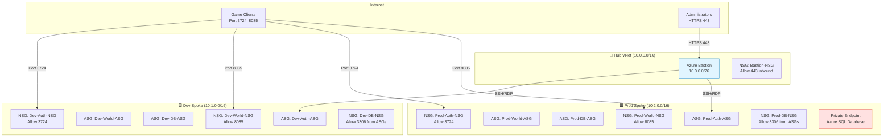

## 📋 Learning Objectives

By completing this lab, you will:
- Create and configure Network Security Groups (NSGs) with inbound/outbound rules
- Implement Application Security Groups (ASGs) for logical grouping
- Evaluate effective security rules and troubleshoot NSG configurations
- Deploy Azure Bastion for secure, password-less VM access
- Configure service endpoints for Azure Storage
- Implement private endpoints for Azure SQL Database
- Understand defense-in-depth network security principles

---

## 🏗️ Architecture Overview

You'll secure the hub-spoke network created in Lab 2.1 with this security architecture:



---

## 🎯 Real-World Scenario

**Situation:**  
The SkyCraft network infrastructure (Lab 2.1) is deployed, but currently there are no security controls protecting the subnets. Any resource could communicate with any other resource, and there's no secure administrative access. Before deploying VMs, you must:
- Control inbound traffic from the internet (game client ports)
- Restrict database access to only application tiers
- Provide secure administrative access without exposing SSH/RDP ports
- Integrate Azure PaaS services securely using private connectivity

**Your Task:**  
Implement a defense-in-depth security strategy using NSGs, ASGs, Azure Bastion, and private endpoints to protect the SkyCraft infrastructure.

---

## ⏱️ Estimated Time: 2.5 hours

- **Section 1:** Understand NSGs and ASGs (15 min)
- **Section 2:** Create Application Security Groups (15 min)
- **Section 3:** Create and configure NSGs for Dev environment (30 min)
- **Section 4:** Create and configure NSGs for Prod environment (30 min)
- **Section 5:** Deploy Azure Bastion (25 min)
- **Section 6:** Configure service and private endpoints (20 min)
- **Section 7:** Test and verify effective security rules (15 min)

---

## ✅ Prerequisites

Before starting this lab:
- ✅ Completed **Lab 2.1** - Virtual networks and peering configured
- ✅ Three VNets exist: `platform-skycraft-swc-vnet`, `dev-skycraft-swc-vnet`, `prod-skycraft-swc-vnet`
- ✅ Public IP `platform-skycraft-swc-bas-pip` created for Bastion
- ✅ Understanding of TCP/IP ports and firewall concepts
- ✅ Owner or Contributor role in subscription

---

## 📖 Section 1: Understanding NSGs and ASGs (15 minutes)

### What are Network Security Groups (NSGs)?

Network Security Groups (NSGs) are Azure's stateful firewalls that filter network traffic to and from Azure resources. NSGs contain **security rules** that allow or deny traffic based on:
- **Source** (IP address, service tag, ASG)
- **Destination** (IP address, service tag, ASG)
- **Port** (specific ports or ranges)
- **Protocol** (TCP, UDP, ICMP, Any)
- **Direction** (Inbound or Outbound)

**Key Concepts:**
- NSGs can be associated with **subnets** or **network interfaces** (NICs)
- Rules are processed by **priority** (100-4096, lower number = higher priority)
- **Default rules** exist and cannot be deleted (DenyAllInbound, AllowVnetInbound, etc.)
- NSGs are **stateful** - return traffic is automatically allowed

### What are Application Security Groups (ASGs)?

Application Security Groups (ASGs) allow you to group virtual machines logically and define security rules based on those groups instead of explicit IP addresses.

**Benefits:**
- **Abstraction** - Use logical names instead of IP addresses in NSG rules
- **Scalability** - Add/remove VMs from ASGs without modifying NSG rules
- **Clarity** - Rules like "Allow SQL from WebServers to DatabaseServers" are self-documenting

### AzerothCore Port Requirements

| **Service** | **Port** | **Protocol** | **Purpose** |
|------------|---------|-------------|-----------|
| Auth Server | 3724 | TCP | Client authentication |
| World Server | 8085 | TCP | Game world connection |
| MySQL Database | 3306 | TCP | Database queries |
| SSH (Linux) | 22 | TCP | Administrative access (via Bastion only) |
| Azure Bastion | 443 | TCP | HTTPS access to Bastion service |

---

## 🔧 Section 2: Create Application Security Groups (15 minutes)

### Step 2.2.1: Create ASGs for Development Environment

#### ASG 1: Dev-Auth-ASG (Authentication Servers)

1. In Azure Portal, search for **Application security groups**
2. Click **+ Create**
3. Fill in:

| **Field** | **Value** |
|----------|----------|
| Subscription | Your subscription |
| Resource group | `dev-skycraft-swc-rg` |
| Name | `Dev-Auth-ASG` |
| Region | Sweden Central |

4. Click **Review + create** → **Create**

**Expected Result:** ASG `Dev-Auth-ASG` created successfully.

---

#### ASG 2: Dev-World-ASG (World Servers)

1. Repeat the process with:
   - Resource group: `dev-skycraft-swc-rg`
   - Name: `Dev-World-ASG`
   - Region: Sweden Central
2. Click **Review + create** → **Create**

---

#### ASG 3: Dev-DB-ASG (Database Servers)

1. Repeat the process:
   - Resource group: `dev-skycraft-swc-rg`
   - Name: `Dev-DB-ASG`
   - Region: Sweden Central
2. Click **Review + create** → **Create**

---

### Step 2.2.2: Create ASGs for Production Environment

Create three ASGs for production following the same pattern:

| **ASG Name** | **Resource Group** | **Purpose** |
|-------------|-------------------|-----------|
| `Prod-Auth-ASG` | `prod-skycraft-swc-rg` | Production auth servers |
| `Prod-World-ASG` | `prod-skycraft-swc-rg` | Production world servers |
| `Prod-DB-ASG` | `prod-skycraft-swc-rg` | Production database servers |

**Expected Result:** Six ASGs created total (3 dev + 3 prod).

---

## 🛡️ Section 3: Create and Configure NSGs for Dev Environment (30 minutes)

### Step 2.2.3: Create NSG for Dev Auth Subnet

1. Search for **Network security groups** in Azure Portal
2. Click **+ Create**

| **Field** | **Value** |
|----------|----------|
| Subscription | Your subscription |
| Resource group | `dev-skycraft-swc-rg` |
| Name | `Dev-Auth-NSG` |
| Region | Sweden Central |

3. Click **Review + create** → **Create**

---

### Step 2.2.4: Configure Inbound Rules for Dev-Auth-NSG

1. Navigate to the **Dev-Auth-NSG** you just created
2. In the left menu, click **Inbound security rules**
3. Click **+ Add**

#### Rule 1: Allow Auth Server Port from Internet

| **Field** | **Value** |
|----------|----------|
| Source | Any |
| Source port ranges | * |
| Destination | Application security group: `Dev-Auth-ASG` |
| Service | Custom |
| Destination port ranges | 3724 |
| Protocol | TCP |
| Action | Allow |
| Priority | 100 |
| Name | `Allow-Auth-3724-Inbound` |
| Description | Allow game client authentication |

4. Click **Add**

---

#### Rule 2: Allow SSH from Bastion Subnet

| **Field** | **Value** |
|----------|----------|
| Source | IP Addresses |
| Source IP addresses/CIDR ranges | `10.0.0.0/26` (Bastion subnet) |
| Destination | Application security group: `Dev-Auth-ASG` |
| Service | SSH |
| Destination port ranges | 22 |
| Protocol | TCP |
| Action | Allow |
| Priority | 110 |
| Name | `Allow-SSH-From-Bastion` |
| Description | Allow SSH from Azure Bastion |

4. Click **Add**

**Expected Result:** Two inbound rules configured in Dev-Auth-NSG.

---

### Step 2.2.5: Associate NSG with Dev AuthSubnet

1. Still in **Dev-Auth-NSG**, click **Subnets** in the left menu
2. Click **+ Associate**
3. Select:
   - **Virtual network:** `dev-skycraft-swc-vnet`
   - **Subnet:** `AuthSubnet`
4. Click **OK**

**Expected Result:** NSG is now protecting the AuthSubnet in Dev VNet.

---

### Step 2.2.6: Create NSG for Dev World Subnet

1. Create new NSG:
   - Resource group: `dev-skycraft-swc-rg`
   - Name: `Dev-World-NSG`
   - Region: Sweden Central

2. Add inbound rules:

#### Rule 1: Allow World Server Port

| **Field** | **Value** |
|----------|----------|
| Source | Any |
| Destination | Application security group: `Dev-World-ASG` |
| Destination port ranges | 8085 |
| Protocol | TCP |
| Action | Allow |
| Priority | 100 |
| Name | `Allow-World-8085-Inbound` |

#### Rule 2: Allow SSH from Bastion

| **Field** | **Value** |
|----------|----------|
| Source IP addresses | `10.0.0.0/26` |
| Destination | Application security group: `Dev-World-ASG` |
| Service | SSH (22) |
| Priority | 110 |
| Name | `Allow-SSH-From-Bastion` |

3. Associate NSG with **WorldSubnet** in `dev-skycraft-swc-vnet`

---

### Step 2.2.7: Create NSG for Dev Database Subnet

1. Create NSG:
   - Resource group: `dev-skycraft-swc-rg`
   - Name: `Dev-DB-NSG`
   - Region: Sweden Central

2. Add inbound rules:

#### Rule 1: Allow MySQL from Auth Servers

| **Field** | **Value** |
|----------|----------|
| Source | Application security group: `Dev-Auth-ASG` |
| Destination | Application security group: `Dev-DB-ASG` |
| Destination port ranges | 3306 |
| Protocol | TCP |
| Action | Allow |
| Priority | 100 |
| Name | `Allow-MySQL-From-Auth` |

#### Rule 2: Allow MySQL from World Servers

| **Field** | **Value** |
|----------|----------|
| Source | Application security group: `Dev-World-ASG` |
| Destination | Application security group: `Dev-DB-ASG` |
| Destination port ranges | 3306 |
| Protocol | TCP |
| Priority | 110 |
| Name | `Allow-MySQL-From-World` |

#### Rule 3: Allow SSH from Bastion

| **Field** | **Value** |
|----------|----------|
| Source IP addresses | `10.0.0.0/26` |
| Destination | Application security group: `Dev-DB-ASG` |
| Service | SSH (22) |
| Priority | 120 |
| Name | `Allow-SSH-From-Bastion` |

3. Associate NSG with **DatabaseSubnet** in `dev-skycraft-swc-vnet`

**Expected Result:** Three NSGs created and associated with Dev subnets.

---

## 🔐 Section 4: Create and Configure NSGs for Prod Environment (30 minutes)

### Step 2.2.8: Create NSGs for Production

Repeat the same process for production environment:

#### Prod-Auth-NSG

- Resource group: `prod-skycraft-swc-rg`
- Name: `Prod-Auth-NSG`
- Inbound rules:
  - Allow TCP 3724 from Any to `Prod-Auth-ASG` (Priority 100)
  - Allow SSH from `10.0.0.0/26` to `Prod-Auth-ASG` (Priority 110)
- Associate with **AuthSubnet** in `prod-skycraft-swc-vnet`

---

#### Prod-World-NSG

- Resource group: `prod-skycraft-swc-rg`
- Name: `Prod-World-NSG`
- Inbound rules:
  - Allow TCP 8085 from Any to `Prod-World-ASG` (Priority 100)
  - Allow SSH from `10.0.0.0/26` to `Prod-World-ASG` (Priority 110)
- Associate with **WorldSubnet** in `prod-skycraft-swc-vnet`

---

#### Prod-DB-NSG

- Resource group: `prod-skycraft-swc-rg`
- Name: `Prod-DB-NSG`
- Inbound rules:
  - Allow TCP 3306 from `Prod-Auth-ASG` to `Prod-DB-ASG` (Priority 100)
  - Allow TCP 3306 from `Prod-World-ASG` to `Prod-DB-ASG` (Priority 110)
  - Allow SSH from `10.0.0.0/26` to `Prod-DB-ASG` (Priority 120)
- Associate with **DatabaseSubnet** in `prod-skycraft-swc-vnet`

**Expected Result:** Six NSGs total (3 dev + 3 prod) configured and associated.

---

## 🏰 Section 5: Deploy Azure Bastion (25 minutes)

### What is Azure Bastion?

Azure Bastion is a fully managed PaaS service that provides secure RDP and SSH connectivity to your virtual machines directly through the Azure Portal, without exposing public IP addresses on your VMs.

**Benefits:**
- **No public IPs** - VMs don't need public IPs for admin access
- **Protection from port scanning** - No SSH/RDP ports exposed to the internet
- **SSL/TLS encryption** - All traffic encrypted over 443
- **No agent required** - Works with existing VMs
- **Just-in-time access** - Integrate with Azure AD for conditional access

---

### Step 2.2.9: Deploy Azure Bastion

1. In Azure Portal, search for **Bastions**
2. Click **+ Create**

#### Basics Tab

| **Field** | **Value** |
|----------|----------|
| Subscription | Your subscription |
| Resource group | `platform-skycraft-swc-rg` |
| Name | `platform-skycraft-swc-bas` |
| Region | Sweden Central |
| Tier | Basic |
| Instance count | 2 (default) |
| Virtual network | `platform-skycraft-swc-vnet` |
| Subnet | AzureBastionSubnet (10.0.0.0/26) |
| Public IP address | Use existing: `platform-skycraft-swc-bas-pip` |

3. Click **Review + create**

> ⚠️ **Important:** Deployment takes 5-10 minutes. You can continue to the next section while it deploys.

4. Click **Create**

**Expected Result:** Azure Bastion deployment begins. Status shows "Deployment in progress."

---

### Step 2.2.10: Create NSG for Bastion Subnet

While Bastion deploys, create an NSG for the AzureBastionSubnet:

1. Create NSG:
   - Resource group: `platform-skycraft-swc-rg`
   - Name: `Bastion-NSG`
   - Region: Sweden Central

2. Add inbound rules:

#### Rule 1: Allow HTTPS from Internet

| **Field** | **Value** |
|----------|----------|
| Source | Internet |
| Destination | Any |
| Service | HTTPS (443) |
| Action | Allow |
| Priority | 100 |
| Name | `Allow-HTTPS-Internet` |
| Description | Allow users to connect to Bastion |

#### Rule 2: Allow Gateway Manager

| **Field** | **Value** |
|----------|----------|
| Source | Service Tag: `GatewayManager` |
| Destination | Any |
| Destination port ranges | 443 |
| Protocol | TCP |
| Action | Allow |
| Priority | 110 |
| Name | `Allow-GatewayManager` |
| Description | Required for Bastion control plane |

#### Rule 3: Allow Azure Load Balancer

| **Field** | **Value** |
|----------|----------|
| Source | Service Tag: `AzureLoadBalancer` |
| Destination | Any |
| Destination port ranges | 443 |
| Protocol | TCP |
| Action | Allow |
| Priority | 120 |
| Name | `Allow-AzureLoadBalancer` |

3. Add outbound rules:

#### Outbound Rule 1: Allow SSH/RDP to VNets

| **Field** | **Value** |
|----------|----------|
| Source | Any |
| Destination | VirtualNetwork |
| Destination port ranges | 22, 3389 |
| Protocol | TCP |
| Action | Allow |
| Priority | 100 |
| Name | `Allow-SSH-RDP-VNet` |

#### Outbound Rule 2: Allow Azure Cloud

| **Field** | **Value** |
|----------|----------|
| Source | Any |
| Destination | Service Tag: `AzureCloud` |
| Destination port ranges | 443 |
| Protocol | TCP |
| Action | Allow |
| Priority | 110 |
| Name | `Allow-AzureCloud` |

4. **Associate NSG with AzureBastionSubnet** in `platform-skycraft-swc-vnet`

> ⚠️ **Note:** You cannot associate NSG while Bastion is deploying. Wait for deployment to complete, then associate.

**Expected Result:** Bastion-NSG created with required rules.

---

## 🔗 Section 6: Configure Service and Private Endpoints (20 minutes)

### Step 2.2.11: Configure Service Endpoint for Azure Storage

Service endpoints extend your VNet identity to Azure PaaS services, keeping traffic on the Azure backbone network.

1. Navigate to **Virtual networks** → `dev-skycraft-swc-vnet`
2. Click **Subnets** in the left menu
3. Click on **DatabaseSubnet**
4. Under **Service endpoints**, click **+ Add**
5. Select service: **Microsoft.Storage**
6. Click **Add**

**Expected Result:** Service endpoint configured. Database VMs can now access Azure Storage without traversing the internet.

7. Repeat for `prod-skycraft-swc-vnet` → **DatabaseSubnet**

---

### Step 2.2.12: Create a Placeholder for Private Endpoint (Conceptual)

> 📝 **Note:** Private endpoints require an actual Azure SQL Database or other PaaS resource to connect to. Since we haven't deployed Azure SQL yet (that's in Module 4), we'll document the **conceptual steps** here.

**When you deploy Azure SQL Database, you'll create a private endpoint like this:**

1. Navigate to your **Azure SQL Database**
2. Click **Networking** → **Private endpoint connections**
3. Click **+ Private endpoint**

**Configuration:**

| **Field** | **Value** |
|----------|----------|
| Resource group | `prod-skycraft-swc-rg` |
| Name | `prod-skycraft-sql-pe` |
| Region | Sweden Central |
| Target sub-resource | sqlServer |
| Virtual network | `prod-skycraft-swc-vnet` |
| Subnet | DatabaseSubnet |
| Private DNS integration | Yes - privatelink.database.windows.net |

**Result:** Azure SQL Database will have a private IP (10.2.3.x) in your VNet, with no public endpoint exposed.

---

## ✅ Section 7: Test and Verify Effective Security Rules (15 minutes)

### Step 2.2.13: View Effective Security Rules

NSG rules are evaluated in priority order. Azure provides a tool to see the **effective rules** applied to a subnet or NIC.

1. Navigate to **Virtual networks** → `dev-skycraft-swc-vnet`
2. Click **Subnets**
3. Click **AuthSubnet**
4. Scroll down to **Network security group** section
5. Click the NSG name (`Dev-Auth-NSG`)
6. In the left menu, click **Effective security rules**

> 💡 **Note:** This view shows you won't see VMs here yet. This feature works best after VMs are deployed (Module 3).

**Expected View:**
- Your custom rules (priority 100, 110, etc.)
- Default rules (65000, 65001, 65500)
- Rule processing order

---

### Step 2.2.14: Verify NSG Associations

Run this verification for each subnet:

#### Development Environment

| **Subnet** | **VNet** | **NSG** | **Status** |
|-----------|---------|---------|-----------|
| AuthSubnet | dev-skycraft-swc-vnet | Dev-Auth-NSG | ✅ Associated |
| WorldSubnet | dev-skycraft-swc-vnet | Dev-World-NSG | ✅ Associated |
| DatabaseSubnet | dev-skycraft-swc-vnet | Dev-DB-NSG | ✅ Associated |

#### Production Environment

| **Subnet** | **VNet** | **NSG** | **Status** |
|-----------|---------|---------|-----------|
| AuthSubnet | prod-skycraft-swc-vnet | Prod-Auth-NSG | ✅ Associated |
| WorldSubnet | prod-skycraft-swc-vnet | Prod-World-NSG | ✅ Associated |
| DatabaseSubnet | prod-skycraft-swc-vnet | Prod-DB-NSG | ✅ Associated |

#### Hub Environment

| **Subnet** | **VNet** | **NSG** | **Status** |
|-----------|---------|---------|-----------|
| AzureBastionSubnet | platform-skycraft-swc-vnet | Bastion-NSG | ✅ Associated |

---

### Step 2.2.15: Verify Azure Bastion Deployment

1. Navigate to **Bastions**
2. Click `platform-skycraft-swc-bas`
3. Verify:
   - **Provisioning state:** Succeeded
   - **Virtual network:** platform-skycraft-swc-vnet
   - **Public IP address:** Assigned (note the IP)
   - **SKU:** Basic

**Expected Result:** Azure Bastion is fully deployed and ready for VM connections.

---

## 📋 Lab Checklist

Complete this checklist to verify successful lab completion:

### Application Security Groups

- [ ] `Dev-Auth-ASG` created in dev-skycraft-swc-rg
- [ ] `Dev-World-ASG` created in dev-skycraft-swc-rg
- [ ] `Dev-DB-ASG` created in dev-skycraft-swc-rg
- [ ] `Prod-Auth-ASG` created in prod-skycraft-swc-rg
- [ ] `Prod-World-ASG` created in prod-skycraft-swc-rg
- [ ] `Prod-DB-ASG` created in prod-skycraft-swc-rg

### Network Security Groups - Development

- [ ] `Dev-Auth-NSG` created with rules for port 3724 and SSH
- [ ] `Dev-Auth-NSG` associated with AuthSubnet in dev VNet
- [ ] `Dev-World-NSG` created with rules for port 8085 and SSH
- [ ] `Dev-World-NSG` associated with WorldSubnet in dev VNet
- [ ] `Dev-DB-NSG` created with rules for MySQL (3306) from ASGs
- [ ] `Dev-DB-NSG` associated with DatabaseSubnet in dev VNet

### Network Security Groups - Production

- [ ] `Prod-Auth-NSG` created and associated with prod AuthSubnet
- [ ] `Prod-World-NSG` created and associated with prod WorldSubnet
- [ ] `Prod-DB-NSG` created and associated with prod DatabaseSubnet

### Azure Bastion

- [ ] `platform-skycraft-swc-bas` deployed successfully
- [ ] Bastion is in `platform-skycraft-swc-rg`
- [ ] Bastion uses `platform-skycraft-swc-bas-pip` public IP
- [ ] `Bastion-NSG` created with required inbound/outbound rules
- [ ] `Bastion-NSG` associated with AzureBastionSubnet

### Service Endpoints

- [ ] Service endpoint `Microsoft.Storage` configured on dev DatabaseSubnet
- [ ] Service endpoint `Microsoft.Storage` configured on prod DatabaseSubnet

### Verification

- [ ] All NSG rules visible in effective security rules view
- [ ] No overlapping or conflicting rules
- [ ] All subnets have NSGs associated
- [ ] Bastion provisioning state shows "Succeeded"

---

## 🧠 Knowledge Check

Test your understanding with these questions:

<details>
<summary>1. What's the difference between NSGs and ASGs?</summary>

**Answer:**
- **NSG (Network Security Group)** - A firewall that contains security rules to allow/deny traffic based on source, destination, port, and protocol
- **ASG (Application Security Group)** - A logical grouping of VMs that can be used as source/destination in NSG rules

**Example:**  
Instead of writing NSG rules like "Allow 3306 from 10.1.1.4" (specific IP), you use ASGs: "Allow 3306 from Dev-Auth-ASG to Dev-DB-ASG" (logical groups). When you add a new VM to Dev-Auth-ASG, it automatically gets access without changing rules.

</details>

<details>
<summary>2. Why do we allow SSH only from the Bastion subnet (10.0.0.0/26)?</summary>

**Answer:**  
**Defense-in-depth security principle.**

- VMs do NOT have public IPs or SSH ports exposed to the internet
- Administrators connect to Azure Bastion (HTTPS 443 only)
- Bastion then connects to VMs via SSH from its subnet (10.0.0.0/26)
- This prevents direct SSH brute-force attacks from the internet
- Even if SSH credentials are compromised, attackers can't reach VMs without first compromising Bastion (which uses Azure AD auth)

This is **just-in-time access** - SSH is only accessible through a secure, audited channel.

</details>

<details>
<summary>3. What happens if two NSG rules have the same priority?</summary>

**Answer:**  
**You cannot create two rules with the same priority in the same NSG.**

Azure will reject the rule creation with an error: "Priority already exists."

Priorities must be unique within each NSG (range: 100-4096). Lower numbers = higher priority (evaluated first).

**Example:**  
- Priority 100: Allow SSH from 10.0.0.0/26
- Priority 200: Deny SSH from Any

Traffic from 10.0.0.0/26 is allowed (hits rule 100 first and processing stops).

</details>

<details>
<summary>4. Why did we create separate NSGs for each subnet instead of one NSG for the entire VNet?</summary>

**Answer:**  
**Principle of least privilege and defense-in-depth.**

Each tier (Auth, World, Database) has different security requirements:
- **AuthSubnet** - Needs to accept port 3724 from the internet
- **WorldSubnet** - Needs to accept port 8085 from the internet
- **DatabaseSubnet** - Should ONLY accept port 3306 from Auth and World subnets (no internet access)

One NSG for the whole VNet would either be:
- Too permissive (allow 3306 from internet - security risk)
- Too restrictive (block 3724 to Auth servers - service breaks)

**Separate NSGs = granular control per tier.**

</details>

<details>
<summary>5. What's the difference between service endpoints and private endpoints?</summary>

**Answer:**

| **Feature** | **Service Endpoint** | **Private Endpoint** |
|------------|---------------------|---------------------|
| **Traffic path** | Azure backbone (but service still has public IP) | Fully private (no public IP) |
| **IP addressing** | PaaS service keeps public IP | PaaS service gets private IP in your VNet |
| **DNS** | Public DNS (storage.blob.core.windows.net) | Private DNS (privatelink.blob.core.windows.net) |
| **Cost** | Free | ~$7/month per endpoint |
| **Use case** | Good for non-sensitive workloads | Best for production/compliance (HIPAA, PCI-DSS) |

**SkyCraft Example:**
- **Service endpoint** for dev Storage (logs, configs)
- **Private endpoint** for prod Azure SQL Database (player data, sensitive)

</details>

---

## 🔧 Troubleshooting

### Issue 1: Cannot create NSG - "Location mismatch"

**Symptom:**  
Error: "Network security group location must match the virtual network location."

**Solution:**  
- NSG must be in the **same region** as the VNet it will protect
- Verify VNet region: Virtual networks → VNet → Overview → Location
- Create NSG in the same region (Sweden Central for SkyCraft)

---

### Issue 2: NSG association fails - "Subnet is in use by Azure Bastion"

**Symptom:**  
Cannot associate NSG with AzureBastionSubnet while Bastion is deploying.

**Solution:**  
- Wait for Azure Bastion deployment to complete (5-10 minutes)
- Refresh Azure Portal
- Then associate Bastion-NSG with AzureBastionSubnet
- If still failing, delete and redeploy Bastion with NSG pre-associated

---

### Issue 3: "Priority already exists" when creating NSG rule

**Symptom:**  
Error when adding new security rule.

**Solution:**  
- Each NSG rule must have a **unique priority** (100-4096)
- Check existing rules: NSG → Inbound/Outbound security rules
- Choose an unused priority number
- Best practice: Use increments of 10 (100, 110, 120) to leave room for future rules

---

### Issue 4: Azure Bastion deployment fails - "Subnet size too small"

**Symptom:**  
Deployment error: "AzureBastionSubnet must be /26 or larger."

**Solution:**  
- Azure Bastion requires minimum /26 subnet (64 IPs)
- Verify AzureBastionSubnet size: Virtual networks → Subnets
- If subnet is /27 or smaller, you must:
  1. Delete the existing AzureBastionSubnet
  2. Recreate it with /26 (as done in Lab 2.1)
  3. Redeploy Azure Bastion

---

### Issue 5: NSG rule not taking effect

**Symptom:**  
Traffic is blocked/allowed despite NSG rule configuration.

**Solution:**  
1. Check rule priority - lower number = processed first
2. Verify NSG is **associated** with subnet or NIC
3. Check **default rules** - they might be overriding your rules
4. Use **Effective security rules** view to debug
5. Remember: NSGs are **stateful** - return traffic is auto-allowed
6. Check for **Azure Firewall** or other network virtual appliances that might override NSG rules

**Azure CLI to check NSG association:**
```bash
az network vnet subnet show   --resource-group dev-skycraft-swc-rg   --vnet-name dev-skycraft-swc-vnet   --name AuthSubnet   --query networkSecurityGroup.id -o tsv
```

---

### Issue 6: Cannot find Application Security Group in NSG rule dropdown

**Symptom:**  
ASG doesn't appear when configuring NSG rule source/destination.

**Solution:**  
- ASG must be in the **same region** as the NSG
- Verify ASG region: Application security groups → ASG → Overview → Location
- If ASG is in wrong region, delete and recreate in correct region (Sweden Central)
- Refresh Azure Portal (F5)

---

## 📚 Additional Resources

- [Network Security Groups - Microsoft Learn](https://learn.microsoft.com/en-us/azure/virtual-network/network-security-groups-overview)
- [Application Security Groups - Microsoft Learn](https://learn.microsoft.com/en-us/azure/virtual-network/application-security-groups)
- [Azure Bastion Documentation](https://learn.microsoft.com/en-us/azure/bastion/bastion-overview)
- [Service Endpoints - Microsoft Learn](https://learn.microsoft.com/en-us/azure/virtual-network/virtual-network-service-endpoints-overview)
- [Private Endpoints - Microsoft Learn](https://learn.microsoft.com/en-us/azure/private-link/private-endpoint-overview)
- [NSG Flow Logs - Troubleshooting](https://learn.microsoft.com/en-us/azure/network-watcher/network-watcher-nsg-flow-logging-overview)

---

## 🏆 Lab Summary

### What You Accomplished

- Created 6 Application Security Groups for logical VM grouping
- Configured 7 Network Security Groups with granular security rules
- Implemented defense-in-depth security across dev and prod environments
- Deployed Azure Bastion for secure, password-less administrative access
- Configured service endpoints for Azure Storage integration
- Understood private endpoint architecture for Azure PaaS services
- Verified effective security rules and NSG associations

**Time Spent:** 2.5 hours

---

## 🎯 Ready for Lab 2.3?

Next, you'll configure **DNS and load balancing** to distribute traffic across multiple game servers and provide custom domain name resolution.

**Lab 2.3 Topics:**
- Configure Azure DNS zones and records
- Deploy Azure Load Balancer with health probes
- Configure backend pools and load balancing rules
- Test high availability configurations

---

## 📍 Module Navigation

- [← Back to Module 2 Index](../README.md)
- [← Previous: Lab 2.1 - Virtual Networks](../2.1-virtual-networks/lab-guide-2.1.md)
- [→ Next: Lab 2.3 - DNS & Load Balancing](../2.3-dns-load-balancing/lab-guide-2.3.md)

---

**🎓 SkyCraft Azure AZ-104 Course | Module 2: Virtual Networking | Lab 2.2**  
*Prepare for Azure Administrator certification through hands-on AzerothCore deployment*
