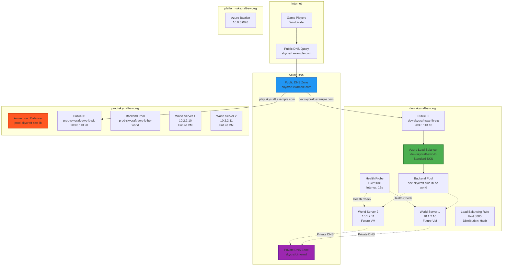

# Lab 2.3: Configure DNS and Load Balancing (2.5 hours)

## 🎯 Learning Objectives

By completing this lab, you will:
- Create and configure Azure DNS zones for custom domain name resolution
- Implement Azure Private DNS zones for internal name resolution
- Deploy Azure Standard Load Balancer for high availability
- Configure load balancing rules and health probes
- Create backend pools for distributing traffic across multiple servers
- Test DNS resolution and load balancer functionality
- Understand the difference between public and private DNS zones

---

## 🏗️ Architecture Overview

You'll implement DNS and load balancing for the SkyCraft infrastructure:



---

## 📋 Real-World Scenario

**Situation**: SkyCraft game servers need to be highly available and accessible via friendly domain names. Players shouldn't need to remember IP addresses (203.0.113.10), and if one world server fails, traffic should automatically route to healthy servers. Additionally, internal services (databases, monitoring) need DNS resolution within the Azure VNets without exposing names to the public internet.

**Your Task**: Implement DNS and load balancing by:
- Creating Azure DNS zones for public domain resolution (skycraft.example.com)
- Deploying Azure Load Balancers to distribute player connections across multiple world servers
- Configuring health probes to detect server failures
- Setting up Private DNS zones for internal service discovery
- Testing DNS resolution and load balancing functionality

---

## ⏱️ Estimated Time: 2.5 hours

- **Section 1**: Understanding DNS and Load Balancing concepts (15 min)
- **Section 2**: Create Azure Public DNS zone (20 min)
- **Section 3**: Create Azure Private DNS zone (20 min)
- **Section 4**: Deploy Azure Load Balancer for dev environment (30 min)
- **Section 5**: Configure load balancing rules and health probes (25 min)
- **Section 6**: Deploy Azure Load Balancer for prod environment (20 min)
- **Section 7**: Test DNS resolution and load balancer (20 min)

---

## ✅ Prerequisites

Before starting this lab:
- [ ] Completed Lab 2.1 (Virtual Networks and Peering)
- [ ] Completed Lab 2.2 (Network Security)
- [ ] Three VNets exist: platform, dev, prod
- [ ] Public IPs exist: dev-skycraft-swc-lb-pip, prod-skycraft-swc-lb-pip
- [ ] Owner or Contributor role at subscription level
- [ ] Understanding of DNS concepts (A records, CNAME, zones)
- [ ] Understanding of load balancing concepts (health probes, backend pools)

---

## 📖 Section 1: Understanding DNS and Load Balancing Concepts (15 minutes)

### What is Azure DNS?

**Azure DNS** provides name resolution using Microsoft's global DNS infrastructure. It offers:
- **High availability**: 100% uptime SLA
- **Global coverage**: Anycast network (query answered by nearest DNS server)
- **Security**: RBAC, activity logs, resource locking
- **Integration**: Managed alongside other Azure resources

### Public DNS vs Private DNS Zones

| Feature | Public DNS Zone | Private DNS Zone |
|---------|-----------------|------------------|
| **Visibility** | Internet-accessible | VNet-internal only |
| **Use Case** | External domains (skycraft.com) | Internal services (database.internal) |
| **Records** | Standard DNS records (A, CNAME, MX) | A, AAAA, CNAME only |
| **Registration** | Can use registered domains | Any name (no registration needed) |
| **Cost** | $0.50/zone/month + queries | $0.10/zone/month (no query charges) |

### Azure Load Balancer Overview

**Azure Load Balancer** distributes inbound traffic across multiple backend resources. Key concepts:

| Component | Purpose |
|-----------|---------|
| **Frontend IP** | Public or private IP that receives traffic |
| **Backend Pool** | Group of VMs/instances that handle requests |
| **Health Probe** | Checks if backend resources are healthy |
| **Load Balancing Rule** | Defines how traffic is distributed |
| **Inbound NAT Rule** | Maps specific port to specific backend (optional) |

### Load Balancer SKUs

| Feature | Basic | Standard |
|---------|-------|----------|
| **Backend pool size** | Up to 300 | Up to 1,000 |
| **Health probe** | HTTP, TCP | HTTP, HTTPS, TCP |
| **Availability Zones** | No | Yes |
| **SLA** | None | 99.99% |
| **Security** | Open by default | Closed by default (requires NSG) |
| **Cost** | Free | ~$18/month + data processing |

**For SkyCraft**: Standard SKU required for production workloads and zone redundancy.

### Load Distribution Modes

| Mode | Description | Use Case |
|------|-------------|----------|
| **Hash-based (5-tuple)** | Source IP, port, dest IP, port, protocol | Default, good distribution |
| **Source IP affinity (2-tuple)** | Source IP + dest IP only | Session persistence needed |
| **Source IP affinity (3-tuple)** | Source IP, dest IP + protocol | Balance between persistence & distribution |

---

## 📖 Section 2: Create Azure Public DNS Zone (20 minutes)

### Step 2.3.1: Create Public DNS Zone

**Note**: For this lab, we'll use a placeholder domain. In production, you'd register a real domain (e.g., godaddy.com, namecheap.com) and delegate DNS to Azure.

1. In **Azure Portal**, search for **"DNS zones"**
2. Click **+ Create**

**Basics tab**:

| Field | Value |
|-------|-------|
| Subscription | [Your subscription] |
| Resource group | `platform-skycraft-swc-rg` |
| Name | `skycraft.example.com` |
| Resource group location | **Sweden Central** |

**Important**: The DNS zone name should be your actual registered domain (or a domain you'll register). For this lab, we use `example.com` as a placeholder.

3. Click **Next: Tags**
4. Add tags:

| Name | Value |
|------|-------|
| Project | SkyCraft |
| Environment | Platform |
| CostCenter | MSDN |

5. Click **Review + create** → **Create**

**Expected Result**: 
- DNS zone `skycraft.example.com` created
- Azure provides 4 name servers (e.g., ns1-01.azure-dns.com)
- In production, you'd update your domain registrar to use these name servers

### Step 2.3.2: Create DNS A Records for Dev Environment

1. Navigate to **DNS zones** → **skycraft.example.com**
2. Click **+ Record set**

**Create record for dev load balancer**:

| Field | Value |
|-------|-------|
| Name | `dev` |
| Type | A |
| TTL | 300 |
| TTL unit | Seconds |
| IP address | [IP of dev-skycraft-swc-lb-pip] |

**To get the dev load balancer public IP**:
3. Open another tab: **Public IP addresses** → **dev-skycraft-swc-lb-pip**
4. Copy the IP address (e.g., 20.240.50.10)
5. Return to DNS zone and paste the IP
6. Click **OK**

**Expected Result**: A record `dev.skycraft.example.com` points to dev load balancer public IP.

### Step 2.3.3: Create DNS A Record for Prod Environment

1. Still in **skycraft.example.com**, click **+ Record set**

**Create record for prod load balancer**:

| Field | Value |
|-------|-------|
| Name | `play` |
| Type | A |
| TTL | 300 |
| TTL unit | Seconds |
| IP address | [IP of prod-skycraft-swc-lb-pip] |

2. Get prod public IP from **prod-skycraft-swc-lb-pip**
3. Enter the IP address
4. Click **OK**

**Expected Result**: A record `play.skycraft.example.com` points to production load balancer.

### Step 2.3.4: Create CNAME Record (Optional)

Create a user-friendly alias:

1. Click **+ Record set**

| Field | Value |
|-------|-------|
| Name | `game` |
| Type | CNAME |
| TTL | 3600 |
| Alias | `play.skycraft.example.com` |

2. Click **OK**

**Expected Result**: `game.skycraft.example.com` is an alias for `play.skycraft.example.com`.

---

## 📖 Section 3: Create Azure Private DNS Zone (20 minutes)

### Step 2.3.5: Create Private DNS Zone

1. In Azure Portal, search for **"Private DNS zones"**
2. Click **+ Create**

**Basics tab**:

| Field | Value |
|-------|-------|
| Subscription | [Your subscription] |
| Resource group | `platform-skycraft-swc-rg` |
| Name | `skycraft.internal` |
| Resource group location | **Sweden Central** |

**Important**: Private DNS zone names can be anything (no domain registration needed). Common patterns: `internal`, `local`, `private`, or `company.internal`.

3. Click **Next: Tags**
4. Add tags (Project, Environment, CostCenter)
5. Click **Review + create** → **Create**

**Expected Result**: Private DNS zone `skycraft.internal` created for internal name resolution.

### Step 2.3.6: Link Private DNS Zone to VNets

Private DNS zones must be linked to VNets for name resolution to work.

**Link to Hub VNet**:

1. Navigate to **Private DNS zones** → **skycraft.internal**
2. In left menu, click **Virtual network links**
3. Click **+ Add**

| Field | Value |
|-------|-------|
| Link name | `hub-vnet-link` |
| Subscription | [Your subscription] |
| Virtual network | `platform-skycraft-swc-vnet` |
| Enable auto registration | ☐ Unchecked (no VMs in hub) |

4. Click **OK**

**Link to Dev VNet**:

5. Click **+ Add** again

| Field | Value |
|-------|-------|
| Link name | `dev-vnet-link` |
| Virtual network | `dev-skycraft-swc-vnet` |
| Enable auto registration | ☑ **Checked** (VMs will auto-register) |

6. Click **OK**

**Link to Prod VNet**:

7. Click **+ Add**

| Field | Value |
|-------|-------|
| Link name | `prod-vnet-link` |
| Virtual network | `prod-skycraft-swc-vnet` |
| Enable auto registration | ☑ **Checked** |

8. Click **OK**

**Expected Result**: 
- Private DNS zone linked to all three VNets
- Dev and prod VNets have auto-registration enabled
- Future VMs in dev/prod will automatically create DNS records

### Step 2.3.7: Create Manual DNS Records in Private Zone

Create DNS records for future database servers:

1. Still in **skycraft.internal**, click **+ Record set**

**Create record for dev database**:

| Field | Value |
|-------|-------|
| Name | `dev-db` |
| Type | A |
| TTL | 300 |
| IP address | `10.1.3.10` (future database server IP) |

2. Click **OK**

**Create record for prod database**:

3. Click **+ Record set**

| Field | Value |
|-------|-------|
| Name | `prod-db` |
| Type | A |
| TTL | 300 |
| IP address | `10.2.3.10` (future database server IP) |

4. Click **OK**

**Expected Result**: Internal DNS records created:
- `dev-db.skycraft.internal` → 10.1.3.10
- `prod-db.skycraft.internal` → 10.2.3.10

---

## 📖 Section 4: Deploy Azure Load Balancer for Dev Environment (30 minutes)

### Step 2.3.8: Create Standard Load Balancer

1. In Azure Portal, search for **"Load balancers"**
2. Click **+ Create**

**Basics tab**:

| Field | Value |
|-------|-------|
| Subscription | [Your subscription] |
| Resource group | `dev-skycraft-swc-rg` |
| Name | `dev-skycraft-swc-lb` |
| Region | **Sweden Central** |
| SKU | **Standard** |
| Type | **Public** |
| Tier | **Regional** |

3. Click **Next: Frontend IP configuration**

**Frontend IP configuration**:

4. Click **+ Add a frontend IP configuration**

| Field | Value |
|-------|-------|
| Name | `dev-skycraft-swc-lb-frontend` |
| IP version | IPv4 |
| IP type | IP address |
| Public IP address | `dev-skycraft-swc-lb-pip` (use existing) |

5. Click **Add**

6. Click **Next: Backend pools**

**Backend pools** (skip for now, we'll create later):

7. Click **Next: Inbound rules**
8. Skip inbound rules (we'll create after deployment)
9. Click **Next: Outbound rules** (leave default)
10. Click **Next: Tags**

**Tags**:

11. Add tags:

| Name | Value |
|------|-------|
| Project | SkyCraft |
| Environment | Development |
| CostCenter | MSDN |

12. Click **Review + create**
13. Review configuration
14. Click **Create**

**Expected Result**: 
- Deployment takes 1-2 minutes
- Load balancer `dev-skycraft-swc-lb` created
- Frontend IP configured with public IP

### Step 2.3.9: Create Backend Pool

1. Navigate to **Load balancers** → **dev-skycraft-swc-lb**
2. In left menu, click **Backend pools**
3. Click **+ Add**

| Field | Value |
|-------|-------|
| Name | `dev-skycraft-swc-lb-be-world` |
| Virtual network | `dev-skycraft-swc-vnet` |
| Backend Pool Configuration | **NIC** |
| IP Version | IPv4 |

**Virtual machines** section:

4. Click **+ Add**
5. Note: "No virtual machines available"

**Important**: We'll add VMs in Module 3. For now, create empty backend pool.

6. Click **Add** (create empty backend pool)

**Expected Result**: Backend pool `dev-skycraft-swc-lb-be-world` created (empty, ready for VMs).

---

## 📖 Section 5: Configure Load Balancing Rules and Health Probes (25 minutes)

### Step 2.3.10: Create Health Probe

Health probes check if backend VMs are healthy before sending traffic.

1. Still in **dev-skycraft-swc-lb**, click **Health probes** in left menu
2. Click **+ Add**

| Field | Value |
|-------|-------|
| Name | `dev-skycraft-swc-lb-probe-world` |
| Protocol | **TCP** |
| Port | `8085` (AzerothCore world server port) |
| Interval | 15 (seconds between probes) |
| Unhealthy threshold | 2 (consecutive failures before marking unhealthy) |

3. Click **Add**

**Expected Result**: Health probe created. Will check TCP port 8085 every 15 seconds.

### Step 2.3.11: Create Load Balancing Rule

1. In left menu, click **Load balancing rules**
2. Click **+ Add**

| Field | Value |
|-------|-------|
| Name | `dev-skycraft-swc-lb-rule-world` |
| IP Version | IPv4 |
| Frontend IP address | `dev-skycraft-swc-lb-frontend` |
| Protocol | TCP |
| Port | `8085` |
| Backend port | `8085` |
| Backend pool | `dev-skycraft-swc-lb-be-world` |
| Health probe | `dev-skycraft-swc-lb-probe-world` |
| Session persistence | **None** (5-tuple hash distribution) |
| Idle timeout (minutes) | 4 |
| TCP reset | Enabled |
| Floating IP | Disabled |

3. Click **Add**

**Expected Result**: Load balancing rule created. Traffic to port 8085 on frontend IP will distribute to backend pool VMs.

### Step 2.3.12: Create Additional Rules for Auth Server (Optional)

Create health probe and rule for authentication servers:

**Health Probe**:

1. Click **Health probes** → **+ Add**

| Field | Value |
|-------|-------|
| Name | `dev-skycraft-swc-lb-probe-auth` |
| Protocol | TCP |
| Port | `3724` (Auth server port) |
| Interval | 15 |
| Unhealthy threshold | 2 |

2. Click **Add**

**Backend Pool**:

3. Click **Backend pools** → **+ Add**

| Field | Value |
|-------|-------|
| Name | `dev-skycraft-swc-lb-be-auth` |
| Virtual network | `dev-skycraft-swc-vnet` |
| Backend Pool Configuration | NIC |

4. Click **Add**

**Load Balancing Rule**:

5. Click **Load balancing rules** → **+ Add**

| Field | Value |
|-------|-------|
| Name | `dev-skycraft-swc-lb-rule-auth` |
| Frontend IP | `dev-skycraft-swc-lb-frontend` |
| Protocol | TCP |
| Port | `3724` |
| Backend port | `3724` |
| Backend pool | `dev-skycraft-swc-lb-be-auth` |
| Health probe | `dev-skycraft-swc-lb-probe-auth` |
| Session persistence | None |

6. Click **Add**

**Expected Result**: Dev load balancer now has two sets of rules (auth port 3724, world port 8085).

---

## 📖 Section 6: Deploy Azure Load Balancer for Prod Environment (20 minutes)

### Step 2.3.13: Create Production Load Balancer

Repeat the load balancer creation process for production:

1. Navigate to **Load balancers** → **+ Create**

**Configuration**:

| Field | Value |
|-------|-------|
| Resource group | `prod-skycraft-swc-rg` |
| Name | `prod-skycraft-swc-lb` |
| Region | **Sweden Central** |
| SKU | **Standard** |
| Type | **Public** |

**Frontend IP**:
- Name: `prod-skycraft-swc-lb-frontend`
- Public IP: `prod-skycraft-swc-lb-pip` (use existing)

**Tags**: Project=SkyCraft, Environment=Production, CostCenter=MSDN

2. Click **Review + create** → **Create**

### Step 2.3.14: Configure Production Backend Pools

1. Open **prod-skycraft-swc-lb** → **Backend pools** → **+ Add**

**Backend Pool 1** (World servers):

| Field | Value |
|-------|-------|
| Name | `prod-skycraft-swc-lb-be-world` |
| Virtual network | `prod-skycraft-swc-vnet` |
| Backend Pool Configuration | NIC |

2. Click **Add**

**Backend Pool 2** (Auth servers):

3. Create second backend pool: `prod-skycraft-swc-lb-be-auth`

### Step 2.3.15: Configure Production Health Probes

1. Click **Health probes** → **+ Add**

**Probe 1** (World):

| Field | Value |
|-------|-------|
| Name | `prod-skycraft-swc-lb-probe-world` |
| Protocol | TCP |
| Port | 8085 |
| Interval | 15 |

2. Click **Add**

**Probe 2** (Auth):

3. Create second probe: `prod-skycraft-swc-lb-probe-auth` (port 3724)

### Step 2.3.16: Configure Production Load Balancing Rules

1. Click **Load balancing rules** → **+ Add**

**Rule 1** (World):

| Field | Value |
|-------|-------|
| Name | `prod-skycraft-swc-lb-rule-world` |
| Frontend IP | `prod-skycraft-swc-lb-frontend` |
| Port | 8085 |
| Backend pool | `prod-skycraft-swc-lb-be-world` |
| Health probe | `prod-skycraft-swc-lb-probe-world` |

2. Click **Add**

**Rule 2** (Auth):

3. Create second rule for auth (port 3724, appropriate backend pool and probe)

**Expected Result**: Production load balancer fully configured with 2 backend pools, 2 health probes, 2 load balancing rules.

---

## 📖 Section 7: Test DNS Resolution and Load Balancer (20 minutes)

### Step 2.3.17: Test Public DNS Resolution (Conceptual)

**Note**: Since we used `skycraft.example.com` (not a real registered domain), DNS queries from the internet won't work yet. This section explains the testing process.

**When you have a real domain**:

```bash
# Test DNS resolution from your laptop
nslookup dev.skycraft.example.com

# Expected output:
# Name:    dev.skycraft.example.com
# Address: 20.240.50.10 (dev load balancer public IP)

# Test production DNS
nslookup play.skycraft.example.com

# Expected output:
# Name:    play.skycraft.example.com
# Address: 20.240.60.20 (prod load balancer public IP)

# Test CNAME
nslookup game.skycraft.example.com

# Expected output:
# Name:    play.skycraft.example.com (canonical name)
# Address: 20.240.60.20
```

### Step 2.3.18: Test DNS Resolution in Azure Portal

1. Navigate to **DNS zones** → **skycraft.example.com**
2. Click **Overview**
3. Verify record sets exist:

| Name | Type | Value |
|------|------|-------|
| @ | NS | ns1-01.azure-dns.com (and 3 others) |
| @ | SOA | [Azure DNS SOA record] |
| dev | A | [dev-skycraft-swc-lb-pip IP] |
| play | A | [prod-skycraft-swc-lb-pip IP] |
| game | CNAME | play.skycraft.example.com |

**Expected Result**: All DNS records visible in Azure Portal.

### Step 2.3.19: Test Private DNS Zone Resolution

1. Navigate to **Private DNS zones** → **skycraft.internal**
2. Click **Overview**
3. Verify:
   - Virtual network links: 3 (hub, dev, prod)
   - Record sets: 2 (dev-db, prod-db)

4. Click **Record sets**
5. Verify records exist:

| Name | Type | IP Address |
|------|------|------------|
| dev-db | A | 10.1.3.10 |
| prod-db | A | 10.2.3.10 |

**Expected Result**: Private DNS configured for internal name resolution.

### Step 2.3.20: Verify Load Balancer Configuration

**Dev Load Balancer**:

1. Navigate to **Load balancers** → **dev-skycraft-swc-lb**
2. Click **Overview**
3. Verify:
   - Frontend IP: 1 (dev-skycraft-swc-lb-frontend with public IP)
   - Backend pools: 2 (world, auth)
   - Load balancing rules: 2 (port 8085, port 3724)
   - Health probes: 2 (world, auth)

**Prod Load Balancer**:

4. Navigate to **prod-skycraft-swc-lb**
5. Verify same configuration

**Expected Result**: Both load balancers fully configured and ready to distribute traffic (VMs will be added in Module 3).

### Step 2.3.21: Test Load Balancer Health Probes (Post-VM Deployment)

**Note**: This test requires VMs (deployed in Module 3). Document the expected behavior:

**Scenario 1: All backends healthy**
```
Health Probe → VM1 (10.1.2.10:8085) → Response OK → Mark healthy
Health Probe → VM2 (10.1.2.11:8085) → Response OK → Mark healthy

Load Balancer Decision: Distribute traffic 50/50 to VM1 and VM2
```

**Scenario 2: One backend fails**
```
Health Probe → VM1 (10.1.2.10:8085) → Response OK → Mark healthy
Health Probe → VM2 (10.1.2.11:8085) → Timeout → Mark unhealthy

Load Balancer Decision: Send 100% traffic to VM1 only
```

**Scenario 3: Backend recovers**
```
After 2 consecutive successful probes (30 seconds):
VM2 marked healthy again → Load Balancer resumes 50/50 distribution
```

---

## ✅ Lab Checklist

Quick verification before proceeding:

### Azure DNS (Public Zone)
- [ ] Public DNS zone `skycraft.example.com` created
- [ ] A record `dev.skycraft.example.com` points to dev load balancer IP
- [ ] A record `play.skycraft.example.com` points to prod load balancer IP
- [ ] CNAME record `game.skycraft.example.com` aliases to play
- [ ] 4 Azure name servers assigned to zone

### Azure Private DNS Zone
- [ ] Private DNS zone `skycraft.internal` created
- [ ] Linked to hub VNet (auto-registration off)
- [ ] Linked to dev VNet (auto-registration on)
- [ ] Linked to prod VNet (auto-registration on)
- [ ] A record `dev-db.skycraft.internal` → 10.1.3.10
- [ ] A record `prod-db.skycraft.internal` → 10.2.3.10

### Dev Load Balancer
- [ ] `dev-skycraft-swc-lb` created (Standard SKU, Public)
- [ ] Frontend IP uses `dev-skycraft-swc-lb-pip`
- [ ] Backend pool: `dev-skycraft-swc-lb-be-world` created
- [ ] Backend pool: `dev-skycraft-swc-lb-be-auth` created
- [ ] Health probe: TCP port 8085 (world) configured
- [ ] Health probe: TCP port 3724 (auth) configured
- [ ] Load balancing rule: port 8085 → world backend pool
- [ ] Load balancing rule: port 3724 → auth backend pool

### Prod Load Balancer
- [ ] `prod-skycraft-swc-lb` created (Standard SKU, Public)
- [ ] Frontend IP uses `prod-skycraft-swc-lb-pip`
- [ ] Backend pools created (world, auth)
- [ ] Health probes configured (8085, 3724)
- [ ] Load balancing rules configured (8085, 3724)
- [ ] All resources have proper tags

**For detailed verification**, see [lab-checklist-2.3.md](lab-checklist-2.3.md)

---

## 🎓 Knowledge Check

Test your understanding with these questions:

1. **What is the difference between Public DNS zones and Private DNS zones in Azure?**

   <details>
     <summary>**Click to see the answer**</summary>

   **Answer**:

   **Public DNS Zones**:
   - Accessible from the internet
   - Used for registered domains (skycraft.com)
   - Resolves names for external clients (game players)
   - Requires domain registration and NS delegation
   - Cost: $0.50/zone/month + query charges

   **Private DNS Zones**:
   - Only accessible within linked VNets
   - Used for internal services (database.internal)
   - No domain registration needed (any name works)
   - Supports auto-registration of VM DNS records
   - Cost: $0.10/zone/month (no query charges)

   **For SkyCraft**: Public DNS for player-facing services (play.skycraft.com), Private DNS for internal communication (auth-server.skycraft.internal, database.skycraft.internal).
   </details>

2. **Why do we use Standard SKU Load Balancer instead of Basic?**

   <details>
     <summary>**Click to see the answer**</summary>

   **Answer**: Standard Load Balancer provides critical enterprise features:

   | Feature | Basic | Standard |
   |---------|-------|----------|
   | **SLA** | No SLA | 99.99% uptime |
   | **Backend pool size** | 300 instances | 1,000 instances |
   | **Availability Zones** | Not supported | Zone-redundant |
   | **Health probes** | HTTP, TCP | HTTP, HTTPS, TCP |
   | **Security** | Open by default | Closed (requires NSG allow rules) |
   | **Monitoring** | Basic metrics | Comprehensive metrics + logs |
   | **Multi-dimension metrics** | No | Yes |

   **For production workloads like SkyCraft**: Standard is required for SLA guarantees, zone redundancy, and comprehensive monitoring. Basic SKU is being deprecated.
   </details>

3. **How does the health probe determine if a backend VM is healthy?**

   <details>
     <summary>**Click to see the answer**</summary>

   **Answer**: Health probes work as follows:

   **Configuration** (our SkyCraft example):
   - Protocol: TCP
   - Port: 8085 (world server)
   - Interval: 15 seconds (how often to check)
   - Unhealthy threshold: 2 consecutive failures

   **Process**:
   1. Every 15 seconds, load balancer attempts TCP connection to port 8085
   2. **Healthy**: If TCP handshake succeeds → VM marked healthy
   3. **Unhealthy**: If connection fails/times out → increment failure counter
   4. After 2 consecutive failures (30 seconds) → VM marked unhealthy
   5. Unhealthy VM removed from load balancing rotation
   6. After 2 consecutive successes → VM marked healthy again

   **HTTP health probes** (alternative) expect 200 OK response from specified path (e.g., `/health`).

   **Best practice**: Use HTTP probes with application-level health checks when possible, as they verify the application is truly functional, not just the network port is open.
   </details>

4. **What is session persistence (session affinity) and when should you use it?**

   <details>
     <summary>**Click to see the answer**</summary>

   **Answer**:

   **Session Persistence** ensures requests from the same client always go to the same backend server.

   **Distribution Modes**:

   1. **None (5-tuple hash)** - Default
      - Hash: Source IP + Source Port + Dest IP + Dest Port + Protocol
      - Best distribution across backends
      - Use when: Stateless applications

   2. **Client IP (2-tuple hash)**
      - Hash: Source IP + Dest IP only
      - Same client → same backend
      - Use when: Sessions stored locally on server

   3. **Client IP and Protocol (3-tuple)**
      - Hash: Source IP + Dest IP + Protocol
      - Balance between persistence and distribution

   **For AzerothCore**:
   - **Auth servers**: Use **Client IP affinity** (session data exists)
   - **World servers**: Use **Client IP affinity** (player session state)
   - **Database**: Not load balanced (single primary)

   **Trade-off**: Session affinity reduces distribution efficiency but maintains session state.
   </details>

5. **Can Private DNS zones automatically register VM DNS records?**

   <details>
     <summary>**Click to see the answer**</summary>

   **Answer**: **Yes**, with **auto-registration** enabled on the VNet link.

   **How it works**:
   1. Link Private DNS zone to VNet
   2. Enable **auto-registration** checkbox
   3. When VM starts: Azure automatically creates A record
   4. When VM stops: Azure automatically deletes A record

   **Example** (our SkyCraft config):
   - Dev VNet linked to `skycraft.internal` with auto-registration
   - Deploy VM named `dev-world-01` with IP 10.1.2.10
   - Azure creates: `dev-world-01.skycraft.internal` → 10.1.2.10

   **Benefits**:
   - No manual DNS management
   - Always up-to-date records
   - Services can use names instead of IPs

   **Limitation**: Auto-registration only works for VMs, not for load balancers or other resources (create those manually).
   </details>

6. **What happens if all backend VMs in a load balancer backend pool fail health probes?**

   <details>
     <summary>**Click to see the answer**</summary>

   **Answer**: **Load balancer enters degraded state and stops accepting new connections.**

   **Behavior**:
   1. All VMs marked unhealthy (no healthy backends available)
   2. Load balancer health status → **Degraded**
   3. **New connections**: Rejected (connection refused or timeout)
   4. **Existing connections**: May continue if already established (TCP)
   5. Azure Monitor alerts fire (if configured)

   **Monitoring**:
   - Metric: **Health Probe Status** drops to 0%
   - Alert rule: "Backend Health Probe Status < 50% for 5 minutes"

   **Prevention**:
   - Deploy VMs across Availability Zones
   - Use autoscaling to replace failed instances
   - Implement application-level health checks
   - Monitor health probe metrics continuously

   **For SkyCraft**: In Module 3, we'll configure alerts to notify when backend health degrades.
   </details>

7. **How long does it take for DNS changes to propagate?**

   <details>
     <summary>**Click to see the answer**</summary>

   **Answer**: Depends on **TTL (Time To Live)** setting and DNS cache hierarchy.

   **Propagation Timeline**:

   | Change Type | Typical Time | Why |
   |-------------|--------------|-----|
   | **Azure DNS record update** | 60 seconds | Azure DNS authoritative servers |
   | **Public internet DNS** | TTL duration | Recursive resolvers cache records |
   | **Local computer cache** | Up to 24 hours | OS DNS cache |

   **Our SkyCraft TTL**: 300 seconds (5 minutes)
   - Change A record from 20.240.50.10 to 20.240.50.20
   - Azure updates immediately
   - Public resolvers refresh after 5 minutes (max)

   **Best Practices**:
   - **Before change**: Lower TTL to 60 seconds (1 hour in advance)
   - **Make change**: Update record
   - **After change**: Wait 2× old TTL before critical operations
   - **Restore**: Increase TTL back to normal (3600-86400)

   **Force refresh** (troubleshooting):
   ```bash
   # Windows
   ipconfig /flushdns

   # Linux/Mac
   sudo systemd-resolve --flush-caches
   # or
   sudo dscacheutil -flushcache
   ```
   </details>

---

## 🔧 Troubleshooting

### Issue 1: DNS zone created but records not resolving

**Symptom**: `nslookup dev.skycraft.example.com` returns "Non-existent domain"

**Solution**:
- Verify domain delegation at registrar points to Azure NS servers
- Check record exists in Azure Portal (DNS zones → Record sets)
- Wait for TTL expiration (300 seconds in our config)
- Try querying Azure name servers directly:
  ```bash
  nslookup dev.skycraft.example.com ns1-01.azure-dns.com
  ```
- Flush local DNS cache: `ipconfig /flushdns` (Windows)

### Issue 2: Private DNS auto-registration not working

**Symptom**: VM deployed but no DNS record created in Private DNS zone

**Solution**:
- Verify VNet link has **auto-registration enabled** (checkbox)
- Confirm VM is in a linked VNet
- Check VM has started successfully (not stopped/deallocated)
- Auto-registration can take 2-3 minutes after VM starts
- Verify VM NIC is in the VNet (not secondary NIC in different VNet)

### Issue 3: Load balancer health probe always shows unhealthy

**Symptom**: Backend pool VMs show 0% health probe status

**Solution**:
- Verify VM is running (not stopped)
- Check NSG allows traffic from Azure Load Balancer service tag:
  - Source: **AzureLoadBalancer**
  - Destination port: **8085** (or your probe port)
  - Protocol: TCP
  - Action: Allow
- Confirm application is listening on probe port:
  ```bash
  # SSH to VM
  netstat -tlnp | grep 8085
  ```
- Check probe settings (correct port, protocol, interval)
- Review VM firewall rules (OS-level)

### Issue 4: Cannot create load balancer - quota exceeded

**Symptom**: Error: "Quota exceeded for resource type 'Public IP Addresses'"

**Solution**:
- Check current quota usage: **Subscriptions** → **Usage + quotas**
- Request quota increase if needed
- Verify public IP is Standard SKU (matches Standard Load Balancer requirement)
- Use existing public IPs where possible

### Issue 5: Load balancer rule creation fails

**Symptom**: Error: "Backend pool must be in same virtual network as load balancer"

**Solution**:
- Verify backend pool and load balancer are in same region
- Confirm backend pool references correct VNet
- Check if VNet has available IP addresses
- Recreate backend pool with correct VNet selection

### Issue 6: Load balancer not distributing traffic evenly

**Symptom**: One VM receiving 90% of traffic, others idle

**Solution**:
- Check session persistence setting (should be **None** for even distribution)
- Verify all VMs are healthy (Health probe status = 100%)
- Confirm load balancing rule uses correct distribution algorithm
- Review if source IPs are concentrated (few clients = uneven distribution)
- Consider using **5-tuple hash** instead of **Source IP affinity**

---

## 📚 Additional Resources

- [Azure DNS Documentation](https://learn.microsoft.com/en-us/azure/dns/)
- [Azure Private DNS Documentation](https://learn.microsoft.com/en-us/azure/dns/private-dns-overview)
- [Azure Load Balancer Documentation](https://learn.microsoft.com/en-us/azure/load-balancer/)
- [Load Balancer health probes](https://learn.microsoft.com/en-us/azure/load-balancer/load-balancer-custom-probe-overview)
- [Load balancing distribution modes](https://learn.microsoft.com/en-us/azure/load-balancer/load-balancer-distribution-mode)
- [DNS best practices](https://learn.microsoft.com/en-us/azure/dns/dns-best-practices)

---

## 📌 Module Navigation

- [← Back to Module 2 Index](../README.md)
- [← Previous Lab: 2.2 Secure Access](../2.2-secure-access/lab-guide-2.2.md)
- [Module 2 Complete - Next: Module 3 Compute →](../../module-3-compute/README.md)

---

## 📝 Lab Summary

**What You Accomplished**:
- ✅ Created Azure Public DNS zone with A and CNAME records
- ✅ Deployed Azure Private DNS zone for internal name resolution
- ✅ Configured 2 Azure Standard Load Balancers (dev and prod)
- ✅ Created 4 backend pools for distributing game server traffic
- ✅ Implemented health probes (TCP ports 3724, 8085)
- ✅ Configured load balancing rules for auth and world servers
- ✅ Linked Private DNS zones to all three VNets

**Infrastructure Ready**:
- 🌐 DNS infrastructure for public and private name resolution
- ⚖️ Load balancers ready to distribute traffic across multiple game servers
- 🏥 Health probes configured to detect and remove failed servers automatically
- 🔄 High availability architecture for production game deployment

**Time Spent**: ~2.5 hours

**Module 2 Complete!** You've built a production-ready network infrastructure with:
- Hub-spoke topology (Lab 2.1)
- Network security with Bastion and NSGs (Lab 2.2)
- DNS and load balancing (Lab 2.3)

**Ready for Module 3?** Next, you'll deploy Azure Virtual Machines, configure AzerothCore game servers, and add VMs to the load balancer backend pools to enable high-availability gameplay!
