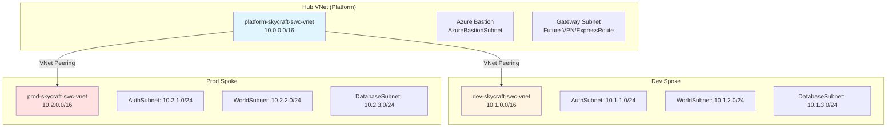

# Module 2: Implement and Manage Virtual Networking (7 hours)

## 📚 Module Overview

In this module, you'll build the **network foundation** for the SkyCraft AzerothCore deployment using Azure's hub-spoke topology. You'll create isolated virtual networks for development and production environments, implement security controls, and configure load balancing for high availability[file:1][file:2].

**Real-world Context**: Before deploying any compute resources, you must establish proper network segmentation, secure access paths, and traffic distribution—exactly what enterprise-grade game server infrastructure requires.

---

## 🎯 Learning Objectives

By completing this module, you will be able to:

- **Design and deploy** hub-spoke virtual network topology for multi-environment infrastructure
- **Configure VNet peering** to enable communication between hub and spoke networks
- **Implement network security** using Network Security Groups (NSGs) and Application Security Groups (ASGs)
- **Deploy Azure Bastion** for secure, password-less administrative access
- **Configure service and private endpoints** for secure PaaS connectivity
- **Set up Azure Load Balancer** for distributing game server traffic
- **Configure Azure DNS** for custom domain resolution

---

## 📋 Module Sections

| Lab | Duration  | Topic                                        | Exam Weight |
| --- | --------- | -------------------------------------------- | ----------- |
| 2.1 | 3 hours   | Configure and Manage Virtual Networks        | ~6-8%       |
| 2.2 | 2.5 hours | Configure Secure Access to Virtual Networks  | ~5-7%       |
| 2.3 | 1.5 hours | Configure Name Resolution and Load Balancing | ~4-6%       |

**Total Module Time**: 7 hours

---

## 🏗️ Architecture Overview

This module builds a **hub-spoke network topology** following Azure best practices:

---

## ✅ Prerequisites

Before starting, ensure you have:

- [ ] Completed Module 1 (Identity, RBAC, Governance)
- [ ] Active Azure subscription with Owner or Contributor role
- [ ] Azure CLI installed locally (or use Cloud Shell)
- [ ] Understanding of IP addressing and subnetting (CIDR notation)
- [ ] Familiarity with OSI model and network security concepts

**Verify Module 1 completion**:

- Resource groups: `dev-skycraft-swc-rg`, `prod-skycraft-swc-rg`, `platform-skycraft-swc-rg`
- Azure Policies enforced (Environment tag, Project=SkyCraft)
- Resource locks on production resources

---

## 🚀 Getting Started

1. **Review the architecture** diagram above to understand the hub-spoke model
2. **Start with Lab 2.1** - Create virtual networks and configure peering
3. **Progress to Lab 2.2** - Implement security controls (NSGs, Bastion, private endpoints)
4. **Complete Lab 2.3** - Configure DNS and load balancing
5. **Take the module assessment** to validate learning

---

## 📖 How to Use This Module

Each lab includes:

- **Lab Guide** - Step-by-step instructions with Mermaid architecture diagrams
- **Lab Checklist** - Verification steps to confirm success
- **Solutions** - Expected configurations and Azure CLI commands
- **Troubleshooting** - Common issues and fixes

**Recommended approach**:

1. Study the architecture diagram in each lab guide
2. Follow manual steps in Azure Portal (learn the UI)
3. Use Azure CLI commands for verification
4. Complete the checklist before moving to next lab
5. Reference solutions if stuck

---

## 🎓 AZ-104 Exam Alignment

This module covers **15-20%** of the AZ-104 exam. Key exam topics include:

- Creating and configuring virtual networks and subnets
- Creating and configuring VNet peering
- Configuring public and private IP addresses
- Implementing Network Security Groups (NSGs)
- Implementing Azure Bastion
- Configuring service endpoints and private endpoints
- Configuring Azure Load Balancer
- Configuring Azure DNS

---

## ⏱️ Time Management

- **Total module time**: 7 hours
- **Recommended pace**: 2.5 hours per day for 3 days
- **Lab 2.1**: 3 hours (most complex - hub-spoke setup)
- **Lab 2.2**: 2.5 hours (security implementation)
- **Lab 2.3**: 1.5 hours (DNS and load balancing)

---

## 🔗 Useful Resources

- [Azure Virtual Networks Documentation](https://learn.microsoft.com/en-us/azure/virtual-network/)
- [Hub-spoke network topology](https://learn.microsoft.com/en-us/azure/architecture/reference-architectures/hybrid-networking/hub-spoke)
- [Azure Bastion Documentation](https://learn.microsoft.com/en-us/azure/bastion/)
- [Network Security Groups](https://learn.microsoft.com/en-us/azure/virtual-network/network-security-groups-overview)
- [Azure Load Balancer](https://learn.microsoft.com/en-us/azure/load-balancer/)

---

## 📞 Getting Help

- **Lab issues**: Check `troubleshooting-X.Y.md` in each lab's solutions folder
- **Azure errors**: Search Azure documentation or Microsoft Learn
- **Network concepts**: Review IP addressing and subnetting basics

---

## ✨ What's Next After This Module?

Once complete, you'll have:

- ✅ Production-ready hub-spoke network topology
- ✅ Secure administrative access via Azure Bastion
- ✅ Network segmentation with NSGs and ASGs
- ✅ Load balancing infrastructure for game servers
- ✅ Custom DNS resolution configured

**Next Module**: Module 3 - Deploy and Manage Azure Compute Resources

---

## 📌 Module Navigation

- [← Back to Course Home](../README.md)
- [Lab 2.1: Virtual Networks →](2.1-virtual-networks/lab-guide-2.1.md)
- [Lab 2.2: Secure Access →](2.2-secure-access/lab-guide-2.2.md)
- [Lab 2.3: DNS & Load Balancing →](2.3-name-resolution/lab-guide-2.3.md)
