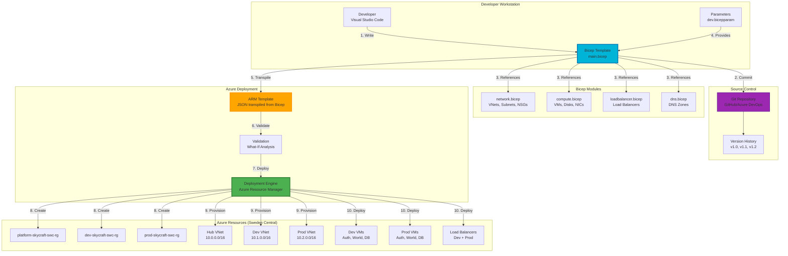

# Lab 3.1: Automate Deployment Using ARM/Bicep (3 hours)

## 🎯 Learning Objectives

By completing this lab, you will:
- Understand Infrastructure as Code (IaC) concepts and benefits
- Interpret and analyze Azure Resource Manager (ARM) templates
- Read and understand Bicep syntax and structure
- Modify existing ARM templates to customize for specific requirements
- Parameterize Bicep files for reusability (VM sizes, regions, environments)
- Deploy Azure resources using ARM templates and Bicep files
- Export existing deployments as ARM templates
- Convert ARM templates to Bicep files using bicep decompile
- Create a complete Bicep template for AzerothCore infrastructure
- Implement Bicep modules for modular, maintainable infrastructure code

---

## 🏗️ Architecture Overview

You'll create Infrastructure as Code templates to automate SkyCraft deployment:



---

## 📋 Real-World Scenario

**Situation**: Your SkyCraft infrastructure has grown complex with 3 VNets, multiple subnets, NSGs, load balancers, and will soon have dozens of VMs. Deploying everything manually through Azure Portal is:
- **Time-consuming**: Takes 2-3 hours per environment
- **Error-prone**: Easy to misconfigure subnet addresses or NSG rules
- **Not repeatable**: Can't easily recreate dev/prod environments
- **Difficult to version**: No way to track infrastructure changes over time
- **Hard to audit**: Can't review changes before deployment

**Your Task**: Implement Infrastructure as Code using Bicep to:
- Codify your entire infrastructure in version-controlled templates
- Deploy complete environments in 15 minutes instead of 3 hours
- Ensure consistency between dev and prod environments
- Enable infrastructure code reviews (like application code)
- Support disaster recovery with one-command redeployment
- Parameterize templates for multiple regions and environments

**Business Impact**: 
- 90% reduction in deployment time
- Zero configuration drift between environments
- Infrastructure changes tracked in Git history
- Ability to preview changes before deployment (what-if)

---

## ⏱️ Estimated Time: 3 hours

- **Section 1**: Understanding Infrastructure as Code (15 min)
- **Section 2**: Export and analyze existing ARM templates (25 min)
- **Section 3**: Introduction to Bicep syntax (20 min)
- **Section 4**: Convert ARM templates to Bicep (20 min)
- **Section 5**: Create parameterized Bicep modules (30 min)
- **Section 6**: Build complete infrastructure Bicep template (40 min)
- **Section 7**: Deploy and validate Bicep templates (30 min)

---

## ✅ Prerequisites

Before starting this lab:
- [ ] Completed Module 2 (Virtual Networking)
- [ ] Existing resources: 3 VNets, NSGs, Load Balancers deployed
- [ ] Azure CLI installed (version 2.50.0 or later)
- [ ] Bicep CLI installed (`az bicep install`)
- [ ] Visual Studio Code installed (recommended)
- [ ] VS Code extensions: Bicep, Azure Account
- [ ] Git installed (for version control best practices)
- [ ] Contributor or Owner role at subscription level

---

## 📖 Section 1: Understanding Infrastructure as Code (15 minutes)

### What is Infrastructure as Code (IaC)?

**Infrastructure as Code (IaC)** is the practice of managing infrastructure through code instead of manual processes.

**Traditional Approach** (ClickOps):
```
1. Login to Azure Portal
2. Click "Create resource"
3. Fill out 20+ form fields
4. Click "Create" and wait
5. Repeat 50 times for complete infrastructure
6. Document steps in Word document
7. Hope you remember everything next time
```

**IaC Approach**:
```bicep
// network.bicep
resource vnet 'Microsoft.Network/virtualNetworks@2023-05-01' = {
  name: 'dev-skycraft-swc-vnet'
  location: 'swedencentral'
  properties: {
    addressSpace: { addressPrefixes: ['10.1.0.0/16'] }
  }
}

// Deploy: az deployment group create --template-file network.bicep
```

### IaC Benefits

| Benefit | Description | SkyCraft Example |
|---------|-------------|------------------|
| **Repeatability** | Deploy identical environments | Dev and prod match exactly |
| **Version Control** | Track changes with Git | See who changed what and when |
| **Documentation** | Code documents itself | Template shows actual configuration |
| **Collaboration** | Code reviews for infrastructure | Team reviews before deployment |
| **Speed** | Deploy in minutes, not hours | 3-hour manual → 15-min automated |
| **Testing** | Validate before deployment | what-if shows changes before apply |
| **Disaster Recovery** | Redeploy entire infrastructure | One command restores everything |

### ARM Templates vs Bicep

**ARM Templates** (JSON):
```json
{
  "$schema": "https://schema.management.azure.com/schemas/2019-04-01/deploymentTemplate.json#",
  "contentVersion": "1.0.0.0",
  "parameters": {
    "vnetName": {
      "type": "string",
      "defaultValue": "dev-skycraft-swc-vnet"
    }
  },
  "resources": [
    {
      "type": "Microsoft.Network/virtualNetworks",
      "apiVersion": "2023-05-01",
      "name": "[parameters('vnetName')]",
      "location": "[resourceGroup().location]",
      "properties": {
        "addressSpace": {
          "addressPrefixes": ["10.1.0.0/16"]
        }
      }
    }
  ]
}
```

**Bicep** (Domain-Specific Language):
```bicep
param vnetName string = 'dev-skycraft-swc-vnet'

resource vnet 'Microsoft.Network/virtualNetworks@2023-05-01' = {
  name: vnetName
  location: resourceGroup().location
  properties: {
    addressSpace: { addressPrefixes: ['10.1.0.0/16'] }
  }
}
```

**Comparison**:

| Feature | ARM Template (JSON) | Bicep |
|---------|---------------------|-------|
| **Syntax** | Verbose JSON | Concise, readable |
| **Lines of code** | ~30 for VNet | ~8 for VNet |
| **Learning curve** | Steep (JSON functions) | Gentle (declarative) |
| **Type safety** | Limited | Strong typing |
| **Modules** | Nested templates (complex) | Native module support |
| **Tooling** | Basic | Excellent (IntelliSense, validation) |
| **Microsoft recommendation** | Legacy | **Preferred** |

**Bottom Line**: Bicep is the modern way to write Azure IaC. ARM JSON is still used internally but rarely written by hand.

### Bicep Workflow

```
1. Write Bicep code (.bicep files)
   ↓
2. Bicep CLI transpiles to ARM JSON
   ↓
3. ARM template sent to Azure Resource Manager
   ↓
4. Azure deploys resources
```

Bicep is a **transparent abstraction** over ARM - everything possible in ARM is possible in Bicep.

---

## 📖 Section 2: Export and Analyze Existing ARM Templates (25 minutes)

### Step 3.1.1: Export Resource Group as ARM Template

Let's export your existing dev environment to see what ARM looks like:

1. In **Azure Portal**, navigate to **Resource groups** → **dev-skycraft-swc-rg**
2. In left menu, click **Export template**
3. Wait 10-15 seconds for Azure to generate template

**What You See**:
- **Template** tab: Complete ARM JSON (often 500-2000+ lines)
- **Parameters** tab: Extracted parameters
- **Download** button: Get template as ZIP file

4. Click **Download** to save locally
5. Extract ZIP file - contains:
   - `template.json` (ARM template)
   - `parameters.json` (parameter values)
   - `deploy.ps1` (PowerShell deployment script)
   - `deploy.sh` (Bash deployment script)

### Step 3.1.2: Analyze Exported ARM Template Structure

6. Open `template.json` in VS Code

**ARM Template Structure**:

```json
{
  "$schema": "...",                    // Schema version
  "contentVersion": "1.0.0.0",        // Your version
  "parameters": {                      // Input parameters
    "vnetName": { "type": "string" }
  },
  "variables": {                       // Computed values
    "subnetName": "[concat(parameters('vnetName'), '-subnet')]"
  },
  "resources": [                       // Resources to deploy
    {
      "type": "Microsoft.Network/virtualNetworks",
      "apiVersion": "2023-05-01",
      "name": "[parameters('vnetName')]",
      "location": "[resourceGroup().location]",
      "properties": { ... }
    }
  ],
  "outputs": {                         // Return values
    "vnetId": {
      "type": "string",
      "value": "[resourceId('Microsoft.Network/virtualNetworks', parameters('vnetName'))]"
    }
  }
}
```

### Step 3.1.3: Identify Key ARM Template Components

**Example from your exported template**:

```json
{
  "type": "Microsoft.Network/virtualNetworks",
  "apiVersion": "2023-05-01",
  "name": "dev-skycraft-swc-vnet",
  "location": "swedencentral",
  "tags": {
    "Project": "SkyCraft",
    "Environment": "Development"
  },
  "properties": {
    "addressSpace": {
      "addressPrefixes": ["10.1.0.0/16"]
    },
    "subnets": [
      {
        "name": "AuthSubnet",
        "properties": {
          "addressPrefix": "10.1.1.0/24"
        }
      }
    ]
  },
  "dependsOn": []
}
```

**Component Breakdown**:

| Field | Purpose | Example Value |
|-------|---------|---------------|
| `type` | Azure resource type | Microsoft.Network/virtualNetworks |
| `apiVersion` | API version to use | 2023-05-01 |
| `name` | Resource name | dev-skycraft-swc-vnet |
| `location` | Azure region | swedencentral |
| `tags` | Metadata tags | Project, Environment |
| `properties` | Resource-specific config | addressSpace, subnets |
| `dependsOn` | Deployment dependencies | Other resource IDs |

### Step 3.1.4: Understand ARM Template Functions

ARM templates use **functions** for dynamic values:

| Function | Purpose | Example |
|----------|---------|---------|
| `parameters('name')` | Get parameter value | `parameters('vmSize')` |
| `variables('name')` | Get variable value | `variables('subnetId')` |
| `resourceId(...)` | Generate resource ID | `resourceId('Microsoft.Network/virtualNetworks', 'vnet')` |
| `reference(...)` | Get resource properties | `reference('vnet').addressSpace` |
| `concat(...)` | Concatenate strings | `concat('dev-', parameters('vmName'))` |
| `resourceGroup()` | Get resource group info | `resourceGroup().location` |
| `subscription()` | Get subscription info | `subscription().subscriptionId` |

**Example Usage**:
```json
"name": "[concat(parameters('environment'), '-skycraft-swc-vnet')]",
"location": "[resourceGroup().location]",
"dependsOn": [
  "[resourceId('Microsoft.Network/networkSecurityGroups', variables('nsgName'))]"
]
```

---

## 📖 Section 3: Introduction to Bicep Syntax (20 minutes)

### Step 3.1.5: Install Bicep Tools

1. **Install Bicep CLI**:
```bash
# Install Bicep via Azure CLI
az bicep install

# Verify installation
az bicep version
# Expected output: Bicep CLI version 0.24.24 (or later)
```

2. **Install VS Code Extension**:
   - Open VS Code
   - Go to Extensions (Ctrl+Shift+X)
   - Search for "Bicep"
   - Install **Bicep** extension by Microsoft
   - Reload VS Code

**Benefits of VS Code Bicep extension**:
- IntelliSense (autocomplete for resource types)
- Syntax highlighting
- Real-time validation (red squiggly lines for errors)
- Inline documentation
- Resource snippets (type `resource` and press Tab)

### Step 3.1.6: Create Your First Bicep File

3. Create new file: `first-resource.bicep`

```bicep
// Basic Bicep syntax demonstration

// Parameters - inputs to the template
param location string = 'swedencentral'
param storageAccountName string

// Variables - computed values
var storageAccountSku = 'Standard_LRS'
var tags = {
  Project: 'SkyCraft'
  Environment: 'Development'
  ManagedBy: 'Bicep'
}

// Resource declaration
resource storageAccount 'Microsoft.Storage/storageAccounts@2023-01-01' = {
  name: storageAccountName
  location: location
  tags: tags
  sku: {
    name: storageAccountSku
  }
  kind: 'StorageV2'
  properties: {
    accessTier: 'Hot'
    supportsHttpsTrafficOnly: true
    minimumTlsVersion: 'TLS1_2'
  }
}

// Output - return values
output storageAccountId string = storageAccount.id
output primaryEndpoint string = storageAccount.properties.primaryEndpoints.blob
```

### Bicep Syntax Fundamentals

**1. Parameters** (Inputs):
```bicep
// String parameter with default
param vmSize string = 'Standard_B2s'

// String parameter without default (required)
param adminUsername string

// Integer parameter with validation
@minValue(1)
@maxValue(100)
param instanceCount int = 2

// Allowed values (enum-like)
@allowed([
  'swedencentral'
  'westeurope'
  'northeurope'
])
param location string = 'swedencentral'

// Secure parameters (for passwords)
@secure()
param adminPassword string
```

**2. Variables** (Computed Values):
```bicep
// Simple variable
var resourceGroupName = 'dev-skycraft-swc-rg'

// Interpolated string
var vnetName = '${environment}-skycraft-swc-vnet'

// Object variable
var tags = {
  Project: 'SkyCraft'
  Environment: environment
  CostCenter: 'MSDN'
}

// Array variable
var subnets = [
  { name: 'AuthSubnet', addressPrefix: '10.1.1.0/24' }
  { name: 'WorldSubnet', addressPrefix: '10.1.2.0/24' }
]
```

**3. Resources** (Infrastructure):
```bicep
// Resource with symbolic name 'vnet'
resource vnet 'Microsoft.Network/virtualNetworks@2023-05-01' = {
  name: 'dev-skycraft-swc-vnet'
  location: location
  properties: {
    addressSpace: {
      addressPrefixes: ['10.1.0.0/16']
    }
  }
}

// Reference another resource
resource subnet 'Microsoft.Network/virtualNetworks/subnets@2023-05-01' = {
  parent: vnet                    // Parent relationship
  name: 'AuthSubnet'
  properties: {
    addressPrefix: '10.1.1.0/24'
  }
}
```

**4. Outputs** (Return Values):
```bicep
output vnetId string = vnet.id
output vnetName string = vnet.name
output authSubnetId string = subnet.id
```

### Step 3.1.7: Bicep vs ARM Side-by-Side Comparison

**ARM Template (JSON)**:
```json
{
  "resources": [
    {
      "type": "Microsoft.Network/networkSecurityGroups",
      "apiVersion": "2023-05-01",
      "name": "[parameters('nsgName')]",
      "location": "[resourceGroup().location]",
      "properties": {
        "securityRules": [
          {
            "name": "AllowSSH",
            "properties": {
              "protocol": "Tcp",
              "sourcePortRange": "*",
              "destinationPortRange": "22",
              "sourceAddressPrefix": "*",
              "destinationAddressPrefix": "*",
              "access": "Allow",
              "priority": 100,
              "direction": "Inbound"
            }
          }
        ]
      }
    }
  ]
}
```

**Bicep Equivalent**:
```bicep
param nsgName string

resource nsg 'Microsoft.Network/networkSecurityGroups@2023-05-01' = {
  name: nsgName
  location: resourceGroup().location
  properties: {
    securityRules: [
      {
        name: 'AllowSSH'
        properties: {
          protocol: 'Tcp'
          sourcePortRange: '*'
          destinationPortRange: '22'
          sourceAddressPrefix: '*'
          destinationAddressPrefix: '*'
          access: 'Allow'
          priority: 100
          direction: 'Inbound'
        }
      }
    ]
  }
}
```

**Key Differences**:
- ✅ No `"type"` field name wrapping in Bicep
- ✅ No `[parameters()]` function - just `nsgName`
- ✅ No commas after properties (newlines sufficient)
- ✅ Cleaner, more readable syntax

---

## 📖 Section 4: Convert ARM Templates to Bicep (20 minutes)

### Step 3.1.8: Decompile ARM Template to Bicep

Bicep CLI can automatically convert ARM JSON to Bicep:

1. Navigate to your exported template directory:
```bash
cd ~/Downloads/dev-skycraft-swc-rg-export
```

2. **Decompile ARM to Bicep**:
```bash
az bicep decompile --file template.json
```

**Expected Output**:
```
Decompilation complete. Output file: template.bicep
Warning: Decompilation is a best-effort process. Review the generated file carefully.
```

3. **Review generated Bicep file**:
```bash
code template.bicep
```

### Step 3.1.9: Analyze Decompiled Bicep

**What you'll see** (example excerpt):

```bicep
// WARNING: Decompiled Bicep may have issues
// Review carefully and test before using

param virtualNetworks_dev_skycraft_swc_vnet_name string = 'dev-skycraft-swc-vnet'
param networkSecurityGroups_auth_nsg_name string = 'auth-nsg'

resource virtualNetworks_dev_skycraft_swc_vnet 'Microsoft.Network/virtualNetworks@2023-05-01' = {
  name: virtualNetworks_dev_skycraft_swc_vnet_name
  location: 'swedencentral'
  tags: {
    Project: 'SkyCraft'
    Environment: 'Development'
    CostCenter: 'MSDN'
  }
  properties: {
    addressSpace: {
      addressPrefixes: [
        '10.1.0.0/16'
      ]
    }
    subnets: [
      {
        name: 'AuthSubnet'
        properties: {
          addressPrefix: '10.1.1.0/24'
          networkSecurityGroup: {
            id: networkSecurityGroups_auth_nsg.id
          }
        }
      }
    ]
  }
}

resource networkSecurityGroups_auth_nsg 'Microsoft.Network/networkSecurityGroups@2023-05-01' = {
  name: networkSecurityGroups_auth_nsg_name
  location: 'swedencentral'
  properties: {
    securityRules: [
      // ... rules
    ]
  }
}
```

**Common Decompilation Issues**:

| Issue | Why It Happens | Fix |
|-------|----------------|-----|
| Long parameter names | Auto-generated from resource names | Rename to shorter names |
| No parameter descriptions | Not in ARM template | Add `@description()` decorators |
| Hardcoded values | Values were hardcoded in ARM | Extract to parameters |
| No modules | ARM uses nested templates | Refactor to Bicep modules |
| Repetitive code | Copy-paste in original | Create loops with `for` |

### Step 3.1.10: Clean Up and Improve Decompiled Bicep

**Before** (Decompiled):
```bicep
param virtualNetworks_dev_skycraft_swc_vnet_name string = 'dev-skycraft-swc-vnet'
param location string = 'swedencentral'

resource virtualNetworks_dev_skycraft_swc_vnet 'Microsoft.Network/virtualNetworks@2023-05-01' = {
  name: virtualNetworks_dev_skycraft_swc_vnet_name
  location: location
  properties: {
    addressSpace: {
      addressPrefixes: ['10.1.0.0/16']
    }
  }
}
```

**After** (Cleaned):
```bicep
@description('Name of the virtual network')
param vnetName string = 'dev-skycraft-swc-vnet'

@description('Azure region for deployment')
@allowed(['swedencentral', 'westeurope', 'northeurope'])
param location string = 'swedencentral'

@description('Virtual network address space')
param vnetAddressPrefix string = '10.1.0.0/16'

resource vnet 'Microsoft.Network/virtualNetworks@2023-05-01' = {
  name: vnetName
  location: location
  properties: {
    addressSpace: {
      addressPrefixes: [vnetAddressPrefix]
    }
  }
}

output vnetId string = vnet.id
```

**Improvements**:
- ✅ Descriptive parameter names
- ✅ `@description()` decorators for documentation
- ✅ `@allowed()` for validation
- ✅ Parameterized address prefix
- ✅ Added output for reusability

---

## 📖 Section 5: Create Parameterized Bicep Modules (30 minutes)

### Step 3.1.11: Create Network Module

Modules enable code reuse and organization. Create `modules/network.bicep`:

```bicep
// modules/network.bicep
// Reusable network module for SkyCraft infrastructure

@description('Name prefix for network resources')
param namePrefix string

@description('Azure region for deployment')
param location string = resourceGroup().location

@description('Environment name (dev, prod)')
@allowed(['dev', 'prod', 'platform'])
param environment string

@description('VNet address space')
param vnetAddressPrefix string

@description('Subnet configurations')
param subnets array

@description('Resource tags')
param tags object = {
  Project: 'SkyCraft'
  Environment: environment
  ManagedBy: 'Bicep'
}

// Virtual Network
resource vnet 'Microsoft.Network/virtualNetworks@2023-05-01' = {
  name: '${namePrefix}-vnet'
  location: location
  tags: tags
  properties: {
    addressSpace: {
      addressPrefixes: [vnetAddressPrefix]
    }
    subnets: [for subnet in subnets: {
      name: subnet.name
      properties: {
        addressPrefix: subnet.addressPrefix
        networkSecurityGroup: contains(subnet, 'nsgId') ? {
          id: subnet.nsgId
        } : null
      }
    }]
  }
}

// Outputs
output vnetId string = vnet.id
output vnetName string = vnet.name
output subnets array = [for (subnet, i) in subnets: {
  name: subnet.name
  id: vnet.properties.subnets[i].id
}]
```

### Step 3.1.12: Create Network Security Group Module

Create `modules/nsg.bicep`:

```bicep
// modules/nsg.bicep
// Network Security Group module with configurable rules

@description('Name of the Network Security Group')
param nsgName string

@description('Azure region for deployment')
param location string = resourceGroup().location

@description('Security rules configuration')
param securityRules array = []

@description('Resource tags')
param tags object

// Network Security Group
resource nsg 'Microsoft.Network/networkSecurityGroups@2023-05-01' = {
  name: nsgName
  location: location
  tags: tags
  properties: {
    securityRules: [for rule in securityRules: {
      name: rule.name
      properties: {
        protocol: rule.protocol
        sourcePortRange: rule.sourcePortRange
        destinationPortRange: rule.destinationPortRange
        sourceAddressPrefix: contains(rule, 'sourceAddressPrefix') ? rule.sourceAddressPrefix : '*'
        destinationAddressPrefix: contains(rule, 'destinationAddressPrefix') ? rule.destinationAddressPrefix : '*'
        access: rule.access
        priority: rule.priority
        direction: rule.direction
      }
    }]
  }
}

// Outputs
output nsgId string = nsg.id
output nsgName string = nsg.name
```

### Step 3.1.13: Create Load Balancer Module

Create `modules/loadbalancer.bicep`:

```bicep
// modules/loadbalancer.bicep
// Azure Load Balancer module for high availability

@description('Name prefix for load balancer resources')
param namePrefix string

@description('Azure region for deployment')
param location string = resourceGroup().location

@description('Public IP address resource ID')
param publicIpId string

@description('Backend pool configurations')
param backendPools array

@description('Health probe configurations')
param healthProbes array

@description('Load balancing rule configurations')
param lbRules array

@description('Resource tags')
param tags object

// Load Balancer
resource loadBalancer 'Microsoft.Network/loadBalancers@2023-05-01' = {
  name: '${namePrefix}-lb'
  location: location
  tags: tags
  sku: {
    name: 'Standard'
    tier: 'Regional'
  }
  properties: {
    frontendIPConfigurations: [
      {
        name: '${namePrefix}-lb-frontend'
        properties: {
          publicIPAddress: {
            id: publicIpId
          }
        }
      }
    ]
    backendAddressPools: [for pool in backendPools: {
      name: pool.name
    }]
    probes: [for probe in healthProbes: {
      name: probe.name
      properties: {
        protocol: probe.protocol
        port: probe.port
        intervalInSeconds: probe.intervalInSeconds
        numberOfProbes: probe.numberOfProbes
      }
    }]
    loadBalancingRules: [for (rule, i) in lbRules: {
      name: rule.name
      properties: {
        frontendIPConfiguration: {
          id: resourceId('Microsoft.Network/loadBalancers/frontendIPConfigurations', '${namePrefix}-lb', '${namePrefix}-lb-frontend')
        }
        backendAddressPool: {
          id: resourceId('Microsoft.Network/loadBalancers/backendAddressPools', '${namePrefix}-lb', rule.backendPoolName)
        }
        probe: {
          id: resourceId('Microsoft.Network/loadBalancers/probes', '${namePrefix}-lb', rule.probeName)
        }
        protocol: rule.protocol
        frontendPort: rule.frontendPort
        backendPort: rule.backendPort
        enableFloatingIP: false
        idleTimeoutInMinutes: 4
        loadDistribution: 'Default'
      }
    }]
  }
}

// Outputs
output loadBalancerId string = loadBalancer.id
output loadBalancerName string = loadBalancer.name
output backendPoolIds array = [for (pool, i) in backendPools: {
  name: pool.name
  id: loadBalancer.properties.backendAddressPools[i].id
}]
```

### Step 3.1.14: Create Parameter Files

**Bicep Parameter File** (`.bicepparam`) is the modern way to provide parameters:

Create `dev.bicepparam`:

```bicep
using './main.bicep'

// Global parameters
param location = 'swedencentral'
param environment = 'dev'
param project = 'skycraft'
param costCenter = 'MSDN'

// Network parameters
param hubVnetAddressPrefix = '10.0.0.0/16'
param devVnetAddressPrefix = '10.1.0.0/16'

// VM parameters (for future use)
param vmAdminUsername = 'azureuser'
param vmSize = 'Standard_B2s'
```

Create `prod.bicepparam`:

```bicep
using './main.bicep'

param location = 'swedencentral'
param environment = 'prod'
param project = 'skycraft'
param costCenter = 'MSDN'

param hubVnetAddressPrefix = '10.0.0.0/16'
param prodVnetAddressPrefix = '10.2.0.0/16'

// Production uses larger VMs
param vmSize = 'Standard_D2s_v3'
```

---

## 📖 Section 6: Build Complete Infrastructure Bicep Template (40 minutes)

### Step 3.1.15: Create Main Bicep Template

Create `main.bicep` as the orchestrator that references modules:

```bicep
// main.bicep
// Main template for SkyCraft Azure infrastructure deployment
// Deploys VNets, NSGs, Load Balancers, and supporting resources

targetScope = 'subscription'

// ============================================================================
// PARAMETERS
// ============================================================================

@description('Azure region for resource deployment')
@allowed(['swedencentral', 'westeurope', 'northeurope'])
param location string = 'swedencentral'

@description('Environment name')
@allowed(['dev', 'prod'])
param environment string

@description('Project name for resource naming')
param project string = 'skycraft'

@description('Service/workload name')
param service string = 'swc'

@description('Cost center for billing')
param costCenter string = 'MSDN'

@description('Hub VNet address space')
param hubVnetAddressPrefix string = '10.0.0.0/16'

@description('Dev VNet address space')
param devVnetAddressPrefix string = '10.1.0.0/16'

@description('Prod VNet address space')
param prodVnetAddressPrefix string = '10.2.0.0/16'

@description('Admin username for VMs')
param vmAdminUsername string = 'azureuser'

@description('VM size for compute resources')
param vmSize string = 'Standard_B2s'

@description('SSH public key for VM authentication')
@secure()
param sshPublicKey string

// ============================================================================
// VARIABLES
// ============================================================================

var locationShortCode = 'swc'  // Sweden Central
var tags = {
  Project: project
  Service: service
  CostCenter: costCenter
  ManagedBy: 'Bicep'
  DeploymentDate: utcNow('yyyy-MM-dd')
}

// Resource group names
var platformRgName = 'platform-${project}-${locationShortCode}-rg'
var devRgName = 'dev-${project}-${locationShortCode}-rg'
var prodRgName = 'prod-${project}-${locationShortCode}-rg'

// ============================================================================
// RESOURCE GROUPS
// ============================================================================

resource platformRg 'Microsoft.Resources/resourceGroups@2023-07-01' = {
  name: platformRgName
  location: location
  tags: union(tags, {
    Environment: 'Platform'
  })
}

resource devRg 'Microsoft.Resources/resourceGroups@2023-07-01' = {
  name: devRgName
  location: location
  tags: union(tags, {
    Environment: 'Development'
  })
}

resource prodRg 'Microsoft.Resources/resourceGroups@2023-07-01' = {
  name: prodRgName
  location: location
  tags: union(tags, {
    Environment: 'Production'
  })
}

// ============================================================================
// NETWORK SECURITY GROUPS (Dev Environment)
// ============================================================================

module devAuthNsg 'modules/nsg.bicep' = {
  name: 'devAuthNsgDeployment'
  scope: devRg
  params: {
    nsgName: 'auth-nsg'
    location: location
    tags: union(tags, { Environment: 'Development', Purpose: 'AuthServers' })
    securityRules: [
      {
        name: 'AllowBastionSSH'
        protocol: 'Tcp'
        sourcePortRange: '*'
        destinationPortRange: '22'
        sourceAddressPrefix: '10.0.0.0/26'
        destinationAddressPrefix: '*'
        access: 'Allow'
        priority: 100
        direction: 'Inbound'
      }
      {
        name: 'AllowAuthPort'
        protocol: 'Tcp'
        sourcePortRange: '*'
        destinationPortRange: '3724'
        sourceAddressPrefix: '*'
        destinationAddressPrefix: '*'
        access: 'Allow'
        priority: 110
        direction: 'Inbound'
      }
    ]
  }
}

module devWorldNsg 'modules/nsg.bicep' = {
  name: 'devWorldNsgDeployment'
  scope: devRg
  params: {
    nsgName: 'world-nsg'
    location: location
    tags: union(tags, { Environment: 'Development', Purpose: 'WorldServers' })
    securityRules: [
      {
        name: 'AllowBastionSSH'
        protocol: 'Tcp'
        sourcePortRange: '*'
        destinationPortRange: '22'
        sourceAddressPrefix: '10.0.0.0/26'
        destinationAddressPrefix: '*'
        access: 'Allow'
        priority: 100
        direction: 'Inbound'
      }
      {
        name: 'AllowWorldPort'
        protocol: 'Tcp'
        sourcePortRange: '*'
        destinationPortRange: '8085'
        sourceAddressPrefix: '*'
        destinationAddressPrefix: '*'
        access: 'Allow'
        priority: 110
        direction: 'Inbound'
      }
    ]
  }
}

// ============================================================================
// VIRTUAL NETWORKS
// ============================================================================

module hubVnet 'modules/network.bicep' = {
  name: 'hubVnetDeployment'
  scope: platformRg
  params: {
    namePrefix: 'platform-${project}-${locationShortCode}'
    location: location
    environment: 'platform'
    vnetAddressPrefix: hubVnetAddressPrefix
    subnets: [
      {
        name: 'AzureBastionSubnet'
        addressPrefix: '10.0.0.0/26'
      }
    ]
    tags: union(tags, { Environment: 'Platform', Purpose: 'HubNetwork' })
  }
}

module devVnet 'modules/network.bicep' = {
  name: 'devVnetDeployment'
  scope: devRg
  dependsOn: [
    devAuthNsg
    devWorldNsg
  ]
  params: {
    namePrefix: 'dev-${project}-${locationShortCode}'
    location: location
    environment: 'dev'
    vnetAddressPrefix: devVnetAddressPrefix
    subnets: [
      {
        name: 'AuthSubnet'
        addressPrefix: '10.1.1.0/24'
        nsgId: devAuthNsg.outputs.nsgId
      }
      {
        name: 'WorldSubnet'
        addressPrefix: '10.1.2.0/24'
        nsgId: devWorldNsg.outputs.nsgId
      }
      {
        name: 'DatabaseSubnet'
        addressPrefix: '10.1.3.0/24'
      }
    ]
    tags: union(tags, { Environment: 'Development' })
  }
}

// ============================================================================
// PUBLIC IP ADDRESSES
// ============================================================================

module devLbPublicIp 'modules/publicip.bicep' = {
  name: 'devLbPublicIpDeployment'
  scope: devRg
  params: {
    publicIpName: 'dev-${project}-${locationShortCode}-lb-pip'
    location: location
    sku: 'Standard'
    allocationMethod: 'Static'
    tags: union(tags, { Environment: 'Development', Purpose: 'LoadBalancer' })
  }
}

// ============================================================================
// LOAD BALANCERS
// ============================================================================

module devLoadBalancer 'modules/loadbalancer.bicep' = {
  name: 'devLoadBalancerDeployment'
  scope: devRg
  dependsOn: [
    devLbPublicIp
  ]
  params: {
    namePrefix: 'dev-${project}-${locationShortCode}'
    location: location
    publicIpId: devLbPublicIp.outputs.publicIpId
    backendPools: [
      { name: 'dev-${project}-${locationShortCode}-lb-be-world' }
      { name: 'dev-${project}-${locationShortCode}-lb-be-auth' }
    ]
    healthProbes: [
      {
        name: 'dev-${project}-${locationShortCode}-lb-probe-world'
        protocol: 'Tcp'
        port: 8085
        intervalInSeconds: 15
        numberOfProbes: 2
      }
      {
        name: 'dev-${project}-${locationShortCode}-lb-probe-auth'
        protocol: 'Tcp'
        port: 3724
        intervalInSeconds: 15
        numberOfProbes: 2
      }
    ]
    lbRules: [
      {
        name: 'dev-${project}-${locationShortCode}-lb-rule-world'
        protocol: 'Tcp'
        frontendPort: 8085
        backendPort: 8085
        backendPoolName: 'dev-${project}-${locationShortCode}-lb-be-world'
        probeName: 'dev-${project}-${locationShortCode}-lb-probe-world'
      }
      {
        name: 'dev-${project}-${locationShortCode}-lb-rule-auth'
        protocol: 'Tcp'
        frontendPort: 3724
        backendPort: 3724
        backendPoolName: 'dev-${project}-${locationShortCode}-lb-be-auth'
        probeName: 'dev-${project}-${locationShortCode}-lb-probe-auth'
      }
    ]
    tags: union(tags, { Environment: 'Development' })
  }
}

// ============================================================================
// OUTPUTS
// ============================================================================

output platformResourceGroupName string = platformRg.name
output devResourceGroupName string = devRg.name
output prodResourceGroupName string = prodRg.name

output hubVnetId string = hubVnet.outputs.vnetId
output devVnetId string = devVnet.outputs.vnetId

output devLoadBalancerId string = devLoadBalancer.outputs.loadBalancerId
output devLoadBalancerPublicIp string = devLbPublicIp.outputs.ipAddress
```

### Step 3.1.16: Create Public IP Module

Create `modules/publicip.bicep`:

```bicep
// modules/publicip.bicep
// Public IP address module

@description('Name of the public IP address')
param publicIpName string

@description('Azure region for deployment')
param location string = resourceGroup().location

@description('Public IP SKU')
@allowed(['Basic', 'Standard'])
param sku string = 'Standard'

@description('IP allocation method')
@allowed(['Static', 'Dynamic'])
param allocationMethod string = 'Static'

@description('DNS label (optional)')
param dnsLabel string = ''

@description('Resource tags')
param tags object

// Public IP Address
resource publicIp 'Microsoft.Network/publicIPAddresses@2023-05-01' = {
  name: publicIpName
  location: location
  tags: tags
  sku: {
    name: sku
    tier: 'Regional'
  }
  properties: {
    publicIPAllocationMethod: allocationMethod
    publicIPAddressVersion: 'IPv4'
    dnsSettings: !empty(dnsLabel) ? {
      domainNameLabel: dnsLabel
    } : null
  }
}

// Outputs
output publicIpId string = publicIp.id
output publicIpName string = publicIp.name
output ipAddress string = publicIp.properties.ipAddress
```

---

## 📖 Section 7: Deploy and Validate Bicep Templates (30 minutes)

### Step 3.1.17: Validate Bicep Template

Before deploying, always validate:

```bash
# Build Bicep to ARM (checks for syntax errors)
az bicep build --file main.bicep

# Expected output: "Build succeeded"
# Creates main.json (ARM template)

# Validate deployment (doesn't actually deploy)
az deployment sub validate   --location swedencentral   --template-file main.bicep   --parameters dev.bicepparam

# Expected output: Validation successful
```

### Step 3.1.18: Preview Changes with What-If

**What-If** shows what will change before deployment:

```bash
az deployment sub what-if   --location swedencentral   --template-file main.bicep   --parameters dev.bicepparam
```

**Expected Output**:
```
Resource changes: 15 to create, 0 to modify, 0 to delete.

+ Microsoft.Resources/resourceGroups
  ~ platform-skycraft-swc-rg [Create]
  ~ dev-skycraft-swc-rg [Create]
  ~ prod-skycraft-swc-rg [Create]

+ Microsoft.Network/virtualNetworks
  ~ platform-skycraft-swc-vnet [Create]
  ~ dev-skycraft-swc-vnet [Create]

+ Microsoft.Network/networkSecurityGroups
  ~ auth-nsg [Create]
  ~ world-nsg [Create]

+ Microsoft.Network/loadBalancers
  ~ dev-skycraft-swc-lb [Create]

+ Microsoft.Network/publicIPAddresses
  ~ dev-skycraft-swc-lb-pip [Create]
```

**Color Legend**:
- 🟢 Green (+): Resource will be created
- 🟡 Yellow (~): Resource will be modified
- 🔴 Red (-): Resource will be deleted
- ⚪ White (=): No change

### Step 3.1.19: Deploy Bicep Template

Deploy to Azure:

```bash
# Deploy to subscription scope
az deployment sub create   --name "SkyCraft-Dev-$(date +%Y%m%d-%H%M%S)"   --location swedencentral   --template-file main.bicep   --parameters dev.bicepparam   --confirm-with-what-if

# The --confirm-with-what-if flag shows what-if and prompts for confirmation
```

**Deployment Process**:
1. Bicep transpiles to ARM JSON
2. ARM validates template
3. Shows what-if preview
4. Asks for confirmation: `Are you sure? (y/N)`
5. Creates resource groups
6. Deploys resources in parallel (where possible)
7. Shows deployment progress

**Expected Duration**: 3-5 minutes for network infrastructure

### Step 3.1.20: Monitor Deployment Progress

```bash
# Watch deployment status
az deployment sub show   --name "SkyCraft-Dev-20260112-205000"   --query "{Name:name,State:properties.provisioningState,Duration:properties.duration}"   --output table

# List all deployments
az deployment sub list   --query "[].{Name:name,State:properties.provisioningState,Timestamp:properties.timestamp}"   --output table
```

### Step 3.1.21: Verify Deployed Resources

```bash
# List resource groups created
az group list   --query "[?contains(name, 'skycraft')].{Name:name,Location:location,State:properties.provisioningState}"   --output table

# Expected output:
# Name                        Location       State
# --------------------------  -------------  ---------
# platform-skycraft-swc-rg    swedencentral  Succeeded
# dev-skycraft-swc-rg         swedencentral  Succeeded
# prod-skycraft-swc-rg        swedencentral  Succeeded

# List VNets in dev resource group
az network vnet list   --resource-group dev-skycraft-swc-rg   --query "[].{Name:name,AddressSpace:addressSpace.addressPrefixes[0],Subnets:length(subnets)}"   --output table

# Expected output:
# Name                    AddressSpace  Subnets
# ----------------------  ------------  -------
# dev-skycraft-swc-vnet   10.1.0.0/16   3

# Verify load balancer
az network lb list   --resource-group dev-skycraft-swc-rg   --query "[].{Name:name,SKU:sku.name,BackendPools:length(backendAddressPools)}"   --output table

# Expected output:
# Name                   SKU       BackendPools
# ---------------------  --------  ------------
# dev-skycraft-swc-lb    Standard  2
```

### Step 3.1.22: View Deployment Outputs

```bash
# Get deployment outputs
az deployment sub show   --name "SkyCraft-Dev-20260112-205000"   --query "properties.outputs"   --output json

# Expected output:
# {
#   "devLoadBalancerPublicIp": {
#     "type": "String",
#     "value": "20.240.50.10"
#   },
#   "devResourceGroupName": {
#     "type": "String",
#     "value": "dev-skycraft-swc-rg"
#   },
#   "devVnetId": {
#     "type": "String",
#     "value": "/subscriptions/.../dev-skycraft-swc-vnet"
#   }
# }
```

### Step 3.1.23: Export Updated ARM Template

After deployment, export to compare:

```bash
# Export resource group as ARM template
az group export   --name dev-skycraft-swc-rg   --output json > deployed-template.json

# Convert to Bicep to see clean version
az bicep decompile --file deployed-template.json

# Compare with your original main.bicep
```

### Step 3.1.24: Clean Up (Optional)

If you want to test redeployment:

```bash
# Delete resource groups (careful!)
az group delete --name dev-skycraft-swc-rg --yes --no-wait
az group delete --name prod-skycraft-swc-rg --yes --no-wait
az group delete --name platform-skycraft-swc-rg --yes --no-wait

# Redeploy from scratch using Bicep
az deployment sub create   --name "SkyCraft-Redeploy-$(date +%Y%m%d-%H%M%S)"   --location swedencentral   --template-file main.bicep   --parameters dev.bicepparam
```

---

## ✅ Lab Checklist

Quick verification before proceeding:

### Understanding Infrastructure as Code
- [ ] Understand benefits of IaC (repeatability, version control, speed)
- [ ] Know difference between ARM templates and Bicep
- [ ] Can explain Bicep workflow (Bicep → ARM → Azure)

### ARM Template Analysis
- [ ] Exported existing resource group as ARM template
- [ ] Analyzed ARM template structure (parameters, variables, resources, outputs)
- [ ] Identified ARM template functions (concat, resourceId, reference)

### Bicep Fundamentals
- [ ] Installed Bicep CLI and VS Code extension
- [ ] Created first Bicep file with parameters, variables, resources, outputs
- [ ] Understand Bicep syntax (no brackets, no commas, cleaner than JSON)

### ARM to Bicep Conversion
- [ ] Decompiled ARM template to Bicep using `az bicep decompile`
- [ ] Reviewed and cleaned up decompiled Bicep code
- [ ] Added parameter descriptions and validation decorators

### Bicep Modules
- [ ] Created reusable network module (network.bicep)
- [ ] Created NSG module with configurable rules (nsg.bicep)
- [ ] Created load balancer module (loadbalancer.bicep)
- [ ] Created public IP module (publicip.bicep)
- [ ] Created parameter files (.bicepparam) for dev and prod

### Complete Infrastructure Template
- [ ] Created main.bicep orchestrator template
- [ ] Used targetScope = 'subscription' for multi-resource group deployment
- [ ] Referenced modules with proper parameters
- [ ] Configured resource dependencies with dependsOn
- [ ] Added outputs for important values

### Deployment and Validation
- [ ] Built Bicep to ARM (`az bicep build`)
- [ ] Validated template (`az deployment sub validate`)
- [ ] Previewed changes with what-if analysis
- [ ] Deployed Bicep template successfully
- [ ] Verified deployed resources in Azure Portal
- [ ] Retrieved deployment outputs

**For detailed verification**, see [lab-checklist-3.1.md](lab-checklist-3.1.md)

---

## 🎓 Knowledge Check

Test your understanding with these questions:

1. **What are the key benefits of Infrastructure as Code compared to manual deployment?**

   <details>
     <summary>**Click to see the answer**</summary>

   **Answer**: Infrastructure as Code provides multiple critical benefits:

   **1. Repeatability**: Deploy identical environments every time
   - Manual: "What did I click last time?"
   - IaC: `az deployment create` always produces same result

   **2. Version Control**: Track infrastructure changes in Git
   - See who changed what and when
   - Rollback to previous versions
   - Code review infrastructure changes

   **3. Speed**: Deploy in minutes instead of hours
   - Manual: 2-3 hours for complete environment
   - IaC: 10-15 minutes automated

   **4. Documentation**: Code documents itself
   - Templates show exactly what's deployed
   - No separate documentation to maintain

   **5. Testing**: Validate before deployment
   - `what-if` preview shows changes
   - Catch errors before they affect production

   **6. Collaboration**: Team can contribute
   - Multiple people can work on infrastructure
   - Pull requests for infrastructure changes

   **7. Disaster Recovery**: Redeploy entire infrastructure
   - One command restores everything
   - No manual rebuild needed

   **For SkyCraft**: IaC enables rapid environment creation for dev, test, staging, and production.
   </details>

2. **Why is Bicep preferred over ARM templates for new projects?**

   <details>
     <summary>**Click to see the answer**</summary>

   **Answer**: Bicep offers significant advantages over ARM JSON templates:

   | Feature | ARM Template (JSON) | Bicep |
   |---------|---------------------|-------|
   | **Readability** | Verbose, nested JSON | Clean, declarative syntax |
   | **Lines of code** | ~500 for VNet with subnets | ~100 for same VNet |
   | **Learning curve** | Steep (complex functions) | Gentle (simple syntax) |
   | **Type safety** | Limited runtime checks | Strong compile-time validation |
   | **IntelliSense** | Basic | Excellent (resource properties) |
   | **Error messages** | Cryptic deployment errors | Clear compile-time errors |
   | **Modules** | Nested templates (complex) | Native module support |
   | **Parameter files** | JSON only | `.bicepparam` (type-safe) |
   | **Refactoring** | Manual, error-prone | Safe with IntelliSense |

   **Example Comparison**:

   ARM: `"name": "[concat(parameters('environment'), '-', variables('projectName'), '-vnet')]"`

   Bicep: `name: '${environment}-${projectName}-vnet'`

   **Microsoft's Stance**: Bicep is the recommended way to write Azure IaC. ARM JSON is still used internally (Bicep transpiles to ARM) but rarely written by hand.

   **Migration**: Existing ARM templates can be converted to Bicep with `az bicep decompile`.
   </details>

3. **Explain the purpose of each Bicep file component: parameters, variables, resources, outputs.**

   <details>
     <summary>**Click to see the answer**</summary>

   **Answer**:

   **1. Parameters** - Inputs to the template
   ```bicep
   @description('Azure region for deployment')
   param location string = 'swedencentral'

   @secure()
   param adminPassword string
   ```
   - **Purpose**: Customize deployment without changing code
   - **Use cases**: Region, environment name, VM size, admin credentials
   - **Benefits**: Same template for dev/prod with different parameter files

   **2. Variables** - Computed values
   ```bicep
   var vnetName = '${environment}-skycraft-swc-vnet'
   var tags = {
     Project: 'SkyCraft'
     Environment: environment
   }
   ```
   - **Purpose**: Calculate values from parameters or constants
   - **Use cases**: Resource names following naming conventions, complex configurations
   - **Benefits**: DRY principle (Don't Repeat Yourself)

   **3. Resources** - Azure resources to deploy
   ```bicep
   resource vnet 'Microsoft.Network/virtualNetworks@2023-05-01' = {
     name: vnetName
     location: location
     properties: { ... }
   }
   ```
   - **Purpose**: Declare infrastructure to create
   - **Use cases**: VNets, VMs, storage accounts, load balancers
   - **Benefits**: Declarative (describe desired state, not steps)

   **4. Outputs** - Return values from deployment
   ```bicep
   output vnetId string = vnet.id
   output subnetIds array = vnet.properties.subnets
   ```
   - **Purpose**: Extract information for use elsewhere
   - **Use cases**: Resource IDs for other templates, IP addresses, connection strings
   - **Benefits**: Chain deployments, provide info to applications

   **Workflow**: Parameters (input) → Variables (compute) → Resources (deploy) → Outputs (return)
   </details>

4. **What is the difference between `targetScope = 'resourceGroup'` and `targetScope = 'subscription'`?**

   <details>
     <summary>**Click to see the answer**</summary>

   **Answer**:

   **targetScope** determines the deployment level and what resources you can create.

   **1. Resource Group Scope** (default)
   ```bicep
   targetScope = 'resourceGroup'  // or omit (default)

   resource vnet 'Microsoft.Network/virtualNetworks@2023-05-01' = {
     name: 'my-vnet'
     // ...
   }
   ```
   - Deploys to a **single existing resource group**
   - Can create: VNets, VMs, Storage, Load Balancers, etc.
   - Cannot create: Resource groups, subscriptions
   - Deployment command: `az deployment group create --resource-group <name>`

   **2. Subscription Scope**
   ```bicep
   targetScope = 'subscription'

   resource rg 'Microsoft.Resources/resourceGroups@2023-07-01' = {
     name: 'dev-skycraft-swc-rg'
     location: 'swedencentral'
   }

   module vnet 'vnet.bicep' = {
     name: 'vnetDeployment'
     scope: rg  // Deploy into the resource group
     params: { ... }
   }
   ```
   - Deploys to **subscription level**
   - Can create: Resource groups, policy assignments, role assignments
   - Can deploy modules to specific resource groups
   - Deployment command: `az deployment sub create --location <region>`

   **Other Scopes**:
   - `managementGroup`: Deploy across multiple subscriptions
   - `tenant`: Deploy at Azure AD tenant level (rare)

   **For SkyCraft**: We use `targetScope = 'subscription'` in main.bicep to create resource groups (platform, dev, prod) and deploy modules into each.

   **When to use which**:
   - Single resource group → `resourceGroup` scope (default)
   - Multiple resource groups → `subscription` scope
   - Multi-subscription governance → `managementGroup` scope
   </details>

5. **How do Bicep modules enable code reusability?**

   <details>
     <summary>**Click to see the answer**</summary>

   **Answer**: Bicep modules enable **DRY** (Don't Repeat Yourself) by allowing reusable components.

   **Without Modules** (Copy-Paste):
   ```bicep
   // Dev VNet
   resource devVnet 'Microsoft.Network/virtualNetworks@2023-05-01' = {
     name: 'dev-skycraft-swc-vnet'
     location: 'swedencentral'
     properties: { addressSpace: { addressPrefixes: ['10.1.0.0/16'] } }
   }

   // Prod VNet (copy-paste with different values)
   resource prodVnet 'Microsoft.Network/virtualNetworks@2023-05-01' = {
     name: 'prod-skycraft-swc-vnet'
     location: 'swedencentral'
     properties: { addressSpace: { addressPrefixes: ['10.2.0.0/16'] } }
   }
   // Problem: If you fix a bug or add a feature, must update both places
   ```

   **With Modules** (Reusable):
   ```bicep
   // modules/vnet.bicep
   param vnetName string
   param addressPrefix string

   resource vnet 'Microsoft.Network/virtualNetworks@2023-05-01' = {
     name: vnetName
     location: resourceGroup().location
     properties: { addressSpace: { addressPrefixes: [addressPrefix] } }
   }

   // main.bicep
   module devVnet 'modules/vnet.bicep' = {
     name: 'devVnetDeployment'
     params: {
       vnetName: 'dev-skycraft-swc-vnet'
       addressPrefix: '10.1.0.0/16'
     }
   }

   module prodVnet 'modules/vnet.bicep' = {
     name: 'prodVnetDeployment'
     params: {
       vnetName: 'prod-skycraft-swc-vnet'
       addressPrefix: '10.2.0.0/16'
     }
   }
   // Benefit: Update vnet.bicep once, both environments get the change
   ```

   **Module Benefits**:
   1. **Reusability**: Write once, use many times
   2. **Maintainability**: Fix bugs in one place
   3. **Testability**: Test module independently
   4. **Organization**: Logical separation (network, compute, storage)
   5. **Team collaboration**: Different people own different modules
   6. **Versioning**: Can version modules separately

   **For SkyCraft**: We created modules for network, NSG, load balancer, and public IP. These can be used for dev, prod, staging, DR environments.
   </details>

6. **What does the `what-if` operation show, and why is it important?**

   <details>
     <summary>**Click to see the answer**</summary>

   **Answer**: `what-if` provides a **preview of changes before deployment**, similar to `terraform plan` or `git diff`.

   **Command**:
   ```bash
   az deployment sub what-if      --location swedencentral      --template-file main.bicep      --parameters dev.bicepparam
   ```

   **Output Shows**:
   ```
   Resource changes: 5 to create, 2 to modify, 1 to delete.

   + Microsoft.Network/virtualNetworks (Create)
     ~ dev-skycraft-swc-vnet
       location: "swedencentral"
       addressSpace: ["10.1.0.0/16"]

   ~ Microsoft.Network/networkSecurityGroups (Modify)
     ~ auth-nsg
       properties.securityRules[0].properties.priority: 100 -> 110

   - Microsoft.Compute/virtualMachines (Delete)
     - old-test-vm
   ```

   **Color Code**:
   - 🟢 **+ (Green)**: Resource will be **created**
   - 🟡 **~ (Yellow)**: Resource will be **modified**
   - 🔴 **- (Red)**: Resource will be **deleted**
   - ⚪ **= (White)**: **No change**

   **Why Important**:

   1. **Prevent Accidents**: See if resources will be deleted
   2. **Understand Impact**: Know what will change before it happens
   3. **Code Review**: Team can review infrastructure changes
   4. **Compliance**: Required in many organizations for prod changes
   5. **Learning**: Understand what Bicep code actually does

   **Real-World Example**:
   ```
   Developer: "I'll just update the NSG rule priority..."
   What-If: "This will DELETE and RECREATE the NSG, breaking all VMs!"
   Developer: "Oh! I need to modify, not replace. Let me fix that."
   ```

   **Best Practice**: Always run `what-if` before deploying to production.

   **Integration**: Use `--confirm-with-what-if` flag to show what-if and prompt for confirmation before deployment.
   </details>

7. **How would you deploy the same infrastructure to multiple Azure regions?**

   <details>
     <summary>**Click to see the answer**</summary>

   **Answer**: Use **parameterization** to deploy to multiple regions.

   **Approach 1: Multiple Parameter Files**

   ```bicep
   // main.bicep (stays the same)
   param location string
   param environment string
   ```

   ```bicep
   // swedencentral.bicepparam
   using './main.bicep'
   param location = 'swedencentral'
   param environment = 'prod-se'
   ```

   ```bicep
   // westeurope.bicepparam
   using './main.bicep'
   param location = 'westeurope'
   param environment = 'prod-we'
   ```

   Deploy:
   ```bash
   # Deploy to Sweden Central
   az deployment sub create      --location swedencentral      --template-file main.bicep      --parameters swedencentral.bicepparam

   # Deploy to West Europe
   az deployment sub create      --location westeurope      --template-file main.bicep      --parameters westeurope.bicepparam
   ```

   **Approach 2: Loop Over Regions** (Advanced)

   ```bicep
   targetScope = 'subscription'

   param regions array = [
     'swedencentral'
     'westeurope'
     'northeurope'
   ]

   // Deploy to all regions
   module regionalDeployment 'regional.bicep' = [for region in regions: {
     name: '${region}Deployment'
     params: {
       location: region
       environment: 'prod-${substring(region, 0, 2)}'
     }
   }]
   ```

   **Approach 3: Separate Deployments with Script**

   ```bash
   #!/bin/bash
   # deploy-multi-region.sh

   REGIONS=("swedencentral" "westeurope" "northeurope")

   for REGION in "${REGIONS[@]}"; do
     echo "Deploying to $REGION..."
     az deployment sub create        --name "SkyCraft-$REGION-$(date +%Y%m%d)"        --location "$REGION"        --template-file main.bicep        --parameters location="$REGION" environment="prod-${REGION:0:2}"
   done
   ```

   **For SkyCraft Multi-Region**:
   - Primary region: Sweden Central (main production)
   - DR region: West Europe (disaster recovery)
   - Use Traffic Manager for global load balancing
   - Share Azure Front Door or CDN for game assets

   **Considerations**:
   - Data sovereignty (GDPR compliance)
   - Cross-region replication costs
   - Latency for global players
   - Disaster recovery strategy
   </details>

---

## 🔧 Troubleshooting

### Issue 1: Bicep build fails with "Invalid template" error

**Symptom**: `az bicep build` returns error: "The template is not valid"

**Solution**:
- Check Bicep syntax (missing braces, incorrect resource type)
- Verify resource API version exists: `az provider show --namespace Microsoft.Network --query "resourceTypes[?resourceType=='virtualNetworks'].apiVersions[0]"`
- Use VS Code with Bicep extension for real-time validation (red squiggles)
- Check for typos in property names (e.g., `addressSpace` not `addressspace`)

### Issue 2: Deployment fails with "Template validation failed"

**Symptom**: Deployment starts but fails during validation phase

**Solution**:
- Review error message carefully (often indicates which resource/property)
- Verify parameter values are correct (e.g., valid Azure region name)
- Check resource dependencies (use `dependsOn` if needed)
- Ensure resource names follow Azure naming rules (length, characters)
- Verify SKU combinations are valid (e.g., Standard LB requires Standard Public IP)

### Issue 3: Module not found error

**Symptom**: Error: "Unable to find module 'modules/network.bicep'"

**Solution**:
- Verify file path is correct (relative to main.bicep)
- Check file exists: `ls modules/network.bicep`
- Use correct path separator ('/' not '\' even on Windows)
- Ensure no typos in filename
- Module path is case-sensitive on some systems

### Issue 4: Parameter file not recognized

**Symptom**: `--parameters dev.bicepparam` not working

**Solution**:
- Ensure `.bicepparam` file has `using './main.bicep'` at the top
- Verify Bicep CLI version supports .bicepparam (0.18.4+): `az bicep version`
- Update if needed: `az bicep upgrade`
- Alternative: Use JSON parameter file: `--parameters @params.json`

### Issue 5: Deployment succeeds but resources not created

**Symptom**: Deployment shows "Succeeded" but resources missing in portal

**Solution**:
- Check deployment scope matches expected (subscription vs resource group)
- Verify resource group was created if using subscription scope
- Review deployment details: `az deployment sub show --name <deployment-name>`
- Check if deployment created resources in different subscription/resource group than expected
- Look for `condition` properties that may have skipped resource creation

### Issue 6: Resource already exists error

**Symptom**: Error: "Resource 'dev-skycraft-swc-vnet' already exists"

**Solution**:
- Bicep deployments are **idempotent** but resource names must be unique
- Use `what-if` to see if deployment will conflict
- Option 1: Delete existing resource: `az network vnet delete`
- Option 2: Change resource name in parameter file
- Option 3: Import existing resource (advanced): Use `existing` keyword

**Example - Reference existing resource**:
```bicep
// Reference existing VNet instead of creating new
resource existingVnet 'Microsoft.Network/virtualNetworks@2023-05-01' existing = {
  name: 'dev-skycraft-swc-vnet'
}

output vnetId string = existingVnet.id
```

---

## 📚 Additional Resources

**Official Documentation**:
- [Bicep Documentation](https://learn.microsoft.com/en-us/azure/azure-resource-manager/bicep/)
- [Bicep Tutorial](https://learn.microsoft.com/en-us/azure/azure-resource-manager/bicep/learn-bicep)
- [ARM Template Reference](https://learn.microsoft.com/en-us/azure/templates/)
- [Bicep Best Practices](https://learn.microsoft.com/en-us/azure/azure-resource-manager/bicep/best-practices)

**Tools and Extensions**:
- [VS Code Bicep Extension](https://marketplace.visualstudio.com/items?itemName=ms-azuretools.vscode-bicep)
- [Bicep Playground](https://aka.ms/bicepdemo) - Try Bicep in browser
- [Azure Resource Manager Template Toolkit](https://github.com/Azure/arm-ttk)

**Learning Resources**:
- [Microsoft Learn: Deploy Azure Infrastructure with Bicep](https://learn.microsoft.com/en-us/training/paths/bicep-deploy/)
- [Bicep on GitHub](https://github.com/Azure/bicep)
- [Azure Quickstart Templates (Bicep)](https://github.com/Azure/azure-quickstart-templates)

**Community**:
- [Bicep GitHub Discussions](https://github.com/Azure/bicep/discussions)
- [Azure Tech Community](https://techcommunity.microsoft.com/t5/azure/ct-p/Azure)

---

## 📌 Module Navigation

- [← Back to Module 3 Index](../README.md)
- [← Previous Module: Module 2 Virtual Networking](../../module-2-networking/README.md)
- [Next Lab: 3.2 Deploy Virtual Machines →](../3.2-deploy-vms/lab-guide-3.2.md)

---

## 📝 Lab Summary

**What You Accomplished**:
- ✅ Understood Infrastructure as Code concepts and benefits
- ✅ Exported and analyzed existing ARM templates
- ✅ Learned Bicep syntax (parameters, variables, resources, outputs)
- ✅ Converted ARM templates to Bicep using decompile
- ✅ Created reusable Bicep modules (network, NSG, load balancer, public IP)
- ✅ Built complete infrastructure template with main.bicep orchestrator
- ✅ Created parameter files for dev and prod environments
- ✅ Validated templates with `az bicep build` and `validate`
- ✅ Previewed changes with `what-if` analysis
- ✅ Deployed infrastructure using Bicep templates
- ✅ Verified deployed resources and outputs

**Infrastructure as Code Benefits Realized**:
- 🚀 **Speed**: 15-minute deployment vs 3-hour manual process
- 🔁 **Repeatability**: Identical dev and prod environments
- 📝 **Documentation**: Code documents actual configuration
- 🔍 **Version Control**: Infrastructure changes tracked in Git
- 🧪 **Testing**: What-if preview before deployment
- 🤝 **Collaboration**: Team can review infrastructure changes
- 🔄 **Disaster Recovery**: One-command infrastructure rebuild

**Skills Gained**:
- Infrastructure as Code principles
- ARM template interpretation
- Bicep language proficiency
- Module-based architecture design
- Multi-scope deployments (subscription and resource group)
- Deployment validation and preview techniques

**Time Spent**: ~3 hours

**Ready for Lab 3.2?** Next, you'll deploy Azure Virtual Machines using Bicep templates and configure them for AzerothCore game server deployment!

---

*Note: This lab introduces Infrastructure as Code, which will be used throughout the rest of Module 3 for deploying VMs, storage, and monitoring. All future labs will leverage Bicep for rapid, repeatable deployments.*
