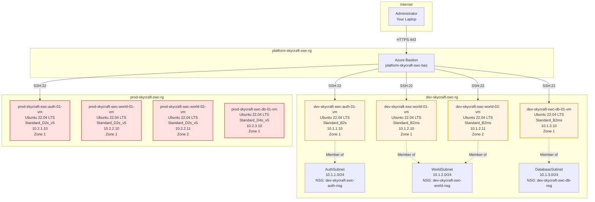

# Lab 3.1: Deploy Virtual Machines for SkyCraft (3 hours)

## 🎯 Learning Objectives

By completing this lab, you will:
- Deploy Azure Virtual Machines using Ubuntu Server 22.04 LTS
- Configure VM sizes appropriate for game server workloads
- Attach VMs to existing subnets and network security groups
- Configure managed disks for OS and data storage
- Connect to VMs securely using Azure Bastion
- Implement availability zones for high availability
- Apply consistent naming conventions and tagging strategies
- Use cloud-init for initial VM configuration

---

## 🏗️ Architecture Overview

You'll deploy virtual machines into the existing hub-spoke network infrastructure:



---

## 📋 Real-World Scenario

**Situation**: The SkyCraft network infrastructure is ready (VNets, NSGs, Load Balancers, DNS). Now you need to deploy the actual virtual machines that will run the AzerothCore game server components. Each environment (dev and prod) requires authentication servers, world servers, and database servers. These VMs must be deployed across availability zones for high availability and properly sized based on workload requirements.

**Your Task**: Deploy virtual machines by:
- Selecting appropriate VM sizes for each server role
- Deploying VMs into correct subnets with existing NSGs
- Configuring availability zones for resilience
- Using managed disks for storage
- Securing access through Azure Bastion (no public IPs)
- Applying consistent naming and tagging
- Preparing VMs for AzerothCore installation in Lab 3.2

---

## ⏱️ Estimated Time: 3 hours

- **Section 1**: Understanding Azure VM concepts and sizing (20 min)
- **Section 2**: Deploy development environment VMs (50 min)
- **Section 3**: Deploy production environment VMs (40 min)
- **Section 4**: Configure managed disks and storage (30 min)
- **Section 5**: Connect via Azure Bastion and verify (30 min)
- **Section 6**: Configure cloud-init for initial setup (10 min)

---

## ✅ Prerequisites

Before starting this lab:
- [ ] Completed Lab 2.1 (Virtual Networks)
- [ ] Completed Lab 2.2 (Network Security with Bastion)
- [ ] Completed Lab 2.3 (DNS and Load Balancing)
- [ ] Azure Bastion deployed in hub VNet
- [ ] NSGs associated with all subnets
- [ ] Owner or Contributor role at subscription level
- [ ] Understanding of Linux command line (basic SSH, sudo)

**Verify infrastructure from Module 2**:
- VNets: platform-skycraft-swc-vnet, dev-skycraft-swc-vnet, prod-skycraft-swc-vnet
- Subnets: AuthSubnet, WorldSubnet, DatabaseSubnet (in dev and prod)
- NSGs: 6 NSGs with rules allowing SSH from Bastion (10.0.0.0/26)
- Bastion: platform-skycraft-swc-bas operational

---

## 📖 Section 1: Understanding Azure VM Concepts and Sizing (20 minutes)

### What are Azure Virtual Machines?

**Azure Virtual Machines** provide on-demand, scalable computing resources with Linux or Windows operating systems. Key concepts:

| Component | Description |
|-----------|-------------|
| **VM Size** | Determines CPU, memory, storage, and network capacity |
| **OS Disk** | Managed disk containing the operating system (30-2048 GB) |
| **Data Disk** | Additional storage for application data |
| **Network Interface (NIC)** | Connects VM to VNet subnet |
| **Availability Zone** | Physically separate datacenter within region |
| **Managed Disk** | Azure-managed storage (Standard HDD, SSD, Premium SSD) |

### VM Size Selection for SkyCraft

Different server roles have different resource requirements:

| Server Role | Workload Type | CPU Need | Memory Need | Recommended Size |
|-------------|---------------|----------|-------------|------------------|
| **Auth Server** | Low CPU, low memory | 2 vCPU | 4 GB | B2s (dev), D2s_v5 (prod) |
| **World Server** | Medium CPU, medium memory | 2 vCPU | 8 GB | B2ms (dev), D2s_v5 (prod) |
| **Database** | High I/O, high memory | 2-4 vCPU | 8-16 GB | B2ms (dev), D4s_v5 (prod) |

### VM Series Explanation

| Series | Type | Use Case | Cost |
|--------|------|----------|------|
| **B-series** | Burstable | Dev/test, low baseline CPU with burst capability | Low ($) |
| **D-series** | General purpose | Production workloads, consistent performance | Medium ($$) |
| **E-series** | Memory optimized | Database servers, large caching | High ($$$) |
| **F-series** | Compute optimized | High CPU workloads, gaming servers | Medium ($$) |

**For SkyCraft**:
- **Development**: B-series (cost-effective, burstable for testing)
- **Production**: D-series (predictable performance, SLA-backed)

### Availability Zones

**Availability Zones** are physically separate datacenters within an Azure region:
- **Zone 1, Zone 2, Zone 3**: Each has independent power, cooling, networking
- **99.99% SLA**: When VMs deployed across multiple zones
- **No additional cost**: Same pricing as non-zoned VMs

**Strategy**: Deploy redundant VMs (World Server 1, World Server 2) to different zones.

### Managed Disk Types

| Disk Type | IOPS | Throughput | Use Case | Cost |
|-----------|------|------------|----------|------|
| **Standard HDD** | 500 | 60 MB/s | Backup, non-critical | Lowest |
| **Standard SSD** | 500-6,000 | 60-750 MB/s | Web servers, dev/test | Low |
| **Premium SSD** | 120-20,000 | 25-900 MB/s | Production databases | Medium |
| **Ultra Disk** | Up to 160,000 | Up to 4,000 MB/s | Mission-critical | Highest |

**For SkyCraft**:
- **Dev VMs**: Standard SSD (OS disk) - adequate for development
- **Prod VMs**: Premium SSD (OS disk) - production reliability
- **Database VMs**: Premium SSD (data disk) - I/O performance

---

## 📖 Section 2: Deploy Development Environment VMs (50 minutes)

### Step 3.1.1: Deploy Dev Auth Server VM

1. In **Azure Portal**, search for **"Virtual machines"**
2. Click **+ Create** → **Azure virtual machine**

**Basics tab**:

| Field | Value |
|-------|-------|
| Subscription | [Your subscription] |
| Resource group | `dev-skycraft-swc-rg` |
| Virtual machine name | `dev-skycraft-swc-auth-01-vm` |
| Region | **Sweden Central** |
| Availability options | **Availability zone** |
| Availability zone | **Zone 1** |
| Security type | Standard |
| Image | **Ubuntu Server 22.04 LTS - x64 Gen2** |
| VM architecture | x64 |
| Size | **Standard_B2s** (2 vCPU, 4 GiB memory) |

**Administrator account**:

| Field | Value |
|-------|-------|
| Authentication type | **SSH public key** |
| Username | `azureuser` |
| SSH public key source | **Generate new key pair** |
| Key pair name | `dev-skycraft-swc-auth-01-key` |

**Inbound port rules**:

| Field | Value |
|-------|-------|
| Public inbound ports | **None** (Bastion will provide access) |

3. Click **Next: Disks**

**Disks tab**:

| Field | Value |
|-------|-------|
| OS disk type | **Standard SSD** (locally-redundant storage) |
| Delete with VM | ☑ Checked |
| Encryption type | (Default) Encryption at rest with platform-managed key |

4. Click **Next: Networking**

**Networking tab**:

| Field | Value |
|-------|-------|
| Virtual network | `dev-skycraft-swc-vnet` |
| Subnet | `AuthSubnet (10.1.1.0/24)` |
| Public IP | **None** |
| NIC network security group | **None** (subnet NSG already applied) |
| Delete NIC when VM is deleted | ☑ Checked |
| Accelerated networking | ☐ Unchecked (not supported on B-series) |

**Important**: Select **None** for Public IP - Bastion provides secure access without exposing VMs to internet.

5. Click **Next: Management**

**Management tab**:

| Field | Value |
|-------|-------|
| Enable auto-shutdown | ☑ Checked (optional, saves costs) |
| Shutdown time | 19:00:00 (7 PM) |
| Time zone | (UTC+01:00) Amsterdam, Berlin, Bern, Rome, Stockholm, Vienna |
| Boot diagnostics | Enabled with managed storage account |

6. Click **Next: Monitoring** (leave defaults)
7. Click **Next: Advanced** (skip for now)
8. Click **Next: Tags**

**Tags**:

| Name | Value |
|------|-------|
| Project | SkyCraft |
| Environment | Development |
| CostCenter | MSDN |
| Role | AuthServer |

9. Click **Review + create**
10. Review configuration
11. Click **Create**

**Expected Result**:
- Azure prompts to download SSH private key
- **Download private key** and save as `dev-skycraft-swc-auth-01-key.pem`
- Store securely (needed for SSH access)
- Deployment takes 3-5 minutes

### Step 3.1.2: Deploy Dev World Server VM 1

1. Navigate to **Virtual machines** → **+ Create**

**Use same process as Auth server with these differences**:

| Field | Value |
|-------|-------|
| Virtual machine name | `dev-skycraft-swc-world-01-vm` |
| Availability zone | **Zone 1** |
| Size | **Standard_B2ms** (2 vCPU, 8 GiB memory) |
| Key pair name | `dev-skycraft-swc-world-01-key` |
| Subnet | `WorldSubnet (10.1.2.0/24)` |
| Tag: Role | WorldServer |

2. Click **Review + create** → **Create**
3. Download SSH key: `dev-skycraft-swc-world-01-key.pem`

**Expected Result**: World Server 1 deployed to Zone 1 in WorldSubnet.

### Step 3.1.3: Deploy Dev World Server VM 2

1. Create second world server for redundancy

| Field | Value |
|-------|-------|
| Virtual machine name | `dev-skycraft-swc-world-02-vm` |
| Availability zone | **Zone 2** (different zone for HA) |
| Size | **Standard_B2ms** |
| Key pair name | `dev-skycraft-swc-world-02-key` |
| Subnet | `WorldSubnet (10.1.2.0/24)` |
| Tag: Role | WorldServer |

2. Click **Review + create** → **Create**
3. Download SSH key: `dev-skycraft-swc-world-02-key.pem`

**Expected Result**: Two world servers deployed across Zone 1 and Zone 2 for high availability.

### Step 3.1.4: Deploy Dev Database Server VM

1. Create database server with higher memory

| Field | Value |
|-------|-------|
| Virtual machine name | `dev-skycraft-swc-db-01-vm` |
| Availability zone | **Zone 1** |
| Size | **Standard_B2ms** (2 vCPU, 8 GiB memory) |
| Key pair name | `dev-skycraft-swc-db-01-key` |
| Subnet | `DatabaseSubnet (10.1.3.0/24)` |
| Tag: Role | DatabaseServer |

2. Click **Review + create** → **Create**
3. Download SSH key: `dev-skycraft-swc-db-01-key.pem`

**Expected Result**: Database server deployed to DatabaseSubnet with adequate memory for MySQL.

---

## 📖 Section 3: Deploy Production Environment VMs (40 minutes)

### Step 3.1.5: Deploy Production VMs

Repeat the VM deployment process for production with **production-grade sizes**:

**Production Auth Server**:

| Field | Value |
|-------|-------|
| Resource group | `prod-skycraft-swc-rg` |
| Virtual machine name | `prod-skycraft-swc-auth-01-vm` |
| Availability zone | **Zone 1** |
| Size | **Standard_D2s_v5** (2 vCPU, 8 GiB memory) |
| OS disk type | **Premium SSD** |
| Virtual network | `prod-skycraft-swc-vnet` |
| Subnet | `AuthSubnet (10.2.1.0/24)` |
| Key pair name | `prod-skycraft-swc-auth-01-key` |
| Tags | Project=SkyCraft, Environment=Production, CostCenter=MSDN, Role=AuthServer |

**Production World Server 1**:

| Field | Value |
|-------|-------|
| Virtual machine name | `prod-skycraft-swc-world-01-vm` |
| Availability zone | **Zone 1** |
| Size | **Standard_D2s_v5** |
| OS disk type | **Premium SSD** |
| Subnet | `WorldSubnet (10.2.2.0/24)` |
| Key pair name | `prod-skycraft-swc-world-01-key` |
| Tag: Role | WorldServer |

**Production World Server 2**:

| Field | Value |
|-------|-------|
| Virtual machine name | `prod-skycraft-swc-world-02-vm` |
| Availability zone | **Zone 2** (different zone) |
| Size | **Standard_D2s_v5** |
| OS disk type | **Premium SSD** |
| Subnet | `WorldSubnet (10.2.2.0/24)` |
| Key pair name | `prod-skycraft-swc-world-02-key` |
| Tag: Role | WorldServer |

**Production Database Server**:

| Field | Value |
|-------|-------|
| Virtual machine name | `prod-skycraft-swc-db-01-vm` |
| Availability zone | **Zone 1** |
| Size | **Standard_D4s_v5** (4 vCPU, 16 GiB memory) |
| OS disk type | **Premium SSD** |
| Subnet | `DatabaseSubnet (10.2.3.0/24)` |
| Key pair name | `prod-skycraft-swc-db-01-key` |
| Tag: Role | DatabaseServer |

**Expected Result**: 
- 4 production VMs deployed across Zone 1 and Zone 2
- All using Premium SSD for production reliability
- D-series VMs provide consistent performance
- Total: 8 VMs deployed (4 dev + 4 prod)

---

## 📖 Section 4: Configure Managed Disks and Storage (30 minutes)

### Step 3.1.6: Add Data Disk to Database VMs

Database servers need additional storage for MySQL data.

**Add data disk to dev-skycraft-swc-db-01-vm**:

1. Navigate to **Virtual machines** → **dev-skycraft-swc-db-01-vm**
2. In left menu, click **Disks**
3. Click **+ Create and attach a new disk**

| Field | Value |
|-------|-------|
| Disk name | `dev-skycraft-swc-db-01-datadisk-01` |
| Source type | **None (empty disk)** |
| Size | **128 GiB** (P10 - 500 IOPS) |
| Disk SKU | **Standard SSD** |
| Encryption | Platform-managed key |
| Host caching | **Read/Write** |

4. Click **Save**

**Expected Result**: 128 GB data disk attached to dev database VM.

**Add data disk to prod-skycraft-swc-db-01-vm**:

5. Navigate to **prod-skycraft-swc-db-01-vm** → **Disks**
6. Click **+ Create and attach a new disk**

| Field | Value |
|-------|-------|
| Disk name | `prod-skycraft-swc-db-01-datadisk-01` |
| Size | **256 GiB** (P15 - 1,100 IOPS) |
| Disk SKU | **Premium SSD** |
| Host caching | **Read/Write** |

7. Click **Save**

**Expected Result**: 256 GB Premium SSD data disk attached to production database VM.

### Step 3.1.7: Verify Disk Configuration

1. Navigate to **Virtual machines** → **dev-skycraft-swc-db-01-vm** → **Disks**
2. Verify configuration:
   - **OS disk**: Standard SSD (30 GB)
   - **Data disks**: 1 disk (128 GB)

3. Navigate to **prod-skycraft-swc-db-01-vm** → **Disks**
4. Verify configuration:
   - **OS disk**: Premium SSD (30 GB)
   - **Data disks**: 1 disk (256 GB)

**Expected Result**: Database VMs have dedicated data disks for MySQL storage, separate from OS disk.

---

## 📖 Section 5: Connect via Azure Bastion and Verify (30 minutes)

### Step 3.1.8: Connect to Dev Auth Server via Bastion

1. Navigate to **Virtual machines** → **dev-skycraft-swc-auth-01-vm**
2. Click **Connect** → **Bastion**
3. Configure Bastion connection:

| Field | Value |
|-------|-------|
| Authentication type | **SSH Private Key from Local File** |
| Username | `azureuser` |
| Local file | [Browse and select `dev-skycraft-swc-auth-01-key.pem`] |

4. Click **Connect**

**Expected Result**: 
- New browser tab opens with SSH session
- Connected to `azureuser@dev-skycraft-swc-auth-01-vm`
- No public IP needed (traffic routes through Bastion via VNet peering)

### Step 3.1.9: Verify VM Configuration

Once connected via Bastion, run these commands:

```bash
# Check OS version
cat /etc/os-release

# Expected output:
# PRETTY_NAME="Ubuntu 22.04.X LTS"
# VERSION_ID="22.04"

# Check CPU and memory
lscpu | grep "CPU(s):"
free -h

# Expected output:
# CPU(s): 2
# Mem: 3.8Gi (for B2s)

# Check network interface
ip addr show

# Expected output:
# eth0: 10.1.1.X (IP in AuthSubnet range)

# Check internet connectivity
ping -c 3 8.8.8.8

# Test DNS resolution
nslookup dev-db.skycraft.internal

# Expected output:
# Name: dev-db.skycraft.internal
# Address: 10.1.3.10

# Check disk configuration
lsblk

# Expected output:
# sda   30G  (OS disk)
# └─sda1  30G  /
```

### Step 3.1.10: Test Connectivity Between VMs

From dev-skycraft-swc-auth-01-vm, test connectivity to other VMs:

```bash
# Test SSH to world server (using private IP)
ssh azureuser@10.1.2.10

# Note: This will fail because you don't have the private key on this VM yet
# We're just verifying network connectivity

# Test TCP connectivity to world server port
nc -zv 10.1.2.10 22

# Expected output:
# Connection to 10.1.2.10 22 port [tcp/ssh] succeeded!

# Test connectivity to database server
nc -zv 10.1.3.10 22

# Expected output:
# Connection to 10.1.3.10 22 port [tcp/ssh] succeeded!

# Test MySQL port (not installed yet, should timeout)
nc -zv -w 2 10.1.3.10 3306

# Expected: Connection refused or timeout (MySQL not installed yet)
```

**Expected Result**: VMs can communicate within VNet. SSH works (port 22). MySQL not yet installed.

### Step 3.1.11: Connect to Other VMs via Bastion

Repeat Bastion connection for all VMs to verify deployment:

**Dev Environment**:
- dev-skycraft-swc-world-01-vm (use dev-skycraft-swc-world-01-key.pem)
- dev-skycraft-swc-world-02-vm (use dev-skycraft-swc-world-02-key.pem)
- dev-skycraft-swc-db-01-vm (use dev-skycraft-swc-db-01-key.pem)

**Production Environment**:
- prod-skycraft-swc-auth-01-vm (use prod-skycraft-swc-auth-01-key.pem)
- prod-skycraft-swc-world-01-vm (use prod-skycraft-swc-world-01-key.pem)
- prod-skycraft-swc-world-02-vm (use prod-skycraft-swc-world-02-key.pem)
- prod-skycraft-swc-db-01-vm (use prod-skycraft-swc-db-01-key.pem)

**Expected Result**: All 8 VMs accessible via Bastion. No connectivity issues.

---

## 📖 Section 6: Configure Cloud-Init for Initial Setup (10 minutes)

### What is Cloud-Init?

**Cloud-init** is a standard for VM initialization on first boot. It can:
- Update packages
- Install software
- Create users
- Run custom scripts

**For production deployments**, cloud-init is preferred over manual SSH configuration.

### Step 3.1.12: Review Cloud-Init Configuration (Conceptual)

Cloud-init can be specified during VM creation in the **Advanced** tab. Here's an example for future reference:

```yaml
#cloud-config
package_update: true
package_upgrade: true

packages:
  - build-essential
  - git
  - cmake
  - libssl-dev
  - libmysqlclient-dev

runcmd:
  - echo "Cloud-init completed" > /var/log/cloudinit-complete.log
  - timedatectl set-timezone Europe/Stockholm
```

**Note**: Our VMs are already deployed. In Lab 3.2, we'll use Custom Script Extension as an alternative to install AzerothCore dependencies.

**Expected Understanding**: Cloud-init automates initial VM configuration, reducing manual setup time.

---

## ✅ Lab Checklist

Quick verification before proceeding:

### Development Environment VMs
- [ ] dev-skycraft-swc-auth-01-vm deployed (Zone 1, B2s, AuthSubnet)
- [ ] dev-skycraft-swc-world-01-vm deployed (Zone 1, B2ms, WorldSubnet)
- [ ] dev-skycraft-swc-world-02-vm deployed (Zone 2, B2ms, WorldSubnet)
- [ ] dev-skycraft-swc-db-01-vm deployed (Zone 1, B2ms, DatabaseSubnet)
- [ ] All dev VMs have Standard SSD OS disks
- [ ] dev-skycraft-swc-db-01-vm has 128 GB data disk attached

### Production Environment VMs
- [ ] prod-skycraft-swc-auth-01-vm deployed (Zone 1, D2s_v5, Premium SSD)
- [ ] prod-skycraft-swc-world-01-vm deployed (Zone 1, D2s_v5, Premium SSD)
- [ ] prod-skycraft-swc-world-02-vm deployed (Zone 2, D2s_v5, Premium SSD)
- [ ] prod-skycraft-swc-db-01-vm deployed (Zone 1, D4s_v5, Premium SSD)
- [ ] prod-skycraft-swc-db-01-vm has 256 GB Premium SSD data disk

### Networking and Security
- [ ] All VMs have **no public IP** addresses
- [ ] All VMs accessible via Azure Bastion
- [ ] VMs deployed to correct subnets (Auth, World, Database)
- [ ] NSG rules allow SSH from Bastion subnet (10.0.0.0/26)
- [ ] Private DNS auto-registration enabled (VMs appear in skycraft.internal)

### Configuration and Management
- [ ] All VMs have proper tags (Project, Environment, CostCenter, Role)
- [ ] All VMs follow naming convention (env-skycraft-swc-role-##-vm)
- [ ] SSH private keys downloaded and stored securely
- [ ] All VMs running Ubuntu 22.04 LTS

**For detailed verification**, see [lab-checklist-3.1.md](lab-checklist-3.1.md)

---

## 🎓 Knowledge Check

Test your understanding with these questions:

1. **Why did we deploy World Servers to different availability zones?**

   <details>
     <summary>**Click to see the answer**</summary>

   **Answer**: **High availability and fault tolerance.**

   - **Zone 1 and Zone 2** are physically separate datacenters in Sweden Central
   - If Zone 1 experiences power failure, Zone 2 continues operating
   - Load balancer (from Lab 2.3) distributes traffic across both zones
   - Provides **99.99% SLA** (vs 99.9% for single-zone)

   **For SkyCraft**: If dev-skycraft-swc-world-01-vm (Zone 1) fails, world-02-vm (Zone 2) continues serving players. Load balancer detects failure via health probes and routes all traffic to healthy VM.

   **Why not Auth or Database?**: 
   - Auth servers: Single instance sufficient for dev (low traffic)
   - Database: Requires replication setup (covered in advanced scenarios)
   - Cost optimization: Focus HA on critical player-facing services
   </details>

2. **What is the difference between Standard SSD and Premium SSD?**

   <details>
     <summary>**Click to see the answer**</summary>

   **Answer**:

   | Feature | Standard SSD | Premium SSD |
   |---------|--------------|-------------|
   | **IOPS** | Up to 6,000 | Up to 20,000 |
   | **Throughput** | Up to 750 MB/s | Up to 900 MB/s |
   | **Latency** | Single-digit ms | Sub-millisecond |
   | **SLA** | No SLA | 99.9% availability |
   | **Cost** | Lower | Higher (~2-3x) |
   | **Use case** | Dev/test, non-critical | Production, databases |

   **For SkyCraft decisions**:
   - **Dev VMs**: Standard SSD (cost-effective, adequate performance for testing)
   - **Prod VMs**: Premium SSD (SLA-backed, production reliability)
   - **Database data disks**: Premium SSD (I/O intensive workload)

   **Why?** Database performance directly impacts game responsiveness. Premium SSD ensures low-latency database queries even under heavy player load.
   </details>

3. **Why don't we assign public IP addresses to the VMs?**

   <details>
     <summary>**Click to see the answer**</summary>

   **Answer**: **Security best practice - minimize attack surface.**

   **Without public IPs**:
   - ✅ VMs not exposed to internet port scans
   - ✅ No brute-force SSH attacks possible
   - ✅ Reduces need for complex NSG rules
   - ✅ Azure Bastion provides secure administrative access
   - ✅ Game traffic goes through load balancers (controlled entry points)

   **Access methods**:
   - **Administrative**: Azure Bastion (HTTPS tunnel, no VPN needed)
   - **Player traffic**: Load balancer public IPs (ports 3724, 8085 only)
   - **Inter-VM**: Private IPs within VNet (10.1.x.x, 10.2.x.x)

   **Result**: Attack surface reduced to two public IPs (load balancers) instead of 8 (one per VM).
   </details>

4. **What is the purpose of host caching on data disks?**

   <details>
     <summary>**Click to see the answer**</summary>

   **Answer**: **Host caching improves disk performance by caching frequently accessed data on the VM host.**

   **Caching options**:

   1. **None**: No caching, all I/O goes to disk
      - Use for: Write-heavy workloads, logs

   2. **Read-only**: Caches read operations
      - Use for: Static content, read-heavy databases

   3. **Read/Write**: Caches both read and write operations
      - Use for: General purpose, OS disks

   **For SkyCraft database disks**: We used **Read/Write** because:
   - MySQL performs both reads (player data queries) and writes (inventory updates)
   - Caching reduces latency for frequently accessed tables (character, items)
   - Azure ensures cached writes are persisted to durable storage

   **Important**: Read/Write caching should NOT be used for database transaction logs (use None or Read-only) to ensure write durability.
   </details>

5. **Why use B-series VMs for development and D-series for production?**

   <details>
     <summary>**Click to see the answer**</summary>

   **Answer**: **Cost optimization balanced with performance requirements.**

   **B-series (Burstable)**:
   - **CPU model**: Baseline CPU credits + burst capability
   - **Pricing**: ~$0.05-0.10/hour (very low)
   - **Performance**: 30-40% baseline, can burst to 100% when credits available
   - **Best for**: Dev/test where sustained high CPU not needed

   **D-series (General Purpose)**:
   - **CPU model**: Consistent 100% CPU availability
   - **Pricing**: ~$0.10-0.20/hour (moderate)
   - **Performance**: Predictable, no throttling
   - **Best for**: Production workloads requiring reliable performance

   **For SkyCraft**:
   - **Dev**: Low player count (1-5 testers), burst capability sufficient, saves ~50% cost
   - **Prod**: High player count (50-500 players), must maintain performance 24/7, SLA-backed

   **Example**: B2ms costs $38/month vs D2s_v5 at $70/month. For 4 dev VMs, savings = $128/month while maintaining adequate test performance.
   </details>

6. **What happens if a VM in Zone 1 fails during a zone outage?**

   <details>
     <summary>**Click to see the answer**</summary>

   **Answer**: **Automatic failover via load balancer health probes.**

   **Failure scenario**:
   1. Zone 1 experiences datacenter power failure
   2. All VMs in Zone 1 become unreachable
   3. **Load balancer health probes** (every 15 seconds) detect failure
   4. After 2 consecutive failures (30 seconds), VMs marked unhealthy
   5. **Load balancer stops** sending traffic to Zone 1 VMs
   6. All traffic routes to Zone 2 VMs automatically

   **For SkyCraft World Servers**:
   - `dev-skycraft-swc-world-01-vm` (Zone 1) fails
   - `dev-skycraft-swc-world-02-vm` (Zone 2) handles 100% traffic
   - Players experience ~30 second hiccup, then normal gameplay
   - No manual intervention needed

   **When Zone 1 recovers**:
   - VMs restart automatically
   - Health probes succeed (2 consecutive checks)
   - Load balancer restores traffic to Zone 1
   - Returns to 50/50 distribution

   **Single point of failure**: Auth and Database servers (single instance). In production, these would also be deployed across zones with replication.
   </details>

7. **How does private DNS auto-registration work with these VMs?**

   <details>
     <summary>**Click to see the answer**</summary>

   **Answer**: **Azure automatically creates DNS A records when VMs start in linked VNets.**

   **Configuration** (from Lab 2.3):
   - Private DNS zone: `skycraft.internal`
   - VNet links: dev-skycraft-swc-vnet (auto-registration: **enabled**)

   **Automatic process**:
   1. VM starts: `dev-skycraft-swc-auth-01-vm`
   2. Azure detects VM in linked VNet with auto-registration
   3. Azure creates A record: `dev-skycraft-swc-auth-01-vm.skycraft.internal` → 10.1.1.10
   4. DNS propagates within seconds
   5. All VMs in VNet can resolve the name

   **Test from any dev VM**:
   ```bash
   nslookup dev-skycraft-swc-db-01-vm.skycraft.internal
   # Returns: 10.1.3.X

   ping dev-skycraft-swc-world-02-vm.skycraft.internal
   # Works using private IP
   ```

   **Benefits**:
   - No manual DNS management needed
   - Always up-to-date (records deleted when VM stopped)
   - Application configs can use names instead of IPs
   - Easy service discovery within environment
   </details>

---

## 🔧 Troubleshooting

### Issue 1: Cannot connect to VM via Bastion

**Symptom**: Bastion connection times out or shows "Unable to connect"

**Solution**:
- Verify VM is running (not stopped): **Virtual machines** → Status should show "Running"
- Check NSG allows SSH from Bastion subnet (10.0.0.0/26):
  ```bash
  az network nsg rule list --resource-group dev-skycraft-swc-rg --nsg-name dev-skycraft-swc-auth-nsg
  ```
- Verify VNet peering status: **Virtual networks** → **Peerings** → Status "Connected"
- Ensure correct SSH key file selected (dev-skycraft-swc-auth-01-key.pem for auth-01-vm)
- Try reconnecting after 2-3 minutes (VM may still be initializing)

### Issue 2: VM deployment fails - quota exceeded

**Symptom**: Error: "Operation could not be completed as it results in exceeding approved StandardBSFamily Cores quota"

**Solution**:
- Check current quota: **Subscriptions** → **Usage + quotas**
- Request quota increase:
  - Select region: **Sweden Central**
  - Select quota: **Standard BS Family vCPUs**
  - Request: 16 vCPUs (for 4 B-series VMs)
- Alternative: Deploy to different region with available quota
- Temporary: Use smaller VM sizes (B1s instead of B2s)

### Issue 3: SSH authentication fails with "Permission denied"

**Symptom**: Bastion connects but shows "Permission denied (publickey)"

**Solution**:
- Verify correct SSH key file selected (each VM has unique key)
- Check key file permissions on downloaded .pem file:
  - Windows: Right-click → Properties → Security (should have read access)
  - Linux/Mac: `chmod 400 dev-skycraft-swc-auth-01-key.pem`
- Confirm username is `azureuser` (not root or admin)
- If key lost, reset SSH key: **Virtual machines** → **Reset password** → Upload new key

### Issue 4: Cannot ping between VMs

**Symptom**: `ping 10.1.2.10` times out from auth server

**Solution**:
- **Note**: Ping uses ICMP, not TCP/UDP
- Check NSG allows ICMP (may need to add rule)
- Alternative: Use TCP connectivity test:
  ```bash
  nc -zv 10.1.2.10 22
  ```
- Verify VMs are in same VNet or peered VNets
- Check effective NSG rules: **Virtual machines** → **Networking** → **Effective security rules**

### Issue 5: Data disk not visible in VM

**Symptom**: After attaching disk, `lsblk` doesn't show new disk

**Solution**:
- Disk may need initialization and mounting:
  ```bash
  # List disks (should see sdb or similar)
  lsblk

  # Partition the disk (if sdb)
  sudo fdisk /dev/sdb
  # Press: n (new), p (primary), 1, Enter, Enter, w (write)

  # Format the partition
  sudo mkfs.ext4 /dev/sdb1

  # Create mount point
  sudo mkdir /datadisk

  # Mount the disk
  sudo mount /dev/sdb1 /datadisk

  # Add to /etc/fstab for persistence
  echo '/dev/sdb1 /datadisk ext4 defaults 0 0' | sudo tee -a /etc/fstab
  ```
- Verify disk attached in Azure Portal: **Virtual machines** → **Disks**

### Issue 6: VM stuck in "Creating" state

**Symptom**: VM deployment takes longer than 10 minutes, status shows "Creating"

**Solution**:
- Check deployment status: **Resource groups** → **Deployments** → Select deployment
- Review activity log for errors: **Virtual machines** → **Activity log**
- Common causes:
  - Image not available in region (try different image)
  - Zone capacity issues (try different zone or no zone)
  - Network connectivity timeout (check VNet configuration)
- If stuck > 20 minutes, cancel deployment and retry
- Contact Azure support if persistent

---

## 📚 Additional Resources

- [Azure Virtual Machines Documentation](https://learn.microsoft.com/en-us/azure/virtual-machines/)
- [Linux VM sizes](https://learn.microsoft.com/en-us/azure/virtual-machines/sizes)
- [Azure Managed Disks](https://learn.microsoft.com/en-us/azure/virtual-machines/managed-disks-overview)
- [Availability zones](https://learn.microsoft.com/en-us/azure/reliability/availability-zones-overview)
- [Cloud-init support for VMs](https://learn.microsoft.com/en-us/azure/virtual-machines/linux/using-cloud-init)
- [Azure Bastion connectivity](https://learn.microsoft.com/en-us/azure/bastion/bastion-connect-vm-ssh-linux)

---

## 📌 Module Navigation

- [← Back to Module 3 Index](../README.md)
- [← Previous Module: Module 2 Networking](../../module-2-networking/README.md)
- [Next Lab: 3.2 Configure AzerothCore →](../3.2-configure-azerothcore/lab-guide-3.2.md)

---

## 📝 Lab Summary

**What You Accomplished**:
- ✅ Deployed 8 Azure Virtual Machines (4 dev + 4 prod)
- ✅ Selected appropriate VM sizes for each workload (B-series dev, D-series prod)
- ✅ Configured availability zones for high availability
- ✅ Attached managed disks (Standard SSD dev, Premium SSD prod)
- ✅ Added data disks to database servers (128 GB dev, 256 GB prod)
- ✅ Connected to all VMs securely via Azure Bastion
- ✅ Verified networking and Private DNS auto-registration
- ✅ Applied consistent naming conventions and tags

**Infrastructure Inventory**:

| VM Name | Size | Zone | OS Disk | Data Disk | Subnet | IP Range |
|---------|------|------|---------|-----------|--------|----------|
| dev-skycraft-swc-auth-01-vm | B2s | 1 | 30GB SSD | - | AuthSubnet | 10.1.1.x |
| dev-skycraft-swc-world-01-vm | B2ms | 1 | 30GB SSD | - | WorldSubnet | 10.1.2.x |
| dev-skycraft-swc-world-02-vm | B2ms | 2 | 30GB SSD | - | WorldSubnet | 10.1.2.x |
| dev-skycraft-swc-db-01-vm | B2ms | 1 | 30GB SSD | 128GB | DatabaseSubnet | 10.1.3.x |
| prod-skycraft-swc-auth-01-vm | D2s_v5 | 1 | 30GB Premium | - | AuthSubnet | 10.2.1.x |
| prod-skycraft-swc-world-01-vm | D2s_v5 | 1 | 30GB Premium | - | WorldSubnet | 10.2.2.x |
| prod-skycraft-swc-world-02-vm | D2s_v5 | 2 | 30GB Premium | - | WorldSubnet | 10.2.2.x |
| prod-skycraft-swc-db-01-vm | D4s_v5 | 1 | 30GB Premium | 256GB | DatabaseSubnet | 10.2.3.x |

**Time Spent**: ~3 hours

**Ready for Lab 3.2?** Next, you'll install AzerothCore dependencies, compile the game server software, configure databases, and prepare VMs for production gameplay!
