# Lab 3.2: Create and Configure Virtual Machines (4 hours)

## 🎯 Learning Objectives

By completing this lab, you will:

- Create Azure Virtual Machines (Ubuntu Linux) for SkyCraft game servers
- Configure Azure Disk Encryption for OS and data disks
- Manage virtual machine sizes and resize VMs based on workload requirements
- Add and configure managed data disks for database storage
- Deploy VMs to availability zones for high availability
- Understand Azure Virtual Machine Scale Sets for auto-scaling Worldserver instances
- Move virtual machines between resource groups (conceptual)

---

## 🏗️ Architecture Overview

You'll deploy this VM infrastructure for SkyCraft game servers:

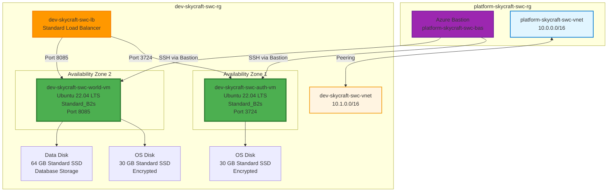

---

## 📋 Real-World Scenario

**Situation**: Your SkyCraft infrastructure now has a complete network foundation with VNets, NSGs, and load balancers deployed via Bicep. The next step is deploying the actual game servers. You need Linux VMs to run:

- **Authserver**: Handles player authentication (login) on port 3724
- **Worldserver**: Runs the game world and handles gameplay on port 8085

**Your Task**: Deploy Azure Virtual Machines that:

- Run Ubuntu 22.04 LTS (AzerothCore's recommended OS)
- Are distributed across availability zones for high availability
- Have encrypted disks for security compliance
- Include additional data disks for database storage
- Are properly sized for the expected player load (starting small, can resize later)
- Connect to the existing load balancer for public access

**Business Impact**:

- Game servers become operational for player connections
- High availability ensures players can connect even if one zone fails
- Disk encryption meets security and compliance requirements
- Proper sizing optimizes costs while ensuring performance

---

## ⏱️ Estimated Time: 4 hours

- **Section 1**: Understanding Azure Virtual Machines (20 min)
- **Section 2**: Create Authserver Virtual Machine (45 min)
- **Section 3**: Create Worldserver Virtual Machine (40 min)
- **Section 4**: Configure managed data disks (30 min)
- **Section 5**: Configure Azure Disk Encryption (35 min)
- **Section 6**: Deploy VMs to availability zones (25 min)
- **Section 7**: Manage VM sizes (25 min)
- **Section 8**: Introduction to Virtual Machine Scale Sets (20 min)

---

## ✅ Prerequisites

Before starting this lab:

- [ ] Completed Lab 2.1 (Virtual Networks) - VNets exist
- [ ] Completed Lab 2.2 (Secure Access) - NSGs and Azure Bastion deployed
- [ ] Completed Lab 3.1 (Infrastructure as Code) - Bicep knowledge
- [ ] Existing resources:
  - Resource groups: `platform-skycraft-swc-rg`, `dev-skycraft-swc-rg`
  - VNets: `platform-skycraft-swc-vnet`, `dev-skycraft-swc-vnet`
  - NSGs: `auth-nsg`, `world-nsg`
  - Load Balancer: `dev-skycraft-swc-lb`
  - Azure Bastion: `platform-skycraft-swc-bas`
- [ ] Contributor or Owner role at resource group level
- [ ] SSH key pair generated (or ability to generate one)

**Verify prerequisites**:

```azurecli
# Check resource groups exist
az group show --name dev-skycraft-swc-rg --query "name" --output tsv

# Check VNet exists
az network vnet show --name dev-skycraft-swc-vnet --resource-group dev-skycraft-swc-rg --query "name" --output tsv

# Check subnets exist
az network vnet subnet list --vnet-name dev-skycraft-swc-vnet --resource-group dev-skycraft-swc-rg --query "[].name" --output tsv
```

---

## 📖 Section 1: Understanding Azure Virtual Machines (20 minutes)

### What are Azure Virtual Machines?

**Azure Virtual Machines (VMs)** are on-demand, scalable computing resources that run in the Azure cloud. VMs provide:

- Full control over the operating system
- Ability to run custom software (like AzerothCore game servers)
- Networking integration with Azure VNets
- Storage options for OS and data disks
- High availability through availability zones and sets

### VM Components for SkyCraft

| Component             | Purpose                       | SkyCraft Example                      |
| --------------------- | ----------------------------- | ------------------------------------- |
| **VM Size**           | CPU, memory, storage capacity | Standard_B2s (2 vCPUs, 4 GB RAM)      |
| **OS Disk**           | Contains operating system     | Ubuntu 22.04 LTS, 30 GB Standard SSD  |
| **Data Disk**         | Additional storage for data   | 64 GB Standard SSD for MySQL database |
| **NIC**               | Network connectivity          | Connects to AuthSubnet or WorldSubnet |
| **Public IP**         | External access (optional)    | Not used - access via Bastion         |
| **Availability Zone** | Physical datacenter isolation | Zone 1 for Auth, Zone 2 for World     |

### VM Sizing for Game Servers

**AzerothCore Requirements**:

| Server Type     | Minimum           | Recommended (Dev) | Recommended (Prod) |
| --------------- | ----------------- | ----------------- | ------------------ |
| **Authserver**  | 1 vCPU, 1 GB RAM  | 2 vCPUs, 4 GB RAM | 2 vCPUs, 8 GB RAM  |
| **Worldserver** | 2 vCPUs, 4 GB RAM | 4 vCPUs, 8 GB RAM | 8 vCPUs, 16 GB RAM |
| **Database**    | 2 vCPUs, 4 GB RAM | 4 vCPUs, 8 GB RAM | 8 vCPUs, 32 GB RAM |

**Azure VM Size Mapping**:

| Size                | vCPUs | RAM   | Disk  | Use Case         |
| ------------------- | ----- | ----- | ----- | ---------------- |
| **Standard_B1s**    | 1     | 1 GB  | 4 GB  | Testing only     |
| **Standard_B2s**    | 2     | 4 GB  | 8 GB  | Dev Authserver   |
| **Standard_B2ms**   | 2     | 8 GB  | 16 GB | Dev Worldserver  |
| **Standard_D2s_v3** | 2     | 8 GB  | 16 GB | Prod Authserver  |
| **Standard_D4s_v3** | 4     | 16 GB | 32 GB | Prod Worldserver |

**B-series vs D-series**:

- **B-series** (Burstable): Cost-effective for variable workloads, earns CPU credits during idle time
- **D-series** (General Purpose): Consistent performance for sustained workloads

For development, we'll use **Standard_B2s** (cost-effective). For production, upgrade to **D-series**.

### Availability Zones

**Availability Zones** are physically separate datacenters within an Azure region:

```
Sweden Central Region
├── Zone 1 (Datacenter A) ← Authserver VM
├── Zone 2 (Datacenter B) ← Worldserver VM
└── Zone 3 (Datacenter C) ← Future expansion
```

**Benefits**:

- 99.99% SLA (vs 99.9% for single zone)
- Protection against datacenter failures
- Load balancer distributes traffic across zones

**For SkyCraft**: Deploy Authserver in Zone 1 and Worldserver in Zone 2 for fault tolerance.

---

## 📖 Section 2: Create Authserver Virtual Machine (45 minutes)

### Understanding SSH Access via Azure Bastion

Before creating VMs, it's important to understand how you'll access them securely. In Lab 2.2, you deployed **Azure Bastion** in the hub VNet (`platform-skycraft-swc-vnet`). This provides secure SSH access without exposing VMs to the internet.

**How Azure Bastion SSH Works:**

```
Your Browser → HTTPS (443) → Azure Bastion → SSH (22) → VM
(Local PC)    (Azure Portal)   (Hub VNet)    (Peered VNet)
```

1. **No public IP on VMs**: VMs only have private IPs (e.g., 10.1.1.4)
2. **Browser-based access**: SSH session runs in Azure Portal via your web browser
3. **Cross-VNet connectivity**: Bastion reaches spoke VNets through VNet peering (hub-to-dev, hub-to-prod)
4. **SSH key authentication**: You upload your private key through the Bastion portal UI when connecting

**Why This Works (Network Path):**

| Component                   | Network                           | IP Range    |
| --------------------------- | --------------------------------- | ----------- |
| Azure Bastion               | platform-skycraft-swc-vnet        | 10.0.0.0/26 |
| ↓ VNet Peering (hub-to-dev) |                                   |             |
| Authserver VM               | dev-skycraft-swc-vnet/AuthSubnet  | 10.1.1.0/24 |
| Worldserver VM              | dev-skycraft-swc-vnet/WorldSubnet | 10.1.2.0/24 |

The NSG rules created in Lab 2.2 allow SSH (port 22) from the Bastion subnet (10.0.0.0/26) to the VM subnets.

> [!IMPORTANT]
> **Prerequisite Check**: Azure Bastion (`platform-skycraft-swc-bas`) must be deployed in the hub VNet before proceeding. If you haven't completed Lab 2.2, deploy Azure Bastion first, or the SSH connection steps in this lab will not work.

### Step 3.2.1: Generate SSH Key Pair

Generate an SSH key pair for secure authentication. **The public key is added to the VM during creation. The private key is provided through Azure Bastion's web UI when connecting.**

**Windows (PowerShell)**:

```powershell
# Create .ssh directory if it doesn't exist
mkdir "$HOME\.ssh" -Force

# Generate SSH key pair
ssh-keygen -t rsa -b 4096 -f "$HOME\.ssh\skycraft-dev" -N ""

# Display public key (you'll need this for VM creation)
Get-Content "$HOME\.ssh\skycraft-dev.pub"
```

**Linux/macOS**:

```bash
# Generate SSH key pair
ssh-keygen -t rsa -b 4096 -f ~/.ssh/skycraft-dev -N ""

# Display public key
cat ~/.ssh/skycraft-dev.pub
```

**Expected Result**: Two files created:

- `skycraft-dev` (private key - keep secure!)
- `skycraft-dev.pub` (public key - will be added to VM)

> [!IMPORTANT]
> Never share your private key. Store it securely and backup if needed.

### Step 3.2.2: Create Authserver VM via Azure Portal

1. In Azure Portal, navigate to **Virtual machines**
2. Click **+ Create** → **Azure virtual machine**

**Basics tab**:

| Field                | Value                                    |
| -------------------- | ---------------------------------------- |
| Subscription         | [Your subscription]                      |
| Resource group       | `dev-skycraft-swc-rg`                    |
| Virtual machine name | `dev-skycraft-swc-auth-vm`               |
| Region               | **Sweden Central**                       |
| Availability options | **Availability zone**                    |
| Availability zone    | **Zone 1**                               |
| Security type        | Standard                                 |
| Image                | **Ubuntu Server 22.04 LTS - x64 Gen2**   |
| VM architecture      | x64                                      |
| Size                 | **Standard_B2s** (2 vCPUs, 4 GiB memory) |

3. Click **See all sizes** if B2s is not visible, search for "B2s"

**Administrator account**:

| Field                 | Value                                |
| --------------------- | ------------------------------------ |
| Authentication type   | **SSH public key**                   |
| Username              | `azureuser`                          |
| SSH public key source | **Use existing public key**          |
| SSH public key        | [Paste contents of skycraft-dev.pub] |

**Inbound port rules**:

| Field                | Value    |
| -------------------- | -------- |
| Public inbound ports | **None** |

> [!NOTE]
> We select "None" for public inbound ports because the VM will only be accessed via Azure Bastion (through the hub VNet peering) and the load balancer.

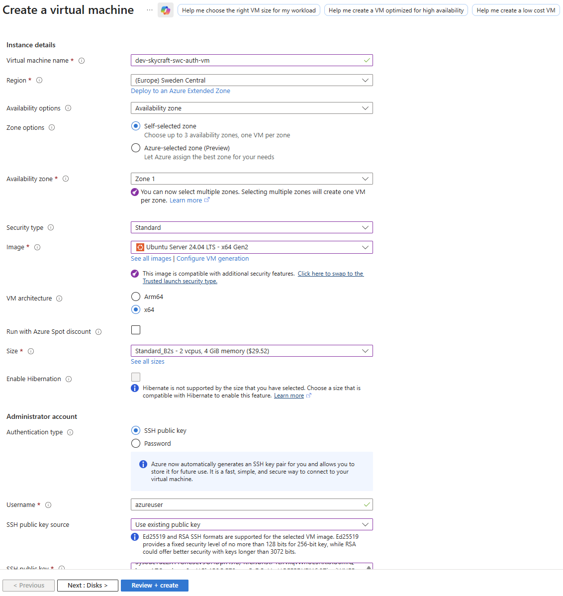

**Expected Result**: Basics tab completed with Ubuntu 22.04 and SSH key configured.

4. Click **Next: Disks**

### Step 3.2.3: Configure Authserver Disks

**Disks tab**:

| Field          | Value                                        |
| -------------- | -------------------------------------------- |
| OS disk size   | **Default (30 GiB)**                         |
| OS disk type   | **Standard SSD (locally-redundant storage)** |
| Delete with VM | ✅ Checked                                   |
| Key management | Platform-managed key                         |

**Why Standard SSD for Development?**

- Cost-effective for non-production workloads (~50% cheaper than Premium SSD)
- Adequate performance for development and testing
- For production, consider upgrading to Premium SSD for lower latency

5. Click **Next: Networking**

### Step 3.2.4: Configure Authserver Networking

**Networking tab**:

| Field                         | Value                            |
| ----------------------------- | -------------------------------- |
| Virtual network               | `dev-skycraft-swc-vnet`          |
| Subnet                        | **AuthSubnet (10.1.1.0/24)**     |
| Public IP                     | **None**                         |
| NIC network security group    | **None** (NSG already on subnet) |
| Delete NIC when VM is deleted | ✅ Checked                       |
| Load balancing                | **Yes**                          |

**Load balancing options**:

| Field                  | Value                         |
| ---------------------- | ----------------------------- |
| Load balancing options | **Azure load balancer**       |
| Select a load balancer | `dev-skycraft-swc-lb`         |
| Select a backend pool  | `dev-skycraft-swc-lb-be-auth` |

6. Click **Next: Management**

**Expected Result**: VM configured in AuthSubnet, no public IP, connected to load balancer backend pool.

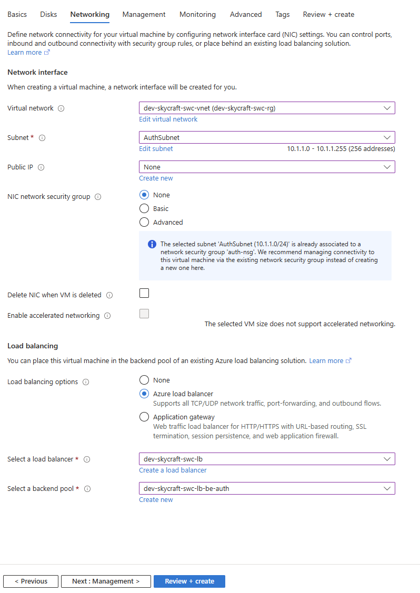

### Step 3.2.5: Configure Authserver Management

**Management tab**:

| Field                       | Value                                            |
| --------------------------- | ------------------------------------------------ |
| Enable basic plan for free  | ✅ Checked (or uncheck if already have Defender) |
| Identity                    | ✅ Enable system assigned managed identity       |
| Microsoft Entra ID          | ❌ Unchecked                                     |
| Auto-shutdown               | ❌ Disabled (for dev, you may enable)            |
| Backup                      | ❌ Unchecked                                     |
| Enable periodic assesment   | ❌ Unchecked                                     |
| Patch orchestration options | ✅ Image default                                 |

7. Click **Next: Monitoring**

**Monitoring tab**:

| Field                          | Value         |
| ------------------------------ | ------------- |
| Alerts                         | Leave default |
| Boot diagnostics               | Disable       |
| OS guest diagnostics           | Leave default |
| Application health monitoringh | Leave default |

8. Click **Next: Advanced** (leave defaults)
9. Click **Next: Tags**

### Step 3.2.6: Add Tags to Authserver VM

**Tags tab**:

| Name        | Value       |
| ----------- | ----------- |
| Project     | SkyCraft    |
| Environment | Development |
| CostCenter  | MSDN        |
| Role        | Authserver  |
| ManagedBy   | SkyCraft    |

10. Click **Review + create**
11. Review the configuration summary
12. Click **Create**

**Expected Result**:

- Deployment starts (takes 2-5 minutes)
- VM `dev-skycraft-swc-auth-vm` created in Zone 1
- Connected to AuthSubnet with no public IP
- Added to load balancer backend pool

### Step 3.2.7: Verify Authserver VM Deployment

1. Wait for deployment to complete
2. Click **Go to resource**
3. Verify the following in the **Overview** blade:

| Property               | Expected Value                   |
| ---------------------- | -------------------------------- |
| Status                 | Running                          |
| Location               | Sweden Central                   |
| Size                   | Standard_B2s                     |
| Availability zone      | 1                                |
| Public IP address      | None                             |
| Virtual network/subnet | dev-skycraft-swc-vnet/AuthSubnet |

4. Click **Networking** in the left menu
5. Verify the private IP address is in the 10.1.1.x range

**Expected Result**: VM running with private IP in AuthSubnet range.

---

## 📖 Section 3: Create Worldserver Virtual Machine (40 minutes)

### Step 3.2.8: Create Worldserver VM

Repeat the VM creation process for the Worldserver:

1. Navigate to **Virtual machines** → **+ Create** → **Azure virtual machine**

**Basics tab**:

| Field                | Value                                   |
| -------------------- | --------------------------------------- |
| Resource group       | `dev-skycraft-swc-rg`                   |
| Virtual machine name | `dev-skycraft-swc-world-vm`             |
| Region               | **Sweden Central**                      |
| Availability options | **Availability zone**                   |
| Availability zone    | **Zone 2** (different from Authserver!) |
| Image                | **Ubuntu Server 22.04 LTS - x64 Gen2**  |
| Size                 | **Standard_B2s**                        |
| Authentication type  | **SSH public key**                      |
| Username             | `azureuser`                             |
| SSH public key       | [Same public key as Authserver]         |
| Public inbound ports | **None**                                |

> [!NOTE]
> We are using the same ssh key for simplicity. Best practice is to use different keys for different VMs.

### Step 3.2.9: Configure Worldserver Disks

**Disks tab**:

| Field          | Value            |
| -------------- | ---------------- |
| OS disk type   | **Standard SSD** |
| Delete with VM | ✅ Checked       |

2. Click **Next: Networking**

### Step 3.2.10: Configure Worldserver Networking

**Networking tab**:

| Field                      | Value                          |
| -------------------------- | ------------------------------ |
| Virtual network            | `dev-skycraft-swc-vnet`        |
| Subnet                     | **WorldSubnet (10.1.2.0/24)**  |
| Public IP                  | **None**                       |
| NIC network security group | **None**                       |
| Load balancing             | **Yes**                        |
| Select a load balancer     | `dev-skycraft-swc-lb`          |
| Select a backend pool      | `dev-skycraft-swc-lb-be-world` |

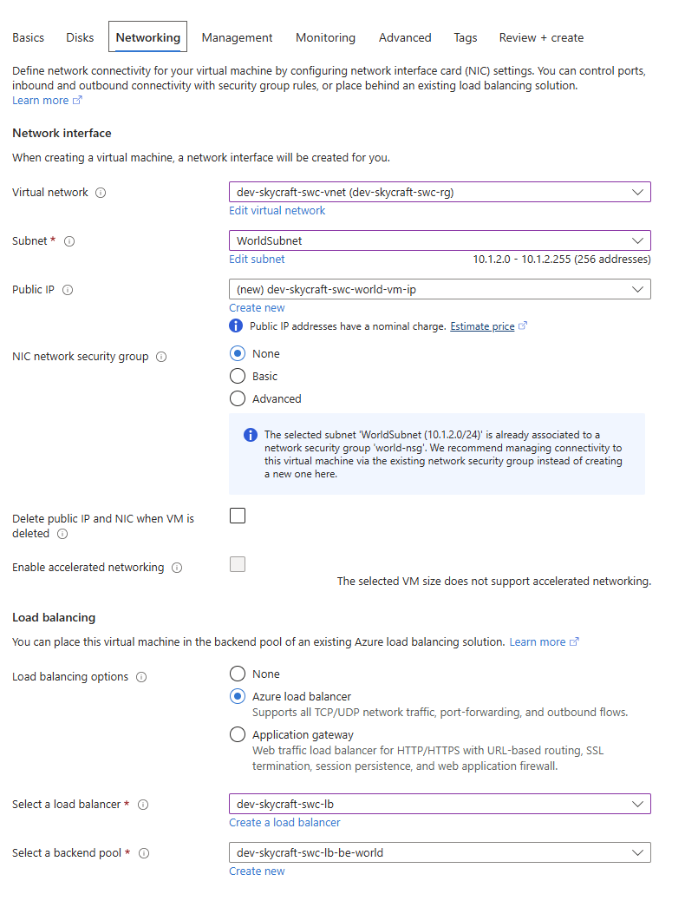

### Step 3.2.10: Configure Worldserver Management

**Management tab**:

| Field                       | Value                                            |
| --------------------------- | ------------------------------------------------ |
| Enable basic plan for free  | ✅ Checked (or uncheck if already have Defender) |
| Identity                    | ✅ Enable system assigned managed identity       |
| Microsoft Entra ID          | ❌ Unchecked                                     |
| Auto-shutdown               | ❌ Disabled (for dev, you may enable)            |
| Backup                      | ❌ Unchecked                                     |
| Enable periodic assesment   | ❌ Unchecked                                     |
| Patch orchestration options | ✅ Image default                                 |

**Monitoring tab**:

| Field                          | Value         |
| ------------------------------ | ------------- |
| Alerts                         | Leave default |
| Boot diagnostics               | Disable       |
| OS guest diagnostics           | Leave default |
| Application health monitoringh | Leave default |

### Step 3.2.11: Configure Tags and Create Worldserver

**Tags tab**:

| Name        | Value       |
| ----------- | ----------- |
| Project     | SkyCraft    |
| Environment | Development |
| CostCenter  | MSDN        |
| Role        | Worldserver |
| ManagedBy   | SkyCraft    |

3. Click **Review + create** → **Create**

**Expected Result**:

- VM `dev-skycraft-swc-world-vm` created in Zone 2
- Connected to WorldSubnet
- Added to load balancer backend pool for port 8085

### Step 3.2.12: Verify Both VMs

1. Navigate to **Virtual machines**
2. Verify both VMs are listed and running:

| VM Name                   | Zone | Subnet      | Size         | Status  |
| ------------------------- | ---- | ----------- | ------------ | ------- |
| dev-skycraft-swc-auth-vm  | 1    | AuthSubnet  | Standard_B2s | Running |
| dev-skycraft-swc-world-vm | 2    | WorldSubnet | Standard_B2s | Running |

3. Navigate to **Load balancers** → `dev-skycraft-swc-lb` → **Backend pools**
4. Verify both backend pools have VMs:
   - `dev-skycraft-swc-lb-be-auth`: 1 VM
   - `dev-skycraft-swc-lb-be-world`: 1 VM

**Expected Result**: Both VMs running in different availability zones, connected to respective load balancer backend pools.

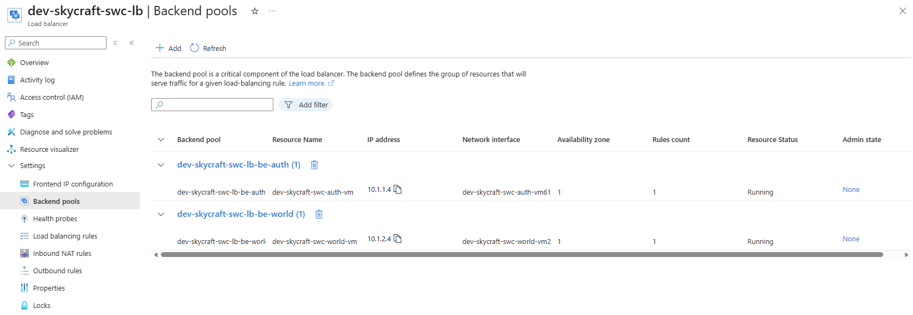

---

## 📖 Section 4: Configure Managed Data Disks (30 minutes)

### Why Data Disks?

The Worldserver VM needs additional storage for:

- MySQL database files
- Game world data
- Logs and backups

**Best Practice**: Keep database storage on a separate disk from the OS disk for:

- Better performance (dedicated I/O)
- Independent backup and snapshot capability
- Ability to resize without OS changes
- Can detach and attach to different VM if needed

### Step 3.2.13: Add Data Disk to Worldserver VM

1. Navigate to **Virtual machines** → `dev-skycraft-swc-world-vm`
2. In the left menu, click **Disks**
3. Click **+ Create and attach a new disk**

**Data disk configuration**:

| Field              | Value                                        |
| ------------------ | -------------------------------------------- |
| LUN                | 0                                            |
| Disk name          | `dev-skycraft-swc-world-vm-data`             |
| Storage type       | **Standard SSD (locally-redundant storage)** |
| Size               | **64 GiB** (E6)                              |
| Encryption         | Platform-managed key                         |
| Enable shared disk | ❌ No                                        |

4. Click **Save**

**Expected Result**:

- Data disk creation starts
- Disk appears in the Data disks list with status "Attached"
- Total: 1 OS disk + 1 Data disk

### Step 3.2.14: Initialize Data Disk Inside VM

The data disk is attached but not yet formatted. You need to connect to the VM via Azure Bastion and initialize it.

**Connect via Azure Bastion:**

1. Navigate to **Virtual machines** → `dev-skycraft-swc-world-vm`
2. Click **Connect** in the top menu
3. Select **Connect via Bastion** (or **Bastion** tab)
4. If prompted, click **Use Bastion**
5. Configure the connection:

| Field               | Value                                                                  |
| ------------------- | ---------------------------------------------------------------------- |
| Authentication Type | **SSH Private Key from Local File**                                    |
| Username            | `azureuser`                                                            |
| Local File          | Browse to your private key file (`skycraft-dev` or `skycraft-dev.pem`) |

6. Click **Connect**

> [!TIP]
>
> - Ensure your browser allows pop-ups from Azure Portal
> - The SSH session opens in a new browser tab
> - If connection fails, verify: (1) VM is running, (2) VNet peering is connected, (3) NSG allows SSH from 10.0.0.0/26

**Connection Flow Visualization:**

```
You (Browser) → Azure Portal → Bastion (10.0.0.x) → Peering → WorldServer (10.1.2.x)
```

7. Once connected, run these commands to initialize the disk:

```bash
# List attached disks
lsblk

# Expected output:
# NAME    MAJ:MIN RM  SIZE RO TYPE MOUNTPOINT
# sda       8:0    0   30G  0 disk
# ├─sda1    8:1    0 29.9G  0 part /
# sdb       8:16   0    4G  0 disk
# └─sdb1    8:17   0    4G  0 part /mnt
# sdc       8:32   0   64G  0 disk  <-- This is the new data disk

# Partition the disk (use the correct device, likely /dev/sdc)
sudo fdisk /dev/sdc

# In fdisk:
# Type: n (new partition)
# Type: p (primary)
# Type: 1 (partition number)
# Press Enter (default first sector)
# Press Enter (default last sector)
# Type: w (write changes)

# Format the partition with ext4
sudo mkfs.ext4 /dev/sdc1

# Create mount point
sudo mkdir /data

# Mount the disk
sudo mount /dev/sdc1 /data

# Get UUID for persistent mount
sudo blkid /dev/sdc1
# Copy the UUID value shown

# Add to fstab for persistent mount
echo "UUID=<YOUR-UUID-HERE> /data ext4 defaults,nofail 0 2" | sudo tee -a /etc/fstab

# Verify mount
df -h /data
# Expected: /dev/sdc1  64G  24K  61G   1% /data
```

**Expected Result**:

- Data disk formatted with ext4
- Mounted at `/data`
- Configured for persistent mount after reboot

### Step 3.2.15: Verify Data Disk Configuration

```bash
# Verify disk is mounted
df -h

# Verify fstab entry
cat /etc/fstab | grep data

# Test write access
sudo touch /data/test-file
ls -la /data/

# Exit Bastion session
exit
```

**Expected Result**: 64 GB data disk mounted at `/data` and ready for MySQL installation.

---

## 📖 Section 5: Configure Azure Disk Encryption (35 minutes)

### What is Azure Disk Encryption?

**Azure Disk Encryption (ADE)** encrypts OS and data disks using:

- **Linux**: dm-crypt subsystem
- **Windows**: BitLocker

**Benefits**:

- Data-at-rest encryption
- Keys stored in Azure Key Vault
- Meets security and compliance requirements
- Transparent to applications

**For SkyCraft**: Encrypt all disks to protect player data and game configurations.

### Step 3.2.16: Create Azure Key Vault for Encryption Keys

1. Navigate to **Key vaults** → **+ Create**

**Basics tab**:

| Field          | Value                                   |
| -------------- | --------------------------------------- |
| Subscription   | [Your subscription]                     |
| Resource group | `dev-skycraft-swc-rg`                   |
| Key vault name | `dev-skycraft-swc-kv` (globally unique) |
| Region         | **Sweden Central**                      |
| Pricing tier   | **Standard**                            |

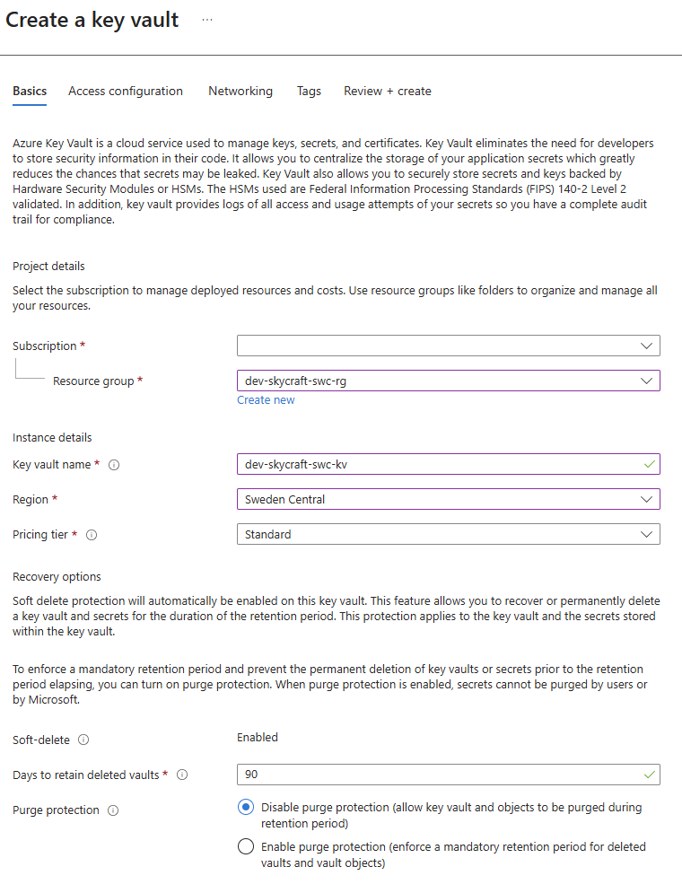

2. Click **Next: Access configuration**

**Access configuration**:

| Field                                       | Value                                             |
| ------------------------------------------- | ------------------------------------------------- |
| Permission model                            | **Azure role-based access control (recommended)** |
| Enable access to:                           |                                                   |
| Azure Virtual Machines for deployment       | ✅ Enabled                                        |
| Azure Disk Encryption for volume encryption | ✅ Enabled                                        |

3. Click **Next: Networking**

**Networking**:

| Field                | Value                                     |
| -------------------- | ----------------------------------------- |
| Network connectivity | **Allow public access from all networks** |

> [!NOTE]
> For production, you should restrict access to specific VNets. For this lab, we allow public access for simplicity.

4. Click **Next: Tags**

**Tags**:

| Name        | Value       |
| ----------- | ----------- |
| Project     | SkyCraft    |
| Environment | Development |
| CostCenter  | MSDN        |

5. Click **Review + create** → **Create**

**Expected Result**: Key vault `dev-skycraft-swc-kv` created with disk encryption enabled.

### Step 3.2.17: Resize VMs for Azure Disk Encryption (step takes about 15-30 mins)

> [!WARNING]
> **Deprecation Notice**: Azure Disk Encryption (ADE) is scheduled for retirement on **September 15, 2028**. Microsoft recommends using **Encryption at Host** for new deployments. However, ADE is still part of the **AZ-104 exam** curriculum, so we cover it here for certification preparation. See [Step 3.2.20](#step-3220-optional-enable-encryption-at-host-best-practice) for the modern approach.

Azure Disk Encryption for Linux VMs requires **8 GB RAM minimum** for OS disk encryption. Our `Standard_B2s` VMs have only 4 GB, so we need to temporarily resize them.

> [!IMPORTANT]
> **Memory Requirement**: ADE for Linux requires 8 GB RAM. The encryption process uses significant memory to encrypt the OS volume.

1. Open **Azure Cloud Shell** (Bash) from the Azure Portal

2. Resize Authserver VM to 8 GB RAM:

```azurecli
# Deallocate the VM (required for resize)
az vm deallocate \
  --name dev-skycraft-swc-auth-vm \
  --resource-group dev-skycraft-swc-rg

# Resize to Standard_B2ms (8 GB RAM)
az vm resize \
  --name dev-skycraft-swc-auth-vm \
  --resource-group dev-skycraft-swc-rg \
  --size Standard_B2ms

# Start the VM
az vm start \
  --name dev-skycraft-swc-auth-vm \
  --resource-group dev-skycraft-swc-rg
```

3. Resize Worldserver VM to 8 GB RAM:

```azurecli
# Deallocate the VM
az vm deallocate \
  --name dev-skycraft-swc-world-vm \
  --resource-group dev-skycraft-swc-rg

# Resize to Standard_B2ms (8 GB RAM)
az vm resize \
  --name dev-skycraft-swc-world-vm \
  --resource-group dev-skycraft-swc-rg \
  --size Standard_B2ms

# Start the VM
az vm start \
  --name dev-skycraft-swc-world-vm \
  --resource-group dev-skycraft-swc-rg
```

**Expected Result**: Both VMs running with `Standard_B2ms` size (2 vCPUs, 8 GB RAM).

### Step 3.2.18: Enable Azure Disk Encryption on Both VMs

Azure Disk Encryption for Linux VMs must be enabled via **Azure CLI** or **PowerShell** (not available in Azure Portal for Linux).

1. Enable encryption on Authserver:

```azurecli
# Enable Azure Disk Encryption on Authserver VM
az vm encryption enable \
  --name dev-skycraft-swc-auth-vm \
  --resource-group dev-skycraft-swc-rg \
  --disk-encryption-keyvault dev-skycraft-swc-kv \
  --volume-type All
```

2. Wait for encryption to complete (15-30 minutes), then enable on Worldserver:

```azurecli
# Enable Azure Disk Encryption on Worldserver VM (includes data disk)
az vm encryption enable \
  --name dev-skycraft-swc-world-vm \
  --resource-group dev-skycraft-swc-rg \
  --disk-encryption-keyvault dev-skycraft-swc-kv \
  --volume-type All
```

**Command Parameters Explained**:

| Parameter                    | Value                 | Description                           |
| ---------------------------- | --------------------- | ------------------------------------- |
| `--name`                     | VM name               | Target VM to encrypt                  |
| `--resource-group`           | `dev-skycraft-swc-rg` | Resource group containing the VM      |
| `--disk-encryption-keyvault` | `dev-skycraft-swc-kv` | Key Vault for storing encryption keys |
| `--volume-type`              | `All`                 | Encrypt both OS and data disks        |

> [!CAUTION]
> Do not interrupt the encryption process. The VM may be unavailable during encryption. Plan encryption during maintenance windows for production systems.

### Step 3.2.19: Verify Disk Encryption and Resize Back

1. Check encryption status for both VMs:

```azurecli
# Check Authserver encryption status
az vm encryption show \
  --name dev-skycraft-swc-auth-vm \
  --resource-group dev-skycraft-swc-rg

# Check Worldserver encryption status
az vm encryption show \
  --name dev-skycraft-swc-world-vm \
  --resource-group dev-skycraft-swc-rg
```

**Expected Output**:

```
Status                  Message
----------------------  ------------------------------------
Provisioning succeeded  Encryption succeeded for all volumes
```

> [!TIP]
> The detailed encryption status is in the JSON output. Use `--output json` to see:
>
> - `disks[].statuses[].code` shows `EncryptionState/encrypted`
> - `substatus[].message` shows `{"os": "Encrypted", "data": "Encrypted"}`

2. **(Optional)** Resize VMs back to `Standard_B2s` to save costs:

```azurecli
# Resize Authserver back to B2s
az vm deallocate --name dev-skycraft-swc-auth-vm --resource-group dev-skycraft-swc-rg
az vm resize --name dev-skycraft-swc-auth-vm --resource-group dev-skycraft-swc-rg --size Standard_B2s
az vm start --name dev-skycraft-swc-auth-vm --resource-group dev-skycraft-swc-rg

# Resize Worldserver back to B2s
az vm deallocate --name dev-skycraft-swc-world-vm --resource-group dev-skycraft-swc-rg
az vm resize --name dev-skycraft-swc-world-vm --resource-group dev-skycraft-swc-rg --size Standard_B2s
az vm start --name dev-skycraft-swc-world-vm --resource-group dev-skycraft-swc-rg
```

> [!TIP]
> Once encryption is enabled, you can resize back to a smaller VM. The encrypted disks will continue to work.

**Expected Result**: All disks encrypted, VMs optionally resized back to `Standard_B2s`.

---

### Step 3.2.20: (Optional) Enable Encryption at Host (Best Practice)

**Encryption at Host** is the modern, Microsoft-recommended approach for disk encryption. Unlike ADE, it:

- Encrypts data at the VM host level (before it reaches storage)
- Works with any VM size (no 8 GB RAM requirement)
- Covers temp disks and disk caches
- Requires no Key Vault configuration

> [!NOTE]
> **Feature Registration Required**: Encryption at Host must be registered on your subscription before use.

1. Register the EncryptionAtHost feature (one-time per subscription):

```azurecli
# Register the feature
az feature register \
  --name EncryptionAtHost \
  --namespace Microsoft.Compute

# Check registration status (wait until "Registered")
az feature show \
  --name EncryptionAtHost \
  --namespace Microsoft.Compute \
  --query "properties.state" \
  --output tsv

# Propagate the registration
az provider register --namespace Microsoft.Compute
```

2. Enable Encryption at Host on a VM:

```azurecli
# Deallocate VM first
az vm deallocate \
  --name dev-skycraft-swc-auth-vm \
  --resource-group dev-skycraft-swc-rg

# Enable Encryption at Host
az vm update \
  --name dev-skycraft-swc-auth-vm \
  --resource-group dev-skycraft-swc-rg \
  --set securityProfile.encryptionAtHost=true

# Start VM
az vm start \
  --name dev-skycraft-swc-auth-vm \
  --resource-group dev-skycraft-swc-rg
```

3. Verify Encryption at Host is enabled:

```azurecli
az vm show \
  --name dev-skycraft-swc-auth-vm \
  --resource-group dev-skycraft-swc-rg \
  --query "securityProfile.encryptionAtHost" \
  --output tsv
```

**Expected Output**: `true`

**Comparison: ADE vs Encryption at Host**:

| Feature                  | Azure Disk Encryption | Encryption at Host      |
| ------------------------ | --------------------- | ----------------------- |
| **Encryption location**  | Disk level (guest OS) | Host level (hypervisor) |
| **RAM requirement**      | 8 GB minimum          | None                    |
| **Key Vault required**   | Yes                   | No                      |
| **Temp disk encrypted**  | No                    | Yes                     |
| **Disk cache encrypted** | No                    | Yes                     |
| **Future support**       | Retiring Sept 2028    | Recommended             |

2. You can also verify in Azure Portal:
   - Navigate to **Virtual machines** → Select VM → **Disks**
   - Check the **Encryption** column shows encryption type

**Expected Result**: All disks show encryption status as enabled/encrypted.

---

## 📖 Section 6: Deploy VMs to Availability Zones (25 minutes)

### Understanding Availability Zones vs Availability Sets

| Feature                  | Availability Zones                  | Availability Sets               |
| ------------------------ | ----------------------------------- | ------------------------------- |
| **Isolation**            | Separate datacenters                | Same datacenter, separate racks |
| **SLA**                  | 99.99%                              | 99.95%                          |
| **Protection**           | Datacenter failure                  | Rack/power failure              |
| **Network latency**      | ~2ms between zones                  | Sub-millisecond                 |
| **Cost**                 | Same as standard                    | Same as standard                |
| **Cross-zone resources** | Standard LB, Zone-redundant storage | N/A                             |

**For SkyCraft**: We use **Availability Zones** for maximum fault tolerance.

### Step 3.2.20: Verify Availability Zone Distribution

Your VMs should already be in different zones:

```azurecli
# List VMs with their availability zones
az vm list \
  --resource-group dev-skycraft-swc-rg \
  --query "[].{Name:name,Zone:zones[0],Size:hardwareProfile.vmSize}" \
  --output table

# Expected output:
# Name                        Zone  Size
# --------------------------  ----  -------------
# dev-skycraft-swc-auth-vm    1     Standard_B2s
# dev-skycraft-swc-world-vm   2     Standard_B2s
```

**Expected Result**: VMs are distributed across Zone 1 and Zone 2.

### Step 3.2.21: Understand Zone-Redundant Load Balancing

Your Standard Load Balancer automatically distributes traffic across zones:

1. Navigate to **Load balancers** → `dev-skycraft-swc-lb`
2. Click **Overview**
3. Note: Standard SKU load balancers are **zone-redundant by default**
4. Click **Frontend IP configuration**
5. The public IP is zone-redundant, meaning:
   - If Zone 1 fails, traffic routes to Zone 2
   - Players experience no interruption

**Expected Result**: Load balancer configured for zone-redundant access.

### Step 3.2.22: Test High Availability (Conceptual)

In a real scenario, you would test HA by:

1. **Simulating zone failure**: Stop one VM
2. **Verifying traffic routing**: Load balancer routes to remaining VM
3. **Restoring service**: Start stopped VM, verify it rejoins backend pool

For this lab, we'll document the expected behavior:

| Scenario               | Expected Behavior                             |
| ---------------------- | --------------------------------------------- |
| Zone 1 fails           | Authserver unavailable, Worldserver continues |
| Zone 2 fails           | Worldserver unavailable, Authserver continues |
| Both zones operational | Full redundancy, load balanced                |

**Note**: For true game server HA, you would deploy multiple instances of each server type across different zones.

---

## 📖 Section 7: Manage VM Sizes (25 minutes)

### Step 3.2.23: View Available VM Sizes

Before resizing, check available sizes:

```azurecli
# List available B-series sizes in Sweden Central
az vm list-skus \
  --location swedencentral \
  --size Standard_B \
  --resource-type virtualMachines \
  --query "[].{Name:name,vCPUs:capabilities[?name=='vCPUs'].value|[0],Memory:capabilities[?name=='MemoryGB'].value|[0]}" \
  --output table

# Expected output (partial):
# Name            vCPUs    Memory
# --------------- -------  --------
# Standard_B1ls   1        0.5
# Standard_B1s    1        1
# Standard_B2s    2        4
# Standard_B2ms   2        8
# Standard_B4ms   4        16
```

### Step 3.2.24: Resize Worldserver VM (Example)

If player load increases, you might need to resize:

1. Navigate to **Virtual machines** → `dev-skycraft-swc-world-vm`
2. Click **Stop** to deallocate the VM (required for most resizes)

> [!WARNING]
> Resizing requires stopping the VM in most cases. Plan for downtime or use availability sets/zones with multiple instances.

3. Wait for VM to fully stop (Status: Stopped (deallocated))
4. In the left menu, click **Size**
5. Search for `Standard_B2ms` (upgrade to 8 GB RAM)
6. Select **Standard_B2ms**
7. Click **Resize**
8. Wait for resize to complete (1-2 minutes)
9. Click **Start** to restart the VM

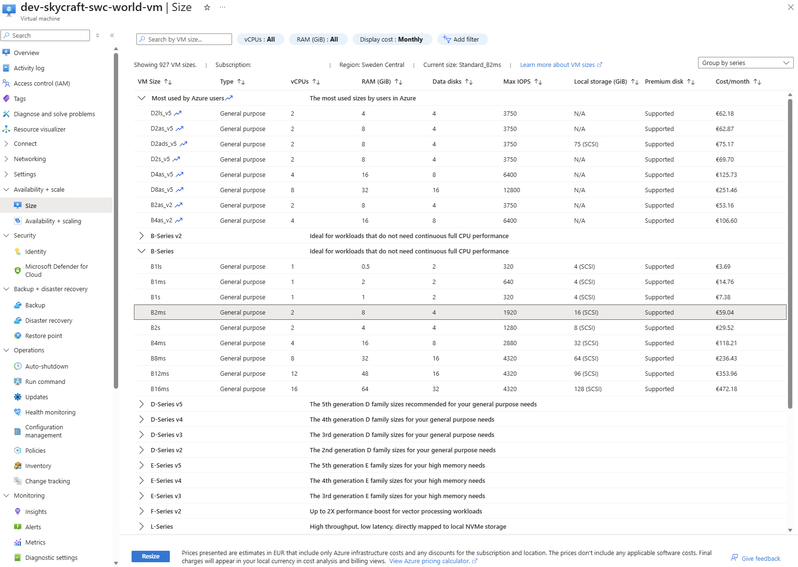

**Expected Result**:

- VM resized from Standard_B2s (4 GB) to Standard_B2ms (8 GB)
- All data preserved
- Network configuration retained

### Step 3.2.25: Resize Back for Cost Optimization (Optional)

For this lab, resize back to B2s to minimize costs:

1. Stop the VM again
2. Resize to **Standard_B2s**
3. Start the VM

**Best Practice for Production**:

- Monitor CPU and memory usage over time
- Use Azure Advisor for right-sizing recommendations
- Consider Reserved Instances for predictable workloads (up to 72% savings)

### Step 3.2.26: Understand VM Size Constraints

Not all sizes are available in all zones or regions:

```azurecli
# Check if specific size is available in zone
az vm list-skus \
  --location swedencentral \
  --size Standard_D4s_v3 \
  --query "[].{Name:name,Zones:locationInfo[0].zones}" \
  --output table
```

| Constraint         | Resolution                             |
| ------------------ | -------------------------------------- |
| Size not in zone   | Deploy in different zone               |
| Size not in region | Choose different region or size family |
| Quota exceeded     | Request quota increase                 |
| Disk constraints   | Some sizes don't support Premium SSD   |

---

## 📖 Section 8: Create Virtual Machine Scale Set (30 minutes)

### What are Virtual Machine Scale Sets (VMSS)?

**VM Scale Sets** allow you to deploy and manage a group of identical VMs with:

- **Auto-scaling**: Add/remove instances based on demand
- **Load balancing**: Automatic integration with Azure Load Balancer
- **High availability**: Spread across availability zones
- **Consistent configuration**: All instances use same image and settings

### When to Use VMSS for SkyCraft

| Use Case             | Individual VMs        | VM Scale Sets      |
| -------------------- | --------------------- | ------------------ |
| **Development**      | ✅ Simpler, 1-2 VMs   | ❌ Overkill        |
| **Small Production** | ✅ 2-5 VMs            | ❌ Not needed      |
| **Large Production** | ❌ Complex management | ✅ Auto-scaling    |
| **Variable Load**    | ❌ Manual scaling     | ✅ Auto-scaling    |
| **Event-based**      | ❌ Slow response      | ✅ Rapid scale-out |

### Step 3.2.27: Create a Virtual Machine Scale Set

1. In Azure Portal, search for **Virtual machine scale sets** and click **+ Create**

**Basics tab - Orchestration**:

| Field                          | Value                          |
| ------------------------------ | ------------------------------ |
| Subscription                   | Your subscription              |
| Resource group                 | `prod-skycraft-swc-rg`         |
| Virtual machine scale set name | `prod-skycraft-swc-world-vmss` |
| Region                         | **Sweden Central**             |
| Availability zone              | **Zones 1, 2, 3** (select all) |
| Orchestration mode             | **Uniform**                    |
| Security type                  | **Standard**                   |

**Basics tab - Scaling**:

| Field          | Value           |
| -------------- | --------------- |
| Scaling mode   | **Autoscaling** |
| Instance count | **2**           |

Click **Configure scaling options** to set autoscale rules:

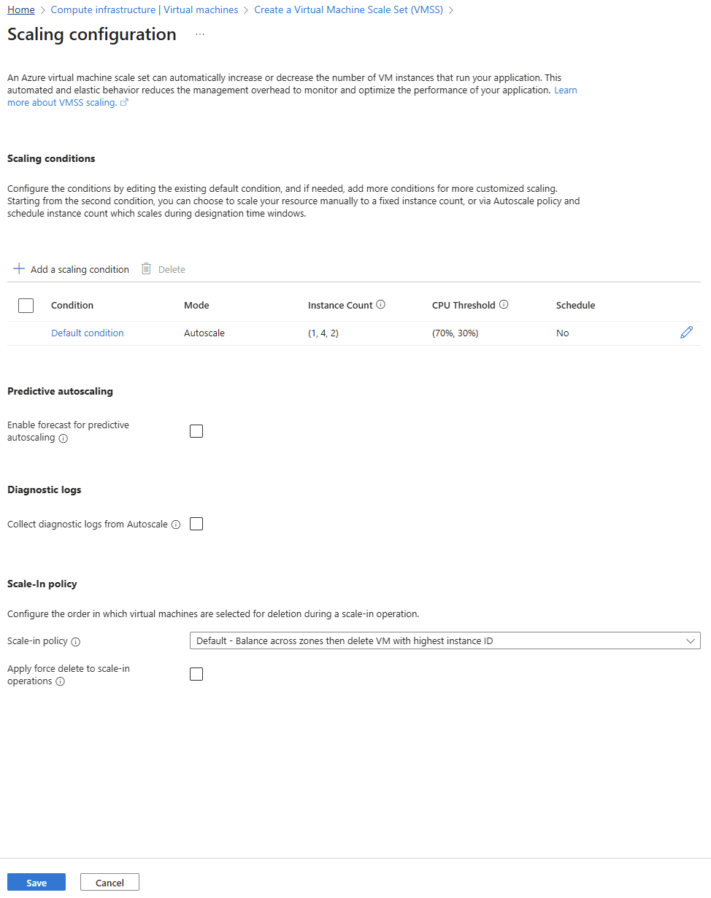

1. The **Default condition** is already created. Click **Edit** (pencil icon) to configure it:

**Edit Condition - Instance limits**:

| Field   | Value |
| ------- | ----- |
| Minimum | **1** |
| Maximum | **4** |

**Edit Condition - Scale out**:

| Field                      | Value  |
| -------------------------- | ------ |
| CPU threshold greater than | **70** |
| Increase instance count by | **1**  |

**Edit Condition - Scale in**:

| Field                      | Value  |
| -------------------------- | ------ |
| CPU threshold less than    | **30** |
| Decrease instance count by | **1**  |

**Query duration**:

| Field   | Value |
| ------- | ----- |
| Minutes | **5** |

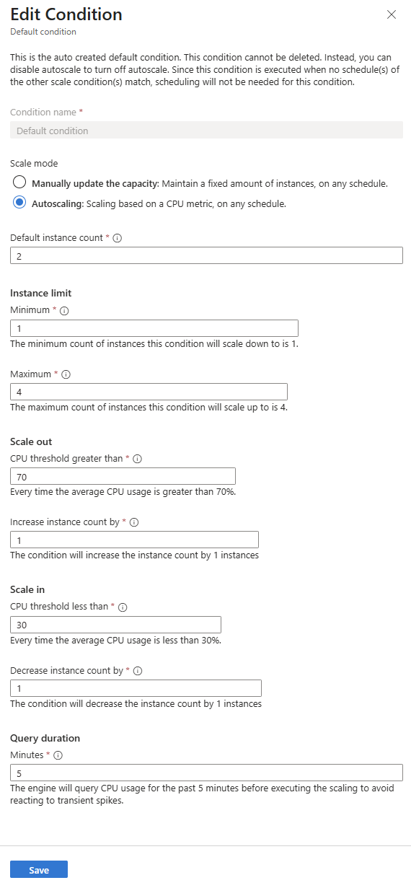

2. Click **Save** to close the condition editor
3. Click **Save** to save the scaling configuration

**Basics tab - Instance details**:

| Field           | Value                                      |
| --------------- | ------------------------------------------ |
| Image           | **Ubuntu Server 24.04 LTS - x64 Gen2**     |
| VM architecture | **x64**                                    |
| Size            | **Standard_B1s** (1 vCPU, 1 GB - for cost) |

**Basics tab - Administrator account**:

| Field                 | Value                             |
| --------------------- | --------------------------------- |
| Authentication type   | **SSH public key**                |
| Username              | `azureuser`                       |
| SSH public key source | **Use existing public key**       |
| SSH public key        | Paste your `skycraft-dev.pub` key |

2. Click **Next: Spot**

**Spot tab**:

- Leave defaults (we're not using Spot instances for this lab)

3. Click **Next: Disks**

**Disks tab**:

| Field              | Value            |
| ------------------ | ---------------- |
| Encryption at host | ✅ Checked       |
| OS disk type       | **Standard SSD** |

4. Click **Next: Networking**

**Networking tab**:

| Field                      | Value                    |
| -------------------------- | ------------------------ |
| Virtual network            | `prod-skycraft-swc-vnet` |
| Network interface - Subnet | `WorldSubnet`            |
| Public IP address          | **Disabled**             |

**Load balancing**:

| Field                  | Value                           |
| ---------------------- | ------------------------------- |
| Load balancing options | **Azure load balancer**         |
| Select a load balancer | `prod-skycraft-swc-lb`          |
| Select a backend pool  | `prod-skycraft-swc-lb-be-world` |

> [!NOTE]
> The VMSS instances will be added to the load balancer backend pool for automatic traffic distribution.

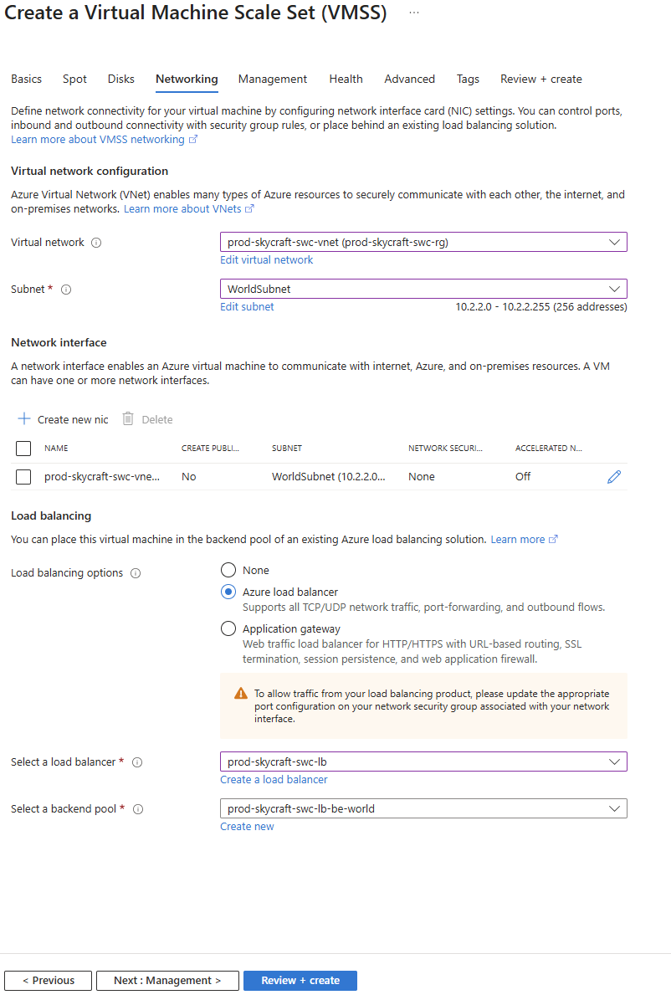

5. Click **Next: Management**

**Management tab**:

| Field          | Value      |
| -------------- | ---------- |
| Upgrade policy | **Manual** |

6. Click **Next: Health**

**Health tab**:

- Leave defaults

7. Click **Next: Advanced**

**Advanced tab**:

- Leave defaults

8. Click **Next: Tags**

**Tags**:

| Name        | Value      |
| ----------- | ---------- |
| Project     | SkyCraft   |
| Environment | Production |
| CostCenter  | MSDN       |

9. Click **Review + create** → **Create**

**Expected Result**: VMSS created with 2 initial instances across availability zones.

### Step 3.2.28: Verify VMSS Deployment

1. Navigate to **Virtual machine scale sets** → `prod-skycraft-swc-world-vmss`

2. Click **Instances** in the left menu

3. Verify you see 2 instances running in different zones:

```azurecli
# List VMSS instances
az vmss list-instances \
  --resource-group prod-skycraft-swc-rg \
  --name prod-skycraft-swc-world-vmss \
  --query "[].{Name:name,Zone:zones[0],State:provisioningState}" \
  --output table

# Expected output:
# Name                              Zone    State
# --------------------------------  ------  ---------
# prod-skycraft-swc-world-vmss_0    1       Succeeded
# prod-skycraft-swc-world-vmss_1    2       Succeeded
```

4. Click **Scaling** in the left menu to view autoscale configuration

5. Verify the scale-out and scale-in rules are configured

**Expected Result**: VMSS shows 2 running instances with autoscale configured.

### Step 3.2.29: Test Manual Scaling

1. In the VMSS blade, click **Scaling**

2. Click **Manual scale**

3. Change **Instance count** to `3`

4. Click **Save**

5. Click **Instances** to watch a new instance being created

6. Wait for the 3rd instance to reach **Running** state

7. Return to **Scaling** and scale back to **2** instances

**Expected Result**: VMSS successfully scales from 2 → 3 → 2 instances.

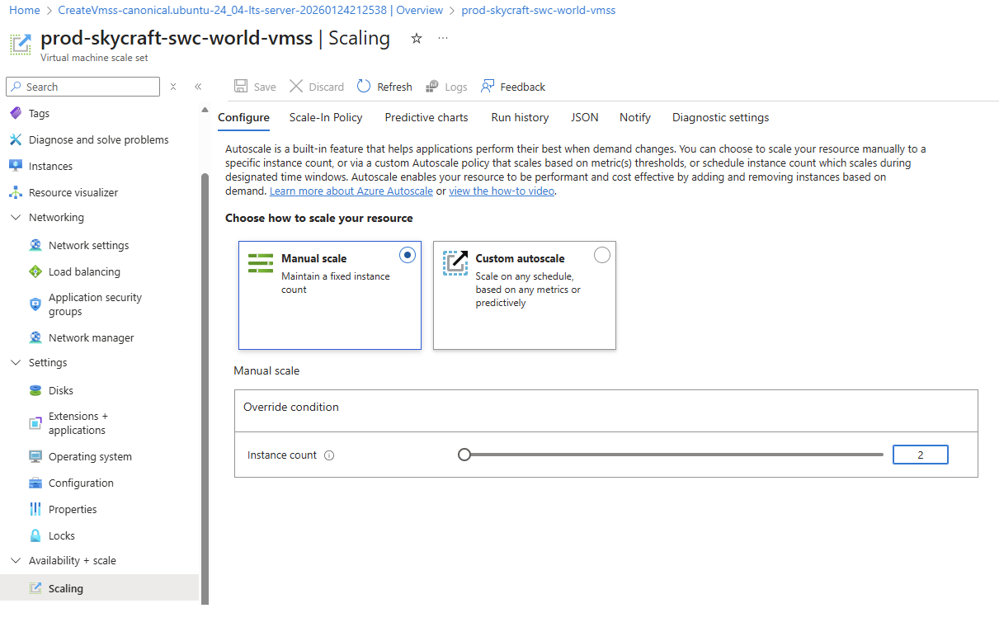

### Step 3.2.30: Connect to VMSS Instance via Bastion

1. In the VMSS blade, click **Instances**

2. Select an instance (e.g., `prod-skycraft-swc-world-vmss_0`)

3. Click **Connect** → **Bastion**

4. Enter credentials:
   - **Username**: `azureuser`
   - **Authentication Type**: SSH Private Key from Local File
   - Select your `skycraft-dev` private key file

5. Click **Connect**

**Expected Result**: Connected to VMSS instance via Bastion.

### Step 3.2.31: Cleanup - Delete VMSS (Important for Cost)

> [!IMPORTANT]
> VMSS instances incur costs. Delete the VMSS after completing this lab section to avoid unnecessary charges.

1. Navigate to **Virtual machine scale sets** → `prod-skycraft-swc-world-vmss`

2. Click **Delete**

3. Type the VMSS name to confirm: `prod-skycraft-swc-world-vmss`

4. Click **Delete**

**Or via Azure CLI**:

```azurecli
# Delete VMSS
az vmss delete \
  --resource-group prod-skycraft-swc-rg \
  --name prod-skycraft-swc-world-vmss \
  --no-wait
```

**Expected Result**: VMSS deleted. You've completed the VMSS hands-on section.

### VMSS vs AKS for Game Servers

For containerized game servers, Azure Kubernetes Service (AKS) is an alternative:

| Feature           | VMSS               | AKS                  |
| ----------------- | ------------------ | -------------------- |
| Complexity        | Lower              | Higher               |
| Container support | Via Docker on VMs  | Native               |
| Scaling speed     | Minutes            | Seconds              |
| Cost              | VM-based           | Pod-based            |
| Game server fit   | Traditional setups | Modern microservices |

**Recommendation for SkyCraft**: Use VMSS for simplicity. AzerothCore runs well on VMs.

---

## ✅ Lab Checklist

Quick verification before proceeding:

### Virtual Machines Created

- [ ] `dev-skycraft-swc-auth-vm` deployed in Zone 1
- [ ] `dev-skycraft-swc-world-vm` deployed in Zone 2
- [ ] Both VMs running Ubuntu 22.04 LTS
- [ ] Both VMs sized as Standard_B2s
- [ ] Both VMs have no public IP addresses

### Networking Configuration

- [ ] Authserver VM connected to AuthSubnet (10.1.1.0/24)
- [ ] Worldserver VM connected to WorldSubnet (10.1.2.0/24)
- [ ] Authserver added to load balancer backend pool (be-auth)
- [ ] Worldserver added to load balancer backend pool (be-world)
- [ ] SSH access verified via Azure Bastion

### Disk Configuration

- [ ] OS disks using Premium SSD
- [ ] Data disk (64 GB) attached to Worldserver VM
- [ ] Data disk mounted at /data inside VM
- [ ] Azure Disk Encryption enabled on all disks
- [ ] Key vault created for encryption keys

### Tags Applied

- [ ] Project = SkyCraft
- [ ] Environment = Development
- [ ] CostCenter = MSDN
- [ ] Role = Authserver/Worldserver

**For detailed verification**, see [lab-checklist-3.2.md](lab-checklist-3.2.md)

---

## 🎓 Knowledge Check

Test your understanding with these questions:

1. **What is the difference between Availability Zones and Availability Sets?**

   <details>
     <summary>**Click to see the answer**</summary>

   **Answer**:

   **Availability Zones**:
   - Physically separate datacenters within a region
   - Each zone has independent power, cooling, and networking
   - Provides 99.99% SLA
   - Protects against entire datacenter failures
   - ~2ms latency between zones

   **Availability Sets**:
   - Logical groupings within a single datacenter
   - VMs distributed across fault domains (racks) and update domains
   - Provides 99.95% SLA
   - Protects against rack-level failures and maintenance reboots
   - Sub-millisecond latency

   **When to use which**:
   - Use **Availability Zones** when you need highest availability and can tolerate 2ms latency
   - Use **Availability Sets** when zones aren't available or latency is critical
   - For SkyCraft, we use Zones because game servers tolerate 2ms easily

   </details>

2. **Why do we use separate data disks instead of storing database files on the OS disk?**

   <details>
     <summary>**Click to see the answer**</summary>

   **Answer**: Using separate data disks provides several advantages:

   **1. Performance Isolation**:
   - Dedicated I/O bandwidth for database operations
   - OS operations don't compete with database reads/writes
   - Can choose higher performance tier for data disk only

   **2. Independent Management**:
   - Resize data disk without affecting OS
   - Snapshot data disk separately for backup
   - Different retention policies for OS vs data

   **3. Disaster Recovery**:
   - Data disk can be detached and attached to new VM
   - If OS disk corrupts, data is preserved
   - Can restore data from snapshot to new VM

   **4. Cost Optimization**:
   - OS disk can be smaller (30 GB)
   - Data disk sized for actual data needs
   - Different performance tiers as needed

   **For SkyCraft**: MySQL database performance benefits from Premium SSD data disk with dedicated IOPS.

   </details>

3. **What happens when you resize a VM from Standard_B2s to Standard_D4s_v3?**

   <details>
     <summary>**Click to see the answer**</summary>

   **Answer**: Resizing a VM involves the following:

   **Process**:
   1. VM must be stopped (deallocated) for most size changes
   2. Azure moves VM to hardware with new specifications
   3. VM restarts with new size
   4. Public/private IPs are preserved (if static)
   5. Data disks remain attached

   **What Changes**:
   | Property | B2s | D4s_v3 |
   |----------|-----|--------|
   | vCPUs | 2 | 4 |
   | RAM | 4 GB | 16 GB |
   | Temp disk | 8 GB | 32 GB |
   | Max data disks | 4 | 8 |
   | Max NICs | 2 | 2 |
   | Cost | ~$30/month | ~$140/month |

   **What's Preserved**:
   - OS disk data and configuration
   - Data disk attachments
   - Network configuration
   - Azure Bastion access
   - Tags and metadata

   **Potential Issues**:
   - New size must be available in same zone
   - Applications need restart configuration
   - IP address might change (if dynamic)

   </details>

4. **Why do we encrypt disks with Azure Disk Encryption?**

   <details>
     <summary>**Click to see the answer**</summary>

   **Answer**: Azure Disk Encryption provides data-at-rest security:

   **Security Benefits**:
   - **Compliance**: Meet regulatory requirements (GDPR, PCI-DSS)
   - **Data protection**: Prevent unauthorized access to disk images
   - **Defense in depth**: Additional layer beyond OS-level encryption

   **How It Works**:
   - **Linux**: Uses dm-crypt subsystem
   - **Windows**: Uses BitLocker
   - **Key storage**: Keys in Azure Key Vault (customer-managed or platform-managed)
   - **Transparent**: Applications see unencrypted data normally

   **What's Protected**:
   - OS disk contents
   - Data disk contents
   - Temporary disks (not encrypted by ADE, use host encryption)

   **For SkyCraft**:
   - Player account data in database is encrypted at rest
   - Game configuration files are protected
   - Disk snapshots are also encrypted

   </details>

5. **How does Azure Bastion provide secure VM access?**

   <details>
     <summary>**Click to see the answer**</summary>

   **Answer**: Azure Bastion provides secure RDP/SSH without exposing VMs to internet:

   **How It Works**:

   ```
   Admin PC → HTTPS (443) → Azure Bastion → SSH (22) → VM
   (Internet)    (PaaS)        (Private IP)      (VNet)
   ```

   **Security Benefits**:
   1. **No public IP on VMs**: VMs have only private IPs
   2. **PaaS service**: No need to manage bastion VMs
   3. **TLS encryption**: Browser to Bastion is encrypted
   4. **Integrated with Azure AD**: Can use MFA
   5. **Session recording**: Audit logs available

   **Architecture in SkyCraft**:
   - Bastion deployed in Hub VNet (platform-skycraft-swc-vnet)
   - Peering allows access to Spoke VNets
   - AzureBastionSubnet has minimum /26 size
   - Standard SKU enables features like file copy

   **Comparison to Alternatives**:
   | Method | Security | Convenience | Cost |
   |--------|----------|-------------|------|
   | Public IP + NSG | Lower | High | Low |
   | Jump Box VM | Medium | Medium | Medium |
   | Azure Bastion | High | High | Higher |
   | VPN Gateway | Highest | Lower | Medium |

   </details>

6. **When should you use VM Scale Sets instead of individual VMs?**

   <details>
     <summary>**Click to see the answer**</summary>

   **Answer**: Use VMSS when you need auto-scaling and load distribution:

   **Use Individual VMs When**:
   - Fixed, predictable workload
   - 1-5 VMs needed
   - Simple deployment
   - Different configurations per VM
   - Stateful applications (databases)

   **Use VM Scale Sets When**:
   - Variable workload (auto-scale)
   - 5+ identical VMs needed
   - Need rapid scale-out
   - Stateless applications
   - Rolling updates required

   **VMSS Features**:
   - Automatic scaling (CPU, memory, schedule)
   - Automatic load balancer integration
   - Rolling upgrades (zero downtime)
   - Automatic repair (replace unhealthy instances)
   - Spot instances support (cost savings)

   **For SkyCraft**:
   - **Authserver**: Individual VM (stateful, low load)
   - **Worldserver (Dev)**: Individual VM (simple)
   - **Worldserver (Prod)**: VMSS (auto-scale for player load)
   - **Database**: Individual VM (stateful)

   </details>

7. **What is the B-series VM "burstable" capability and when is it useful?**

   <details>
     <summary>**Click to see the answer**</summary>

   **Answer**: B-series VMs can "burst" above baseline performance using CPU credits:

   **How It Works**:
   - VMs accumulate CPU credits when running below baseline
   - Credits can be "spent" for higher performance when needed
   - If credits exhausted, VM runs at baseline only

   **Example (Standard_B2s)**:
   - Baseline: 40% of 2 vCPUs = 0.8 vCPU equivalent
   - Burst: Up to 100% of 2 vCPUs = 2 vCPU
   - Credit accumulation: 24 credits/hour
   - Max banked credits: 576

   **When B-series is Good**:
   | Use Case | Fit | Reason |
   |----------|-----|--------|
   | Dev/test | ✅ | Intermittent use |
   | Web servers | ✅ | Variable traffic |
   | Batch jobs | ✅ | Periodic spikes |
   | Game server (dev) | ✅ | Testing, few players |
   | Database | ❌ | Sustained I/O |
   | Game server (prod) | ❌ | Consistent load |

   **For SkyCraft**:
   - **Development**: B-series is cost-effective
   - **Production**: D-series recommended for consistent performance

   **Cost Comparison**:
   - Standard_B2s: ~$30/month
   - Standard_D2s_v3: ~$70/month
   - B-series saves ~60% for variable workloads

   </details>

---

## 🔧 Troubleshooting

### Issue 1: VM creation fails with quota error

**Symptom**: Error: "Operation could not be completed as it results in exceeding approved cores quota"

**Solution**:

- Check current quota: `az vm list-usage --location swedencentral --output table`
- Request quota increase: Azure Portal → Subscriptions → Usage + quotas → Request increase
- Alternatively, use smaller VM size or different region
- MSDN subscriptions have limited quotas (~20 cores)

### Issue 2: Cannot connect via Azure Bastion

**Symptom**: Bastion connection times out or fails

**Solution**:

- Verify VNet peering is connected (hub to spoke)
- Check NSG allows SSH (port 22) from Bastion subnet (10.0.0.0/26)
- Verify VM is running (not stopped/deallocated)
- Try refreshing Azure Portal and reconnecting
- Check Bastion is in same region as target VMs

### Issue 3: Data disk not visible in VM

**Symptom**: `lsblk` doesn't show new disk after attaching

**Solution**:

```bash
# Rescan SCSI bus
echo "- - -" | sudo tee /sys/class/scsi_host/host*/scan

# Wait 30 seconds and check again
lsblk

# If still not visible, try rebooting VM
sudo reboot
```

### Issue 4: Disk encryption fails

**Symptom**: "Disk encryption failed" error after enabling ADE

**Solution**:

- Ensure Key Vault has "Azure Disk Encryption for volume encryption" enabled
- Verify VM is running (not stopped)
- Check VM size supports encryption (most sizes do)
- Wait for any pending operations to complete
- View detailed error: `az vm encryption show --name <vm> --resource-group <rg>`

### Issue 5: VM won't resize to desired size

**Symptom**: Size not available or resize fails

**Solution**:

- Stop (deallocate) VM completely before resizing
- Check size availability in zone: `az vm list-skus --location swedencentral --size <size> --zone <zone>`
- Try different zone or availability set
- Some sizes require specific hardware features

### Issue 6: Load balancer health probe fails

**Symptom**: Backend pool shows VMs as "Unhealthy"

**Solution**:

- Verify application is listening on probe port (3724 or 8085)
- For this lab, VMs won't have applications yet - this is expected
- To test temporarily, run: `nc -l 3724` on Authserver VM
- Check NSG allows inbound on probe port from Azure Load Balancer

---

## 📚 Additional Resources

**Official Documentation**:

- [Azure Virtual Machines Documentation](https://learn.microsoft.com/en-us/azure/virtual-machines/)
- [Linux Virtual Machines in Azure](https://learn.microsoft.com/en-us/azure/virtual-machines/linux/)
- [Azure Disk Encryption for Linux VMs](https://learn.microsoft.com/en-us/azure/virtual-machines/linux/disk-encryption-overview)
- [Availability Zones](https://learn.microsoft.com/en-us/azure/availability-zones/az-overview)
- [VM Scale Sets](https://learn.microsoft.com/en-us/azure/virtual-machine-scale-sets/)

**VM Sizing**:

- [Azure VM Sizes](https://learn.microsoft.com/en-us/azure/virtual-machines/sizes)
- [B-series Burstable VMs](https://learn.microsoft.com/en-us/azure/virtual-machines/sizes-b-series-burstable)
- [Pricing Calculator](https://azure.microsoft.com/en-us/pricing/calculator/)

**Best Practices**:

- [Azure Well-Architected Framework: VM Reliability](https://learn.microsoft.com/en-us/azure/well-architected/service-guides/virtual-machines)
- [Security Best Practices for VMs](https://learn.microsoft.com/en-us/azure/virtual-machines/security-recommendations)

---

## 📌 Module Navigation

- [← Back to Module 3 Index](../README.md)
- [← Previous Lab: 3.1 Infrastructure as Code](../3.1-infrastructure-as-code/lab-guide-3.1.md)
- [Next Lab: 3.3 Containers →](../3.3-containers/lab-guide-3.3.md)

---

## 📝 Lab Summary

**What You Accomplished**:

- ✅ Created 2 Ubuntu Linux VMs for SkyCraft game servers
- ✅ Deployed VMs across Availability Zones 1 and 2 for high availability
- ✅ Configured SSH authentication with key pairs
- ✅ Connected VMs to existing VNet subnets (AuthSubnet, WorldSubnet)
- ✅ Added VMs to load balancer backend pools
- ✅ Attached and initialized 64 GB data disk for database storage
- ✅ Enabled Azure Disk Encryption on all disks
- ✅ Created Azure Key Vault for encryption keys
- ✅ Practiced VM resizing for workload optimization
- ✅ Understood VM Scale Sets for production auto-scaling

**Infrastructure Deployed**:
| Resource | Name | Configuration |
|----------|------|---------------|
| VM (Authserver) | dev-skycraft-swc-auth-vm | Zone 1, B2s, AuthSubnet |
| VM (Worldserver) | dev-skycraft-swc-world-vm | Zone 2, B2s, WorldSubnet |
| Data Disk | dev-skycraft-swc-world-vm-data | 64 GB Premium SSD |
| Key Vault | dev-skycraft-swc-kv | Disk encryption keys |

**Skills Gained**:

- Azure VM creation and configuration
- Availability zone deployment strategies
- Managed disk management
- Azure Disk Encryption implementation
- VM sizing and optimization
- Azure Bastion secure access

**Time Spent**: ~4 hours

**Ready for Lab 3.3?** Next, you'll explore Azure container services including Azure Container Registry, Container Instances, and Container Apps for modern microservices approaches.

---

_Note: The VMs are now ready for software installation. In a future lab or project step, you would install AzerothCore on these VMs to run the actual game server. The focus of this lab was Azure VM infrastructure._
