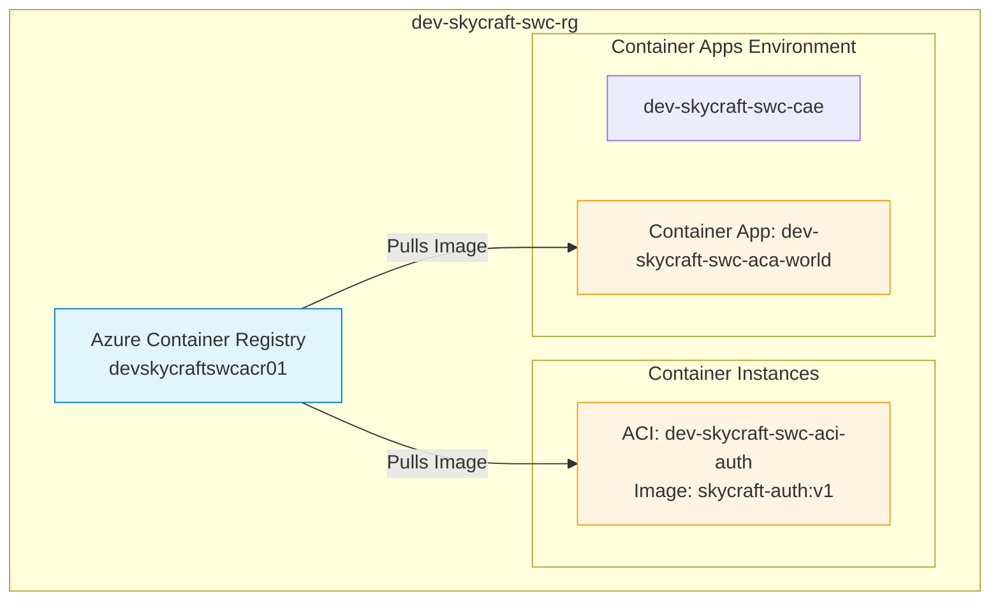
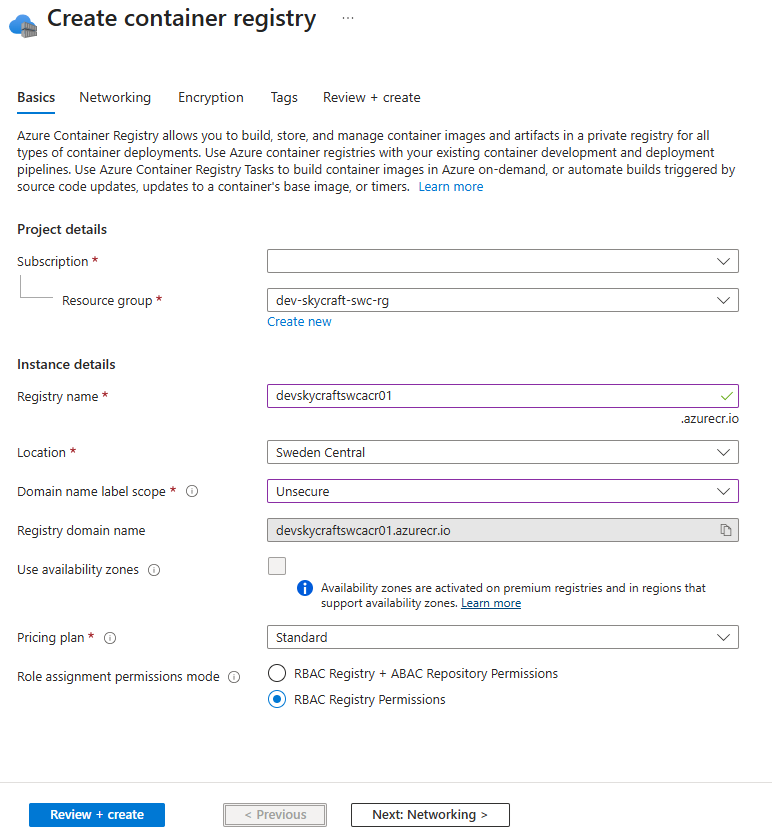
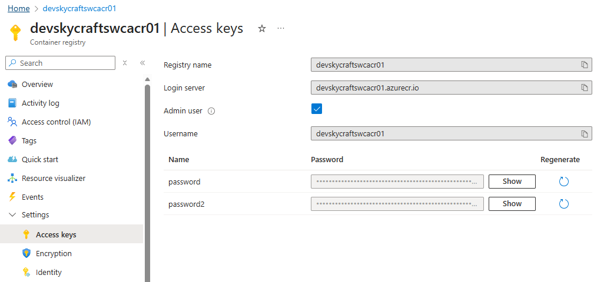
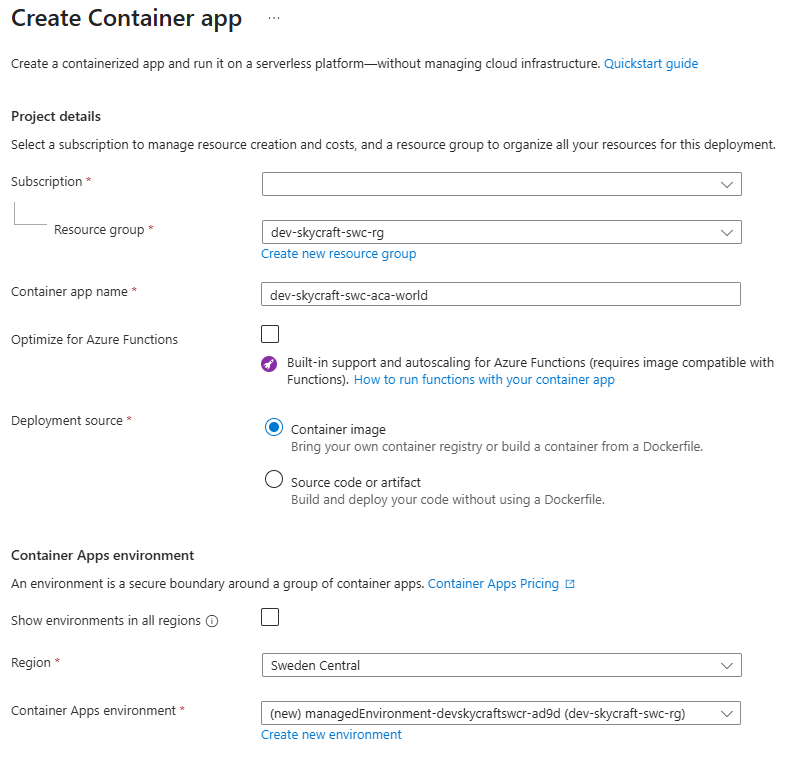
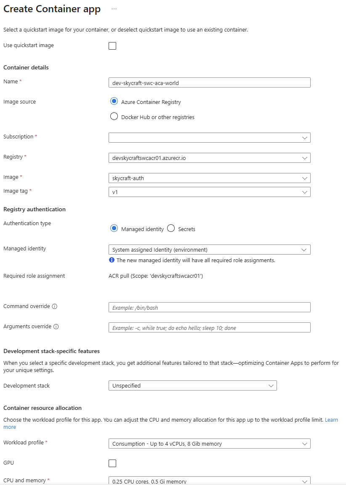
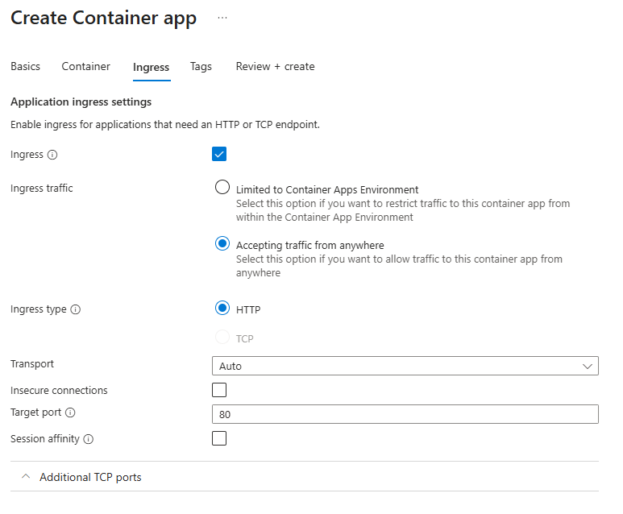
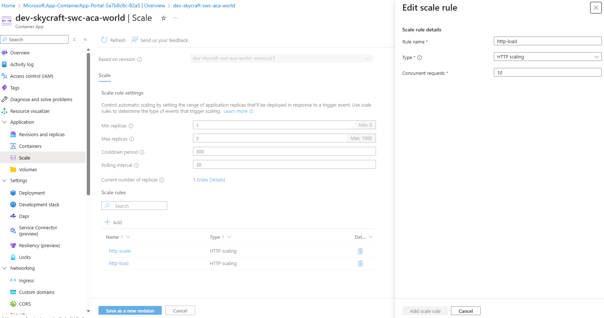

# Lab 3.3: Provision and Manage Containers (2 hours)

## 🎯 Learning Objectives

By completing this lab, you will:

- **Create** and manage an Azure Container Registry (ACR) to store private container images.
- **Build** and push a Docker container image using ACR Tasks.
- **Provision** Azure Container Instances (ACI) to run isolated containers.
- **Deploy** and scale microservices using Azure Container Apps (ACA).
- **Manage** container scaling and sizing properties.

---

## 🏗️ Architecture Overview

You will deploy a containerized environment for the SkyCraft authentication service:



## 📋 Real-World Scenario

**Situation**: The SkyCraft engineering team wants to modernize the legacy server architecture. The `AuthServer` is a lightweight component that doesn't require a full Virtual Machine, making it a perfect candidate for containerization. Additionally, the `WorldServer` needs to scale dynamically based on player count.

**Your Task**: You will set up a private container registry, containerize the authentication service, and explore two different hosting options: Azure Container Instances for simple, isolated workloads, and Azure Container Apps for scalable, serverless microservices.

## ⏱️ Estimated Time: 1 hour

- **Section 1**: Azure Container Registry (15 min)
- **Section 2**: Azure Container Instances (20 min)
- **Section 3**: Azure Container Apps (25 min)

## ✅ Prerequisites

Before starting this lab:

- [ ] Completed Lab 3.1 and 3.2 (recommended for Resource Group structure).
- [ ] **Owner** or **Contributor** role on the subscription.
- [ ] Azure CLI installed or access to Cloud Shell.

---

## 📖 Section 1: Azure Container Registry (15 min)

### What is Azure Container Registry?

**Azure Container Registry (ACR)** is a managed, private Docker registry service based on the open-source Docker Registry 2.0. It allows you to build, store, and manage container images and artifacts for all types of container deployments.

For SkyCraft, we need a secure place to store our proprietary game server images rather than using public repositories like Docker Hub.

### Step 3.3.1: Create a Container Registry

1. Navigate to the **Azure Portal** and search for **Container registries**.
2. Click **+ Create**.
3. Configure the **Basics** tab:

| Field                                | Value                         |
| ------------------------------------ | ----------------------------- |
| **Subscription**                     | Your subscription             |
| **Resource group**                   | `dev-skycraft-swc-rg`         |
| **Registry name**                    | `devskycraftswcacr01`         |
| **Location**                         | **Sweden Central**            |
| **Domain name label scope**          | **Unsecure**                  |
| **Pricing plan**                     | **Standard**                  |
| **Role assigments permissions mode** | **RBAC Registry Permissions** |

> **Note**: The registry name must be globally unique and contain only alphanumeric characters.



4. Click **Review + create**, then **Create**.

**Expected Result**:

- Validation passes and deployment succeeds.
- The ACR resource is available in the resource group.

### Step 3.3.2: Enable Admin User

To allow simple authentication for our labs, we will enable the Admin user. In production, you would typically use Service Principals or Managed Identities.

1. Go to your new **Container Registry** resource.
2. In the left menu, under **Settings**, select **Access keys**.
3. Toggle **Admin user** to **Enabled**.
4. Note the **Login server**, **Username**, and **password**. You will need these shortly.

**Expected Result**:

- Admin user is enabled.
- Passwords are visible and copyable.



### Step 3.3.3: Build and Push an Image using ACR Tasks

We will use **ACR Tasks** to build a container image directly in Azure without needing Docker installed locally. We'll use a sample application to represent our AuthServer.

1. Open **Cloud Shell** (Bash) in the Azure Portal (top-right icon).
2. Run the following command to build an image from a public GitHub Dockerfile and push it to your registry. Replace `[your-acr-name]` with your actual registry name.

```azurecli
az acr build --registry [your-acr-name] --image skycraft-auth:v1 https://github.com/Azure-Samples/aci-helloworld.git
```

> **Why this works**: `az acr build` streams the build context to Azure, builds the image on Azure's infrastructure, and pushes it to your registry automatically.

**Expected Result**:

- The build process logs appear in the console.
- Final status shows `Run ID: ... was successful`.
- If you navigate to **Services** -> **Repositories** in your ACR blade, you should see `skycraft-auth` with tag `v1`.

---

## 📖 Section 2: Azure Container Instances (20 min)

### What are Azure Container Instances?

**Azure Container Instances (ACI)** allow you to run containers on Azure without managing virtual machines or adopting a higher-level service like Kubernetes. It's the fastest way to run a container in Azure.

We will use ACI to deploy a single instance of the AuthServer for testing.

### Step 3.3.4: Deploy Container to ACI

1. Navigate to **Container instances** in the Azure Portal.
2. Click **+ Create**.
3. On the **Basics** tab:

| Field                  | Value                        |
| ---------------------- | ---------------------------- |
| **Subscription**       | Your subscription            |
| **Resource group**     | `dev-skycraft-swc-rg`        |
| **Container name**     | `dev-skycraft-swc-aci-auth`  |
| **Region**             | **Sweden Central**           |
| **Availability zones** | None                         |
| **Image source**       | **Azure Container Registry** |
| **Registry**           | `[Select your registry]`     |
| **Image**              | `skycraft-auth`              |
| **Image tag**          | `v1`                         |
| **Size**               | **0.5 CPU, 0.5 GB Memory**   |

4. Click **Next: Networking**.
5. Configure Networking:
   - **Networking type**: Public
   - **DNS name label**: `skycraft-auth-[uniqueID]` (must be globally unique in the region)
   - **Ports**: TCP 80 (default)
6. Click **Next: Monitoring**.

| Field                              | Value       |
| ---------------------------------- | ----------- |
| **Enable container instance logs** | **Uncheck** |

7. Click **Review + create**, then **Create**.

**Expected Result**:

- Deployment succeeds.
- The ACI resource `dev-skycraft-swc-aci-auth` is created.

### Step 3.3.5: Verify the Application

1. Go to the **dev-skycraft-swc-aci-auth** resource.
2. In the **Overview** blade, locate the **FQDN** (Fully Qualified Domain Name).
   - Example: `skycraft-auth-123.swedencentral.azurecontainer.io`
3. Copy the FQDN and paste it into a new browser tab.

**Expected Result**:

- You see the "Welcome to Azure Container Instances!" page (representing our SkyCraft AuthServer placeholder).

---

## 📖 Section 3: Azure Container Apps (25 min)

### What are Azure Container Apps?

**Azure Container Apps (ACA)** is a serverless container service built on Kubernetes. Unlike ACI, it supports advanced features like auto-scaling (including scaling to zero), multiple revisions, and integrated ingress, making it suitable for microservices.

We will deploy the "WorldServer" component here to take advantage of scaling capabilities.

### Step 3.3.6: Create a Container Apps Environment

1. Search for **Container Apps** in the portal and click **+ Create**.
2. On the **Basics** tab:
   - **Resource group**: `dev-skycraft-swc-rg`
   - **Container app name**: `dev-skycraft-swc-aca-world`
   - **Region**: **Sweden Central**
   - **\*Deployment source**: **Container Image**
3. Under **Container Apps Environment**, click **Create new**.
   - **Region**: **Sweden Central**
   - **Environment name**: `dev-skycraft-swc-cae`
   - Click **Create**.



### Step 3.3.7: Configure Container Settings

1. Uncheck **Use quickstart image**.
2. **Name**: `worldserver`
3. **Image Source**: **Azure Container Registry**
4. Select your registry, image `skycraft-auth` (we'll reuse this image for the lab demo), and tag `v1`.
5. **Managed identity**: **System assigned**
6. **Command Override**: `empty`
7. **Arguments Override**: `empty`
8. **Develomplent Stack**: `Unspecified`
9. **Workload profile**: `Consumption`
10. Under **Container resource allocation**, select **0.25 CPU** and **0.5 Gi** Memory (sufficient for this demo).



### Step 3.3.8: Configure Ingress

1. Click **Next: Ingress**.
2. **Ingress**: Enabled
3. **Traffic**: Accepting traffic from anywhere (Public)
4. **Ingress type**: HTTP
5. **Transport**: `Auto`
6. **Insecure connections** : `Uncheck`
7. **Target port**: 80



8. Click **Review + create**, then **Create**.

**Expected Result**:

- Deployment succeeds after a few minutes.
- You have a Container Apps Environment and a Container App.

### Step 3.3.9: Configure Scaling

1. Go to your **dev-skycraft-swc-aca-world** Container App.
2. On the left menu, select **Scale**.
3. Click **Edit and deploy**.
4. In the **Scale** tab, set:
   - **Min replicas**: 1
   - **Max replicas**: 3
5. Click **Add** (under Scale rules) -> **HTTP scaling**.
   - **Rule name**: `http-load`
   - **Concurrent requests**: `10`
   - Click **Add**.
6. Click **Create**.



**Expected Result**:

- A new revision is created with the scaling rules applied.
- If traffic increases beyond 10 concurrent requests, ACA will automatically spin up more replicas (up to 3).

---

## ✅ Lab Checklist

Quick verification:

- [ ] **ACR** `devskycraftswcacr01` created and contains `skycraft-auth:v1`
- [ ] **ACI** `dev-skycraft-swc-aci-auth` is running and accessible via FQDN
- [ ] **ACA** `dev-skycraft-swc-aca-world` is deployed in environment `dev-skycraft-swc-cae`
- [ ] Scaling rules configured for ACA

For detailed verification, see [lab-checklist-3.3.md](lab-checklist-3.3.md).

## 🔧 Troubleshooting

### Issue 1: "Quota exceeded" for ACI

**Symptom**: Deployment fails with a quota error.
**Solution**: Ensure you are using a region where you have quota. **Sweden Central** usually has availability, but you may need to try **West Europe** or **East US** if using a student subscription.

### Issue 2: Docker pull fails

**Symptom**: Error pulling image in ACI/ACA.
**Solution**: Verify the **Admin user** is enabled in ACR. If you didn't enable it, ACI cannot authenticate to pull the private image. Go to ACR -> Access keys -> Enable Admin user.

### Issue 3: Ingress 404/502

**Symptom**: ACA URL returns error.
**Solution**: Check the **Target Port** in Ingress settings. Our sample image listens on port 80. If you set it to 8080 or 443, it will fail.

## 🎓 Knowledge Check

1. **Why would you choose Azure Container Apps (ACA) over Azure Container Instances (ACI)?**

   <details>
     <summary>**Click to see the answer**</summary>

   **Answer**: Choose ACA when you need **auto-scaling** (including scale-to-zero), **microservices orchestration**, multiple **revisions**, or integrated service discovery. ACI is better for "burst" workloads, simple isolated containers, or task automation that doesn't require orchestration.
   </details>

2. **What is the purpose of the ACR Admin User?**

   <details>
     <summary>**Click to see the answer**</summary>

   **Answer**: The Admin User provides a simple username/password authentication method for the registry. It is useful for testing and simple scenarios but is **not recommended for production** (use Service Principals or Managed Identities instead for better security and granularity).
   </details>

## 📚 Additional Resources

- [Azure Container Registry Documentation](https://learn.microsoft.com/en-us/azure/container-registry/)
- [Azure Container Instances Documentation](https://learn.microsoft.com/en-us/azure/container-instances/)
- [Azure Container Apps Documentation](https://learn.microsoft.com/en-us/azure/container-apps/)

## 📌 Module Navigation

- [← Back to Module 3 Index](../README.md)
- [Lab 3.4: Create and Configure Azure App Service →](../3.4-app-service/lab-guide-3.4.md)

## 📝 Lab Summary

What You Accomplished:
✅ Created a private **Azure Container Registry**.
✅ Built and pushed a container image without a local Docker engine using **ACR Tasks**.
✅ Deployed a container to **Azure Container Instances**.
✅ Deployed a scalable container app to **Azure Container Apps**.

Time Spent: ~2 hours
