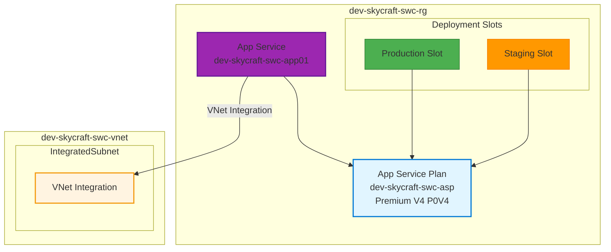
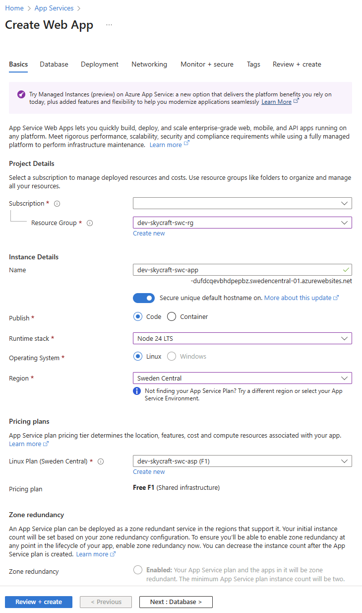
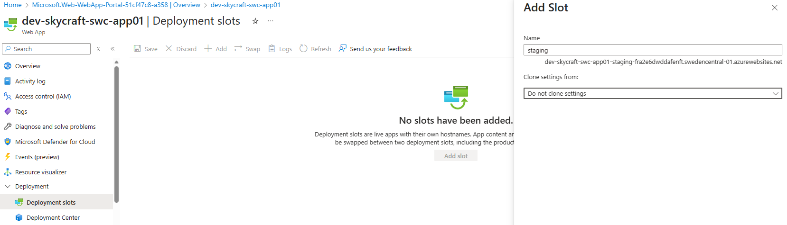
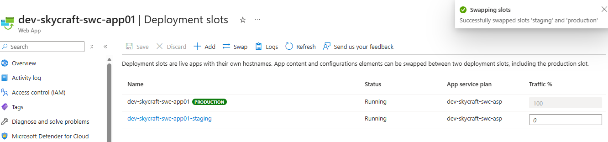
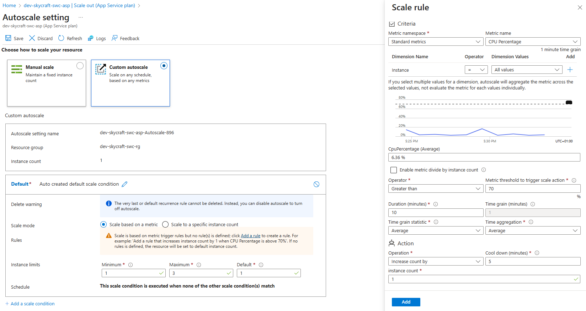
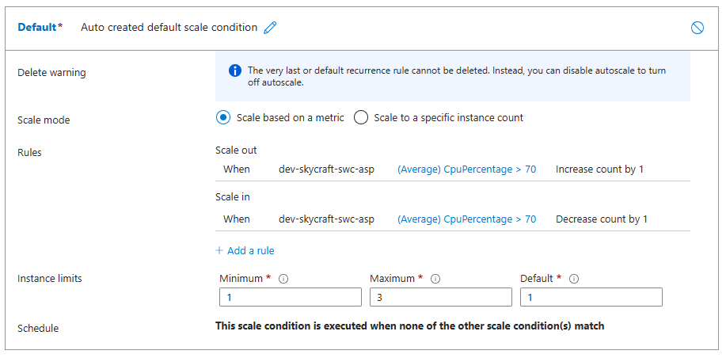
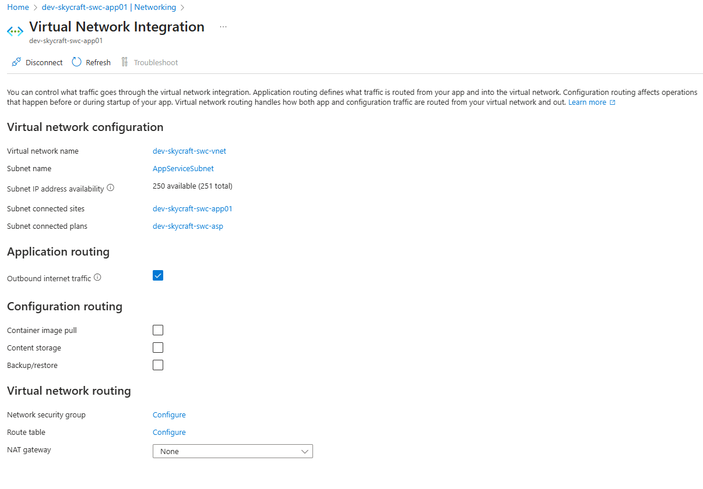
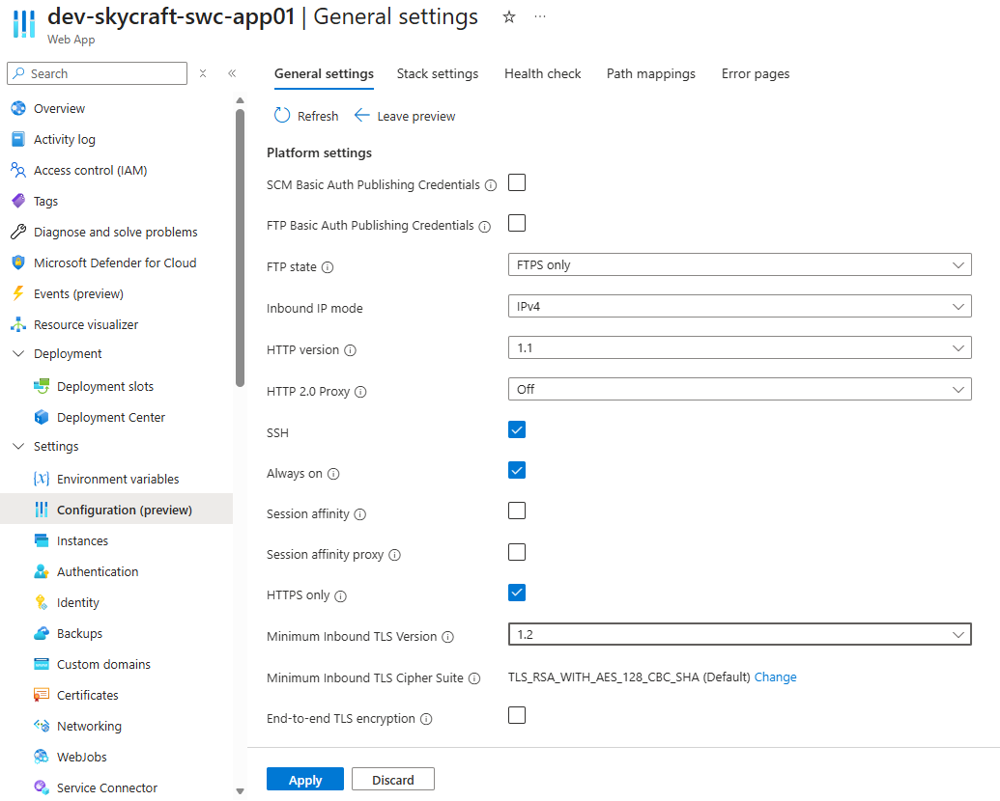

# Lab 3.4: Create and Configure Azure App Service (2 hours)

## 🎯 Learning Objectives

By completing this lab, you will:

- Provision an Azure App Service Plan (ASP) with appropriate pricing tier
- Deploy a web-based monitoring dashboard for SkyCraft using Azure App Service
- Configure deployment slots for safe "blue-green" deployments
- Implement auto-scaling rules based on CPU metrics
- Secure the application with HTTPS/TLS
- Configure VNet Integration to allow the Web App to access private resources
- Configure automated backups for disaster recovery

---

## 🏗️ Architecture Overview

You'll deploy this PaaS infrastructure for the SkyCraft monitoring dashboard:



---

## 📋 Real-World Scenario

**Situation**: The SkyCraft operations team needs a lightweight, accessible dashboard to monitor server status and view game logs without logging into VMs via SSH. This dashboard should be accessible via a web browser but secured.

**Your Task**: Deploy a "Game Master Dashboard" using Azure App Service. This approach minimizes infrastructure management (no OS updates) and provides built-in scaling and deployment features. You need to ensure the dashboard can talk to the backend servers (via VNet Integration) and can be updated without downtime (via Deployment Slots).

---

## ⏱️ Estimated Time: 2 hours

- **Section 1**: Understanding App Service Plans (15 min)
- **Section 2**: Create App Service Plan & Web App (30 min)
- **Section 3**: Deploy the Dashboard (20 min)
- **Section 4**: Configure Deployment Slots (25 min)
- **Section 5**: Configure Auto-scaling (15 min)
- **Section 6**: Networking & Security (15 min)

---

## ✅ Prerequisites

Before starting this lab:

- [ ] Completed Lab 2.1 (Virtual Networks)
- [ ] Resource Group `dev-skycraft-swc-rg` exists
- [ ] VNet `dev-skycraft-swc-vnet` exists

**Verify prerequisites**:

```azurecli
az group show --name dev-skycraft-swc-rg
az network vnet show --name dev-skycraft-swc-vnet --resource-group dev-skycraft-swc-rg
```

---

## 📖 Section 1: Understanding App Service Plans (15 minutes)

### What is an App Service Plan?

An **App Service Plan (ASP)** defines the set of compute resources for a web app to run. It's analogous to a "server farm" in conventional hosting.

Key attributes determined by the ASP:

- **Region**: Where the hardware resides (e.g., Sweden Central).
- **Scale Count**: Number of instances.
- **Instance Size**: CPU/RAM (e.g., Small, Medium, Large).
- **SKU/Tier**: Features available (Free, Shared, Basic, Standard, Premium, Isolated).

### Choosing the Right Tier for SkyCraft

| Tier               | Features                                                        | Use Case                      |
| ------------------ | --------------------------------------------------------------- | ----------------------------- |
| **Free/Shared**    | Shared infrastructure, no scaling, no VNet integration          | Dev/Test of simple prototypes |
| **Basic (B1)**     | Dedicated instances, custom domains, SSL                        | Low-traffic sites             |
| **Standard (S1)**  | Auto-scale, **Deployment Slots**, **VNet Integration**, Backups | Production workloads          |
| **Premium (P0V4)** | Faster processors, higher scale limits, cost-effective          | **SkyCraft Lab**              |
| **Premium (P1v2)** | Faster processors, higher scale limits                          | High-performance apps         |

For this lab, we will use **Premium V4 P0V4** because we need **Deployment Slots** and **VNet Integration** at a competitive price point.

---

## 📖 Section 2: Create App Service Plan & Web App (30 minutes)

### Step 3.4.1: Create App Service Plan

1. Navigate to **App Service Plans** in the Azure Portal.
2. Click **+ Create**.

**Basics tab**:

| Field            | Value                  |
| ---------------- | ---------------------- |
| Subscription     | [Your Subscription]    |
| Resource Group   | `dev-skycraft-swc-rg`  |
| Name             | `dev-skycraft-swc-asp` |
| Operating System | **Linux**              |
| Region           | **Sweden Central**     |
| Pricing Tier     | **Premium V4 P0V4**    |

> [!NOTE]
> Ensure you select **Linux**. While SkyCraft game servers run on Linux, the dashboard could run on Windows, but we'll stick to Linux for consistency and cost.

3. Click **Review + create** -> **Create**.

**Expected Result**: App Service Plan `dev-skycraft-swc-asp` is created in Sweden Central.

### Step 3.4.2: Create Web App

1. Navigate to **App Services**.
2. Click **+ Create** -> **Web App**.

**Basics tab**:

| Field            | Value                                                    |
| ---------------- | -------------------------------------------------------- |
| Subscription     | [Your Subscription]                                      |
| Resource Group   | `dev-skycraft-swc-rg`                                    |
| Name             | `dev-skycraft-swc-app01` (must be globally unique)       |
| Publish          | **Code**                                                 |
| Runtime stack    | **Node 24 LTS** (or newer)                               |
| Operating System | **Linux**                                                |
| Region           | **Sweden Central**                                       |
| Linux Plan       | `dev-skycraft-swc-asp` (Select the one you just created) |



3. Click **Review + create** -> **Create**.

**Expected Result**: Web App is deployed. Access the URL (e.g., `https://dev-skycraft-swc-app01.azurewebsites.net`) and you should see the default "Your web app is running and waiting for your content" landing page.

---

## 📖 Section 3: Deploy the Dashboard (20 minutes)

We will deploy a simple "Coming Soon" dashboard to simulate the application.

### Step 3.4.3: Create Dashboard File

On your local machine, create a file named `index.html` with the following content:

```html
<!DOCTYPE html>
<html>
  <head>
    <title>SkyCraft Dashboard</title>
    <style>
      body {
        font-family: Arial, sans-serif;
        background-color: #f0f2f5;
        text-align: center;
        padding-top: 50px;
      }
      .card {
        background: white;
        padding: 20px;
        border-radius: 8px;
        box-shadow: 0 2px 4px rgba(0, 0, 0, 0.1);
        display: inline-block;
      }
      .status {
        color: green;
        font-weight: bold;
      }
    </style>
  </head>
  <body>
    <div class="card">
      <h1>SkyCraft GM Dashboard</h1>
      <p>Server Status: <span class="status">ONLINE</span></p>
      <p>Region: Sweden Central</p>
      <p>Version: 1.0 (Development)</p>
    </div>
  </body>
</html>
```

### Step 3.4.4: Deploy via Zip Deploy

Azure App Service supports simple deployment by uploading a ZIP file.

1. Compress `index.html` into a zip file named `dashboard.zip`.
2. Use Azure CLI (Cloud Shell) to deploy. You need to upload the zip to Cloud Shell first, or run this from your local terminal if you have Azure CLI installed.

**If using Cloud Shell**:

1. Upload `dashboard.zip` using the **Upload/Download files** icon.
2. Run:

```azurecli
az webapp deploy source config-zip \
  --resource-group dev-skycraft-swc-rg \
  --name dev-skycraft-swc-app01 \
  --src dashboard.zip
```

> [!TIP]
> If you cannot zip locally, you can use the **App Service Editor (Preview)** in the portal (under Development Tools) to create the `index.html` file directly in the `wwwroot` folder.

**Expected Result**: Refresh your Web App URL. You should see the "SkyCraft GM Dashboard".

---

## 📖 Section 4: Configure Deployment Slots (25 minutes)

Deployment slots allow you to deploy different versions of your app (e.g., "Staging") and swap them with production with zero downtime.

### Step 3.4.5: Create Staging Slot

1. Navigate to your App Service `dev-skycraft-swc-app01`.
2. In the left menu, under **Deployment**, select **Deployment slots**.
3. Click **+ Add slot**.
4. Name: `staging`.
5. Clone settings from: **Do not clone settings** (or clone from main, doesn't matter much for this simple app).
6. Click **Add**.



**Expected Result**: A new slot `staging` appears in the list.

### Step 3.4.6: Deploy V2 to Staging

1. Click on the `staging` slot name to open its management blade. Note the URL: `...-staging.azurewebsites.net`.
2. Modify your local `index.html` to say **"Version: 2.0 (Staging)"** and change the status color to **Blue**.
3. Zip it as `dashboard-v2.zip`.
4. Deploy to the **staging** slot:

```azurecli
az webapp deploy source config-zip \
  --resource-group dev-skycraft-swc-rg \
  --name dev-skycraft-swc-app01 \
  --slot staging \
  --src dashboard-v2.zip
```

> [!TIP]
> If you using PowerShell you should use **`** instead \ in the code

**Expected Result**:

- Production URL shows "Version 1.0".
- Staging URL shows "Version 2.0".

### Step 3.4.7: Perform a Swap

1. Go back to the **Production** App Service blade -> **Deployment slots**.
2. Click **Swap**.
3. **Source**: `staging`.
4. **Target**: `production`.
5. Click **Swap**.



**Expected Result**: After the swap completes (Wait ~1-2 mins), refresh the **Production** URL. It should now show "Version 2.0". The Staging URL will now show "Version 1.0" (they swapped places).

---

## 📖 Section 5: Configure Auto-scaling (15 minutes)

We want the dashboard to scale out if too many Game Masters use it simultaneously.

### Step 3.4.8: Configure Scale Out Rule

1. Navigate to your App Service Plan `dev-skycraft-swc-asp`.
2. Under **Settings**, select **Scale out (App Service plan)**.
   > _Note: The UI might say "Apps in this plan will scale together"._
3. Select **Rule Based**.
4. Click **Configure**. (If you see `Manual  scale`, you can switch to `Custom autoscale` for more control).
   - Select **Custom autoscale**.
5. **Scale mode**: **Scale based on a metric**.
6. Click **+ Add a rule**.
   - **Metric source**: Current resource.
   - **Metric namespace**: Standard metrics.
   - **Metric name**: **CPU Percentage**.
   - **Operator**: **Greater than**.
   - **Threshold**: **70**.
   - **Duration**: **10 minutes**.
   - **Operation**: **Increase count by**.
   - **Instance count**: **1**.
   - **Cool down**: **5 minutes**.
7. Click **Add**.



### Step 3.4.9: Configure Scale In Rule

Always pair a scale-out rule with a scale-in rule to save costs!

1. Click **+ Add a rule**.
   - **Metric name**: **CPU Percentage**.
   - **Operator**: **Less than**.
   - **Threshold**: **30**.
   - **Operation**: **Decrease count by**.
   - **Instance count**: **1**.
2. Click **Add**.
3. Set **Instance limits**:
   - Minimum: **1**
   - Maximum: **3**
   - Default: **1**
4. Click **Save**.

**Expected Result**: The plan will now auto-scale between 1 and 3 instances based on CPU load.



---

## 📖 Section 6: Networking & Security (15 minutes)

### Step 3.4.10: VNet Integration (Conceptual/Setup)

To allow the dashboard to connect to the Game Servers (e.g., to query status directly via IP), we need VNet Integration.

1. Navigate to your App Service.
2. Under **Settings**, select **Networking**.
3. Under **Outbound traffic configuration**, click **VNet integration**.
4. Click **+ Add VNet integration**.
5. Select `dev-skycraft-swc-vnet`.
6. Select **Existing subnet**:
   - Subnet: `AppServiceSubnet` (10.1.4.0/24)
   - _Note: This subnet was created in Lab 2.1 specifically for this purpose._
7. Click **Connect**.

**Expected Result**: The App Service is now connected to the VNet. It can access private IPs (like the database or VMs) within that VNet.



### Step 3.4.11: HTTPS Only

1. Go back to the **Overview** App Service blade.
2. Under **Settings**, select **Configuration** (or **Environment variables** in newer UI, check **General settings** tab).
3. Look for **Platform settings** -> **HTTPS Only**.
4. Set to **On**.
5. (Optional) **Minimum TLS Version**: Set to **1.2**.
6. Click **Apply**.

**Expected Result**: All HTTP requests are redirected to HTTPS.



### Step 3.4.12: Custom DNS (Conceptual)

In a real production environment, you wouldn't use the `azurewebsites.net` domain. You would map a custom domain (e.g., `dashboard.skycraft.com`).

**Steps to configure (For Reference Only):**

1. Buy a domain from a registrar (GoDaddy, Namecheap, etc.).
2. In App Service -> **Custom domains** -> **+ Add custom domain**.
3. **Domain provider**: All other domain services.
4. **TLS/SSL certificate**: Managed certificate (Free).
5. **Validation**: Add the `TXT` and `CNAME` records provided by Azure to your domain registrar's DNS settings.
6. **Bind**: Once validated, click **Validate** and **Add**.

> [!NOTE]
> We skip this step in the lab because it requires purchasing a real domain name.

### Step 3.4.13: Configure Backups

The **Premium V4 P0V4** tier allows for automated backups.

1. In the App Service menu, under **Settings**, select **Backups**.
2. Click **+ Configure**.
3. **Storage Account**: Select an existing storage account or create a new one (e.g., `storageskycraftbackup`).
   - _Note_: If you don't have one, create a standard Storage Account in `dev-skycraft-swc-rg`.
4. **Container**: Create a container named `app-backups`.
5. **Schedule**:
   - **Scheduled backup**: On
   - **Backup every**: 1 Day
   - **Start time**: Current time
   - **Retention (days)**: 30
6. Click **Save**.

**Expected Result**: Backup configuration is saved. A backup will be taken according to the schedule.

---

## ✅ Lab Checklist

- [ ] App Service Plan (Standard S1) created
- [ ] Web App created and running Linux/Node
- [ ] Dashboard HTML deployed to Production
- [ ] Staging slot created and V2 deployed
- [ ] Swap performed successfully
- [ ] Autoscale rules configured (CPU > 70%)
- [ ] VNet Integration configured with `AppServiceSubnet`
- [ ] HTTPS Only enabled

For detailed verification, see `lab-checklist-3.4.md`.

---

## 🔧 Troubleshooting

### Issue 1: "Service Unavailable" or 503

**Symptom**: App returns 503 after deployment.
**Cause**: Node.js app crash or bad startup command. Since we deployed a static HTML file to a Node stack, Azure usually handles this, but sometimes it expects a `server.js`.
**Solution**:

- For static HTML in a Node stack, using **PM2** serves it automatically, or switch stack to **PHP** or **Python** which often serve static files easier.
- _Better Fix_: Create a `package.json` and `server.js` (Express) to serve the file.
- _Quick Fix_: Use the **App Service Editor** to ensure files are in `wwwroot`.

### Issue 2: VNet Integration Fails

**Symptom**: "Cannot add VNet Integration".
**Cause**: Subnet might be delegated to another service or overlapping CIDR.
**Solution**: Ensure the subnet is **delegated** to `Microsoft.Web/serverFarms`. The portal usually does this automatically when creating a new subnet in the wizard.

---

## 🎓 Knowledge Check

1. **Why did we choose the Premium V4 (P0V4) tier instead of Basic (B1)?**
   <details>
     <summary>Click to see the answer</summary>
     **Answer**: Premium V4 (P0V4) provides **Deployment Slots** and **Auto-scaling**, which were core requirements for this lab. Basic tier supports manual scaling but not slots or auto-scale. P0V4 is often more cost-effective than older Premium generations while offering modern performance.
   </details>

2. **What happens to the Staging slot after a Swap?**
   <details>
     <summary>Click to see the answer</summary>
     **Answer**: The Staging slot takes on the previous Production content/configuration. The instances are literally swapped (hostnames map to different processes). This allows you to "undo" a swap by swapping again if the new version fails in production.
   </details>

3. **Why do we need VNet Integration?**
   <details>
     <summary>Click to see the answer</summary>
     **Answer**: By default, App Service is public and cannot reach private IPs in your Azure Virtual Network. VNet Integration allows the web app to make **outbound** calls to private resources (like your SQL DB or Game Server VMs) within the VNet.
   </details>

---

## 📌 Module Navigation

← [Back to Module 3 Index](../README.md)
Next Lab: [Module 4 - Storage](../module-4-storage/README.md) ->

## 📝 Lab Summary

You have successfully:

- Provisioned a PaaS environment for web hosting.
- Implemented a blue-green deployment strategy using Slots.
- Configured robust auto-scaling to handle load spikes.
- Secured the network path between the Web App and the backend infrastructure.
