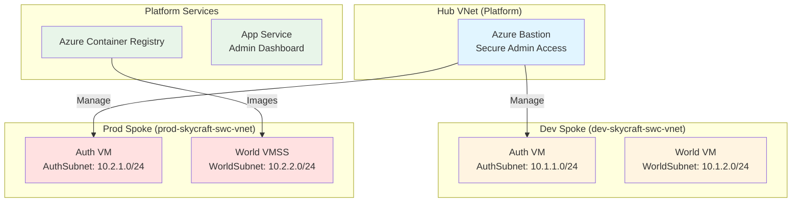

# Module 3: Deploy and Manage Azure Compute Resources (10 hours)

## 📚 Module Overview

In this module, you'll deploy the **core application infrastructure** for the SkyCraft AzerothCore deployment. Building upon the networking foundation from Module 2, you'll provision Linux Virtual Machines to host the game servers (Auth and World), explore containerization options, and deploy a web-based management dashboard.

**Real-world Context**: With identity, governance, and networking in place, it's time to deploy the actual compute workloads. You'll use Infrastructure as Code to automate deployments, configure high-availability VMs, and explore modern container-based alternatives—skills essential for any Azure administrator.

---

## 🎯 Learning Objectives

By completing this module, you will be able to:

- **Automate deployments** using Bicep templates for repeatable infrastructure
- **Deploy and configure** Linux Virtual Machines for mission-critical game server workloads
- **Implement high availability** using Availability Zones and Virtual Machine Scale Sets
- **Provision containers** using Azure Container Instances and Container Registry
- **Deploy web applications** using Azure App Service with deployment slots
- **Manage VM operations** including disk encryption, resizing, and cross-region moves

---

## 📋 Module Sections

| Lab | Duration | Topic                                  | Exam Weight |
| --- | -------- | -------------------------------------- | ----------- |
| 3.1 | 3 hours  | Automate Deployment Using Bicep (IaC)  | ~6-8%       |
| 3.2 | 4 hours  | Create and Configure Virtual Machines  | ~8-10%      |
| 3.3 | 2 hours  | Provision and Manage Containers        | ~3-4%       |
| 3.4 | 1 hour   | Create and Configure Azure App Service | ~3-4%       |

**Total Module Time**: 10 hours

---

## 🏗️ Architecture Overview

This module deploys compute resources into the network topology built in Module 2:

---

## ✅ Prerequisites

Before starting, ensure you have:

- [ ] Completed Module 2 (VNets, NSGs, Peering active)
- [ ] Active Azure subscription with Owner or Contributor role
- [ ] Azure CLI and Bicep CLI installed locally
- [ ] PowerShell 7+ installed
- [ ] Basic Linux administration knowledge (SSH, package management)

**Verify Module 2 completion**:

- Virtual networks: `platform-skycraft-swc-vnet`, `dev-skycraft-swc-vnet`, `prod-skycraft-swc-vnet`
- VNet peering configured between hub and spokes
- NSGs applied to subnets
- Azure Bastion deployed in hub

---

## 🚀 Getting Started

1. **Review the architecture** diagram above to understand compute placement
2. **Start with Lab 3.1** - Learn Bicep and automate infrastructure deployments
3. **Progress to Lab 3.2** - Deploy and configure Linux VMs for game servers
4. **Complete Lab 3.3** - Explore containerization with ACR and ACI (optional)
5. **Complete Lab 3.4** - Deploy an App Service for the admin dashboard
6. **Take the module assessment** to validate learning

---

## 📖 How to Use This Module

Each lab includes:

- **Lab Guide** - Step-by-step instructions with architecture diagrams
- **Lab Checklist** - Verification steps to confirm success
- **Bicep Templates** - Infrastructure as Code for automated deployment
- **Scripts** - PowerShell and Bash automation scripts
- **Solutions** - Expected configurations and CLI commands

**Recommended approach**:

1. Study the architecture diagram in each lab guide
2. Follow manual steps in Azure Portal first (learn the UI)
3. Automate with Bicep templates and scripts
4. Verify each step using the checklist
5. Reference solutions if stuck

---

## 🎓 AZ-104 Exam Alignment

This module covers **20-25%** of the AZ-104 exam. Key exam topics include:

- Interpreting and modifying Azure Resource Manager / Bicep templates
- Deploying resources using ARM/Bicep templates
- Creating and configuring virtual machines
- Configuring Azure Disk Encryption
- Moving VMs across resource groups, subscriptions, or regions
- Managing VM sizes and disks
- Deploying VMs to availability zones and sets
- Deploying and configuring Virtual Machine Scale Sets
- Creating and managing Azure Container Registry
- Provisioning containers using Azure Container Instances and Container Apps
- Provisioning App Service plans and configuring scaling
- Configuring deployment slots and TLS certificates

---

## ⏱️ Time Management

- **Total module time**: 10 hours
- **Recommended pace**: 2.5 hours per day for 4 days
- **Lab 3.1**: 3 hours (Bicep fundamentals and template creation)
- **Lab 3.2**: 4 hours (most complex — VM deployment and configuration)
- **Lab 3.3**: 2 hours (containers — optional/advanced)
- **Lab 3.4**: 1 hour (App Service deployment)

---

## 🔗 Useful Resources

- [Bicep Documentation](https://learn.microsoft.com/en-us/azure/azure-resource-manager/bicep/)
- [Azure Virtual Machines Documentation](https://learn.microsoft.com/en-us/azure/virtual-machines/)
- [Azure Container Instances](https://learn.microsoft.com/en-us/azure/container-instances/)
- [Azure Container Registry](https://learn.microsoft.com/en-us/azure/container-registry/)
- [Azure App Service Documentation](https://learn.microsoft.com/en-us/azure/app-service/)
- [Virtual Machine Scale Sets](https://learn.microsoft.com/en-us/azure/virtual-machine-scale-sets/)

---

## 📞 Getting Help

- **Lab issues**: Check troubleshooting sections in each lab's solutions folder
- **Azure errors**: Search Azure documentation or Microsoft Learn
- **Bicep syntax**: Reference the [Bicep playground](https://aka.ms/bicepdemo)

---

## ✨ What's Next After This Module?

Once complete, you'll have:

- ✅ Infrastructure as Code templates for repeatable deployments
- ✅ Linux VMs running SkyCraft game servers across availability zones
- ✅ Container registry and container deployment knowledge
- ✅ App Service dashboard for server management

**Next Module**: Module 4 - Implement and Manage Storage

---

## 📌 Module Navigation

- [← Back to Course Home](../README.MD)
- [Lab 3.1: Infrastructure as Code →](./3.1-infrastructure-as-code/README.md)
- [Lab 3.2: Virtual Machines →](./3.2-virtual-machines/README.md)
- [Lab 3.3: Containers →](./3.3-containers/README.md)
- [Lab 3.4: App Service →](./3.4-app-service/README.md)
