# Lab 4.1: Configure and Manage Storage Accounts (2 hours)

## 🎯 Learning Objectives

By completing this lab, you will:

- Understand Azure Storage services and their use cases
- Create storage accounts with appropriate naming conventions following project standards
- Configure Azure Storage redundancy options (LRS, ZRS, GRS, GZRS, RA-GRS, RA-GZRS)
- Implement storage account encryption settings including infrastructure encryption
- Configure access tiers (Hot, Cool, Cold, Archive) for cost optimization
- Manage access keys and understand key rotation best practices
- Use Azure CLI and PowerShell to automate storage account management
- Configure object replication between storage accounts
- Manage data using Azure Storage Explorer and AzCopy

---

## 🏗️ Architecture Overview

This lab deploys storage accounts across all three SkyCraft environments with environment-appropriate redundancy:

```mermaid
graph TB
    subgraph "platform-skycraft-swc-rg"
        style platform fill:#e1f5ff,stroke:#0078d4,stroke-width:3px
        SA_Platform["platformskycraftswcsa<br/>────────────────<br/>SKU: Standard_GRS<br/>Tier: Hot<br/>TLS: 1.2<br/>────────────────<br/>Shared Services Storage"]
    end

    subgraph "dev-skycraft-swc-rg"
        style dev fill:#fff4e1,stroke:#f39c12,stroke-width:2px
        SA_Dev["devskycraftswcsa<br/>────────────────<br/>SKU: Standard_LRS<br/>Tier: Hot<br/>TLS: 1.2<br/>────────────────<br/>Development Storage"]
    end

    subgraph "prod-skycraft-swc-rg"
        style prod fill:#ffe1e1,stroke:#e74c3c,stroke-width:2px
        SA_Prod["prodskycraftswcsa<br/>────────────────<br/>SKU: Standard_GRS<br/>Tier: Hot<br/>TLS: 1.2<br/>────────────────<br/>Production Storage"]
    end

    subgraph "Services Included"
        Blob["Blob Storage<br/>Unstructured Data"]
        Files["Azure Files<br/>SMB/NFS Shares"]
        Tables["Table Storage<br/>NoSQL Data"]
        Queues["Queue Storage<br/>Messaging"]
    end

    SA_Platform --> Blob
    SA_Platform --> Files
    SA_Dev --> Blob
    SA_Dev --> Files
    SA_Prod --> Blob
    SA_Prod --> Files
    SA_Prod --> Tables
    SA_Prod --> Queues

    SA_Dev -.->|"Object Replication<br/>(Lab 4.2)"| SA_Prod
```



---

## 📋 Real-World Scenario

**Situation**: SkyCraft needs persistent storage for game server configurations, player data backups, world state snapshots, and asset distribution. The storage requirements vary by environment:

| Environment     | Use Case                                 | Redundancy Need       | Cost Priority           |
| --------------- | ---------------------------------------- | --------------------- | ----------------------- |
| **Platform**    | Shared scripts, templates, common assets | Geo-redundancy for DR | Medium                  |
| **Development** | Dev server configs, test data            | Local redundancy only | High (cost-saving)      |
| **Production**  | Player data, world saves, game assets    | Geo-redundancy for DR | Low (reliability first) |

**Your Task**: Deploy storage accounts across all three environments with appropriate redundancy, configure security settings (TLS 1.2, disabled public access), apply governance tags, and set up encryption at rest.

**Business Impact**:

- Ensure player data survives regional outages (GRS in production)
- Reduce development costs by 60% with LRS instead of GRS
- Meet compliance requirements for data encryption
- Enable disaster recovery with geo-replicated storage

---

## ⏱️ Estimated Time: 2 hours

- **Section 1**: Azure Storage Fundamentals (30 min)
- **Section 2**: Create Storage Accounts via Portal (35 min)
- **Section 3**: Create Storage Accounts via CLI/PowerShell (20 min)
- **Section 4**: Configure Encryption and Security (20 min)
- **Section 5**: Access Keys and Data Management (15 min)

---

## ✅ Prerequisites

Before starting this lab:

- [ ] Completed Module 3: Compute (VMs deployed)
- [ ] Resource groups exist:
  - `platform-skycraft-swc-rg`
  - `dev-skycraft-swc-rg`
  - `prod-skycraft-swc-rg`
- [ ] Contributor role assigned at subscription level
- [ ] Azure CLI installed (version 2.50.0 or later)
- [ ] PowerShell Az module installed (`Install-Module -Name Az`)
- [ ] Azure Storage Explorer installed (optional but recommended)
- [ ] Understanding of cloud storage concepts

---

## 📖 Section 1: Azure Storage Fundamentals (30 min)

### What is Azure Storage?

**Azure Storage** is Microsoft's cloud storage solution providing massively scalable, durable, and highly available storage. A single storage account can store up to **5 PB of data** and handle **20,000 requests per second**.

Azure Storage includes four core services:

| Service           | Description                          | Protocol         | SkyCraft Use Case          |
| ----------------- | ------------------------------------ | ---------------- | -------------------------- |
| **Blob Storage**  | Object storage for unstructured data | REST/HTTP        | Game assets, backups, logs |
| **Azure Files**   | Managed file shares                  | SMB 3.0, NFS 4.1 | Shared server configs      |
| **Queue Storage** | Message queuing                      | REST/HTTP        | Game event processing      |
| **Table Storage** | NoSQL key-value store                | REST/HTTP        | Player session data        |

### Storage Account Types

| Type                    | Services        | Performance  | Use Case                     |
| ----------------------- | --------------- | ------------ | ---------------------------- |
| **Standard GPv2**       | All 4 services  | Standard HDD | General purpose (our choice) |
| **Premium Block Blob**  | Blobs only      | Premium SSD  | High-transaction workloads   |
| **Premium File Shares** | Files only      | Premium SSD  | Enterprise file shares       |
| **Premium Page Blobs**  | Page blobs only | Premium SSD  | VM disks (IaaS)              |

> **SkyCraft Choice**: We use **Standard GPv2** accounts because they support all services, offer the best cost-performance ratio, and provide all redundancy options.

### Understanding Redundancy Options

Azure Storage automatically maintains **multiple copies** of your data. The redundancy option determines how and where those copies are stored:

**Within a Single Region:**

| Option  | Copies | Locations            | Durability               | Cost   |
| ------- | ------ | -------------------- | ------------------------ | ------ |
| **LRS** | 3      | Single datacenter    | 11 nines (99.999999999%) | Lowest |
| **ZRS** | 3      | 3 availability zones | 12 nines                 | Medium |

**Across Regions (Geo-Redundant):**

| Option      | Copies | Locations                       | Durability | Cost     |
| ----------- | ------ | ------------------------------- | ---------- | -------- |
| **GRS**     | 6      | 3 local + 3 in paired region    | 16 nines   | High     |
| **GZRS**    | 6      | 3 zones + 3 in paired region    | 16 nines   | Highest  |
| **RA-GRS**  | 6      | GRS + read access to secondary  | 16 nines   | High+    |
| **RA-GZRS** | 6      | GZRS + read access to secondary | 16 nines   | Highest+ |


### SkyCraft Redundancy Strategy

| Environment     | Redundancy | Justification                                        |
| --------------- | ---------- | ---------------------------------------------------- |
| **Development** | LRS        | Cost-effective, data can be recreated                |
| **Platform**    | GRS        | Geo-redundancy for shared services DR                |
| **Production**  | GRS        | Geo-redundancy for player data, enables archive tier |

### Step 4.1.1: Understand Storage Account Naming Rules

Storage account names have **unique requirements** different from other Azure resources:

| Rule           | Requirement                                | Example                               |
| -------------- | ------------------------------------------ | ------------------------------------- |
| **Scope**      | Globally unique across ALL Azure customers | Only one `mystorageaccount` worldwide |
| **Length**     | 3-24 characters                            | `prodskycraftswcsa` (17 chars) ✓      |
| **Characters** | Lowercase letters and numbers only         | No hyphens, underscores, or uppercase |
| **Start**      | Must start with a letter or number         | `1storage` ✓, `_storage` ✗            |

**SkyCraft Naming Pattern**: `{environment}skycraftswcsa`

| Environment | Storage Account Name    | Notes         |
| ----------- | ----------------------- | ------------- |
| Platform    | `platformskycraftswcsa` | 21 characters |
| Development | `devskycraftswcsa`      | 17 characters |
| Production  | `prodskycraftswcsa`     | 18 characters |

> **Note**: Unlike other Azure resources, storage account names cannot include hyphens. This is why we use `platformskycraftswcsa` instead of `platform-skycraft-swc-sa`.

---

## 📖 Section 2: Create Storage Accounts via Portal (35 min)

### Step 4.1.2: Create Platform Storage Account

1. Navigate to **Azure Portal** → Search for **Storage accounts**
2. Click **+ Create**

3. Fill in the **Basics** tab:

| Field                | Value                           |
| -------------------- | ------------------------------- |
| Subscription         | Your subscription               |
| Resource group       | `platform-skycraft-swc-rg`      |
| Storage account name | `platformskycraftswcsa`         |
| Region               | **Sweden Central**              |
| Performance          | **Standard**                    |
| Redundancy           | **Geo-redundant storage (GRS)** |


4. Click **Next: Advanced**

5. Configure **Advanced** settings:

| Field                                                    | Value                        | Why                            |
| -------------------------------------------------------- | ---------------------------- | ------------------------------ |
| Require secure transfer for REST API operations          | ✅ Enabled                   | Enforces HTTPS                 |
| Allow enabling anonymous access on individual containers | ❌ Disabled                  | Security best practice         |
| Enable storage account key access                        | ✅ Enabled                   | Required for some tools        |
| Default to Microsoft Entra authorization                 | ❌ Disabled                  | Optional, can enable later     |
| Minimum TLS version                                      | **TLS 1.2**                  | Security compliance            |
| Permitted scope for copy operations                      | **From any storage account** | Default                        |
| Enable hierarchical namespace                            | ❌ Disabled                  | Not needed for general storage |
| Enable SFTP                                              | ❌ Disabled                  | Not needed                     |
| Enable network file system v3                            | ❌ Disabled                  | Not needed                     |
| Access tier                                              | **Hot**                      | Frequently accessed data       |
| Enable large file shares                                 | ❌ Disabled                  | Not needed                     |

6. Click **Next: Networking**

7. Configure **Networking** settings:

| Field              | Value                                      |
| ------------------ | ------------------------------------------ |
| Network access     | **Enable public access from all networks** |
| Routing preference | **Microsoft network routing**              |

> **Note**: We'll configure network restrictions in Lab 4.4. For now, we allow public access for ease of testing.

8. Click **Next: Data protection**

9. Configure **Data protection** settings (accept defaults for now):

| Field                                       | Value               |
| ------------------------------------------- | ------------------- |
| Enable point-in-time restore for containers | ❌ Disabled         |
| Enable soft delete for blobs                | ✅ Enabled (7 days) |
| Enable soft delete for containers           | ✅ Enabled (7 days) |
| Enable soft delete for file shares          | ✅ Enabled (7 days) |
| Enable versioning for blobs                 | ❌ Disabled         |
| Enable blob change feed                     | ❌ Disabled         |

> **Note**: We'll configure versioning and change feed in Lab 4.2 for lifecycle management.

10. Click **Next: Encryption**

11. Verify **Encryption** settings:

| Field                                    | Value                            |
| ---------------------------------------- | -------------------------------- |
| Encryption type                          | **Microsoft-managed keys (MMK)** |
| Enable support for customer-managed keys | **Blobs and files only**         |
| Enable infrastructure encryption         | ❌ Disabled                      |

> **For high compliance environments**, enable **Infrastructure encryption** for double encryption (adds second layer at infrastructure level).

12. Click **Next: Tags**

13. Add required tags:

| Tag         | Value    |
| ----------- | -------- |
| Project     | SkyCraft |
| Environment | Platform |
| CostCenter  | MSDN     |

14. Click **Review + create**

15. Review the summary and click **Create**

**Expected Result**: Deployment succeeds in 30-60 seconds. Navigate to the resource to verify:

- Name: `platformskycraftswcsa`
- Location: Sweden Central
- Replication: Geo-redundant storage (GRS)
- Access tier: Hot

### Step 4.1.3: Create Development Storage Account

1. Return to **Storage accounts** → **+ Create**
2. Configure with these values:

| Field                | Value                               |
| -------------------- | ----------------------------------- |
| Resource group       | `dev-skycraft-swc-rg`               |
| Storage account name | `devskycraftswcsa`                  |
| Region               | **Sweden Central**                  |
| Redundancy           | **Locally-redundant storage (LRS)** |

3. On **Tags** tab:

| Tag         | Value       |
| ----------- | ----------- |
| Project     | SkyCraft    |
| Environment | Development |
| CostCenter  | MSDN        |

4. Keep other settings the same as platform account
5. Click **Review + create** → **Create**

**Expected Result**: Storage account `devskycraftswcsa` created with LRS redundancy.

### Step 4.1.4: Create Production Storage Account

1. Return to **Storage accounts** → **+ Create**
2. Configure with these values:

| Field                | Value                           |
| -------------------- | ------------------------------- |
| Resource group       | `prod-skycraft-swc-rg`          |
| Storage account name | `prodskycraftswcsa`             |
| Region               | **Sweden Central**              |
| Redundancy           | **Geo-redundant storage (GRS)** |

3. On **Tags** tab:

| Tag         | Value      |
| ----------- | ---------- |
| Project     | SkyCraft   |
| Environment | Production |
| CostCenter  | MSDN       |

4. Click **Review + create** → **Create**

**Expected Result**: Storage account `prodskycraftswcsa` created with GRS redundancy (geo-redundancy for player data, enables archive tier).

---

## 📖 Section 3: Create Storage Accounts via CLI/PowerShell (20 min)

### Step 4.1.5: Create Storage Account with Azure CLI

The following commands demonstrate automation capabilities:

```bash
# Variables
LOCATION="swedencentral"
PLATFORM_RG="platform-skycraft-swc-rg"
DEV_RG="dev-skycraft-swc-rg"
PROD_RG="prod-skycraft-swc-rg"

# Create Platform storage account (GRS)
az storage account create \
  --name platformskycraftswcsa \
  --resource-group $PLATFORM_RG \
  --location $LOCATION \
  --sku Standard_GRS \
  --kind StorageV2 \
  --access-tier Hot \
  --min-tls-version TLS1_2 \
  --allow-blob-public-access false \
  --https-only true \
  --tags Project=SkyCraft Environment=Platform CostCenter=MSDN

# Create Development storage account (LRS)
az storage account create \
  --name devskycraftswcsa \
  --resource-group $DEV_RG \
  --location $LOCATION \
  --sku Standard_LRS \
  --kind StorageV2 \
  --access-tier Hot \
  --min-tls-version TLS1_2 \
  --allow-blob-public-access false \
  --https-only true \
  --tags Project=SkyCraft Environment=Development CostCenter=MSDN

# Create Production storage account (GRS)
az storage account create \
  --name prodskycraftswcsa \
  --resource-group $PROD_RG \
  --location $LOCATION \
  --sku Standard_GRS \
  --kind StorageV2 \
  --access-tier Hot \
  --min-tls-version TLS1_2 \
  --allow-blob-public-access false \
  --https-only true \
  --tags Project=SkyCraft Environment=Production CostCenter=MSDN
```

**Expected Output**:

```json
{
  "accessTier": "Hot",
  "allowBlobPublicAccess": false,
  "creationTime": "2026-02-03T06:15:00.000000+00:00",
  "minimumTlsVersion": "TLS1_2",
  "name": "prodskycraftswcsa",
  "primaryLocation": "swedencentral",
  "sku": {
    "name": "Standard_GRS",
    "tier": "Standard"
  }
}
```

### Step 4.1.6: Create Storage Account with PowerShell

```powershell
# Variables
$Location = "swedencentral"
$PlatformRG = "platform-skycraft-swc-rg"
$DevRG = "dev-skycraft-swc-rg"
$ProdRG = "prod-skycraft-swc-rg"

$CommonTags = @{
    Project = "SkyCraft"
    CostCenter = "MSDN"
}

# Create Platform storage account (GRS)
New-AzStorageAccount `
    -ResourceGroupName $PlatformRG `
    -Name "platformskycraftswcsa" `
    -Location $Location `
    -SkuName "Standard_GRS" `
    -Kind "StorageV2" `
    -AccessTier "Hot" `
    -MinimumTlsVersion "TLS1_2" `
    -AllowBlobPublicAccess $false `
    -EnableHttpsTrafficOnly $true `
    -Tag ($CommonTags + @{Environment = "Platform"})

# Create Development storage account (LRS)
New-AzStorageAccount `
    -ResourceGroupName $DevRG `
    -Name "devskycraftswcsa" `
    -Location $Location `
    -SkuName "Standard_LRS" `
    -Kind "StorageV2" `
    -AccessTier "Hot" `
    -MinimumTlsVersion "TLS1_2" `
    -AllowBlobPublicAccess $false `
    -EnableHttpsTrafficOnly $true `
    -Tag ($CommonTags + @{Environment = "Development"})

# Create Production storage account (GRS)
New-AzStorageAccount `
    -ResourceGroupName $ProdRG `
    -Name "prodskycraftswcsa" `
    -Location $Location `
    -SkuName "Standard_GRS" `
    -Kind "StorageV2" `
    -AccessTier "Hot" `
    -MinimumTlsVersion "TLS1_2" `
    -AllowBlobPublicAccess $false `
    -EnableHttpsTrafficOnly $true `
    -Tag ($CommonTags + @{Environment = "Production"})
```

### Step 4.1.7: Verify Storage Accounts with CLI

```bash
# List all SkyCraft storage accounts
az storage account list \
  --query "[?contains(name,'skycraft')].{Name:name,ResourceGroup:resourceGroup,SKU:sku.name,Location:location}" \
  --output table
```

**Expected Output**:

```
Name                    ResourceGroup             SKU            Location
----------------------  ------------------------  -------------  -------------
platformskycraftswcsa   platform-skycraft-swc-rg  Standard_GRS   swedencentral
devskycraftswcsa        dev-skycraft-swc-rg       Standard_LRS   swedencentral
prodskycraftswcsa       prod-skycraft-swc-rg      Standard_GRS  swedencentral
```

---

## 📖 Section 4: Configure Encryption and Security (20 min)

### Step 4.1.8: Verify Encryption at Rest

Azure Storage automatically encrypts all data at rest using 256-bit AES encryption:

1. Navigate to `prodskycraftswcsa` → **Security + networking** → **Encryption**

2. Verify:
   - Encryption type: **Microsoft-managed keys**
   - This is **always enabled** and cannot be disabled

**Encryption Options Explained**:

| Option                           | Key Management                | Use Case                               |
| -------------------------------- | ----------------------------- | -------------------------------------- | ----------------------- | --- |
| **Microsoft-managed keys (MMK)** | Azure manages keys            | Default, sufficient for most workloads |
| **Customer-managed keys (CMK)**  | You manage keys in Key Vault  | Compliance requirements                |
| <!--                             | **Infrastructure encryption** | Double encryption at hardware level    | High-security workloads | --> |

### Step 4.1.9: Configure Customer-Managed Keys (Optional)

For production environments requiring additional control:

1. Navigate to **Encryption** → Change to **Customer-managed keys**
2. Select or create a Key Vault
3. Select or create an encryption key
4. Choose identity (system-assigned or user-assigned)
5. Click **Save**

> **Note**: CMK requires Azure Key Vault Premium tier for HSM-backed keys.

### Step 4.1.10: Verify TLS Settings

1. Navigate to `prodskycraftswcsa` → **Configuration**
2. Verify:
   - Minimum TLS version: **1.2**
   - Secure transfer required: **Enabled**

**Why TLS 1.2?**

- TLS 1.0 and 1.1 have known vulnerabilities
- Most compliance frameworks require TLS 1.2 minimum
- Azure will deprecate older TLS versions

### Step 4.1.11: Verify Public Access Settings

1. In **Configuration**, verify:
   - Allow Blob anonymous access: **Disabled**

This prevents accidental exposure of sensitive data through misconfigured container access levels.


---

## 📖 Section 5: Access Keys and Data Management (15 min)

### Step 4.1.12: Understanding Access Keys

1. Navigate to `prodskycraftswcsa` → **Security + networking** → **Access keys**
2. Click **Show** to reveal keys

Each storage account has **two 512-bit access keys**:

- `key1` - Primary key
- `key2` - Secondary key

**Why Two Keys?**

Two keys enable zero-downtime key rotation:

1. Applications use `key1`
2. Regenerate `key2` (still works, using key1)
3. Update applications to use `key2`
4. Regenerate `key1`
5. Update applications back to `key1`
6. Repeat as needed

### Step 4.1.13: Rotate Access Keys

1. Click **Rotate key** next to key1
2. Confirm rotation
3. Note the new key value

> **Security Best Practice**: Rotate keys every 90 days. Use Azure Key Vault with automatic rotation for production.

### Step 4.1.14: Connection Strings

The **Connection string** section provides ready-to-use connection strings:

```
DefaultEndpointsProtocol=https;AccountName=prodskycraftswcsa;
AccountKey=<key>;EndpointSuffix=core.windows.net
```


Use these in applications to connect to storage.

### Step 4.1.15: Install Azure Storage Explorer

Azure Storage Explorer is a cross-platform GUI for managing storage:

1. Download from [https://azure.microsoft.com/features/storage-explorer/](https://azure.microsoft.com/features/storage-explorer/)
2. Install and launch
3. Sign in with your Azure account
4. Navigate to `devskycraftswcsa` in the tree view
5. Explore:
   - Blob Containers
   - File Shares
   - Queues
   - Tables

**Alternative: Storage Browser in Portal**

1. Navigate to any storage account
2. Click **Storage Browser** in the left menu
3. Same functionality as desktop app, no installation required

---

## ✅ Lab Checklist

- [ ] Platform storage account created with GRS redundancy
- [ ] Development storage account created with LRS redundancy
- [ ] Production storage account created with GRS redundancy
- [ ] All storage accounts have TLS 1.2 minimum
- [ ] All storage accounts have public blob access disabled
- [ ] All storage accounts tagged correctly (Project, Environment, CostCenter)
- [ ] Encryption verified on all accounts (Microsoft-managed keys)
- [ ] Access keys viewed and rotation demonstrated

**For detailed verification**, see [lab-checklist-4.1.md](lab-checklist-4.1.md)

---

## 🔧 Troubleshooting

### Issue 1: Storage Account Name Already Taken

**Symptom**: Error "The storage account named X is already taken"

**Solution**:

- Storage account names are globally unique
- Add random numbers or your initials: `prodskycraftswc01sa`
- Check namespace availability:
  ```bash
  az storage account check-name --name prodskycraftswcsa
  ```

### Issue 2: Archive Tier Not Available in Lifecycle Management

**Symptom**: "Move to archive storage" option missing from lifecycle policy dropdown

**Solution**:

- Archive tier is NOT supported for ZRS, GZRS, or RA-GZRS redundancy
- Verify storage account uses LRS, GRS, or RA-GRS
- Check redundancy: `az storage account show --name <account> --query sku.name`

### Issue 3: Insufficient Permissions

**Symptom**: "Authorization failed" when creating storage account

**Solution**:

- Verify Contributor or Storage Account Contributor role
- Check role assignment scope (subscription vs resource group)
- Use: `az role assignment list --assignee <your-id>`

### Issue 4: Cannot Access Storage from VM

**Symptom**: Connection timeout from Azure VM

**Solution**:

- Check network rules under **Security + networking** → **Networking**
- Ensure VNet is allowed if using private endpoints
- Verify firewall isn't blocking port 443 (HTTPS)

### Issue 5: TLS Version Error

**Symptom**: "The client and server cannot communicate, because they do not possess a common algorithm"

**Solution**:

- Client application using TLS 1.0/1.1
- Update client to support TLS 1.2
- Temporarily (not recommended) lower minimum TLS version

### Issue 6: Tags Not Applied

**Symptom**: Storage account created without required tags

**Solution**:

- Azure Policy may be blocking untagged resources
- Add tags during creation or immediately after:
  ```bash
  az storage account update \
    --name prodskycraftswcsa \
    --resource-group prod-skycraft-swc-rg \
    --tags Project=SkyCraft Environment=Production CostCenter=MSDN
  ```

### Issue 7: Encryption Settings Cannot Be Changed

**Symptom**: Cannot change encryption type after creation

**Solution**:

- Encryption type must be set during creation
- To change: create new storage account with desired settings
- Migrate data using AzCopy

---

## 🎓 Knowledge Check

1. **What is the difference between GRS and GZRS redundancy?**

   <details>
     <summary>**Click to see the answer**</summary>

   **Answer**: GRS stores 3 copies locally using LRS (single datacenter) plus 3 copies in the paired region. GZRS stores 3 copies across availability zones (ZRS) plus 3 copies in the paired region. GZRS provides both local high availability (survives datacenter failure) AND geo-redundancy (survives regional failure), making it the most durable option.
   </details>

2. **Why should blob public access be disabled by default?**

   <details>
     <summary>**Click to see the answer**</summary>

   **Answer**: Disabling public access at the account level prevents accidental data exposure. Even if a container is misconfigured with public access, the account-level setting blocks anonymous access. This follows the principle of least privilege and prevents security incidents from misconfiguration.
   </details>

3. **What are the storage account naming requirements and why?**

   <details>
     <summary>**Click to see the answer**</summary>

   **Answer**: Storage account names must be 3-24 characters, globally unique, and contain only lowercase letters and numbers (no hyphens or special characters). The global uniqueness is required because the storage account name becomes part of the public endpoint URL (e.g., `mystorageaccount.blob.core.windows.net`).
   </details>

4. **When should you use LRS vs GZRS?**

   <details>
     <summary>**Click to see the answer**</summary>

   **Answer**: Use LRS for development/test environments or non-critical data where cost savings matter and data can be recreated. Use GZRS for production workloads containing irreplaceable data (like player saves) where maximum durability is required. The cost difference can be 2-3x, so choose based on data criticality.
   </details>

5. **Why does Azure provide two access keys per storage account?**

   <details>
     <summary>**Click to see the answer**</summary>

   **Answer**: Two keys enable zero-downtime key rotation. While applications use key1, you can regenerate key2. Then update applications to key2, regenerate key1, and switch back. This ensures continuous access during security-mandated key rotations without service interruption.
   </details>

6. **What is the purpose of requiring TLS 1.2 as minimum version?**

   <details>
     <summary>**Click to see the answer**</summary>

   **Answer**: TLS 1.0 and 1.1 have known security vulnerabilities including BEAST, POODLE, and weak cipher suites. TLS 1.2 provides strong encryption and is required by most compliance frameworks (PCI DSS, HIPAA). Azure is deprecating older TLS versions across all services.
   </details>

7. **What happens to data in the secondary region during GRS replication?**

   <details>
     <summary>**Click to see the answer**</summary>

   **Answer**: Data is asynchronously replicated to the secondary region. With standard GRS, this data is not readable unless Microsoft initiates a failover. With RA-GRS (Read-Access GRS), you can read from the secondary endpoint (`-secondary.blob.core.windows.net`) at any time, useful for read-heavy applications or disaster recovery testing.
   </details>

---

## 📚 Additional Resources

- [Azure Storage account overview](https://learn.microsoft.com/azure/storage/common/storage-account-overview)
- [Azure Storage redundancy](https://learn.microsoft.com/azure/storage/common/storage-redundancy)
- [Storage account encryption](https://learn.microsoft.com/azure/storage/common/storage-service-encryption)
- [Configure storage firewalls and virtual networks](https://learn.microsoft.com/azure/storage/common/storage-network-security)
- [AZ-104 Learning Path: Implement and manage storage](https://learn.microsoft.com/training/paths/az-104-manage-storage/)

---

## 📌 Module Navigation

[← Back to Module 4 Index](../README.md)

[Next Lab: 4.2 - Implement Azure Blob Storage →](../4.2-blob-storage/lab-guide-4.2.md)

---

## 📝 Lab Summary

**What You Accomplished:**

✅ Created three storage accounts with environment-appropriate redundancy:

- Platform: GRS for shared services
- Development: LRS for cost optimization
- Production: GRS for geo-redundancy and archive tier support

✅ Configured security best practices:

- TLS 1.2 minimum enforced
- Public blob access disabled
- HTTPS-only traffic enabled

✅ Applied governance tags to all resources:

- Project: SkyCraft
- Environment: Platform/Development/Production
- CostCenter: MSDN

✅ Learned both Portal and CLI/PowerShell methods for automation

✅ Understood access key management and rotation best practices

**Time Spent**: ~2 hours

**Ready for Lab 4.2?** Next, you'll create blob containers, configure access tiers, implement versioning and soft delete, and create lifecycle management policies for automatic data tiering.
