# Lab 4.2: Implement Azure Blob Storage (2 hours)

## 🎯 Learning Objectives

By completing this lab, you will:

- Understand blob types (Block, Append, Page) and their use cases
- Create and configure containers with appropriate access levels
- Configure blob access tiers (Hot, Cool, Cold, Archive) for cost optimization
- Implement soft delete and versioning for data protection
- Create lifecycle management policies for automatic tiering
- Upload and access blobs using Azure Portal, CLI, and PowerShell

---

## 🏗️ Architecture Overview

This lab configures blob storage for SkyCraft's production environment with multiple containers optimized for different data access patterns.

```mermaid
graph TB
    subgraph "prod-skycraft-swc-rg"
        style ProdRG fill:#ffe1e1,stroke:#e74c3c,stroke-width:2px

        subgraph "prodskycraftswcsa"
            subgraph "Containers"
                Assets["game-assets<br/>Public: Blob<br/>Tier: Hot"]
                Backups["player-backups<br/>Private<br/>Tier: Archive"]
                Config["server-config<br/>Private<br/>Tier: Hot"]
                Logs["game-logs<br/>Private<br/>Tier: Cool → Archive"]
            end

            DataProtection["Data Protection<br/>✅ Soft Delete: 7 days<br/>✅ Versioning: Enabled"]
            Lifecycle["Lifecycle Policy<br/>📋 tier-game-logs<br/>📋 archive-backups"]
        end
    end

    DataProtection --> Assets
    DataProtection --> Backups
    DataProtection --> Config
    DataProtection --> Logs
    Lifecycle --> Logs
    Lifecycle --> Backups
```



### Access Tier Transitions

```mermaid
flowchart LR
    subgraph "Automated Lifecycle"
        Hot["🔥 Hot<br/>Frequently accessed"]
        Cool["❄️ Cool<br/>30+ days"]
        Cold["🧊 Cold<br/>90+ days"]
        Archive["📦 Archive<br/>180+ days"]
        Delete["🗑️ Delete<br/>365+ days"]
    end

    Hot -->|"After 30 days"| Cool
    Cool -->|"After 90 days"| Cold
    Cold -->|"After 180 days"| Archive
    Archive -->|"After 365 days"| Delete

    style Hot fill:#ff6b6b,stroke:#c92a2a
    style Cool fill:#4dabf7,stroke:#1971c2
    style Cold fill:#a5d8ff,stroke:#1971c2
    style Archive fill:#868e96,stroke:#495057
    style Delete fill:#212529,stroke:#000,color:#fff
```



## 📋 Real-World Scenario

**Situation**: SkyCraft's production environment needs to store various types of data with different access patterns and retention requirements:

| Data Type                      | Access Pattern             | Retention       | Cost Priority     |
| ------------------------------ | -------------------------- | --------------- | ----------------- |
| Game assets (textures, models) | Very frequent              | Indefinite      | Performance       |
| Player save backups            | Rarely (disaster recovery) | 7 years         | Cost              |
| Server configuration           | Frequent                   | Current version | Reliability       |
| Application logs               | Decreasing over time       | 1 year          | Cost optimization |

**Your Task**: Configure blob containers for each data type, implement appropriate access tiers, enable data protection features, and create lifecycle policies for automatic cost optimization.

**Business Impact**:

- **Cost Savings**: Archive tier is ~90% cheaper than Hot tier
- **Data Protection**: Versioning prevents accidental data loss
- **Compliance**: Soft delete ensures recoverability for audit requirements

## ⏱️ Estimated Time: 2.5 hours

- **Section 1**: Blob Storage Fundamentals (20 min)
- **Section 2**: Create and Configure Containers (35 min)
- **Section 3**: Configure Data Protection (25 min)
- **Section 4**: Lifecycle Management (25 min)
- **Section 5**: Upload and Access Blobs (25 min)

## ✅ Prerequisites

Before starting this lab:

- [ ] Completed Lab 4.1: Storage Accounts
- [ ] Storage account `prodskycraftswcsa` exists in `prod-skycraft-swc-rg`
- [ ] Storage account `devskycraftswcsa` exists in `dev-skycraft-swc-rg`
- [ ] Contributor role or Storage Blob Data Contributor role assigned
- [ ] Azure CLI installed (`az --version` ≥ 2.50)
- [ ] Understanding of storage account concepts from Lab 4.1

---

## 📖 Section 1: Blob Storage Fundamentals (20 min)

### What is Azure Blob Storage?

Azure Blob Storage is Microsoft's object storage solution optimized for storing massive amounts of unstructured data—data that doesn't adhere to a particular data model, such as text or binary data.

**Key Characteristics**:

- Massively scalable (up to 190.7 TiB per blob)
- Globally accessible via HTTP/HTTPS
- Supports streaming and random access patterns
- Integrated with Azure CDN for content delivery

### Blob Types

Azure Blob Storage supports three types of blobs, each optimized for different scenarios:

| Blob Type       | Max Size  | Write Pattern     | Use Case                             |
| --------------- | --------- | ----------------- | ------------------------------------ |
| **Block Blob**  | 190.7 TiB | Upload in blocks  | Images, videos, documents, backups   |
| **Append Blob** | 195 GiB   | Append-only       | Logging, audit trails, telemetry     |
| **Page Blob**   | 8 TiB     | Random read/write | Virtual hard disks (VHDs), databases |

> **For SkyCraft**: We'll use **Block Blobs** for game assets and backups, and **Append Blobs** for game logs.

### Access Tiers Deep Dive

Azure Blob Storage offers four access tiers with different cost profiles:

| Tier        | Storage Cost  | Access Cost | Retrieval Time    | Minimum Retention |
| ----------- | ------------- | ----------- | ----------------- | ----------------- |
| **Hot**     | Highest       | Lowest      | Immediate         | None              |
| **Cool**    | Lower (~50%)  | Higher      | Immediate         | 30 days           |
| **Cold**    | Lower (~70%)  | Higher      | Immediate         | 90 days           |
| **Archive** | Lowest (~90%) | Highest     | Hours (rehydrate) | 180 days          |

#### Understanding Rehydration

Data in the Archive tier must be **rehydrated** before access:

| Rehydration Priority | Time           | Cost          |
| -------------------- | -------------- | ------------- |
| Standard             | Up to 15 hours | Lower         |
| High                 | Under 1 hour   | Higher (~10x) |

> [!IMPORTANT]
> **Early Deletion Penalty**: Deleting or moving a blob from Cool/Cold/Archive before the minimum retention period incurs early deletion charges. Plan your lifecycle policies accordingly.

### Container Access Levels

Containers support three access levels:

| Level         | Public Access                      | Use Case                                |
| ------------- | ---------------------------------- | --------------------------------------- |
| **Private**   | None                               | Sensitive data, requires authentication |
| **Blob**      | Read-only for individual blobs     | CDN content, public documents           |
| **Container** | Full container listing + blob read | Public directories                      |

> [!WARNING]
> **Security Best Practice**: Use **Private** access level by default. Enable public access only for content explicitly intended for anonymous access (like CDN assets).

---

## 📖 Section 2: Create and Configure Containers (35 min)

### Step 4.2.1: Verify Storage Account Exists

Before creating containers, ensure the storage account from Lab 4.1 exists:

#### Azure CLI

```bash
# Verify production storage account exists
az storage account show \
  --name prodskycraftswcsa \
  --resource-group prod-skycraft-swc-rg \
  --query "{Name:name,Sku:sku.name,Kind:kind}" \
  --output table
```

#### PowerShell

```powershell
# Verify production storage account exists
Get-AzStorageAccount `
  -ResourceGroupName prod-skycraft-swc-rg `
  -Name prodskycraftswcsa | `
  Select-Object StorageAccountName, Sku, Kind
```

**Expected Result**: Storage account `prodskycraftswcsa` displayed with `Standard_GRS` redundancy.

### Step 4.2.2: Create Game Assets Container

This container will store game textures, models, and other assets.

> [!NOTE]
> **Security Best Practice**: In production, we keep containers **Private** (no anonymous access) and use robust delivery mechanisms like Azure CDN or Front Door with private origins. We will demonstrate **Public Access** in a separate step using the Development environment to prepare for the AZ-104 exam.

#### Azure Portal

1. Navigate to **Azure Portal** → **Storage accounts** → `prodskycraftswcsa`
2. Click **Containers** under **Data storage**
3. Click **+ Container**
4. Fill in the details:

| Field                  | Value                             |
| ---------------------- | --------------------------------- |
| Name                   | `game-assets`                     |
| Anonymous access level | **Private (no anonymous access)** |

5. Click **Create**

#### Azure CLI Alternative

```bash
# Create game-assets container (Private)
az storage container create \
  --name game-assets \
  --account-name prodskycraftswcsa \
  --public-access off \
  --auth-mode login

# Verify creation
az storage container show \
  --name game-assets \
  --account-name prodskycraftswcsa \
  --auth-mode login \
  --query "{Name:name,PublicAccess:properties.publicAccess}"
```

#### PowerShell Alternative

```powershell
# Get storage account context
$ctx = (Get-AzStorageAccount -ResourceGroupName prod-skycraft-swc-rg -Name prodskycraftswcsa).Context

# Create game-assets container
New-AzStorageContainer -Name "game-assets" -Context $ctx -Permission Off

# Verify creation
Get-AzStorageContainer -Name "game-assets" -Context $ctx | Select-Object Name, PublicAccess
```

**Expected Result**: Container `game-assets` created with **Private** access level.

### Step 4.2.3: Create Private Containers

Create the remaining containers with **Private** access (no anonymous access):

| Container Name   | Purpose                                | Default Tier                   |
| ---------------- | -------------------------------------- | ------------------------------ |
| `player-backups` | Player save data for disaster recovery | Hot (will change to Archive)   |
| `server-config`  | Server configuration files             | Hot                            |
| `game-logs`      | Application logs                       | Hot (lifecycle will tier down) |

#### Azure Portal

1. For each container:
   - Click **+ Container**
   - Enter the container name
   - Select **Private (no anonymous access)**
   - Click **Create**

#### Azure CLI Alternative

```bash
# Create all private containers
for container in player-backups server-config game-logs; do
  az storage container create \
    --name $container \
    --account-name prodskycraftswcsa \
    --public-access off \
    --auth-mode login
  echo "Created: $container"
done

# List all containers
az storage container list \
  --account-name prodskycraftswcsa \
  --auth-mode login \
  --query "[].{Name:name,PublicAccess:properties.publicAccess}" \
  --output table
```

#### PowerShell Alternative

```powershell
# Get storage account context
$ctx = (Get-AzStorageAccount -ResourceGroupName prod-skycraft-swc-rg -Name prodskycraftswcsa).Context

# Create private containers
@("player-backups", "server-config", "game-logs") | ForEach-Object {
    New-AzStorageContainer -Name $_ -Context $ctx -Permission Off
    Write-Host "Created: $_" -ForegroundColor Green
}

# List all containers
Get-AzStorageContainer -Context $ctx | Select-Object Name, PublicAccess | Format-Table
```

**Expected Result**: Four containers created:

- `game-assets` (Private)
- `player-backups` (Private)
- `server-config` (Private)
- `game-logs` (Private)


### Step 4.2.4: Understand Access Tier Settings

> [!NOTE]
> **Container vs Blob Tiers**: Access tiers are set at the **blob level**, not the container level. However, you can set a default tier for the storage account that new blobs will inherit.

The default access tier for `prodskycraftswcsa` is **Hot**. Blobs uploaded will be Hot by default unless explicitly specified.

To change the default tier:

1. Navigate to `prodskycraftswcsa` → **Configuration**
2. Under **Blob access tier (default)**, select the desired tier
3. Click **Save**

> **For SkyCraft**: Keep the default as **Hot** since most new uploads are frequently accessed initially.

---

## 📖 Section 3: Configure Data Protection (25 min)

### Why Data Protection Matters

Data protection features prevent accidental data loss and support compliance requirements:

| Feature                      | Protection Against            | Recovery Time                |
| ---------------------------- | ----------------------------- | ---------------------------- |
| **Soft Delete (Blobs)**      | Accidental blob deletion      | Immediate (within retention) |
| **Soft Delete (Containers)** | Accidental container deletion | Immediate (within retention) |
| **Versioning**               | Overwrites and modifications  | Immediate (any version)      |
| **Point-in-Time Restore**    | Bulk data corruption          | Minutes to hours             |

### Step 4.2.5: Enable Soft Delete for Blobs

#### Azure Portal

1. Navigate to `prodskycraftswcsa` → **Data management** → **Data protection**
2. Under **Recovery**, enable **Enable soft delete for blobs**
3. Set **Days to retain deleted blobs** to `7`
4. Click **Save**

#### Azure CLI Alternative

```bash
# Enable soft delete for blobs with 7-day retention
az storage account blob-service-properties update \
  --account-name prodskycraftswcsa \
  --resource-group prod-skycraft-swc-rg \
  --enable-delete-retention true \
  --delete-retention-days 7

# Verify settings
az storage account blob-service-properties show \
  --account-name prodskycraftswcsa \
  --resource-group prod-skycraft-swc-rg \
  --query "deleteRetentionPolicy"
```

#### PowerShell Alternative

```powershell
# Enable soft delete for blobs
Enable-AzStorageBlobDeleteRetentionPolicy `
  -ResourceGroupName prod-skycraft-swc-rg `
  -StorageAccountName prodskycraftswcsa `
  -RetentionDays 7

# Verify settings
(Get-AzStorageBlobServiceProperty -ResourceGroupName prod-skycraft-swc-rg -StorageAccountName prodskycraftswcsa).DeleteRetentionPolicy
```

**Expected Result**: Soft delete enabled with 7-day retention for blobs.

### Step 4.2.6: Enable Soft Delete for Containers

#### Azure Portal

1. On the same **Data protection** page
2. Enable **Enable soft delete for containers**
3. Set **Days to retain deleted containers** to `7`
4. Click **Save**

#### Azure CLI Alternative

```bash
# Enable soft delete for containers
az storage account blob-service-properties update \
  --account-name prodskycraftswcsa \
  --resource-group prod-skycraft-swc-rg \
  --enable-container-delete-retention true \
  --container-delete-retention-days 7
```

### Step 4.2.7: Enable Blob Versioning

Versioning automatically maintains previous versions of a blob when it's modified or overwritten.

#### Azure Portal

1. On the same **Data protection** page
2. Under **Tracking**, enable **Enable versioning for blobs**
3. Click **Save**

#### Azure CLI Alternative

```bash
# Enable versioning
az storage account blob-service-properties update \
  --account-name prodskycraftswcsa \
  --resource-group prod-skycraft-swc-rg \
  --enable-versioning true

# Verify all data protection settings
az storage account blob-service-properties show \
  --account-name prodskycraftswcsa \
  --resource-group prod-skycraft-swc-rg \
  --query "{SoftDelete:deleteRetentionPolicy,ContainerSoftDelete:containerDeleteRetentionPolicy,Versioning:isVersioningEnabled}"
```

#### PowerShell Alternative

```powershell
# Enable versioning
Update-AzStorageBlobServiceProperty `
  -ResourceGroupName prod-skycraft-swc-rg `
  -StorageAccountName prodskycraftswcsa `
  -IsVersioningEnabled $true

# Verify all settings
Get-AzStorageBlobServiceProperty -ResourceGroupName prod-skycraft-swc-rg -StorageAccountName prodskycraftswcsa |
  Select-Object IsVersioningEnabled, DeleteRetentionPolicy, ContainerDeleteRetentionPolicy
```

**Expected Result**: Data protection fully configured:

- ✅ Soft delete for blobs (7 days)
- ✅ Soft delete for containers (7 days)
- ✅ Versioning enabled


---

## 📖 Section 4: Lifecycle Management (25 min)

### What is Lifecycle Management?

Lifecycle management policies automatically transition blobs between access tiers or delete them based on rules you define. This optimizes storage costs without manual intervention.

**Key Concepts**:

- Policies run **once per day** (not real-time)
- Actions execute based on **last modified** or **created** date
- Rules can filter by **blob prefix** or **blob index tags**

> [!NOTE]
> **Archive Tier Redundancy**: Archive tier is supported for LRS, GRS, and RA-GRS storage accounts. It is NOT supported for ZRS, GZRS, or RA-GZRS. Since `prodskycraftswcsa` uses **GRS** redundancy, all lifecycle tier transitions including archive are available.

### Step 4.2.8: Create Lifecycle Policy for Game Logs

This policy automatically tiers game logs to optimize costs as they age.

#### Azure Portal

1. Navigate to `prodskycraftswcsa` → **Data management** → **Lifecycle management**
2. Click **Add a rule**
3. Configure **Details** tab:

| Field        | Value                                           |
| ------------ | ----------------------------------------------- |
| Rule name    | `tier-game-logs`                                |
| Rule scope   | Apply rule to all blobs in your storage account |
| Blob type    | Block blobs                                     |
| Blob subtype | Base blobs                                      |

4. Click **Next**
5. Configure **Base blobs** tab with the lifecycle actions:

| Condition                                  | Action                  |
| ------------------------------------------ | ----------------------- |
| More than 30 days since last modification  | Move to cool storage    |
| More than 90 days since last modification  | Move to cold storage    |
| More than 180 days since last modification | Move to archive storage |
| More than 365 days since last modification | Delete the blob         |

> [!TIP]
> Since `prodskycraftswcsa` uses **GRS** redundancy, the "Move to archive storage" action is available in the dropdown. If you don't see this option, verify the storage account is not using ZRS/GZRS.


6. Click **Add**

#### Azure CLI Alternative

```bash
# Create lifecycle policy JSON
cat > lifecycle-policy.json << 'EOF'
{
  "rules": [
    {
      "enabled": true,
      "name": "tier-game-logs",
      "type": "Lifecycle",
      "definition": {
        "actions": {
          "baseBlob": {
            "tierToCool": { "daysAfterModificationGreaterThan": 30 },
            "tierToCold": { "daysAfterModificationGreaterThan": 90 },
            "tierToArchive": { "daysAfterModificationGreaterThan": 180 },
            "delete": { "daysAfterModificationGreaterThan": 365 }
          }
        },
        "filters": {
          "blobTypes": ["blockBlob"]
        }
      }
    }
  ]
}
EOF

# Apply the policy
az storage account management-policy create \
  --account-name prodskycraftswcsa \
  --resource-group prod-skycraft-swc-rg \
  --policy @lifecycle-policy.json
```

**Expected Result**: Lifecycle rule `tier-game-logs` created and enabled.

### Step 4.2.9: Create Policy for Player Backups

This policy specifically targets the `player-backups` container to archive data quickly.

#### Azure Portal

1. Navigate to `prodskycraftswcsa` → **Data management** → **Lifecycle management**
2. Click **Add a rule**
3. Configure **Details** tab:

| Field        | Value                    |
| ------------ | ------------------------ |
| Rule name    | `archive-backups`        |
| Rule scope   | Limit blobs with filters |
| Blob type    | Block blobs              |
| Blob subtype | Base blobs               |

4. Click **Next**
5. Configure **Base blobs** tab:

| Condition                                | Action                  |
| ---------------------------------------- | ----------------------- |
| More than 7 days since last modification | Move to archive storage |

6. Click **Next** to configure **Filter set** tab:
   - Blob prefix: `player-backups/`

7. Click **Add**

**Expected Result**: Rule `archive-backups` created and enabled on `prodskycraftswcsa`.

#### Azure CLI Alternative (add to existing policy)

```bash
# Get current policy and add new rule
cat > lifecycle-policy-full.json << 'EOF'
{
  "rules": [
    {
      "enabled": true,
      "name": "tier-game-logs",
      "type": "Lifecycle",
      "definition": {
        "actions": {
          "baseBlob": {
            "tierToCool": { "daysAfterModificationGreaterThan": 30 },
            "tierToCold": { "daysAfterModificationGreaterThan": 90 },
            "tierToArchive": { "daysAfterModificationGreaterThan": 180 },
            "delete": { "daysAfterModificationGreaterThan": 365 }
          }
        },
        "filters": {
          "blobTypes": ["blockBlob"]
        }
      }
    },
    {
      "enabled": true,
      "name": "archive-backups",
      "type": "Lifecycle",
      "definition": {
        "actions": {
          "baseBlob": {
            "tierToArchive": { "daysAfterModificationGreaterThan": 7 }
          }
        },
        "filters": {
          "blobTypes": ["blockBlob"],
          "prefixMatch": ["player-backups/"]
        }
      }
    }
  ]
}
EOF

# Update the policy
az storage account management-policy create \
  --account-name prodskycraftswcsa \
  --resource-group prod-skycraft-swc-rg \
  --policy @lifecycle-policy-full.json
```

**Expected Result**: Two lifecycle rules active:

- `tier-game-logs`: General tiering for all blobs
- `archive-backups`: Aggressive archival for player backups

### Step 4.2.10: Verify Lifecycle Policies

```bash
# List all lifecycle rules
az storage account management-policy show \
  --account-name prodskycraftswcsa \
  --resource-group prod-skycraft-swc-rg \
  --query "policy.rules[].{Name:name,Enabled:enabled,Type:type}" \
  --output table
```

**Expected Result**:

```
Name              Enabled    Type
----------------  ---------  ---------
tier-game-logs    True       Lifecycle
archive-backups   True       Lifecycle
```

---

## 📖 Section 5: Upload and Access Blobs (25 min)

### Step 4.2.11: Upload Blob to Production (Private)

Upload a sample file to the **Production** container to verify upload capability and prepare for the versioning test. Note that this blob will be **Private**.

> [!IMPORTANT]
> **Permission Requirement**: You must have the **Storage Blob Data Contributor** role to upload via Azure CLI with `--auth-mode login`. The standard **Contributor** role handles resources but not data access.
>
> Run this to assign the role to yourself:
>
> ```bash
> az role assignment create \
>   --role "Storage Blob Data Contributor" \
>   --assignee $(az ad signed-in-user show --query id -o tsv) \
>   --scope $(az storage account show --name prodskycraftswcsa --resource-group prod-skycraft-swc-rg --query id -o tsv)
> ```

#### Azure Portal

1. Navigate to `prodskycraftswcsa` → **Containers** → `game-assets`
2. Click **Upload**
3. Select a local file (any image or text file)
4. Click **Upload**

#### Azure CLI Alternative

```bash
# Create a sample file
echo "Test game asset content" > test-asset.txt

# Upload to game-assets container
az storage blob upload \
  --account-name prodskycraftswcsa \
  --container-name game-assets \
  --name "textures/test-asset.txt" \
  --file test-asset.txt \
  --auth-mode login

# Verify upload
az storage blob list \
  --account-name prodskycraftswcsa \
  --container-name game-assets \
  --auth-mode login \
  --query "[].{Name:name,Tier:properties.blobTier,Size:properties.contentLength}" \
  --output table
```

#### PowerShell Alternative

```powershell
# Create sample file
"Test game asset content" | Out-File -FilePath "test-asset.txt" -Encoding utf8

# Get storage context
$ctx = (Get-AzStorageAccount -ResourceGroupName prod-skycraft-swc-rg -Name prodskycraftswcsa).Context

# Upload blob
Set-AzStorageBlobContent `
  -Container "game-assets" `
  -File "test-asset.txt" `
  -Blob "textures/test-asset.txt" `
  -Context $ctx

# Verify
Get-AzStorageBlob -Container "game-assets" -Context $ctx | Select-Object Name, AccessTier, Length
```

**Expected Result**: Blob uploaded to `game-assets/textures/test-asset.txt` with Hot tier.

### Step 4.2.12: Configure Public Access (10 min)

> [!NOTE]
> **Exam Requirement**: Configuring public access is a **mandatory AZ-104 skill**. While we enforce private access in production for security, you **must** configure public access on the **Development** storage account to complete this lab.

1. **Enable Public Access on Account** (Dev Only):
   - Navigate to `devskycraftswcsa` → **Settings** → **Configuration**
   - Set **Allow Blob anonymous access** to **Enabled**
   - Click **Save**

2. **Create Public Container**:
   - Go to **Containers** → **+ Container**
   - Name: `public-demo`
   - Anonymous access level: **Blob (anonymous read access for blobs only)**
   - Click **Create**

3. **Upload Test Blob**:
   - Open `public-demo` container
   - Upload any small text file
   - Click the uploaded blob to see details
   - Copy the **URL** (e.g., `https://devskycraftswcsa.blob.core.windows.net/public-demo/file.txt`)

4. **Test Access**:
   - Open an incognito/private browser window
   - Paste the URL
   - **Result**: You should see the file content without logging in

> **Takeaway**: Public access is controlled at **two levels**:
>
> 1. Storage Account (`AllowBlobPublicAccess`)
> 2. Container (`PublicAccess` level)
>    Both must be enabled for anonymous access to work.


### Step 4.2.13: Test Versioning

Overwrite the blob to create a new version:

```bash
# Modify and re-upload
echo "Updated test asset content - Version 2" > test-asset.txt

az storage blob upload \
  --account-name prodskycraftswcsa \
  --container-name game-assets \
  --name "textures/test-asset.txt" \
  --file test-asset.txt \
  --auth-mode login \
  --overwrite

# List versions
az storage blob list \
  --account-name prodskycraftswcsa \
  --container-name game-assets \
  --auth-mode login \
  --include v \
  --query "[?name=='textures/test-asset.txt'].{Name:name,VersionId:versionId,IsCurrentVersion:isCurrentVersion}" \
  --output table
```

**Expected Result**: Multiple versions visible for the same blob.

---

## ✅ Lab Checklist

- [ ] Four containers created (game-assets, player-backups, server-config, game-logs)
- [ ] `game-assets` has blob-level public access
- [ ] Other containers are private
- [ ] Soft delete enabled for blobs (7 days)
- [ ] Soft delete enabled for containers (7 days)
- [ ] Blob versioning enabled
- [ ] `tier-game-logs` lifecycle rule created
- [ ] `archive-backups` lifecycle rule created
- [ ] Test blob uploaded and accessible

**For detailed verification**, see [lab-checklist-4.2.md](lab-checklist-4.2.md)

---

## 🔧 Troubleshooting

### Issue 1: Cannot Change Access Tier

**Symptom**: Access tier option not available or grayed out

**Solution**:

- Ensure storage account is **StorageV2** (General Purpose v2)
- Archive tier requires block blobs only (not page or append)
- Check if blob is in a rehydration process

### Issue 2: Lifecycle Policy Not Executing

**Symptom**: Blobs not moving to cool/archive after expected time

**Solution**:

- Policies run **once per day**, not immediately
- Check blob's `Last Modified` date (not creation date)
- Verify policy is **enabled** (not just created)
- Allow 24-48 hours for first execution

```bash
# Check blob's last modified date
az storage blob show \
  --account-name prodskycraftswcsa \
  --container-name game-logs \
  --name "example.log" \
  --auth-mode login \
  --query "properties.lastModified"
```

### Issue 3: Cannot Access Archived Blob

**Symptom**: Error when trying to download archived blob

**Solution**:

- Archive blobs must be **rehydrated** before access
- Use Portal: Blob → Change tier → Hot/Cool with rehydration priority
- Or CLI:

```bash
az storage blob set-tier \
  --account-name prodskycraftswcsa \
  --container-name player-backups \
  --name "archived-blob.dat" \
  --tier Hot \
  --rehydrate-priority High \
  --auth-mode login
```

### Issue 4: Early Deletion Charges Warning

**Symptom**: Warning about charges when deleting cool/archive blobs

**Solution**:

- Cool tier: 30-day minimum retention
- Cold tier: 90-day minimum retention
- Archive tier: 180-day minimum retention
- Plan lifecycle policies to avoid early deletion

### Issue 5: Soft Delete Not Working

**Symptom**: Deleted blobs not appearing in soft-deleted list

**Solution**:

- Verify soft delete is enabled (not just versioning)
- Include deleted blobs in list command:

```bash
az storage blob list \
  --account-name prodskycraftswcsa \
  --container-name game-assets \
  --include d \
  --auth-mode login
```

### Issue 6: Versioning Creating Too Many Versions

**Symptom**: Storage costs increasing due to version accumulation

**Solution**:

- Add lifecycle rule to delete old versions:

```json
{
  "actions": {
    "version": {
      "delete": { "daysAfterCreationGreaterThan": 90 }
    }
  }
}
```

### Issue 7: Container Delete Fails

**Symptom**: Cannot delete container with blobs

**Solution**:

- Delete all blobs first, or use `--delete-snapshots include`
- For containers with soft-deleted blobs, purge them first

---

## 🎓 Knowledge Check

1. **What is the difference between blob versioning and soft delete?**

   <details>
     <summary>**Click to see the answer**</summary>

   **Answer**: **Soft delete** protects against accidental deletion by retaining deleted blobs for a specified period (they can be undeleted). **Versioning** maintains all previous versions of a blob when it's modified or overwritten, allowing you to restore any historical version. Use both together for comprehensive data protection.
   </details>

2. **When should you use Archive tier vs Cold tier?**

   <details>
     <summary>**Click to see the answer**</summary>

   **Answer**: Use **Cold tier** (90+ days) when data is rarely accessed but still needs immediate availability when requested. Use **Archive tier** (180+ days) only when retrieval can wait several hours and data is accessed less than once per year. Archive requires rehydration (1-15 hours) before access, while Cold provides immediate access.
   </details>

3. **Why might a lifecycle policy not execute after the specified number of days?**

   <details>
     <summary>**Click to see the answer**</summary>

   **Answer**: Lifecycle policies run once per day (not real-time), so there can be up to 24-hour delay. The policy checks **last modified date**, not creation date, so if a blob was modified recently, the timer resets. Also verify the policy is enabled and the filter conditions (prefix, blob type) correctly match the target blobs.
   </details>

4. **What happens if you delete a blob with versioning enabled?**

   <details>
     <summary>**Click to see the answer**</summary>

   **Answer**: When you delete a blob with versioning enabled, the current version becomes a previous version marked as "deleted" rather than being permanently removed. A new "current version" is created that represents the deleted state. Previous versions remain accessible and can be promoted to restore the blob.
   </details>

5. **What is the cost difference between Hot and Archive tiers for 100 GB of data?**

   <details>
     <summary>**Click to see the answer**</summary>

   **Answer**: In Sweden Central region (approximate monthly costs):
   - **Hot**: ~$0.0208/GB × 100 GB = ~$2.08/month
   - **Archive**: ~$0.00099/GB × 100 GB = ~$0.10/month

   Archive is approximately **95% cheaper** for storage, but has higher access costs and rehydration time. Choose Archive only for rarely accessed data where retrieval delays are acceptable.
   </details>

6. **Why should you use Private access level by default for containers?**

   <details>
     <summary>**Click to see the answer**</summary>

   **Answer**: Private access requires authentication for all blob access, preventing accidental data exposure. Public access (Blob or Container level) allows anonymous internet access, which could lead to data leaks, compliance violations, and unexpected egress costs. Only use public access for content explicitly intended for anonymous access (like CDN-served static assets).
   </details>

7. **How do you restore a soft-deleted container?**

   <details>
     <summary>**Click to see the answer**</summary>

   **Answer**: In Azure Portal: go to the storage account → Containers → enable "Show deleted containers" toggle → select the deleted container → click "Undelete". Via CLI: `az storage container restore --name <container-name> --account-name <account>`. The container and all its blobs are restored to their state at deletion time.
   </details>

---

## 📚 Additional Resources

- [Blob Storage access tiers overview](https://learn.microsoft.com/azure/storage/blobs/access-tiers-overview)
- [Optimize costs with lifecycle management](https://learn.microsoft.com/azure/storage/blobs/lifecycle-management-overview)
- [Soft delete for blobs](https://learn.microsoft.com/azure/storage/blobs/soft-delete-blob-overview)
- [Blob versioning](https://learn.microsoft.com/azure/storage/blobs/versioning-overview)
- [Rehydrate archived blobs](https://learn.microsoft.com/azure/storage/blobs/archive-rehydrate-overview)
- [Azure Storage pricing](https://azure.microsoft.com/pricing/details/storage/blobs/)

---

## 📌 Module Navigation

[← Lab 4.1: Storage Accounts](../4.1-storage-accounts/lab-guide-4.1.md)

[Next Lab: 4.3 - Azure Files →](../4.3-azure-files/lab-guide-4.3.md)

---

## 📝 Lab Summary

**What You Accomplished:**

✅ Understood blob types and their use cases (Block, Append, Page)
✅ Created four containers with appropriate access levels
✅ Configured access tiers for cost optimization
✅ Enabled comprehensive data protection (soft delete, versioning)
✅ Created lifecycle management policies for automatic tiering
✅ Uploaded and accessed blobs using Portal, CLI, and PowerShell

**Cost Optimization Impact**:

- Archive tier saves ~95% on storage for rarely accessed data
- Lifecycle policies automate tier transitions without manual intervention
- Version cleanup policies prevent runaway storage costs

**Time Spent**: ~2 hours

**Ready for Lab 4.3?** Next, you'll configure Azure Files for shared storage with SMB/NFS access, snapshots, and identity-based authentication.
