# Lab 4.3: Configure Azure Files (1.5 hours)

## 🎯 Learning Objectives

By completing this lab, you will:

- Understand the differences between Azure Files, Blob Storage, and Disks
- Create and configure file shares in Azure Storage using Portal, CLI, and PowerShell
- configure quotas and access tiers for file shares
- Configure snapshots and soft delete for data protection
- Restore individual files from snapshots
- Mount file shares on Windows and Linux using SMB

---

## 🏗️ Architecture Overview

This lab sets up a centralized file sharing solution for SkyCraft's game servers, accessible via standard SMB protocol.

```mermaid
graph TB
    subgraph "prod-skycraft-swc-rg"
        style ProdRG fill:#ffe1e1,stroke:#e74c3c,stroke-width:2px

        subgraph "prodskycraftswcsa"
            subgraph "File Shares"
                Config["skycraft-config<br/>100 GB quota<br/>Hot tier"]
                Shared["skycraft-shared<br/>500 GB quota<br/>Hot tier"]
            end

            DataProtection["Data Protection<br/>✅ Soft Delete: 14 days<br/>✅ Snapshots: Manual/Daily"]
        end

        subgraph "prod-skycraft-swc-vnet"
            VM1["World Server VM<br/>(Windows)"]
            VM2["Auth Server VM<br/>(Linux)"]
        end
    end

    VM1 -->|SMB 3.0 / Port 445| Config
    VM2 -->|SMB 3.0 / Port 445| Config
    VM1 -->|SMB 3.0 / Port 445| Shared
    VM2 -->|SMB 3.0 / Port 445| Shared

    DataProtection -.-> Config
    DataProtection -.-> Shared
```



### Data Protection Timeline


## 📋 Real-World Scenario

**Situation**: SkyCraft game servers need a shared file system to store configuration files (`server.properties`), allowlist/blocklist data, and shared game assets. Unlike Blob Storage (which is object-based), these legacy game server applications require a standard file system interface (SMB) to read and write files.

**Your Task**: You will provision Azure File Shares to meet these needs, ensuring that:

1. **Config data** is protected with snapshots.
2. **Shared data** has enough capacity (quota).
3. **access** is possible from both Windows (World Servers) and Linux (Auth Servers).

**Business Impact**:

- **Compatibility**: Supports legacy apps without code changes.
- **Resilience**: Snapshots allow quick recovery from "bad config" pushes.
- **Cost Control**: Quotas and Hot tier prevent runaway costs.

## ⏱️ Estimated Time: 1.5 hours

- **Section 1**: Azure Files Fundamentals (15 min)
- **Section 2**: Create File Shares (30 min)
- **Section 3**: Data Protection & Snapshots (25 min)
- **Section 4**: Mount & Test (20 min)

## ✅ Prerequisites

Before starting this lab:

- [ ] Completed Lab 4.1 & 4.2
- [ ] Storage account `prodskycraftswcsa` exists
- [ ] Azure CLI installed (`az --version` ≥ 2.50)
- [ ] (Optional) Admin access to your local machine (to test mounting)

---

## 📖 Section 1: Azure Files Fundamentals (15 min)

### Protocols: SMB vs. NFS

Azure Files supports two protocols. We will use SMB for maximum compatibility.

| Feature            | SMB (Server Message Block)      | NFS (Network File System)      |
| :----------------- | :------------------------------ | :----------------------------- |
| **OS Support**     | Windows, Linux, macOS           | Linux (4.1+) only              |
| **Authentication** | AD DS, Entra ID DS, Storage Key | Network/IP-based only          |
| **Encryption**     | AES-256 (SMB 3.0+)              | None (relies on VNet security) |
| **Use Case**       | Lift-and-shift, Gen-purpose     | HPC, Linux-heavy apps          |

### Performance Tiers

| Tier                      | Workload              | Backend |
| :------------------------ | :-------------------- | :------ |
| **Premium**               | high IOPS (Databases) | SSD     |
| **Transaction Optimized** | High churn            | HDD     |
| **Hot**                   | General purpose       | HDD     |
| **Cool**                  | Archive/Backups       | HDD     |

> [!NOTE]
> **SkyCraft Choice**: We use **Hot** tier for SkyCraft because game config files are small but accessed frequently when servers start up or reload. The transaction costs of Cool tier would outweigh the storage savings.

---

## 📖 Section 2: Create File Shares (30 min)

### Step 4.3.1: Create Configuration File Share

We need a share named `skycraft-config` with a 100 GB quota.

#### Azure Portal

1. Navigate to **Storage accounts** → `prodskycraftswcsa`
2. Select **File shares** (under Data storage)
3. Click **+ File share**
4. Enter Name: `skycraft-config`
5. Select Tier: **Hot**
6. Click **Create**
7. Click on the new share, select **Edit quota**, set to **100**, and Save.

#### Azure CLI

```bash
# Create file share with 100GB quota
az storage share-rm create \
  --name skycraft-config \
  --storage-account prodskycraftswcsa \
  --resource-group prod-skycraft-swc-rg \
  --quota 100 \
  --access-tier Hot \
  --output table
```

#### PowerShell

```powershell
# Create file share
New-AzRmStorageShare `
  -ResourceGroupName "prod-skycraft-swc-rg" `
  -StorageAccountName "prodskycraftswcsa" `
  -Name "skycraft-config" `
  -QuotaGiB 100 `
  -AccessTier Hot
```

**Expected Result**: `skycraft-config` exists with 100 GB quota.

### Step 4.3.2: Create Shared Data Share

Create a second share `skycraft-shared` for larger assets.

#### Azure Portal

1. Click **+ File share**
2. Name: `skycraft-shared`
3. Tier: **Hot**
4. Click **Create**
5. Edit quota to **500** GB

#### Azure CLI

```bash
az storage share-rm create \
  --name skycraft-shared \
  --storage-account prodskycraftswcsa \
  --resource-group prod-skycraft-swc-rg \
  --quota 500 \
  --access-tier Hot
```

#### PowerShell

```powershell
New-AzRmStorageShare `
  -ResourceGroupName "prod-skycraft-swc-rg" `
  -StorageAccountName "prodskycraftswcsa" `
  -Name "skycraft-shared" `
  -QuotaGiB 500 `
  -AccessTier Hot
```

### Step 4.3.3: Create Directory Structure

Organize the `skycraft-config` share.

#### Azure Portal

1. Open `skycraft-config`
2. Click **+ Add directory**
3. Create: `auth-server`, `world-server`, `common`
4. **Upload a file**: Create a `config.txt` on your PC and upload it to the `common` folder.

#### Azure CLI

```bash
# Create directories
for dir in auth-server world-server common; do
  az storage directory create \
    --name $dir \
    --share-name skycraft-config \
    --account-name prodskycraftswcsa \
    --auth-mode login
done

# Create dummy file and upload
echo "ServerMode=Survival" > config.txt
az storage file upload \
  --share-name skycraft-config \
  --source config.txt \
  --path "common/config.txt" \
  --account-name prodskycraftswcsa
```

---

## 📖 Section 3: Data Protection & Snapshots (25 min)

### Step 4.3.4: Configure Soft Delete

Protect against accidental deletions.

#### Azure Portal

1. Go to **Data protection** (under Data management)
2. **Enable soft delete for file shares**: Checked
3. **Retention**: 14 days
4. **Save**

#### Azure CLI

```bash
az storage account file-service-properties update \
  --account-name prodskycraftswcsa \
  --resource-group prod-skycraft-swc-rg \
  --enable-delete-retention true \
  --delete-retention-days 14
```

#### PowerShell

```powershell
Update-AzStorageFileServiceProperty `
  -ResourceGroupName "prod-skycraft-swc-rg" `
  -StorageAccountName "prodskycraftswcsa" `
  -EnableShareDeleteRetention $true `
  -ShareDeleteRetentionDays 14
```

### Step 4.3.5: Create Manual Snapshot

Snapshots are read-only point-in-time copies.

#### Azure Portal

1. Open `skycraft-config` share
2. Click **Snapshots** (Operations menu)
3. **+ Add snapshot**
4. Comment: `Pre-update backup`
5. **OK**

#### Azure CLI

```bash
az storage share-rm snapshot \
  --storage-account prodskycraftswcsa \
  --resource-group prod-skycraft-swc-rg \
  --name skycraft-config \
  --output table
```

#### PowerShell

```powershell
New-AzRmStorageShareSnapshot `
  -ResourceGroupName "prod-skycraft-swc-rg" `
  -StorageAccountName "prodskycraftswcsa" `
  -ShareName "skycraft-config"
```

### Step 4.3.6: Verify Restore Capability

Simulate a disaster by deleting a file and restoring it.

1. **Delete**: In `skycraft-config/common`, delete `config.txt`.
2. **Verify Loss**: Confirm the file is gone.
3. **Restore (Portal)**:
   - Go to **Snapshots**
   - Click the snapshot you created
   - Navigate to `common`
   - Select `config.txt`
   - Click **Restore** → **Connect** (if offered) or just click Restore
4. **Verify Restore**: Go back to the live share. `config.txt` should be there.

> [!IMPORTANT]
> **Snapshot Billing**: You are billed on the _differential_ data. If you change 1GB of a 100GB file, your snapshot only consumes 1GB.

---

## 📖 Section 4: Mount & Test (20 min)

### Step 4.3.7: Mount on Windows

#### Azure Portal (Generate Script)

1. Open `skycraft-config`
2. Click **Connect**
3. Tab: **Windows**
4. Drive: **Z**
5. **Show script** -> Copy

> [!WARNING]
> **Port 445**: SMB requires TCP port 445 to be open. Most residential ISPs block this to prevent Wannacry-style attacks. If the script fails, you must use a VPN or an Azure VM.

#### Manual Mount (PowerShell)

If you know the key, you can mount manually:

```powershell
# Get the key
$key = (Get-AzStorageAccountKey -ResourceGroupName prod-skycraft-swc-rg -Name prodskycraftswcsa)[0].Value

# Persist credentials
cmdkey /add:prodskycraftswcsa.file.core.windows.net /user:localhost\prodskycraftswcsa /pass:$key

# Mount
New-PSDrive -Name Z -PSProvider FileSystem -Root "\\prodskycraftswcsa.file.core.windows.net\skycraft-config" -Persist
```

### Step 4.3.8: Mount on Linux

#### Azure Portal (Generate Script)

1. Tab: **Linux**
2. Copy the script. It uses `cifs-utils`.

#### Manual Mount (Bash)

```bash
# 1. Install utils
sudo apt-get install cifs-utils

# 2. Create folder
sudo mkdir -p /mnt/skycraft-config

# 3. Mount (interactive password)
sudo mount -t cifs //prodskycraftswcsa.file.core.windows.net/skycraft-config /mnt/skycraft-config \
  -o vers=3.0,username=prodskycraftswcsa,password=<STORAGE_KEY>,dir_mode=0777,file_mode=0777
```

---

## ✅ Lab Checklist

- [ ] `skycraft-config` (100GB, Hot) created
- [ ] `skycraft-shared` (500GB, Hot) created
- [ ] Directory structure created (`auth-server`, `world-server`, `common`)
- [ ] Soft delete set to 14 days
- [ ] Snapshot created and restore capability verified
- [ ] Mount script generated (and tested if possible)

**Detailed verification**: [lab-checklist-4.3.md](lab-checklist-4.3.md)

## 🔧 Troubleshooting

### Issue 1: "The network path was not found" (Error 53)

**Cause**: Port 445 is blocked by your firewall or ISP.
**Fix**: Use an Azure VM or VPN. Test with: `Test-NetConnection -ComputerName prodskycraftswcsa.file.core.windows.net -Port 445`

### Issue 2: "Access Denied" (Error 5)

**Cause**: Invalid Storage Key or Time Sync issues.
**Fix**: Regenerate keys in Portal or check that your client clock is synced (Kerberos/SMB requirement).

## 🎓 Knowledge Check

1. **Which protocol should you use for a Linux-only High Performance Computing (HPC) cluster?**
   <details><summary>Answer</summary>
   NFS (Network File System) on Premium tier is preferred for Linux HPC due to POSIX compliance and performance.
   </details>

2. **If I delete a file share, can I restore it?**
   <details><summary>Answer</summary>
   Yes, if **Soft Delete** was enabled for file shares. You can undelete the whole share within the retention period.
   </details>

## 📚 Additional Resources

- [Troubleshoot Azure Files mounting on Windows](https://learn.microsoft.com/azure/storage/files/storage-troubleshoot-windows-file-connection-problems)
- [Overview of Azure Files identity-based authentication](https://learn.microsoft.com/azure/storage/files/storage-files-active-directory-overview)

## 📌 Module Navigation

[← Lab 4.2: Blob Storage](../4.2-blob-storage/lab-guide-4.2.md) | [Next Lab: 4.4 - Storage Security →](../4.4-storage-security/lab-guide-4.4.md)

---

## 📝 Lab Summary

**What You Accomplished**:
✅ Provisioned SMB file shares for cross-platform access
✅ Configured quotas to prevent storage exhaustion
✅ Implemented a snapshot strategy for disaster recovery
✅ Verified data restoration processes

**Time Spent**: ~1.5 hours
