# Lab 4.3: Configure Azure Files (1.5 hours)

## 🎯 Learning Objectives

By completing this lab, you will:

- Master **Azure Files provisioning** by creating and configuring SMB file shares using Portal, CLI, and PowerShell (AZ-104: Configure Azure Files)
- Implement **quota management and access tier selection** for cost-optimized shared storage
- Configure **snapshots and soft delete** to protect critical game configuration data
- Restore individual files from snapshots to validate a disaster recovery workflow
- Mount Azure File Shares on **Windows and Linux** using SMB 3.0
- Troubleshoot common Azure Files connectivity failures (port 445, authentication)

---

## 🏗️ Architecture Overview

This diagram shows the Azure Files infrastructure you will deploy inside the production resource group, including the two file shares, data protection settings, and VM connectivity over SMB:

```mermaid
graph TB
    subgraph ProdResources ["prod-skycraft-swc-rg"]
        style ProdResources fill:#ffe1e1,stroke:#e74c3c,stroke-width:2px

        subgraph SA ["prodskycraftswcsa"]
            style SA fill:#fff0f0,stroke:#c0392b,stroke-width:1px

            subgraph Shares ["File Shares"]
                Config["skycraft-config<br/>100 GB quota<br/>Hot tier"]
                Shared["skycraft-shared<br/>500 GB quota<br/>Hot tier"]
            end

            DataProtection["Data Protection<br/>✅ Soft Delete: 14 days<br/>✅ Snapshots: Manual"]
        end

        subgraph VNet ["prod-skycraft-swc-vnet"]
            VM1["World Server VM<br/>(Windows Server)"]
            VM2["Auth Server VM<br/>(Ubuntu Linux)"]
        end
    end

    VM1 -->|SMB 3.0 / Port 445| Config
    VM2 -->|SMB 3.0 / Port 445| Config
    VM1 -->|SMB 3.0 / Port 445| Shared
    VM2 -->|SMB 3.0 / Port 445| Shared

    DataProtection -.-> Config
    DataProtection -.-> Shared
```



### Logic Flow / Lifecycle


---

## 📋 Real-World Scenario

**Situation**: SkyCraft game servers need a shared file system to store configuration files (`server.properties`), allowlist/blocklist data, and shared game assets. Unlike Blob Storage (which is object-based), these legacy game server applications require a standard file system interface (SMB) to read and write files. Multiple VMs across both Windows (World Servers) and Linux (Auth Servers) must access the same data concurrently.

| Data Category         | Access Pattern        | Requirement                     | Priority |
| :-------------------- | :-------------------- | :------------------------------ | :------- |
| Server configs        | Frequent reads/writes | Low latency, snapshot-protected | High     |
| Shared game assets    | Read-heavy, large     | High capacity (500 GB)          | Medium   |
| Cross-platform access | Concurrent SMB        | Windows + Linux mount support   | High     |

**Your Task**: You will provision Azure File Shares to meet these needs, ensuring that:

1. **Config data** is protected with snapshots for quick rollback.
2. **Shared assets** have enough capacity (quota) for growth.
3. **Access** is possible from both Windows and Linux VMs via SMB 3.0.

**Business Impact**:

- **Compatibility**: Supports legacy apps without code changes via SMB mount.
- **Resilience**: Snapshots allow sub-minute recovery from "bad config" pushes.
- **Cost Control**: Quotas and Hot tier prevent runaway costs — ~60% cheaper than Premium for our workload.
- **Governance**: Centralized file shares eliminate config drift across servers.

---

## ⏱️ Estimated Time: 1.5 hours

- **Section 1**: Azure Files Fundamentals (15 min)
- **Section 2**: Create File Shares (30 min)
- **Section 3**: Data Protection & Snapshots (25 min)
- **Section 4**: Mount & Test (20 min)

---

## ✅ Prerequisites

Before starting this lab:

- [ ] Completed Lab 4.1 (Storage Accounts) & Lab 4.2 (Blob Storage)
- [ ] Existing resources:
  - Storage account: `prodskycraftswcsa` in `prod-skycraft-swc-rg`
  - Resource group: `prod-skycraft-swc-rg` (Sweden Central)
- [ ] Azure CLI installed (`az --version` ≥ 2.50)
- [ ] PowerShell Az module installed (`Get-Module Az -ListAvailable`)
- [ ] Contributor or Owner role on the subscription
- [ ] Understanding of SMB protocol basics and file system concepts

**Verify prerequisites**:

```azurecli
# Confirm storage account exists
az storage account show \
  --name prodskycraftswcsa \
  --resource-group prod-skycraft-swc-rg \
  --query "{Name:name, Location:location, Kind:kind}" \
  --output table

# Confirm Azure CLI version
az version --query '"azure-cli"' --output tsv
```

---

## 📖 Section 1: Azure Files Fundamentals (15 min)

### What is Azure Files?

Azure Files provides fully managed file shares in the cloud, accessible via the industry-standard **Server Message Block (SMB)** or **Network File System (NFS)** protocols. Unlike Blob Storage (which uses a flat namespace with REST API access), Azure Files exposes a traditional directory and file hierarchy that applications can mount as a network drive — no code changes required.

Azure Files is the natural fit when your workload needs a shared file system that multiple VMs or containers can access simultaneously. For SkyCraft, this means all game servers can read the same `server.properties` and allowlist data without maintaining separate copies on each VM.

### Deep Dive: Protocols (SMB vs. NFS)

Azure Files supports two main protocols. We will use SMB for maximum compatibility with both Windows and Linux clients.

| Feature            | SMB (Server Message Block)      | NFS (Network File System)      |
| :----------------- | :------------------------------ | :----------------------------- |
| **OS Support**     | Windows, Linux, macOS           | Linux (4.1+) only              |
| **Authentication** | AD DS, Entra ID DS, Storage Key | Network/IP-based only          |
| **Encryption**     | AES-256 (SMB 3.0+)              | None (relies on VNet security) |
| **Use Case**       | Lift-and-shift, Gen-purpose     | HPC, Linux-heavy apps          |

### Performance Tiers

| Tier                      | Workload              | Backend | SkyCraft Use Case              |
| :------------------------ | :-------------------- | :------ | :----------------------------- |
| **Premium**               | High IOPS (Databases) | SSD     | Not needed — configs are small |
| **Transaction Optimized** | High churn            | HDD     | Possible, but overkill         |
| **Hot**                   | General purpose       | HDD     | ✅ Best fit for config files   |
| **Cool**                  | Archive/Backups       | HDD     | Old snapshots/logs only        |

> **SkyCraft Choice**: We use the **Hot** tier for SkyCraft because game config files are small but accessed frequently when servers start up or reload. The transaction costs of the Cool tier would outweigh the storage savings. Premium SSD is unnecessary since config reads are not IOPS-intensive.

---

## 📖 Section 2: Create File Shares (30 min)

### Step 4.3.1: Create Configuration File Share

We need a share named `skycraft-config` with a 100 GB quota. This share stores `server.properties`, allowlists, and similar configuration data that all game servers must read.

#### Option 1: Azure Portal (GUI)

1. Navigate to **Storage accounts** → `prodskycraftswcsa`
2. Select **File shares** (under Data storage)
3. Click **+ File share**
4. Fill in the details:

| Field | Value             |
| :---- | :---------------- |
| Name  | `skycraft-config` |
| Tier  | **Hot**           |

5. Click **Create**
6. Select the new share → click **Edit quota**
7. Set quota to **100** GB → click **Save**

#### Option 2: Azure CLI

```bash
# Create file share with 100GB quota
az storage share-rm create \
  --name skycraft-config \
  --storage-account prodskycraftswcsa \
  --resource-group prod-skycraft-swc-rg \
  --quota 100 \
  --access-tier Hot \
  --output table
```

#### Option 3: PowerShell

```powershell
# Create file share
New-AzRmStorageShare `
  -ResourceGroupName "prod-skycraft-swc-rg" `
  -StorageAccountName "prodskycraftswcsa" `
  -Name "skycraft-config" `
  -QuotaGiB 100 `
  -AccessTier Hot
```

**Expected Result**: `skycraft-config` file share exists with 100 GB quota and Hot access tier.

| Property    | Expected Value    |
| :---------- | :---------------- |
| Name        | `skycraft-config` |
| Quota       | 100 GB            |
| Access Tier | Hot               |

---

### Step 4.3.2: Create Shared Data Share

Create a second share `skycraft-shared` for larger game assets such as maps, textures, and mod packages that all servers reference.

#### Option 1: Azure Portal (GUI)

1. Click **+ File share**
2. Fill in the details:

| Field | Value             |
| :---- | :---------------- |
| Name  | `skycraft-shared` |
| Tier  | **Hot**           |

3. Click **Create**
4. Edit quota to **500** GB

#### Option 2: Azure CLI

```bash
# Create shared data file share with 500GB quota
az storage share-rm create \
  --name skycraft-shared \
  --storage-account prodskycraftswcsa \
  --resource-group prod-skycraft-swc-rg \
  --quota 500 \
  --access-tier Hot \
  --output table
```

#### Option 3: PowerShell

```powershell
New-AzRmStorageShare `
  -ResourceGroupName "prod-skycraft-swc-rg" `
  -StorageAccountName "prodskycraftswcsa" `
  -Name "skycraft-shared" `
  -QuotaGiB 500 `
  -AccessTier Hot
```

**Expected Result**: `skycraft-shared` file share exists with 500 GB quota and Hot access tier.

| Property    | Expected Value    |
| :---------- | :---------------- |
| Name        | `skycraft-shared` |
| Quota       | 500 GB            |
| Access Tier | Hot               |


---

## 📖 Section 3: Data Protection & Snapshots (25 min)

### What are Azure Files Snapshots?

Snapshots are **read-only, point-in-time copies** of an entire file share. They are incremental — Azure only stores the data that has changed since the last snapshot. This makes them both fast to create and cost-efficient. Snapshots are critical for SkyCraft because a bad config push can be rolled back in seconds by restoring the previous snapshot instead of manually rebuilding configuration.

**Soft delete** adds a second safety net: if an entire file share is accidentally deleted, it can be recovered within the retention period.

> **SkyCraft Choice**: We enable **14-day soft delete** because it covers two full sprint cycles — enough time for the team to notice even "silent" deletions. For snapshots, we start with manual snapshots and will automate daily snapshots via Azure Backup in Lab 5.2.

### Step 4.3.3: Configure Soft Delete

Protect against accidental deletions of the file share or its contents.

#### Option 1: Azure Portal (GUI)

1. Navigate to **Storage accounts** → `prodskycraftswcsa`
2. Go to **Data storage** → **File shares**
3. Click **Disabled** next to **Soft delete**
4. Select **Enabled** for **Soft delete for all file shares**
5. Set **File share retention period in days** to `14`
6. Click **Save**

#### Option 2: Azure CLI

```bash
# Enable soft delete with 14-day retention
az storage account file-service-properties update \
  --account-name prodskycraftswcsa \
  --resource-group prod-skycraft-swc-rg \
  --enable-delete-retention true \
  --delete-retention-days 14
```

#### Option 3: PowerShell

```powershell
Update-AzStorageFileServiceProperty `
  -ResourceGroupName "prod-skycraft-swc-rg" `
  -StorageAccountName "prodskycraftswcsa" `
  -EnableShareDeleteRetentionPolicy $true `
  -ShareRetentionDays 14
```

**Expected Result**: Soft delete is enabled with a 14-day retention window for all file shares in this storage account.

> [!IMPORTANT]
> Soft delete is a storage-account-level setting — it applies to **all** file shares, not just one. Ensure this aligns with your data governance requirements.


---

### Step 4.3.4: Upload a Test File

Before creating a snapshot, upload a test file so you can verify the snapshot-restore workflow.

#### Option 1: Azure Portal (GUI)

1. Open `skycraft-config` share
2. Click **+ Add directory** → Name: `common` → **OK**
3. Open `common` directory
4. Click **Upload** → create a local text file named `config.txt` with content: `server-name=skycraft-prod-01`
5. Upload the file

#### Option 2: Azure CLI

```bash
# Get storage account key
STORAGE_KEY=$(az storage account keys list \
  --account-name prodskycraftswcsa \
  --resource-group prod-skycraft-swc-rg \
  --query "[0].value" --output tsv)

# Create directory
az storage directory create \
  --share-name skycraft-config \
  --name common \
  --account-name prodskycraftswcsa \
  --account-key $STORAGE_KEY

# Create and upload a test file
echo "server-name=skycraft-prod-01" > config.txt
az storage file upload \
  --share-name skycraft-config \
  --source config.txt \
  --path common/config.txt \
  --account-name prodskycraftswcsa \
  --account-key $STORAGE_KEY
```

#### Option 3: PowerShell

```powershell
# Get storage context
$saContext = (Get-AzStorageAccount `
  -ResourceGroupName "prod-skycraft-swc-rg" `
  -Name "prodskycraftswcsa").Context

# Create directory
New-AzStorageDirectory `
  -ShareName "skycraft-config" `
  -Path "common" `
  -Context $saContext

# Create and upload test file
"server-name=skycraft-prod-01" | Out-File -FilePath ".\config.txt" -Encoding utf8
Set-AzStorageFileContent `
  -ShareName "skycraft-config" `
  -Source ".\config.txt" `
  -Path "common/config.txt" `
  -Context $saContext
```

**Expected Result**: File `common/config.txt` is visible in the `skycraft-config` share.


---

### Step 4.3.5: Create Manual Snapshot

Snapshots are read-only point-in-time copies. Create one before any config changes so you have a known-good state.

#### Option 1: Azure Portal (GUI)

1. Open `skycraft-config` share
2. Click **Snapshots** (under Operations)
3. Click **+ Add snapshot**
4. Comment: `Pre-update backup`
5. Click **OK**

#### Option 2: Azure CLI

```bash
# Create a snapshot of skycraft-config
az storage share-rm snapshot \
  --storage-account prodskycraftswcsa \
  --resource-group prod-skycraft-swc-rg \
  --name skycraft-config \
  --output table
```

#### Option 3: PowerShell

```powershell
New-AzRmStorageShareSnapshot `
  -ResourceGroupName "prod-skycraft-swc-rg" `
  -StorageAccountName "prodskycraftswcsa" `
  -ShareName "skycraft-config"
```

**Expected Result**: A new snapshot appears in the Snapshots list with the current timestamp and the comment "Pre-update backup".


---

### Step 4.3.6: Restore a File from Snapshot

Simulate a bad config push by modifying the test file, then restore the original version from the snapshot.

#### Option 1: Azure Portal (GUI)

1. Open `skycraft-config` → `common` → select `config.txt`
2. Click **Download** to save the file locally
3. Open the downloaded file in a text editor, change content to `server-name=BROKEN`, and save
4. Back in the Portal, click **Upload** → select the modified `config.txt` → check **Overwrite if files already exist** → **Upload**
5. Navigate back to **Snapshots** (under Operations)
6. Select the snapshot from Step 4.3.5
7. Browse to `common/config.txt` → click **⋯** → **Restore**
8. Confirm to overwrite the current version
9. Download `config.txt` again and verify the content is back to `server-name=skycraft-prod-01`

> [!TIP]
> In production, you can restore individual files without restoring the entire share. This is much faster than full-share restore for targeted rollbacks.

**Expected Result**: `config.txt` is restored to the original content from the snapshot.


---

## 📖 Section 4: Mount & Test (20 min)

### Step 4.3.7: Mount on Windows

Mount the `skycraft-config` share as drive letter **Z:** on a Windows machine. This simulates how the World Server VM accesses shared configuration.

#### Option 1: Azure Portal (Generate Script)

1. Open `skycraft-config` share
2. Click **Connect**
3. Select **Windows** tab
4. Drive letter: **Z**
5. Authentication method: **Storage account key**
6. Click **Show script** → Copy and run in an elevated PowerShell terminal

#### Option 2: PowerShell (Manual)

```powershell
# Test connectivity first
Test-NetConnection -ComputerName prodskycraftswcsa.file.core.windows.net -Port 445

# Mount the share as drive Z:
$connectTestResult = Test-NetConnection `
  -ComputerName prodskycraftswcsa.file.core.windows.net -Port 445

if ($connectTestResult.TcpTestSucceeded) {
    $storageKey = (Get-AzStorageAccountKey `
      -ResourceGroupName "prod-skycraft-swc-rg" `
      -Name "prodskycraftswcsa")[0].Value

    cmd.exe /C "cmdkey /add:prodskycraftswcsa.file.core.windows.net /user:Azure\prodskycraftswcsa /pass:$storageKey"
    New-PSDrive -Name Z -PSProvider FileSystem `
      -Root "\\prodskycraftswcsa.file.core.windows.net\skycraft-config" `
      -Persist
} else {
    Write-Host "Port 445 is blocked. Use a VPN or Azure VM." -ForegroundColor Red
}
```

**Expected Result**: Drive `Z:` is mapped and you can see the `common` directory with `config.txt`.

> [!WARNING]
> Many ISPs and corporate firewalls block port 445 (SMB). If `Test-NetConnection` fails, mount from an Azure VM instead, or use Azure VPN Gateway.


---

### Step 4.3.8: Mount on Linux

Mount the `skycraft-config` share on a Linux VM. This simulates how the Auth Server VM accesses shared configuration.

#### Option 1: Azure Portal (Generate Script)

1. Open `skycraft-config` share → **Connect**
2. Select **Linux** tab
3. Copy the generated script — it installs `cifs-utils` and adds the mount to `/etc/fstab`
4. SSH into the Linux VM and execute the script

#### Option 2: Azure CLI + Bash

```bash
# Install cifs-utils (Ubuntu/Debian)
sudo apt-get update && sudo apt-get install -y cifs-utils

# Get storage key
STORAGE_KEY=$(az storage account keys list \
  --account-name prodskycraftswcsa \
  --resource-group prod-skycraft-swc-rg \
  --query "[0].value" --output tsv)

# Create mount point and credentials directory
sudo mkdir -p /mnt/skycraft-config
sudo mkdir -p /etc/smbcredentials

# Create credentials file (secure)
sudo bash -c "cat > /etc/smbcredentials/prodskycraftswcsa.cred << EOF
username=prodskycraftswcsa
password=$STORAGE_KEY
EOF"
sudo chmod 600 /etc/smbcredentials/prodskycraftswcsa.cred

# Mount the share
sudo mount -t cifs \
  //prodskycraftswcsa.file.core.windows.net/skycraft-config \
  /mnt/skycraft-config \
  -o credentials=/etc/smbcredentials/prodskycraftswcsa.cred,dir_mode=0777,file_mode=0777,serverino,vers=3.1.1,sec=ntlmssp,seal

# Verify
ls /mnt/skycraft-config/common/
```

**Expected Result**: The `common/config.txt` file is visible at `/mnt/skycraft-config/common/config.txt`.

> [!NOTE]
> For persistent mounts that survive reboots, add the mount entry to `/etc/fstab`. The Portal-generated script does this automatically.


---

## ✅ Lab Checklist

### Resources Created

- [ ] `skycraft-config` (100 GB quota, Hot tier)
- [ ] `skycraft-shared` (500 GB quota, Hot tier)
- [ ] Directory `common` with `config.txt` in `skycraft-config`

### Data Protection

- [ ] Soft delete enabled for 14 days
- [ ] Snapshot created and restore capability verified

### Connectivity

- [ ] Mount script generated successfully
- [ ] Port 445 connectivity tested

### Tags (Storage Account)

- [ ] Project = `SkyCraft`
- [ ] Environment = `Production`
- [ ] CostCenter = `MSDN`

**For detailed verification**, see [lab-checklist-4.3.md](lab-checklist-4.3.md)

---

## 🔧 Troubleshooting

### Issue 1: "The network path was not found" (Error 53)

**Symptom**: `net use` or `New-PSDrive` fails with error code 53 even with correct credentials.

**Root Cause**: Port 445 (SMB) is blocked by your ISP, corporate firewall, or home router. Most residential ISPs block this port for security reasons.

**Solution**:

- Test connectivity: `Test-NetConnection -ComputerName prodskycraftswcsa.file.core.windows.net -Port 445`
- Use an Azure VM within the same VNet (port 445 is open within Azure networks)
- Use Azure VPN Gateway or ExpressRoute for on-premises mounting

---

### Issue 2: "Access Denied" (Error 5)

**Symptom**: Credentials rejected during mount. `cmdkey` stored the credential but mount still fails.

**Root Cause**: Invalid or rotated storage account key, or local system clock drift (Kerberos/SMB authentication requires synchronized clocks within ±5 minutes).

**Solution**:

- Regenerate keys in **Storage accounts** → **Access keys** → **Rotate key**
- Update the stored credential: `cmdkey /delete:prodskycraftswcsa.file.core.windows.net`
- Sync your system clock: `w32tm /resync` (Windows) or `sudo ntpdate pool.ntp.org` (Linux)

---

### Issue 3: File share cannot be deleted

**Symptom**: Deletion fails even for an empty share — Azure returns a conflict error.

**Root Cause**: Active snapshots or an active lease/handle on the share prevent deletion.

**Solution**:

- Delete all snapshots first (Snapshots → select all → Delete)
- Check for active handles: **File shares** → select share → **Diagnostics** → **Open handles**

```bash
# Force-close open handles
az storage share close-handle \
  --name skycraft-config \
  --account-name prodskycraftswcsa \
  --close-all
```

---

### Issue 4: "mount error(13): Permission denied" on Linux / WSL2

**Symptom**: `mount -t cifs` fails with `mount error(13): Permission denied`. Kernel log (`dmesg`) shows `Send error in SessSetup = -13`.

**Root Cause**: This error has multiple causes — work through them in order:

| Cause                             | How to Check                                                                                       | Fix                                                                  |
| --------------------------------- | -------------------------------------------------------------------------------------------------- | -------------------------------------------------------------------- |
| **Missing `cifs-utils`**          | `which mount.cifs` returns nothing                                                                 | `sudo apt-get install -y cifs-utils`                                 |
| **Duplicate credentials**         | `sudo cat /etc/smbcredentials/prodskycraftswcsa.cred` shows multiple `username=`/`password=` lines | Recreate with `>` (overwrite) instead of `>>` (append)               |
| **SMB encryption not negotiated** | Storage has Secure Transfer Required (`EnableHttpsTrafficOnly: True`)                              | Add `vers=3.1.1,sec=ntlmssp,seal` to mount options                   |
| **Storage firewall blocking IP**  | `curl -s https://api.ipify.org` vs `az storage account show --query networkRuleSet.ipRules`        | Add your IP: `az storage account network-rule add --ip-address <IP>` |

**Solution** (verified on WSL2):

```bash
# 1. Clean credentials file (overwrite, not append)
sudo mkdir -p /etc/smbcredentials
sudo bash -c 'echo -e "username=prodskycraftswcsa\npassword=<YOUR_KEY>" > /etc/smbcredentials/prodskycraftswcsa.cred'
sudo chmod 600 /etc/smbcredentials/prodskycraftswcsa.cred

# 2. Mount with explicit SMB 3.1.1 encryption
sudo mount -t cifs \
  //prodskycraftswcsa.file.core.windows.net/skycraft-config \
  /mnt/skycraft-config \
  -o credentials=/etc/smbcredentials/prodskycraftswcsa.cred,dir_mode=0777,file_mode=0777,serverino,vers=3.1.1,sec=ntlmssp,seal
```

---

### Issue 5: Quota exceeded — upload fails

**Symptom**: File upload returns "ShareQuotaExceeded" error.

**Root Cause**: The file share has reached its configured quota limit. Unlike Blob Storage, Azure Files enforces hard quotas.

**Solution**:

- Increase the quota: **File shares** → select share → **Edit quota**
- Clean up unused files or old directories
- Check actual usage: **File shares** → select share → **Overview** → Used capacity

```bash
# Increase quota to 200 GB
az storage share-rm update \
  --name skycraft-config \
  --storage-account prodskycraftswcsa \
  --resource-group prod-skycraft-swc-rg \
  --quota 200
```

---

## 🎓 Knowledge Check

1. **Which protocol should you use for a Linux-only High Performance Computing (HPC) cluster?**

   <details>
     <summary>**Click to see the answer**</summary>

   **Answer**: **NFS (Network File System)** on Premium tier is preferred for Linux HPC due to POSIX compliance, high throughput, and low-latency SSD-backed storage. SMB would also work on Linux, but NFS avoids the overhead of SMB protocol translation and provides native Linux file semantics.
   </details>

2. **If you delete a file share, can you restore it?**

   <details>
     <summary>**Click to see the answer**</summary>

   **Answer**: Yes, **if soft delete is enabled** for file shares on the storage account. You can undelete the entire share (including all its files and directories) within the configured retention period. After the retention period expires, the share is permanently deleted. Note: soft delete protects the share itself — individual file deletions within a share are not recoverable via soft delete (use snapshots for that).
   </details>

3. **What is the primary factor affecting Azure Files snapshot costs?**

   <details>
     <summary>**Click to see the answer**</summary>

   **Answer**: You are billed on the **differential (incremental) data** between snapshots, not the full volume size. If you have a 100 GB share but only 2 MB changed since the last snapshot, you pay for ~2 MB of snapshot storage. This makes frequent snapshots cost-effective for change-tracking scenarios like SkyCraft config management.
   </details>

4. **Why does Azure Files require port 445 for SMB connections, and what happens if it is blocked?**

   <details>
     <summary>**Click to see the answer**</summary>

   **Answer**: Port 445 is the standard TCP port for the SMB protocol (since SMB 3.0 removed the dependency on NetBIOS ports 137-139). If port 445 is blocked — which is common with residential ISPs and corporate firewalls — you cannot mount the file share. Alternatives include:
   - Mounting from an Azure VM (port 445 is open within Azure)
   - Using Azure VPN Gateway or ExpressRoute
   - Using Azure File Sync to cache the share locally
   </details>

5. **What is the difference between a file share quota and a storage account capacity limit?**

   <details>
     <summary>**Click to see the answer**</summary>

   **Answer**: A **quota** is a configurable, per-share limit that restricts how much data a single file share can consume (e.g., 100 GB). It is a hard cap — writes fail when reached. A **storage account capacity limit** is the total storage available across all shares, blobs, queues, and tables in the account (up to 5 PiB for standard accounts). Quotas are a governance tool to prevent any one share from monopolizing account capacity.
   </details>

6. **When should you choose Azure Files over Azure Blob Storage?**

   <details>
     <summary>**Click to see the answer**</summary>

   **Answer**: Choose Azure Files when:
   - Your application requires a **file system interface** (SMB/NFS mount) rather than REST API
   - You need **concurrent access** from multiple VMs to the same data
   - You are doing a **lift-and-shift** migration of on-premises file servers
   - The application expects standard file operations (open, read, write, seek)

   Choose Blob Storage when you need object storage with REST API access, lifecycle management, or CDN integration (e.g., distributing game client patches to players).
   </details>

7. **What happens to existing snapshots if you change the access tier of a file share from Hot to Cool?**

   <details>
     <summary>**Click to see the answer**</summary>

   **Answer**: Existing snapshots **retain the tier they were taken at**. Only **new data** written after the tier change is stored at the Cool tier rate. Each snapshot is billed at the tier of the share at the time the snapshot was taken. This means you could temporarily have snapshots at Hot pricing and current data at Cool pricing. To fully transition, you would need to delete old Hot-tier snapshots after taking a new snapshot at the Cool tier.
   </details>

---

## 📚 Additional Resources

- [Azure Files overview](https://learn.microsoft.com/azure/storage/files/storage-files-introduction)
- [Troubleshoot Azure Files mounting on Windows](https://learn.microsoft.com/azure/storage/files/storage-troubleshoot-windows-file-connection-problems)
- [Troubleshoot Azure Files mounting on Linux](https://learn.microsoft.com/azure/storage/files/storage-troubleshoot-linux-file-connection-problems)
- [Overview of Azure Files identity-based authentication](https://learn.microsoft.com/azure/storage/files/storage-files-active-directory-overview)
- [Azure Files scalability and performance targets](https://learn.microsoft.com/azure/storage/files/storage-files-scale-targets)

**AZ-104 Learning Path**:

- [Configure Azure Files and Azure File Sync](https://learn.microsoft.com/training/modules/configure-azure-files-file-sync/)

---

## 📌 Module Navigation

[← Back to Module 4 Index](../README.md)

[← Previous Lab: 4.2 - Blob Storage](../4.2-blob-storage/lab-guide-4.2.md) | [Next Lab: 4.4 - Storage Security →](../4.4-storage-security/lab-guide-4.4.md)

---

## 📝 Lab Summary

**What You Accomplished:**

✅ Provisioned two SMB file shares with quota and tier configuration
✅ Configured soft delete (14 days) for accidental deletion protection
✅ Created a manual snapshot and validated file-level restore
✅ Mounted file shares on Windows (drive letter) and Linux (CIFS mount)
✅ Tested cross-platform access via SMB 3.0

**Infrastructure Deployed**:

| Resource        | Name              | Configuration         |
| :-------------- | :---------------- | :-------------------- |
| File Share      | `skycraft-config` | 100 GB, Hot, Snapshot |
| File Share      | `skycraft-shared` | 500 GB, Hot           |
| Data Protection | Soft Delete       | 14-day retention      |

**Skills Gained**:

- Azure Files provisioning via Portal, CLI, and PowerShell
- Snapshot creation and file-level restore
- SMB mount on Windows and Linux
- Port 445 connectivity troubleshooting

**Time Spent**: ~1.5 hours

**Ready for Lab 4.4?** Next, you'll secure your storage accounts using firewalls, virtual network rules, private endpoints, and shared access signatures (SAS).

---

_Note: The file shares are now ready for use by SkyCraft VMs. In Lab 4.4, you will restrict access to these shares using network rules and private endpoints to ensure only authorized VMs can connect._
