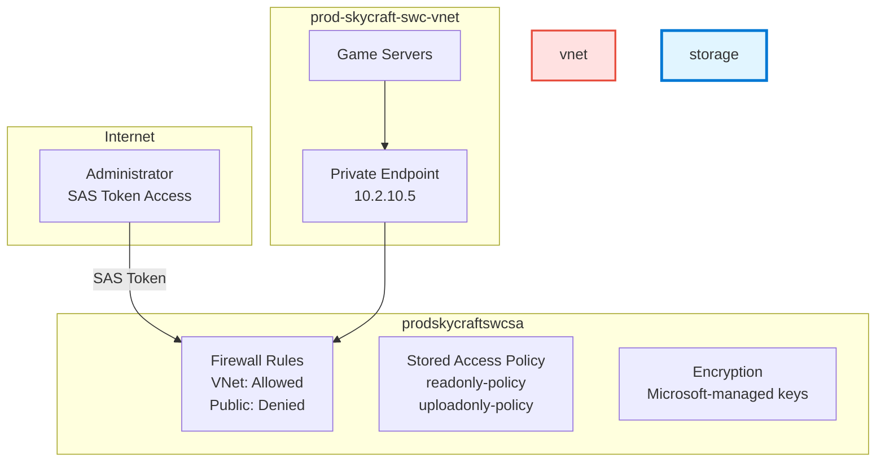

# Lab 4.4: Configure Storage Access and Security (1.5 hours)

## 🎯 Learning Objectives

By completing this lab, you will:

- Configure Azure Storage firewalls and virtual networks
- Create and use shared access signature (SAS) tokens
- Configure stored access policies
- Manage access keys and implement key rotation
- Configure storage account encryption

---

## 🏗️ Architecture Overview

## 📋 Real-World Scenario

**Situation**: SkyCraft storage contains sensitive player data and game assets. Public access must be restricted, and access should only be granted through secure, time-limited tokens or from trusted networks.

**Your Task**: Secure storage accounts with network rules, create SAS tokens for external access, implement stored access policies for token management, and verify encryption settings.

## ⏱️ Estimated Time: 1.5 hours

- **Section 1**: Storage Security Fundamentals (15 min)
- **Section 2**: Configure Firewalls and Virtual Networks (30 min)
- **Section 3**: Shared Access Signatures (30 min)
- **Section 4**: Stored Access Policies and Key Management (15 min)

## ✅ Prerequisites

Before starting this lab:

- [ ] Completed Lab 4.3: Azure Files
- [ ] Storage account exists: `prodskycraftswcsa`
- [ ] Virtual network exists: `prod-skycraft-swc-vnet`

---

## 📖 Section 1: Storage Security Fundamentals (15 min)

### Storage Security Layers

Azure Storage provides multiple security layers:

1. **Network Security** — Firewalls, VNet rules, private endpoints
2. **Authentication** — Access keys, SAS tokens, Azure AD
3. **Authorization** — RBAC, stored access policies
4. **Encryption** — At-rest (always on), in-transit (HTTPS)

### SAS Token Types

| Type                    | Scope                             | Use Case           |
| ----------------------- | --------------------------------- | ------------------ |
| **Account SAS**         | Entire storage account            | Admin tools        |
| **Service SAS**         | Single service (blob, file, etc.) | Application access |
| **User delegation SAS** | Azure AD identity                 | Most secure option |

---

## 📖 Section 2: Configure Firewalls and Virtual Networks (30 min)

### Step 4.4.1: Configure Network Rules

1. Navigate to **Azure Portal** → `prodskycraftswcsa`
2. Go to **Security + networking** → **Networking**
3. Under **Firewalls and virtual networks**:

| Setting               | Value                                                       |
| --------------------- | ----------------------------------------------------------- |
| Public network access | **Enabled from selected virtual networks and IP addresses** |

4. Under **Virtual networks**, click **+ Add existing virtual network**
5. Select:
   - Subscription: Your subscription
   - Virtual network: `prod-skycraft-swc-vnet`
   - Subnets: Select all relevant subnets

6. Click **Add**

### Step 4.4.2: Add Your IP Address (for testing)

1. Under **Firewall**, check **Add your client IP address**
2. Note the IP address added
3. Click **Save**

**Expected Result**: Storage account only accessible from the VNet and your IP.

### Step 4.4.3: Configure Resource Instances Access

1. Under **Resource instances**, you can allow Azure services like Azure Backup
2. Add exception for **Microsoft.Backup** if using Azure Backup

### Step 4.4.4: Test Network Restriction

1. Temporarily remove your IP from the allowlist
2. Try to access storage via Azure Portal
3. Observe the access denied message
4. Re-add your IP

---

## 📖 Section 3: Shared Access Signatures (30 min)

### Step 4.4.5: Generate Account-Level SAS

1. Navigate to `prodskycraftswcsa` → **Security + networking** → **Shared access signature**
2. Configure permissions:

| Setting                | Value                  |
| ---------------------- | ---------------------- |
| Allowed services       | ☑️ Blob ☑️ File        |
| Allowed resource types | ☑️ Container ☑️ Object |
| Allowed permissions    | ☑️ Read ☑️ List        |
| Start time             | Now                    |
| Expiry time            | +24 hours              |
| Allowed protocols      | **HTTPS only**         |

3. Click **Generate SAS and connection string**
4. Copy the **SAS token** and **Blob service SAS URL**

### Step 4.4.6: Test SAS Token

1. Open a new browser tab (incognito mode)
2. Navigate to: `https://prodskycraftswcsa.blob.core.windows.net/game-assets?restype=container&comp=list&<SAS_TOKEN>`
3. You should see XML listing of the container

### Step 4.4.7: Generate Service-Level SAS for Blob

1. Navigate to **Containers** → `game-assets`
2. Upload a test file
3. Click on the blob → **Generate SAS**
4. Configure:

| Setting        | Value           |
| -------------- | --------------- |
| Signing method | **Account key** |
| Permissions    | ☑️ Read         |
| Expiry         | +1 hour         |

5. Click **Generate SAS token and URL**
6. Copy and test the **Blob SAS URL**

---

## 📖 Section 4: Stored Access Policies and Key Management (15 min)

### Step 4.4.8: Create Stored Access Policy

1. Navigate to **Containers** → `game-assets`
2. Click **Access policy**
3. Under **Stored access policies**, click **+ Add policy**
4. Configure:

| Setting     | Value             |
| ----------- | ----------------- |
| Identifier  | `readonly-policy` |
| Permissions | ☑️ Read ☑️ List   |
| Start time  | Now               |
| Expiry time | +30 days          |

5. Click **OK** → **Save**

### Step 4.4.9: Generate SAS Using Stored Access Policy

1. Select the test blob
2. Click **Generate SAS**
3. Select **Stored access policy**: `readonly-policy`
4. Click **Generate SAS token and URL**

> **Advantage**: If you need to revoke access, modify or delete the stored access policy. All SAS tokens referencing it become invalid immediately.

### Step 4.4.10: Review Access Key Rotation

1. Navigate to **Security + networking** → **Access keys**
2. Note you have two keys (key1, key2) for rotation
3. Best practice:
   - Use key1 for applications
   - When rotating, update apps to use key2
   - Regenerate key1
   - Update apps back to key1
   - Regenerate key2

### Step 4.4.11: Verify Encryption Settings

1. Navigate to **Security + networking** → **Encryption**
2. Verify:
   - Encryption type: **Microsoft-managed keys**
   - This is always-on for Azure Storage

---

## ✅ Lab Checklist

- [ ] Network rules configured (VNet access, client IP)
- [ ] Account-level SAS generated and tested
- [ ] Service-level SAS generated for blob
- [ ] Stored access policy created
- [ ] SAS using stored access policy generated
- [ ] Encryption settings verified

**For detailed verification**, see [lab-checklist-4.4.md](lab-checklist-4.4.md)

## 🔧 Troubleshooting

### Issue 1: SAS token returns "AuthorizationFailure"

**Symptom**: 403 error when using SAS token

**Solution**:

- Check token hasn't expired
- Verify permissions match the operation
- Ensure HTTPS is used if required

### Issue 2: Cannot access storage after enabling firewall

**Symptom**: All requests blocked

**Solution**:

- Verify your IP is in the allowlist
- Check VNet service endpoints are enabled
- Use "Allow Azure services" if needed

## 🎓 Knowledge Check

1. **What is the advantage of using stored access policies over ad-hoc SAS tokens?**

   

     
**Click to see the answer**

   **Answer**: Stored access policies allow you to revoke access by modifying or deleting the policy. Ad-hoc SAS tokens cannot be revoked - you must regenerate the storage account key, invalidating all tokens.
   

2. **What is the difference between service endpoints and private endpoints?**

   

     
**Click to see the answer**

   **Answer**: Service endpoints route traffic from a VNet to Azure services over the Azure backbone but use public IPs. Private endpoints assign a private IP from your VNet to the storage account, keeping all traffic on the private network.
   

3. **When should you use User Delegation SAS instead of Account SAS?**

   

     
**Click to see the answer**

   **Answer**: User Delegation SAS is more secure because it uses Azure AD credentials instead of the storage account key, supports shorter token lifetimes, and can be audited through Azure AD.
   

## 📚 Additional Resources

- [Configure Azure Storage firewalls and virtual networks](https://learn.microsoft.com/azure/storage/common/storage-network-security)
- [Grant limited access with SAS](https://learn.microsoft.com/azure/storage/common/storage-sas-overview)
- [Define stored access policies](https://learn.microsoft.com/azure/storage/common/storage-stored-access-policy-define)

## 📌 Module Navigation

[← Lab 4.3: Azure Files](../4.3-azure-files/lab-guide-4.3.md)

[Back to Module 4 Index →](../README.md)

## 📝 Lab Summary

**What You Accomplished:**

✅ Configured network security rules for storage access
✅ Created and tested SAS tokens for secure external access
✅ Implemented stored access policies for token management
✅ Verified encryption and key management practices

**Time Spent**: ~1.5 hours

**Module 4 Complete!** You've successfully implemented Azure Storage for SkyCraft with proper security, redundancy, and data protection. Continue to **Module 5: Monitor and Maintain Azure Resources**.
