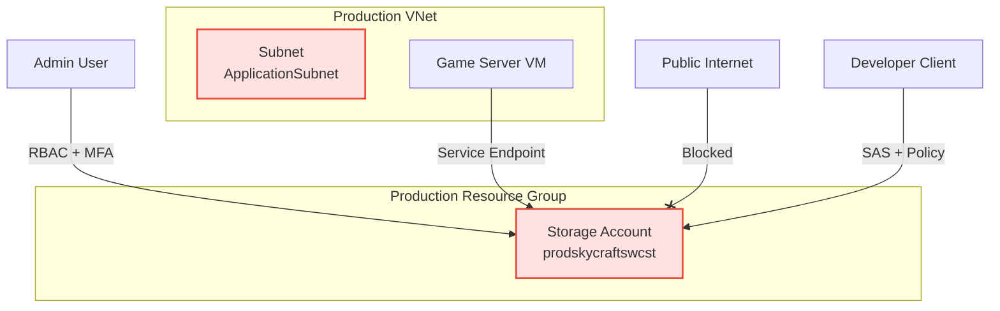

# Lab 4.4: Implementing Storage Security (2.5 hours)

## 🎯 Learning Objectives

By completing this lab, you will:

- Configure Azure Storage firewalls and virtual networks to restrict access
- Create and manage Shared Access Signature (SAS) tokens and Stored Access Policies
- Manage and rotate Storage Account Keys
- Implement Role-Based Access Control (RBAC) for storage data plane access
- Securely connect Azure resources using Service Endpoints

---

## 🏗️ Architecture Overview

The following diagram illustrates the secure storage architecture you will implement:

## 📋 Real-World Scenario

**Situation**: The SkyCraft game assets are stored in Azure Blob Storage. Currently, the storage account is accessible from anywhere on the internet. Additionally, developers have been using long-lived SAS tokens that cannot be easily revoked if a laptop is lost, and the primary Storage Account Key hasn't been rotated in months.

**Your Task**:

1. Lock down network access to only the VNet and authorized IPs.
2. Implement **Stored Access Policies** to allow revocable SAS tokens for developers.
3. Perform a **Key Rotation** ceremony to secure the root of trust.
4. Transition strictly to **Azure AD RBAC** for ongoing administrative access.

---

## ⏱️ Estimated Time: 2.5 hours

- **Section 1**: Network Security (Firewalls & Service Endpoints) (40 min)
- **Section 2**: Key Management & Rotation (20 min)
- **Section 3**: Advanced SAS Management (Stored Access Policies) (45 min)
- **Section 4**: Identity-Based Access (RBAC) (30 min)
- **Knowledge Check**: (15 min)

---

## ✅ Prerequisites

Before starting this lab:

- [ ] Completed **Lab 4.1: Configure Storage Accounts**
- [ ] Completed **Lab 2.1: Virtual Networks** (Existing VNet required)
- [ ] User account with **Owner** or **User Access Administrator** role

---

## 📖 Section 1: Network Security (Firewalls & Service Endpoints) (40 min)

### Step 4.4.1: Enable Service Endpoint on VNet

1. Navigate to **Virtual Networks** > `prod-skycraft-swc-vnet` > **Subnets**.
2. Select **ApplicationSubnet**.
3. In **Service endpoints**, select `Microsoft.Storage`.
4. Click **Save**.

### Step 4.4.2: Configure Storage Firewall

1. Navigate to Storage Account: `prodskycraftswcst`.
2. Go to **Networking**.
3. Change **Public network access** to `Enabled from selected virtual networks and IP addresses`.
4. Add **Existing virtual network**: `prod-skycraft-swc-vnet` / `ApplicationSubnet`.
5. Check **Add your client IP address**.
6. Click **Save**.

**Validation**: Attempt to access the storage account from a different network (e.g., mobile hotspot) or disable the IP rule temporarily to verify access is blocked.

---

## 📖 Section 2: Key Management & Rotation (20 min)

### What are Access Keys?

Access keys grant "Super Admin" permissions to the entire storage account. If leaked, an attacker can delete everything. They should be rotated regularly.

### Step 4.4.3: View and Regenerate Keys

1. In your Storage Account, go to **Security + networking** > **Access keys**.
2. Note the two keys: **key1** and **key2**.
3. **Scenario**: Imagine `key1` was hardcoded in a script that a departing employee had.
4. Click the **Rotate** icon (circular arrows) next to **key1**.
5. Confirm the regeneration.

> [!WARNING]
> Regenerating a key immediately invalidates any applications or SAS tokens using it. In production, you would update apps to use `key2` first, then rotate `key1`.

### Step 4.4.4: Lock Keys (Optional)

1. Go to **Configuration**.
2. Observe the **Allow storage account key access** setting.
   - _Note_: We will leave this **Enabled** for the SAS section, but in a pure RBAC environment, this should be Disabled.

---

## 📖 Section 3: Advanced SAS Management (Stored Access Policies) (45 min)

### Why Stored Access Policies?

A standard SAS token is a standalone "bearer token." If you issue one valid for 1 year, you cannot revoke it without rotating the entire Account Key (breaking everyone). **Stored Access Policies** solve this by grouping SAS tokens under a container-level policy that _can_ be modified or deleted.

### Step 4.4.5: Create a Container and Access Policy

1. Go to **Data storage** > **Containers**.
2. Create a new container named `dev-assets`.
3. Enter the container and go to **Settings** > **Access policy**.
4. Click **+ Add policy**.
   - **Identifier**: `DevTeamPolicy`
   - **Permissions**: Read, List
   - **Start time**: Today
   - **Expiry time**: 1 month from now
5. Click **OK** and **Save**.

### Step 4.4.6: Generate a SAS Linked to Policy

1. Stay in the `dev-assets` container.
2. Go to **Settings** > **Shared access tokens**.
3. **Signing method**: Account key.
4. **Stored access policy**: Select `DevTeamPolicy`.
   - _Notice_: Creating a SAS from a policy disables the Start/Expiry fields because they are inherited from the policy.
5. Click **Generate SAS token and URL**.
6. Copy the **Blob SAS URL**.

### Step 4.4.7: Revocation Test

1. Open a new InPrivate window and test the SAS URL (it should verify or list the container).
2. Go back to **Access policy** in the portal.
3. Edit `DevTeamPolicy` and **REMOVE** the "Read" and "List" permissions (or delete the policy).
4. Click **Save**.
5. Refresh the InPrivate window.

**Expected Result**: Access is denied immediately (or within 30 seconds). You successfully revoked access without rotating the storage keys!

---

## 📖 Section 4: Identity-Based Access (RBAC) (30 min)

### Step 4.4.8: Assign RBAC Role

1. Go to **Access control (IAM)**.
2. Click **+ Add** > **Add role assignment**.
3. Select **Storage Blob Data Contributor** (allows read/write).
4. Assign to your user account.
5. Click **Review + assign**.

### Step 4.4.9: Verify Data Plane Access

1. Open **Storage Browser** (in Portal) or use Azure Storage Explorer.
2. Ensure you are effectively using OAuth/Entra ID mode.
3. Upload a file to `dev-assets`.
4. Delete the file.

**Expected Result**: The generic "Owner" role creates resources, but the "Storage Blob Data Contributor" role is what allowed you to actually read/write the blob content.

---

## ✅ Lab Checklist

- [ ] Network restricted to VNet and Client IP
- [ ] Storage Key 1 successfully rotated
- [ ] Stored Access Policy `DevTeamPolicy` created
- [ ] Revocation tested (SAS linked to policy failed after policy update)
- [ ] `Storage Blob Data Contributor` assigned and verified

**For detailed verification**, see [lab-checklist-4.4.md](lab-checklist-4.4.md)

## 🔧 Troubleshooting

### Issue 1: Access Policy changes take time

**Symptom**: You removed permissions from the policy but the SAS still works.
**Solution**: It can take up to 30 seconds for policy updates to propagate. Wait and retry.

### Issue 2: "This request is not authorized" with RBAC

**Symptom**: You are an Owner but get 403 errors viewing data.
**Solution**: Azure Storage data plane access requires explicit **Storage Blob Data** roles. Being an ARM Owner is not sufficient for data access if "Use Azure AD" is selected.

## 🎓 Knowledge Check

1. **How do you revoke a SAS token that was generated WITHOUT a specific stored access policy?**

   

     
**Click to see the answer**

   **Answer**: You must regenerate the Account Key that was used to sign the SAS token. This will invalidate ALL tokens signed with that key.
   

2. **What is the recommended key rotation strategy?**

   

     
**Click to see the answer**

   **Answer**: Update applications to use Key 2. Regenerate Key 1. Update applications to use Key 1. Regenerate Key 2. (Active-Passive rotation).
   

## 📚 Additional Resources

- [Define a stored access policy](https://learn.microsoft.com/en-us/azure/storage/blobs/sas-service-create-sas-with-stored-access-policy)
- [Optimize cost and performance with key rotation](https://learn.microsoft.com/en-us/azure/storage/common/storage-account-keys-manage?tabs=azure-portal#rotate-access-keys)

## 📌 Module Navigation

[← Back to Module 4 Index](../README.md)

[Next Lab: 5.1 Monitor Resources →](../../module-5-monitor/5.1-monitor-resources/lab-guide-5.1.md)

## 📝 Lab Summary

**What You Accomplished:**

✅ Secured storage network perimeter
✅ Performed key rotation ceremony
✅ Implemented revocable access with Stored Access Policies
✅ Enforced identity-based data access

**Time Spent**: ~2.5 hours
