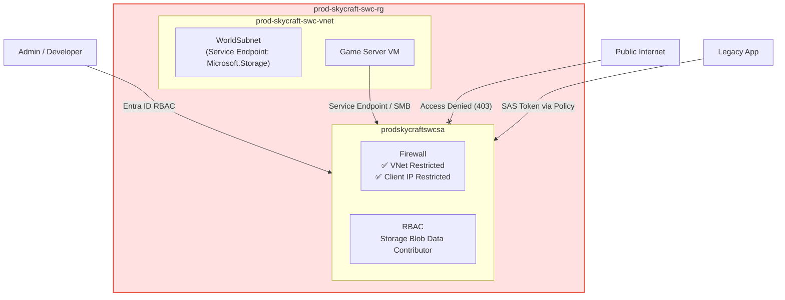
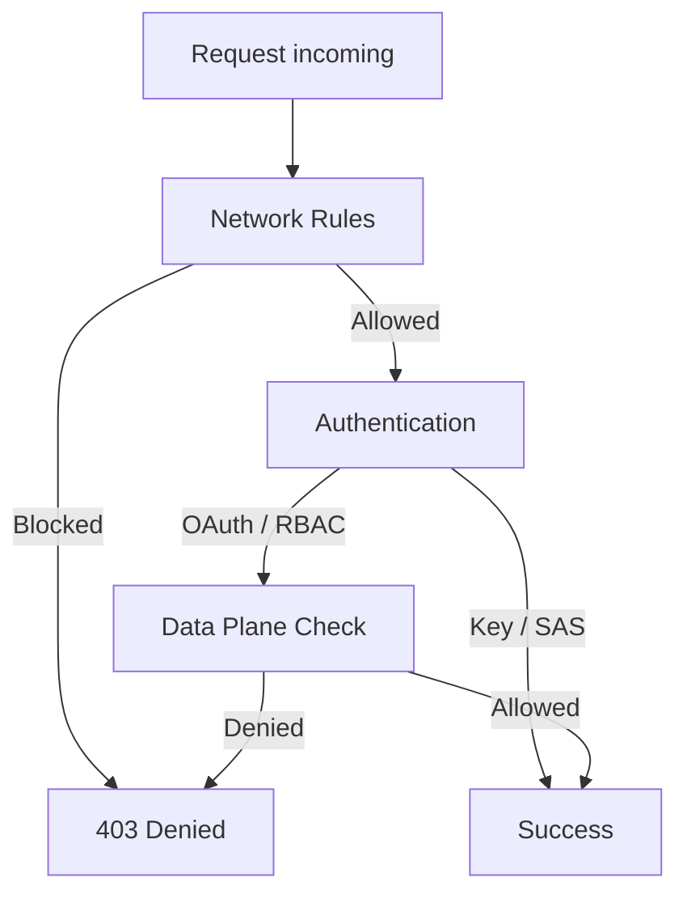
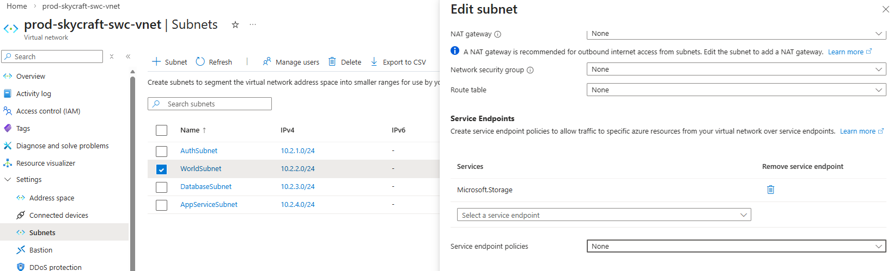
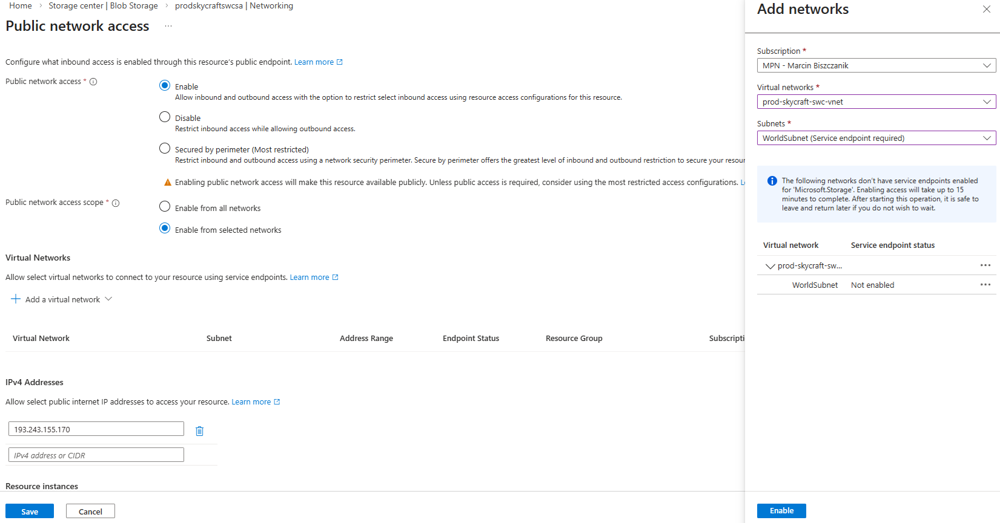

# Lab 4.4: Implementing Storage Security (2.5 hours)

## 🎯 Learning Objectives

By completing this lab, you will:

- **Configure** Azure Storage firewalls and virtual network rules to restrict access
- **Generate** ad-hoc Shared Access Signature (SAS) tokens and understand their limitations
- **Create** Stored Access Policies for revocable delegated access
- **Implement** Role-Based Access Control (RBAC) for storage data plane operations
- **Secure** Azure resource connectivity using Service Endpoints

---

## 🏗️ Architecture Overview

### Topology



### Access Model



## 📋 Real-World Scenario

**Situation**: The SkyCraft game assets are stored in Azure Blob Storage. Currently, the storage account is accessible from anywhere on the internet. Developers have been using long-lived SAS tokens that cannot be easily revoked if a laptop is lost, and the primary Storage Account Key hasn't been rotated in months.

**Your Task**: You will implement a defense-in-depth strategy:

1. Lock down network access to only the VNet and authorized IPs.
2. Generate **ad-hoc SAS tokens** and experience their limitations first-hand.
3. Upgrade to **Stored Access Policies** for revocable delegated access.
4. Transition to **Entra ID RBAC** for ongoing administrative access.

**Business Impact**:

- **Compliance**: Meets security auditing requirements for data isolation.
- **Risk Mitigation**: Limits the blast radius of a leaked SAS token.
- **Operational Excellence**: Progressive access model from shared keys to identity-based auth.

## ⏱️ Estimated Time: 2.5 hours

- **Section 1**: Network Security — Firewalls & Service Endpoints (40 min)
- **Section 2**: Delegated Access — Ad-hoc SAS Tokens (20 min)
- **Section 3**: Revocable Access — Stored Access Policies (45 min)
- **Section 4**: Identity-Based Access — RBAC (25 min)

## ✅ Prerequisites

Before starting this lab:

- [ ] Completed **Lab 2.1: Virtual Networks** (Existing VNet required)
- [ ] Completed **Lab 4.1: Storage Accounts** (Production Storage Account exists)
- [ ] Account with **User Access Administrator** or **Owner** role on the subscription

### Prerequisite Verification

```bash
# Verify the VNet and subnet exist
az network vnet show \
  --resource-group prod-skycraft-swc-rg \
  --name prod-skycraft-swc-vnet \
  --query "{Name:name, Subnets:subnets[].name}" \
  --output table

# Verify the storage account exists
az storage account show \
  --name prodskycraftswcsa \
  --resource-group prod-skycraft-swc-rg \
  --query "{Name:name, Location:location, Kind:kind}" \
  --output table
```

---

## 📖 Section 1: Network Security (40 min)

### What is Network Isolation for Storage?

By default, Storage Accounts accept connections from clients on any network, including the public internet. This is a significant security risk for production workloads. Azure provides two methods to restrict network access:

1. **Service Endpoints**: Optimizes the path between a VNet and Azure Storage over the Azure backbone network. Traffic never leaves Microsoft's network, and you can restrict the storage account to only accept traffic from specific subnets.
2. **Private Endpoints**: Assigns a private IP address from your VNet to the storage account. Traffic flows entirely through the private network. More secure, but incurs additional cost.

> **SkyCraft Choice**: We use **Service Endpoints** in this lab as a cost-effective way to secure the World Server traffic while blocking general internet access. For a production environment handling sensitive player data, you would upgrade to Private Endpoints.

### Step 4.4.1: Enable Service Endpoint on VNet

#### Option 1: Azure Portal (GUI)

1. Navigate to **Virtual Networks** > `prod-skycraft-swc-vnet` > **Subnets**.
2. Select **WorldSubnet**.
3. In **Service endpoints**, select `Microsoft.Storage`.
4. Click **Save**.

#### Option 2: Azure CLI

```bash
az network vnet subnet update \
  --resource-group prod-skycraft-swc-rg \
  --vnet-name prod-skycraft-swc-vnet \
  --name WorldSubnet \
  --service-endpoints Microsoft.Storage
```

#### Option 3: PowerShell

```powershell
$vnet = Get-AzVirtualNetwork -Name 'prod-skycraft-swc-vnet' -ResourceGroupName 'prod-skycraft-swc-rg'
$subnet = Get-AzVirtualNetworkSubnetConfig -Name 'WorldSubnet' -VirtualNetwork $vnet

Set-AzVirtualNetworkSubnetConfig -Name 'WorldSubnet' `
  -VirtualNetwork $vnet `
  -AddressPrefix $subnet.AddressPrefix `
  -ServiceEndpoint 'Microsoft.Storage'
$vnet | Set-AzVirtualNetwork
```

**Expected Result**: The `WorldSubnet` now shows `Microsoft.Storage` under Service Endpoints with status **Succeeded**.



### Step 4.4.2: Configure Storage Firewall

#### Option 1: Azure Portal (GUI)

1. Navigate to Storage Account: `prodskycraftswcsa`.
2. Go to **Networking**.
3. Change **Public network access** to `Enabled from selected virtual networks and IP addresses`.
4. Click **+ Add existing virtual network**: select `prod-skycraft-swc-vnet` / `WorldSubnet`.
5. Check **Add your client IP address**.
6. Click **Enable** -> **Add** + **Save**.

#### Option 2: Azure CLI

```bash
# Set default action to Deny
az storage account update \
  --name prodskycraftswcsa \
  --resource-group prod-skycraft-swc-rg \
  --default-action Deny

# Add VNet rule
az storage account network-rule add \
  --account-name prodskycraftswcsa \
  --resource-group prod-skycraft-swc-rg \
  --vnet-name prod-skycraft-swc-vnet \
  --subnet WorldSubnet

# Add your client IP (replace with your actual IP)
az storage account network-rule add \
  --account-name prodskycraftswcsa \
  --resource-group prod-skycraft-swc-rg \
  --ip-address <YOUR_CLIENT_IP>
```

#### Option 3: PowerShell

```powershell
# Set default action to Deny
Update-AzStorageAccountNetworkRuleSet -ResourceGroupName 'prod-skycraft-swc-rg' `
  -Name 'prodskycraftswcsa' `
  -DefaultAction Deny

# Add VNet rule
$subnet = (Get-AzVirtualNetwork -Name 'prod-skycraft-swc-vnet' -ResourceGroupName 'prod-skycraft-swc-rg').Subnets |
  Where-Object { $_.Name -eq 'WorldSubnet' }
Add-AzStorageAccountNetworkRule -ResourceGroupName 'prod-skycraft-swc-rg' `
  -Name 'prodskycraftswcsa' `
  -VirtualNetworkResourceId $subnet.Id

# Add your client IP (replace with your actual IP)
Add-AzStorageAccountNetworkRule -ResourceGroupName 'prod-skycraft-swc-rg' `
  -Name 'prodskycraftswcsa' `
  -IPAddressOrRange '<YOUR_CLIENT_IP>'
```

**Expected Result**: Accessing the storage account from an unauthorized IP (e.g., your phone) results in an **HTTP 403 Forbidden** error.



---

## 📖 Section 2: Delegated Access — Ad-hoc SAS Tokens (20 min)

### What is a Shared Access Signature (SAS)?

A **Shared Access Signature (SAS)** is a URI that grants restricted access to Azure Storage resources. Instead of sharing your account key (which grants full control), you create a SAS token that specifies exactly which resources, which permissions, and for how long.

There are three types of SAS:

| Type                    | Signed With | Scope                              | Revocable?              |
| :---------------------- | :---------- | :--------------------------------- | :---------------------- |
| **Account SAS**         | Account Key | Entire account (multiple services) | Only via key rotation   |
| **Service SAS**         | Account Key | Single service (e.g., Blob only)   | Only via key rotation   |
| **User Delegation SAS** | Entra ID    | Single service                     | Yes (revoke user token) |

In this section, you will generate an **ad-hoc Service SAS** to experience its limitations. In Section 3, you'll learn how Stored Access Policies solve those limitations.

> **SkyCraft Choice**: We start with ad-hoc SAS so you experience the problem first-hand — once issued, an ad-hoc SAS **cannot be revoked** without rotating the entire account key. This motivates the upgrade to Stored Access Policies in Section 3.

### Step 4.4.3: Generate an Ad-hoc SAS Token

#### Option 1: Azure Portal (GUI)

1. Navigate to Storage Account: `prodskycraftswcsa`.
2. Go to **Security + networking** > **Shared access signature**.
3. Configure the following:

| Field                          | Value                           |
| ------------------------------ | ------------------------------- |
| Allowed services               | **Blob** only                   |
| Allowed resource types         | **Container** + **Object**      |
| Allowed permissions            | **Read**, **List**              |
| Blob versioning permissions    | ❌ Unchecked                    |
| Allowed blob index permissions | ❌ Unchecked                    |
| Start and expiry date/time     | Start: now, Expiry: **+1 hour** |
| Allowed IP addresses           | _(leave empty)_                 |
| Allowed protocols              | **HTTPS only**                  |
| Preferred routing tier         | **Basic (default)**             |
| Signing key                    | **key1**                        |

4. Click **Generate SAS and connection string**.
5. Copy the **Blob service SAS URL**.

#### Option 2: Azure CLI

```bash
# Generate an account SAS token (1-hour expiry, read+list on blobs)
EXPIRY=$(date -u -d "+1 hour" '+%Y-%m-%dT%H:%MZ')

az storage account generate-sas \
  --account-name prodskycraftswcsa \
  --resource-group prod-skycraft-swc-rg \
  --services b \
  --resource-types co \
  --permissions rl \
  --expiry $EXPIRY \
  --https-only \
  --output tsv
```

#### Option 3: PowerShell

```powershell
$ctx = (Get-AzStorageAccount -ResourceGroupName 'prod-skycraft-swc-rg' -Name 'prodskycraftswcsa').Context

New-AzStorageAccountSASToken -Context $ctx `
  -Service Blob `
  -ResourceType Container,Object `
  -Permission rl `
  -ExpiryTime (Get-Date).AddHours(1) `
  -Protocol HttpsOnly
```

**Expected Result**: A SAS token string is generated (starts with `?sv=`). This token grants read and list access to all blob containers for 1 hour.

### Step 4.4.4: Test the Ad-hoc SAS Token

Test the token by listing blobs. If no containers exist yet, the empty list confirms the token works.

#### Option 1: Azure CLI

```bash
# Use the SAS token to list containers (replace <SAS_TOKEN> with your token)
az storage container list \
  --account-name prodskycraftswcsa \
  --sas-token "<SAS_TOKEN>" \
  --output table
```

#### Option 2: Browser

Paste this URL into your browser (replace `<SAS_TOKEN>`):

```
https://prodskycraftswcsa.blob.core.windows.net/?comp=list&<SAS_TOKEN>
```

**Expected Result**: An XML response listing containers (or an empty list). This proves the SAS grants access without requiring the account key.

> [!IMPORTANT]
> **The problem with ad-hoc SAS**: If this token were leaked, you could NOT revoke it. It will remain valid until it expires (1 hour in our case). For a token with a longer expiry, your only option would be to rotate the storage account key — which invalidates ALL tokens and connections signed with that key. Section 3 fixes this.

---

## 📖 Section 3: Revocable Access — Stored Access Policies (45 min)

### What are Stored Access Policies?

In Section 2, you experienced that an ad-hoc SAS token **cannot be revoked** once issued. A **Stored Access Policy** solves this by acting as a named access control entry on the container itself — deleting the policy immediately revokes all tokens linked to it.

| Feature          | Ad-hoc SAS (Section 2)               | Stored Access Policy             |
| :--------------- | :----------------------------------- | :------------------------------- |
| **Revocation**   | ❌ Impossible (without Key Rotation) | ✅ Immediate (delete policy)     |
| **Token Update** | Generate new token                   | Update policy (token stays same) |
| **Limit**        | None                                 | 5 per container                  |
| **Best For**     | Quick, one-off access                | Ongoing delegated access         |

> **SkyCraft Choice**: We use **Stored Access Policies** for developer access because a stolen token can be revoked in seconds without disrupting the entire storage account. This allows granular incident response.

### Step 4.4.4: Create a Container for SAS Testing

#### Option 1: Azure Portal (GUI)

1. Navigate to Storage Account: `prodskycraftswcsa`.
2. Go to **Data storage** > **Containers**.
3. Click **+ Container**.
4. Name: `dev-assets`.
5. **Public access level**: Private (no anonymous access).
6. Click **Create**.

#### Option 2: Azure CLI

```bash
az storage container create \
  --name dev-assets \
  --account-name prodskycraftswcsa \
  --auth-mode login \
  --public-access off
```

#### Option 3: PowerShell

```powershell
$ctx = (Get-AzStorageAccount -ResourceGroupName 'prod-skycraft-swc-rg' -Name 'prodskycraftswcsa').Context
New-AzStorageContainer -Name 'dev-assets' -Context $ctx -Permission Off
```

**Expected Result**: Container `dev-assets` appears in the storage account with **Private** access level.

### Step 4.4.5: Create Stored Access Policy

#### Option 1: Azure Portal (GUI)

1. Select the `dev-assets` container.
2. Go to **Settings** > **Access policy**.
3. Click **+ Add policy**:

| Field       | Value              |
| ----------- | ------------------ |
| Identifier  | `DevRevokePolicy`  |
| Permissions | Read, List         |
| Expiry time | 1 month from today |

4. Click **OK** and then **Save**.

#### Option 2: Azure CLI

```bash
# Create stored access policy (set expiry 30 days from now)
az storage container policy create \
  --container-name dev-assets \
  --name DevRevokePolicy \
  --account-name prodskycraftswcsa \
  --permissions rl \
  --expiry $(date -u -d "+30 days" '+%Y-%m-%dT%H:%MZ') \
  --auth-mode login
```

#### Option 3: PowerShell

```powershell
$ctx = (Get-AzStorageAccount -ResourceGroupName 'prod-skycraft-swc-rg' -Name 'prodskycraftswcsa').Context
New-AzStorageContainerStoredAccessPolicy -Container 'dev-assets' `
  -Policy 'DevRevokePolicy' `
  -Permission rl `
  -ExpiryTime (Get-Date).AddDays(30) `
  -Context $ctx
```

**Expected Result**: The `DevRevokePolicy` appears under the container's access policies.

### Step 4.4.6: Generate and Test SAS Token via Policy

#### Option 1: Azure Portal (GUI)

1. In the `dev-assets` container, go to **Settings** > **Shared access tokens**.
2. Under **Stored access policy**, select `DevRevokePolicy`.
3. Click **Generate SAS token and URL**.
4. Copy the **Blob SAS URL** and test it in a browser (it should list blobs or succeed).

#### Option 2: Azure CLI

```bash
# Generate SAS from the stored policy
az storage container generate-sas \
  --name dev-assets \
  --account-name prodskycraftswcsa \
  --policy-name DevRevokePolicy \
  --output tsv
```

#### Option 3: PowerShell

```powershell
$ctx = (Get-AzStorageAccount -ResourceGroupName 'prod-skycraft-swc-rg' -Name 'prodskycraftswcsa').Context
New-AzStorageContainerSASToken -Name 'dev-assets' -Policy 'DevRevokePolicy' -Context $ctx
```

**Expected Result**: A SAS token is generated and grants read/list access to the container.

### Step 4.4.7: Revoke Access by Deleting the Policy

#### Option 1: Azure Portal (GUI)

1. Navigate to the `dev-assets` container > **Access policy**.
2. Click the **Delete** icon next to `DevRevokePolicy`.
3. Click **Save**.
4. Test the SAS URL again in your browser.

#### Option 2: Azure CLI

```bash
az storage container policy delete \
  --container-name dev-assets \
  --name DevRevokePolicy \
  --account-name prodskycraftswcsa \
  --auth-mode login
```

#### Option 3: PowerShell

```powershell
$ctx = (Get-AzStorageAccount -ResourceGroupName 'prod-skycraft-swc-rg' -Name 'prodskycraftswcsa').Context
Remove-AzStorageContainerStoredAccessPolicy -Container 'dev-assets' -Policy 'DevRevokePolicy' -Context $ctx
```

**Expected Result**: The previously working SAS URL now returns **403 Forbidden** — access revoked immediately.

---

## 📖 Section 4: Identity-Based Access — RBAC (25 min)

### What is Data Plane RBAC?

Azure has two distinct authorization planes:

- **Management Plane** (ARM): Controls the storage account itself (create, delete, configure). Governed by roles like Owner, Contributor.
- **Data Plane**: Controls the data inside the storage account (read, write, delete blobs/files). Requires specific data roles.

Even if you are an **Owner** of the subscription, you cannot read blob data unless you also have a **data plane role** like `Storage Blob Data Contributor`.

> **SkyCraft Choice**: We assign `Storage Blob Data Contributor` because it allows read/write/delete of blob data — exactly what game administrators need. For read-only analytics access, you would use `Storage Blob Data Reader` instead.

### Step 4.4.8: Assign Storage Blob Data Contributor Role

#### Option 1: Azure Portal (GUI)

1. Navigate to Storage Account: `prodskycraftswcsa`.
2. Go to **Access control (IAM)** > **+ Add** > **Add role assignment**.
3. Search for and select **Storage Blob Data Contributor**.
4. Click **Next**.
5. Under **Members**, click **+ Select members** and choose your user account.
6. Click **Review + assign**.

#### Option 2: Azure CLI

```bash
# Get your user principal ID
USER_ID=$(az ad signed-in-user show --query id -o tsv)

# Get the storage account resource ID
STORAGE_ID=$(az storage account show \
  --name prodskycraftswcsa \
  --resource-group prod-skycraft-swc-rg \
  --query id -o tsv)

# Assign the role
az role assignment create \
  --assignee $USER_ID \
  --role "Storage Blob Data Contributor" \
  --scope $STORAGE_ID
```

#### Option 3: PowerShell

```powershell
$userId = (Get-AzADUser -SignedIn).Id
$storageId = (Get-AzStorageAccount -ResourceGroupName 'prod-skycraft-swc-rg' -Name 'prodskycraftswcsa').Id

New-AzRoleAssignment -ObjectId $userId `
  -RoleDefinitionName 'Storage Blob Data Contributor' `
  -Scope $storageId
```

**Expected Result**: Your user account now appears under **Storage Blob Data Contributor** role assignments for this storage account.

### Step 4.4.9: Verify Identity-Based Access

#### Option 1: Azure Portal (GUI)

1. Navigate to Storage Account: `prodskycraftswcsa` > **Containers** > `dev-assets`.
2. At the top, ensure **Authentication method** is set to **Microsoft Entra user account** (not Access key).
3. Try uploading a file — it should succeed.

#### Option 2: Azure CLI

```bash
# Upload a test file using OAuth (--auth-mode login)
echo "RBAC test" > /tmp/rbac-test.txt
az storage blob upload \
  --account-name prodskycraftswcsa \
  --container-name dev-assets \
  --name rbac-test.txt \
  --file /tmp/rbac-test.txt \
  --auth-mode login

# List blobs using OAuth
az storage blob list \
  --account-name prodskycraftswcsa \
  --container-name dev-assets \
  --auth-mode login \
  --output table
```

#### Option 3: PowerShell

```powershell
# Create a test file
"RBAC test" | Out-File -FilePath "$env:TEMP\rbac-test.txt"

# Upload using OAuth context
$ctx = New-AzStorageContext -StorageAccountName 'prodskycraftswcsa' -UseConnectedAccount
Set-AzStorageBlobContent -Container 'dev-assets' `
  -File "$env:TEMP\rbac-test.txt" `
  -Blob 'rbac-test.txt' `
  -Context $ctx

# List blobs
Get-AzStorageBlob -Container 'dev-assets' -Context $ctx | Format-Table Name, Length, LastModified
```

**Expected Result**: File uploads and lists successfully when authenticated via Entra ID, proving that RBAC data plane access works without account keys.

---

## ✅ Lab Checklist

- [ ] `WorldSubnet` has `Microsoft.Storage` service endpoint enabled
- [ ] `prodskycraftswcsa` firewall restricted to VNet and Client IP
- [ ] Ad-hoc SAS token generated and tested
- [ ] Container `dev-assets` created with Private access
- [ ] `DevRevokePolicy` tested and verified for revocation
- [ ] `Storage Blob Data Contributor` assigned to your user
- [ ] Identity-based blob upload confirmed
- [ ] All resources tagged correctly (Project, Environment, CostCenter)

**For detailed verification**, see [lab-checklist-4.4.md](lab-checklist-4.4.md)

## 🔧 Troubleshooting

### Issue 1: "This request is not authorized" in Azure Portal

**Symptom**: After enabling the firewall, you cannot see containers or blobs in the Azure Portal.

**Root Cause**: The Portal uses your browser's public IP to connect to the storage data plane. If your IP is not in the firewall allowlist, the Portal's data operations are blocked (management plane still works).

**Solution**: Navigate to **Networking** > **Firewall** and check **Add your client IP address**. Click **Save** and wait 30 seconds.

### Issue 2: Key rotation breaks existing file share mounts

**Symptom**: Existing SMB file share mounts fail after rotating Key1.

**Root Cause**: SMB mounts authenticate with a specific access key. When that key is regenerated, the stored credential becomes invalid.

**Solution**: Use the dual-key strategy: switch all mounts to Key2 first, rotate Key1, update mounts to Key1, then rotate Key2.

### Issue 3: SAS token still works after policy deletion

**Symptom**: The SAS URL continues to work for 30-60 seconds after deleting the Stored Access Policy.

**Root Cause**: Azure Storage has eventual consistency for policy changes. Cached authorization decisions take time to expire.

**Solution**: Wait 30-60 seconds and retry. This is expected Azure behavior and not a security flaw — new requests will be rejected.

### Issue 4: "AuthorizationPermissionMismatch" when uploading via RBAC

**Symptom**: You assigned `Storage Blob Data Contributor` but blob uploads return a 403 error.

**Root Cause**: RBAC role assignments can take **up to 10 minutes** to propagate through Azure's authorization cache.

**Solution**: Wait 5-10 minutes after role assignment, then retry. Alternatively, open a new browser tab or CLI session to force a fresh token.

### Issue 5: Service Endpoint shows "Updating" for extended period

**Symptom**: The `Microsoft.Storage` service endpoint on the subnet remains in "Updating" status for more than 5 minutes.

**Root Cause**: The subnet may have dependent resources (VMs, NICs) that are being reconfigured to use the new endpoint route. Large subnets take longer.

**Solution**: Wait up to 15 minutes. If still stuck, check **Activity Log** on the VNet for errors. As a last resort, remove and re-add the endpoint.

## 🎓 Knowledge Check

1. **You issued a SAS token with a 5-year expiry. The laptop containing the token was stolen. How do you revoke it quickly?**

   <details>
     <summary>**Click to see the answer**</summary>

   **Answer**: If the SAS was created via a **Stored Access Policy**, delete the policy to revoke it immediately. If it was an **ad-hoc SAS**, you must rotate the Storage Account Access Key that was used to sign the token — this invalidates ALL tokens signed with that key, not just the stolen one.
   </details>

2. **Why does an Owner role on the subscription still need the 'Storage Blob Data Contributor' role to read blob data?**

   <details>
     <summary>**Click to see the answer**</summary>

   **Answer**: Azure separates the **Management Plane** (ARM operations like creating/deleting accounts) from the **Data Plane** (reading/writing blob contents). The Owner role only covers the management plane. Data plane access requires explicit data roles like `Storage Blob Data Contributor` or `Storage Blob Data Reader`.
   </details>

3. **What is the maximum number of Stored Access Policies per container?**

   <details>
     <summary>**Click to see the answer**</summary>

   **Answer**: You can have a maximum of **5** stored access policies per container, file share, table, or queue. If you need more granular delegation, consider using User Delegation SAS (signed with Entra ID credentials) which doesn't count toward this limit.
   </details>

4. **What is the difference between a Service Endpoint and a Private Endpoint for storage?**

   <details>
     <summary>**Click to see the answer**</summary>

   **Answer**: A **Service Endpoint** optimizes the route from a VNet subnet to Azure Storage over the Azure backbone, but the storage still has a public IP. A **Private Endpoint** assigns a private IP address from your VNet to the storage account, making it accessible only via private networking. Private Endpoints are more secure but incur additional cost.
   </details>

5. **What are the three types of SAS and when would you use each?**

   <details>
     <summary>**Click to see the answer**</summary>

   **Answer**: **Account SAS** grants access across multiple services (Blob, File, Queue, Table) — use for broad tooling access. **Service SAS** is scoped to a single service — use for application-specific delegation. **User Delegation SAS** is signed with Entra ID credentials instead of an account key — use when you want RBAC-governed, auditable, and revocable access without exposing storage keys.
   </details>

6. **A developer needs read-only access to blobs for an analytics pipeline. Which RBAC role is most appropriate?**

   <details>
     <summary>**Click to see the answer**</summary>

   **Answer**: **Storage Blob Data Reader**. This follows the principle of least privilege — it grants read and list access to blob data without the ability to write or delete. `Storage Blob Data Contributor` would be over-permissioned for read-only analytics.
   </details>

7. **You set the storage firewall to "Deny" by default. Can your Azure VMs still access the storage if they are in a peered VNet (not the same VNet)?**

   <details>
     <summary>**Click to see the answer**</summary>

   **Answer**: **No**, service endpoints are not transitive across VNet peering. The peered VNet would need its own service endpoint configured and must be added as an allowed network rule on the storage account. Alternatively, use Private Endpoints which work across peered VNets.
   </details>

## 📚 Additional Resources

- [Azure Storage Firewalls and Virtual Networks](https://learn.microsoft.com/azure/storage/common/storage-network-security)
- [Authorize access with Entra ID (RBAC)](https://learn.microsoft.com/azure/storage/blobs/authorize-access-azure-active-directory)
- [Define a Stored Access Policy](https://learn.microsoft.com/azure/storage/common/storage-sas-overview#stored-access-policies)
- [Manage Storage Account Keys](https://learn.microsoft.com/azure/storage/common/storage-account-keys-manage)
- [Microsoft Learn: Secure Azure Storage](https://learn.microsoft.com/training/modules/secure-azure-storage-account/)

## 📌 Module Navigation

[← Back to Module 4 Index](../README.md)

[← Previous Lab: 4.3 - Azure Files](../4.3-azure-files/lab-guide-4.3.md) | [Next Lab: 5.1 - Monitor Resources →](../../module-5-monitor/5.1-monitor-resources/lab-guide-5.1.md)

---

## 📝 Lab Summary

**What You Accomplished:**

✅ Secured the storage network perimeter using Service Endpoints and firewall rules
✅ Generated ad-hoc SAS tokens and experienced their revocation limitations
✅ Upgraded to revocable delegation via Stored Access Policies
✅ Enforced identity-based security using Entra ID RBAC on the data plane
✅ Verified defense-in-depth across network, SAS, and identity layers

**Infrastructure Deployed**:

| Resource             | Name                                 | Configuration                |
| -------------------- | ------------------------------------ | ---------------------------- |
| Service Endpoint     | `Microsoft.Storage` on `WorldSubnet` | VNet-integrated access       |
| Firewall Rule        | `prodskycraftswcsa`                  | VNet + Client IP only        |
| Container            | `dev-assets`                         | Private access level         |
| Stored Access Policy | `DevRevokePolicy`                    | Read, List (30-day expiry)   |
| RBAC Assignment      | `Storage Blob Data Contributor`      | Your user on storage account |

**Skills Gained**:

| Skill                         | AZ-104 Relevance            |
| ----------------------------- | --------------------------- |
| Configure storage firewalls   | Configure access to storage |
| Generate and test SAS tokens  | Configure access to storage |
| Create Stored Access Policies | Configure access to storage |
| Assign data plane RBAC roles  | Configure access to storage |

**Time Spent**: ~2.5 hours

**Ready for Module 5?** Next, you'll set up Azure Monitor to track the health and performance of all the infrastructure you've built.

---

_Note: With network isolation, ad-hoc and revocable SAS delegation, and identity-based RBAC now in place, the SkyCraft storage layer follows Azure's defense-in-depth model. This completes Module 4 — Storage, and you're ready to move into operational monitoring and maintenance._
