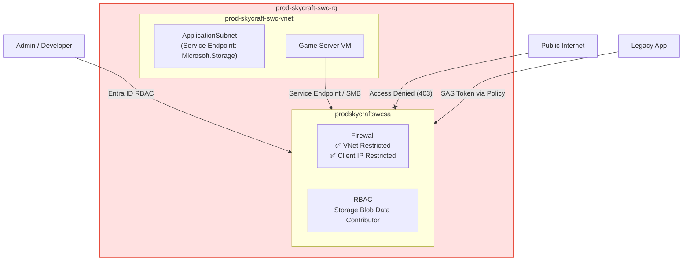
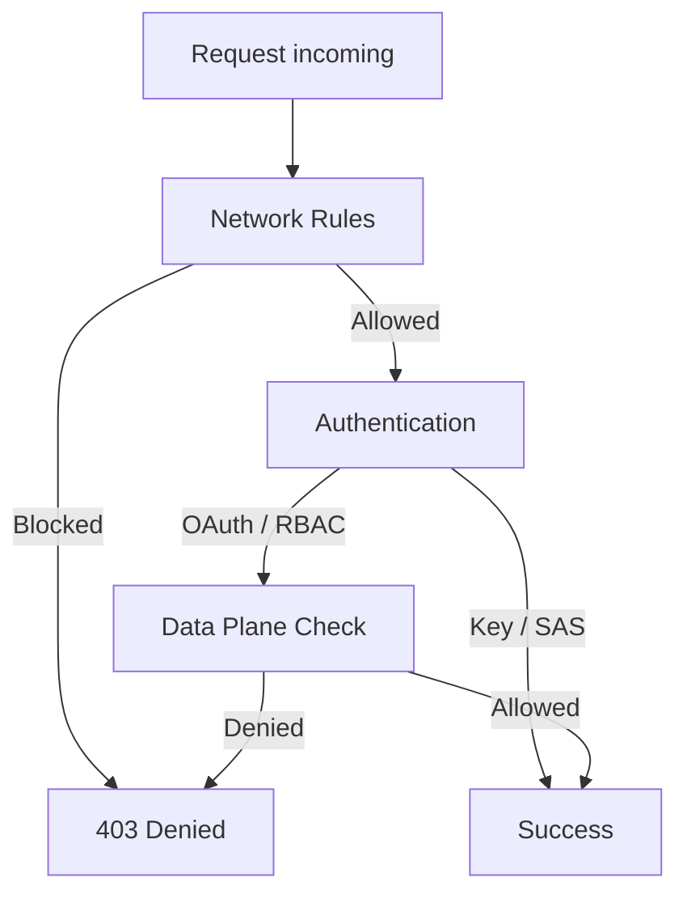

# Lab 4.4: Implementing Storage Security (2.5 hours)

## 🎯 Learning Objectives

By completing this lab, you will:

- Configure Azure Storage firewalls and virtual networks to restrict access
- Create and manage Shared Access Signature (SAS) tokens and Stored Access Policies
- Manage and rotate Storage Account Keys (Super Admin credentials)
- Implement Role-Based Access Control (RBAC) for storage data plane access
- Securely connect Azure resources using Service Endpoints

---

## 🏗️ Architecture Overview

### Topology



### Access Model



## 📋 Real-World Scenario

**Situation**: The SkyCraft game assets are stored in Azure Blob Storage. Currently, the storage account is accessible from anywhere on the internet. Additionally, developers have been using long-lived SAS tokens that cannot be easily revoked if a laptop is lost, and the primary Storage Account Key hasn't been rotated in months.

**Your Task**: You will implement a defense-in-depth strategy:

1. Lock down network access to only the VNet and authorized IPs.
2. Implement **Stored Access Policies** to allow revocable SAS tokens for developers.
3. Perform a **Key Rotation** ceremony to secure the root of trust.
4. Transition strictly to **Entra ID RBAC** for ongoing administrative access.

**Business Impact**:

- **Compliance**: Meets security auditing requirements for data isolation.
- **Risk Mitigation**: Limits the blast radius of a leaked SAS token.
- **Operational Excellence**: Established process for key rotation prevents technical debt.

## ⏱️ Estimated Time: 2.5 hours

- **Section 1**: Network Security (Firewalls & Service Endpoints) (40 min)
- **Section 2**: Key Management & Rotation (20 min)
- **Section 3**: Advanced SAS Management (Stored Access Policies) (45 min)
- **Section 4**: Identity-Based Access (RBAC) (30 min)

## ✅ Prerequisites

Before starting this lab:

- [ ] Completed **Lab 2.1: Virtual Networks** (Existing VNet required)
- [ ] Completed **Lab 4.1: Storage Accounts** (Production Storage Account exists)
- [ ] Account with **User Access Administrator** or **Owner** role on the subscription

---

## 📖 Section 1: Network Security (40 min)

### Deep Dive: Network Isolation

By default, Storage Accounts are accessible from the public internet. Secure organizations use one of two methods:

1. **Service Endpoints**: Optimizes the path between VNet and Storage over the Azure backbone.
2. **Private Endpoints**: Gives the storage a private IP inside your VNet (more secure, extra cost).

> **SkyCraft Choice**: We use **Service Endpoints** in this lab as a cost-effective way to secure the World Server traffic while blocking general internet access.

---

## ⚙️ Section 2: Configuration (1 hour)

### Step 4.4.1: Enable Service Endpoint on VNet

#### Option 1: Azure Portal

1. Navigate to **Virtual Networks** > `prod-skycraft-swc-vnet` > **Subnets**.
2. Select **ApplicationSubnet**.
3. In **Service endpoints**, select `Microsoft.Storage`.
4. Click **Save**.

#### Option 2: Azure CLI

```bash
az network vnet subnet update \
  --resource-group prod-skycraft-swc-rg \
  --vnet-name prod-skycraft-swc-vnet \
  --name ApplicationSubnet \
  --service-endpoints Microsoft.Storage
```

### Step 4.4.2: Configure Storage Firewall

#### Option 1: Azure Portal

1. Navigate to Storage Account: `prodskycraftswcsa`.
2. Go to **Networking**.
3. Change **Public network access** to `Enabled from selected virtual networks and IP addresses`.
4. Click **+ Add existing virtual network**: `prod-skycraft-swc-vnet` / `ApplicationSubnet`.
5. Check **Add your client IP address**.
6. Click **Save**.

**Expected Result**: Accessing the storage account from an unauthorized IP (e.g., your phone) results in an HTTP 403 error.

---

## 📖 Section 3: Advanced SAS Management (45 min)

### Deep Dive: Stored Access Policies vs Ad-hoc SAS

A standard SAS token is like a signed check—once issued, it cannot be stopped without changing the account key. A **Stored Access Policy** is like an authorized list; if you remove the item from the list, the token immediately stops working.

| Feature          | Ad-hoc SAS                        | Stored Access Policy                  |
| :--------------- | :-------------------------------- | :------------------------------------ |
| **Revocation**   | Impossible (without Key Rotation) | Immediate (Deleting Policy)           |
| **Token Update** | Generate new token                | Just update policy (token stays same) |
| **Limit**        | None                              | 5 per container                       |

---

## ⚙️ Section 4: Implementation (45 min)

### Step 4.4.3: Create Stored Access Policy

1. Go to **Data storage** > **Containers** > `scripts` (or any container).
2. Select **Settings** > **Access policy**.
3. Click **+ Add policy**:
   - **Identifier**: `DevRevokePolicy`
   - **Permissions**: Read, List
   - **Expiry**: 1 month from now
4. Click **OK** and **Save**.

### Step 4.4.4: Generate SAS via Policy

1. In the same container, select **Settings** > **Shared access tokens**.
2. **Stored access policy**: Select `DevRevokePolicy`.
3. Click **Generate SAS token and URL**.
4. Test the URL (it should work).
5. **Delete the Policy** in the portal.
6. Test the URL again.

**Expected Result**: Access is denied immediately after the policy is deleted.

---

## ✅ Lab Checklist

- [ ] `ApplicationSubnet` has `Microsoft.Storage` service endpoint enabled
- [ ] `prodskycraftswcsa` firewall restricted to VNet and Client IP
- [ ] Access Key 1 successfully rotated (verify version change)
- [ ] `DevRevokePolicy` tested and verified for revocation
- [ ] `Storage Blob Data Contributor` assigned to your user

**Detailed verification**: [lab-checklist-4.4.md](lab-checklist-4.4.md)

## 🔧 Troubleshooting

### Issue 1: "This request is not authorized" in Portal

**Symptom**: You blocked internet access and now cannot see containers in the Portal.
**Cause**: The Portal uses your browser's IP to list data. If your IP is not in the firewall, you are blocked.
**Solution**: Ensure "Add your client IP" is checked in Networking settings.

### Issue 2: Key rotation breaks legacy mounting

**Symptom**: Existing file share mounts fail after step 4.4.3.
**Cause**: Mounting via Storage Key uses that specific version.
**Solution**: Use a 2nd key for mounting, rotate 1st, update mount, rotate 2nd.

### Issue 3: SAS Token still works after policy deletion

**Symptom**: Access remains for a short period.
**Cause**: Token caching in the Azure infrastructure (Eventual consistency).
**Solution**: Wait 30-60 seconds and retry.

## 🎓 Knowledge Check

1. **You issued a SAS token with a 5-year expiry. The laptop containing the token was stolen. How do you revoke it quickly?**
   <details>
     <summary>**Click to see the answer**</summary>
   **Answer**: You must rotate the Storage Account Access Key that was used to sign the token. This will invalidate all tokens signed with that key.
   </details>

2. **Why does an Owner role still need the 'Storage Blob Data Contributor' role?**
   <details>
     <summary>**Click to see the answer**</summary>
   **Answer**: Azure differentiates between the Management Plane (ARM) and the Data Plane (Storage contents). Owner role only gives management rights.
   </details>

3. **What is the limit of Stored Access Policies per container?**
   <details>
     <summary>**Click to see the answer**</summary>
   **Answer**: You can have a maximum of **5** stored access policies per container/share.
   </details>

## 📚 Additional Resources

- [Azure Storage Firewalls and Virtual Networks](https://learn.microsoft.com/azure/storage/common/storage-network-security)
- [Authorize access with Entra ID (RBAC)](https://learn.microsoft.com/azure/storage/blobs/authorize-access-azure-active-directory)

## 📌 Module Navigation

[← Lab 4.3: Azure Files](../4.3-azure-files/lab-guide-4.3.md) | [Next Lab: 5.1 Monitoring →](../../module-5-monitor/5.1-monitor-resources/lab-guide-5.1.md)

---

## 📝 Lab Summary

**What You Accomplished**:
✅ Secured storage network perimeter via Service Endpoints
✅ Performed storage key rotation
✅ Implemented revocable access using Stored Access Policies
✅ Enforced identity-based security using Entra ID

**Time Spent**: ~2.5 hours
