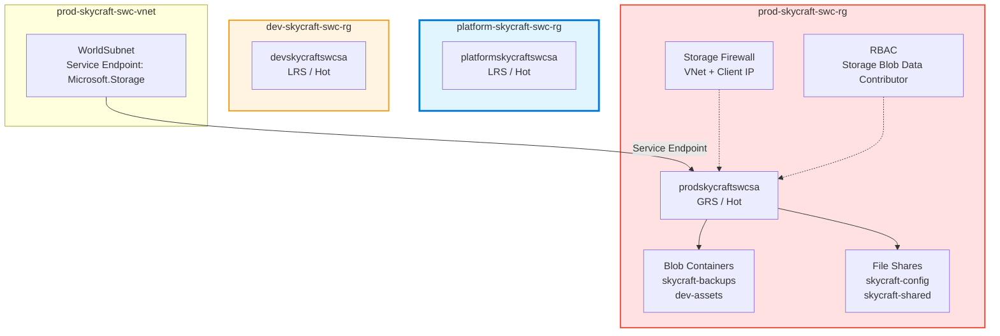

# Module 4: Implement and Manage Storage (8 hours)

## 📚 Module Overview

In this module, you'll implement **Azure Storage solutions** for the SkyCraft deployment. Building upon the compute infrastructure from Module 3, you will configure storage accounts for game data persistence, implement blob storage for assets, set up Azure Files for shared configuration, and secure all storage endpoints with defense-in-depth controls.

**Real-world Context**: Game servers require persistent, secure storage for configuration files, player data backups, world state snapshots, and asset distribution. This module implements that storage layer with appropriate redundancy, lifecycle management, and identity-based security.

---

## 🎯 Learning Objectives

By completing this module, you will be able to:

- **Create and configure** storage accounts with appropriate redundancy and encryption
- **Implement blob storage** with containers, access tiers, lifecycle management, and versioning
- **Configure Azure Files** with SMB file shares, snapshots, and soft delete
- **Secure storage** using firewalls, service endpoints, SAS tokens, and RBAC
- **Manage access keys** and understand the dual-key rotation strategy
- **Apply Stored Access Policies** for revocable delegated access
- **Assign data plane RBAC roles** for identity-based storage access

---

## 📋 Module Sections

| Lab     | Duration  | Topic            | Exam Weight |
| :------ | :-------- | :--------------- | :---------- |
| **4.1** | 2 hours   | Storage Accounts | ~4-5%       |
| **4.2** | 2 hours   | Blob Storage     | ~4-5%       |
| **4.3** | 1.5 hours | Azure Files      | ~3-4%       |
| **4.4** | 2.5 hours | Storage Security | ~4-6%       |

**Total Module Time**: 8 hours

---

## 🏗️ Architecture Overview

This module builds the **storage layer** for the SkyCraft infrastructure:

---

## ✅ Prerequisites

Before starting, ensure you have:

- [ ] Completed **Module 2: Virtual Networking** (VNets and subnets deployed)
- [ ] Active Azure subscription with Owner or Contributor role
- [ ] Azure CLI installed locally (or use Cloud Shell)
- [ ] PowerShell 7+ with Az module installed
- [ ] Resource groups created: `dev-skycraft-swc-rg`, `prod-skycraft-swc-rg`, `platform-skycraft-swc-rg`

---

## 🚀 Getting Started

1. **Review the architecture** diagram above to understand the storage topology
2. **Start with Lab 4.1** — Create storage accounts with redundancy and encryption
3. **Progress to Lab 4.2** — Implement blob containers, tiers, and lifecycle policies
4. **Continue to Lab 4.3** — Configure Azure Files with snapshots and mounting
5. **Complete Lab 4.4** — Secure storage with firewalls, SAS, access policies, and RBAC
6. **Proceed to Module 5** — Monitor and Maintain Azure Resources

---

## 📖 How to Use This Module

Each lab includes:

- **Lab Guide** — Step-by-step instructions with Mermaid architecture diagrams
- **Lab Checklist** — Verification steps to confirm success
- **Bicep Templates** — Infrastructure as Code for deployment
- **Scripts** — Deploy, Test, and Remove PowerShell automation
- **Troubleshooting** — Common issues with Root Cause analysis

**Recommended approach**:

1. Study the architecture diagram in each lab guide
2. Follow manual steps in Azure Portal (learn the UI)
3. Use Azure CLI and PowerShell commands for verification
4. Complete the checklist before moving to next lab
5. Reference troubleshooting if stuck

---

## 🎓 AZ-104 Exam Alignment

This module covers **15-20%** of the AZ-104 exam. Key exam topics include:

- Creating and configuring storage accounts
- Configuring Azure Storage redundancy (LRS, GRS, ZRS, RA-GRS)
- Creating and configuring blob containers and access tiers
- Configuring blob lifecycle management
- Creating and configuring Azure File Shares
- Configuring Azure Storage firewalls and virtual networks
- Creating and using Shared Access Signatures (SAS)
- Configuring Stored Access Policies
- Managing access keys
- Configuring identity-based access for storage

---

## ⏱️ Time Management

- **Total module time**: 8 hours
- **Recommended pace**: 2 hours per day for 4 days
- **Lab 4.1**: 2 hours (storage account foundation)
- **Lab 4.2**: 2 hours (blob storage and lifecycle)
- **Lab 4.3**: 1.5 hours (Azure Files and mounting)
- **Lab 4.4**: 2.5 hours (most complex — security deep dive)

---

## 🔗 Useful Resources

- [Azure Storage Documentation](https://learn.microsoft.com/en-us/azure/storage/)
- [Azure Blob Storage](https://learn.microsoft.com/en-us/azure/storage/blobs/)
- [Azure Files Documentation](https://learn.microsoft.com/en-us/azure/storage/files/)
- [Azure Storage Security](https://learn.microsoft.com/en-us/azure/storage/common/storage-security-guide)
- [Microsoft Learn: Implement and Manage Storage](https://learn.microsoft.com/en-us/training/paths/az-104-manage-storage/)

---

## 📞 Getting Help

- **Lab issues**: Check the Troubleshooting section in each lab guide
- **Azure errors**: Search Azure documentation or Microsoft Learn
- **Storage concepts**: Review Azure Storage fundamentals on Microsoft Learn

---

## ✨ What's Next After This Module?

Once complete, you'll have:

- ✅ Storage accounts with environment-appropriate redundancy
- ✅ Blob storage for game assets with lifecycle management
- ✅ Azure Files for shared server configuration
- ✅ Production-grade storage security (firewalls, SAS, RBAC)

**Next Module**: Module 5 — Monitor and Maintain Azure Resources

---

## 📌 Module Navigation

- [← Back to Course Home](../README.md)
- [Lab 4.1: Storage Accounts →](4.1-storage-accounts/lab-guide-4.1.md)
- [Lab 4.2: Blob Storage →](4.2-blob-storage/lab-guide-4.2.md)
- [Lab 4.3: Azure Files →](4.3-azure-files/lab-guide-4.3.md)
- [Lab 4.4: Storage Security →](4.4-storage-security/lab-guide-4.4.md)
