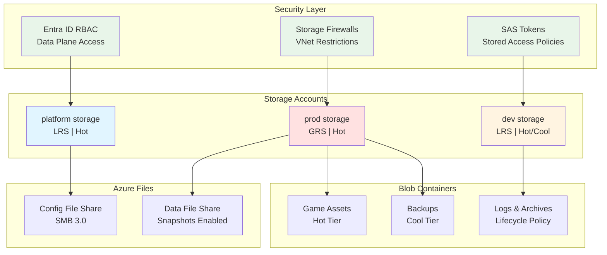

# Module 4: Implement and Manage Storage (8 hours)

## 📚 Module Overview

In this module, you'll implement **Azure Storage solutions** for the SkyCraft deployment. Building upon the compute infrastructure from Module 3, you'll configure storage accounts for game data persistence, implement blob storage for assets, set up Azure Files for shared configuration, and secure all storage endpoints using defense-in-depth strategies.

**Real-world Context**: Game servers generate large amounts of data—player databases, configuration files, game assets, and logs. Properly configuring storage with the right redundancy, access tiers, and security controls is critical for both performance and data protection.

---

## 🎯 Learning Objectives

By completing this module, you will be able to:

- **Create and configure** storage accounts with appropriate redundancy and access tiers
- **Implement blob storage** with containers, versioning, soft delete, and lifecycle management
- **Configure Azure Files** with file shares, snapshots, and identity-based access
- **Secure storage** using SAS tokens, stored access policies, firewalls, and encryption
- **Manage data** using Azure Storage Explorer and AzCopy
- **Apply governance** tags and monitor storage costs

---

## 📋 Module Sections

| Lab | Duration  | Topic                                 | Exam Weight |
| --- | --------- | ------------------------------------- | ----------- |
| 4.1 | 2 hours   | Configure and Manage Storage Accounts | ~4-5%       |
| 4.2 | 2 hours   | Configure Azure Blob Storage          | ~4-5%       |
| 4.3 | 1.5 hours | Configure Azure Files                 | ~3-4%       |
| 4.4 | 2.5 hours | Implement Storage Security            | ~4-6%       |

**Total Module Time**: 8 hours

---

## 🏗️ Architecture Overview

This module builds the storage layer integrated with your existing compute and network infrastructure:

```mermaid
graph TB
    subgraph "Storage Accounts"
        PlatformSA["platform storage<br/>LRS | Hot"]
        DevSA["dev storage<br/>LRS | Hot/Cool"]
        ProdSA["prod storage<br/>GRS | Hot"]
    end

    subgraph "Blob Containers"
        Assets[Game Assets<br/>Hot Tier]
        Backups[Backups<br/>Cool Tier]
        Logs[Logs & Archives<br/>Lifecycle Policy]
    end

    subgraph "Azure Files"
        ConfigShare[Config File Share<br/>SMB 3.0]
        DataShare[Data File Share<br/>Snapshots Enabled]
    end

    subgraph "Security Layer"
        Firewall[Storage Firewalls<br/>VNet Restrictions]
        SAS[SAS Tokens<br/>Stored Access Policies]
        RBAC[Entra ID RBAC<br/>Data Plane Access]
    end

    ProdSA --> Assets
    ProdSA --> Backups
    DevSA --> Logs
    PlatformSA --> ConfigShare
    ProdSA --> DataShare

    Firewall --> ProdSA
    SAS --> DevSA
    RBAC --> PlatformSA

    style PlatformSA fill:#e1f5ff
    style DevSA fill:#fff4e1
    style ProdSA fill:#ffe1e1
    style Firewall fill:#e8f5e9
    style SAS fill:#e8f5e9
    style RBAC fill:#e8f5e9
```

---

## ✅ Prerequisites

Before starting, ensure you have:

- [ ] Completed Module 3 (VMs, App Services deployed)
- [ ] Active Azure subscription with Owner or Contributor role
- [ ] Azure CLI and Bicep CLI installed locally
- [ ] PowerShell 7+ installed
- [ ] Azure Storage Explorer installed (recommended)

**Verify Module 3 completion**:

- VMs deployed in dev and prod VNets
- Bicep templates created for infrastructure automation
- App Service deployed for admin dashboard

---

## 🚀 Getting Started

1. **Review the architecture** diagram above to understand the storage layout
2. **Start with Lab 4.1** - Create and configure storage accounts with redundancy
3. **Progress to Lab 4.2** - Implement blob containers, tiers, and lifecycle policies
4. **Complete Lab 4.3** - Configure Azure Files with snapshots and soft delete
5. **Complete Lab 4.4** - Secure storage with SAS, firewalls, and encryption
6. **Take the module assessment** to validate learning

---

## 📖 How to Use This Module

Each lab includes:

- **Lab Guide** - Step-by-step instructions with architecture diagrams
- **Lab Checklist** - Verification steps to confirm success
- **Bicep Templates** - Infrastructure as Code for storage deployment
- **Scripts** - PowerShell and Bash automation scripts
- **Solutions** - Expected configurations and CLI commands

**Recommended approach**:

1. Study the architecture diagram in each lab guide
2. Follow manual steps in Azure Portal first (learn the UI)
3. Use Azure Storage Explorer for visual management
4. Automate with Bicep and CLI scripts
5. Verify each step using the checklist

---

## 🎓 AZ-104 Exam Alignment

This module covers **15-20%** of the AZ-104 exam. Key exam topics include:

- Creating and configuring storage accounts
- Configuring Azure Storage redundancy (LRS, ZRS, GRS, RA-GRS)
- Configuring storage account encryption and access keys
- Creating and configuring blob containers and access levels
- Configuring storage tiers (Hot, Cool, Archive)
- Configuring blob lifecycle management policies
- Configuring blob versioning and soft delete
- Creating and configuring Azure File shares
- Configuring snapshots and soft delete for Azure Files
- Configuring Azure Storage firewalls and virtual networks
- Creating and managing SAS tokens and stored access policies
- Configuring identity-based access for storage data plane

---

## ⏱️ Time Management

- **Total module time**: 8 hours
- **Recommended pace**: 2.5 hours per day for 3 days
- **Lab 4.1**: 2 hours (storage account creation and configuration)
- **Lab 4.2**: 2 hours (blob storage, tiers, and lifecycle)
- **Lab 4.3**: 1.5 hours (Azure Files and snapshots)
- **Lab 4.4**: 2.5 hours (most complex — defense-in-depth security)

---

## 🔗 Useful Resources

- [Azure Storage Documentation](https://learn.microsoft.com/en-us/azure/storage/)
- [Azure Blob Storage](https://learn.microsoft.com/en-us/azure/storage/blobs/)
- [Azure Files Documentation](https://learn.microsoft.com/en-us/azure/storage/files/)
- [Storage Security Guide](https://learn.microsoft.com/en-us/azure/storage/common/storage-security-guide)
- [AzCopy Documentation](https://learn.microsoft.com/en-us/azure/storage/common/storage-ref-azcopy)
- [Azure Storage Explorer](https://azure.microsoft.com/en-us/products/storage/storage-explorer/)

---

## 📞 Getting Help

- **Lab issues**: Check troubleshooting sections in each lab's solutions folder
- **Azure errors**: Search Azure documentation or Microsoft Learn
- **Storage concepts**: Review the [Storage decision guide](https://learn.microsoft.com/en-us/azure/storage/common/storage-introduction)

---

## ✨ What's Next After This Module?

Once complete, you'll have:

- ✅ Storage layer with environment-appropriate redundancy
- ✅ Blob storage for game assets with lifecycle management
- ✅ Azure Files for shared configuration across VMs
- ✅ Production-grade storage security with defense-in-depth

**Next Module**: Module 5 - Monitor and Maintain Azure Resources

---

## 📌 Module Navigation

- [← Back to Course Home](../README.MD)
- [Lab 4.1: Storage Accounts →](./4.1-storage-accounts/lab-guide-4.1.md)
- [Lab 4.2: Blob Storage →](./4.2-blob-storage/lab-guide-4.2.md)
- [Lab 4.3: Azure Files →](./4.3-azure-files/lab-guide-4.3.md)
- [Lab 4.4: Storage Security →](./4.4-storage-security/lab-guide-4.4.md)
