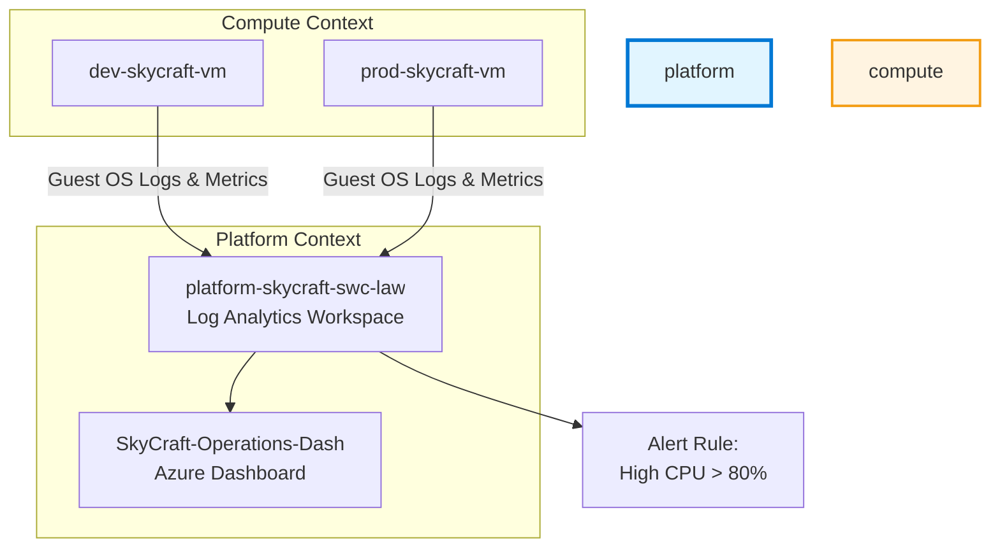

# Lab 5.1: Azure Monitor and Insights (1.5 hours)

## 🎯 Learning Objectives

By completing this lab, you will:

- Create and configure a **Log Analytics Workspace**
- Enable **VM Insights** for SkyCraft virtual machines
- Create **Log Search Alerts** based on KQL queries
- Configure **Metric Alerts** for high CPU utilization
- Build a custom **Azure Dashboard** for multi-resource visibility
- Query logs using **Kusto Query Language (KQL)**

---

## 🏗️ Architecture Overview

[Description]: Log Analytics Workspace serves as the central repository for all telemetry. Monitor Alerts watch the workspace and metrics to trigger notifications.



---

## 📋 Real-World Scenario

**Situation**: The SkyCraft game world servers periodically experience performance spikes. The operations team (led by Malfurion) needs a centralized way to view logs and receive urgent notifications if a server becomes unresponsive or overloaded. Currently, logs are scattered across individual VMs, making troubleshooting "AzerothCore" crashes difficult.

**Your Task**: Deploy a centralized Log Analytics Workspace, connect the existing development and production virtual machines to it, and create an automated alert system that notifies the team when CPU exceeds 80%.

---

## ⏱️ Estimated Time: 1.5 hours

- **Section 1**: Log Analytics & Monitoring Fundamentals (20 min)
- **Section 2**: Deploy Log Analytics Workspace (20 min)
- **Section 3**: Enable VM Insights & Data Collection (20 min)
- **Section 4**: Querying with KQL (15 min)
- **Section 5**: Configure Alerts & Dashboards (15 min)

---

## ✅ Prerequisites

Before starting this lab:

- [ ] Completed **Module 3: Compute** (at least one VM should be running)
- [ ] Resource group `platform-skycraft-swc-rg` exists
- [ ] `Contributor` role at the subscription level

---

## 📖 Section 1: Monitoring Fundamentals (20 min)

### What is Azure Monitor?

**Azure Monitor** is a comprehensive solution for collecting, analyzing, and acting on telemetry from your cloud and on-premises environments. It helps you understand how your applications are performing and proactively identifies issues affecting them.

### Data Types: Metrics vs. Logs

| Feature         | Metrics                         | Logs                                |
| :-------------- | :------------------------------ | :---------------------------------- |
| **Data Format** | Numerical values over time      | Structured strings/records          |
| **Speed**       | Near real-time                  | Higher latency (minutes)            |
| **Retention**   | 93 days (standard)              | 30 days to 7 years                  |
| **Best For**    | Alerts, dashboards, autoscaling | Deep-dive troubleshooting, auditing |

### Log Analytics Workspace (LAW)

A **Log Analytics Workspace** is a unique environment for Azure Monitor log data. Each workspace has its own data repository and configuration, and data sources are configured to store their data in a particular workspace.

---

## 📖 Section 2: Deploy Log Analytics Workspace (20 min)

### Step 5.1.1: Create the Workspace

1. Navigate to **Azure Portal** → Search for **Log Analytics workspaces**.
2. Click **+ Create**.
3. Fill in the details:

| Field          | Value                       |
| :------------- | :-------------------------- |
| Subscription   | [Your Subscription]         |
| Resource Group | `platform-skycraft-swc-rg`  |
| Name           | `platform-skycraft-swc-law` |
| Region         | **Sweden Central**          |

4. Click **Review + Create** → **Create**.

**Expected Result**: The workspace `platform-skycraft-swc-law` is created successfully.

---

## 📖 Section 3: Enable VM Insights (20 min)

### Step 5.1.2: Connect Virtual Machines

1. Navigate to **Monitor** (portal sidebar) → **Virtual Machines**.
2. Click the **Not monitored** tab.
3. Find your `dev-skycraft-vm` (or equivalent).
4. Click **Enable**.
5. Select the **Azure Monitor agent** (recommended).
6. Under **Data Collection Rule**, click **Create New**:
   - Name: `skycraft-vm-dcr`
   - Destination: `platform-skycraft-swc-law` (the one you just created)
7. Click **Enable**.

> [!NOTE]
> This process installs the **Azure Monitor Agent (AMA)** and configures a **Data Collection Rule (DCR)** to stream performance counters and Syslog/Event logs to your LAW.

**Expected Result**: After 5-10 minutes, the VM status changes to "Monitored".

---

## 📖 Section 4: Querying with KQL (15 min)

### Step 5.1.3: Run Your First Query

1. Navigate to your **Log Analytics workspace** (`platform-skycraft-swc-law`).
2. Click **Logs** in the left menu.
3. Close the "Queries" overlay.
4. Paste the following query to check heartbeat (connectivity) of your VMs:

```kusto
Heartbeat
| summarize LastHeartbeat = max(TimeGenerated) by Computer
```

5. Click **Run**.

### Step 5.1.4: Query Performance Data

Run this query to see top CPU consumers:

```kusto
Perf
| where CounterName == "% Processor Time"
| summarize AverageCPU = avg(CounterValue) by Computer, bin(TimeGenerated, 15m)
| render timechart
```

---

## 📖 Section 5: Configure Alerts & Dashboards (15 min)

### Step 5.1.5: Create a Metric Alert (CPU > 80%)

1. Navigate to your VM (`dev-skycraft-vm`) → **Monitoring** → **Alerts**.
2. Click **+ Create** → **Alert rule**.
3. Under **Signal name**, select **Percentage CPU**.
4. Configure the logic:
   - Threshold: **Static**
   - Operator: **Greater than**
   - Threshold value: **80**
   - Check every: **1 minute**
5. Click **Next: Actions**.
6. Create an **Action Group**:
   - Name: `SkyCraft-Admins-Email`
   - Notification: **Email/SMS/Push/Voice** (Enter your email).
7. Click **Create**.

### Step 5.1.6: Pin to Dashboard

1. Run the CPU query from Step 5.1.4 again.
2. Click **Pin to** → **Azure Dashboard**.
3. Create a new dashboard named `SkyCraft-Ops`.

---

## ✅ Lab Checklist

- [ ] Log Analytics Workspace `platform-skycraft-swc-law` created
- [ ] At least one VM connected using Azure Monitor Agent
- [ ] KQL query returned `Heartbeat` data
- [ ] Alert rule for >80% CPU created
- [ ] Azure Dashboard contains at least one pinned chart

**For detailed verification**, see [lab-checklist-5.1.md](lab-checklist-5.1.md)

---

## 🔧 Troubleshooting

### Issue 1: "No Data Received" in Log Analytics

**Symptom**: KQL queries return empty results.

**Solution**:

- Ensure the VM is **Running**.
- Wait up to 10 minutes for the AMA agent to finalize configuration.
- Check if the **Data Collection Rule** is correctly associated with the VM.

---

## 🎓 Knowledge Check

1. **What is the difference between Azure Monitor Agent (AMA) and the legacy Log Analytics agent?**
   <details>
     <summary>**Click to see the answer**</summary>

   **Answer**: AMA provides more secure, granular data collection through Data Collection Rules (DCRs) and supports multi-homing more efficiently. The legacy agent is being deprecated in August 2024.
   </details>

2. **What does KQL stand for?**
   <details>
     <summary>**Click to see the answer**</summary>

   **Answer**: Kusto Query Language. It is used across Azure Monitor, Microsoft Sentinel, and Azure Data Explorer.
   </details>

---

## 📚 Additional Resources

- [Azure Monitor Documentation](https://learn.microsoft.com/en-us/azure/azure-monitor/overview)
- [Log Analytics Tutorial](https://learn.microsoft.com/en-us/azure/azure-monitor/logs/log-analytics-tutorial)
- [KQL Quick Reference](https://learn.microsoft.com/en-us/azure/data-explorer/kql-quick-reference)
- [Azure Monitor Agent Overview](https://learn.microsoft.com/en-us/azure/azure-monitor/agents/agents-overview)

---

## 📌 Module Navigation

[Module 5 README](../README.MD) | [Next Lab: 5.2 Business Continuity →](../5.2-business-continuity/lab-guide-5.2.md)

---

## 📝 Lab Summary

**What You Accomplished:**

✅ Created a centralized Log Analytics Workspace for SkyCraft telemetry
✅ Enabled VM Insights using Azure Monitor Agent (AMA)
✅ Queried performance data using Kusto Query Language (KQL)
✅ Configured metric alerts for CPU threshold monitoring
✅ Built a custom Azure Dashboard for operational visibility

**Time Spent**: ~1.5 hours

**Ready for Lab 5.2?** Next, you'll implement backup and disaster recovery for SkyCraft VMs.
