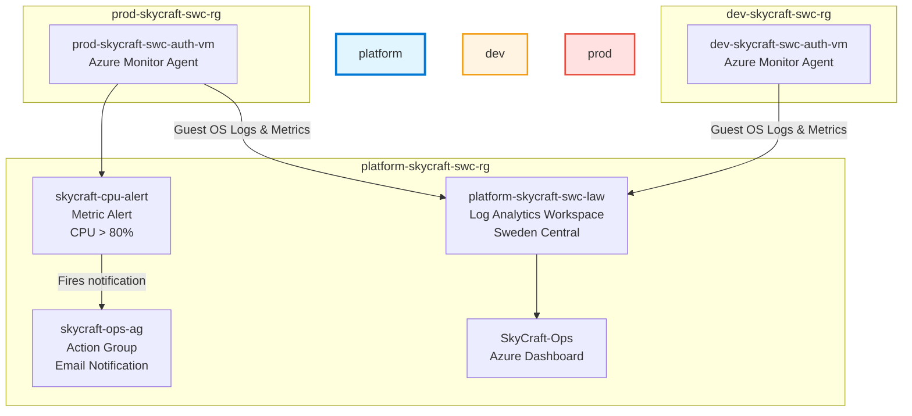

# Lab 5.1: Azure Monitor and Insights (2 hours)

## 🎯 Learning Objectives

By completing this lab, you will:

- **Create** a centralized **Log Analytics Workspace** for SkyCraft telemetry
- **Enable VM Insights** using the Azure Monitor Agent (AMA) and Data Collection Rules
- **Write KQL queries** to analyze heartbeat, CPU, memory, and disk performance
- **Configure Metric Alerts** for proactive CPU threshold monitoring
- **Create Action Groups** with email notification for the operations team
- **Build a custom Azure Dashboard** for multi-resource operational visibility

---

## 🏗️ Architecture Overview

Log Analytics Workspace serves as the central repository for all telemetry. Azure Monitor Agent streams guest OS logs and metrics via Data Collection Rules. Alert rules watch metrics and logs to trigger notifications through Action Groups.


```mermaid
graph TB
    subgraph "platform-skycraft-swc-rg"
        style platform fill:#e1f5ff,stroke:#0078d4,stroke-width:3px
        LAW["platform-skycraft-swc-law<br/>Log Analytics Workspace<br/>Sweden Central"]
        AG["skycraft-ops-ag<br/>Action Group<br/>Email Notification"]
        Alert["skycraft-cpu-alert<br/>Metric Alert<br/>CPU > 80%"]
        Dashboard["SkyCraft-Ops<br/>Azure Dashboard"]
    end

    subgraph "dev-skycraft-swc-rg"
        style dev fill:#fff4e1,stroke:#f39c12,stroke-width:2px
        VM_Dev["dev-skycraft-swc-auth-vm<br/>Azure Monitor Agent"]
    end

    subgraph "prod-skycraft-swc-rg"
        style prod fill:#ffe1e1,stroke:#e74c3c,stroke-width:2px
        VM_Prod["prod-skycraft-swc-auth-vm<br/>Azure Monitor Agent"]
    end

    VM_Dev -->|"Guest OS Logs & Metrics"| LAW
    VM_Prod -->|"Guest OS Logs & Metrics"| LAW
    LAW --> Dashboard
    VM_Prod --> Alert
    Alert -->|"Fires notification"| AG
```

---

## 📋 Real-World Scenario

**Situation**: The SkyCraft game world servers periodically experience performance spikes. The operations team needs a centralized way to view logs and receive urgent notifications if a server becomes unresponsive or overloaded. Currently, logs are scattered across individual VMs, making troubleshooting AzerothCore crashes difficult and time-consuming.

| Environment     | Monitoring Need                          | Priority |
| --------------- | ---------------------------------------- | -------- |
| **Platform**    | Centralized log aggregation & dashboards | High     |
| **Production**  | CPU/Memory alerts, heartbeat monitoring  | Critical |
| **Development** | Performance profiling, KQL analysis      | Medium   |

**Your Task**: Deploy a centralized Log Analytics Workspace in the platform resource group, connect VMs using the Azure Monitor Agent, write KQL queries for performance analysis, and create an automated alert system that notifies the team when CPU exceeds 80%.

**Business Impact**:

- **90% faster troubleshooting** through centralized log queries instead of SSH-ing into individual VMs
- **Zero-surprise outages** via proactive CPU threshold alerting
- **Single pane of glass** operations dashboard for all SkyCraft environments

---

## ⏱️ Estimated Time: 2 hours

- **Section 1**: Monitoring Fundamentals (20 min)
- **Section 2**: Deploy Log Analytics Workspace (20 min)
- **Section 3**: Enable VM Insights & Data Collection (25 min)
- **Section 4**: Querying with KQL (25 min)
- **Section 5**: Configure Alerts & Dashboards (30 min)

---

## ✅ Prerequisites

Before starting this lab:

- [ ] Completed **Lab 3.2** (VMs deployed — at least one VM must be running)
- [ ] Completed **Lab 4.1** (Storage accounts deployed)
- [ ] Existing resources:
  - Resource groups: `platform-skycraft-swc-rg`, `dev-skycraft-swc-rg`, `prod-skycraft-swc-rg`
  - At least one running VM (e.g., `dev-skycraft-swc-auth-vm` or `prod-skycraft-swc-auth-vm`)
- [ ] Azure CLI installed (version 2.50.0 or later)
- [ ] PowerShell Az module installed
- [ ] `Contributor` role at the subscription level

**Verify prerequisites**:

```azurecli
# Verify resource groups exist
az group list --query "[?contains(name,'skycraft')].{Name:name,Location:location}" --output table

# Verify at least one VM is running
az vm list --query "[?contains(name,'skycraft')].{Name:name,Status:powerState,RG:resourceGroup}" --output table
```

---

## 📖 Section 1: Monitoring Fundamentals (20 min)

### What is Azure Monitor?

**Azure Monitor** is a comprehensive solution for collecting, analyzing, and acting on telemetry from your cloud and on-premises environments. It helps you understand how your applications are performing and proactively identifies issues affecting them.

Azure Monitor collects two fundamental types of data: **Metrics** and **Logs**. Understanding the difference is critical for choosing the right monitoring approach.

### Data Types: Metrics vs. Logs

| Feature         | Metrics                         | Logs                                |
| :-------------- | :------------------------------ | :---------------------------------- |
| **Data Format** | Numerical values over time      | Structured strings/records          |
| **Speed**       | Near real-time (~1 min)         | Higher latency (2-15 minutes)       |
| **Retention**   | 93 days (standard)              | 30 days to 2 years (workspace)      |
| **Query**       | Metrics Explorer (charts)       | KQL in Log Analytics                |
| **Best For**    | Alerts, dashboards, autoscaling | Deep-dive troubleshooting, auditing |
| **Cost**        | Free (platform metrics)         | Pay per GB ingested                 |

### Log Analytics Workspace (LAW)

A **Log Analytics Workspace** is a unique environment for Azure Monitor log data. Each workspace has its own data repository and configuration. Data sources (VMs, storage accounts, Azure AD) are configured to send their telemetry to a specific workspace.

**Key Characteristics**:

- Centralized storage for logs from multiple sources
- Query engine powered by Kusto Query Language (KQL)
- Retention configurable from 30 days to 2 years
- Pricing based on data ingestion volume (GB/day)

### SkyCraft Monitoring Strategy

| Component           | Approach                  | Justification                                      |
| ------------------- | ------------------------- | -------------------------------------------------- |
| **Workspace Model** | Single centralized LAW    | Simplified querying across all environments        |
| **Agent**           | Azure Monitor Agent (AMA) | Modern, DCR-based, replaces legacy agent           |
| **Alert Channels**  | Email via Action Group    | Immediate ops notification for critical thresholds |
| **Dashboard**       | Shared Azure Dashboard    | Single pane of glass for the team                  |

> **SkyCraft Choice**: We chose a **single centralized Log Analytics Workspace** in the platform resource group because it allows cross-environment KQL queries (e.g., comparing dev vs. prod CPU patterns) without workspace federation complexity. For larger organizations, per-environment workspaces with cross-workspace queries would be more appropriate.

---

## 📖 Section 2: Deploy Log Analytics Workspace (20 min)

### Step 5.1.1: Create the Workspace

#### Option 1: Azure Portal (GUI)

1. Navigate to **Azure Portal** → Search for **Log Analytics workspaces**
2. Click **+ Create**
3. Fill in the details:

| Field          | Value                       |
| :------------- | :-------------------------- |
| Subscription   | [Your Subscription]         |
| Resource Group | `platform-skycraft-swc-rg`  |
| Name           | `platform-skycraft-swc-law` |
| Region         | **Sweden Central**          |

4. Click **Review + Create** → **Create**

#### Option 2: Azure CLI

```bash
# Create Log Analytics Workspace
az monitor log-analytics workspace create \
  --resource-group platform-skycraft-swc-rg \
  --workspace-name platform-skycraft-swc-law \
  --location swedencentral \
  --retention-time 30 \
  --tags Project=SkyCraft Environment=Platform CostCenter=MSDN
```

#### Option 3: PowerShell

```powershell
# Create Log Analytics Workspace
New-AzOperationalInsightsWorkspace `
    -ResourceGroupName 'platform-skycraft-swc-rg' `
    -Name 'platform-skycraft-swc-law' `
    -Location 'swedencentral' `
    -RetentionInDays 30 `
    -Tag @{Project='SkyCraft'; Environment='Platform'; CostCenter='MSDN'}
```

**Expected Result**: The workspace `platform-skycraft-swc-law` is created successfully in Sweden Central with 30-day retention.

| Property       | Expected Value                                          |
| -------------- | ------------------------------------------------------- |
| Name           | `platform-skycraft-swc-law`                             |
| Location       | Sweden Central                                          |
| Retention      | 30 days                                                 |
| Resource Group | `platform-skycraft-swc-rg`                              |
| Tags           | Project=SkyCraft, Environment=Platform, CostCenter=MSDN |

---

## 📖 Section 3: Enable VM Insights & Data Collection (25 min)

### What is VM Insights?

**VM Insights** provides a pre-configured monitoring experience for Azure VMs. It uses the **Azure Monitor Agent (AMA)** — the modern replacement for the legacy Log Analytics agent (deprecated August 2024). AMA uses **Data Collection Rules (DCRs)** to define exactly which data to collect from guest OS.

### Step 5.1.2: Enable VM Insights on a SkyCraft VM

#### Option 1: Azure Portal (GUI)

1. Navigate to **Monitor** → **Virtual Machines** (in the left menu)
2. Click the **Not monitored** tab
3. Find your VM (e.g., `dev-skycraft-swc-auth-vm`)
4. Click **Enable**
5. Select the **Azure Monitor Agent** (recommended)
6. Under **Data Collection Rule**, click **Create New**:

| Field                   | Value                       |
| :---------------------- | :-------------------------- |
| Rule name               | `skycraft-vm-dcr`           |
| Subscription            | [Your Subscription]         |
| Log Analytics Workspace | `platform-skycraft-swc-law` |

7. Enable **Processes and dependencies** (map view)
8. Click **Configure** → **Enable**

> [!NOTE]
> This process installs the **Azure Monitor Agent (AMA)** extension on the VM and creates a **Data Collection Rule (DCR)** to stream performance counters (CPU, Memory, Disk, Network) and Syslog/Event logs to your Log Analytics Workspace.

#### Option 2: Azure CLI

```bash
# Install Azure Monitor Agent extension on the VM
az vm extension set \
  --resource-group dev-skycraft-swc-rg \
  --vm-name dev-skycraft-swc-auth-vm \
  --name AzureMonitorLinuxAgent \
  --publisher Microsoft.Azure.Monitor \
  --enable-auto-upgrade true
```

#### Option 3: PowerShell

```powershell
# Install Azure Monitor Agent extension
Set-AzVMExtension `
    -ResourceGroupName 'dev-skycraft-swc-rg' `
    -VMName 'dev-skycraft-swc-auth-vm' `
    -Name 'AzureMonitorLinuxAgent' `
    -Publisher 'Microsoft.Azure.Monitor' `
    -ExtensionType 'AzureMonitorLinuxAgent' `
    -TypeHandlerVersion '1.0' `
    -EnableAutomaticUpgrade $true
```

> [!IMPORTANT]
> VM Insights data takes **5–10 minutes** to appear after enabling. Wait before proceeding to KQL queries.

**Expected Result**: After 5–10 minutes, the VM status changes to **Monitored** in the VM Insights view. The AMA extension appears under VM → Extensions + applications.

### Step 5.1.3: Configure Diagnostic Settings for Storage Accounts

1. Navigate to a storage account (e.g., `platformskycraftswcsa`)
2. Go to **Monitoring** → **Diagnostic settings**
3. Click **+ Add diagnostic setting**
4. Configure:

| Field                   | Value                           |
| :---------------------- | :------------------------------ |
| Diagnostic setting name | `skycraft-storage-diag`         |
| Logs: blob              | ✅ StorageRead, StorageWrite    |
| Destination             | Send to Log Analytics Workspace |
| Workspace               | `platform-skycraft-swc-law`     |

5. Click **Save**

**Expected Result**: Storage account activity logs start flowing to the centralized workspace.

---

## 📖 Section 4: Querying with KQL (25 min)

### What is KQL?

**Kusto Query Language (KQL)** is the query language used across Azure Monitor, Microsoft Sentinel, and Azure Data Explorer. It reads left-to-right using a pipe (`|`) syntax similar to PowerShell.

### Step 5.1.4: Run Your First Query — Heartbeat

1. Navigate to your **Log Analytics workspace** (`platform-skycraft-swc-law`)
2. Click **Logs** in the left menu
3. Close the "Queries" overlay
4. Paste the following query:

```kusto
Heartbeat
| summarize LastHeartbeat = max(TimeGenerated) by Computer, OSType, Version
| order by LastHeartbeat desc
```

5. Click **Run**

**Expected Result**: A table showing each connected VM, its OS type, agent version, and last heartbeat timestamp.

### Step 5.1.5: Query CPU Performance

Run this query to see top CPU consumers over the last hour:

```kusto
Perf
| where TimeGenerated > ago(1h)
| where CounterName == "% Processor Time"
| where InstanceName == "_Total"
| summarize AverageCPU = avg(CounterValue), MaxCPU = max(CounterValue) by Computer, bin(TimeGenerated, 5m)
| render timechart
```

### Step 5.1.6: Query Available Memory

```kusto
Perf
| where TimeGenerated > ago(1h)
| where CounterName == "Available MBytes"
| summarize AvgMemoryMB = avg(CounterValue) by Computer, bin(TimeGenerated, 5m)
| render timechart
```

### Step 5.1.7: Query Disk Usage

```kusto
Perf
| where TimeGenerated > ago(1h)
| where CounterName == "% Used Space"
| summarize AvgDiskUsed = avg(CounterValue) by Computer, InstanceName
| order by AvgDiskUsed desc
```

> [!TIP]
> Use `ago(1h)`, `ago(24h)`, or `ago(7d)` to adjust the time window. For production monitoring, `ago(1h)` is typical for real-time dashboards.

---

## 📖 Section 5: Configure Alerts & Dashboards (30 min)

### Step 5.1.8: Create an Action Group

An **Action Group** defines who gets notified and how when an alert fires.

#### Option 1: Azure Portal (GUI)

1. Navigate to **Monitor** → **Alerts** → **Action groups**
2. Click **+ Create**
3. Fill in the details:

| Field             | Value                      |
| :---------------- | :------------------------- |
| Subscription      | [Your Subscription]        |
| Resource Group    | `platform-skycraft-swc-rg` |
| Action Group Name | `skycraft-ops-ag`          |
| Display Name      | `SkyCraft Ops`             |

4. Go to **Notifications** tab:
   - Notification type: **Email/SMS message/Push/Voice**
   - Name: `ops-email`
   - Email: [Your email address]
5. Click **Review + create** → **Create**

#### Option 2: Azure CLI

```bash
# Create Action Group
az monitor action-group create \
  --resource-group platform-skycraft-swc-rg \
  --name skycraft-ops-ag \
  --short-name SkyCraftOps \
  --action email ops-email your-email@example.com
```

#### Option 3: PowerShell

```powershell
# Create email receiver
$emailReceiver = New-AzActionGroupEmailReceiverObject `
    -Name 'ops-email' `
    -EmailAddress 'your-email@example.com'

# Create Action Group
New-AzActionGroup `
    -ResourceGroupName 'platform-skycraft-swc-rg' `
    -Name 'skycraft-ops-ag' `
    -ShortName 'SkyCraftOps' `
    -Location 'Global' `
    -EmailReceiver $emailReceiver
```

**Expected Result**: Action Group `skycraft-ops-ag` created with email notification configured.

### Step 5.1.9: Create a Metric Alert (CPU > 80%)

#### Option 1: Azure Portal (GUI)

1. Navigate to your VM (e.g., `prod-skycraft-swc-auth-vm`) → **Monitoring** → **Alerts**
2. Click **+ Create** → **Alert rule**
3. Under **Signal name**, select **Percentage CPU**
4. Configure the logic:

| Field           | Value            |
| :-------------- | :--------------- |
| Threshold       | **Static**       |
| Operator        | **Greater than** |
| Threshold value | **80**           |
| Check every     | **1 minute**     |
| Lookback period | **5 minutes**    |

5. Click **Next: Actions** → Select `skycraft-ops-ag`
6. Click **Next: Details**:

| Field           | Value                      |
| :-------------- | :------------------------- |
| Alert rule name | `skycraft-cpu-alert`       |
| Description     | `CPU > 80% on SkyCraft VM` |
| Severity        | **Sev 2 - Warning**        |

7. Click **Review + create** → **Create**

#### Option 2: Azure CLI

```bash
# Create metric alert for CPU > 80%
az monitor metrics alert create \
  --resource-group platform-skycraft-swc-rg \
  --name skycraft-cpu-alert \
  --scopes "/subscriptions/{sub-id}/resourceGroups/prod-skycraft-swc-rg/providers/Microsoft.Compute/virtualMachines/prod-skycraft-swc-auth-vm" \
  --condition "avg Percentage CPU > 80" \
  --window-size 5m \
  --evaluation-frequency 1m \
  --severity 2 \
  --action "/subscriptions/{sub-id}/resourceGroups/platform-skycraft-swc-rg/providers/microsoft.insights/actionGroups/skycraft-ops-ag" \
  --description "CPU > 80% on SkyCraft VM"
```

#### Option 3: PowerShell

```powershell
# Get the VM resource ID
$vmId = (Get-AzVM -ResourceGroupName 'prod-skycraft-swc-rg' -Name 'prod-skycraft-swc-auth-vm').Id

# Get the Action Group resource ID
$agId = (Get-AzActionGroup -ResourceGroupName 'platform-skycraft-swc-rg' -Name 'skycraft-ops-ag').Id

# Create the metric alert
$condition = New-AzMetricAlertRuleV2Criteria `
    -MetricName 'Percentage CPU' `
    -TimeAggregation Average `
    -Operator GreaterThan `
    -Threshold 80

Add-AzMetricAlertRuleV2 `
    -ResourceGroupName 'platform-skycraft-swc-rg' `
    -Name 'skycraft-cpu-alert' `
    -TargetResourceId $vmId `
    -Condition $condition `
    -ActionGroupId $agId `
    -WindowSize (New-TimeSpan -Minutes 5) `
    -Frequency (New-TimeSpan -Minutes 1) `
    -Severity 2 `
    -Description 'CPU > 80% on SkyCraft VM'
```

**Expected Result**: Alert rule `skycraft-cpu-alert` is created and active. When CPU exceeds 80% for 5 minutes, an email is sent to the ops team.

### Step 5.1.10: Pin KQL Query to Dashboard

1. Navigate to `platform-skycraft-swc-law` → **Logs**
2. Run the CPU performance query from Step 5.1.5
3. Click **Pin to** → **Azure Dashboard**
4. Select **Create new** → Name: `SkyCraft-Ops`
5. Click **Pin**
6. Add the memory query from Step 5.1.6 to the same dashboard

**Expected Result**: Dashboard `SkyCraft-Ops` is created with CPU and memory charts visible.

---

## ✅ Lab Checklist

### Resources Created

- [ ] Log Analytics Workspace `platform-skycraft-swc-law` created in `platform-skycraft-swc-rg`
- [ ] Data Collection Rule `skycraft-vm-dcr` created
- [ ] Action Group `skycraft-ops-ag` created with email notification
- [ ] Alert rule `skycraft-cpu-alert` created and active
- [ ] Dashboard `SkyCraft-Ops` created with at least 2 charts

### Configuration Verified

- [ ] At least one VM connected using Azure Monitor Agent (AMA)
- [ ] KQL Heartbeat query returned data
- [ ] KQL CPU performance query rendered a timechart
- [ ] Storage diagnostic settings configured

### Tags Applied

- [ ] Log Analytics Workspace: Project=SkyCraft, Environment=Platform, CostCenter=MSDN

**For detailed verification**, see [lab-checklist-5.1.md](lab-checklist-5.1.md)

---

## 🔧 Troubleshooting

### Issue 1: "No Data Received" in Log Analytics

**Symptom**: KQL queries (Heartbeat, Perf) return empty results.

**Root Cause**: The Azure Monitor Agent has not finished initial data collection, or the Data Collection Rule is not correctly associated with the VM.

**Solution**:

- Ensure the VM is **Running** (not deallocated)
- Wait **10–15 minutes** after enabling VM Insights
- Verify the DCR association: VM → Settings → Extensions + applications → check `AzureMonitorLinuxAgent` is **Provisioning succeeded**
- Check DCR exists: Monitor → Data Collection Rules → verify `skycraft-vm-dcr` lists your VM

### Issue 2: Alert Not Firing Despite High CPU

**Symptom**: CPU is above 80% but no email notification received.

**Root Cause**: The alert evaluation frequency or lookback window may not have elapsed yet, or the Action Group email is not verified.

**Solution**:

- Wait at least **5 minutes** (the lookback window)
- Check **Monitor** → **Alerts** → verify alert rule is **Enabled**
- Check the Action Group email — Azure sends a verification email on first creation
- Check spam/junk folder for the alert email

### Issue 3: VM Not Appearing in VM Insights

**Symptom**: VM shows as "Not monitored" even after enabling.

**Root Cause**: The Azure Monitor Agent extension failed to install, often due to insufficient permissions or VM agent issues.

**Solution**:

- Check VM → Extensions + applications for error messages
- Ensure you have `Contributor` or `Virtual Machine Contributor` role
- Restart the VM and retry enabling VM Insights

```bash
# Check AMA extension status
az vm extension list --resource-group dev-skycraft-swc-rg --vm-name dev-skycraft-swc-auth-vm --output table
```

### Issue 4: "Resource provider not registered" Error

**Symptom**: `Microsoft.Insights` or `Microsoft.OperationalInsights` provider not registered error when creating resources.

**Root Cause**: Required resource providers are not registered in the subscription.

**Solution**:

```bash
# Register required providers
az provider register --namespace Microsoft.OperationalInsights
az provider register --namespace Microsoft.Insights
```

### Issue 5: KQL Query Returns "Table Not Found"

**Symptom**: Error `'Perf' is not a recognized table name` when running queries.

**Root Cause**: The Data Collection Rule is not configured to collect performance counters, or data has not yet been ingested.

**Solution**:

- Verify the DCR collects performance counters: Monitor → Data Collection Rules → `skycraft-vm-dcr` → Data sources → verify **Performance Counters** is enabled
- Wait at minimum 15 minutes for initial data ingestion
- Try the `Heartbeat` table first — it populates faster

---

## 🎓 Knowledge Check

1. **What is the difference between Azure Monitor Agent (AMA) and the legacy Log Analytics agent?**

   <details>
     <summary>**Click to see the answer**</summary>

   **Answer**: AMA provides more secure, granular data collection through **Data Collection Rules (DCRs)** and supports multi-homing more efficiently. It also supports user-assigned managed identity for authentication. The legacy Log Analytics agent (MMA/OMS) is deprecated since August 2024 and should not be used for new deployments.
   </details>

2. **What does KQL stand for, and where is it used?**

   <details>
     <summary>**Click to see the answer**</summary>

   **Answer**: Kusto Query Language. It is used across Azure Monitor (Log Analytics), Microsoft Sentinel, Azure Data Explorer, and Azure Resource Graph. Its pipe-based syntax (`|`) makes it similar in concept to PowerShell pipelines.
   </details>

3. **When should you use a Metric Alert vs. a Log Search Alert?**

   <details>
     <summary>**Click to see the answer**</summary>

   **Answer**: Use **Metric Alerts** for near real-time monitoring of numerical values (CPU, memory, disk) — they evaluate every 1 minute and are free for platform metrics. Use **Log Search Alerts** for complex conditions based on KQL queries against log data (e.g., "count of error messages > 10 in 15 minutes") — they have higher latency (2-15 min) and are billed per evaluation.
   </details>

4. **Why did SkyCraft choose a single centralized Log Analytics Workspace instead of one per environment?**

   <details>
     <summary>**Click to see the answer**</summary>

   **Answer**: A single workspace enables cross-environment KQL queries (e.g., comparing dev vs. prod CPU patterns) without workspace federation or cross-workspace query complexity. For SkyCraft's scale (3 environments, <10 VMs), the centralized model is simpler and cheaper. Larger enterprises often use per-environment workspaces with Azure Lighthouse or cross-workspace queries for data isolation.
   </details>

5. **What is a Data Collection Rule (DCR) and why is it important?**

   <details>
     <summary>**Click to see the answer**</summary>

   **Answer**: A DCR defines what data the Azure Monitor Agent collects from a VM's guest OS (performance counters, Syslog, Windows events) and where to send it (which Log Analytics Workspace). DCRs decouple the data collection configuration from the agent itself, allowing you to change what you collect without reinstalling the agent. Multiple DCRs can be associated with a single VM.
   </details>

6. **How does Azure Monitor pricing work for Log Analytics?**

   <details>
     <summary>**Click to see the answer**</summary>

   **Answer**: Log Analytics uses a **pay-per-GB** model based on data ingested. The first 5 GB/month is free. Platform metrics are always free. For higher volumes (>100 GB/day), **Commitment Tiers** offer discounts (e.g., 100 GB/day tier). Data retention beyond 30 days incurs additional charges. Alert rule evaluations are billed separately.
   </details>

---

## 📚 Additional Resources

- [Azure Monitor Documentation](https://learn.microsoft.com/en-us/azure/azure-monitor/overview)
- [Log Analytics Tutorial](https://learn.microsoft.com/en-us/azure/azure-monitor/logs/log-analytics-tutorial)
- [KQL Quick Reference](https://learn.microsoft.com/en-us/azure/data-explorer/kql-quick-reference)
- [Azure Monitor Agent Overview](https://learn.microsoft.com/en-us/azure/azure-monitor/agents/agents-overview)
- [Data Collection Rules](https://learn.microsoft.com/en-us/azure/azure-monitor/essentials/data-collection-rule-overview)

**Best Practices**:

- [Azure Monitor Best Practices](https://learn.microsoft.com/en-us/azure/azure-monitor/best-practices)

---

## 📌 Module Navigation

[← Back to Module 5 Index](../README.md)

[Next Lab: 5.2 - Business Continuity & Disaster Recovery →](../5.2-business-continuity/lab-guide-5.2.md)

---

## 📝 Lab Summary

**What You Accomplished:**

✅ Created a centralized Log Analytics Workspace (`platform-skycraft-swc-law`) for SkyCraft telemetry
✅ Enabled VM Insights using Azure Monitor Agent (AMA) with Data Collection Rules
✅ Queried heartbeat, CPU, memory, and disk data using Kusto Query Language (KQL)
✅ Created an Action Group (`skycraft-ops-ag`) with email notification
✅ Configured a metric alert (`skycraft-cpu-alert`) for CPU > 80% threshold
✅ Built a custom Azure Dashboard (`SkyCraft-Ops`) for operational visibility

**Infrastructure Deployed**:

| Resource             | Name                        | Configuration                    |
| -------------------- | --------------------------- | -------------------------------- |
| Log Analytics WS     | `platform-skycraft-swc-law` | Sweden Central, 30-day retention |
| Data Collection Rule | `skycraft-vm-dcr`           | Perf counters + Syslog           |
| Action Group         | `skycraft-ops-ag`           | Email notification               |
| Metric Alert         | `skycraft-cpu-alert`        | CPU > 80%, Sev 2, 5 min window   |
| Azure Dashboard      | `SkyCraft-Ops`              | CPU + Memory charts              |

**Time Spent**: ~2 hours

**Ready for Lab 5.2?** Next, you'll implement backup and disaster recovery for SkyCraft VMs and storage using Recovery Services Vault and Azure Site Recovery.

---

_Note: The monitoring infrastructure is now operational but requires the VMs from Module 3 to be running for data collection. The focus of this lab was Azure Monitor configuration — actual game server monitoring will be covered as part of the Capstone Project._
