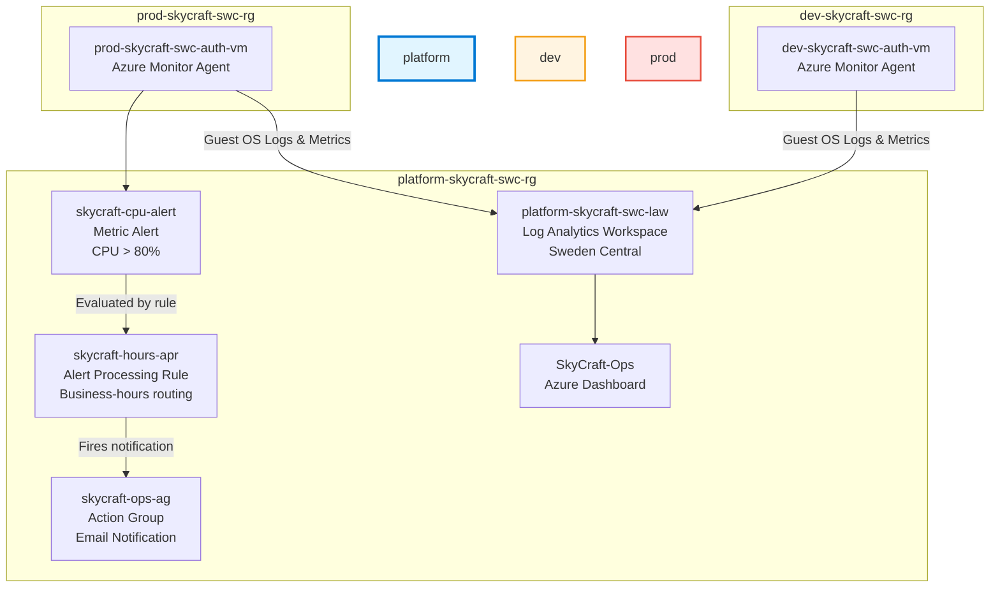
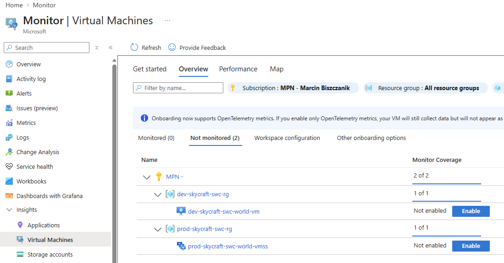
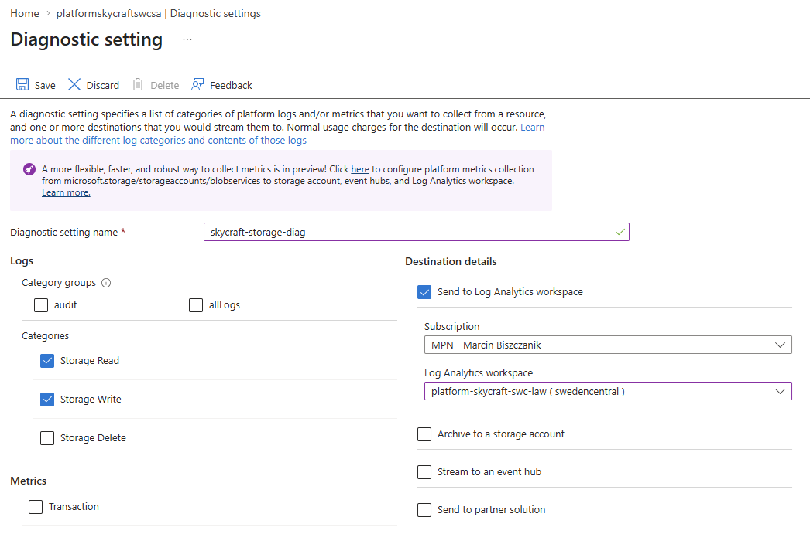
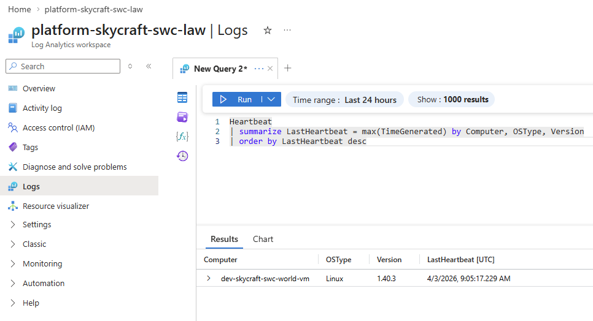
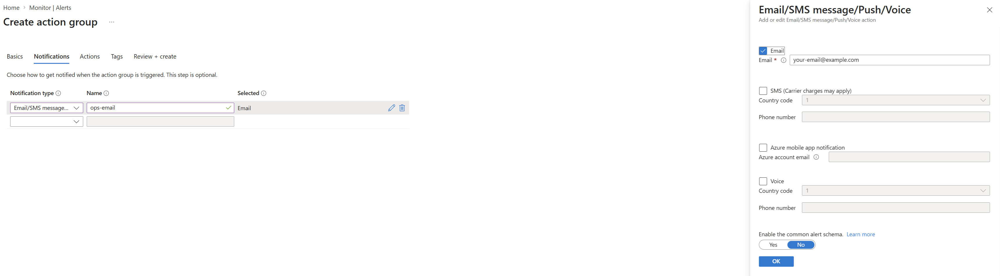
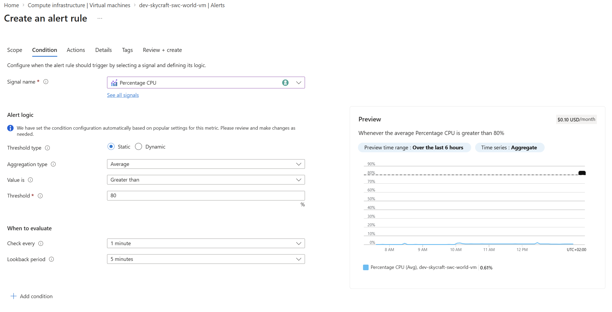
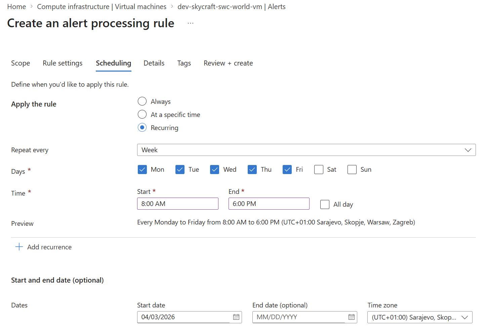
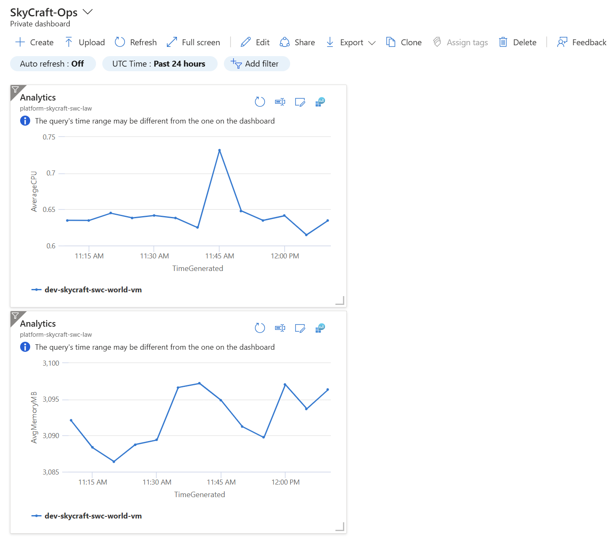

# Lab 5.1: Azure Monitor and Insights (2.5 hours)

## 🎯 Learning Objectives

By completing this lab, you will:

- **Create** a centralized **Log Analytics Workspace** for SkyCraft telemetry
- **Enable VM Insights** using the Azure Monitor Agent (AMA) and Data Collection Rules
- **Write KQL queries** to analyze heartbeat, CPU, memory, and disk performance
- **Configure Metric Alerts** for proactive CPU threshold monitoring
- **Create Action Groups** with email notification for the operations team
- **Configure Alert Processing Rules** to reduce noise and route notifications intentionally
- **Build a custom Azure Dashboard** for multi-resource operational visibility

---

## 🏗️ Architecture Overview

Log Analytics Workspace serves as the central repository for all telemetry. Azure Monitor Agent streams guest OS logs and metrics via Data Collection Rules. Alert rules watch metrics and logs, while Alert Processing Rules help route or suppress notifications through Action Groups.


```mermaid
graph TB
    subgraph "platform-skycraft-swc-rg"
        style platform fill:#e1f5ff,stroke:#0078d4,stroke-width:3px
        LAW["platform-skycraft-swc-law<br/>Log Analytics Workspace<br/>Sweden Central"]
        AG["skycraft-ops-ag<br/>Action Group<br/>Email Notification"]
        Alert["skycraft-cpu-alert<br/>Metric Alert<br/>CPU > 80%"]
        APR["skycraft-hours-apr<br/>Alert Processing Rule<br/>Business-hours routing"]
        Dashboard["SkyCraft-Ops<br/>Azure Dashboard"]
    end

    subgraph "dev-skycraft-swc-rg"
        style dev fill:#fff4e1,stroke:#f39c12,stroke-width:2px
        VM_Dev["dev-skycraft-swc-auth-vm<br/>Azure Monitor Agent"]
    end

    subgraph "prod-skycraft-swc-rg"
        style prod fill:#ffe1e1,stroke:#e74c3c,stroke-width:2px
        VM_Prod["prod-skycraft-swc-auth-vm<br/>Azure Monitor Agent"]
    end

    VM_Dev -->|"Guest OS Logs & Metrics"| LAW
    VM_Prod -->|"Guest OS Logs & Metrics"| LAW
    LAW --> Dashboard
    VM_Prod --> Alert
    Alert -->|"Evaluated by rule"| APR
    APR -->|"Fires notification"| AG
```

---

## 📋 Real-World Scenario

**Situation**: The SkyCraft game world servers periodically experience performance spikes. The operations team needs a centralized way to view logs and receive urgent notifications if a server becomes unresponsive or overloaded. Currently, logs are scattered across individual VMs, making troubleshooting AzerothCore crashes difficult and time-consuming.

| Environment     | Monitoring Need                          | Priority |
| --------------- | ---------------------------------------- | -------- |
| **Platform**    | Centralized log aggregation & dashboards | High     |
| **Production**  | CPU/Memory alerts, heartbeat monitoring  | Critical |
| **Development** | Performance profiling, KQL analysis      | Medium   |

**Your Task**: Deploy a centralized Log Analytics Workspace in the platform resource group, connect VMs using the Azure Monitor Agent, write KQL queries for performance analysis, and create an automated alert system that notifies the team when CPU exceeds 80%.

**Business Impact**:

- **90% faster troubleshooting** through centralized log queries instead of SSH-ing into individual VMs
- **Zero-surprise outages** via proactive CPU threshold alerting
- **Single pane of glass** operations dashboard for all SkyCraft environments

---

## ⏱️ Estimated Time: 2.5 hours

- **Section 1**: Monitoring Fundamentals (25 min)
- **Section 2**: Deploy Log Analytics Workspace (25 min)
- **Section 3**: Enable VM Insights & Data Collection (30 min)
- **Section 4**: Querying with KQL (30 min)
- **Section 5**: Configure Alerts & Dashboards (40 min)

---

## ✅ Prerequisites

Before starting this lab:

- [ ] Completed **Lab 3.2** (VMs deployed — at least one VM must be running)
- [ ] Completed **Lab 4.1** (Storage accounts deployed)
- [ ] Existing resources:
  - Resource groups: `platform-skycraft-swc-rg`, `dev-skycraft-swc-rg`, `prod-skycraft-swc-rg`
  - At least one running VM (e.g., `dev-skycraft-swc-auth-vm` or `prod-skycraft-swc-auth-vm`)
  - At least one storage account from Lab 4.1 (e.g., `platformskycraftswcsa`)
- [ ] Azure CLI installed (version 2.50.0 or later)
- [ ] PowerShell Az module installed
- [ ] `Contributor` role at the subscription level
- [ ] A valid email address you can access (required to validate Action Group notifications)

**Verify prerequisites**:

```azurecli
# Verify resource groups exist
az group list --query "[?contains(name,'skycraft')].{Name:name,Location:location}" --output table

# Verify storage accounts exist
az storage account list --query "[?contains(name,'skycraft')].{Name:name,RG:resourceGroup,Location:primaryLocation}" --output table

# Verify at least one VM is running
az vm list -d --query "[?contains(name,'skycraft')].{Name:name,Status:powerState,RG:resourceGroup}" --output table
```

---

## 📖 Section 1: Monitoring Fundamentals (25 min)

### What is Azure Monitor?

**Azure Monitor** is a comprehensive solution for collecting, analyzing, and acting on telemetry from your cloud and on-premises environments. It helps you understand how your applications are performing and proactively identifies issues affecting them.

Azure Monitor collects two fundamental types of data: **Metrics** and **Logs**. Understanding the difference is critical for choosing the right monitoring approach.

### Data Types: Metrics vs. Logs

| Feature         | Metrics                         | Logs                                |
| :-------------- | :------------------------------ | :---------------------------------- |
| **Data Format** | Numerical values over time      | Structured strings/records          |
| **Speed**       | Near real-time (~1 min)         | Higher latency (2-15 minutes)       |
| **Retention**   | 93 days (standard)              | 30 days to 2 years (workspace)      |
| **Query**       | Metrics Explorer (charts)       | KQL in Log Analytics                |
| **Best For**    | Alerts, dashboards, autoscaling | Deep-dive troubleshooting, auditing |
| **Cost**        | Free (platform metrics)         | Pay per GB ingested                 |

### Log Analytics Workspace (LAW)

A **Log Analytics Workspace** is a unique environment for Azure Monitor log data. Each workspace has its own data repository and configuration. Data sources (VMs, storage accounts, Azure AD) are configured to send their telemetry to a specific workspace.

**Key Characteristics**:

- Centralized storage for logs from multiple sources
- Query engine powered by Kusto Query Language (KQL)
- Retention configurable from 30 days to 2 years
- Pricing based on data ingestion volume (GB/day)

### SkyCraft Monitoring Strategy

| Component           | Approach                  | Justification                                      |
| ------------------- | ------------------------- | -------------------------------------------------- |
| **Workspace Model** | Single centralized LAW    | Simplified querying across all environments        |
| **Agent**           | Azure Monitor Agent (AMA) | Modern, DCR-based, replaces legacy agent           |
| **Alert Channels**  | Email via Action Group    | Immediate ops notification for critical thresholds |
| **Dashboard**       | Shared Azure Dashboard    | Single pane of glass for the team                  |

> **SkyCraft Choice**: We chose a **single centralized Log Analytics Workspace** in the platform resource group because it allows cross-environment KQL queries (e.g., comparing dev vs. prod CPU patterns) without workspace federation complexity. For larger organizations, per-environment workspaces with cross-workspace queries would be more appropriate.

> [!NOTE]
> **Network Watcher and Connection Monitor** are part of AZ-104 monitoring scope and are covered hands-on in **Lab 5.3 (Network Monitoring)**. This lab focuses on Azure Monitor, VM Insights, KQL, and alerting workflows.

---

## ⚙️ Section 2: Deploy Log Analytics Workspace (25 min)

### Step 5.1.1: Create the Workspace

#### Option 1: Azure Portal (GUI)

1. Navigate to **Azure Portal** → Search for **Log Analytics workspaces**
2. Click **+ Create**
3. Fill in the details:

| Field          | Value                       |
| :------------- | :-------------------------- |
| Subscription   | [Your Subscription]         |
| Resource Group | `platform-skycraft-swc-rg`  |
| Name           | `platform-skycraft-swc-law` |
| Region         | **Sweden Central**          |

4. Click **Review + Create** → **Create**

#### Option 2: Azure CLI

```bash
# Create Log Analytics Workspace
az monitor log-analytics workspace create \
  --resource-group platform-skycraft-swc-rg \
  --workspace-name platform-skycraft-swc-law \
  --location swedencentral \
  --retention-time 30 \
  --tags Project=SkyCraft Environment=Platform CostCenter=MSDN
```

#### Option 3: PowerShell

```powershell
# Create Log Analytics Workspace
New-AzOperationalInsightsWorkspace `
    -ResourceGroupName 'platform-skycraft-swc-rg' `
    -Name 'platform-skycraft-swc-law' `
    -Location 'swedencentral' `
    -RetentionInDays 30 `
    -Tag @{Project='SkyCraft'; Environment='Platform'; CostCenter='MSDN'}
```

**Expected Result**: The workspace `platform-skycraft-swc-law` is created successfully in Sweden Central with 30-day retention.

| Property       | Expected Value                                          |
| -------------- | ------------------------------------------------------- |
| Name           | `platform-skycraft-swc-law`                             |
| Location       | Sweden Central                                          |
| Retention      | 30 days                                                 |
| Resource Group | `platform-skycraft-swc-rg`                              |
| Tags           | Project=SkyCraft, Environment=Platform, CostCenter=MSDN |

---

## ⚙️ Section 3: Enable VM Insights & Data Collection (30 min)

### What is VM Insights?

**VM Insights** provides a pre-configured monitoring experience for Azure VMs. It uses the **Azure Monitor Agent (AMA)** — the modern replacement for the legacy Log Analytics agent (deprecated August 2024). AMA uses **Data Collection Rules (DCRs)** to define exactly which data to collect from guest OS.

### Step 5.1.2: Enable VM Insights on a SkyCraft VM

#### Option 1: Azure Portal (GUI)

1. Navigate to **Monitor** → **Virtual Machines** (in the left menu)
2. Click the **Not monitored** tab
3. Find your VM (e.g., `dev-skycraft-swc-auth-vm` or `prod-skycraft-swc-auth-vm`)

4. Click **Enable**
5. On the **Configure monitor** page, under **Infrastructure monitoring**:
   - Check the **[Classic] Log-based metrics** checkbox
   - In the **Log Analytics workspace** dropdown, select `platform-skycraft-swc-law`
  - (Optionally enable **[Preview] OpenTelemetry metrics** for advanced monitoring, but do not rely on it for this lab's Log Analytics queries)

6. Click **Review + enable** (or **Enable** depending on your portal version)

> [!NOTE]
> The Azure Monitor Agent (AMA) is automatically deployed in the background when you enable monitoring. You do not need to manually select it in the portal—it's deployed automatically as part of the infrastructure monitoring setup.

> [!NOTE]
> When you enable monitoring through the portal, Azure automatically:
> - Installs the **Azure Monitor Agent (AMA)** extension on the VM
> - Creates or associates a **VM Insights DCR** with an auto-generated name
> - Sends the predefined VM Insights performance dataset to the **`InsightsMetrics`** table in the selected Log Analytics workspace
> - Does **not** require you to manually create a custom performance-counter DCR for this lab

> [!TIP]
> Microsoft documentation distinguishes between two performance-data paths:
> - **VM Insights** performance data goes to **`InsightsMetrics`**
> - **Custom AMA performance counters** collected through a separate DCR go to **`Perf`**
> This lab uses the **VM Insights** path, so the KQL queries in Section 4 target `InsightsMetrics`.

#### Option 2: Azure CLI

> [!TIP]
> Run this option in **Bash** (for example Azure Cloud Shell Bash). If you're in a PowerShell terminal, use **Option 3**.

```bash
# Install Azure Monitor Agent extension on the VM
az vm extension set \
  --resource-group dev-skycraft-swc-rg \
  --vm-name dev-skycraft-swc-auth-vm \
  --name AzureMonitorLinuxAgent \
  --publisher Microsoft.Azure.Monitor \
  --enable-auto-upgrade true

# Create a logs-based VM Insights DCR that writes InsightsMetrics and Syslog to the lab workspace
cat > skycraft-vm-dcr.json <<'EOF'
{
  "location": "swedencentral",
  "properties": {
    "description": "Data collection rule for VM Insights logs-based metrics and syslogs.",
    "dataSources": {
      "performanceCounters": [
        {
          "name": "VMInsightsPerfCounters",
          "streams": [
            "Microsoft-InsightsMetrics"
          ],
          "samplingFrequencyInSeconds": 60,
          "counterSpecifiers": [
            "\\VmInsights\\DetailedMetrics"
          ]
        }
      ],
      "syslog": [
        {
          "name": "VMInsightsSyslog",
          "streams": [
            "Microsoft-Syslog"
          ],
          "facilityNames": [
            "*"
          ],
          "logLevels": [
            "*"
          ]
        }
      ]
    },
    "destinations": {
      "logAnalytics": [
        {
          "workspaceResourceId": "/subscriptions/{sub-id}/resourceGroups/platform-skycraft-swc-rg/providers/Microsoft.OperationalInsights/workspaces/platform-skycraft-swc-law",
          "name": "VMInsightsPerf-Logs-Dest"
        }
      ]
    },
    "dataFlows": [
      {
        "streams": [
          "Microsoft-InsightsMetrics",
          "Microsoft-Syslog"
        ],
        "destinations": [
          "VMInsightsPerf-Logs-Dest"
        ]
      }
    ]
  }
}
EOF

az monitor data-collection rule create \
  --name skycraft-vm-dcr \
  --resource-group platform-skycraft-swc-rg \
  --location swedencentral \
  --rule-file skycraft-vm-dcr.json

az monitor data-collection rule association create \
  --name skycraft-vminsights-dcr-assoc \
  --rule-id /subscriptions/{sub-id}/resourceGroups/platform-skycraft-swc-rg/providers/Microsoft.Insights/dataCollectionRules/skycraft-vm-dcr \
  --resource /subscriptions/{sub-id}/resourceGroups/dev-skycraft-swc-rg/providers/Microsoft.Compute/virtualMachines/dev-skycraft-swc-auth-vm
```

#### Option 3: PowerShell

```powershell
# Install Azure Monitor Agent extension
Set-AzVMExtension `
    -ResourceGroupName 'dev-skycraft-swc-rg' `
    -VMName 'dev-skycraft-swc-auth-vm' `
    -Name 'AzureMonitorLinuxAgent' `
    -Publisher 'Microsoft.Azure.Monitor' `
    -ExtensionType 'AzureMonitorLinuxAgent' `
    -TypeHandlerVersion '1.0' `
    -EnableAutomaticUpgrade $true

# Create a logs-based VM Insights DCR and associate it with the VM
$subscriptionId = (Get-AzContext).Subscription.Id
$workspace = Get-AzOperationalInsightsWorkspace -ResourceGroupName 'platform-skycraft-swc-rg' -Name 'platform-skycraft-swc-law'
$vm = Get-AzVM -ResourceGroupName 'dev-skycraft-swc-rg' -Name 'dev-skycraft-swc-auth-vm'
$dcrJsonPath = Join-Path $env:TEMP 'skycraft-vm-dcr.json'

@"
{
  "location": "swedencentral",
  "properties": {
    "description": "Data collection rule for VM Insights logs-based metrics and syslogs.",
    "dataSources": {
      "performanceCounters": [
        {
          "name": "VMInsightsPerfCounters",
          "streams": [
            "Microsoft-InsightsMetrics"
          ],
          "samplingFrequencyInSeconds": 60,
          "counterSpecifiers": [
            "\\VmInsights\\DetailedMetrics"
          ]
        }
      ],
      "syslog": [
        {
          "name": "VMInsightsSyslog",
          "streams": [
            "Microsoft-Syslog"
          ],
          "facilityNames": [
            "*"
          ],
          "logLevels": [
            "*"
          ]
        }
      ]
    },
    "destinations": {
      "logAnalytics": [
        {
          "workspaceResourceId": "$($workspace.ResourceId)",
          "name": "VMInsightsPerf-Logs-Dest"
        }
      ]
    },
    "dataFlows": [
      {
        "streams": [
          "Microsoft-InsightsMetrics",
          "Microsoft-Syslog"
        ],
        "destinations": [
          "VMInsightsPerf-Logs-Dest"
        ]
      }
    ]
  }
}
"@ | Set-Content -Path $dcrJsonPath -Encoding utf8

New-AzDataCollectionRule `
    -Name 'skycraft-vm-dcr' `
    -ResourceGroupName 'platform-skycraft-swc-rg' `
    -JsonFilePath $dcrJsonPath

New-AzDataCollectionRuleAssociation `
    -AssociationName 'skycraft-vminsights-dcr-assoc' `
    -ResourceUri $vm.Id `
    -DataCollectionRuleId "/subscriptions/$subscriptionId/resourceGroups/platform-skycraft-swc-rg/providers/Microsoft.Insights/dataCollectionRules/skycraft-vm-dcr"
```

> [!IMPORTANT]
> VM Insights data takes **5–10 minutes** to appear after enabling. Wait before proceeding to KQL queries.

**Expected Result**: After 5–10 minutes, the VM status changes to **Monitored** in the VM Insights view. The AMA extension appears under VM → Extensions + applications, and a VM Insights DCR is associated with the VM (auto-generated in the portal flow or `skycraft-vm-dcr` in the CLI/PowerShell fallback).



### Step 5.1.3:Configure Diagnostic Settings for Storage Accounts

#### Option 1: Azure Portal (GUI)

1. Navigate to a storage account (e.g., `platformskycraftswcsa`)
2. Go to **Monitoring** → **Diagnostic settings**
3. Select resource `blob`
4. Click **+ Add diagnostic setting**
5. Configure:

| Field                   | Value                           |
| :---------------------- | :------------------------------ |
| Diagnostic setting name | `skycraft-storage-diag`         |
| Logs: blob              | ✅ StorageRead, StorageWrite     |
| Destination             | Send to Log Analytics Workspace |
| Workspace               | `platform-skycraft-swc-law`     |

5. Click **Save**

#### Option 2: Azure CLI

```bash
# Get the blob service sub-resource ID (diagnostic categories belong to blobServices/default)
storageId=$(az storage account show \
  --name platformskycraftswcsa \
  --resource-group platform-skycraft-swc-rg \
  --query id -o tsv)
blobServiceId="${storageId}/blobServices/default"

# Create diagnostic settings and send logs to Log Analytics Workspace
az monitor diagnostic-settings create \
  --name skycraft-storage-diag \
  --resource "$blobServiceId" \
  --workspace platform-skycraft-swc-law \
  --resource-group platform-skycraft-swc-rg \
  --logs '[{"category":"StorageRead","enabled":true},{"category":"StorageWrite","enabled":true}]'
```

#### Option 3: PowerShell

```powershell
# Get resource IDs — diagnostic categories belong to the blob service sub-resource
$storage = Get-AzStorageAccount -ResourceGroupName 'platform-skycraft-swc-rg' -Name 'platformskycraftswcsa'
$blobServiceId = "$($storage.Id)/blobServices/default"
$workspace = Get-AzOperationalInsightsWorkspace -ResourceGroupName 'platform-skycraft-swc-rg' -Name 'platform-skycraft-swc-law'

# Configure diagnostic settings for blob operations
Set-AzDiagnosticSetting `
    -Name 'skycraft-storage-diag' `
    -ResourceId $blobServiceId `
    -WorkspaceId $workspace.ResourceId `
    -Enabled $true `
    -Category 'StorageRead','StorageWrite'
```

**Expected Result**: Storage account activity logs start flowing to the centralized workspace.



---

## ⚙️ Section 4: Querying with KQL (30 min)

### What is KQL?

**Kusto Query Language (KQL)** is the query language used across Azure Monitor, Microsoft Sentinel, and Azure Data Explorer. It reads left-to-right using a pipe (`|`) syntax similar to PowerShell.

### Step 5.1.4: Run Your First Query — Heartbeat & InsightsMetrics

#### Option 1: Azure Portal (GUI)

1. Navigate to your **Log Analytics workspace** (`platform-skycraft-swc-law`)
2. Click **Logs** in the left menu
3. Set the query scope to workspace `platform-skycraft-swc-law` and change the time range to **Last 24 hours**
4. Close the "Queries" overlay
5. Paste the following query:

```kusto
Heartbeat
| where TimeGenerated > ago(24h)
| summarize LastHeartbeat = max(TimeGenerated) by Computer, OSType, Version
| order by LastHeartbeat desc
```

6. Click **Run**

#### Option 2: Azure CLI

```bash
workspaceId=$(az monitor log-analytics workspace show \
  --resource-group platform-skycraft-swc-rg \
  --workspace-name platform-skycraft-swc-law \
  --query customerId -o tsv)

az monitor log-analytics query \
  --workspace "$workspaceId" \
  --analytics-query "Heartbeat | where TimeGenerated > ago(24h) | summarize LastHeartbeat = max(TimeGenerated) by Computer, OSType, Version | order by LastHeartbeat desc" \
  --output table
```

#### Option 3: PowerShell

```powershell
$ws = Get-AzOperationalInsightsWorkspace `
    -ResourceGroupName 'platform-skycraft-swc-rg' `
    -Name 'platform-skycraft-swc-law'

$query = "Heartbeat | where TimeGenerated > ago(24h) | summarize LastHeartbeat = max(TimeGenerated) by Computer, OSType, Version | order by LastHeartbeat desc"
(Invoke-AzOperationalInsightsQuery -WorkspaceId $ws.CustomerId -Query $query).Results
```

**Expected Result**: A table showing each connected VM, its OS type, agent version, and last heartbeat timestamp. In this environment, you should see `dev-skycraft-swc-auth-vm` once ingestion completes.



### Step 5.1.5: Query CPU Performance

For Linux VM Insights environments, use `InsightsMetrics` to chart CPU utilization over the last hour:

#### Option 1: Azure Portal (GUI)

In your Log Analytics workspace → **Logs**, paste and run:

```kusto
InsightsMetrics
| where TimeGenerated > ago(1h)
| where Namespace == "Processor" and Name == "UtilizationPercentage"
| summarize AverageCPU = avg(todouble(Val)), MaxCPU = max(todouble(Val)) by Computer, bin(TimeGenerated, 5m)
| render timechart
```

#### Option 2: Azure CLI

```bash
workspaceId=$(az monitor log-analytics workspace show \
  --resource-group platform-skycraft-swc-rg \
  --workspace-name platform-skycraft-swc-law \
  --query customerId -o tsv)

az monitor log-analytics query \
  --workspace "$workspaceId" \
  --analytics-query "InsightsMetrics | where TimeGenerated > ago(1h) | where Namespace == 'Processor' and Name == 'UtilizationPercentage' | summarize AverageCPU = avg(todouble(Val)), MaxCPU = max(todouble(Val)) by Computer, bin(TimeGenerated, 5m)" \
  --output table
```

#### Option 3: PowerShell

```powershell
$ws = Get-AzOperationalInsightsWorkspace `
    -ResourceGroupName 'platform-skycraft-swc-rg' `
    -Name 'platform-skycraft-swc-law'

$query = "InsightsMetrics | where TimeGenerated > ago(1h) | where Namespace == 'Processor' and Name == 'UtilizationPercentage' | summarize AverageCPU = avg(todouble(Val)), MaxCPU = max(todouble(Val)) by Computer, bin(TimeGenerated, 5m)"
(Invoke-AzOperationalInsightsQuery -WorkspaceId $ws.CustomerId -Query $query).Results
```

**Expected Result**: A timechart showing 5-minute average CPU utilization for each monitored VM.

> [!NOTE]
> This query follows the VM Insights documentation path where predefined guest performance data is written to `InsightsMetrics`. Use `Perf` only if you separately create a custom AMA performance-counter DCR.

### Step 5.1.6: Query Available Memory

#### Option 1: Azure Portal (GUI)

In your Log Analytics workspace → **Logs**, paste and run:

```kusto
InsightsMetrics
| where TimeGenerated > ago(1h)
| where Namespace == "Memory" and Name == "AvailableMB"
| summarize AvgMemoryMB = avg(todouble(Val)) by Computer, bin(TimeGenerated, 5m)
| render timechart
```

#### Option 2: Azure CLI

```bash
az monitor log-analytics query \
  --workspace "$workspaceId" \
  --analytics-query "InsightsMetrics | where TimeGenerated > ago(1h) | where Namespace == 'Memory' and Name == 'AvailableMB' | summarize AvgMemoryMB = avg(todouble(Val)) by Computer, bin(TimeGenerated, 5m)" \
  --output table
```

#### Option 3: PowerShell

```powershell
$query = "InsightsMetrics | where TimeGenerated > ago(1h) | where Namespace == 'Memory' and Name == 'AvailableMB' | summarize AvgMemoryMB = avg(todouble(Val)) by Computer, bin(TimeGenerated, 5m)"
(Invoke-AzOperationalInsightsQuery -WorkspaceId $ws.CustomerId -Query $query).Results
```

**Expected Result**: A timechart showing available memory in MB for each monitored VM.


### Step 5.1.7: Query Disk Usage

#### Option 1: Azure Portal (GUI)

In your Log Analytics workspace → **Logs**, paste and run:

```kusto
InsightsMetrics
| where TimeGenerated > ago(1h)
| where Namespace == "LogicalDisk" and Name == "FreeSpacePercentage"
| extend Mount = tostring(parse_json(Tags)["vm.azm.ms/mountId"])
| summarize AvgDiskUsed = avg(100.0 - todouble(Val)) by Computer, Mount
| order by AvgDiskUsed desc
```

#### Option 2: Azure CLI

```bash
az monitor log-analytics query \
  --workspace "$workspaceId" \
  --analytics-query "InsightsMetrics | where TimeGenerated > ago(1h) | where Namespace == 'LogicalDisk' and Name == 'FreeSpacePercentage' | extend Mount = tostring(parse_json(Tags)['vm.azm.ms/mountId']) | summarize AvgDiskUsed = avg(100.0 - todouble(Val)) by Computer, Mount | order by AvgDiskUsed desc" \
  --output table
```

#### Option 3: PowerShell

```powershell
$query = "InsightsMetrics | where TimeGenerated > ago(1h) | where Namespace == 'LogicalDisk' and Name == 'FreeSpacePercentage' | extend Mount = tostring(parse_json(Tags)['vm.azm.ms/mountId']) | summarize AvgDiskUsed = avg(100.0 - todouble(Val)) by Computer, Mount | order by AvgDiskUsed desc"
(Invoke-AzOperationalInsightsQuery -WorkspaceId $ws.CustomerId -Query $query).Results
```

**Expected Result**: A table showing average disk utilization by VM and mount point.

> [!TIP]
> Microsoft documentation for VM Insights specifies that its predefined guest performance data is written to `InsightsMetrics`, while `Perf` is used for other AMA performance-counter collection scenarios.

> [!TIP]
> If `Heartbeat` returns data but `InsightsMetrics` does not, return to **Monitor** → **Virtual Machines** → **Configure monitor** and verify **[Classic] Log-based metrics** is enabled for workspace `platform-skycraft-swc-law`.

> [!TIP]
> Use `ago(1h)`, `ago(24h)`, or `ago(7d)` to adjust the time window. For production monitoring, `ago(1h)` is typical for real-time dashboards.

---

## ⚙️ Section 5: Configure Alerts & Dashboards (40 min)

### Step 5.1.8: Create an Action Group

An **Action Group** defines who gets notified and how when an alert fires.

#### Option 1: Azure Portal (GUI)

1. Navigate to **Monitor** → **Alerts** → **Action groups**
2. Click **+ Create**
3. Fill in the details:

| Field             | Value                      |
| :---------------- | :------------------------- |
| Subscription      | [Your Subscription]        |
| Resource Group    | `platform-skycraft-swc-rg` |
| Action Group Name | `skycraft-ops-ag`          |
| Display Name      | `SkyCraftOps`              |

4. Go to **Notifications** tab:
   - Notification type: **Email/SMS message/Push/Voice**
   - Name: `ops-email`
   - Email: [Your email address]
  
5. Click **Review + create** → **Create**

#### Option 2: Azure CLI

```bash
# Create Action Group
az monitor action-group create \
  --resource-group platform-skycraft-swc-rg \
  --name skycraft-ops-ag \
  --short-name SkyCraftOps \
  --action email ops-email your-email@example.com
```

#### Option 3: PowerShell

```powershell
# Create email receiver
$emailReceiver = New-AzActionGroupEmailReceiverObject `
    -Name 'ops-email' `
    -EmailAddress 'your-email@example.com'

# Create Action Group
New-AzActionGroup `
    -ResourceGroupName 'platform-skycraft-swc-rg' `
    -Name 'skycraft-ops-ag' `
    -ShortName 'SkyCraftOps' `
    -Location 'Global' `
    -EmailReceiver $emailReceiver
```

**Expected Result**: Action Group `skycraft-ops-ag` created with email notification configured.



### Step 5.1.9:Create a Metric Alert (CPU > 80%)

#### Option 1: Azure Portal (GUI)

1. Navigate to your VM (e.g., `prod-skycraft-swc-auth-vm`) → **Monitoring** → **Alerts**
2. Click **+ Create** → **Alert rule**
3. Under **Signal name**, select **Percentage CPU**
4. Configure the logic:

| Field            | Value            |
| :--------------- | :--------------- |
| Threshold        | **Static**       |
| Aggregation Type | **Average**      |
| Operator         | **Greater than** |
| Threshold value  | **80**           |
| Check every      | **1 minute**     |
| Lookback period  | **5 minutes**    |

1. Click **Next: Actions** → Select `skycraft-ops-ag`
2. Click **Next: Details**:

| Field           | Value                      |
| :-------------- | :------------------------- |
| Alert rule name | `skycraft-cpu-alert`       |
| Description     | `CPU > 80% on SkyCraft VM` |
| Severity        | **Sev 2 - Warning**        |

7. Click **Review + create** → **Create**

#### Option 2: Azure CLI

```bash
# Create metric alert for CPU > 80%
az monitor metrics alert create \
  --resource-group platform-skycraft-swc-rg \
  --name skycraft-cpu-alert \
  --scopes "/subscriptions/{sub-id}/resourceGroups/prod-skycraft-swc-rg/providers/Microsoft.Compute/virtualMachines/prod-skycraft-swc-auth-vm" \
  --condition "avg Percentage CPU > 80" \
  --window-size 5m \
  --evaluation-frequency 1m \
  --severity 2 \
  --action "/subscriptions/{sub-id}/resourceGroups/platform-skycraft-swc-rg/providers/microsoft.insights/actionGroups/skycraft-ops-ag" \
  --description "CPU > 80% on SkyCraft VM"
```

#### Option 3: PowerShell

```powershell
# Get the VM resource ID
$vmId = (Get-AzVM -ResourceGroupName 'prod-skycraft-swc-rg' -Name 'prod-skycraft-swc-auth-vm').Id

# Get the Action Group resource ID
$agId = (Get-AzActionGroup -ResourceGroupName 'platform-skycraft-swc-rg' -Name 'skycraft-ops-ag').Id

# Create the metric alert
$condition = New-AzMetricAlertRuleV2Criteria `
    -MetricName 'Percentage CPU' `
    -TimeAggregation Average `
    -Operator GreaterThan `
    -Threshold 80

Add-AzMetricAlertRuleV2 `
    -ResourceGroupName 'platform-skycraft-swc-rg' `
    -Name 'skycraft-cpu-alert' `
    -TargetResourceId $vmId `
    -Condition $condition `
    -ActionGroupId $agId `
    -WindowSize (New-TimeSpan -Minutes 5) `
    -Frequency (New-TimeSpan -Minutes 1) `
    -Severity 2 `
    -Description 'CPU > 80% on SkyCraft VM'
```

**Expected Result**: Alert rule `skycraft-cpu-alert` is created and active. When CPU exceeds 80% for 5 minutes, an email is sent to the ops team.

  

### Step 5.1.10:Add an Alert Processing Rule (Business Hours)

An **Alert Processing Rule** lets you suppress, route, or time-bound notifications after the alert condition is met.

#### Option 1: Azure Portal (GUI)

1. Navigate to **Monitor** → **Alerts** → **Alert processing rules**
2. Click **+ Create**
3. In the **Scope** tab:
  - Click **Select scope**
  - Select the resource where your CPU alert is configured (for this lab: `dev-skycraft-swc-auth-vm` during testing, or your chosen production VM)
4. In the **Rule settings** tab:
  - Rule type: **Apply action group**
  - Action group: `skycraft-ops-ag`
5. In the **Scheduling** tab:
  - Apply the rule: **Recurring**
  - Time zone: **(UTC+01:00) Sarajevo, Skopje, Warsaw, Zagreb** (or your local equivalent)
  - Start time: **08:00**
  - End time: **18:00**
  - Days: **Monday-Friday**

6. In the **Details** tab:
  - Resource group (rule resource): `platform-skycraft-swc-rg`
  - Rule name: `skycraft-hours-apr`
  - Enable rule upon creation: **Checked**
7. Click **Review + create** → **Create**

> [!TIP]
> If you open APR creation from a VM's **Alerts** blade, Azure pre-populates that VM as scope and may default the rule resource group to the VM's resource group. Adjust both fields if you want to store APR resources in `platform-skycraft-swc-rg`.

#### Option 2: Azure CLI

```bash
# Create an Alert Processing Rule that applies an action group during business hours
az monitor alert-processing-rule create \
  --name skycraft-hours-apr \
  --resource-group platform-skycraft-swc-rg \
  --rule-type AddActionGroups \
  --scopes "/subscriptions/{sub-id}/resourceGroups/dev-skycraft-swc-rg/providers/Microsoft.Compute/virtualMachines/dev-skycraft-swc-auth-vm" \
  --action-groups "/subscriptions/{sub-id}/resourceGroups/platform-skycraft-swc-rg/providers/microsoft.insights/actionGroups/skycraft-ops-ag" \
  --schedule-time-zone "W. Europe Standard Time" \
  --schedule-recurrence-type Weekly \
  --schedule-recurrence-start-time "08:00:00" \
  --schedule-recurrence-end-time "18:00:00" \
  --schedule-recurrence Monday Tuesday Wednesday Thursday Friday \
  --description "Route SkyCraft CPU alerts through action group during business hours"
```

#### Option 3: PowerShell

```powershell
# Install preview module once (if missing)
Install-Module Az.AlertsManagement -Scope CurrentUser -AllowPrerelease -Force

# Create or update an Alert Processing Rule that applies an action group
Set-AzAlertProcessingRule `
    -ResourceGroupName 'platform-skycraft-swc-rg' `
    -Name 'skycraft-hours-apr' `
  -Scope '/subscriptions/{sub-id}/resourceGroups/dev-skycraft-swc-rg/providers/Microsoft.Compute/virtualMachines/dev-skycraft-swc-auth-vm' `
  -AlertProcessingRuleType 'AddActionGroups' `
  -ActionGroupId '/subscriptions/{sub-id}/resourceGroups/platform-skycraft-swc-rg/providers/microsoft.insights/actionGroups/skycraft-ops-ag' `
  -ScheduleTimeZone 'W. Europe Standard Time' `
  -ScheduleReccurenceType 'Weekly' `
  -ScheduleReccurenceDaysOfWeek 'Monday,Tuesday,Wednesday,Thursday,Friday' `
  -ScheduleReccurenceStartTime '08:00:00' `
  -ScheduleReccurenceEndTime '18:00:00' `
    -Description 'Route SkyCraft CPU alerts through action group during business hours'
```

**Expected Result**: Alert processing rule `skycraft-hours-apr` appears as **Enabled**, uses **Apply action group**, and targets the selected VM or resource scope during business hours.



### Step 5.1.11: Pin KQL Query to Dashboard

> [!NOTE]
> Pinning charts to Azure Dashboard is a portal-only operation. There is no CLI or PowerShell equivalent for pinning Log Analytics query visualizations.

1. Navigate to `platform-skycraft-swc-law` → **Logs**
2. Run the CPU performance query from Step 5.1.5
3. Click **Save** → **Pin to Azure Dashboard**
4. Select **Create new** → Name: `SkyCraft-Ops`
5. Click **Pin**
6. Add the memory query from Step 5.1.6 to the same dashboard

**Expected Result**: Dashboard `SkyCraft-Ops` is created with CPU and memory charts visible.



> [!TIP]
> You can reach dasboard by going to the main Azure Portal page and uder **Navigate** section select **Dashboard**

---

## ✅ Lab Checklist

### Resources Created

- [ ] Log Analytics Workspace `platform-skycraft-swc-law` created in `platform-skycraft-swc-rg`
- [ ] VM Insights Data Collection Rule associated with the monitored VM (auto-generated or `skycraft-vm-dcr`)
- [ ] Action Group `skycraft-ops-ag` created with email notification
- [ ] Alert rule `skycraft-cpu-alert` created and active
- [ ] Alert processing rule `skycraft-hours-apr` created and enabled
- [ ] Dashboard `SkyCraft-Ops` created with at least 2 charts

### Configuration Verified

- [ ] At least one VM connected using Azure Monitor Agent (AMA)
- [ ] KQL Heartbeat query returned data
- [ ] KQL CPU performance query rendered a timechart
- [ ] Storage diagnostic settings configured

### Tags Applied

- [ ] Log Analytics Workspace: Project=SkyCraft, Environment=Platform, CostCenter=MSDN

**For detailed verification**, see [lab-checklist-5.1.md](lab-checklist-5.1.md)

---

## 🔧 Troubleshooting

### Issue 1: "No Data Received" in Log Analytics

**Symptom**: KQL queries (`Heartbeat`, `Perf`, or `InsightsMetrics`) return empty results.

**Root Cause**: The Azure Monitor Agent may still be initializing, the selected workspace scope may be wrong, or guest metrics may be routed to a different workspace than the one used in the lab.

**Solution**:

- Ensure the VM is **Running** (not deallocated)
- Wait **10–15 minutes** after enabling VM Insights
- In the **Logs** blade, confirm the query scope is workspace `platform-skycraft-swc-law` and set the time range to **Last 24 hours**
- Run `Heartbeat` first to validate basic ingestion before testing performance queries
- Verify the DCR association: VM → Settings → Extensions + applications → check `AzureMonitorLinuxAgent` is **Provisioning succeeded**
- Return to **Monitor** → **Virtual Machines** → **Configure monitor** and confirm **[Classic] Log-based metrics** targets `platform-skycraft-swc-law`
- If the portal path installs AMA but no VM Insights DCR is associated, use the CLI or PowerShell workflow in Step 5.1.2 to create `skycraft-vm-dcr` and associate it manually

### Issue 2: Alert Not Firing Despite High CPU

**Symptom**: CPU is above 80% but no email notification received.

**Root Cause**: The alert evaluation frequency or lookback window may not have elapsed yet, or the Action Group email is not verified.

**Solution**:

- Wait at least **5 minutes** (the lookback window)
- Check **Monitor** → **Alerts** → verify alert rule is **Enabled**
- Check the Action Group email — Azure sends a verification email on first creation
- Check spam/junk folder for the alert email

### Issue 3: VM Not Appearing in VM Insights

**Symptom**: VM shows as "Not monitored" even after enabling.

**Root Cause**: The Azure Monitor Agent extension failed to install, often due to insufficient permissions or VM agent issues.

**Solution**:

- Check VM → Extensions + applications for error messages
- Ensure you have `Contributor` or `Virtual Machine Contributor` role
- Restart the VM and retry enabling VM Insights
- To verify the extension status programmatically, run the AMA validation command in [`lab-checklist-5.1.md`](lab-checklist-5.1.md) or check **VM → Extensions + applications** in the Azure Portal.

### Issue 4: "Resource provider not registered" Error

**Symptom**: `Microsoft.Insights` or `Microsoft.OperationalInsights` provider not registered error when creating resources.

**Root Cause**: Required resource providers are not registered in the subscription.

**Solution**:

```bash
# Register required providers
az provider register --namespace Microsoft.OperationalInsights
az provider register --namespace Microsoft.Insights
```

### Issue 5: KQL Query Returns "Table Not Found"

**Symptom**: Error `'Perf' is not a recognized table name` when running queries.

**Root Cause**: Microsoft documents two different guest performance collection paths. **VM Insights** writes its predefined Linux and Windows performance dataset to `InsightsMetrics`, while **custom AMA performance counters** are written to `Perf`. If the VM was enabled through VM Insights, `Perf` may stay empty even when monitoring is working.

**Solution**:

- Confirm the workspace scope in Logs is `platform-skycraft-swc-law`
- Run `Heartbeat` first to validate basic ingestion
- For Linux VM Insights data, use `InsightsMetrics` queries from Steps 5.1.5–5.1.7
- Reopen **Configure monitor** for the VM and verify **[Classic] Log-based metrics** is enabled for the workspace used in this lab
- Do not expect `Perf` data unless you intentionally deploy a separate custom AMA performance-counter DCR
- Wait at minimum 10-15 minutes after enabling monitoring for guest metrics to appear

### Issue 6: Alert Fired but No Notification Sent

**Symptom**: Alert rule is in fired state, but no email is received.

**Root Cause**: An Alert Processing Rule is suppressing notifications due to scope or schedule settings.

**Solution**:

- Check **Monitor** → **Alerts** → **Alert processing rules**
- Open `skycraft-hours-apr` and verify scope, rule filters, and schedule
- Temporarily disable the rule and re-test alert notification delivery

---

## 🎓 Knowledge Check

1. **What is the difference between Azure Monitor Agent (AMA) and the legacy Log Analytics agent?**

   <details>
     <summary>**Click to see the answer**</summary>

   **Answer**: AMA provides more secure, granular data collection through **Data Collection Rules (DCRs)** and supports multi-homing more efficiently. It also supports user-assigned managed identity for authentication. The legacy Log Analytics agent (MMA/OMS) is deprecated since August 2024 and should not be used for new deployments.
   </details>

2. **What does KQL stand for, and where is it used?**

   <details>
     <summary>**Click to see the answer**</summary>

   **Answer**: Kusto Query Language. It is used across Azure Monitor (Log Analytics), Microsoft Sentinel, Azure Data Explorer, and Azure Resource Graph. Its pipe-based syntax (`|`) makes it similar in concept to PowerShell pipelines.
   </details>

3. **When should you use a Metric Alert vs. a Log Search Alert?**

   <details>
     <summary>**Click to see the answer**</summary>

   **Answer**: Use **Metric Alerts** for near real-time monitoring of numerical values (CPU, memory, disk) — they evaluate every 1 minute and are free for platform metrics. Use **Log Search Alerts** for complex conditions based on KQL queries against log data (e.g., "count of error messages > 10 in 15 minutes") — they have higher latency (2-15 min) and are billed per evaluation.
   </details>

4. **Why did SkyCraft choose a single centralized Log Analytics Workspace instead of one per environment?**

   <details>
     <summary>**Click to see the answer**</summary>

   **Answer**: A single workspace enables cross-environment KQL queries (e.g., comparing dev vs. prod CPU patterns) without workspace federation or cross-workspace query complexity. For SkyCraft's scale (3 environments, <10 VMs), the centralized model is simpler and cheaper. Larger enterprises often use per-environment workspaces with Azure Lighthouse or cross-workspace queries for data isolation.
   </details>

5. **What is a Data Collection Rule (DCR) and why is it important?**

   <details>
     <summary>**Click to see the answer**</summary>

   **Answer**: A DCR defines what data the Azure Monitor Agent collects from a VM's guest OS (performance counters, Syslog, Windows events) and where to send it (which Log Analytics Workspace). DCRs decouple the data collection configuration from the agent itself, allowing you to change what you collect without reinstalling the agent. Multiple DCRs can be associated with a single VM.
   </details>

6. **How does Azure Monitor pricing work for Log Analytics?**

   <details>
     <summary>**Click to see the answer**</summary>

   **Answer**: Log Analytics uses a **pay-per-GB** model based on data ingested. The first 5 GB/month is free. Platform metrics are always free. For higher volumes (>100 GB/day), **Commitment Tiers** offer discounts (e.g., 100 GB/day tier). Data retention beyond 30 days incurs additional charges. Alert rule evaluations are billed separately.
   </details>

---

## 📚 Additional Resources

- [Azure Monitor Documentation](https://learn.microsoft.com/en-us/azure/azure-monitor/overview)
- [Log Analytics Tutorial](https://learn.microsoft.com/en-us/azure/azure-monitor/logs/log-analytics-tutorial)
- [KQL Quick Reference](https://learn.microsoft.com/en-us/azure/data-explorer/kql-quick-reference)
- [Azure Monitor Agent Overview](https://learn.microsoft.com/en-us/azure/azure-monitor/agents/agents-overview)
- [Data Collection Rules](https://learn.microsoft.com/en-us/azure/azure-monitor/essentials/data-collection-rule-overview)
- [Configure alert processing rules in Azure Monitor](https://learn.microsoft.com/en-us/azure/azure-monitor/alerts/alerts-processing-rules)
- [Azure Network Watcher documentation](https://learn.microsoft.com/en-us/azure/network-watcher/network-watcher-monitoring-overview)

**Best Practices**:

- [Azure Monitor Best Practices](https://learn.microsoft.com/en-us/azure/azure-monitor/best-practices)

---

## 📌 Module Navigation

[← Back to Module 5 Index](../README.md)
[← Previous Lab: 4.4 - Storage Security](../../module-4-storage/4.4-storage-security/lab-guide-4.4.md)

[Next Lab: 5.2 - Business Continuity & Disaster Recovery →](../5.2-business-continuity/lab-guide-5.2.md)

---

## 📝 Lab Summary

**What You Accomplished:**

✅ Created a centralized Log Analytics Workspace (`platform-skycraft-swc-law`) for SkyCraft telemetry
✅ Enabled VM Insights using Azure Monitor Agent (AMA) with Data Collection Rules
✅ Queried heartbeat, CPU, memory, and disk data using Kusto Query Language (KQL)
✅ Created an Action Group (`skycraft-ops-ag`) with email notification
✅ Configured a metric alert (`skycraft-cpu-alert`) for CPU > 80% threshold
✅ Added an alert processing rule (`skycraft-hours-apr`) for controlled notification routing
✅ Built a custom Azure Dashboard (`SkyCraft-Ops`) for operational visibility

**Infrastructure Deployed**:

| Resource              | Name                                                        | Configuration                          |
| --------------------- | ----------------------------------------------------------- | -------------------------------------- |
| Log Analytics WS      | `platform-skycraft-swc-law`                                 | Sweden Central, 30-day retention       |
| Data Collection Rule  | Auto-generated VM Insights DCR or `skycraft-vm-dcr` | Guest performance to `InsightsMetrics` |
| Action Group          | `skycraft-ops-ag`                                           | Email notification                     |
| Metric Alert          | `skycraft-cpu-alert`                                        | CPU > 80%, Sev 2, 5 min window         |
| Alert Processing Rule | `skycraft-hours-apr`                                        | Business-hours notification flow       |
| Azure Dashboard       | `SkyCraft-Ops`                                              | CPU + Memory charts                    |

**Time Spent**: ~2.5 hours

**Ready for Lab 5.2?** Next, you'll implement backup and disaster recovery for SkyCraft VMs and storage using Recovery Services Vault and Azure Site Recovery.

---

_Note: The monitoring infrastructure is now operational but requires the VMs from Module 3 to be running for data collection. The focus of this lab was Azure Monitor configuration — actual game server monitoring will be covered as part of the Capstone Project._
