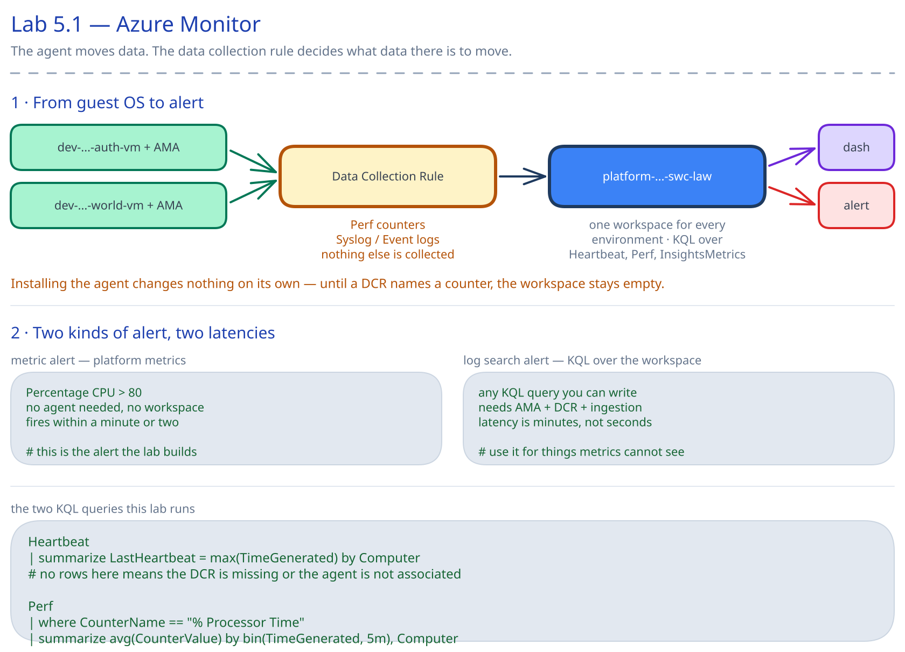

# Lab 5.1: Azure Monitor and Insights (1.5 hours)

## 🎯 Learning Objectives

By completing this lab, you will:

- Create and configure a **Log Analytics Workspace**
- Enable **VM Insights** for SkyCraft virtual machines
- Create **Log Search Alerts** based on KQL queries
- Configure **Metric Alerts** for high CPU utilization
- Build a custom **Azure Dashboard** for multi-resource visibility
- Query logs using **Kusto Query Language (KQL)**

---

## 🏗️ Architecture Overview

[Description]: Log Analytics Workspace serves as the central repository for all telemetry. Monitor Alerts watch the workspace and metrics to trigger notifications.

<picture>
  <source media="(prefers-color-scheme: dark)" srcset="images/lab-5.1-architecture.dark.svg">
  <source media="(prefers-color-scheme: light)" srcset="images/lab-5.1-architecture.svg">
  
</picture>

---

## 📋 Real-World Scenario

**Situation**: The SkyCraft game world servers periodically experience performance spikes. The operations team (led by Malfurion) needs a centralized way to view logs and receive urgent notifications if a server becomes unresponsive or overloaded. Currently, logs are scattered across individual VMs, making troubleshooting "AzerothCore" crashes difficult.

**Your Task**: Deploy a centralized Log Analytics Workspace, connect the existing SkyCraft development virtual machines to it, and create an automated alert system that notifies the team when CPU exceeds 80%.

---

## ⏱️ Estimated Time: 1.5 hours

- **Section 1**: Log Analytics & Monitoring Fundamentals (20 min)
- **Section 2**: Deploy Log Analytics Workspace (20 min)
- **Section 3**: Enable VM Insights & Data Collection (20 min)
- **Section 4**: Querying with KQL (15 min)
- **Section 5**: Configure Alerts & Dashboards (15 min)

---

## ✅ Prerequisites

Before starting this lab:

- [ ] Completed **Lab 3.2: Virtual Machines** - at least one of `dev-skycraft-swc-auth-vm` or `prod-skycraft-swc-auth-vm` is running (the dev VM is preferred as the monitored VM and alert target)
- [ ] Completed **Lab 4.1: Storage Accounts** (`platformskycraftswcsa` in `platform-skycraft-swc-rg` receives the storage diagnostic setting)
- [ ] Resource group `platform-skycraft-swc-rg` exists (Lab 1.2)
- [ ] `Contributor` role at the subscription level

These are the checks `scripts/Deploy-Bicep.ps1` performs before deploying - it exits if no VM or no platform storage account is found.

---

## 📖 Section 1: Monitoring Fundamentals (20 min)

### What is Azure Monitor?

**Azure Monitor** is a comprehensive solution for collecting, analyzing, and acting on telemetry from your cloud and on-premises environments. It helps you understand how your applications are performing and proactively identifies issues affecting them.

### Data Types: Metrics vs. Logs

| Feature         | Metrics                         | Logs                                |
| :-------------- | :------------------------------ | :---------------------------------- |
| **Data Format** | Numerical values over time      | Structured strings/records          |
| **Speed**       | Near real-time                  | Higher latency (minutes)            |
| **Retention**   | 93 days (standard)              | 30 days to 7 years                  |
| **Best For**    | Alerts, dashboards, autoscaling | Deep-dive troubleshooting, auditing |

### Log Analytics Workspace (LAW)

A **Log Analytics Workspace** is a unique environment for Azure Monitor log data. Each workspace has its own data repository and configuration, and data sources are configured to store their data in a particular workspace.

---

## 📖 Section 2: Deploy Log Analytics Workspace (20 min)

### Step 5.1.1: Create the Workspace

1. Navigate to **Azure Portal** → Search for **Log Analytics workspaces**.
2. Click **+ Create**.
3. Fill in the details:

| Field          | Value                       |
| :------------- | :-------------------------- |
| Subscription   | [Your Subscription]         |
| Resource Group | `platform-skycraft-swc-rg`  |
| Name           | `platform-skycraft-swc-law` |
| Region         | **Sweden Central**          |

4. Click **Review + Create** → **Create**.

**Expected Result**: The workspace `platform-skycraft-swc-law` is created successfully.

---

## 📖 Section 3: Enable VM Insights (20 min)

### Step 5.1.2: Connect Virtual Machines

1. Navigate to **Monitor** (portal sidebar) → **Virtual Machines**.
2. Click the **Not monitored** tab.
3. Find your `dev-skycraft-swc-auth-vm` (or equivalent).
4. Click **Enable**.
5. Select the **Azure Monitor agent** (recommended).
6. Under **Data Collection Rule**, click **Create New**:
   - Name: `skycraft-vm-dcr`
   - Destination: `platform-skycraft-swc-law` (the one you just created)
7. Click **Enable**.

> [!NOTE]
> This process installs the **Azure Monitor Agent (AMA)** and configures a **Data Collection Rule (DCR)** to stream performance counters and Syslog/Event logs to your LAW.

**Expected Result**: After 5-10 minutes, the VM status changes to "Monitored".

---

## 📖 Section 4: Querying with KQL (15 min)

### Step 5.1.3: Run Your First Query

1. Navigate to your **Log Analytics workspace** (`platform-skycraft-swc-law`).
2. Click **Logs** in the left menu.
3. Close the "Queries" overlay.
4. Paste the following query to check heartbeat (connectivity) of your VMs:

```kusto
Heartbeat
| summarize LastHeartbeat = max(TimeGenerated) by Computer
```

5. Click **Run**.

### Step 5.1.4: Query Performance Data

Run this query to see top CPU consumers:

```kusto
Perf
| where CounterName == "% Processor Time"
| summarize AverageCPU = avg(CounterValue) by Computer, bin(TimeGenerated, 15m)
| render timechart
```

---

## 📖 Section 5: Configure Alerts & Dashboards (15 min)

### Step 5.1.5: Create a Metric Alert (CPU > 80%)

The alert rule and its action group are **platform** resources - they live in `platform-skycraft-swc-rg` next to the workspace, even though the rule watches a dev VM. Create them from Azure Monitor rather than from the VM blade so they land in the right resource group; `scripts/Test-Lab.ps1` looks for `skycraft-cpu-alert` there by name.

1. Navigate to **Monitor** → **Alerts** → **+ Create** → **Alert rule**.
2. **Scope**: select `dev-skycraft-swc-auth-vm` (or `prod-skycraft-swc-auth-vm` if only the prod environment exists).
3. **Condition** → **Signal name**: **Percentage CPU**. Configure the logic:
   - Threshold: **Static**
   - Aggregation type: **Average**
   - Operator: **Greater than**
   - Threshold value: **80**
   - Check every: **1 minute**
   - Lookback period: **5 minutes**
4. **Actions** → **+ Create action group**:
   - Resource group: `platform-skycraft-swc-rg`
   - Action group name: `skycraft-ops-ag`
   - Display name: `SkyCraftOps`
   - Notification: **Email/SMS message/Push/Voice** (enter your email)
5. **Details**:
   - Resource group: `platform-skycraft-swc-rg`
   - Severity: **2 - Warning**
   - Alert rule name: `skycraft-cpu-alert`
   - Enable upon creation: **checked**
6. **Tags**: `Project = SkyCraft`, `Environment = Platform`, `CostCenter = MSDN`.
7. Click **Review + create** → **Create**.

#### Azure CLI

```azurecli
az monitor action-group create \
  --name skycraft-ops-ag --short-name SkyCraftOps \
  --resource-group platform-skycraft-swc-rg \
  --action email ops you@example.com

az monitor metrics alert create \
  --name skycraft-cpu-alert \
  --resource-group platform-skycraft-swc-rg \
  --scopes $(az vm show -g dev-skycraft-swc-rg -n dev-skycraft-swc-auth-vm --query id -o tsv) \
  --condition "avg Percentage CPU > 80" \
  --window-size 5m --evaluation-frequency 1m --severity 2 \
  --action skycraft-ops-ag \
  --tags Project=SkyCraft Environment=Platform CostCenter=MSDN
```

#### Azure PowerShell

```powershell
$email = New-AzActionGroupEmailReceiverObject -Name ops -EmailAddress you@example.com
$ag = New-AzActionGroup -Name skycraft-ops-ag -ShortName SkyCraftOps -ResourceGroupName platform-skycraft-swc-rg -Location Global -EmailReceiver $email

$vm = Get-AzVM -Name dev-skycraft-swc-auth-vm -ResourceGroupName dev-skycraft-swc-rg
$criteria = New-AzMetricAlertRuleV2Criteria -MetricName 'Percentage CPU' -MetricNamespace 'Microsoft.Compute/virtualMachines' `
  -TimeAggregation Average -Operator GreaterThan -Threshold 80

Add-AzMetricAlertRuleV2 -Name skycraft-cpu-alert -ResourceGroupName platform-skycraft-swc-rg `
  -TargetResourceId $vm.Id -Condition $criteria -ActionGroupId $ag.Id `
  -WindowSize 00:05:00 -Frequency 00:01:00 -Severity 2 `
  -Description 'CPU > 80% on SkyCraft VM'
```

**Expected Result**: `skycraft-cpu-alert` is listed under **Monitor** → **Alerts** → **Alert rules** in `platform-skycraft-swc-rg`, enabled, severity 2, with `skycraft-ops-ag` as its action.

### Step 5.1.6: Pin to Dashboard

1. Run the CPU query from Step 5.1.4 again.
2. Click **Pin to** → **Azure Dashboard**.
3. Create a new dashboard named `SkyCraft-Ops`.

### Step 5.1.7: Route storage diagnostics to the workspace

Beyond VM telemetry, this lab also routes the **platform storage account's blob logs** to the workspace, centralizing storage access auditing alongside VM metrics and logs. The setting is attached to the **blob service** of the account, not to the account itself.

1. Navigate to **Storage accounts** → `platformskycraftswcsa` → **Monitoring** → **Diagnostic settings**.
2. Select **blob** in the resource tree, then **+ Add diagnostic setting**.
3. Diagnostic setting name: `skycraft-storage-diag`
4. Logs: **StorageRead** and **StorageWrite**.
5. Destination: **Send to Log Analytics workspace** → `platform-skycraft-swc-law`.
6. Click **Save**.

#### Azure CLI

```azurecli
SA=$(az storage account show -g platform-skycraft-swc-rg -n platformskycraftswcsa --query id -o tsv)
LAW=$(az monitor log-analytics workspace show -g platform-skycraft-swc-rg -n platform-skycraft-swc-law --query id -o tsv)

az monitor diagnostic-settings create --name skycraft-storage-diag \
  --resource "$SA/blobServices/default" --workspace "$LAW" \
  --logs '[{"category":"StorageRead","enabled":true},{"category":"StorageWrite","enabled":true}]'
```

#### Azure PowerShell

```powershell
$sa  = Get-AzStorageAccount -ResourceGroupName platform-skycraft-swc-rg -Name platformskycraftswcsa
$law = Get-AzOperationalInsightsWorkspace -ResourceGroupName platform-skycraft-swc-rg -Name platform-skycraft-swc-law
$logs = 'StorageRead', 'StorageWrite' | ForEach-Object { New-AzDiagnosticSettingLogSettingsObject -Category $_ -Enabled $true }

New-AzDiagnosticSetting -Name skycraft-storage-diag -ResourceId "$($sa.Id)/blobServices/default" -WorkspaceId $law.ResourceId -Log $logs
```

**Expected Result**: `skycraft-storage-diag` appears under the blob service's diagnostic settings; within 15 minutes `StorageBlobLogs` in the workspace returns rows for every read and write against the platform account.

**Preview - the AVM module calls the Bicep path makes** (`bicep/main.bicep`; versions pinned in `docs/bicep-standards.md` §4.4):

```bicep
module modWorkspace 'br/public:avm/res/operational-insights/workspace:0.16.1' = {
  name: 'law-deployment'
  scope: resourceGroup('platform-skycraft-swc-rg')
  params: {
    name: 'platform-skycraft-swc-law'
    skuName: 'PerGB2018'
    dataRetention: 30                       // the module defaults to 365
    ...
  }
}

module modCpuAlert 'br/public:avm/res/insights/metric-alert:0.4.1' = {
  ...
  params: {
    criteria: {
      'odata.type': 'Microsoft.Azure.Monitor.SingleResourceMultipleMetricCriteria'
      allof: [ { metricName: 'Percentage CPU', operator: 'GreaterThan', threshold: 80, ... } ]
    }
    actions: [modActionGroup.outputs.resourceId]
  }
}
```

The data collection rule and the action group follow the same pattern. The storage diagnostic setting is the one resource without an AVM module and lives in `bicep/modules/storage-blob-diagnostics.bicep` (see `ARCHITECTURE.md` §5).

---

## ✅ Lab Checklist

- [ ] Log Analytics Workspace `platform-skycraft-swc-law` created
- [ ] At least one VM connected using Azure Monitor Agent
- [ ] KQL query returned `Heartbeat` data
- [ ] Alert rule `skycraft-cpu-alert` (>80% CPU, severity 2) with action group `skycraft-ops-ag` in `platform-skycraft-swc-rg`
- [ ] Azure Dashboard contains at least one pinned chart
- [ ] Diagnostic setting `skycraft-storage-diag` streams `StorageRead`/`StorageWrite` from `platformskycraftswcsa` to the workspace

**For detailed verification**, see [lab-checklist-5.1.md](lab-checklist-5.1.md)

---

## 🔧 Troubleshooting

### Issue 1: "No Data Received" in Log Analytics

**Symptom**: KQL queries return empty results.

**Solution**:

- Ensure the VM is **Running**.
- Wait up to 10 minutes for the AMA agent to finalize configuration.
- Check if the **Data Collection Rule** is correctly associated with the VM.

---

## 🎓 Knowledge Check

1. **What is the difference between Azure Monitor Agent (AMA) and the legacy Log Analytics agent?**
   <details>
     <summary>**Click to see the answer**</summary>

   **Answer**: AMA provides more secure, granular data collection through Data Collection Rules (DCRs) and supports multi-homing more efficiently. The legacy agent is being deprecated in August 2024.
   </details>

2. **What does KQL stand for?**
   <details>
     <summary>**Click to see the answer**</summary>

   **Answer**: Kusto Query Language. It is used across Azure Monitor, Microsoft Sentinel, and Azure Data Explorer.
   </details>

---

## 📚 Additional Resources

- [Azure Monitor Documentation](https://learn.microsoft.com/en-us/azure/azure-monitor/overview)
- [Log Analytics Tutorial](https://learn.microsoft.com/en-us/azure/azure-monitor/logs/log-analytics-tutorial)
- [KQL Quick Reference](https://learn.microsoft.com/en-us/azure/data-explorer/kql-quick-reference)
- [Azure Monitor Agent Overview](https://learn.microsoft.com/en-us/azure/azure-monitor/agents/agents-overview)

---

## 📌 Module Navigation

[Module 5 README](../README.md) | [Next Lab: 5.2 Business Continuity →](../5.2-business-continuity/lab-guide-5.2.md)

---

## 📝 Lab Summary

**What You Accomplished:**

✅ Created a centralized Log Analytics Workspace for SkyCraft telemetry
✅ Enabled VM Insights using Azure Monitor Agent (AMA)
✅ Queried performance data using Kusto Query Language (KQL)
✅ Configured metric alerts for CPU threshold monitoring
✅ Built a custom Azure Dashboard for operational visibility

**Time Spent**: ~1.5 hours

**Ready for Lab 5.2?** Next, you'll implement backup and disaster recovery for SkyCraft VMs.
