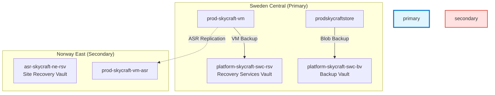

# Lab 5.2: Business Continuity & Disaster Recovery (1.5 hours)

## 🎯 Learning Objectives

By completing this lab, you will:

- Deploy an **Azure Recovery Services Vault (RSV)**
- Configure **Backup Policies** for different SLA requirements
- Implement **Azure VM Backup** for production workloads
- Perform a **File-Level Recovery (FLR)** from a backup snapshot
- Understand the difference between **LRS** and **GRS** for backup data
- Configure **Soft Delete** for protected items

---

## 🏗️ Architecture Overview

[Description]: Recovery Services Vault stores VM snapshots. Backup Vault stores Blob/Disk backups. Site Recovery replicates the VM to a secondary region (Norway East).

---

## 📋 Real-World Scenario

**Situation**: A catastrophic failure hits the primary region. Not only are VMs down, but data corruption has spread. Malfurion needs a comprehensive strategy: VM restoration for standard failures, Blob backup for game assets, and a "red button" full-region failover for disaster scenarios.

**Your Task**: Implement a multi-layered BCDR strategy:

1. **Azure Backup**: Protect VMs using RSV.
2. **Backup Vault**: Protect Blob Storage operational data.
3. **Site Recovery**: Enable replication to Norway East for the production server.

---

## ⏱️ Estimated Time: 2.5 hours

- **Section 1**: Backup & Recovery Concepts (15 min)
- **Section 2**: Recovery Services Vault & VM Backup (30 min)
- **Section 3**: Backup Vault & Blob Backup (30 min)
- **Section 4**: Azure Site Recovery & Cross-Region (45 min)
- **Section 5**: Reports & Alerts (15 min)
- **Section 6**: Recovery Simulation (15 min)

---

## ✅ Prerequisites

Before starting this lab:

- [ ] Completed **Module 3: Compute** (VM must exist)
- [ ] Completed **Module 4: Storage** (Storage account must exist)
- [ ] Resource group `platform-skycraft-swc-rg` exists
- [ ] **Quota Availability**: Ensure you have quota for 2 vCPUs in **Norway East**

---

## 📖 Section 1: Backup Concepts (20 min)

### What is Azure Backup?

**Azure Backup** is a cost-effective, secure, one-click backup solution that's scalable based on your backup storage needs. It protects diverse workloads like VMs, SQL databases, SAP HANA, and Azure Files.

### Recovery Services Vault (RSV)

An **RSV** is a storage entity in Azure that houses data. The data is typically copies of data, or configuration information for virtual machines, workloads, servers, or workstations.

### Backup Redundancy

Just like storage accounts, vaults support redundancy:

- **LRS (Locally Redundant)**: Protects against rack and drive failures.
- **GRS (Geo Redundant)**: Protects against regional outages.
- **CRR (Cross Region Restore)**: Allows you to restore data in the secondary region even if the primary region is up.

---

## 📖 Section 2: Deploy Recovery Services Vault (20 min)

### Step 5.2.1: Create the Vault

1. Navigate to **Azure Portal** → Search for **Recovery Services vaults**.
2. Click **+ Create**.
3. Fill in the details:

| Field          | Value                       |
| :------------- | :-------------------------- |
| Subscription   | [Your Subscription]         |
| Resource Group | `platform-skycraft-swc-rg`  |
| Vault Name     | `platform-skycraft-swc-rsv` |
| Region         | **Sweden Central**          |

4. Click **Review + Create** → **Create**.

> [!IMPORTANT]
> Change the **Storage Replication Type** immediately after creation if you want to use LRS (to save cost) before any backups are performed.
> Go to **Properties** → **Backup Configuration** → **Update**.

**Expected Result**: Vault `platform-skycraft-swc-rsv` is deployed.

---

## 📖 Section 3: Configure Backup Policy (15 min)

### Step 5.2.2: Create a Production Policy

1. Inside the vault, go to **Manage** → **Backup policies**.
2. Click **+ Add** → **Azure Virtual Machine**.
3. Policy Name: `SkyCraft-Daily-Prod`.
4. Frequency: **Daily** at **02:00 AM**.
5. Timezone: **(UTC) Coordinated Universal Time**.
6. Instant Restore retention: **2 days**.
7. Retention of daily backup point: **30 days**.
8. Click **Create**.

---

## 📖 Section 4: Enable VM Backup (20 min)

### Step 5.2.3: Protect the Production VM

1. In the vault, click **Overview** → **+ Backup**.
2. Where is your workload running? **Azure**.
3. What do you want to back up? **Virtual machine**.
4. Click **Configure Backup**.
5. Select the policy: `SkyCraft-Daily-Prod`.
6. Select Virtual Machines: Find and select `prod-skycraft-vm`.
7. Click **Enable Backup**.

> [!TIP]
> The first backup is an **Initial Replica** (full backup). Subsequent backups are **Incrementals** (only changed blocks), making them faster and cheaper.

---

## 📖 Section 3: Backup Vault & Blob Protection (30 min)

### Step 5.2.4: Deploy Backup Vault

**Backup Vaults** are newer entities used for Azure Blobs, Azure Disks, and PostgreSQL. They are distinct from Recovery Services Vaults.

1. Search for **Backup vaults**.
2. Click **+ Create**.
3. Resource Group: `platform-skycraft-swc-rg`
4. Name: `platform-skycraft-swc-bv`
5. Region: **Sweden Central**
6. Backup Storage Redundancy: **Locally-redundant (LRS)**
7. Click **Review + create** → **Create**.

### Step 5.2.5: Configure Blob Backup

1. Navigate to your new **Backup Vault**.
2. Go to **Manage** → **Backup policies**.
3. Create a new policy:
   - Datasource type: **Azure Blobs**
   - Policy name: `SkyCraft-Blob-Policy`
   - Vault: `platform-skycraft-swc-bv`
   - Schedule: **Daily**
   - Retention: **30 days**
4. Review and create the policy.

---

## 📖 Section 4: Azure Site Recovery (45 min)

### Step 5.2.6: Enable Replication

1. Navigate to your VM: `prod-skycraft-vm`.
2. Access **Disaster recovery** in the left menu.
3. Target region: **Norway East** (or another available European region).
4. Click **Advanced settings** to review resources (ASR creates a cache storage account and target resources).
5. Click **Refiew + Start replication**.

> [!NOTE]
> Initial synchronization can take 15-30 minutes depending on disk size.

### Step 5.2.7: Perform Test Failover

1. Once status is **Protected**, click **Test Failover**.
2. Recovery Point: **Latest processed**.
3. Azure Virtual Network: Select the created ASR VNet in the target region.
4. Click **Test Failover**.
5. Once complete, verify the new VM exists in the target region.
6. Click **Cleanup test failover** to remove temporary resources.

---

## 📖 Section 5: Reports & Alerts (15 min)

### Step 5.2.8: Configure Backup Reports

1. Navigate to **Backup center** → **Backup reports**.
2. Link your **Log Analytics Workspace** (`platform-skycraft-swc-law`) to enable reporting.
3. View the **Backup Instances** report to see protection status across all vaults.

### Step 5.2.9: Review Alerts

1. In **Backup center**, click **Alerts**.
2. Verify if any Critical or Warning alerts exist (e.g., from failed test backups).
3. Configure a notification rule to email `admins@skycraft.com` for Critical alerts.

---

## 📖 Section 6: Recovery Simulation (15 min)

### Step 5.2.10: File-Level Recovery

Instead of restoring the whole VM, we can mount a specific recovery point as a drive:

1. In the vault, go to **Protected items** → **Backup items**.
2. Select **Azure Virtual Machine** → Click on your VM name.
3. Click **File Recovery**.
4. Select a Recovery Point (the one you just triggered or a recent one).
5. Click **Download Script**.
6. Run the script on the VM to mount the backup disk as a local volume.

**Expected Result**: You see the files from the backup point listed in a new drive letter on the VM.

---

## ✅ Lab Checklist

- [ ] Vault `platform-skycraft-swc-rsv` deployed and configured (LRS/GRS)
- [ ] Backup policy `SkyCraft-Daily-Prod` created with 30-day retention
- [ ] Production VM registered for backup
- [ ] Initial backup job triggered or completed
- [ ] Detailed verification performed (see checklist)

**For detailed verification**, see [lab-checklist-5.2.md](lab-checklist-5.2.md)

---

## 🔧 Troubleshooting

### Issue 1: Deployment of Vault Fails

**Symptom**: "Resource provider not registered" error.

**Solution**:

- Ensure `Microsoft.RecoveryServices` provider is registered in your subscription.
- Navigate to **Subscription** → **Resource Providers** → Register `Microsoft.RecoveryServices`.

---

## 🎓 Knowledge Check

1. **What is "Soft Delete" in Recovery Services Vault?**
   

     
**Click to see the answer**

   **Answer**: It retains deleted backup data for 14 additional days at no cost, protecting against accidental deletion or ransomware attacks.
   

2. **Can you change the vault redundancy (LRS to GRS) after backups are taken?**
   

     
**Click to see the answer**

   **Answer**: No. Redundancy must be configured before the first backup is stored. To change it later, you must delete all items and start over.
   

---

## 📚 Additional Resources

- [Azure Backup Overview](https://learn.microsoft.com/en-us/azure/backup/backup-overview)
- [Recovery Services Vault Documentation](https://learn.microsoft.com/en-us/azure/backup/backup-azure-recovery-services-vault-overview)
- [Azure VM Backup Tutorial](https://learn.microsoft.com/en-us/azure/backup/quick-backup-vm-portal)
- [File Recovery from Azure VM Backup](https://learn.microsoft.com/en-us/azure/backup/backup-azure-restore-files-from-vm)

---

## 📌 Module Navigation

[Lab 5.1 Azure Monitor ←](../5.1-azure-monitor/lab-guide-5.1.md) | [Next Lab: 5.3 Network Monitoring →](../5.3-network-monitoring/lab-guide-5.3.md)

---

## 📝 Lab Summary

**What You Accomplished:**

✅ Deployed a **Recovery Services Vault** for VM snapshots
✅ Deployed a **Backup Vault** for Blob Storage protection
✅ Configured backup policies for both Compute and Storage
✅ Enabled **Azure Site Recovery** to replicate Production to Norway East
✅ Successfully performed a **Test Failover** to validate BCDR strategy
✅ Configured **Backup Reports** for ongoing compliance monitoring
✅ Explored File-Level Recovery vs Full VM Restore

**Time Spent**: ~2.5 hours

**Ready for Lab 5.3?** Next, you'll use Network Watcher to diagnose and troubleshoot connectivity issues.
