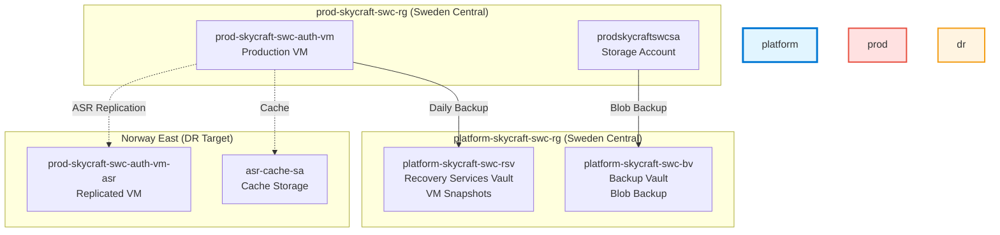

# Lab 5.2: Business Continuity & Disaster Recovery (2 hours)

## 🎯 Learning Objectives

By completing this lab, you will:

- **Deploy** an Azure **Recovery Services Vault** for VM backup
- **Deploy** an Azure **Backup Vault** for Blob Storage protection
- **Configure Backup Policies** with custom retention and scheduling
- **Enable VM Backup** and trigger an initial backup job
- **Perform File-Level Recovery** from a backup snapshot
- **Configure Azure Site Recovery** for cross-region disaster recovery
- **Execute a test failover** to validate the BCDR strategy

---

## 🏗️ Architecture Overview

The BCDR architecture uses two vault types: Recovery Services Vault for VM snapshots and Backup Vault for Blob operational backups. Azure Site Recovery replicates the production VM to Norway East as a disaster recovery target.


```mermaid
graph TB
    subgraph "platform-skycraft-swc-rg (Sweden Central)"
        style platform fill:#e1f5ff,stroke:#0078d4,stroke-width:3px
        RSV["platform-skycraft-swc-rsv<br/>Recovery Services Vault<br/>VM Snapshots"]
        BV["platform-skycraft-swc-bv<br/>Backup Vault<br/>Blob Backup"]
    end

    subgraph "prod-skycraft-swc-rg (Sweden Central)"
        style prod fill:#ffe1e1,stroke:#e74c3c,stroke-width:2px
        VM_Prod["prod-skycraft-swc-auth-vm<br/>Production VM"]
        SA_Prod["prodskycraftswcsa<br/>Storage Account"]
    end

    subgraph "Norway East (DR Target)"
        style dr fill:#fff4e1,stroke:#f39c12,stroke-width:2px
        VM_Replica["prod-skycraft-swc-auth-vm-asr<br/>Replicated VM"]
        ASR_Cache["asr-cache-sa<br/>Cache Storage"]
    end

    VM_Prod -->|"Daily Backup"| RSV
    SA_Prod -->|"Blob Backup"| BV
    VM_Prod -.->|"ASR Replication"| VM_Replica
    VM_Prod -.->|"Cache"| ASR_Cache
```

---

## 📋 Real-World Scenario

**Situation**: A catastrophic failure hits the Sweden Central region. Not only are VMs down, but data corruption has spread to production storage. The SkyCraft operations team needs a comprehensive strategy: VM restoration for standard failures, Blob backup for game assets, and a "red button" full-region failover for disaster scenarios. Currently, there is no backup or disaster recovery strategy — a single disk failure could wipe out the entire game world database.

| Scenario                | Recovery Method           | RPO         | RTO           |
| ----------------------- | ------------------------- | ----------- | ------------- |
| **Accidental deletion** | File-Level Recovery (FLR) | Last backup | Minutes       |
| **VM corruption**       | Full VM restore from RSV  | 24 hours    | 1-2 hours     |
| **Regional outage**     | Site Recovery failover    | ~15 minutes | 15-30 minutes |
| **Blob data loss**      | Blob operational backup   | Last backup | Minutes       |

**Your Task**: Implement a multi-layered BCDR strategy:

- Deploy a Recovery Services Vault and configure daily VM backups with 30-day retention
- Deploy a Backup Vault for Blob Storage operational backups
- Enable Azure Site Recovery replication to Norway East
- Validate the strategy with a test failover and file-level recovery

**Business Impact**:

- **Zero data loss risk** with daily automated backups
- **< 30 minute RTO** for regional disaster via Site Recovery
- **Regulatory compliance** with 30-day backup retention
- **Ransomware protection** via Soft Delete (14-day safety net)

---

## ⏱️ Estimated Time: 2 hours

- **Section 1**: Backup & Recovery Concepts (15 min)
- **Section 2**: Recovery Services Vault & VM Backup (30 min)
- **Section 3**: Backup Vault & Blob Protection (25 min)
- **Section 4**: Azure Site Recovery & Cross-Region DR (30 min)
- **Section 5**: Recovery Simulation (10 min)
- **Section 6**: Reports & Alerts (10 min)

---

## ✅ Prerequisites

Before starting this lab:

- [ ] Completed **Lab 3.2** (at least one VM must exist and be running)
- [ ] Completed **Lab 4.1** (at least one storage account must exist)
- [ ] Completed **Lab 5.1** (Log Analytics Workspace for backup reports)
- [ ] Existing resources:
  - Resource groups: `platform-skycraft-swc-rg`, `prod-skycraft-swc-rg`
  - VM: `prod-skycraft-swc-auth-vm` (running)
  - Storage: `prodskycraftswcsa`
  - LAW: `platform-skycraft-swc-law`
- [ ] Azure CLI installed (version 2.50.0 or later)
- [ ] PowerShell Az module installed
- [ ] `Contributor` role at the subscription level
- [ ] **Quota**: At least 2 vCPUs available in **Norway East** (for Site Recovery)

**Verify prerequisites**:

```azurecli
# Verify VM is running
az vm show --resource-group prod-skycraft-swc-rg --name prod-skycraft-swc-auth-vm --query "{Name:name,Status:provisioningState}" --output table

# Verify storage account exists
az storage account show --name prodskycraftswcsa --query "{Name:name,Location:location}" --output table

# Check Norway East vCPU quota
az vm list-usage --location norwayeast --query "[?contains(name.value,'standardDSv3Family')].{Name:name.localizedValue,Current:currentValue,Limit:limit}" --output table
```

---

## 📖 Section 1: Backup & Recovery Concepts (15 min)

### What is Azure Backup?

**Azure Backup** is a cost-effective, secure, one-click backup solution that scales based on your storage needs. It protects diverse workloads including VMs, SQL databases, SAP HANA, Azure Files, and Azure Blobs.

Azure offers two types of backup vaults:

| Feature               | Recovery Services Vault (RSV)   | Backup Vault                |
| :-------------------- | :------------------------------ | :-------------------------- |
| **Workloads**         | VMs, SQL, SAP HANA, Azure Files | Blobs, Disks, PostgreSQL    |
| **Backup Type**       | Snapshot + copy to vault        | Operational (point-in-time) |
| **Redundancy**        | LRS, GRS, ZRS                   | LRS, GRS, ZRS               |
| **Cross-Region**      | CRR (Cross Region Restore)      | Not supported               |
| **Soft Delete**       | 14 days (default)               | 14 days (default)           |
| **SkyCraft Use Case** | VM snapshots for game servers   | Blob backup for game assets |

### Backup Redundancy

| Redundancy | Protection Level    | SkyCraft Use                       |
| ---------- | ------------------- | ---------------------------------- |
| **LRS**    | Rack/drive failures | Development backups (cost savings) |
| **GRS**    | Regional outages    | Production backups (recommended)   |

> **SkyCraft Choice**: We chose **GRS** for the Recovery Services Vault because production game server backups must survive a regional outage. The ~2x cost increase over LRS is justified by the critical nature of world database data. Development VMs use LRS backups since they can be rebuilt from Bicep templates.

### RPO and RTO

- **RPO (Recovery Point Objective)**: Maximum acceptable data loss. With daily backups, RPO = 24 hours.
- **RTO (Recovery Time Objective)**: Maximum acceptable downtime. VM restore: 1-2 hours. Site Recovery failover: 15-30 minutes.

---

## 📖 Section 2: Recovery Services Vault & VM Backup (30 min)

### Step 5.2.1: Create the Recovery Services Vault

#### Option 1: Azure Portal (GUI)

1. Navigate to **Azure Portal** → Search for **Recovery Services vaults**
2. Click **+ Create**
3. Fill in the details:

| Field          | Value                       |
| :------------- | :-------------------------- |
| Subscription   | [Your Subscription]         |
| Resource Group | `platform-skycraft-swc-rg`  |
| Vault Name     | `platform-skycraft-swc-rsv` |
| Region         | **Sweden Central**          |

4. Click **Review + Create** → **Create**

> [!IMPORTANT]
> Change the **Storage Replication Type** immediately after creation **before any backups are performed**. Go to vault → **Properties** → **Backup Configuration** → **Update** → Select **Geo-redundant**. This cannot be changed after the first backup.

#### Option 2: Azure CLI

```bash
# Create Recovery Services Vault
az backup vault create \
  --resource-group platform-skycraft-swc-rg \
  --name platform-skycraft-swc-rsv \
  --location swedencentral

# Set storage redundancy to GRS (must be done before first backup)
az backup vault backup-properties set \
  --resource-group platform-skycraft-swc-rg \
  --name platform-skycraft-swc-rsv \
  --backup-storage-redundancy GeoRedundant
```

#### Option 3: PowerShell

```powershell
# Create Recovery Services Vault
New-AzRecoveryServicesVault `
    -ResourceGroupName 'platform-skycraft-swc-rg' `
    -Name 'platform-skycraft-swc-rsv' `
    -Location 'swedencentral'

# Set storage redundancy to GRS
$vault = Get-AzRecoveryServicesVault -ResourceGroupName 'platform-skycraft-swc-rg' -Name 'platform-skycraft-swc-rsv'
Set-AzRecoveryServicesBackupProperty -Vault $vault -BackupStorageRedundancy GeoRedundant
```

**Expected Result**: Vault `platform-skycraft-swc-rsv` is deployed with GRS redundancy.

### Step 5.2.2: Create a Backup Policy

#### Option 1: Azure Portal (GUI)

1. Inside the vault, go to **Manage** → **Backup policies**
2. Click **+ Add** → **Azure Virtual Machine**
3. Configure the policy:

| Field                     | Value                                |
| :------------------------ | :----------------------------------- |
| Policy name               | `SkyCraft-Daily-Prod`                |
| Frequency                 | **Daily**                            |
| Time                      | **02:00 AM**                         |
| Timezone                  | **(UTC) Coordinated Universal Time** |
| Instant Restore retention | **2 days**                           |
| Retention of daily backup | **30 days**                          |

4. Click **Create**

#### Option 2: Azure CLI

```bash
# Create custom backup policy from default template
az backup policy set \
  --resource-group platform-skycraft-swc-rg \
  --vault-name platform-skycraft-swc-rsv \
  --name SkyCraft-Daily-Prod \
  --policy '{
    "policyType": "V2",
    "instantRpRetentionRangeInDays": 2,
    "schedulePolicy": {
      "schedulePolicyType": "SimpleSchedulePolicyV2",
      "scheduleRunFrequency": "Daily",
      "scheduleRunTimes": ["2024-01-01T02:00:00Z"]
    },
    "retentionPolicy": {
      "retentionPolicyType": "LongTermRetentionPolicy",
      "dailySchedule": {
        "retentionTimes": ["2024-01-01T02:00:00Z"],
        "retentionDuration": { "count": 30, "durationType": "Days" }
      }
    }
  }'
```

**Expected Result**: Policy `SkyCraft-Daily-Prod` created with daily 2 AM backup and 30-day retention.

### Step 5.2.3: Enable VM Backup

#### Option 1: Azure Portal (GUI)

1. In the vault, click **Overview** → **+ Backup**
2. Where is your workload running? **Azure**
3. What do you want to back up? **Virtual machine**
4. Click **Backup**
5. Select the policy: `SkyCraft-Daily-Prod`
6. Click **Add** → Find and select `prod-skycraft-swc-auth-vm`
7. Click **Enable Backup**

#### Option 2: Azure CLI

```bash
# Enable backup for prod VM
az backup protection enable-for-vm \
  --resource-group platform-skycraft-swc-rg \
  --vault-name platform-skycraft-swc-rsv \
  --vm prod-skycraft-swc-auth-vm \
  --policy-name SkyCraft-Daily-Prod
```

#### Option 3: PowerShell

```powershell
$vault = Get-AzRecoveryServicesVault -ResourceGroupName 'platform-skycraft-swc-rg' -Name 'platform-skycraft-swc-rsv'
$policy = Get-AzRecoveryServicesBackupProtectionPolicy -VaultId $vault.ID -Name 'SkyCraft-Daily-Prod'

Enable-AzRecoveryServicesBackupProtection `
    -VaultId $vault.ID `
    -Policy $policy `
    -Name 'prod-skycraft-swc-auth-vm' `
    -ResourceGroupName 'prod-skycraft-swc-rg'
```

> [!TIP]
> The first backup is an **Initial Replica** (full backup). Subsequent backups are **Incrementals** (only changed blocks), making them faster and cheaper.

**Expected Result**: VM `prod-skycraft-swc-auth-vm` appears under **Protected items** → **Backup items** → **Azure Virtual Machine**.

### Step 5.2.4: Trigger an On-Demand Backup

#### Option 1: Azure Portal (GUI)

1. In the vault → **Protected items** → **Backup items** → **Azure Virtual Machine**
2. Click on `prod-skycraft-swc-auth-vm`
3. Click **Backup now**
4. Retain backup till: **[Default — 30 days from today]**
5. Click **OK**

#### Option 2: Azure CLI

```bash
# Trigger immediate backup
az backup protection backup-now \
  --resource-group platform-skycraft-swc-rg \
  --vault-name platform-skycraft-swc-rsv \
  --container-name "IaasVMContainer;iaasvmcontainerv2;prod-skycraft-swc-rg;prod-skycraft-swc-auth-vm" \
  --item-name "VM;iaasvmcontainerv2;prod-skycraft-swc-rg;prod-skycraft-swc-auth-vm" \
  --retain-until $(date -d '+30 days' +%d-%m-%Y)
```

> [!NOTE]
> Initial backup can take 15-60 minutes depending on disk size. You can continue with the next sections while it runs.

**Expected Result**: Backup job appears in **Backup jobs** with status **In progress** or **Completed**.

---

## 📖 Section 3: Backup Vault & Blob Protection (25 min)

### What is a Backup Vault?

**Backup Vaults** are a newer entity used for Azure Blobs, Azure Disks, and PostgreSQL. They are distinct from Recovery Services Vaults and use **operational backup** — a managed, local data protection solution that lets you retain data for up to 360 days.

### Step 5.2.5: Create Backup Vault

#### Option 1: Azure Portal (GUI)

1. Search for **Backup vaults**
2. Click **+ Create**
3. Fill in the details:

| Field                     | Value                       |
| :------------------------ | :-------------------------- |
| Subscription              | [Your Subscription]         |
| Resource Group            | `platform-skycraft-swc-rg`  |
| Vault Name                | `platform-skycraft-swc-bv`  |
| Region                    | **Sweden Central**          |
| Backup Storage Redundancy | **Locally-redundant (LRS)** |

4. Click **Review + create** → **Create**

#### Option 2: Azure CLI

```bash
# Create Backup Vault
az dataprotection backup-vault create \
  --resource-group platform-skycraft-swc-rg \
  --vault-name platform-skycraft-swc-bv \
  --location swedencentral \
  --type SystemAssigned \
  --storage-setting "[{type:LocallyRedundant,datastore-type:VaultStore}]"
```

#### Option 3: PowerShell

```powershell
$storageSetting = New-AzDataProtectionBackupVaultStorageSettingObject `
    -Type LocallyRedundant `
    -DataStoreType VaultStore

New-AzDataProtectionBackupVault `
    -ResourceGroupName 'platform-skycraft-swc-rg' `
    -VaultName 'platform-skycraft-swc-bv' `
    -Location 'swedencentral' `
    -StorageSetting $storageSetting `
    -IdentityType 'SystemAssigned'
```

**Expected Result**: Backup Vault `platform-skycraft-swc-bv` deployed with LRS.

### Step 5.2.6: Configure Blob Backup Policy

#### Option 1: Azure Portal (GUI)

1. Navigate to your new **Backup Vault** (`platform-skycraft-swc-bv`)
2. Go to **Manage** → **Backup policies**
3. Click **+ Add**
4. Configure:

| Field           | Value                  |
| :-------------- | :--------------------- |
| Datasource type | **Azure Blobs**        |
| Policy name     | `SkyCraft-Blob-Policy` |
| Retention       | **30 days**            |

5. Click **Create**

**Expected Result**: Policy `SkyCraft-Blob-Policy` created in the Backup Vault.

---

## 📖 Section 4: Azure Site Recovery (30 min)

### What is Azure Site Recovery?

**Azure Site Recovery (ASR)** provides disaster recovery by replicating VMs from a primary region to a secondary region. During an outage, you **fail over** to the secondary region, and when the primary recovers, you **fail back**.

### Step 5.2.7: Enable Replication

#### Option 1: Azure Portal (GUI)

1. Navigate to your VM: `prod-skycraft-swc-auth-vm`
2. Go to **Operations** → **Disaster recovery**
3. Target region: **Norway East**
4. Click **Advanced settings** to review:
   - ASR creates a cache storage account in the source region
   - ASR creates target resource group, VNet, and storage in Norway East
5. Click **Review + Start replication**

> [!NOTE]
> Initial synchronization can take **15-30 minutes** depending on disk size. The VM remains online during replication.

> [!CAUTION]
> Site Recovery incurs costs for the replicated instance, cache storage, and network egress. For SkyCraft, this is justified only for the production VM. Do not enable ASR for development VMs.

#### Option 2: Azure CLI

```bash
# Enable replication (simplified — Portal is recommended for initial setup)
# ASR CLI commands require multiple steps: create fabric, protection container,
# replication policy, and mapping. Use Portal for first-time setup.
az site-recovery vault create \
  --resource-group platform-skycraft-swc-rg \
  --vault-name platform-skycraft-swc-rsv \
  --location swedencentral
```

**Expected Result**: Replication status shows **Enabling protection** → eventually **Protected** (5-30 minutes).

### Step 5.2.8: Perform Test Failover

> [!IMPORTANT]
> **Always run a test failover before relying on ASR.** This validates that the replicated VM boots successfully in the DR region without affecting production.

1. Once replication status is **Protected**, click **Test Failover**
2. Configure:

| Field                 | Value                                      |
| :-------------------- | :----------------------------------------- |
| Recovery Point        | **Latest processed**                       |
| Azure Virtual Network | Select the ASR-created VNet in Norway East |

3. Click **Test Failover**
4. Wait for completion (5-15 minutes)
5. Verify the test VM exists in Norway East and is Running
6. Click **Cleanup test failover** → Check "Testing is complete" → **OK**

**Expected Result**: Test VM boots successfully in Norway East. Cleanup removes all temporary resources.

---

## 📖 Section 5: Recovery Simulation (10 min)

### Step 5.2.9: File-Level Recovery

Instead of restoring the entire VM, you can mount a specific recovery point as a drive:

1. In the vault, go to **Protected items** → **Backup items** → **Azure Virtual Machine**
2. Click on `prod-skycraft-swc-auth-vm`
3. Click **File Recovery**
4. Select a Recovery Point (the backup you triggered in Step 5.2.4)
5. Click **Download Script**
6. Run the script on a VM to mount the backup disk as a local volume
7. Browse the mounted volume to recover specific files
8. Click **Unmount Disks** when done

**Expected Result**: Backup files are accessible via the mounted recovery point volume.

---

## 📖 Section 6: Reports & Alerts (10 min)

### Step 5.2.10: Configure Backup Reports

1. Navigate to **Backup center** → **Backup reports**
2. Link your **Log Analytics Workspace** (`platform-skycraft-swc-law`) to enable reporting
3. View the **Backup Instances** report to see protection status across all vaults

### Step 5.2.11: Configure Backup Alerts

1. In **Backup center**, click **Alerts**
2. Review any existing Critical or Warning alerts
3. Configure notification rule for backup failures using the Action Group `skycraft-ops-ag` from Lab 5.1

**Expected Result**: Backup reports show all protected items and their status. Alert notifications route through the existing Action Group.

---

## ✅ Lab Checklist

### Resources Created

- [ ] Recovery Services Vault `platform-skycraft-swc-rsv` (GRS)
- [ ] Backup Vault `platform-skycraft-swc-bv` (LRS)
- [ ] Backup policy `SkyCraft-Daily-Prod` (daily, 30-day retention)
- [ ] Blob backup policy `SkyCraft-Blob-Policy` (30-day retention)

### Protection Verified

- [ ] Production VM registered for backup
- [ ] Initial backup job completed or in progress
- [ ] Site Recovery replication status: **Protected**
- [ ] Test failover completed and cleaned up

### Tags Applied

- [ ] Recovery Services Vault: Project=SkyCraft, Environment=Platform, CostCenter=MSDN

**For detailed verification**, see [lab-checklist-5.2.md](lab-checklist-5.2.md)

---

## 🔧 Troubleshooting

### Issue 1: "Resource provider not registered" Error

**Symptom**: Deployment of vault fails with provider registration error.

**Root Cause**: `Microsoft.RecoveryServices` or `Microsoft.DataProtection` provider not registered in the subscription.

**Solution**:

```bash
# Register required providers
az provider register --namespace Microsoft.RecoveryServices
az provider register --namespace Microsoft.DataProtection
```

Navigate to **Subscription** → **Resource Providers** → verify both show **Registered**.

### Issue 2: Cannot Change Vault Redundancy

**Symptom**: Storage replication type (LRS/GRS) is greyed out.

**Root Cause**: A backup has already been stored in the vault. Redundancy can only be changed before the first backup.

**Solution**:

- Delete all backup items and backup data from the vault
- Then change the redundancy setting
- Re-register workloads
- For new projects, always configure redundancy **immediately** after vault creation

### Issue 3: Site Recovery "Enable Replication" Fails

**Symptom**: ASR replication fails with quota or networking errors.

**Root Cause**: Insufficient vCPU quota in the target region (Norway East), or the target region doesn't support the VM SKU.

**Solution**:

- Check quota: Subscription → Usage + quotas → filter by Norway East
- Request quota increase if needed
- Verify VM SKU availability: `az vm list-skus --location norwayeast --size Standard_DS1_v2 --output table`

### Issue 4: Backup Job Stuck at "Taking Snapshot"

**Symptom**: Backup job shows "Taking Snapshot" for over 1 hour.

**Root Cause**: The VM guest agent is not running or is unresponsive. Azure Backup relies on the VM agent for application-consistent snapshots.

**Solution**:

- Restart the VM agent: `sudo systemctl restart waagent` (Linux)
- Verify agent: `az vm get-instance-view --resource-group prod-skycraft-swc-rg --name prod-skycraft-swc-auth-vm --query instanceView.vmAgent`
- If agent is not installed, reinstall it

### Issue 5: File Recovery Script Cannot Mount Disk

**Symptom**: The downloaded iSCSI script fails to connect or mount the recovery point.

**Root Cause**: Network or firewall rules blocking iSCSI traffic, or the script is being run from a non-Azure VM without proper connectivity.

**Solution**:

- Run the script from an **Azure VM** in the same region as the vault
- Ensure port **3260** (iSCSI) is not blocked by NSG rules
- Use `sudo` when running the script on Linux
- Try a different recovery point if the issue persists

---

## 🎓 Knowledge Check

1. **What is "Soft Delete" in Recovery Services Vault?**

   <details>
     <summary>**Click to see the answer**</summary>

   **Answer**: Soft Delete retains deleted backup data for **14 additional days** at no extra cost, protecting against accidental deletion or ransomware attacks. Even if an attacker deletes backups, the data can be recovered within the 14-day window. This is enabled by default and should not be disabled in production.
   </details>

2. **Can you change the vault redundancy (LRS to GRS) after backups are taken?**

   <details>
     <summary>**Click to see the answer**</summary>

   **Answer**: **No**. Redundancy must be configured **before** the first backup is stored. To change it later, you must delete all protected items and backup data, change the setting, and re-register workloads. This is why Step 5.2.1 emphasizes configuring redundancy immediately after vault creation.
   </details>

3. **What is the difference between a Recovery Services Vault and a Backup Vault?**

   <details>
     <summary>**Click to see the answer**</summary>

   **Answer**: **Recovery Services Vault** supports VMs, SQL in VMs, Azure Files, and SAP HANA using snapshot-based backups. **Backup Vault** supports newer workloads like Azure Blobs (operational backup), Azure Disks, and Azure Database for PostgreSQL. They use different APIs and have different feature sets. Both support Soft Delete and redundancy options.
   </details>

4. **What is the difference between RPO and RTO?**

   <details>
     <summary>**Click to see the answer**</summary>

   **Answer**: **RPO (Recovery Point Objective)** is the maximum acceptable amount of data loss, measured in time. A daily backup policy has RPO = 24 hours (you could lose up to 24 hours of data). **RTO (Recovery Time Objective)** is the maximum acceptable downtime. VM restore has RTO ≈ 1-2 hours, while Site Recovery failover has RTO ≈ 15-30 minutes.
   </details>

5. **When would you use File-Level Recovery instead of a full VM restore?**

   <details>
     <summary>**Click to see the answer**</summary>

   **Answer**: File-Level Recovery is ideal when you need to recover specific files (e.g., a corrupted config file, accidentally deleted game data) without the downtime and cost of restoring the entire VM. It mounts the backup as a volume, letting you browse and copy only the files you need. Full VM restore is needed when the OS or disk itself is corrupted.
   </details>

6. **Why does SkyCraft enable Site Recovery only for the production VM?**

   <details>
     <summary>**Click to see the answer**</summary>

   **Answer**: Site Recovery incurs costs for the replicated instance, cache storage, and network egress. Development VMs can be quickly rebuilt from Bicep templates (Module 3), making ASR unnecessary. Production VMs hold the game world database and require sub-30-minute failover, justifying the cost.
   </details>

---

## 📚 Additional Resources

- [Azure Backup Overview](https://learn.microsoft.com/en-us/azure/backup/backup-overview)
- [Recovery Services Vault Documentation](https://learn.microsoft.com/en-us/azure/backup/backup-azure-recovery-services-vault-overview)
- [Azure VM Backup Tutorial](https://learn.microsoft.com/en-us/azure/backup/quick-backup-vm-portal)
- [Azure Site Recovery Overview](https://learn.microsoft.com/en-us/azure/site-recovery/site-recovery-overview)
- [File Recovery from Azure VM Backup](https://learn.microsoft.com/en-us/azure/backup/backup-azure-restore-files-from-vm)

**Best Practices**:

- [Azure Backup Best Practices](https://learn.microsoft.com/en-us/azure/backup/guidance-best-practices)

---

## 📌 Module Navigation

[← Back to Module 5 Index](../README.md)

[← Previous Lab: 5.1 - Azure Monitor](../5.1-azure-monitor/lab-guide-5.1.md)

[Next Lab: 5.3 - Network Monitoring & Diagnostics →](../5.3-network-monitoring/lab-guide-5.3.md)

---

## 📝 Lab Summary

**What You Accomplished:**

✅ Deployed a **Recovery Services Vault** (`platform-skycraft-swc-rsv`) with GRS redundancy
✅ Created backup policy `SkyCraft-Daily-Prod` (daily at 2 AM, 30-day retention)
✅ Enabled and triggered VM backup for the production server
✅ Deployed a **Backup Vault** (`platform-skycraft-swc-bv`) for Blob operational backup
✅ Configured **Azure Site Recovery** replication to Norway East
✅ Performed a successful **test failover** to validate the BCDR strategy
✅ Explored **File-Level Recovery** for granular data restoration

**Infrastructure Deployed**:

| Resource                | Name                        | Configuration                    |
| ----------------------- | --------------------------- | -------------------------------- |
| Recovery Services Vault | `platform-skycraft-swc-rsv` | Sweden Central, GRS, Soft Delete |
| Backup Vault            | `platform-skycraft-swc-bv`  | Sweden Central, LRS              |
| VM Backup Policy        | `SkyCraft-Daily-Prod`       | Daily 2 AM, 30-day retention     |
| Blob Backup Policy      | `SkyCraft-Blob-Policy`      | 30-day retention                 |
| Site Recovery           | ASR to Norway East          | Prod VM replicated               |

**Time Spent**: ~2 hours

**Ready for Lab 5.3?** Next, you'll use Network Watcher to diagnose and troubleshoot connectivity issues across the SkyCraft infrastructure.

---

_Note: The BCDR infrastructure is now operational. Regular backup jobs will run automatically at 2 AM UTC. Site Recovery continuously replicates the production VM. The focus of this lab was backup and recovery configuration — ongoing operations monitoring is handled by the Azure Monitor infrastructure from Lab 5.1._
