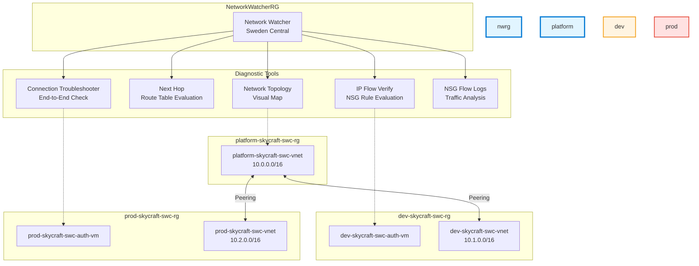

# Lab 5.3: Network Monitoring & Diagnostics (1 hour)

## 🎯 Learning Objectives

By completing this lab, you will:

- **Verify** Azure **Network Watcher** is enabled for Sweden Central
- **Use IP Flow Verify** to identify NSG rules blocking traffic
- **Use Next Hop** to troubleshoot routing issues between VNets
- **Generate Network Topology** diagrams for visual infrastructure review
- **Run Connection Troubleshooter** for end-to-end connectivity testing
- **Enable NSG Flow Logs** for traffic analysis and security auditing

---

## 🏗️ Architecture Overview

Network Watcher is a regional service that provides diagnostic and visualization tools for Azure virtual networks. It operates across all resource groups, testing connectivity between Hub and Spoke VNets in the SkyCraft topology.



---

## 📋 Real-World Scenario

**Situation**: Players are reporting intermittent connectivity to the SkyCraft development world server. The operations team suspects that a recently applied NSG rule is blocking traffic on port 8080, or perhaps a custom route is sending packets to the wrong gateway. Instead of manually inspecting dozens of NSG rules across multiple subnets, the team needs systematic diagnostic tools to pinpoint the exact failure point.

| Symptom                        | Suspected Cause       | Diagnostic Tool           |
| ------------------------------ | --------------------- | ------------------------- |
| Cannot connect to port 8080    | NSG rule blocking     | IP Flow Verify            |
| Traffic going to wrong gateway | Incorrect routing     | Next Hop                  |
| Intermittent SSH failures      | End-to-end path issue | Connection Troubleshooter |
| Unknown traffic patterns       | No visibility         | NSG Flow Logs             |

**Your Task**: Use Network Watcher to systematically diagnose the connectivity issue: verify NSG rules with IP Flow Verify, confirm routing with Next Hop, run end-to-end connection tests, and enable NSG Flow Logs for ongoing visibility.

**Business Impact**:

- **80% faster troubleshooting** with automated NSG and routing diagnostics
- **Complete traffic visibility** through Flow Logs for security auditing
- **Documented network topology** for infrastructure reviews

---

## ⏱️ Estimated Time: 1 hour

- **Section 1**: Network Watcher Fundamentals (10 min)
- **Section 2**: IP Flow Verify (15 min)
- **Section 3**: Next Hop & Topology (15 min)
- **Section 4**: Connection Troubleshooter & Flow Logs (20 min)

---

## ✅ Prerequisites

Before starting this lab:

- [ ] Completed **Lab 2.1** (VNets and subnets must exist)
- [ ] Completed **Lab 2.2** (NSGs must be configured)
- [ ] Completed **Lab 3.2** (at least one VM must be running)
- [ ] Existing resources:
  - VNets: `platform-skycraft-swc-vnet`, `dev-skycraft-swc-vnet`, `prod-skycraft-swc-vnet`
  - NSGs: `dev-skycraft-swc-nsg`, `prod-skycraft-swc-nsg`
  - At least one running VM
- [ ] Azure CLI installed (version 2.50.0 or later)
- [ ] PowerShell Az module installed
- [ ] `Contributor` role at the subscription level

**Verify prerequisites**:

```azurecli
# Verify VNets exist
az network vnet list --query "[?contains(name,'skycraft')].{Name:name,RG:resourceGroup,AddressSpace:addressSpace.addressPrefixes[0]}" --output table

# Verify at least one VM is running
az vm list --query "[?contains(name,'skycraft')].{Name:name,Status:powerState,RG:resourceGroup}" --output table

# Verify NSGs exist
az network nsg list --query "[?contains(name,'skycraft')].{Name:name,RG:resourceGroup}" --output table
```

---

## 📖 Section 1: Network Watcher Fundamentals (10 min)

### What is Network Watcher?

**Azure Network Watcher** provides tools to monitor, diagnose, view metrics, and enable or disable logs for resources in an Azure virtual network. It is a regional service — one instance per region — and is typically auto-enabled when you create a VNet.

Network Watcher capabilities fall into three categories:

| Category          | Tools                                             | Purpose                               |
| ----------------- | ------------------------------------------------- | ------------------------------------- |
| **Diagnostics**   | IP Flow Verify, Next Hop, Connection Troubleshoot | Pinpoint specific connectivity issues |
| **Monitoring**    | Connection Monitor, NSG Flow Logs                 | Ongoing network health tracking       |
| **Visualization** | Topology                                          | Visual infrastructure map             |

> **SkyCraft Choice**: We use Network Watcher's **diagnostic tools** for on-demand troubleshooting and **NSG Flow Logs** for ongoing traffic analysis. Connection Monitor is valuable for SkyCraft because it continuously verifies Hub-to-Spoke connectivity — if peering breaks, we know immediately.

> [!NOTE]
> Network Watcher is enabled **automatically** for your subscription when you create a virtual network, but you should verify it is active for **Sweden Central** specifically.

### Step 5.3.1: Verify Network Watcher is Enabled

#### Option 1: Azure Portal (GUI)

1. Navigate to **Network Watcher** (search in portal)
2. Expand **Sweden Central** in the region list
3. Verify status is **Enabled**

#### Option 2: Azure CLI

```bash
# Check Network Watcher status for Sweden Central
az network watcher list \
  --query "[?location=='swedencentral'].{Name:name,Region:location,State:provisioningState}" \
  --output table
```

#### Option 3: PowerShell

```powershell
Get-AzNetworkWatcher |
  Where-Object { $_.Location -eq 'swedencentral' } |
  Select-Object Name, Location, ProvisioningState |
  Format-Table
```

**Expected Result**: Network Watcher is **Enabled** for Sweden Central, residing in the `NetworkWatcherRG` resource group.

---

## 📖 Section 2: IP Flow Verify (15 min)

### What is IP Flow Verify?

**IP Flow Verify** checks whether a packet to or from a VM is allowed or denied based on NSG rules. It evaluates **all effective NSG rules** (both subnet-level and NIC-level) and tells you exactly which rule is responsible for the result.

### Step 5.3.2: Check Inbound Traffic on Port 8080

#### Option 1: Azure Portal (GUI)

1. Navigate to **Network Watcher** → **Diagnostic tools** → **IP flow verify**
2. Configure the check:

| Field             | Value                               |
| :---------------- | :---------------------------------- |
| Virtual machine   | `dev-skycraft-swc-auth-vm`          |
| Network interface | (auto-selected)                     |
| Protocol          | **TCP**                             |
| Direction         | **Inbound**                         |
| Local port        | **8080**                            |
| Remote IP         | **8.8.8.8** (simulated external IP) |
| Remote port       | **443**                             |

3. Click **Check**

#### Option 2: Azure CLI

```bash
# IP Flow Verify — check inbound port 8080
az network watcher test-ip-flow \
  --vm dev-skycraft-swc-auth-vm \
  --resource-group dev-skycraft-swc-rg \
  --direction Inbound \
  --protocol TCP \
  --local "*:8080" \
  --remote "8.8.8.8:443"
```

#### Option 3: PowerShell

```powershell
$vm = Get-AzVM -ResourceGroupName 'dev-skycraft-swc-rg' -Name 'dev-skycraft-swc-auth-vm'

Test-AzNetworkWatcherIPFlow `
    -NetworkWatcherName (Get-AzNetworkWatcher | Where-Object { $_.Location -eq 'swedencentral' }).Name `
    -NetworkWatcherResourceGroupName 'NetworkWatcherRG' `
    -TargetVirtualMachineId $vm.Id `
    -Direction Inbound `
    -Protocol TCP `
    -LocalIPAddress (Get-AzNetworkInterface -ResourceId $vm.NetworkProfile.NetworkInterfaces[0].Id).IpConfigurations[0].PrivateIpAddress `
    -LocalPort 8080 `
    -RemoteIPAddress '8.8.8.8' `
    -RemotePort 443
```

**Expected Result**: The tool returns **Access: Allow** or **Access: Deny** and identifies the specific **NSG rule name** that caused the result (e.g., `DefaultRule_DenyAllInBound` or a custom rule).

### Step 5.3.3: Check Outbound Traffic

Repeat the test for outbound traffic:

1. Change **Direction** to **Outbound**
2. Local port: **\*** (any)
3. Remote IP: **8.8.8.8**, Remote port: **53** (DNS)
4. Click **Check**

**Expected Result**: **Access: Allow** — confirming the VM can make outbound DNS queries.

---

## 📖 Section 3: Next Hop & Topology (15 min)

### What is Next Hop?

**Next Hop** determines how a packet leaving a VM will be routed. It shows whether traffic will go to the **Internet**, **VirtualNetwork**, **VNetPeering**, **VirtualAppliance**, or a **User-defined route**.

### Step 5.3.4: Verify Routing to External IP

#### Option 1: Azure Portal (GUI)

1. In Network Watcher, go to **Diagnostic tools** → **Next hop**
2. Configure:

| Field                  | Value                       |
| :--------------------- | :-------------------------- |
| Virtual machine        | `prod-skycraft-swc-auth-vm` |
| Network interface      | (auto-selected)             |
| Source IP address      | (auto-filled from VM NIC)   |
| Destination IP address | `1.1.1.1` (Cloudflare DNS)  |

3. Click **Next hop**

#### Option 2: Azure CLI

```bash
# Check next hop for external traffic
az network watcher show-next-hop \
  --vm prod-skycraft-swc-auth-vm \
  --resource-group prod-skycraft-swc-rg \
  --source-ip 10.2.1.4 \
  --dest-ip 1.1.1.1
```

#### Option 3: PowerShell

```powershell
$vm = Get-AzVM -ResourceGroupName 'prod-skycraft-swc-rg' -Name 'prod-skycraft-swc-auth-vm'
$nic = Get-AzNetworkInterface -ResourceId $vm.NetworkProfile.NetworkInterfaces[0].Id

Get-AzNetworkWatcherNextHop `
    -NetworkWatcherName (Get-AzNetworkWatcher | Where-Object { $_.Location -eq 'swedencentral' }).Name `
    -NetworkWatcherResourceGroupName 'NetworkWatcherRG' `
    -TargetVirtualMachineId $vm.Id `
    -SourceIPAddress $nic.IpConfigurations[0].PrivateIpAddress `
    -DestinationIPAddress '1.1.1.1'
```

**Expected Result**: Next hop type is **Internet** for external IP destinations, confirmed by the system route table.

### Step 5.3.5: Verify Routing to Hub VNet

Repeat with destination `10.0.0.4` (Hub VNet IP range):

**Expected Result**: Next hop type is **VNetPeering** — confirming traffic between Spoke and Hub flows through the VNet peering connection.

### Step 5.3.6: Visualize Network Topology

#### Option 1: Azure Portal (GUI)

1. In Network Watcher, go to **Monitoring** → **Topology**
2. Select the resource group: `dev-skycraft-swc-rg`
3. View the generated topology

#### Option 2: Azure CLI

```bash
# Generate topology for a resource group
az network watcher show-topology \
  --resource-group dev-skycraft-swc-rg \
  --query "resources[].{Name:name,Type:type}" \
  --output table
```

**Expected Result**: A visual map showing VNets, subnets, NICs, NSGs, and VMs with their connections. Peering connections to the Hub VNet are visible.

---

## 📖 Section 4: Connection Troubleshooter & Flow Logs (20 min)

### Step 5.3.7: End-to-End Connection Test

**Connection Troubleshooter** performs a real-time connectivity check between two endpoints, showing hop-by-hop latency and status.

#### Option 1: Azure Portal (GUI)

1. In Network Watcher, go to **Diagnostic tools** → **Connection troubleshoot**
2. Configure:

| Field                | Value                                      |
| :------------------- | :----------------------------------------- |
| **Source** Type      | Virtual Machine                            |
| **Source** VM        | `prod-skycraft-swc-auth-vm`                |
| **Destination** Type | Specify manually                           |
| **Destination** IP   | [Private IP of `dev-skycraft-swc-auth-vm`] |
| **Destination** Port | **22** (SSH)                               |
| Protocol             | **TCP**                                    |

3. Click **Check**

#### Option 2: Azure CLI

```bash
# Connection troubleshoot between prod and dev VMs
az network watcher test-connectivity \
  --source-resource prod-skycraft-swc-auth-vm \
  --source-resource-group prod-skycraft-swc-rg \
  --dest-address 10.1.1.4 \
  --dest-port 22 \
  --protocol TCP
```

#### Option 3: PowerShell

```powershell
$sourceVM = Get-AzVM -ResourceGroupName 'prod-skycraft-swc-rg' -Name 'prod-skycraft-swc-auth-vm'

Test-AzNetworkWatcherConnectivity `
    -NetworkWatcherName (Get-AzNetworkWatcher | Where-Object { $_.Location -eq 'swedencentral' }).Name `
    -NetworkWatcherResourceGroupName 'NetworkWatcherRG' `
    -SourceId $sourceVM.Id `
    -DestinationAddress '10.1.1.4' `
    -DestinationPort 22 `
    -ProtocolConfiguration (New-AzNetworkWatcherProtocolConfiguration -Protocol TCP)
```

**Expected Result**: After ~1 minute, the tool shows a hop-by-hop breakdown with **Reachable** status, confirming Hub-Spoke connectivity.

> [!NOTE]
> Connection Troubleshooter requires the **Network Watcher Agent** VM extension to be installed on the source VM. Azure usually installs this automatically, but verify if the test fails.

### Step 5.3.8: Enable NSG Flow Logs

**NSG Flow Logs** capture information about IP traffic flowing through NSGs. They are essential for security auditing and traffic pattern analysis.

#### Option 1: Azure Portal (GUI)

1. In Network Watcher, go to **Logs** → **NSG flow logs**
2. Click **+ Create**
3. Configure:

| Field             | Value                   |
| :---------------- | :---------------------- |
| NSG               | `prod-skycraft-swc-nsg` |
| Storage Account   | `platformskycraftswcsa` |
| Retention (days)  | **7**                   |
| Flow Logs Version | **Version 2**           |

4. (Optional) Enable **Traffic Analytics**:
   - Log Analytics Workspace: `platform-skycraft-swc-law`
   - Processing interval: **Every 10 minutes**
5. Click **Review + create** → **Create**

#### Option 2: Azure CLI

```bash
# Enable NSG Flow Logs
az network watcher flow-log create \
  --name prod-nsg-flow-log \
  --nsg prod-skycraft-swc-nsg \
  --resource-group prod-skycraft-swc-rg \
  --storage-account platformskycraftswcsa \
  --enabled true \
  --format JSON \
  --log-version 2 \
  --retention 7 \
  --traffic-analytics true \
  --workspace platform-skycraft-swc-law
```

#### Option 3: PowerShell

```powershell
$nsg = Get-AzNetworkSecurityGroup -ResourceGroupName 'prod-skycraft-swc-rg' -Name 'prod-skycraft-swc-nsg'
$sa = Get-AzStorageAccount -ResourceGroupName 'platform-skycraft-swc-rg' -Name 'platformskycraftswcsa'
$law = Get-AzOperationalInsightsWorkspace -ResourceGroupName 'platform-skycraft-swc-rg' -Name 'platform-skycraft-swc-law'

$nw = Get-AzNetworkWatcher | Where-Object { $_.Location -eq 'swedencentral' }

Set-AzNetworkWatcherFlowLog `
    -NetworkWatcher $nw `
    -Name 'prod-nsg-flow-log' `
    -TargetResourceId $nsg.Id `
    -StorageAccountId $sa.Id `
    -Enabled $true `
    -FormatVersion 2 `
    -RetentionInDays 7 `
    -EnableTrafficAnalytics `
    -TrafficAnalyticsWorkspaceId $law.ResourceId `
    -TrafficAnalyticsInterval 10
```

> [!TIP]
> NSG Flow Logs Version 2 includes additional fields like bytes transferred and flow state, which are needed for Traffic Analytics dashboards.

**Expected Result**: NSG Flow Log is enabled. Traffic data will appear in Storage (raw logs) and in Log Analytics (via Traffic Analytics) within 10-30 minutes.

---

## ✅ Lab Checklist

### Diagnostic Tools Used

- [ ] Network Watcher verified as active in Sweden Central
- [ ] IP Flow Verify used to check inbound port 8080
- [ ] IP Flow Verify used to check outbound DNS (port 53)
- [ ] Next Hop verified for external traffic (Internet)
- [ ] Next Hop verified for Hub traffic (VNetPeering)
- [ ] Network Topology generated for `dev-skycraft-swc-rg`
- [ ] Connection Troubleshooter tested between prod and dev VMs

### Flow Logs Configured

- [ ] NSG Flow Log enabled on `prod-skycraft-swc-nsg`
- [ ] Flow Logs stored in `platformskycraftswcsa`
- [ ] Version 2 format selected
- [ ] Traffic Analytics enabled (optional)

**For detailed verification**, see [lab-checklist-5.3.md](lab-checklist-5.3.md)

---

## 🔧 Troubleshooting

### Issue 1: "Network Watcher not enabled for region"

**Symptom**: Error when trying to use diagnostic tools for Sweden Central.

**Root Cause**: Network Watcher was not auto-provisioned for the region, or was accidentally deleted.

**Solution**:

```bash
# Enable Network Watcher for Sweden Central
az network watcher configure --resource-group NetworkWatcherRG --locations swedencentral --enabled true
```

### Issue 2: IP Flow Verify Returns "Could not find the VM"

**Symptom**: VM not found when running IP Flow Verify.

**Root Cause**: The VM is deallocated or the Network Watcher and VM are in different subscriptions.

**Solution**:

- Ensure the VM is **Running** (not deallocated)
- Verify you're using the correct subscription: `az account show`
- Start the VM: `az vm start --resource-group dev-skycraft-swc-rg --name dev-skycraft-swc-auth-vm`

### Issue 3: Connection Troubleshooter Requires Extension

**Symptom**: "Network Watcher Agent extension is not installed" error.

**Root Cause**: The Connection Troubleshooter requires the `NetworkWatcherAgentLinux` (or Windows) extension on the source VM.

**Solution**:

```bash
# Install Network Watcher Agent extension
az vm extension set \
  --resource-group prod-skycraft-swc-rg \
  --vm-name prod-skycraft-swc-auth-vm \
  --name NetworkWatcherAgentLinux \
  --publisher Microsoft.Azure.NetworkWatcher
```

### Issue 4: NSG Flow Logs Storage Error

**Symptom**: "Storage account not found" or "Storage account must be in the same region" error.

**Root Cause**: The storage account must be in the **same region** as the NSG, and you must have write permissions to it.

**Solution**:

- Verify storage account location: `az storage account show --name platformskycraftswcsa --query location`
- Ensure the storage account is in **swedencentral**
- Verify you have `Storage Account Contributor` role

### Issue 5: Traffic Analytics Data Not Appearing

**Symptom**: Traffic Analytics dashboard shows no data after enabling Flow Logs.

**Root Cause**: Traffic Analytics queries the Log Analytics Workspace, and data takes 10-30 minutes to appear after initial setup.

**Solution**:

- Wait at least **30 minutes** after enabling
- Verify the LAW workspace is correctly linked
- Generate traffic by SSH-ing between VMs to ensure flow data is captured
- Check the Flow Log JSON files in the storage account's `insights-logs-networksecuritygroupflowevent` container

---

## 🎓 Knowledge Check

1. **When would you use IP Flow Verify instead of manually inspecting NSG rules?**

   <details>
     <summary>**Click to see the answer**</summary>

   **Answer**: When there are **multiple NSGs applied** (at both subnet and NIC levels) with potentially conflicting rules. IP Flow Verify simulates the traffic flow and evaluates all effective rules in priority order, identifying exactly which rule wins. Manually checking requires understanding rule priority, inheritance from multiple NSGs, and Azure's default rules — IP Flow Verify automates this.
   </details>

2. **Does Network Watcher cost anything?**

   <details>
     <summary>**Click to see the answer**</summary>

   **Answer**: Most diagnostic tools (IP Flow Verify, Next Hop, Topology) are **free**. Charges apply for: **NSG Flow Logs** (storage costs + Traffic Analytics data processing), **Packet Captures** (storage costs), and **Connection Monitor** (per-test pricing). For SkyCraft, the main cost is Flow Log storage.
   </details>

3. **What is the difference between Connection Troubleshooter and Connection Monitor?**

   <details>
     <summary>**Click to see the answer**</summary>

   **Answer**: **Connection Troubleshooter** is an on-demand, one-time test that checks connectivity at a single point in time. **Connection Monitor** is a persistent monitoring solution that continuously tests connectivity at configurable intervals and alerts on failures. Use Troubleshooter for debugging; use Monitor for ongoing health tracking.
   </details>

4. **What information does NSG Flow Log Version 2 provide that Version 1 does not?**

   <details>
     <summary>**Click to see the answer**</summary>

   **Answer**: Version 2 adds **bytes transferred** (both directions), **flow state** (Begin, Continue, End), and **packet counts**. This data is required for Traffic Analytics to calculate bandwidth usage and traffic patterns. Version 1 only records allow/deny decisions with basic flow tuples.
   </details>

5. **If a subnet NSG allows traffic but the NIC-level NSG denies it, what is the result?**

   <details>
     <summary>**Click to see the answer**</summary>

   **Answer**: The traffic is **denied**. For inbound traffic, Azure evaluates the subnet NSG first, then the NIC NSG. Traffic must pass **both** NSGs. For outbound traffic, the order is reversed (NIC first, then subnet). IP Flow Verify shows the combined result and identifies which specific NSG rule caused a deny.
   </details>

---

## 📚 Additional Resources

- [Network Watcher Overview](https://learn.microsoft.com/en-us/azure/network-watcher/network-watcher-monitoring-overview)
- [IP Flow Verify Documentation](https://learn.microsoft.com/en-us/azure/network-watcher/network-watcher-ip-flow-verify-overview)
- [NSG Flow Logs](https://learn.microsoft.com/en-us/azure/network-watcher/network-watcher-nsg-flow-logging-overview)
- [Connection Troubleshoot](https://learn.microsoft.com/en-us/azure/network-watcher/network-watcher-connectivity-overview)
- [Traffic Analytics](https://learn.microsoft.com/en-us/azure/network-watcher/traffic-analytics)

---

## 📌 Module Navigation

[← Back to Module 5 Index](../README.md)

[← Previous Lab: 5.2 - Business Continuity](../5.2-business-continuity/lab-guide-5.2.md)

---

## 📝 Lab Summary

**What You Accomplished:**

✅ Verified Network Watcher is enabled for Sweden Central
✅ Used IP Flow Verify to identify NSG rule behavior (inbound and outbound)
✅ Checked routing with Next Hop for external and internal traffic
✅ Generated network topology visualization for infrastructure review
✅ Ran end-to-end Connection Troubleshooter between Hub and Spoke VMs
✅ Enabled NSG Flow Logs with Traffic Analytics for ongoing monitoring

**Infrastructure Deployed**:

| Resource          | Name                | Configuration                    |
| ----------------- | ------------------- | -------------------------------- |
| Network Watcher   | (auto-provisioned)  | Sweden Central, NetworkWatcherRG |
| NSG Flow Log      | `prod-nsg-flow-log` | Version 2, 7-day retention       |
| Traffic Analytics | Via LAW             | 10-min processing interval       |

**Skills Gained**:

- On-demand network diagnostics (IP Flow, Next Hop, Connection Troubleshoot)
- Automated traffic analysis (NSG Flow Logs, Traffic Analytics)
- Visual infrastructure review (Network Topology)

**Time Spent**: ~1 hour

**Congratulations!** You have completed **Module 5: Monitor and Maintain Azure Resources**. Your SkyCraft infrastructure now has comprehensive monitoring, backup, disaster recovery, and network diagnostics. You are ready for the **Capstone Project**.

---

_Note: The network monitoring tools configured in this lab are diagnostic in nature — they help troubleshoot issues when they occur. For proactive network health monitoring, consider setting up Connection Monitor with continuous tests (covered as advanced optional material). The focus of this lab was Azure Network Watcher diagnostics for the AZ-104 exam._
