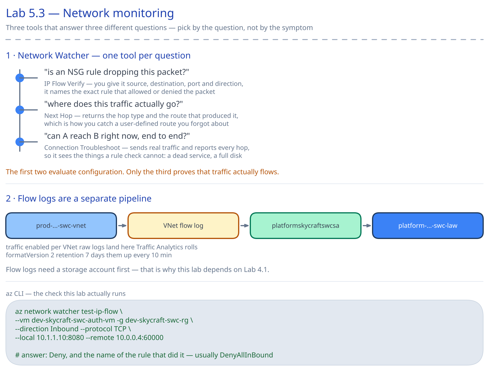

# Lab 5.3: Network Monitoring & Troubleshooting (1.5 hours)

## 🎯 Learning Objectives

By completing this lab, you will:

- Enable and configure **Azure Network Watcher**
- Use **IP Flow Verify** to identify NSG blocks
- Use **Next Hop** to troubleshoot routing issues
- Run **Connection Troubleshooter** for end-to-end connectivity checks
- Generate a **Network Topology** diagram automatically
- Enable a **VNet flow log** with **Traffic Analytics** on the production VNet
- Create a **Connection Monitor** that probes hub-to-spoke SSH continuously

---

## 🏗️ Architecture Overview

[Description]: Network Watcher is a regional service that provides tools to monitor, diagnose, and view metrics and logs for resources in an Azure virtual network.

<picture>
  <source media="(prefers-color-scheme: dark)" srcset="images/lab-5.3-architecture.dark.svg">
  <source media="(prefers-color-scheme: light)" srcset="images/lab-5.3-architecture.svg">
  
</picture>

---

## 📋 Real-World Scenario

**Situation**: Users are reporting that they cannot reach the development world server on port 8080. Khadgar suspects that a recently applied Network Security Group (NSG) rule is blocking the traffic, or perhaps a custom route is sending packets to the wrong gateway. Instead of manually inspecting dozens of rules, he needs to use Network Watcher to pinpoint the exact failure point.

**Your Task**: Use Network Watcher to verify if traffic on port 8080 is allowed to the development VM, confirm correctly routed traffic with Next Hop, and run an end-to-end connection check between the Hub and the Spoke. Then make the visibility permanent: record every flow on the production VNet with a flow log feeding Traffic Analytics, and keep a Connection Monitor probing the hub-to-spoke SSH path every five minutes so the next outage is on a dashboard before a user reports it.

---

## ⏱️ Estimated Time: 1.5 hours

- **Section 1**: Network Watcher Fundamentals (15 min)
- **Section 2**: IP Flow Verify (15 min)
- **Section 3**: Next Hop & Topology (15 min)
- **Section 4**: Connection Troubleshooter (15 min)
- **Section 5**: VNet Flow Log & Traffic Analytics (15 min)
- **Section 6**: Connection Monitor (15 min)

---

## ✅ Prerequisites

Before starting this lab:

- [ ] Completed **Lab 2.1: Virtual Networks** (`prod-skycraft-swc-vnet` is the flow log target; the dev VNet hosts the VMs)
- [ ] Completed **Lab 2.2: Secure Access** (NSGs must exist for IP Flow Verify to have rules to report)
- [ ] Completed **Lab 3.2: Virtual Machines** (`dev-skycraft-swc-auth-vm` and `dev-skycraft-swc-world-vm` must be running - the Connection Monitor needs two distinct VMs; `prod-skycraft-swc-auth-vm` is used as the source when it exists)
- [ ] Completed **Lab 4.1: Storage Accounts** (`platformskycraftswcsa` must exist for flow log storage)
- [ ] Completed **Lab 5.1: Azure Monitor** (`platform-skycraft-swc-law` Log Analytics Workspace must exist for Traffic Analytics and Connection Monitor output)
- [ ] Network Watcher `NetworkWatcher_swedencentral` in `NetworkWatcherRG` (Azure creates it with the first VNet in the region; `Deploy-Bicep.ps1` enables it if missing)

These are the same checks `scripts/Deploy-Bicep.ps1` performs before it deploys anything - the cheapest chain that satisfies them is 1.2 → 2.1 → 2.3 → 3.2 (dev) → 4.1 `-All` → 5.1 → 5.2 → 5.3.

---

## 📖 Section 1: Network Watcher Fundamentals (15 min)

### What is Network Watcher?

**Azure Network Watcher** provides tools to monitor, diagnose, view metrics, and enable or disable logs for resources in an Azure virtual network. It is designed to monitor and repair the network health of IaaS (Infrastructure-as-a-Service) products.

> [!NOTE]
> Network Watcher is enabled automatically for your subscription when you create a virtual network, but it must be enabled for the specific region (Sweden Central).

---

## 📖 Section 2: IP Flow Verify (15 min)

### Step 5.3.1: Check for NSG Blocks

1. Navigate to **Network Watcher** → **Diagnostic tools** → **IP flow verify**.
2. Select your VM: `dev-skycraft-swc-auth-vm`.
3. Configure the check:
   - Protocol: **TCP**
   - Direction: **Inbound**
   - Local port: **8080**
   - Remote IP: **8.8.8.8** (Example external IP)
   - Remote port: **443**
4. Click **Check**.

**Expected Result**: The tool returns **Access denied** or **Access allowed** and specifies the **NSG Rule** name that caused the result.

---

## 📖 Section 3: Next Hop & Topology (15 min)

### Step 5.3.2: Verify Routing

1. In Network Watcher, go to **Next hop**.
2. Select your VM: `prod-skycraft-swc-auth-vm`.
3. Source IP address: (Auto-filled).
4. Destination IP address: `1.1.1.1` (External DNS).
5. Click **Next hop**.

**Expected Result**: The tool returns **Internet** as the next hop type. If you were checking traffic between Hub and Spoke vNets, it should say **VNetPeering** or **VirtualNetwork**.

### Step 5.3.3: Visualize Topology

1. In Network Watcher, go to **Monitoring** → **Topology**.
2. Select the resource group: `dev-skycraft-swc-rg`.
3. Click **View topology**.

**Expected Result**: A visual map of your VNets, subnets, and connected VMs appears.

---

## 📖 Section 4: Connection Troubleshooter (15 min)

### Step 5.3.4: End-to-End Check

1. In Network Watcher, go to **Connection troubleshoot**.
2. **Source**:
   - Type: **Virtual Machine**
   - Resource: `prod-skycraft-swc-auth-vm` *(if Lab 3.2 prod environment was deployed)*
   - **Fallback** — if only dev environment exists: use `dev-skycraft-swc-world-vm` as source
3. **Destination**:
   - Type: **Virtual Machine**
   - Resource: `dev-skycraft-swc-auth-vm`
   - Port: **22** (SSH)
4. Click **Check**.

**Expected Result**: After a minute, the tool shows a hop-by-hop breakdown of the connection status. Source and destination must be two distinct VMs — both must have the **NetworkWatcherAgent** extension installed (the deployment script installs it automatically).

---

## 📖 Section 5: VNet Flow Log & Traffic Analytics (15 min)

### What is a VNet flow log?

The tools above answer a question you already have. A **flow log** records every flow through a virtual network - source, destination, port, protocol, allowed or denied, bytes - as JSON in a storage account, so you can answer the questions you have not asked yet. **Traffic Analytics** reads those logs into a Log Analytics workspace every 10 minutes and turns them into top talkers, blocked flows and cross-VNet traffic maps.

> [!NOTE]
> **SkyCraft Choice**: VNet flow logs, not NSG flow logs. NSG flow logs were retired for new deployments in 2025 and only see traffic that passes an NSG; a VNet flow log sees every flow in `prod-skycraft-swc-vnet`, including subnets with no NSG attached. Retention is 7 days: long enough to investigate an incident, short enough that the storage cost stays negligible.

### Step 5.3.5: Create the flow log

The flow log is a child of the regional Network Watcher `NetworkWatcher_swedencentral` in `NetworkWatcherRG`, not of the VNet, which is why it lives in that resource group.

#### Azure Portal

1. In **Network Watcher**, go to **Logs** → **Flow logs** → **+ Create**.
2. **Basics**:
   - Flow log type: **Virtual network**
   - Target resource: `prod-skycraft-swc-vnet`
   - Flow log name: `prod-skycraft-swc-vnet-flowlog`
   - Storage account: `platformskycraftswcsa`
   - Retention (days): **7**
3. **Analytics**:
   - Flow logs version: **Version 2**
   - Enable **Traffic Analytics**
   - Processing interval: **Every 10 mins**
   - Log Analytics workspace: `platform-skycraft-swc-law`
4. **Tags**: `Project = SkyCraft`, `Environment = Production`, `CostCenter = MSDN`, `Owner = <your name>`.
5. Click **Review + create** → **Create**.

#### Azure CLI

```azurecli
az network watcher flow-log create \
  --name prod-skycraft-swc-vnet-flowlog \
  --location swedencentral \
  --vnet prod-skycraft-swc-vnet \
  --resource-group prod-skycraft-swc-rg \
  --storage-account platformskycraftswcsa \
  --enabled true \
  --format JSON --log-version 2 \
  --retention 7 \
  --traffic-analytics true \
  --workspace platform-skycraft-swc-law \
  --interval 10 \
  --tags Project=SkyCraft Environment=Production CostCenter=MSDN
```

#### Azure PowerShell

```powershell
$nw   = Get-AzNetworkWatcher -Location swedencentral
$vnet = Get-AzVirtualNetwork -Name prod-skycraft-swc-vnet -ResourceGroupName prod-skycraft-swc-rg
$sa   = Get-AzStorageAccount -Name platformskycraftswcsa -ResourceGroupName platform-skycraft-swc-rg
$law  = Get-AzOperationalInsightsWorkspace -Name platform-skycraft-swc-law -ResourceGroupName platform-skycraft-swc-rg

New-AzNetworkWatcherFlowLog -NetworkWatcher $nw -Name prod-skycraft-swc-vnet-flowlog `
  -TargetResourceId $vnet.Id -StorageId $sa.Id -Enabled $true `
  -FormatType Json -FormatVersion 2 -EnableRetention $true -RetentionPolicyDays 7 `
  -EnableTrafficAnalytics -TrafficAnalyticsWorkspaceId $law.ResourceId -TrafficAnalyticsInterval 10 `
  -Tag @{ Project = 'SkyCraft'; Environment = 'Production'; CostCenter = 'MSDN' }
```

**Expected Result**: `prod-skycraft-swc-vnet-flowlog` shows **Enabled** under Flow logs with `prod-skycraft-swc-vnet` as its target. After 10-20 minutes, **Traffic Analytics** in Network Watcher shows the first flows between the hub and the spokes.

---

## 📖 Section 6: Connection Monitor (15 min)

### What is Connection Monitor?

**Connection Troubleshoot** (Section 4) is a one-off probe. **Connection Monitor** runs the same probe on a schedule from an agent on the source VM, records reachability, latency and the hop-by-hop path to a Log Analytics workspace, and can alert when checks fail. The lab creates one monitor, `skycraft-hub-spoke-cm`, that probes SSH from the hub-facing production VM to the development auth server every five minutes.

### Step 5.3.6: Create the Connection Monitor

Both endpoint VMs need the **NetworkWatcherAgent** extension; the portal offers to install it when you pick a VM endpoint, and `Deploy-Bicep.ps1` installs it before creating the monitor.

#### Azure Portal

1. In **Network Watcher**, go to **Monitoring** → **Connection monitor** → **+ Create**.
2. **Basics**:
   - Connection Monitor Name: `skycraft-hub-spoke-cm`
   - Region: **Sweden Central**
   - Workspace configuration: **Use workspace created by connection monitor** *unchecked* → select `platform-skycraft-swc-law`
3. **Test groups** → **+ Add test group**:
   - Name: `hub-spoke-ssh`
   - **Sources** → **Azure endpoints** → pick `prod-skycraft-swc-auth-vm` and name the endpoint `prod-auth-source`
     - **Fallback** — if only the dev environment exists: pick `dev-skycraft-swc-world-vm` instead (the deployment script makes the same substitution)
   - **Destinations** → **Azure endpoints** → pick `dev-skycraft-swc-auth-vm` and name the endpoint `dev-auth-destination`
   - **Test configurations** → **+ Add**: name `tcp-22-every-5m`, protocol **TCP**, destination port **22**, test frequency **Every 5 minutes**, checks failed threshold **10 %**, round-trip time threshold **100 ms**, trace route **enabled**
4. **Tags**: `Project = SkyCraft`, `Environment = Production`, `CostCenter = MSDN`, `Owner = <your name>`.
5. Click **Review + create** → **Create**.

#### Azure CLI

```azurecli
az network watcher connection-monitor create \
  --name skycraft-hub-spoke-cm \
  --location swedencentral \
  --endpoint-source-name prod-auth-source \
  --endpoint-source-resource-id $(az vm show -g prod-skycraft-swc-rg -n prod-skycraft-swc-auth-vm --query id -o tsv) \
  --endpoint-dest-name dev-auth-destination \
  --endpoint-dest-resource-id $(az vm show -g dev-skycraft-swc-rg -n dev-skycraft-swc-auth-vm --query id -o tsv) \
  --test-config-name tcp-22-every-5m \
  --protocol Tcp --tcp-port 22 --frequency 300 \
  --threshold-failed-percent 10 --threshold-round-trip-time 100 \
  --test-group-name hub-spoke-ssh \
  --workspace-ids $(az monitor log-analytics workspace show -g platform-skycraft-swc-rg -n platform-skycraft-swc-law --query id -o tsv) \
  --tags Project=SkyCraft Environment=Production CostCenter=MSDN
```

#### Azure PowerShell

```powershell
$nw  = Get-AzNetworkWatcher -Location swedencentral
$src = Get-AzVM -Name prod-skycraft-swc-auth-vm -ResourceGroupName prod-skycraft-swc-rg   # or dev-skycraft-swc-world-vm
$dst = Get-AzVM -Name dev-skycraft-swc-auth-vm  -ResourceGroupName dev-skycraft-swc-rg
$law = Get-AzOperationalInsightsWorkspace -Name platform-skycraft-swc-law -ResourceGroupName platform-skycraft-swc-rg

$srcEp = New-AzNetworkWatcherConnectionMonitorEndpointObject -Name prod-auth-source     -AzureVM -ResourceId $src.Id
$dstEp = New-AzNetworkWatcherConnectionMonitorEndpointObject -Name dev-auth-destination -AzureVM -ResourceId $dst.Id
$tcp   = New-AzNetworkWatcherConnectionMonitorProtocolConfigurationObject -TcpProtocol -Port 22
$cfg   = New-AzNetworkWatcherConnectionMonitorTestConfigurationObject -Name tcp-22-every-5m -TestFrequencySec 300 `
           -ProtocolConfiguration $tcp -ChecksFailedPercent 10 -RoundTripTimeMs 100
$grp   = New-AzNetworkWatcherConnectionMonitorTestGroupObject -Name hub-spoke-ssh -TestConfiguration $cfg -Source $srcEp -Destination $dstEp
$out   = New-AzNetworkWatcherConnectionMonitorOutputObject -WorkspaceResourceId $law.ResourceId

New-AzNetworkWatcherConnectionMonitor -NetworkWatcher $nw -Name skycraft-hub-spoke-cm -TestGroup $grp -Output $out `
  -Tag @{ Project = 'SkyCraft'; Environment = 'Production'; CostCenter = 'MSDN' }
```

**Expected Result**: `skycraft-hub-spoke-cm` appears under Connection monitor with monitoring status **Running**; within 10 minutes the `hub-spoke-ssh` test group reports **Pass** for `tcp-22-every-5m`, and `NWConnectionMonitorTestResult` in `platform-skycraft-swc-law` starts receiving rows.

**Preview - the AVM module call the Bicep path makes** (`bicep/main.bicep`; version pinned in `docs/bicep-standards.md` §4.4). Both resources of this lab are children of the Network Watcher module:

```bicep
module modNetworkWatcher 'br/public:avm/res/network/network-watcher:0.5.1' = {
  name: 'network-monitoring-deployment'
  scope: resourceGroup('NetworkWatcherRG')
  params: {
    name: 'NetworkWatcher_swedencentral'        // re-declares the auto-provisioned watcher (idempotent)
    flowLogs: [ { name: 'prod-skycraft-swc-vnet-flowlog', targetResourceId: parProdVnetResourceId, formatVersion: 2, retentionInDays: 7, workspaceResourceId: parWorkspaceResourceId, trafficAnalyticsInterval: 10, ... } ]
    connectionMonitors: [ { name: 'skycraft-hub-spoke-cm', endpoints: [...], testConfigurations: [...], testGroups: [...], workspaceResourceId: parWorkspaceResourceId } ]
  }
}
```

---

## ✅ Lab Checklist

- [ ] Network Watcher verified as active in Sweden Central
- [ ] IP Flow Verify used to check port 8080 access
- [ ] Next Hop checked for external connectivity
- [ ] VNet Topology generated and inspected
- [ ] Connection Troubleshooter used between two VMs
- [ ] Flow log `prod-skycraft-swc-vnet-flowlog` enabled on `prod-skycraft-swc-vnet` with Traffic Analytics every 10 minutes
- [ ] Connection Monitor `skycraft-hub-spoke-cm` running the `hub-spoke-ssh` test group

**For detailed verification**, see [lab-checklist-5.3.md](lab-checklist-5.3.md)

---

## 🔧 Troubleshooting

### Issue 1: "Network Watcher not enabled for region"

**Symptom**: Common error when first opening the tool.

**Solution**:

- Go to **Network Watcher** → **Regions**.
- Ensure **Sweden Central** is set to **Enabled**.

### Issue 2: Test-Lab.ps1 fails on the flow log or the Connection Monitor although the portal steps succeeded

**Symptom**: `Flow log 'prod-skycraft-swc-vnet-flowlog' exists` or `Connection Monitor 'skycraft-hub-spoke-cm' exists` reports FAIL.

**Root Cause**: The validation script looks the resources up **by name** under `NetworkWatcher_swedencentral`. A flow log or monitor created with a different name, or the monitor created with a workspace other than `platform-skycraft-swc-law`, is a different resource to the script.

**Solution**: Use the exact names from Steps 5.3.5 and 5.3.6, or run `scripts/Deploy-Bicep.ps1`, which is idempotent and produces the same resources.

### Issue 3: Connection Monitor shows "Agent not installed" on an endpoint

**Symptom**: The test group stays **Indeterminate** and the endpoint carries a warning.

**Root Cause**: Connection Monitor probes from the **NetworkWatcherAgent** VM extension; a VM created outside Lab 3.2's script does not have it.

**Solution**: Install the extension on both endpoint VMs (`az vm extension set --publisher Microsoft.Azure.NetworkWatcher --name NetworkWatcherAgentLinux ...`) or re-run `Deploy-Bicep.ps1`, which installs it before creating the monitor.

---

## 🎓 Knowledge Check

1. **When would you use IP Flow Verify instead of just looking at NSG rules?**
   <details>
     <summary>**Click to see the answer**</summary>

   **Answer**: When there are multiple NSGs applied (at both subnet and NIC levels) or complex rule sets. IP Flow Verify simulates the traffic and identifies exactly which rule is winning.
   </details>

2. **Does Network Watcher cost anything?**
   <details>
     <summary>**Click to see the answer**</summary>

   **Answer**: Most diagnostic tools (IP Flow, Next Hop) are free. Only logs (VNet flow logs, Traffic Analytics) and Packet Captures incur costs based on data volume.
   </details>

3. **Connection Troubleshoot and Connection Monitor both test `prod-skycraft-swc-auth-vm` → `dev-skycraft-swc-auth-vm` on port 22. When do you need the monitor?**
   <details>
     <summary>**Click to see the answer**</summary>

   **Answer**: Connection Troubleshoot is a single probe you run when you already suspect a problem. Connection Monitor repeats the probe every five minutes from an agent on the source VM, stores the results in Log Analytics, and can raise an alert - it catches the outage that happens at 03:00 and tells you when it started.
   </details>

4. **Why is the flow log created under `NetworkWatcherRG` rather than next to `prod-skycraft-swc-vnet` in `prod-skycraft-swc-rg`?**
   <details>
     <summary>**Click to see the answer**</summary>

   **Answer**: A flow log is a child resource of the regional Network Watcher, not of its target. Network Watcher is one Azure-provisioned instance per region, so every flow log and connection monitor in Sweden Central lives under `NetworkWatcher_swedencentral`, whichever VNet it records.
   </details>

---

## 📚 Additional Resources

- [Network Watcher Overview](https://learn.microsoft.com/en-us/azure/network-watcher/network-watcher-monitoring-overview)
- [IP Flow Verify Documentation](https://learn.microsoft.com/en-us/azure/network-watcher/network-watcher-ip-flow-verify-overview)
- [VNet Flow Logs](https://learn.microsoft.com/en-us/azure/network-watcher/vnet-flow-logs-overview)
- [Traffic Analytics](https://learn.microsoft.com/en-us/azure/network-watcher/traffic-analytics)
- [Connection Troubleshoot](https://learn.microsoft.com/en-us/azure/network-watcher/network-watcher-connectivity-overview)
- [Connection Monitor](https://learn.microsoft.com/en-us/azure/network-watcher/connection-monitor-overview)

---

## 📌 Module Navigation

[Lab 5.2 Business Continuity ←](../5.2-business-continuity/lab-guide-5.2.md) | [Back to Module 5 Index](../README.md)

---

## 📝 Lab Summary

**What You Accomplished:**

✅ Verified Network Watcher is enabled for Sweden Central
✅ Used IP Flow Verify to identify NSG rule behavior
✅ Checked routing with Next Hop diagnostic tool
✅ Generated network topology visualization
✅ Ran end-to-end Connection Troubleshooter between VMs
✅ Enabled a VNet flow log with Traffic Analytics on the production VNet
✅ Created a Connection Monitor probing hub-to-spoke SSH every 5 minutes

**Infrastructure Deployed:**

| Resource                         | Type                              | Resource Group    | Notes                                                                     |
| -------------------------------- | --------------------------------- | ----------------- | ------------------------------------------------------------------------- |
| `NetworkWatcher_swedencentral`   | Network Watcher                   | `NetworkWatcherRG` | Azure-provisioned per region; re-declared with the SkyCraft tags          |
| `prod-skycraft-swc-vnet-flowlog` | Flow log (VNet)                   | `NetworkWatcherRG` | Target `prod-skycraft-swc-vnet`, v2, 7-day retention, Traffic Analytics 10 min |
| `skycraft-hub-spoke-cm`          | Connection Monitor                | `NetworkWatcherRG` | `hub-spoke-ssh` → `tcp-22-every-5m`, output to `platform-skycraft-swc-law` |
| NetworkWatcherAgent              | VM extension on both endpoint VMs | `dev-skycraft-swc-rg` / `prod-skycraft-swc-rg` | Installed by `Deploy-Bicep.ps1`; removed by `Remove-LabResource.ps1` |

**Time Spent**: ~1.5 hours

**Congratulations!** You have completed Module 5: Monitor and Maintain Azure Resources.
