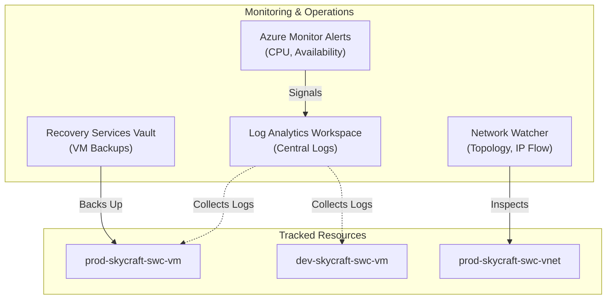

# Module 5: Monitor and Maintain Azure Resources

## 📖 Overview

This module focuses on the operational excellence of the SkyCraft platform. You will learn how to monitor infrastructure health, configure alerts, and ensure business continuity through backup and disaster recovery strategies. This module covers approximately **10-15%** of the AZ-104 exam.

## 🎯 Learning Objectives

By the end of this module, you will be able to:

- Configure **Azure Monitor** (Log Analytics, Metrics, Alerts)
- Implement **VM Insights** for health monitoring
- Create and manage **Log Analytics Workspaces**
- Configure **Azure Backup** and Recovery Services Vaults
- Use **Network Watcher** for troubleshooting network connectivity
- Interpret and create **Azure Dashboards**

---

## 🧪 Labs

| Lab     | Title                                                                                   | Description                                                  | Estimated Time |
| :------ | :-------------------------------------------------------------------------------------- | :----------------------------------------------------------- | :------------- |
| **5.1** | **[Azure Monitor and Insights](5.1-azure-monitor/lab-guide-5.1.md)**                    | Deploy Log Analytics and configure VM monitoring and alerts. | 1.5 Hours      |
| **5.2** | **[Business Continuity & Disaster Recovery](5.2-business-continuity/lab-guide-5.2.md)** | Implement Azure Backup for virtual machines.                 | 1.5 Hours      |
| **5.3** | **[Network Monitoring & Troubleshooting](5.3-network-monitoring/lab-guide-5.3.md)**     | Use Network Watcher to solve connectivity issues.            | 1 Hour         |

---

## 🏗️ Module Architecture

---

## 📌 Prerequisites

Before starting this module, you should have:

- [ ] Completed Modules 1-4 (Identity, Networking, Compute, Storage)
- [ ] Active Virtual Machines running in Dev or Prod
- [ ] Contributor permissions on the SkyCraft subscription

---

[← Back to Main README](../README.MD)
