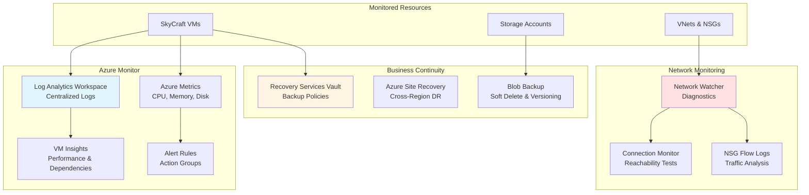

# Module 5: Monitor and Maintain Azure Resources (5 hours)

## 📚 Module Overview

In this module, you'll implement **production monitoring and business continuity** for the SkyCraft deployment. With all infrastructure in place from Modules 1-4, you'll configure Azure Monitor for comprehensive observability, set up backup and disaster recovery, and implement network monitoring to keep your game servers healthy and resilient.

**Real-world Context**: Deploying infrastructure is only half the battle—keeping it running, diagnosing issues quickly, and recovering from failures is what separates production-ready infrastructure from lab experiments. This module ensures your SkyCraft deployment is truly enterprise-grade.

---

## 🎯 Learning Objectives

By completing this module, you will be able to:

- **Configure Azure Monitor** with metrics, logs, and alerts for proactive monitoring
- **Write KQL queries** to analyze VM performance, application logs, and network data
- **Set up alert rules** with action groups for automated notifications
- **Create Recovery Services vaults** and configure backup policies
- **Perform backup and restore** operations using Azure Backup
- **Configure Azure Site Recovery** for cross-region disaster recovery
- **Use Network Watcher** and Connection Monitor to diagnose network issues

---

## 📋 Module Sections

| Lab | Duration | Topic                                | Exam Weight |
| --- | -------- | ------------------------------------ | ----------- |
| 5.1 | 2 hours  | Monitor Resources with Azure Monitor | ~4-6%       |
| 5.2 | 2 hours  | Implement Backup and Recovery        | ~4-6%       |
| 5.3 | 1 hour   | Network Monitoring and Diagnostics   | ~2-3%       |

**Total Module Time**: 5 hours

---

## 🏗️ Architecture Overview

This module adds the monitoring and recovery layer across your entire SkyCraft infrastructure:

```mermaid
graph TB
    subgraph "Azure Monitor"
        LAW[Log Analytics Workspace<br/>Centralized Logs]
        Metrics[Azure Metrics<br/>CPU, Memory, Disk]
        Alerts[Alert Rules<br/>Action Groups]
        VMInsights[VM Insights<br/>Performance & Dependencies]
    end

    subgraph "Business Continuity"
        RSV[Recovery Services Vault<br/>Backup Policies]
        ASR[Azure Site Recovery<br/>Cross-Region DR]
        BlobBackup[Blob Backup<br/>Soft Delete & Versioning]
    end

    subgraph "Network Monitoring"
        NW[Network Watcher<br/>Diagnostics]
        ConnMon[Connection Monitor<br/>Reachability Tests]
        FlowLogs[NSG Flow Logs<br/>Traffic Analysis]
    end

    subgraph "Monitored Resources"
        VMs[SkyCraft VMs]
        Storage[Storage Accounts]
        Network[VNets & NSGs]
    end

    VMs --> LAW
    VMs --> Metrics
    VMs --> RSV
    Storage --> BlobBackup
    Network --> NW
    Metrics --> Alerts
    LAW --> VMInsights
    NW --> ConnMon
    NW --> FlowLogs

    style LAW fill:#e1f5ff
    style RSV fill:#fff4e1
    style NW fill:#ffe1e1
```

---

## ✅ Prerequisites

Before starting, ensure you have:

- [ ] Completed Modules 1-4 (Identity, Networking, Compute, Storage deployed)
- [ ] Active Azure subscription with Owner or Contributor role
- [ ] Azure CLI installed locally
- [ ] PowerShell 7+ installed
- [ ] Basic understanding of KQL (Kusto Query Language)

**Verify Module 4 completion**:

- Storage accounts deployed across dev, prod, and platform environments
- Blob containers and Azure File shares configured
- Storage security (firewalls, SAS, RBAC) in place

---

## 🚀 Getting Started

1. **Review the architecture** diagram above to understand monitoring topology
2. **Start with Lab 5.1** - Configure Azure Monitor, metrics, logs, and alerts
3. **Progress to Lab 5.2** - Set up backup vaults, policies, and disaster recovery
4. **Complete Lab 5.3** - Implement network monitoring and diagnostics
5. **Take the module assessment** to validate learning
6. **Proceed to Capstone** - Full SkyCraft deployment from scratch

---

## 📖 How to Use This Module

Each lab includes:

- **Lab Guide** - Step-by-step instructions with architecture diagrams
- **Lab Checklist** - Verification steps to confirm success
- **Bicep Templates** - Infrastructure as Code for monitoring resources
- **Scripts** - PowerShell and KQL query scripts
- **Solutions** - Expected configurations and CLI commands

**Recommended approach**:

1. Study the architecture diagram in each lab guide
2. Follow manual steps in Azure Portal first (learn the UI)
3. Write and test KQL queries in Log Analytics
4. Automate alert rules and backup policies with scripts
5. Verify each step using the checklist

---

## 🎓 AZ-104 Exam Alignment

This module covers **10-15%** of the AZ-104 exam. Key exam topics include:

- Interpreting metrics in Azure Monitor
- Configuring log settings in Azure Monitor
- Querying and analyzing logs using KQL
- Setting up alert rules, action groups, and alert processing rules
- Configuring monitoring of VMs, storage, and networks using Azure Monitor Insights
- Using Azure Network Watcher and Connection Monitor
- Creating Recovery Services vaults and Backup vaults
- Creating and configuring backup policies
- Performing backup and restore operations
- Configuring Azure Site Recovery for Azure resources
- Performing failover to a secondary region

---

## ⏱️ Time Management

- **Total module time**: 5 hours
- **Recommended pace**: 2.5 hours per day for 2 days
- **Lab 5.1**: 2 hours (Azure Monitor setup, KQL queries, alerts)
- **Lab 5.2**: 2 hours (backup vaults, policies, Site Recovery)
- **Lab 5.3**: 1 hour (Network Watcher, Connection Monitor)

---

## 🔗 Useful Resources

- [Azure Monitor Documentation](https://learn.microsoft.com/en-us/azure/azure-monitor/)
- [KQL Quick Reference](https://learn.microsoft.com/en-us/azure/data-explorer/kusto/query/kql-quick-reference)
- [Azure Backup Documentation](https://learn.microsoft.com/en-us/azure/backup/)
- [Azure Site Recovery](https://learn.microsoft.com/en-us/azure/site-recovery/)
- [Network Watcher Documentation](https://learn.microsoft.com/en-us/azure/network-watcher/)
- [VM Insights Overview](https://learn.microsoft.com/en-us/azure/azure-monitor/vm/vminsights-overview)

---

## 📞 Getting Help

- **Lab issues**: Check troubleshooting sections in each lab's solutions folder
- **Azure errors**: Search Azure documentation or Microsoft Learn
- **KQL queries**: Use the [KQL playground](https://aka.ms/LADemo) for testing

---

## ✨ What's Next After This Module?

Once complete, you'll have:

- ✅ Comprehensive monitoring with Azure Monitor and VM Insights
- ✅ Automated alerting for critical infrastructure events
- ✅ Backup and disaster recovery for all SkyCraft resources
- ✅ Network diagnostics and flow log analysis capability

**Next Step**: Capstone Project - Full AzerothCore deployment from scratch using all skills learned

---

## 📌 Module Navigation

- [← Back to Course Home](../README.MD)
- [Lab 5.1: Azure Monitor →](./5.1-azure-monitor/lab-guide-5.1.md)
- [Lab 5.2: Business Continuity →](./5.2-business-continuity/lab-guide-5.2.md)
- [Lab 5.3: Network Monitoring →](./5.3-network-monitoring/lab-guide-5.3.md)
