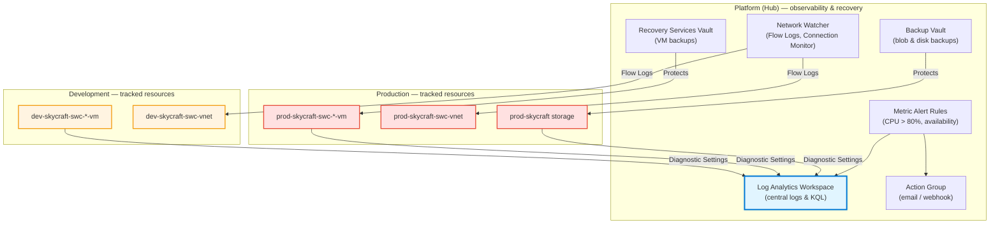

# Module 5: Monitor and Maintain Azure Resources (5 hours)

## 📚 Module Overview

In this module, you'll bring operational excellence to the SkyCraft platform. Building on the infrastructure deployed in Modules 1–4, you'll centralise logs with **Azure Monitor** and **Log Analytics**, configure metric alerts and action groups, implement backup and disaster recovery with **Recovery Services / Backup Vaults**, and diagnose runtime network issues with **Network Watcher**.

**Real-world Context**: A live game platform is only as good as its ability to detect and recover from failure. Production MMOs need proactive alerting on VM health, blob storage, and network connectivity — and they need tested, automated backups so that an outage or ransomware event can be contained rather than fatal. This module gives SkyCraft that safety net.

---

## 🎯 Learning Objectives

By completing this module, you will be able to:

- **Configure** Azure Monitor with Log Analytics workspaces, diagnostic settings, and data collection rules
- **Query** VM, storage, and network logs using Kusto Query Language (KQL)
- **Create** metric alerts, action groups, and alert processing rules tied to SkyCraft thresholds
- **Interpret** VM Insights dashboards to spot CPU, memory, and connection problems
- **Deploy** Recovery Services Vaults and Backup Vaults with environment-appropriate policies
- **Perform** backup, restore, and cross-region failover drills for the SkyCraft platform
- **Use** Network Watcher (Connection Monitor, NSG Flow Logs, IP flow verify) to troubleshoot connectivity

---

## 📋 Module Sections

| Lab     | Duration | Topic                                  | Exam Weight |
| ------- | -------- | -------------------------------------- | ----------- |
| **5.1** | 2 hours  | Azure Monitor & Insights               | ~5-6%       |
| **5.2** | 2 hours  | Business Continuity & Backup           | ~3-5%       |
| **5.3** | 1 hour   | Network Monitoring & Troubleshooting   | ~2-3%       |

**Total Module Time**: 5 hours

---

## 🏗️ Architecture Overview

This module layers observability and recovery on top of the existing SkyCraft infrastructure. The Platform resource group hosts all shared telemetry and backup services; Dev and Prod send signals to the Platform hub.



---

## ✅ Prerequisites

Before starting, ensure you have:

- [ ] Completed **Modules 1–4** (identity, networking, compute, storage)
- [ ] At least one running VM in `dev-skycraft-swc-rg` or `prod-skycraft-swc-rg`
- [ ] Production storage account deployed in `prod-skycraft-swc-rg`
- [ ] Azure CLI `>= 2.40` and Bicep CLI installed locally
- [ ] PowerShell 7+ and the `Az` module (`Install-Module Az -Scope CurrentUser`)
- [ ] **Contributor** role on the SkyCraft subscription (required for diagnostic settings + backup policies)

**Verify Module 4 completion** — these names will be referenced by diagnostic settings in Lab 5.1:

```bash
az vm list --query "[?starts_with(name, 'prod-skycraft')].name" -o tsv
az storage account list --query "[?starts_with(name, 'prodskycraft')].name" -o tsv
az network vnet list --query "[?starts_with(name, 'prod-skycraft')].name" -o tsv
```

---

## 🚀 Getting Started

1. Verify all prerequisites above return the expected resources.
2. Open **Lab 5.1** and deploy the Log Analytics Workspace + Data Collection Rule first — later labs depend on it.
3. Complete labs **in order (5.1 → 5.2 → 5.3)** — `Deploy-Bicep.ps1` in each lab assumes the previous lab's outputs.
4. Run `.\Test-Lab.ps1` after each deployment to validate the resources before moving on.
5. Use `.\Remove-LabResource.ps1` between attempts if you want to redeploy cleanly.

---

## 📖 How to Use This Module

Each lab includes:

- **Lab Guide** (`lab-guide-5.X.md`) — concepts, Mermaid diagram, and multi-modal (Portal + CLI + PowerShell) step-by-step
- **Lab Checklist** (`lab-checklist-5.X.md`) — verification-only checkboxes and validation commands
- **Bicep Templates** (`bicep/`) — Infrastructure as Code for the lab's resources
- **Automation Scripts** (`scripts/`) — `Deploy-Bicep.ps1`, `Test-Lab.ps1`, `Remove-LabResource.ps1`, plus lab-specific helpers

**Recommended approach**:

1. Read the **Deep Dive** concept block in the lab guide before clicking anything.
2. Deploy via Bicep first (`Deploy-Bicep.ps1`) to see the end state.
3. Repeat the key steps manually in the Azure Portal to practice the exam UX.
4. Write the KQL queries and alert rules by hand — AZ-104 tests them directly.
5. Tick the checklist items in order; run `Test-Lab.ps1` for machine-verifiable steps.

---

## 🎓 AZ-104 Exam Alignment

This module covers **10-15%** of the AZ-104 exam. Key topics include:

- Interpreting metrics in Azure Monitor (CPU, memory, disk, network)
- Configuring log settings, diagnostic settings, and data collection rules
- Writing and running **KQL** queries against Log Analytics
- Creating **alert rules**, **action groups**, and **alert processing rules**
- Configuring and interpreting **VM Insights** and Storage Insights
- Creating a **Recovery Services Vault** and an **Azure Backup Vault**
- Authoring **backup policies** (daily / weekly, short-term retention)
- Performing **backup and restore** operations for IaaS VMs
- Configuring **Azure Site Recovery** for cross-region failover
- Using **Azure Network Watcher** — Connection Monitor, NSG Flow Logs, IP Flow Verify, Next Hop

---

## ⏱️ Time Management

- **Total module time**: 5 hours
- **Recommended pace**: one lab per session; total of three sessions
- **Lab 5.1** — 2 hours (Log Analytics, diagnostic settings, KQL, first alert)
- **Lab 5.2** — 2 hours (Recovery Services Vault + Backup Vault, policies, restore drill)
- **Lab 5.3** — 1 hour (Network Watcher: Flow Logs + Connection Monitor)

> **Pacing tip**: budget an extra 30 minutes in Lab 5.2 the first time through — backup jobs take several minutes to complete and you'll want to watch the first one end-to-end.

---

## 🔗 Useful Resources

- [Azure Monitor overview](https://learn.microsoft.com/en-us/azure/azure-monitor/overview)
- [Log Analytics workspaces](https://learn.microsoft.com/en-us/azure/azure-monitor/logs/log-analytics-workspace-overview)
- [KQL quick reference](https://learn.microsoft.com/en-us/azure/data-explorer/kql-quick-reference)
- [Azure Backup documentation](https://learn.microsoft.com/en-us/azure/backup/)
- [Network Watcher documentation](https://learn.microsoft.com/en-us/azure/network-watcher/)
- [Azure Site Recovery](https://learn.microsoft.com/en-us/azure/site-recovery/)

---

## 📞 Getting Help

- **Lab failures**: start with `Test-Lab.ps1` output; most issues surface as a missing RG or VM.
- **Backup "UpdatePolicyNotSupported"**: see `docs/bicep-standards.md` §9.4 — policies must be created via PowerShell, not Bicep (this is handled by the Lab 5.2 deployment script).
- **RSV "redundancy locked"**: see `docs/bicep-standards.md` §9.5 — redundancy is set via `az backup vault backup-properties set`, guarded by an idempotency check.
- **KQL not returning data**: diagnostic settings take up to 15 minutes to start flowing on first deploy.

---

## ✨ What's Next After This Module?

Once complete, you'll have:

- ✅ Centralised logs for every production VM, VNet, and storage account
- ✅ At least one working metric alert with a notification path
- ✅ A tested VM backup + restore cycle in the Recovery Services Vault
- ✅ NSG Flow Logs streaming and a Connection Monitor watching hub → spoke reachability

**You have reached the end of the SkyCraft course.** Next step: the **Capstone** — deploy the full SkyCraft platform from scratch against a blank subscription using only the Bicep and PowerShell you've written, and use this module's monitoring to prove the end state is healthy.

---

## 📌 Module Navigation

- [← Back to Course Home](../README.md)
- [← Previous: Module 4 — Storage](../module-4-storage/README.md)
- [Lab 5.1: Azure Monitor & Insights →](./5.1-azure-monitor/lab-guide-5.1.md)
- [Lab 5.2: Business Continuity & Backup →](./5.2-business-continuity/lab-guide-5.2.md)
- [Lab 5.3: Network Monitoring & Troubleshooting →](./5.3-network-monitoring/lab-guide-5.3.md)
